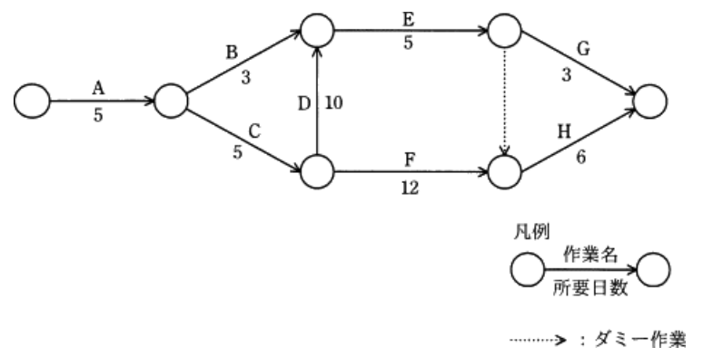
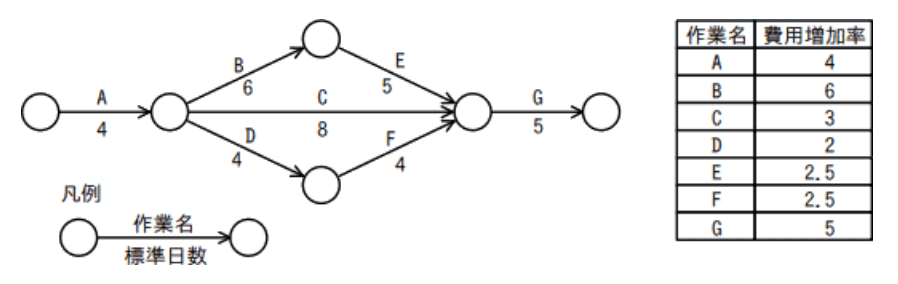
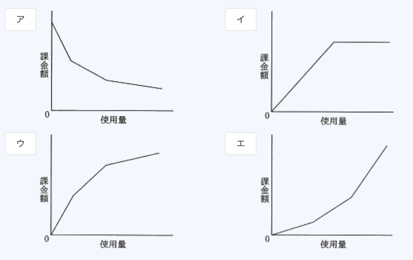
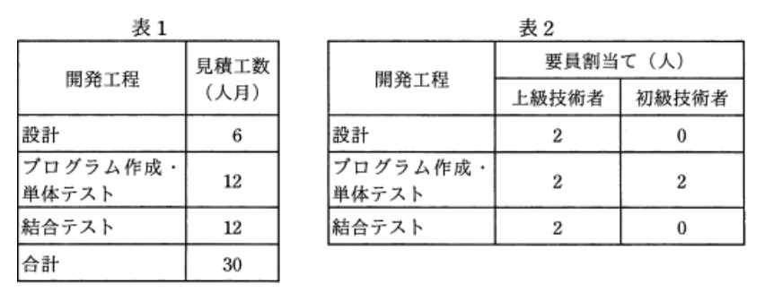
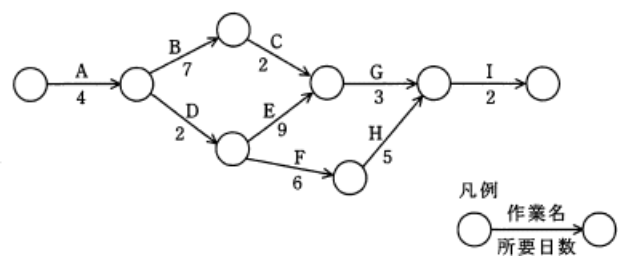
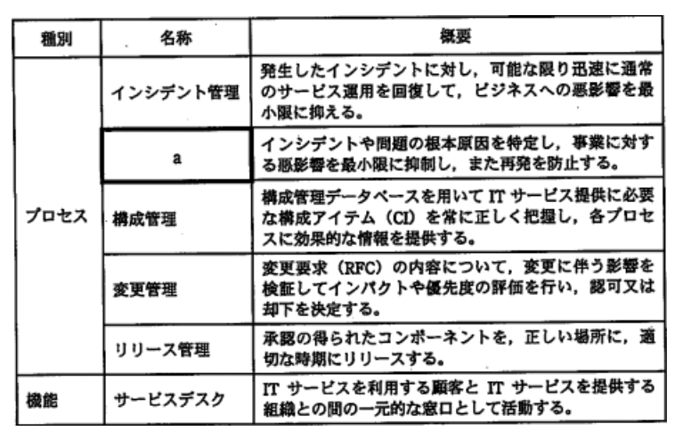

### ランダム マネジメント系

---
ITサービスマネジメントにおける問題管理プロセスにおいて実施すること

- A.**インシデントの発生後に未知の根本原因を特定し、恒久的な解決策を策定する**  
・インシデントの根本原因と潜在的な予防処置を特定する  
・問題解決のための変更要求を提起する  
・サービスへの影響を低減・除去するための処置を特定する  
・既知の誤りを記録する

- インシデントの発生後に暫定的にサービスを復旧させ、業務を継続できるようにする  
インシデント管理プロセスの役割

- インシデントの発生に備えて、復旧のための設計をする  
ITサービス脆弱性管理プロセスの役割

- インシデントの発生を記録し、関係する部署に状況を連絡する  
サービスデスクの役割

---
システム運用管理における管理情報の取り扱い

- A.**管理は少人数の管理者グループで行う。管理用アカウントは、個々の管理者専用のものを使用する。管理情報は、セキュリティレベルなどを考慮した上で一般ユーザへの公開を行う**

- 管理は少人数の管理者グループで行う。管理用アカウントは、グループ専用のものを共用する。管理情報は、一般ユーザに公開し、ユーザ自身がチェックできるようにする  
管理者アカウントを共有すると、行われた操作がどの管理者によるものか判断できず、不正の温床となる可能性がある。管理情報のセキュリティについても考慮していない

- 管理は少人数の管理者グループで行う。管理用アカウントは、グループ専用のものを共用する。管理情報は、セキュリティレベルなどを考慮した上で一般ユーザへの公開を行う  
管理者アカウントを共有すると、行われた操作がどの管理者によるものか判断できず、不正の温床となる可能性がある

- 管理は1人の管理者で行う。管理情報は、セキュリティレベルなどを考慮した上で一般ユーザへの公開を行う  
監視・牽制を行う人がいない1人での管理では不正の可能性が大きくなる

---
情報システム部が開発して経理部が運用している会計システムの運用状況を、経営者からの指示で監査することになった。この場合におけるシステム監査人についての記述のうち、最も適切なもの

- A.**独立性を担保するために、システム監査人は情報システム部にも経理部にも所属しない者とする**  
システム監査人には監査対象部門と身分的・精神的に利害関係がない者を任命し、客観的な視点から公平・公正な判断を行えるようにしなければならない

- 会計システムは企業会計に関する各種基準に準拠すべきなので、システム監査人を公認会計士とする  
会計監査ではなく、会計システムの運用状況の監査なので公認会計士とする必要はない

- 会計システムは機密性の高い情報を扱うので、システム監査人は経理部長直属とする  
経理部長の直属では、経理部が運用しているシステムの監査を公平に行えない可能性がある。監査人は客観的な評価者としての立場を堅持しなくてはならない

- システム監査を効率的に行うために、システム監査人は情報システム部長直属とする  
情報システム部長の直属では、情報システム部が開発したシステムの監査を公平に行えない可能性がある。監査人は監査対象部門から独立していなければならない

---
システムの移行テストを実施する主要な目的

- A.**確実性や効率性の観点で、既存システムから新システムへの切替え手順や切替えに伴う問題点を確認する**  
運用テストを終えた新システムを稼働環境に展開する際に、一連の作業内容や作業手順の把握、移行に伴う問題点とそれに対する慈善策の確認のために実施される

- 既存システムのDBのコピーを利用して、新システムでも十分な性能が得られることを確認する  
性能テストの説明

- 既存のプログラムと新たに開発したプログラムとのインタフェースの整合性を確認する  
システム結合テストの説明

- 新システムが要求されたすべての機能を満たしていることを確認する  
機能テストの説明

---
システム監査基準(平成30年)におけるウォークスルー法の説明

- A.**データの生成から入力、処理、出力、活用までのプロセス、及び組み込まれているコントロールを、システム監査人が、書面上で、又は実際に追跡する**

- あらかじめシステム監査人が準備したテスト用データを監査対象プログラムで処理し、期待した結果が出力されるかどうかを確かめる  
コンピュータ支援監査技法の1つのテストデータ法の説明

- 監査対象の実態を確かめるために、システム監査人が、直接、関係者に口頭で問い合わせ、回答を入手する  
インタビュー法の説明

- 監査対象の状況に関する監査証拠を入手するために、システム監査人が、関連する資料及び文書類を入手し、内容を点検する  
ドキュメントレビュー法の説明

---
経済産業省の"営業秘密管理指針"に基づく営業秘密データの管理状況について監査を行う時、秘密管理性のチェックポイント

- A.**当該データの記録媒体に秘密を意味する表示をしていること**  
`秘密管理性`のチェックポイント。情報に客観的に秘密として管理していると認識できる状態にあることが必要。情報にアクセスできる者を特定できる・情報にアクセスした者が秘密であると認識できるという2つが要件。営業秘密は、この3要件を満たす情報と規定されている

- 当該データの内容が刊行物に掲載されていないかを定期的に確認していること  
`非公知性`のチェックポイント。保有者の管理下以外では一般に入手できないことが必要である

- 当該データが経営効率の改善に役立っているかどうかを分析していること
- 当該データの内容が公序良俗に反していないかを確認していること  
`有用性`のチェックポイント。情報が客観的に有用であることが必要である。企業の反社会的な行為などの公庁良俗に反する内容の情報は有用性が認められない

---
PMBOKによれば、プロジェクトのリスクマネジメントにおいて、脅威に対して適用できる対応戦略と好機に対して適用できる対応戦略がある。脅威に対して適用できる対応戦略

- A.**受容**  
リスクが現実化した時の影響許容範囲内である場合やリスクの除去が困難である時に、特に対策をせずそのままにする戦略。対策費用が予想される損失金額を上回る時などに採られる。脅威への対応には、他にも回避(リスク除去)・転嫁(影響の移転)・軽減(影響範囲・発生確率の低減)がある

- 活用  
好機が確実に到来するように、潜在化の不確実性を取り除くための戦略

- 強化  
好機のプラスの影響を増加させたり発生確率を高めたりする戦略

- 共有  
好機を得られる能力の高い第三者にプロジェクトの実行権限の一部(全部)を与える戦略

---
ITサービスマネジメントにおける問題管理で実施する活動のうち、事前予防的な活動

- A.**インシデントの発生傾向を分析して、将来のインシデントを予防する方策を提案する**  
インシデントや障害原因の把握と管理を行い、根本原因を究明して、回避策や恒久的な対策を策定するプロセス。問題管理では、発生したインシデントに対して自己活動を行うほか、将来起こるかもしれないインシデントを推測し、予防する活動も行う(*proactive*(率先した、積極的な)な活動)

---
ITILによれば、サービスデスク組織の特徴のうち、バーチャル・サービスデスクのもの

- A.**サービスデスク・スタッフは複数の地域に分散しているが、通信技術を利用することによって、利用者からは単一のサービスデスクのように見える**  
`バーチャルサービスデスク` : 実際には各地に分散しているが連携することで擬似的に1組織として機能を提供するサービスデスク  
`フォロー・ザ・サン` : 2つ以上の異なる(大陸の)拠点に配置され、中央での統括管理によって24365のサービスを提供するサービスデスク

- 専任のサービスデスク・スタッフは置かず、研究や開発、営業などの業務の担当者が兼任で運営する  
擬似的なサービスデスクスタッフが対応するという意味でのバーチャルではない

- 費用対効果の向上やコミュニケーション効率の向上を目的として、サービスデスク・スタッフを単一又は少数の場所に集中させる  
`中央サービスデスク` : 1箇所の拠点に全てのユーザからの問い合わせに対応する体制のサービスデスク。運営コストを低く抑えることができ情報管理がしやすい

- 利用者の拠点と同じ場所か、物理的に近い場所に存在している  
`ローカルサービスデスク` : ユーザのローカルサイト内、地理的に近い場所に設置されたサービスデスク。担当者の直接派遣が容易でユーザの問題や改善点を把握しやすい

---
システム監査実施体制のうち、システム監査人の独立性の観点から避けるべきもの

- A.**監査チームメンバーに任命された総務部のAさんが、ほかのメンバーと一緒に、総務部の入退室管理の状況を監査する**  
総務部に所属しているAさんが、自身の部署の監査を行うため、監査業務の客観性・独立性が保障されない  
`外観上の独立性` : システム監査人は、システム監査を客観的に実施するために、監査対象から独立していなければならない。監査の目的によっては、被監査主体と身分上、密接な利害関係を有することがあってはならない  
`精神上の独立性` : システム監査人は、システム監査の実施に当たり、偏向を排し、常に公正かつ客観的に監査判断を行わなければならない  
`職業倫理と誠実性` : システム監査人は、職業倫理に従い、誠実に業務を実施しなければならない

---
アクセス制御を監査するシステム監査人の行為

- A.**データに関するアクセス制御の管理規程を閲覧した**  
システム監査では客観的な立場であるシステム監査人が情報システムを総合的に評価し、助言・勧告・改善活動のフォローアップまで行う。システム監査結果の改善提案等に基づき、被監査側が主体となって改善活動を実施する。改善状況をモニタリングして適切な措置が適時に講じられていることを確認することが役割

- ソフトウェアに関するアクセス制御の管理台帳を作成し、保管した
- ネットワークに関するアクセス制御の管理方針を制定した
- ハードウェアに関するアクセス制御の運用手続を実施した  
システム監査人自身が主体的に改善活動を行うことはない

---
スプレッドシートの処理ロジックの正確性に関わるコントロールを監査する際のチェックポイント

- A.**スプレッドシートのプログラムの内容が文書化され検証されていること**  
プログラムの内容が文書化され、処理の完全性・正確性・正当性が確保されているかがチェックポイントとなる

- スプレッドシートの作成者と利用者が同一であること  
作成者と利用者が同一の場合、第三者が検証していないと不正な計算式の誤り等が見逃されるリスクがある。作成者と利用者を分けるなどの規則・仕組み・チェック体制を整備することが有効

- スプレッドシートのバックアップが行われていること  
データの消失を防ぐためのコントロール

- スプレッドシートの利用者が定められていること  
利用時の職務権限、利用権限を定めるのは、データ改竄や消失を防ぐためのコントロール

---
複数のシステム間でのデータ連携において、送信側システムで集計した送信データの件数の合計と、受信側システムで集計した受信データの件数の合計を照合して確認するためのコントロール

- A.**コントロールトータルチェック**  
入力された数値の合計と出力される数値の合計を都度照合することでデータ処理の完全性を高める機能

- アクセスコントロール  
参照可能な資源・許可する操作を、利用者の属性ごとに適切に制御することで機密性を高める機能

- エディットバリデーションチェック  
入力された値が、範囲内に収まっているか、論理的に正しいか、決められたフォーマットか、などシステムが予定されている形式か確認することで入力値の正確性を高める機能

- チェックディジット  
元の符号から規則によって算出された数字を元の符号に付加することで、符号の入力誤りなどを検出する方法

---
A社では、自然災害などの際の事業継続を目的として、業務システムのDBのバックアップを取得している。その状況について、"情報セキュリティ管理基準(平成28年)"に従って実施した監査結果として判明した状況のうち、監査人が指摘事項として監査報告書に記載すべきもの

- A.**バックアップを取得した電子記録媒体を、業務システムが稼働しているサーバの近くで保管していた**  
火災や自然災害などの被害を受けた時、バックアップも同時に破損してしまう可能性がある。1つをサーバの近くで保管したいのであれば、同じバックアップをもう1つ用意し遠隔地で保管する必要がある

- バックアップ取得手順書を作成し、取得担当者を定めていた  
バックアップ情報の正確・完全な記録・文書化したデータ復旧手順書を作成する必要がある

- バックアップを取得した電子記録媒体からDBを復旧する試験を、事前に定めたスケジュールに従って実施していた  
バックアップに用いる媒体は、必要時の緊急利用について信頼できることを確実にするために、定めに従って試験する

- バックアップを取得した電子記録媒体を、機密保持を含む契約を取り交わした外部の倉庫会社に委託保管していた  
外部業者の保管サービスを利用する場合、機密保持契約を締結する必要がある

---
システム開発の進捗管理などに用いられるトレンドチャートの説明

- A.**作業の進捗状況と、予算の消費状況を関連づけて折れ線グラフで示したもの**  
計画の予算・工期・実績の費用・進捗を表す2本の折れ線グラフを並べたグラフで、差異の把握や傾向(トレンド)の分析に用いられる

- 作業に関与する人と責任をマトリクス状に示したもの  
責任分担票の説明

- 作業日程の計画と実績を対比できるように帯状に示したもの  
ガントチャートの説明

- 作業の順序や相互関係をネットワーク状に示したもの  
アローダイアグラムやプレシデンスダイアグラムの説明

---
CIO(*Chief Information Officer*)が経営から求められる役割

- A.**ビジネス価値を最大化させるITサービス活用の促進**  
経営戦略に沿った情報戦略やIT投資計画に関する責任を持つ役職である最高情報責任者。CEO(最高経営責任者)やCOO(最高執行責任者)を補佐し、企業の情報戦略の策定に当たるのが主な職務

- 起業経理のための財務戦略の立案と遂行  
CFO(*Chief Financial Officer* : 最高財務責任者)に求められる役割

- 企業の研究開発方針の立案と実施  
CTO(*Chief Technology Officer* : 最高技術責任者)に求められる役割

- 企業の法令遵守の体制の構築と運用  
CLO(*Chief Legal Officer* : 最高法務責任者)に求められる役割

---
経営者が社内のシステム監査人の外観上の独立性を担保するために講じる措置

- A.**システム監査人の所属部署を内部監査部門とする**  
組織体に内部監査部門が設置されている場合、当該部門がシステム監査を実施することが望ましい。監査対象から独立した立場で実施されているという外観が確保される必要がある  
`外観上の独立性` : システム監査人は、監査対象の領域又は活動から、独立かつ客観的な立場で監査が実施されているという外観に配慮しなければならない  
`精神上の独立性` : システム監査人は、監査の実施に当たり、客観的な視点から公正な判断を行わなければならない

- システム監査人に必要な知識や経験を定めて公表する  
目的、権限と責任を明確に定めるための措置

- システム監査人にITに関する継続的学習を義務付ける
- システム監査人の監査技法研修制度を設ける  
専門能力を高めるための措置

---
ITサービスマネジメントの管理プロセス

- A.**サービスレベル管理**  
サービス提供者と利用顧客の間で合意したサービスレベルを維持管理するためのプロセス。安定したITサービスを提供するためにSLAやSLMを実施し、運用状況を管理する役割を持っている  
`SLA`(*Service Level Agreement*) : 提供者と顧客の間でサービス品質に関して結ぶ契約のことで、サービスの品目と水準、水準未達時のペナルティ事項などが盛り込まれる  
`SLM`(*Service Level Management*) : サービスレベル合意書に基づき、顧客要件を満たすITサービスの提供を実現し、品質の継続的な改善に必要なプロセスを構築する管理手法や考え方

---
3PL(*3rd Party Logistics*)の説明

- A.**物流業務に加え、流通加工なども含めたアウトソーシングサービスを行い、荷主企業の物流企画も代行する**  
企業の物流の全部(一部)を第三者企業が受託することで実現する物流業務形態の1つ。荷主側からでは物流のための設備や資源を整備する必要がなく、外部の資源を有効利用して効率的な物流が期待できる。3PL事業者とすれば、既に自社で保有している資源を外部の企業に解放することで少ない投資で増益を期待できる

- 購買、生産、販売、物流の一連の業務を、企業間で全体最適の視点から見直し、納期短縮や在庫削減を図る  
SCM(*Supply Chain Management*)の説明

- 資材の調達から生産、保管、販売に至るまでの物流全体を、費用対効果が最適になるように総合的に管理し、合理化する  
物流管理システムの説明

- 電子・電機メーカから、製品の設計や資材の調達、生産、物流、修理を一括して受託する  
EMS(*Electronics Manufacturing Service*)の説明

---
EMS(*Electronics Manufacturing Service*)の説明

- A.**他メーカから受注した電子機器などの受託生産を行う**  
製造企業が個別の製品ごとにラインを設置するのは非効率なため外部の専門業者に委託(アウトソーシング)するようになり発達した業務形態

- 一般消費者からの家電製品に関する問い合わせの受付窓口となって電話対応を行う  
コールセンターの説明

- 製造設備をもたず、製品の企画・設計・開発を行う  
ファブレス(*fabless*)の説明

- 他メーカから仕入れた電子機器などの販売を専門に行う  
ベンダ(*vendor*)の説明

---
系統図法に関する説明

- A.**目的・目標を達成するための手段・方策を順次展開し、最適手段・方策を追求していく方法である**  
目的を達成する手段を見つける時に、目的 - 手段の連鎖を段階的に下位に掘り下げていくことにより、最適な手段を見いだす図法

- 事態の進展とともに色々な結果が想定される問題について、望ましい結果に至るプロセスを定める方法である  
PDPC法の説明

- 複雑な要因の絡み合う事象について、その事象間の因果関係を明らかにする方法である  
連関図法の説明

- ブレーンストーミングを行い、収集した情報で似た内容のものをグループ化し、解決すべき問題点を明確にする方法である  
親和図法の説明

---
ある新規システムの機能規模を見積もったところ、500FP(ファンクションポイント)であった。このシステムを構築するプロジェクトには、開発工数の他に、システム導入と開発者教育の工数が、合計で10人月必要である。また、プロジェクト管理に、開発と導入・教育を合わせた工数の10%を要する。このプロジェクトに要する全工数は何人月か。開発の生産性は1人月当たり10FPとする

- A.**66**  
見積もられた開発工数500FPにシステム導入と開発教育の工数を加算すると、  
`500FP + (10人月 * 10FP) = 600FP`  
プロジェクト管理に要する全体の10%を加算すると  
`600FP * 1.1 = 660FP`  
開発の生産性で割ると、  
660FP / 10FP = A.**66人月**

---
毎年1,000,000個の製品を生産している工場がある。不良率は5%で、不良品1個あたりの損失額は10円である。不良率を低減させ、製品1個あたりのコストを削減させるために機器の導入を検討している。生産量、不良品1個あたりの損失額は変わらず、機器は5年間使用する。機器の導入によるコスト見積もりに関する記述で適切なもの

|    |導入後の期待不良率|導入金額|
|----|----|------|
|機器A|3.5%|80万円 |
|機器B|1.5%|160万円|

- A.**機器Bではコスト削減が期待できるが、機器Aではコスト増加になる**  
現在の不良率は1,000,000個(100万) * 5% = 50,000個、損失額は50万円。5年間使用すると`250万円`の損失  
機器A : 100万個 * 3.5% * 10円 = 35万円(5年間で175万円 + 80万円 = `255万円`)  
機器B : 100万個 * 1.5% * 10円 = 15万円(5年間で75万円 + 160万円 = `235万円`)  

---
システム監査基準(平成30年)における監査手続の実施に際して利用する技法に関する記述

- A.**インタビュー法とは、システム監査人が、直接、関係者に口頭で問い合わせ、回答を入手する技法をいう**

- 現地調査法は、システム監査人が監査対象部門に直接赴いて、自ら観察・調査するものなので、当該部門の業務時間外に実施しなければならない  
システム監査人が被監査部門に直接赴き、対象業務の流れ等の状況を、自ら観察・調査する技法。実際の業務の流れを確認するには業務時間内に実施しなければならない

- コンピュータ支援監査技法は、システム監査上使用頻度の高い機能に特化した、しかも非常に簡単な操作で利用できる専用ソフトウェアによらなければならない  
監査対象のファイル検索・抽出・計算などのシステム監査上使用頻度の高い機能に特化した、システム監査を実施する技法。テストデータ法、監査モジュール法、ベネトレーションテスト法(情報セキュリティ監査時)などが利用されることもある

- チェックリスト法とは、監査対象部門がチェックリストを作成及び利用して、監査対象部門の見解を取りまとめた結果をシステム監査人が点検する技法をいう  
システム監査人が予め監査対象に応じて調整して作成したチェックリスト(質問書)に対して関係者から回答を求める技法。監査対象部門ではなく、システム監査人が作成する

---
ミッションクリティカルシステムの意味

- A.**障害が起きると、企業活動に重大な影響を及ぼすシステム**  
障害発生などによってシステムが中断・停止すると巨額の損失や信用の失墜などの致命的な問題を招く可能性が高く、24h365d止まることを許されないシステムのこと。交通機関や金融機関の基幹システム、ECサイトの基幹システムが該当し、停止させないために高い信頼性や障害耐性、保守性などが要求される

---
落雷によって発生する過電圧の被害から情報システムを守るための手段として有効なもの

- A.**サージ保護デバイス(SPD)を介して通信ケーブルとコンピュータを接続する**  
施設の近くで落雷によって瞬間的に高い電圧(サージ)が発生する。大きな電流が電話回線や電線を通じてシステムに侵入すると、コンピュータが壊れてしまう恐れがある。SPD(*Serge Protective Device* : サージ防護機器)やOAタップなどに装備されているサージプロテクト機能によって、過電圧の被害から機器を防御できる

- 自家発電装置を設置する  
停電時の補助電源として効果を発揮するが、過電圧からコンピュータは守れない

- 通信線を、経路の異なる2系統とする  
2系統の両方に大きな電流が流れるため、落雷には効果がない

- 電源設備の制御回路をデジタル化する  
落雷には効果がない

---
チェックディジット(*check digit* : 検査数字)を利用する目的

- A.**入力したコードの値の誤りを検出する**  
符号の入力誤りなどを検出するために元の符号に付加される数字のことで、主にバーコードの読み取りなどにおける入力値のチェックに使われる。光学読み取り装置(OMR)によってデジタル情報に変換される。バーコードにゴミが付着していたりした場合、誤った数値が入力されてしまうのを防ぐために、検査文字を付加している

- 数値項目へ入力したデータに、英字や記号が混入した誤りを検出する  
ニューメリックチェック

- 入力したコードの桁数の誤りを検出する  
フォーマットチェックの利用目的

- 入力したデータ値が、定められた範囲内に収まっていない誤りを検出する  
リミットチェックの利用目的

---
品質の定量評価の指標のうち、ソフトウェアの保守性の評価指標になるもの

- A.**(修正時間の合計) / (修正件数)**  
保守性は、修正のしやすさに関するソフトウェア製品の能力と定義している。保守性の度合いは、そのソフトウェアを修正するために要するコストの高低によって決まり、修正1件当たりに要した時間を表す式が評価指標

- (最終成果物に含まれる誤りの件数) / (最終成果物の量)  
残存バグ数の割合を表す式で、信頼性の評価指標

- (変更が必要となるソースコードの行数) / (移植するソースコードの行数)  
別環境への移植に際して変更が必要となるソースコードの割合を表す式で、移植性の評価指標

- (利用者からの改良要求件数) / (出荷後の経過月数)  
月当たりの改良要求件数を表す式で、機能性の評価指標

---
プロジェクトにおけるコミュニケーション手段のうち、プル型コミュニケーション

- A.**イントラネットサイト**  
`プル型コミュニケーション` : 掲示板やe - ラーニングなどのように受信者が自分の意思で必要時に情報にアクセスさせる方法

- テレビ会議  
`相互方向型コミュニケーション` : 複数の参加者からそれぞれの参加者同士で情報をやり取りできる方法

- 電子メール
- ファックス  
`プッシュ型コミュニケーション` : 特定の相手に向けて情報を発信する方法

---
監査において発見した問題に対するシステム監査人の責任

- A.**発見した問題を監査依頼者に報告する**  
監査後にシステム監査報告書を作成し、明らかになった問題を被監査側に伝え、問題点に対しての改善勧告を行う。被監査側では改善勧告をもとに改善計画書を作成し実施する。改善計画の実行をフォローアップする役割もある

- 発見した問題をシステムの利用部門に通報する  
報告は監査依頼者に対して行うもので、システムの利用部門に限定して行われるものではない

- 発見した問題を被監査部門に是正するよう命じる  
改善勧告は行うが、是正命令は行わない

- 発見した問題を自ら是正する  
被監査側が改善計画書をもとに実施する

---
ある開発プロジェクトの全体の開発工数の見積りは88人月である。作業を開始した1月から5月までは各月10名を投入したが、5月末時点で40人月分の作業しか完了していない。8月末までにこのプロジェクトを完了するためには、6月以降あと何名の追加要員が必要か。6月以降の全ての要員の作業効率は、5月までの要員と同じであるものとする

- A.**20**  
5月末時点での、残りの開発工数は、  
88人月 - 40人月 = `48人月`  
5ヶ月間10人で40人月の作業を行っているので、1人当たりの作業効率は、  
40人月 / (5ヶ月 * 10人) = `0.8`  
残りの工数48人月を3ヶ月で完了させる必要があるので、1ヶ月で16人の作業を終わらせる必要がある  
16人 / 0.8 = A.**20**  

---
データの追加・変更・削除が、少ないながらも一定の頻度で行われるDBがある。このDBのフルバックアップを磁気テープに取得する時間間隔を今までの2倍にした。この時、DBのバックアップ又は復旧に関する記述

- A.**ジャーナル情報からの復旧処理時間が平均して約2倍になる**  
バックアップを使用した復旧処理では、直前のフルバックアップを正常な記憶媒体にロードした後、ジャーナル情報(トランザクションログ)を用いたロールフォワード(前進復帰)を行うことにより、DBを障害発生直前の状態まで回復させる。前回のフルバックアップ後にコミットされたトランザクションは、ジャーナル情報をもとに復元を行うので、フルバックアップの間隔が長いほど復元に要するトランザクション数も多くなる。フルバックアップ取得の時間間隔が2倍になると、ロールフォワードを行うべきジャーナル情報が平均して2倍に増加し、ロールフォワードに要する時間も平均して2倍になる。フルバックアップを実施する時間間隔が2倍になってもバックアップ対象のデータ量は変わらないため、いずれも変化しない

---
システム管理基準にいうシステムライフサイクル

- A.**企画・開発・運用・保守**  
システムがたどる一生を、II企画業務、III開発業務、IV運用業務、V保守業務の4つに分類し、それぞれのプロセスを適正にコントロールするための基準項目を定めている

- 計画・実行・点検・改善  
PDCAサイクルが繰り返すプロセス

- 構築・運用・評価・監査  
内部統制における体制確保の流れ

- 設計・開発・製造・試験  
ISO90001シリーズにおける品質システム要求事項

---
運用テストの説明

- A.**完成プログラムを本稼働環境下で試行するテストであり、原則としてユーザ部門の責任で行う**  
システム運用部門の主導のもとで業務の流れに沿って完成したシステムのテストを行い、実際の稼働状況において不具合が発生しないか検証するために実施されるテスト

- 運用中に発生した問題に対する修正後のテストであり、原則としてユーザ部門の責任で行う  
既に運用されているシステムに対するものではない

- 開発したプログラムが正しく動作するかどうかを確認するテストであり、開発を担当した部門の責任で行う
- 本稼働環境への移行を確認するテストであり、開発を担当した部門の責任で行う  
ユーザ部門が主導して実施する

---
システム障害の発生時に、オペレータが障害の発生を確実に認知できるケース

- A.**システムコンソールへ出力させるアラームなどのメッセージに連動して、信号表示灯を点灯する機能や報知器を鳴動する機能を設ける**  
オペレータが別の作業を行なっていても気付くように、障害発生を可視化・可聴化する仕組みが必要

- サーバルームに室内全体を見渡せるモニターカメラを設置して常時監視する  
物理的な障害や人的な被害に気付くことはできるが、マシンの技術的な障害は検知できない

- 障害発生時にスナップショットダンプやメモリダンプを採取する機能を設ける  
障害原因分析の役には立つが、オペレータが発生時に認知はできない

- 毎日定時にファイルをフルバックアップする機能を設ける  
バックアップを行っても障害発生の検知はできない

---
10人が0.5kステップ / 人日の生産性で作業する時、30日間を要するプログラミング作業がある。10日目が終了した時点で作業が終了したステップ数は、10人の合計で30kステップであった。30日間でプログラミングを完了するためには、少なくとも何名の要員を追加すればよいか。追加する要員の生産性は、現在の要員と同じとする

- A.**10**  
10人で0.5kステップ / 人月、30日間でできる作業は、`150kステップ`  
10日時点で10人で30kステップ終了しているので、`0.3kステップ / 人月`  
20日間で120kステップを処理する必要があるので  
(6kステップ / 日) / (0.3kステップ / 人月) = **20人**

---
システム開発のプロジェクトにおいて、EVMを活用したパフォーマンスを管理している。開発途中のある時点でEV - PV < 0の時の状況が示していること

- A.**プロジェクトの進捗が、計画より遅れている**  
完了済み作業に対する予算が当初の予算よりも少ないので、進捗遅れと判断できる  
`PV`(*Planned Value*) : プロジェクト**開始当初**、現時点までに計画されていた作業に対する予算  
`EV`(*Earned Value*) : 現時点までに完了した作業に**割り当てられていた予算**  
`AC`(*Actual Cost*) : 現時点までに完了した作業に対して**実際に投入した総コスト**  
`EV - AC`がマイナス値であれば完了済み作業に対する予算よりも投入コストが多いのでコスト超過、`EV - PV`がマイナス値であれば完了済み作業に対する予算が当初の予算より少ないので進捗が遅れている

- スケジュール効率(SPI)が、計画より良い  
EV / PVで求められる。1より小さいのでスケジュール効率は計画よりも悪い

- プロジェクトの完了が、計画より遅くなる  
現時点での進捗遅れが、プロジェクト完了にどの程度影響するかは判断できない

- プロジェクトの進捗が、計画より進んでいる  
EV - PV > 0となる

---
次のアローダイアグラムで表される作業A ~ Hを見直したところ、作業Dだけが短縮可能であり、所要日数を6日間にできることが分かった。業務全体の所要日数は何日間短縮できるか。矢印に示す数字は各作業の標準日数を表す

- A.**3**  
短縮前だと、クリティカルパスはa, c, d, e, (ダミー), hの31となる。dが4日短縮できると、a, c, f, hの28となるため、3日の短縮ができる  
a, b, e, g => 16  
a, b, e, h => 19  
a, c, d, e, g => 28 → 24  
a, c, d, e, h  => **31**(短縮前のクリティカルパス) → 27  
a, c, f, h => **28**(短縮後のクリティカルパス)

---
システムテストの監査におけるチェックポイント

- A.**テストケースが網羅的に想定されていること**  
システムとしての要件が満たされているか検証するために行われ、要件定義で定められた機能や能力が全て備わっているか確認する目的で実施される。機能テスト・性能テスト・サブシステム間の結合テスト・操作性テストなどに加え、障害体制や安全性を確認するための負荷テストや耐久テスト、例外テストなども含めた総合的なテストが実施される  
テスト計画に基づいて行われているか、テスト手法・標準の適切さ、結果の承認、経過・結果の記録及び保管が管理策にある

- テスト計画は利用者側の責任者だけで承認されていること  
計画は利用者側責任者のレビューを受ける必要があるが、最終的に承認するのはプロジェクト運営委員会や開発責任者となる。`開発およびテストの責任者に承認されている`ことがチェックポイント

- テストは実際に業務が行われている環境で実施されていること  
本番環境と隔離し、本番環境に影響を与えないようになっていなければならない。`本番環境と隔離された環境で実施している`ことがチェックポイント

- テストは利用者側の担当者だけで行われていること  
利用者側の担当も参加すべきだが、基本的に開発側の主導で実施される。`利用者側の担当者が参画している`ことがチェックポイント

---
マスタファイル管理に関するシステム監査項目のうち、可用性(*Availability*)に該当するもの

- A.**マスタファイルが置かれているサーバを二重化し、耐障害性の向上を図っていること**  
システムが正常に稼働し続け、ユーザが必要な時にシステムが利用可能である特性を示す。障害時もサービスの提供を維持できるような対策が実施されているかどうかが可用性の監査項目になる

- マスタファイルのデータを複数件まとめて検索・加工するための機能が、システムに盛り込まれていること  
効率性に該当する項目

- マスタファイルのメンテナンスは、特権アカウントを付与された者だけに許されていること  
機密性に該当する項目

- マスタファイルへのデータ入力チェック機能が、システムに盛り込まれていること  
完全性に該当する項目

---
図に示すとおりに作業を実施する予定であったが、作業Aで1日の遅れが生じた。各作業の費用増加率を表の値とするとき、当初の予定日数で終了するために掛かる増加費用を最も少なくするには、どの作業を短縮すべきか。費用増加率とは、作業を1日短縮するのに要する増加費用を指す

- A.**E**  
・A, B, E, G => 20  
・A, C, G => 17  
・A, D, F, G => 17  
クリティカルパス(外せない作業)は「A, B, E, G」で、プロジェクト全体の最短完了日数は20日。Aの1日遅れを取り戻すには、B, E, Gのいずれかの作業を1日短縮する必要がある。費用増加率が最も少ないEを短縮することになる

---
システム設計の段階において、利用者要件が充足されないリスクを低減するコントロールを監査する時のチェックポイント

- A.**利用部門が参画して、システム設計書のレビューを行っていること**  
システム設計書は、開発及びユーザの責任者の承認を得ているかについてチェックする

- システム設計書に基づき、プログラム仕様書を作成していること  
プログラム設計を監査する時のチェックポイント

- システムテスト要件に基づいてテスト計画を作成し、システム運用部門の責任者の承認を得ていること  
システムテスト工程を監査する時のチェックポイント

- プログラミングは定められた標準に従っていること  
プログラミング工程を監査する時のチェックポイント

---
開発期間10ヶ月、開発工数200人月のプロジェクトを計画する。配分表を前提とすると、ピーク時の要員は何人か。各工程の開始から終了までの要員数は一定とする

|項目 \ 工程名|要件定義|設計|開発・テスト|システムテスト|
|-----------|-------|---|----------|------------|
|工数配分(%) |16|33|42|9|
|期間配分(%) |20|30|40|10|

- A.**22**  
要件定義 : 200人月 * 16% / 2ヶ月 = 16人  
設計 : 200人月 * 33% / 3ヶ月 = A.**22人**  
開発・テスト : 200人月 * 42% / 4ヶ月 = 21人  
システムテスト : 200人月 * 9% / 1ヶ月 = 18人

---
システム開発における工数の見積もり

- A.**COCOMO(*Constructive Cost Model*)の使用には、自社における生産性のデータ収集が不可欠である**  
ソフトウェアの見積もりで、予想されるプログラム行数にエンジニアの能力や要求の信頼性などの補正係数を掛け合わせて開発工数や期間、要因や生産性を見積もる手法

- 開発要員の技量が異なるので、過去に開発したプログラムの規模は見積りの参考になるが、工数は参考にならない  
過去の開発における技量と実際に要した工数の関係は、現在の見積もりにおいても参考にできる

- 工数の見積りは、作業の進捗管理に有効であるが、ソフトウェアの品質管理には関係しない  
見積もりと比較して実際に口数が多すぎたり少なすぎたりする場合には品質に問題がある可能性も考えられる。見積もられた工数は進捗管理だけでなく、品質管理の基準としても用いることができる

- ファンクションポイント法による見積りでは、プログラムステップ数を把握する必要がある  
外部入出力や内部ファイルの数と難易度の高さから開発規模を見積もるため、プログラムステップ数は見積りに関与しない

---
ソフトウェアのパッチの適用において、システムに不具合が発生するリスクを低減するコントロールを監査する際のチェックポイント

- A.**本稼働前にシステムの動作確認を十分に実施していること**  
パッチ適用により通常サービスに想定外の不具合が発生する場合があるため、パッチの適用では予備マシンでの動作確認後、本番マシンに適用することが望まれる

---
ある開発プロジェクトの全体の開発工数の見積もりは88人月である。作業を開始した1月から5月までは各月10名を投入したが、5月末時点で40人月分の作業しか完了していない。8月末までにプロジェクトを完了するためには、6月以降あと何名の追加要員が必要か。6月以降の全ての要員の作業効率は5月までの要員と同じとする

- A.**10**  
作業効率は、40人月 / (10人 * 5ヶ月) = `0.8`  
残作業は、48人月 / 0.8 = `60人月`  
1ヶ月当たり必要な要員数は、60人月 / 3ヶ月 = A.**20人**

---
システム監査人がインタビュー実施時にすべきこと

- A.**インタビューで監査対象部門から得た情報を裏付けるための文書や記録を入手するよう努める**  
単にインタビューから口頭証拠を得るだけでなく、裏付ける客観的証拠を入手するよう心掛けることが重要。情報収集や問題発見に有効な手段だが、見聞きしただけの情報では監査証拠として不十分。証拠として適正性を確保するには、インタビューで得た情報に依存するのではなく、現物・状況等の確認や照合、システム監査人によるテストの実施、詳細な分析などを通じて可能な限り客観的で確証的な証拠を入手するよう心掛けることが重要

- インタビューの中で気が付いた不備事項について、その場で監査対象部門に改善を指示する  
改善提案はシステム監査報告書にまとめて記載される。監査手続中に改善を指示することはない

- 監査対象部門内の監査業務を経験したことのある管理者をインタビューの対象者として選ぶ  
管理者を対象とするのではなく、日常的にその業務を行っている担当者にインタビューすることが望まれる

- 複数の監査人でインタビューを行うと記録内容に相違が出ることがあるので、1人の監査人が行う  
複数人で行うことにより監査人ごとの見解のばらつきを抑えられる利点があるため、1人で行わなくてはならない訳ではない

---
あるソフトウェアにおいて、機能の個数と複雑度に対する重み付け係数は表の通りである。このソフトウェアのファンクションポイント値は幾らか。全体的な複雑さの補正係数は0.75とする

|ユーザファンクションタイプ|個数|重み付け係数|
|---------------------|----|----------|
|外部入力|1|4|
|外部出力|2|5|
|内部論理ファイル|1|10|

- A.**18**  
システムやプログラムの機能に基づいて全体の開発規模を見積もる手法で、外部入出力や内部ファイルの数と難易度の高さから論理的にファンクションポイントを算出して規模や工数見積もりを行う。各ファンクションタイプの個数に重み付け係数を掛け合わせたものの総和は24、複雑さの補正係数は0.75なので、**18**

---
ITサービスにおけるコンピュータシステムの利用に対する課金を逓減(テイゲン)課金方式にしたときのグラフはどれか。グラフの縦軸は累計の課金額を示す

- A.**ウ**  
システムの累積使用量が増加すると利用単位当たりの利用料金が減っていく課金方式を示している

- ア  
使用量が増えるとほど合計金額が安くなっているので誤り

- イ  
使用量に比例して利用料金も上がるが使用量が一定の閾値を超えるとそれ以上は利用料金が上がらなくなっているため、従量制をベースに利用料金の上限を設けた従量課金上限制を示したもの

- エ  
累積使用量が増えるほど利用単位当たりの料金が高くなっているので、逓増課金方式を示したもの

---
プロジェクトスコープマネジメントにおいて、WBS(*Work Breakdown Structure*)作成のプロセスで行うこと

- A.**作業を階層的に細分化する**  
プロジェクト目標を達成し必要な成果物を過不足なく作成するために、プロジェクトチームが実行すべき作業を、成果物を主体に階層的に要素分解したもの。プロジェクト全体をトップダウン的に階層化して、成果物ごとに内容・日程・目標を設定する

- 作業の工数を算定して、コストを見積もる  
コストマネジメントで実施する作業

- 作業を順序付けして、スケジュールとして組み立てる
- 成果物を生成するアクティビティを定義する  
タイムマネジメントで実施する作業

---
事業継続計画で用いられる用語で、インシデントの発生後、次のいずれかの事項までに要する時間を表すもの  
(1)製品又はサービスが再開される  
(2)事業活動が再開される  
(3)資源が復旧される

- A.**RTO**(*Recovery Time Objective* : 目標復旧時間)  
業務中断後、どれだけの時間で復旧させるかを示す目標値。他にも、どの水準まで復旧させるかを示す「目標復旧レベル」(*Recovery Level Objective*)や供給停止機関なども検討対象となる

- MTBF(*Mean Time Between Failures*)  
システムの修理が完了し正常に稼働し始めてから、次回故障するまでの平均故障間隔

- MTTR(*Mean Time To Repair*)  
システムの故障を修理するために要した平均修復時間

- RPO(*Recovery Point Objective* : 目標復旧時点)  
障害の発生などの理由で業務が中断した場合、失ったデータを過去のどの時点の状態まで復旧させるかを示す目標値

---
ある会場で資格試験を実施する際のアクティビティである"受付"と"試験"の依存関係のうち、プレシデンスダイアグラム法(PDM)の開始・終了関係

- A.**受付の開始から20分経過したら、受付を終了する**  
試験開始が受付の終了条件となるため、開始 - 終了関係(*Start to Finish*)  
PDM法では、個々の作業を四角で囲み、作業同士を矢印で結ぶことで作業順序や依存関係を表現する図法。アローダイアグラムでは作業を矢印で結合点を丸のノードで示すので記述方法が異なり、FSの依存関係しか表現できない

- 受付の開始から30分経過したら、試験を開始する  
受付開始が試験の開始条件となるため、開始 - 開始関係(*Start to Start*)

- 受付の終了から10分経過したら、試験を開始する  
受付終了が試験の開始条件となるため、終了 - 開始関係(*Start to Start*)

- 受付の終了から45分経過したら、試験を終了する  
受付終了が試験の試験の終了条件となるため、終了 - 終了関係(*Finish to Finish*)

---
ソフトウェアの品質特性の定義において、あるコンピュータ用に作成したプログラムを別のアーキテクチャのコンピュータで動作できるようにすることの容易さを表す特性

- A.**移植性(*Portability*)**  
移植のしやすさ、別環境へ移した際にそのまま動作する度合いを表す

- 使用性(*Usability*)  
指定された条件下で利用する時、理解・取得・利用でき、利用者にとって魅力的であるソフトウェア製品の能力

- 相互運用性(*Interoperability*)  
機能性(目的から求められる必要な昨日の実装の度合い)の副特性で、1つ以上の指定されたシステムと相互作用するソフトウェア製品の能力

- 変更性(*Changeability*)  
保守性(保守(改訂)作業に必要な労力の度合い)の副特性で、指定された修正を行うことができるソフトウェア製品の能力

---
あるデータセンターでは、受発注管理システムの運用サービスを提供している。次の事象において、インシデントに該当するもの  
・夜間バッチ処理において、注文トランザクションデータから注文書を出力するプログラムが異常終了した。異常終了を検知した運用担当者から連絡を受けた保守担当者は、緊急出社してサービスを回復し、後日、異常終了の原因となったプログラムの誤りを修正した

- A.**プログラムの異常終了**  
突発的に生じるシステムの異常終了や構成機器の障害発生などのように、サービスの中断やサービス品質の低下につながるような事象を指す。サービスに対する計画外の中断・サービスの品質低下・又は顧客へのサービスにまだ影響していない事象を定義されており、サービス停止の直接の原因がインシデントに当たる

---
プロジェクトの日程計画を作成するのに適した技法

- A.**PERT(*Program Evaluation and Review Technique*)**  
対象となるプロジェクトを完了するために必要となる各工程の依存関係や関連を整理し分析することで、プロジェクト完了に要する最少日数を得てするための技法で、プロジェクトのスケジュール管理に用いられる。矢印を使ったネットワークで各工程の関連を可視化した図(アローダイアグラム)を指す

- 回帰分析  
観測されたデータから相関関係を推定する統計学的手法

- 時系列分析  
過去の実績を時間の経過順序に並べたデータを分析することで将来の予測を行う方法

- 線形計画法  
1次式を満たす変数の値の中で式を最大化(最小化)する値を求める方法

---
サービス提供時間帯が毎日6 - 20時のシステムにおいて、ある月の停止時間・復旧時間・システムメンテナンス時間は下記の通りだった。この月の可用性は何%か。1ヶ月の稼働日数は30日、可用性(%)は小数第2位を四捨五入するものとする  
システム障害によるサービス提供時間内の停止時間 : 7時間  
システム障害に対処するサービス提供時間外の修復時間 : 3時間  
サービス提供時間外のシステムメンテナンス時間 : 8時間

- A.**98.3**  
1ヶ月の稼働時間は、30日 * 14時間 = `420時間`。サービス提供時間内に7時間の停止があったので、(420 - 7) / 420 = A.**約98.3%**

---
ある商品メーカ別の市場構成比を表すのに適切なグラフ

- A.**帯グラフ**  
帯状の長方形をある長さで区切り、各部分の面積で数量の大きさを表す。全体に対しての割合の大小を見るのに便利なグラフ

- Zグラフ  
売上の推移などを見るのに使われる折れ線グラフの一種。月々の売上、売上累計、移動年計の3つの折れ線グラフを1つのグラフで表したもの

- 折れ線グラフ  
時間経過と対象データの推移を見るためのグラフ。点と点が互いに関係していることを認め直線を引くことで、連続的なデータの推移を視覚化する図

- レーダチャート  
複数の項目の大きさや量を比較できるグラフで、各項目は円状または正多角形上に配置される(クモの巣グラフ)

---
サービスマネジメントのプロセス改善におけるベンチマーキング

- A.**業界内外の優れた業務方法(ベストプラクティス)と比較して、サービス品質及びパフォーマンスのレベルを評価する**  
自社の製品・サービスなどを定量的・定性的に測定し、同じプロセスに関する業界内外の成功事例(ベストプラクティス)と比較し、自社の良い点や悪い点を評価する分析手法。分析によりベストプラクティスとの差異が明らかになった後は、ベストプラクティスを参考にして目標や実行計画を設定することで業務改善を進めていく

- ITサービスのパフォーマンスを財務・顧客・内部プロセス・学習と成長の観点から測定し、戦略的な活動をサポートする  
バランススコアカードの説明

- サービスのレベルで可用性・信頼性・パフォーマンスを測定し、顧客に報告する  
サービスレベル管理の説明

- 強み・弱み・機会・脅威の観点からITサービスマネジメントの現状を分析する  
SWOT分析の説明

---
システム監査人におけるヒアリングを実施する際に、システム監査人の対処

- A.**ヒアリングの結果、問題と思われる事項を発見した場合は、その裏付けとなる記録の入手や現場確認を行う**  
システム監査人は適切かつ慎重に監査手続を実施し、保証又は助言についての監査結果を裏付けるのに十分かつ適切な監査証拠を入手し、評価しなければならない

- ヒアリングの結果、調査対象の現状に問題があると判断した場合は、その調査対象のあるべき姿について被監査部門の専門的な相談に応じる  
システム監査人が直接相談に応じるのではなく、目的の達成に必要と判断される場合は、他の専門職による支援を考慮する

- ヒアリングを行っている際に、被監査部門との間で見解の相違が生じた場合は、相手が納得するまで十分に議論を行う  
ヒアリングの意見の相違は、裏付けとなる記録や現場確認で意見をまとめレポートを作成する

- 被監査部門のヒアリング対象者が複数の場合は、職制上の上位者から集中的に話を聞く  
問題点を明らかにするためには管理者だけでなく、担当者にも意見を求めることも重要

---
ITサービスマネジメントのインシデント及びサービス要求管理プロセスにおいて、インシデントに対して最初に実施する活動

- A.**記録**  
サービスデスクがインシデントを受け付けた時点で必ず記録をとることを意味し、同様の問題への対処や傾向分析に活用される。記録の後は、優先度の割り当て → 分類 → 記録の更新 → 段階的取り扱い → 解決 → 終了と続く

---
EUC(*End User Computing*)の説明

- A.**利用者自身が、表計算ソフトや簡易DBなどを活用し、業務を遂行することである**  
コンピュータを利用して業務を行っている者が、自システムの構築や運用管理に積極的に携わったり、コンピュータを自主的に操作することにより業務に役立てること。*Excel*のマクロ機能・*VBA*による提携作業の効率化や、簡易DBの作成による管理などコンピュータを活用することで業務改善が期待できる

- エディタ、コンパイラ、デバッガなどプログラミングに必要なツールが一つに統合され、1つのインタフェースで扱えるようになっている開発環境である  
IDE(*Integrated Development Environment*)の説明。統合開発環境とも呼ばれソフトウェアの開発に必要なツールを1つの環境にまとめ使いやすくしたもの

- 簡易なGUI構築、ウィザードによるプログラムスケルトンの作成、ASP(*ActiveServerPages*)の利用などによって、Web 環境で稼動するシステムを開発することである  
*ASP.NET*の説明。GUIモデルによるWebアプリケーション開発を可能な*Microsoft*が開発・提供するフレームワーク

- 簡易なGUI構築ツールを使って、システム開発の初期の段階で画面を作成し、機能や操作性などを確認しながら、開発を行う手法である  
プロトタイピングモデルの説明

---
ソフトウェア資産管理(*Software Asset Management*)に対する監査のチェックポイント

- A.**ソフトウェアのライセンス証書などのエビデンスが保管されているか**  
組織において利用しているソフトウェア(画像やフォントファイル等)、それが稼働するハードウェア、ソフトウェアライセンスの3つの資産を管理することを指す。これら3つの資産を効果的に管理することで、ライセンスコンプライアンスに対応し、ソフトウェア資産に係るリスクを低減、回避することを目的としている

---
あるシステムの設計から結合テストまでの作業について、開発工程ごとの見積工数を表1、開発工程ごとの上級技術者と初級技術者の要員割当てを表2に示す。上級技術者は、初級技術者に比べて、プログラム作成・単体テストにおいて2倍の生産性を有する。表1の見積工数は、上級技術者の生産性を基に算出している。  
全ての開発工程に対して、上級技術者を1人追加して割り当てると、この作業に要する期間は何か月短縮できるか。開発工程の期間は重複させないものとし、要員全員が1カ月当たり1人月の工数を投入するものとする

- A.**4**  
プログラム作成・単体テスト工程は初級技術者の1人を0.5人として計算する  
設計 : 6人月 / 2人 = 3ヶ月, 6人月 / 3人 = 2ヶ月(`1ヶ月削減`)  
プログラム作成・単体テスト : 12人月 / (2 + 1人) = 4ヶ月, 12人月 / (3 + 1)人 = 3ヶ月(`1ヶ月削減`)  
結合テスト : 12人月 / 2人 = 6ヶ月, 12人月 / 3人 = 4ヶ月(`2ヶ月削減`)

---
システム開発プロジェクトにおける、ソフトウェア品質の管理指標の1つで最も適切なもの

- A.**成果物ごとのレビュー時間**  
工程ごとに文書やプログラムなどの成果物に誤りが無いか確認・検証する作業。潜在的なバグが取り除かれる確率が高まるので、レビュー時間が長いほど最終的な品質も高くなると言える

- WBSを構成するワークパッケージの完了数  
進捗管理の指標として使われる

- 個人別のプログラミングの生産性  
コスト見積もりの指標として使われる

- プログラムのバージョン  
バージョンの更新が多くても品質が高いとは限らない

---
システムの移行方式の、一斉移行方式の特徴

- A.**新システムへの移行時のトラブルの影響が大きい**  
新旧システムを比較しながら並行運用し、問題がなくなった時点で新システムに移行する`順次移行方式`に比べ、量システムの並行稼働によるコスト増が避けられる点や、両システム間のデータ交換のプログラムを開発しなくてよいメリットがあるが、運用後トラブルの発生する確率が相対的に高くなるデメリットがある

---
サーバに接続されたディスクのデータのバックアップに関する記述

- A.**複数のファイルに分散して格納されているデータは、それぞれのファイルへの一連の更新処理が終了した時点でバックアップする**  
更新途中でバックアップを行うとデータの整合性が欠けた状態で保存されてしまうため、バックアップは一連の更新処理が終了した後に行う必要がある  
・業務形態に合わせて定期的に行う  
・目的時点の状態にリストアできる  
・バックアップ媒体を安全に管理できる  
・不要になったら確実に消去する

- 一定の期間を過ぎて利用頻度が低くなったデータは、現在のディスクから消去するとともに、バックアップしておいたデータも消去する  
利用頻度が下がっても、利用されている可能性はあるため、バックアップ分まで消去してしまうのは不適切

- システムの本稼働開始日に全てのデータをバックアップし、それ以降は作業時間を短縮するために、更新頻度が高いデータだけをバックアップする  
更新頻度が低いデータを本稼働開始日の状態にしか戻せず、更新内容が消失してしまう

- 重要データは、バックアップの媒体を取り間違えないように、同一の媒体に上書きでバックアップする  
故障や誤作動によるデータ消失を避けるため、また日々の更新の誤りを修正できるようにするため、一定回数のバックアップを世代として管理し複数の媒体に残すことが推奨される

---
DB管理者の職務に関する記述

- A.**DBの設計、保守、運用の監視、障害からの回復などを行う**  
DBの管理を専門的に扱う職種。データ管理者は業務の実世界から概念設計、システム化の範囲で論理設計などデータそのものの管理を行うのに対し、DB管理者はデータ管理者・開発者が設計した論理データモデルから物理設計を行い、DBを構築したり構築後のDBの運用設計・運用保守などDBの管理を職務としている

- 与えられたDBの外部スキーマからアプリケーションの作成を行う  
システム開発部門の役割

- 機能、性能、操作性などについて、納入されたアプリケーションが発注者の要求仕様を満たしているかどうかの、受入検査を行う  
運用部門の役割

- DBを利用したシステム開発において、与えられた開発要員、資源の最適配置を行い、システムが効率よく開発されるよう管理する  
プロジェクトマネージャの役割

---
システム運用業務のオペレーション管理に関する監査で判明した状況のうち、指摘事項として監査報告書に記載すべきもの

- A.**オペレータが、日次の運用計画を決定し、自ら承認している**  
経営者は内部不正や誤謬の観点から、組織内の業務を明確化し、各担当者が適切な権限と職務をもって業務を遂行できる体制を整えなければならない。システム開発者が運用を行う・作成した書類の承認を本人が行う・売掛金の記帳部門と回収部門が同じなどのケースでは業務間の牽制が行われず不正の温床になる可能性があり、この事例では誤った(不正な)計画がチェックされずに実行されてしまう恐れがある

---
プロジェクトのスケジュールを短縮するために、アクティビティに割り当てる資源を増やして、アクティビティの所要時間を短縮する技法

- A.**クラッシング**  
プロジェクトのスコープはそのままに、メンバの時間外勤務を増やしたり業務内容に精通したメンバを新たに増員するなどして、クリティカルパス上のアクティビティに資源を追加投入することで、プロジェクト全体のスケジュールを短縮させる方法

- クリティカルチェーン法  
クリティカルパス法をベースに人員・設備などのリソース制限の考慮を加えたスケジュール技法

- ファストトラッキング  
開始当初は計画では直列に並んでいた作業を分割し、同時並行的に行うことで、期間短縮を図る手法

- モンテカルロ法  
プロジェクトコストや所要時間の確率分布をもとに乱数を用いて反復的にシミュレーションを行うことで、コストや所要日数を予測する手法

---
ITに係る内部統制を評価し検証するシステム監査の対象となるもの

- A.**販売部が行っているDBの入力・更新における正確性確保の方法**  
情報システムの信頼性・安全性・効率性などの向上のために、客観的な立場であるシステム監査人が情報システムを総合的に評価し、助言・勧告・改善活動のフォローアップまでを行うこと

---
コンピュータをLAN経由で起動させる機能を*Wake on LAN*(WOL)という。この機能を利用することで効率よく行えるもの

- A.**遠隔地にあるPCのソフトウェア保守**  
コンピュータネットワーク(主にLAN)に繋がっているコンピュータの電源操作(投入やシャットダウンなど)を遠隔で操作する技術またはその行為を指す。電源操作(ON / OFF)を遠隔操作することで電源管理の手間を省き、より効率的な保守作業ができるようになる。マザーボード、ネットワークカード、BIOS、OSなどが技術に対応している必要があるため、設置に際して障害がある場合がある

---
9つの作業からなるプロジェクトがある。作業Eの所要日数を9日から6日に短縮すると、最短作業日数を何日短縮できるか

- A.**1**  
短縮前のクリティカルパスは、A, D, E, G, Iの20日。作業Eが3日短縮されると、クリティカルパスがA, D, F, H, Iの19日となり、1日短縮できる

---
ITILでは、可用性管理におけるKPI(重要業績評価指標)の例として、保守性を表す指標値の短縮を挙げている。この指標に該当するもの

- A.**平均サービス回復時間**  
ITサービスその他の構成アイテムを迅速かつ効果的に通常の稼働状態に戻せるかを表す指標。ダウン状態から早く回復できる構成要素ほど、保守性が高いと表現する(ダウンタイムが短い)。ITサービスマネジメントでは通常、システムが停止してからユーザが利用できるようになるまでの平均時間(平均サービス回復時間)が保守性を測る指標として使用される

- 一定期間内での中断の数  
可用性を表す指標

- 平均故障間隔
- 平均サービス・インシデント間隔  
信頼性を表す指標

---
システム開発を外部委託している部門が、委託先に対する進捗管理についてシステム監査を受ける場合、提出すべき資料

- A.**委託先から定期的に受領している業務報告及びその検証結果を示している資料**  
進捗管理が適切か調査ができる

- 成果物の検収方法を明確にしている資料  
システムの受け入れが適切か調査するための資料

- ソフトウェアの第三者への預託を行っていることを示している資料  
委託契約が適切か調査するための資料

- データや資料などの回収と廃棄の方法を明確にしている資料  
機密情報の管理が適切かを調査するための資料

---
ITIL v2において、日々のITサービス運営手法を示したサービスサポートに分類されている5プロセスと機能を一覧表にまとめた時、表中のaに該当するプロセス

- A.**問題管理**  
ITILのサービスポートは、5つのプロセスと1つの機能から構成されている。問題管理では、インシデントに対しての問題点を認め、識別し、原因の調査と恒久的な対策を実施することで、インシデントの再発防止に務める為のプロセス

---
システムの運用に関する記述

- A.**故障した構成品目を切り離し、システムのより重要な機能を存続させることを、縮退運転という**  
フォールバックとも呼ばれる

- 障害時のファイルの回復を目的として、定期的にファイルを別の記憶媒体に保存することを、リストア(*restore*)という  
バックアップの説明。リストアは、バックアップされたデータを使用してデータを復旧・回復すること

- チェックポイントで記録しておいたデータを使用して、プログラムの実行を再開することを、リブート(*reboot*)という  
リスタート(*restart*)の説明。リブートは、サーバを再起動して再開すること

- DBを変更が行われた以前の状態に復元することを目的としたトランザクション処理の記録を、データログという  
ログファイルの(ジャーナルファイル / トランザクションログ)説明。データログは、人間が読みやすい形で時系列に記録される操作履歴

---
リスクアセスメントに基づく監査対象の選定

- A.**問題発生の可能性とその影響の大きなシステムを対象とする**  
安全工学上アセスメントとは、人・環境・物に悪影響を与える可能性と大きさ(の積)のこと。リスクアセスメントは、リスクの大きさを評価しリスクが許容できるか否かを決定する全体的なプロセスのこと。予想されるリスクの可能性と大きさと、許容される可能性と大きさを比較し許容値を超えた場合にリスク低減(リスク回避)の施策をとる意思決定を行う  
リスクアセスメントに基づく監査対象なので、リスクアセスメントの結果で判断された問題が発生する可能性が顕在化した時の影響が大きいシステムを監査対象とすることが適切

---
ソフトウェアの開発規模から開発工数を見積もる際に必要な情報

- A.**生産性**  
開発工数は、`開発規模 / 生産性`で計算されるので、見積もりには単に時間当たりの生産量(生産性)が必要な情報

- 開発期間
- 開発要員数
- 工程ごとの工数配分比率  
開発工数が明らかになった後に計算可能

---
外部保管のために専門業者にバックアップ媒体を引き渡す際の安全性について、セキュリティ監査を実施した。その結果として判明した状況のうち、監査人が指摘事項として監査報告書に記載すべきもの

- A.**委託元担当者が、バックアップ媒体を段ボール箱に入れ、それを専門業者に引き渡している**  
バックアップ媒体(特にハードディスク)は振動や衝撃に対して弱いため、ダンボールだと運搬による振動から媒体を守ることができない。火災や地震などの自然災害や予期せぬトラブルが発生した際の安全性にも問題がある。メディア保管サービスを扱う業者に保管を委託する場合、自社でメディアトランクやメディアケースなどの堅牢でセキュリティが保たれた容器にバックアップ媒体を収め外部業者に引き渡す

---
システム監査基準における、組織体がシステム監査を実施する目的

- A.**情報システムにまつわるリスクに対するコントロールの整備・運用状況を評価し、改善につなげることによって、ITガバナンスの実現に寄与する**  
システム監査業務の品質を確保し、有効・効率的に監査を実施することを目的とした監査人の行為規範で、一般基準・実施基準・報告基準から構成されている。独立かつ専門的な立場のシステム監査人が検証・評価することで、保証を与え助言を行い、ITガバナンスの実現に寄与することにある

- 自社の強み・弱み、自社を取り巻く機会・脅威を整理し、新たな経営戦略・事業分野を設定する  
SWOT分析を実施する目的

- システム運用部門によるテストによって、社内ネットワーク環境の脆弱性を知り、ネットワーク環境を整備する  
脆弱性検査を実施する目的

- ソフトウェア開発の生産性のレベルを客観的に知り、開発組織の能力を向上させるために、より高い生産性レベルを目指して取り組む  
CMMIを導入する目的

---
複数の業務システムがある場合のアクセス管理の方法

- A.**利用者の職位にかかわらず、業務システムごとに役割に応じて適切なアクセス権限の設定を行う**

- 業務の担当変更に迅速に対応するために、業務グループごとに共通の利用者IDを使用する  
共通IDでは操作履歴から利用者が特定できないので不適切

- 人事異動が頻繁に発生する場合には、年初にまとめてアクセス権限の変更を行う  
異動後の不正利用を防ぐためにも、人事異動ごとにアクセス権限を変更する必要がある

- 新入社員の名簿に基づいて、あらかじめ全業務システムに全員の利用者登録を実施しておく  
不正利用を防ぐため必要最小限のアクセス権を設定することが適切

---
システムに関わるドキュメントが漏洩・改竄・不正利用されるリスクに対するコントロールを監査する際のチェックポイント

- A.**ドキュメントの機密性を確保するための対策を講じていること**  
機密性は、許可された正規のユーザのみが情報にアクセスできる度合いを示す。ドキュメントの漏洩・改竄・不正利用に対しては暗号化やアクセス制御、物理的な隔離によって正規の利用者以外からのアクセスを遮断する対策が有効

---
分散システムの運用に関する記述

- A.**DBなどの共通資源のために、集中型システムと同様に専門の管理者を置く**

- 各サイトに管理者は置かず、運用にかかわる利用者の教育を徹底し、利用者に運用を任せる  
管理者は必要

- 情報資源が分散されているので、悪意のネットワーク侵入が起こりにくく、セキュリティ管理の負荷は少ない  
ネットワークが分散されると攻撃の起点となる箇所が多くなるため侵入される危険性は高まる

- 利用者の責任範囲を明確にして、個々の利用者がネットワーク構成を管理できるようにする  
利用者ではなく管理者が行う必要がある

---
システム管理基準に基づいて、システムの信頼性、安全性、効率性を監査する際に、システムが不正な使用から保護されているかどうかという安全性の検証項目

- A.**アクセス管理機能の検証**  
システムの安全性は、情報システムの自然災害、不正アクセス及び破壊行為からの保護の度合いを表す。不正アクセスから組織の情報資産を守るには、正当な権限をもつ者にのみ情報資産の利用を許可する仕組みが必要。アクセス制御・管理機能が適切に設計され、運用が行われていることを検証することでシステムの安全性を確認する

---
システム監査人が行う改善提案のフォローアップ

- A.**改善提案に対する監査対象部門の改善状況をモニタリングする**  

システム監査人は、監査結果に改善提案を記載した場合、提案に基づいて所用の措置が講じられているかを確認し、改善状況をモニタリングしなければならない。このシステム監査人のシステム監査後の役割をフォローアップと呼ぶ  
フォローアップは、監査対象部門の責任において実施される改善をシステム監査人が事後的に確認するという性質のもので、監査人は、改善の実施そのものに責任をもつことはない。改善計画の策定及びその実行への関与は、監査人の独立性と客観性を損なうことに留意しなければならない  

- 改善提案に対する改善の実施を監査対象部門の長に指示する
- 改善提案に対する監査対象部門の改善実施プロジェクトの管理を行う
- 改善提案の内容を監査対象部門に示した上で改善実施計画を策定する
「改善の実施を指示する」「実施状況の管理を行う」「改善実施計画を策定する」のいずれも監査対象部門が行うべきことだと判断できる。監査人の役割は被監査側が実施する改善計画を見守り、改善計画が適切に遂行されるように助言を行うこと

---
運用開始後のネットワーク構成の変更に関する記述

- A.**必要に応じていつでもネットワーク構成の変更を行うことができるように、機器管理台帳やネットワーク図などを適時更新する必要がある**  
ネットワーク構成の変更に速やかに対応するためには機器管理台帳やネットワーク図などを最新の状態に保っておく必要がある

- ネットワーク構成が複雑になるほど、ネットワーク管理ソフトウェアでの管理が困難となるので、経験豊富な担当者が構成を変更する必要がある  
ネットワーク構成が複雑になるほど人間の力での管理が困難になるので、ネットワーク管理ソフトウェアを適切に運用する必要がある

- ネットワーク構成を変更する場合は、ネットワークセキュリティを確保するために、すべての業務アプリケーションを停止させてから構成を変更する必要がある  
構成だけでなくアプリケーションに起因する問題もあるので、起動させた状態でネットワーク管理を行いながら変更作業を行う

- ネットワーク構築時にネットワーク構成の十分な検討を行い、運用開始後は構成を変更しないようにする必要がある  
運用開始後も稼働状況や管理状況を見ながら構成を改善していくことが求められる

---
システム管理基準の説明

- A.**情報戦略を立案し、効果的な情報システム投資とリスクを低減するためのコントロールを適切に整備・運用するための事項をとりまとめたもの**

- コンピュータウイルスに対する予防・発見・駆除・復旧などについて実効性の高い対策をとりまとめたもの  
コンピュータウイルス対策基準の説明

- コンピュータ不正アクセスによる被害の予防、発見、再発防止などについて、組織及び個人が実行すべき対策をとりまとめたもの  
コンピュータ不正アクセス対策基準

- ソフトウェアの違法複製を防止するため、法人、団体などを対象として、ソフトウェアを使用するに当たって実行されるべき事項をとりまとめたもの  
ソフトウェア管理ガイドラインの説明

---
プロジェクト全体のスケジュールを短縮する技法の1つである"クラッシング"では、メンバの時間外勤務を増やしたり、業務内容に精通したメンバを新たに増員したりする。"クラッシング"を行う際に、優先的に資源を投入すべきスケジュールアクティビティ

- A.**クリティカルパス上のスケジュールアクティビティ**  
プロジェクトのスコープを変更せずにコストを追加投入することでプロジェクト全体のスケジュールを短縮させる方法。プロジェクト全体のスケジュール全体を短縮するにはクリティカルパス上の工程を短縮する必要がある

---
ソフトウェア開発の見積方法の1つ、ファンクションポイント法の説明

- A.**ソフトウェアの機能を入出力データ数やファイル数などによって定量的に計測し、複雑さによる調整を行って、ソフトウェア規模を見積もる方法である**  
外部入出力や内部ファイル数と難易度の高さから、ファンクションポイントという数値を算出し、それを元に論理的に開発規模を見積もる手法。画面や帳票の数などを基準に見積もるので、依頼者からのコンセンサスを得やすいメリットがある

- 開発規模が分かっていることを前提として、工数と工期を見積もる方法である。ビジネス分野に限らず、全分野に適用可能である  
COCOMOの説明

- 過去に経験した類似のソフトウェアについてのデータを基にして、ソフトウェアの相違点を調べ、同じ部分については過去のデータを使い、異なった部分は経験に基づいて、規模と工数を見積もる方法である  
類推見積法の説明

- 単位作業項目に適用する作業量の基準値を決めておき、作業項目を単位作業項目まで分解し、基準値を適用して算出した作業量の積算で全体の作業量を見積もる方法である  
標準値法(標準タスク法)の説明

---
JIS Q 20000 - 1は、サービスマネジメントシステム(SMS)及びサービスのあらゆる場面でPDCA方法論の適用を要求している。SMSの計画(*Plan*)に含まれる活動

- A.**権限、責任及び、プロセスにおける役割についての枠組みの作成**  
*Plan*(計画)SMSを確立・文書化・合意する。サービスの要求事項を満たすための方針・目的・計画・プロセスが含まれる

- 資金及び予算の割当て及び管理の活動を通じた、SMSの導入及び運用  
*Do*(実行)に含まれる活動。サービスの設計・移行・提供・改善のためにSMSを導入し、運用する

- あらかじめ定めた間隔でのマネジメントレビューの実施とその記録の維持  
*Check*(点検)に含まれる活動。方針・目的・計画・サービスの要求事項について、SMS及びサービスを監視・測定・レビューを行い結果を報告する

- 承認された改善についての計画の作成、改善の実施とその報告  
*Act*(処置)に含まれる活動。SMS及びサービスのパフォーマンスを継続的に改善するための処置を実施する

---
事業継承計画(BCP)について監査を実施した結果、適切な状況と判断されるもの

- A.**従業員の緊急連絡先リストを作成し、最新版に更新している**  
予期せぬ重大災害が発生した場合に、必要最低限の事業を継続しつつ、業務を早期に復旧・再開できるようにするための行動計画。緊急連絡網の構築は、災害発生後に迅速に行動を開始するための情報伝達手段として必要

- 重要書類は複製せずに1か所で集中保管している  
企業の存続に関わる文書や代替情報が他に求められない文書(バイタルレコード)は、複製化や分散管理を行い緊急時にすぐに参照できるようにする必要がある

- 全ての業務について、優先順位なしに同一水準のBCPを策定している  
災害により何かしらの被害が発生すれば、全業務を行うことは困難となるため、重要な業務から優先順位をつけて継続するように策定することが実践的

- 平時にはBCPを従業員に非公開としている
事業継続のためには、全従業員が事業継続の重要性を共通の認識として持ち、文化として定着していることが大切なため、平時から教育・訓練を継続的に実施する必要がある

---
SLA(*Service Level Agreement*)を説明したもの

- A.**サービス及びサービス目標値に関するサービス提供者と顧客間の合意**  
提供者と顧客の間でサービス品質に関して結ぶ契約のこと。サービスの品目・水準・未達時のペナルティ事項などが盛り込まれる

- ITサービスマネジメントのベストプラクティスを集めたフレームワーク  
ITIL(*Information Technology Infrastructure Library*)の説明

- 開発から保守までのソフトウェアライフサイクルプロセス  
SLCP(*Software Life Cycle Process* : 共通フレーム)の説明

- 品質マネジメントシステムに関する国際規格  
ISO 9000シリーズの説明

---
ユーザ受入れテストの監査において、指摘事項に該当するもの

- A.**システム部門だけでテストを行い、テスト結果をその責任者が承認した**  
ユーザ及び運用担当者など開発当事者以外の者が参加しないといけない。テスト結果は、プロジェクト運営委員会により承認されるべきとしている。そのためユーザ受入テストをシステム部門だけで完結させている場合は指摘事項に該当する

- 当該業務に精通したユーザが参画してテストを行った  
ユーザと運用担当者が参加し、ユーザ主導で行われるテストなので適切

- ユーザ受入れテストの実施環境は本番環境と隔離させた  
本番環境に影響を与えないために重要な管理策

- ユーザ要求を全てテスト対象としたテストケースを設定した  
要件定義のユーザ要求に基づいたテストケースを設定するのは適切

---
表は、1人で行うプログラム開発の開始時点での計画表である。6月1日に開発を開始し、6月11日の終了時点でコーディング作業の25%が終了した。6月11日の終了時点で残っている作業量は全体の約何%か。開発は、土曜日と日曜日を除く週5日間で行うものとする

|作業|計画作業量(人日)|完了予定日|
|---|--------------|--------|
|仕様書作成|2|6月2日(火)|
|プログラム設計|5|6月9日(火)|
|テスト計画書作成|1|6月10日(水)|
|コーディング|4|6月16日(火)|
|コンパイル|2|6月18日(木)|
|テスト|3|6月23日(火)|

- A.**47**  
全体の作業工程は17人日。完了済の工程は9人日、残っている作業工数は8人日。作業全体に対する残作業の割合は8 / 17 = **0.47**
