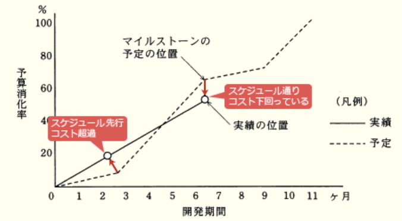

### ランダム マネジメント系

---
ITサービスマネジメントにおける問題管理プロセスにおいて実施すること

- A.**インシデントの発生後に未知の根本原因を特定し、恒久的な解決策を策定する**  
・インシデントの根本原因と潜在的な予防処置を特定する  
・問題解決のための変更要求を提起する  
・サービスへの影響を低減・除去するための処置を特定する  
・既知の誤りを記録する

- インシデントの発生後に暫定的にサービスを復旧させ、業務を継続できるようにする  
インシデント管理プロセスの役割

- インシデントの発生に備えて、復旧のための設計をする  
ITサービス脆弱性管理プロセスの役割

- インシデントの発生を記録し、関係する部署に状況を連絡する  
サービスデスクの役割

---
システム運用管理における管理情報の取り扱い

- A.**管理は少人数の管理者グループで行う。管理用アカウントは、個々の管理者専用のものを使用する。管理情報は、セキュリティレベルなどを考慮した上で一般ユーザへの公開を行う**

- 管理は少人数の管理者グループで行う。管理用アカウントは、グループ専用のものを共用する。管理情報は、一般ユーザに公開し、ユーザ自身がチェックできるようにする  
管理者アカウントを共有すると、行われた操作がどの管理者によるものか判断できず、不正の温床となる可能性がある。管理情報のセキュリティについても考慮していない

- 管理は少人数の管理者グループで行う。管理用アカウントは、グループ専用のものを共用する。管理情報は、セキュリティレベルなどを考慮した上で一般ユーザへの公開を行う  
管理者アカウントを共有すると、行われた操作がどの管理者によるものか判断できず、不正の温床となる可能性がある

- 管理は1人の管理者で行う。管理情報は、セキュリティレベルなどを考慮した上で一般ユーザへの公開を行う  
監視・牽制を行う人がいない1人での管理では不正の可能性が大きくなる

---
情報システム部が開発して経理部が運用している会計システムの運用状況を、経営者からの指示で監査することになった。この場合におけるシステム監査人についての記述のうち、最も適切なもの

- A.**独立性を担保するために、システム監査人は情報システム部にも経理部にも所属しない者とする**  
システム監査人には監査対象部門と身分的・精神的に利害関係がない者を任命し、客観的な視点から公平・公正な判断を行えるようにしなければならない

- 会計システムは企業会計に関する各種基準に準拠すべきなので、システム監査人を公認会計士とする  
会計監査ではなく、会計システムの運用状況の監査なので公認会計士とする必要はない

- 会計システムは機密性の高い情報を扱うので、システム監査人は経理部長直属とする  
経理部長の直属では、経理部が運用しているシステムの監査を公平に行えない可能性がある。監査人は客観的な評価者としての立場を堅持しなくてはならない

- システム監査を効率的に行うために、システム監査人は情報システム部長直属とする  
情報システム部長の直属では、情報システム部が開発したシステムの監査を公平に行えない可能性がある。監査人は監査対象部門から独立していなければならない

---
システムの移行テストを実施する主要な目的

- A.**確実性や効率性の観点で、既存システムから新システムへの切替え手順や切替えに伴う問題点を確認する**  
運用テストを終えた新システムを稼働環境に展開する際に、一連の作業内容や作業手順の把握、移行に伴う問題点とそれに対する慈善策の確認のために実施される

- 既存システムのデータベースのコピーを利用して、新システムでも十分な性能が得られることを確認する  
性能テストの説明

- 既存のプログラムと新たに開発したプログラムとのインタフェースの整合性を確認する  
システム結合テストの説明

- 新システムが要求されたすべての機能を満たしていることを確認する  
機能テストの説明

---
システム監査基準(平成30年)におけるウォークスルー法の説明

- A.**データの生成から入力、処理、出力、活用までのプロセス、及び組み込まれているコントロールを、システム監査人が、書面上で、又は実際に追跡する**

- あらかじめシステム監査人が準備したテスト用データを監査対象プログラムで処理し、期待した結果が出力されるかどうかを確かめる  
コンピュータ支援監査技法の1つのテストデータ法の説明

- 監査対象の実態を確かめるために、システム監査人が、直接、関係者に口頭で問い合わせ、回答を入手する  
インタビュー法の説明

- 監査対象の状況に関する監査証拠を入手するために、システム監査人が、関連する資料及び文書類を入手し、内容を点検する  
ドキュメントレビュー法の説明

---
経済産業省の"営業秘密管理指針"に基づく営業秘密データの管理状況について監査を行う時、秘密管理性のチェックポイント

- A.**当該データの記録媒体に秘密を意味する表示をしていること**  
`秘密管理性`のチェックポイント。情報に客観的に秘密として管理していると認識できる状態にあることが必要。情報にアクセスできる者を特定できる・情報にアクセスした者が秘密であると認識できるという2つが要件。営業秘密は、この3要件を満たす情報と規定されている

- 当該データの内容が刊行物に掲載されていないかを定期的に確認していること  
`非公知性`のチェックポイント。保有者の管理下以外では一般に入手できないことが必要である

- 当該データが経営効率の改善に役立っているかどうかを分析していること
- 当該データの内容が公序良俗に反していないかを確認していること  
`有用性`のチェックポイント。情報が客観的に有用であることが必要である。企業の反社会的な行為などの公庁良俗に反する内容の情報は有用性が認められない

---
PMBOKによれば、プロジェクトのリスクマネジメントにおいて、脅威に対して適用できる対応戦略と好機に対して適用できる対応戦略がある。脅威に対して適用できる対応戦略

- A.**受容**  
リスクが現実化した時の影響許容範囲内である場合やリスクの除去が困難である時に、特に対策をせずそのままにする戦略。対策費用が予想される損失金額を上回る時などに採られる。脅威への対応には、他にも回避(リスク除去)・転嫁(影響の移転)・軽減(影響範囲・発生確率の低減)がある

- 活用  
好機が確実に到来するように、潜在化の不確実性を取り除くための戦略

- 強化  
好機のプラスの影響を増加させたり発生確率を高めたりする戦略

- 共有  
好機を得られる能力の高い第三者にプロジェクトの実行権限の一部(全部)を与える戦略

---
ITサービスマネジメントにおける問題管理で実施する活動のうち、事前予防的な活動

- A.**インシデントの発生傾向を分析して、将来のインシデントを予防する方策を提案する**  
インシデントや障害原因の把握と管理を行い、根本原因を究明して、回避策や恒久的な対策を策定するプロセス。問題管理では、発生したインシデントに対して自己活動を行うほか、将来起こるかもしれないインシデントを推測し、予防する活動も行う(*proactive*(率先した、積極的な)な活動)

---
ITILによれば、サービスデスク組織の特徴のうち、バーチャル・サービスデスクのもの

- A.**サービスデスク・スタッフは複数の地域に分散しているが、通信技術を利用することによって、利用者からは単一のサービスデスクのように見える**  
`バーチャルサービスデスク` : 実際には各地に分散しているが連携することで擬似的に1組織として機能を提供するサービスデスク  
`フォロー・ザ・サン` : 2つ以上の異なる(大陸の)拠点に配置され、中央での統括管理によって24365のサービスを提供するサービスデスク

- 専任のサービスデスク・スタッフは置かず、研究や開発、営業などの業務の担当者が兼任で運営する  
擬似的なサービスデスクスタッフが対応するという意味でのバーチャルではない

- 費用対効果の向上やコミュニケーション効率の向上を目的として、サービスデスク・スタッフを単一又は少数の場所に集中させる  
`中央サービスデスク` : 1箇所の拠点に全てのユーザからの問い合わせに対応する体制のサービスデスク。運営コストを低く抑えることができ情報管理がしやすい

- 利用者の拠点と同じ場所か、物理的に近い場所に存在している  
`ローカルサービスデスク` : ユーザのローカルサイト内、地理的に近い場所に設置されたサービスデスク。担当者の直接派遣が容易でユーザの問題や改善点を把握しやすい

---
システム監査実施体制のうち、システム監査人の独立性の観点から避けるべきもの

- A.**監査チームメンバーに任命された総務部のAさんが、ほかのメンバーと一緒に、総務部の入退室管理の状況を監査する**  
総務部に所属しているAさんが、自身の部署の監査を行うため、監査業務の客観性・独立性が保障されない  
`外観上の独立性` : システム監査人は、システム監査を客観的に実施するために、監査対象から独立していなければならない。監査の目的によっては、被監査主体と身分上、密接な利害関係を有することがあってはならない  
`精神上の独立性` : システム監査人は、システム監査の実施に当たり、偏向を排し、常に公正かつ客観的に監査判断を行わなければならない  
`職業倫理と誠実性` : システム監査人は、職業倫理に従い、誠実に業務を実施しなければならない

---
アクセス制御を監査するシステム監査人の行為

- A.**データに関するアクセス制御の管理規程を閲覧した**  
システム監査では客観的な立場であるシステム監査人が情報システムを総合的に評価し、助言・勧告・改善活動のフォローアップまで行う。システム監査結果の改善提案等に基づき、被監査側が主体となって改善活動を実施する。改善状況をモニタリングして適切な措置が適時に講じられていることを確認することが役割

- ソフトウェアに関するアクセス制御の管理台帳を作成し、保管した
- ネットワークに関するアクセス制御の管理方針を制定した
- ハードウェアに関するアクセス制御の運用手続を実施した  
システム監査人自身が主体的に改善活動を行うことはない

---
スプレッドシートの処理ロジックの正確性に関わるコントロールを監査する際のチェックポイント

- A.**スプレッドシートのプログラムの内容が文書化され検証されていること**  
プログラムの内容が文書化され、処理の完全性・正確性・正当性が確保されているかがチェックポイントとなる

- スプレッドシートの作成者と利用者が同一であること  
作成者と利用者が同一の場合、第三者が検証していないと不正な計算式の誤り等が見逃されるリスクがある。作成者と利用者を分けるなどの規則・仕組み・チェック体制を整備することが有効

- スプレッドシートのバックアップが行われていること  
データの消失を防ぐためのコントロール

- スプレッドシートの利用者が定められていること  
利用時の職務権限、利用権限を定めるのは、データ改竄や消失を防ぐためのコントロール

---
複数のシステム間でのデータ連携において、送信側システムで集計した送信データの件数の合計と、受信側システムで集計した受信データの件数の合計を照合して確認するためのコントロール

- A.**コントロールトータルチェック**  
入力された数値の合計と出力される数値の合計を都度照合することでデータ処理の完全性を高める機能

- アクセスコントロール  
参照可能な資源・許可する操作を、利用者の属性ごとに適切に制御することで機密性を高める機能

- エディットバリデーションチェック  
入力された値が、範囲内に収まっているか、論理的に正しいか、決められたフォーマットか、などシステムが予定されている形式か確認することで入力値の正確性を高める機能

- チェックディジット  
元の符号から規則によって算出された数字を元の符号に付加することで、符号の入力誤りなどを検出する方法

---
A社では、自然災害などの際の事業継続を目的として、業務システムのDBのバックアップを取得している。その状況について、"情報セキュリティ管理基準(平成28年)"に従って実施した監査結果として判明した状況のうち、監査人が指摘事項として監査報告書に記載すべきもの

- A.**バックアップを取得した電子記録媒体を、業務システムが稼働しているサーバの近くで保管していた**  
火災や自然災害などの被害を受けた時、バックアップも同時に破損してしまう可能性がある。1つをサーバの近くで保管したいのであれば、同じバックアップをもう1つ用意し遠隔地で保管する必要がある

- バックアップ取得手順書を作成し、取得担当者を定めていた  
バックアップ情報の正確・完全な記録・文書化したデータ復旧手順書を作成する必要がある

- バックアップを取得した電子記録媒体からデータベースを復旧する試験を、事前に定めたスケジュールに従って実施していた  
バックアップに用いる媒体は、必要時の緊急利用について信頼できることを確実にするために、定めに従って試験する

- バックアップを取得した電子記録媒体を、機密保持を含む契約を取り交わした外部の倉庫会社に委託保管していた  
外部業者の保管サービスを利用する場合、機密保持契約を締結する必要がある

---
システム開発の進捗管理などに用いられるトレンドチャートの説明

- A.**作業の進捗状況と、予算の消費状況を関連づけて折れ線グラフで示したもの**  
計画の予算・工期・実績の費用・進捗を表す2本の折れ線グラフを並べたグラフで、差異の把握や傾向(トレンド)の分析に用いられる

- 作業に関与する人と責任をマトリクス状に示したもの  
責任分担票の説明

- 作業日程の計画と実績を対比できるように帯状に示したもの  
ガントチャートの説明

- 作業の順序や相互関係をネットワーク状に示したもの  
アローダイアグラムやプレシデンスダイアグラムの説明

---
CIO(*Chief Information Officer*)が経営から求められる役割

- A.**ビジネス価値を最大化させるITサービス活用の促進**  
経営戦略に沿った情報戦略やIT投資計画に関する責任を持つ役職である最高情報責任者。CEO(最高経営責任者)やCOO(最高執行責任者)を補佐し、企業の情報戦略の策定に当たるのが主な職務

- 起業経理のための財務戦略の立案と遂行  
CFO(*Chief Financial Officer* : 最高財務責任者)に求められる役割

- 企業の研究開発方針の立案と実施  
CTO(*Chief Technology Officer* : 最高技術責任者)に求められる役割

- 企業の法令遵守の体制の構築と運用  
CLO(*Chief Legal Officer* : 最高法務責任者)に求められる役割

---
経営者が社内のシステム監査人の外観上の独立性を担保するために講じる措置

- A.**システム監査人の所属部署を内部監査部門とする**  
組織体に内部監査部門が設置されている場合、当該部門がシステム監査を実施することが望ましい。監査対象から独立した立場で実施されているという外観が確保される必要がある  
`外観上の独立性` : システム監査人は、監査対象の領域又は活動から、独立かつ客観的な立場で監査が実施されているという外観に配慮しなければならない  
`精神上の独立性` : システム監査人は、監査の実施に当たり、客観的な視点から公正な判断を行わなければならない

- システム監査人に必要な知識や経験を定めて公表する  
目的、権限と責任を明確に定めるための措置

- システム監査人にITに関する継続的学習を義務付ける
- システム監査人の監査技法研修制度を設ける  
専門能力を高めるための措置

---
ITサービスマネジメントの管理プロセス

- A.**サービスレベル管理**  
サービス提供者と利用顧客の間で合意したサービスレベルを維持管理するためのプロセス。安定したITサービスを提供するためにSLAやSLMを実施し、運用状況を管理する役割を持っている  
`SLA`(*Service Level Agreement*) : 提供者と顧客の間でサービス品質に関して結ぶ契約のことで、サービスの品目と水準、水準未達時のペナルティ事項などが盛り込まれる  
`SLM`(*Service Level Management*) : サービスレベル合意書に基づき、顧客要件を満たすITサービスの提供を実現し、品質の継続的な改善に必要なプロセスを構築する管理手法や考え方

---
3PL(*3rd Party Logistics*)の説明

- A.**物流業務に加え、流通加工なども含めたアウトソーシングサービスを行い、荷主企業の物流企画も代行する**  
企業の物流の全部(一部)を第三者企業が受託することで実現する物流業務形態の1つ。荷主側からでは物流のための設備や資源を整備する必要がなく、外部の資源を有効利用して効率的な物流が期待できる。3PL事業者とすれば、既に自社で保有している資源を外部の企業に解放することで少ない投資で増益を期待できる

- 購買、生産、販売、物流の一連の業務を、企業間で全体最適の視点から見直し、納期短縮や在庫削減を図る  
SCM(*Supply Chain Management*)の説明

- 資材の調達から生産、保管、販売に至るまでの物流全体を、費用対効果が最適になるように総合的に管理し、合理化する  
物流管理システムの説明

- 電子・電機メーカから、製品の設計や資材の調達、生産、物流、修理を一括して受託する  
EMS(*Electronics Manufacturing Service*)の説明

---
EMS(*Electronics Manufacturing Service*)の説明

- A.**他メーカから受注した電子機器などの受託生産を行う**  
製造企業が個別の製品ごとにラインを設置するのは非効率なため外部の専門業者に委託(アウトソーシング)するようになり発達した業務形態

- 一般消費者からの家電製品に関する問い合わせの受付窓口となって電話対応を行う  
コールセンターの説明

- 製造設備をもたず、製品の企画・設計・開発を行う  
ファブレス(*fabless*)の説明

- 他メーカから仕入れた電子機器などの販売を専門に行う  
ベンダ(*vendor*)の説明
