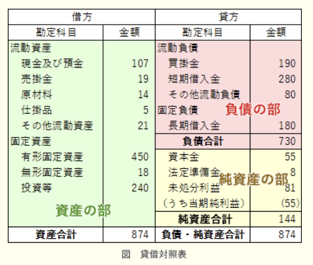
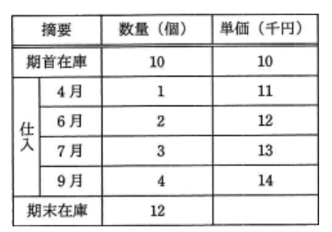
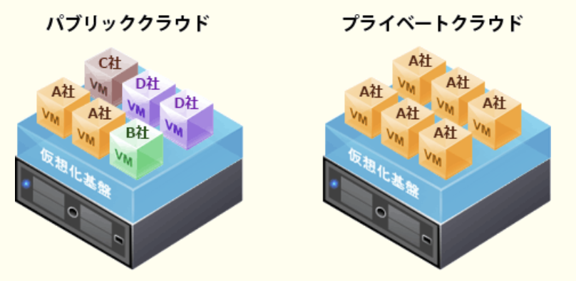

### ランダム ストラテジ系

---
製品X, Yを生産するために2種類の原料A, Bが必要である。製品1個の生産に必要となる原料の量と調達可能量は表の通り。製品X, Yの1個当たりの販売利益が、それぞれ100円, 150円であるときの最大利益

|原料|製品Xの1個当たりの必要量|製品Yの1個当たりの必要量|調達可能量|
|-|-|-|---|
|A|2|1|100|
|B|1|2|80 |

- A.**7,000**  
原料A, Bの両方を調達可能まで使い切るときの、X, Yの生産量の組み合わせを連立方程式で求める  
$2x + y = 100$  
$x + 2y = 80$  
=> x = 40, y = 20  
調達可能量まで原料A, Bを使った場合、xを40個、yを20個を生産することができる。この場合、製品Xで4,000円、製品Yで3,000円の利益を得られる

---
ビッグデータを有効活用し、事業価値を生み出す役割を担う専門人材であるデータサイエンティストに求められるスキルセットを表の3つの領域と定義した。データサイエンス力に該当する具体的なスキル

||データサイエンティストに求められるスキルセット|
|-|-------------------------------------|
|ビジネス力|課題の背景を理解した上で、ビジネス課題を整理・分析し、解決する力|
|データサイエンス力|人工知能や統計学などの情報科学に関する知識を用いて、予測・検定・関係性の把握及びデータ加工・可視化する力|
|データエンジニアリング力|データ分析によって作成したモデルを使えるように、分析システムを実装・運用する力|

- A.**分析要件に応じ、決定木分析、ニューラルネットワークなどのモデリング手法の選択、モデルへのパラメータの設定、分析結果の評価ができる**  
ビッグデータなどの大量のデータを、数学的・統計学的・機械学習・データマイニングなどの様々な手法を分析し、ビジネス上の課題解決を支援する職種。分析対象及び目的に適した分析手法を選択できる能力なので、データサイエンス力に該当する

- 事業モデル、バリューチェーンなどの特徴や事業の主たる課題を自力で構造的に理解でき、問題の大枠を整理できる  
事業分析能力に関する事柄なので、ビジネス力に該当する

- 扱うデータの規模や機密性を理解した上で、分析システムをオンプレミスで構築するか、クラウドサービスを利用して構築するかを判断し、設計できる  
分析システムの構築に関する事柄なので、データエンジニアリング力に該当する

- 分散処理のフレームワークを用いて、計算処理を複数サーバに分散させる並列処理システムを設計できる  
分析システムの構築に関する事柄なので、データエンジニアリング力に該当する

---
事業部制組織を説明したもの

- A.**製品、地域などで構成された組織単位に、利益責任をもたせる**  
トップマネジメントの下に製品別や商品別、地域別、市場別などの単位で組織を分け、分化した組織ごとに自律的な意思決定を行う組織形態。各事業部ごとに営業・生産・開発などの職能組織があり、事業部ごとに予算や目標を持ち、独立採算が求められる

- ある問題を解決するために一定の期間に限って結成され、問題解決とともに解散する  
プロジェクト組織の説明

- 業務を機能別に分け、各機能について部下に命令、指導を行う  
職務別組織の説明

- 戦略的提携や共同開発など外部の経営資源を積極的に活用することによって、経営環境に対応していく  
アライアンスの説明

---
構成表の製品Aを300個出荷しようとするとき、部品bの正味所要量は何個か。A, a, b, cの在庫量は在庫表の通りとし、他の仕掛残、注文残、引当残などはないものとする

- A.**600**  
Aの在庫数は100個なので、200個の作成が必要。aは在庫が100個あるので、a500個と`b400個`、aの作成のために、さらに`b500個`が必要となる。bは在庫が既に300個あるため、400 + 500 - 300 = A.**600個**

---
業務の改善提案に対する資金が次の決定表で決められる。改善提案1と改善提案2に対する賞金の総額はいくらか  
改善提案1 : 改善額 20万円, 期間短縮3日  
改善提案2 : 改善額 5万円, 期間短縮2週間

- A.**2,000**  
決定表(ディジションテーブル)は、条件とその条件に対する処理や行動の関係を整理して表した表。条件を満たした場合の*Yes*、満たさない場合の*No*、実施する対応を*eXecute*でチェックする  
改善提案1 : 改善額10万円未満N, 機関短縮1週間未満Yなので、左から3列目のケースに該当し、賞金は1,000円  
改善提案2 : 改善額10万円未満Y, 機関短縮1週間未満Nなので、左から2列目のケースに該当し、賞金は1,000円

---
受注管理システムにおける要件のうち、非機能要件に該当するもの

- A.**受注管理システムの稼働率を決められた水準に維持するために、障害発生時は半日以内に回復できること**  
業務要件を実現するためにシステムに求められる機能要件以外の要件のことで、品質要求や制約要求が該当し、応答速度・ピーク時の処理能力・障害児の復旧速度・使いやすさ・セキュリティ要件などがある。制約条件の例では、使用するプログラム言語・運用スケジュール・データ保存期間・移行要件などがある

- 顧客から注文を受け付けるとき、与信残金額を計算し、結果がマイナスになった場合は、入力画面に警告メッセージを表示すること
- 受注を処理するとき、在庫切れの商品であることが分かるように担当者に警告メッセージを出力すること
- 出荷できる商品は、顧客から受注した情報を受注担当者がシステムに入力し、営業管理者が受注承認入力を行ったものに限ること  
業務をシステム上で実現するために欠かせない要件なので機能要件

---
UCS(*Universal multiple - octet Character*) - 2(*Unicode*)を説明したもの

- A.**全ての文字を2バイトで表現するコード体系であり、多くの国の文字体系に対応できる**  
ISO 10646で制定されている世界統一文字コードの規格。1文字を2バイトで表現するので、最大65536文字を割り当てられる。現在は1文字4バイトで表現し、最大4億文字を割り当てることができるUCS - 4が定義されている

- JISから派生したコード体系であり、英数字は1バイト、漢字は2バイトで表現する  
シフトJISの説明

- 主にUNIXで使用するコード体系であり、英数字は1バイト、漢字は2バイトで表現する  
EUC(*Extended Unix Code*)の説明

- 全ての文字を1バイトで表現するコード体系である  
全ての文字を2バイトで表現することを目指した文字コード体系

---
デジタルディバイドの解消のために取り組むべきこと

- A.**情報リテラシーの習得機会を増やしたり、情報通信機器や情報サービスが一層利用しやすい環境を整備したりすること**  
パソコンやインターネットなどの情報通信技術を使いこなせる者とそうでない者の間に生じる待遇や貧富、機会の格差のこと。IT技術の取得機会を増やす、学校教育での取得推進、容易に操作できる端末の開発、ネットワークインフラの整備などの実施が必要となる

- IT投資額の見積りを行い、投資目的に基づいて効果目標を設定して、効果目標ごとに目標達成の可能性を事前に評価すること  
ITガバナンスのための取り組み

- ITを活用した家電や設備などの省エネルギー化やテレワークなどによる業務の効率向上によって、エネルギー消費を削減すること  
グリーンITの取り組み

- 製品や食料品などの生産段階から最終消費段階又は廃棄段階までの全工程について、ICタグを活用して流通情報を追跡可能にすること  
トレーサビリティ確立のための取り組み

---
情報戦略の立案時に、必ず整合性を取るべき対象

- A.**中長期の経営計画**  
経営戦略の下に策定され、経営目標の達成に寄与するものでなければならない。立案時には、経営事業戦略・経営事業目標・中長期構想と整合性をとることが求められる。システム管理基準でも「情報システム全体の最適化目標を経営戦略に基づいて設定すること」「情報化投資計画は、経営戦略との整合性を考慮して策定すること」などのように経営計画との整合性の重視を強調する管理項目が挙げられている

---
SFAの説明

- A.**営業活動にITを活用して営業の効率と品質を高め、売上・利益の大幅な増加や、顧客満足度の向上を目指す手法・概念である**  
営業活動にモバイル技術やインターネット技術などのITを活用して、営業の質と効率を高め売上や利益増加に繋げようとする仕組み・システムのこと。営業日報の管理や商談管理機能(コンタクト管理、行動管理、評価・実績管理)があり、営業担当者個人の支援に加えて営業グループ内で情報共有を促進するなど、営業活動全体を支援する機能が備わっている

- 卸売業・メーカーが小売店の経営活動を支援することによって、自社との取引量の拡大につなげる手法・概念である  
リテールサポートの説明

- 企業全体の経営資源を有効かつ総合的に計画して管理し、経営の効率向上を図るための手法・概念である  
ERP(*Enterprise Resource Planning* : 企業資源計画)の説明

- 消費者向けや企業間の商取引を、インターネットなどの電子的なネットワークを活用して行う手法・概念である  
EC(*Electronic Commerce* : 電子商取引)の説明

---
図のような契約の下で、A社, B社, C社の開発要因がプロジェクトチームを組んでソフト開発業務を実施するとき、適法な行為

- A.**B社の担当者がC社の要員に業務の割り振りや作業スケジュールの指示を行う**  
派遣契約では派遣元の要員は派遣先の指揮命令の下で作業に従事することになる

- A社の担当者がB社の要員に直接作業指示を行う  
請負契約では、受注側の要員は受注側の指揮命令の下で業務を行う。そのためA社はB社の要員に直接作業指示を行うことはできない

- A社のリーダーがプロジェクトチーム全員の作業指示を行う  
A社とB社は請負契約で、B社は成果物を完成させる責任があり、方法は問われない。A社のプロジェクトの下で作業を行う必要はない

- B社の担当者が業務の進捗によってC社の要員の就業条件の調整を行う  
B社とC社に所属している要員との間に雇用関係はない。派遣元企業に所属する要員の就業条件の調整は派遣元企業が行う

---
RFIに回答した各ベンダに対してRFP(*Request for Proposal* : 提案依頼書)を提示した。今後のベンダ選定に当たって、公正に手続を進めるためにあらかじめ実施しておくこと

- A.**提案の評価基準や要求事項の適合度への重み付けをするルールを設けるなど、選定の手順を確立しておく**  
情報システムの調達を予定している企業・組織が発注先候補のITベンダに対して具体的なシステム提案をするよう求めること、それらのシステム要件や調達要件を取りまとめた文書を指す  
RFPの発行に当たり、取得者側は、提案書の評価基準や要求事項適合度の重み付けを含めて、ベンダ選択の手順を確立しておくことが望ましい

- ベンダ選定後、迅速に契約締結をするために、RFPを提示した全ベンダに内示書を発行して、契約書や作業範囲記述書の作成を依頼しておく  
契約交渉におけるユーザとベンダのバランスは、特定のベンダに内耳を与えた時点で、そのベンダ側に大きく傾くことになってしまう。公正に手続きを進めるためには内示書を発行すべきではない

- RFIの回答内容の評価が高いベンダに対して、選定から外れたときに備えて、再提案できる救済措置を講じておく
- 現行のシステムを熟知したベンダに対して、RFPの要求事項とは別に、そのベンダを選定しやすいように評価を高くしておく  
特定のベンダに対して有利な条件であるため公正な手続きとはいえない

---
表は投資目的に応じて、投資分類とKPIを整理したものである。投資目的のcに当てはまるものはどれか。選択肢はa ~ dのいずれかに入る

|投資目的|投資分類|KPI|
|------|-------|---|
|a|業務効率化投資|納期の遵守率、月次決算の所要日数|
|b|情報活用投資|提案事例の登録件数、顧客への提案件数|
|c|戦略的投資|新規事業のROI、新製品の市場シェア|
|d|IT基盤投資|システムの障害件数、検索の応答時間|

- A.**ビジネスの創出、競争優位の確立**  
ビジネス創出が新規事業のROI、競争優位の確立が新製品の市場シェアに対応し、cに該当する

- 作業プロセスの改善、作業品質の向上  
プロセスの改善が月次決算の所要日数、品質向上が納期の順守率に対応し、aに該当する

- システム維持管理コストの削減、システム性能の向上  
維持管理コストの削減がシステムの障害件数、システム性能の向上が検索の応答時間に対応し、dに該当する

- ナレッジの可視化、ナレッジの共有  
可視化が顧客への提案件数、共有が提案事例の登録件数に対応し、bに該当する

---
IoT(*Internet of Things* : モノのインターネット)の構成要素

- A.**インターネット又は閉域網に接続できる全てのものが対象となる**  
情報端末ではない電子機器や機械類などのモノにインターネット接続機能や通信機能・センサー機能を持たせ、機器が情報を相互にやり取りすることで自律的な制御を行わせる仕組みを指す。インターネットに接続でき、物理的な実体をもつ全てのものが含まれる

- アナログ式の機器を除く、デジタル式の機器が対象となる  
アナログ式であっても、取得したデータをデジタル化することでIoTを実装できる

- 自律的にデータを収集してデータ分析を行う機器だけが対象となる  
データ収集を行い、データを転送するだけのセンサーデバイス等の機器も対象となる

- 人や生物を除く、形のある全てのものが対象となる  
人間の健康状態、植物の状態をIoTで管理する例もある

---
システム開発を外部に発注する場合、受託側が契約不適合責任を負うもの

- A.**請負契約**  
売買契約や請負契約において引き渡された目的物や利害関係が契約内容に適合しない場合、売主等が買主等に負う責任のことを呼ぶ。不適合が見つかった場合、買主等は売主等に目的物の補修や不足物の引き渡しを請求したり、代金減額を請求したり、損害賠償を請求できる

- 委任契約  
特定の事務を処理することを委託する契約。事務の遂行に当たり善管注意義務はあるが、契約不適合責任はない

- パート契約  
雇用契約なので、雇用主と従業員の間に発注者の受託者の関係はない

- 派遣契約  
派遣労働者は派遣先の指揮監督の下で業務に従事するので、派遣元は仕事の結果に責任を負うことはない

---
製品開発のスピードアップ手法を次のa ~ dに分類した場合、bに相当するもの

|経営資源の確保(縦) 実現方法(横)|技術的アプローチ|組織的アプローチ|
|--------|-|-|
|組織内から|a|b|
|組織外から|c|d|

- A.**設計部門と生産部門の作業を並列に進めるコンカレントエンジニアリング**  
自社内の業務組織の改善であるため組織内の経営資源、組織的アプローチ(b)

- CAD・CAM・CAEなど既に一部利用しているツールの積極的な活用  
既に利用しているツールを使うので組織内の経営資源、コンピュータ技術を活用するため技術的アプローチ(a)

- 消費者ニーズを調査し、製品開発につなげるための市場調査会社の活用  
外部の市場調査会社を活用するので組織外の経営資源、市場ニーズの調査は技術的手法ではないため組織的アプローチ(d)

- 大学との共同研究開発や、同業他社からの技術導入  
大学や他社から技術を得るため組織外からの経営資源、技術的アプローチ(c)

---
プロダクトライフサイクルにおける成熟期の特徴

- A.**需要が大きくなり、製品の差別化や市場の細分化が明確になってくる。競争者間の競争も激化し、新品種の追加やコストダウンが重要となる**  
製品を市場に投入しえtから販売活動によって普及・成熟し、落ち込んで製品寿命が終わるまでの過程が、導入期, 成長期, 成熟期, 衰退期の順で推移していくと表現した概念。成熟期では製品改良・多様化が重要

- 市場が商品の価値を理解し始める。商品ラインもチャネルも拡大しなければならない。この時期は売上も伸びるが、投資も必要である  
成長期の特徴。他者との差別化が重要

- 需要が減ってきて、撤退する企業も出てくる。この時期の強者になれるかどうかを判断し、代替市場への進出なども考える  
衰退期の特徴。撤退時期の決定が重要

- 需要は部分的で、新規需要開拓が勝負である。特定ターゲットに対する信念に満ちた説得が必要である  
導入期の特徴。製品認知度の向上が重要

---
プロダクトライフスタイルにおける導入機を説明したもの

- A.**先進的な消費者に対し製品を販売する時期である。製品の認知度を高める戦略が採られる**  
製品を市場に投入してから販売活動によって普及、成熟し、落ち込んで寿命が終わるまでの過程を表現した概念。製品が現在ライフサイクルのどのステージにあるかによって、商品展開の戦略を考える

- 売上が急激に増加する時期である。市場が活性化し新規参入企業によって競争が激化してくる  
成長期の説明(他社との差別化)

- 需要の伸びが鈍化してくる時期である。製品の品質改良などによって、シェアの維持、利益の確保が行われる  
成熟期の説明(製品改良、多様化)

- 売上と利益が徐々に減少する時期である。追加投資を控えて市場から撤退することが検討される  
衰退期の説明(撤退時期の決定)

---
システムの運用設計においては、運用操作ミスを防止するために、あらゆる場合を想定した設計を行うことが大切である。これまでの経験を生かしながら、未知の状況を先読みして対処手順の検討、問題点の所在の確認を行う必要がある。これをまとめるときに活用できる手法

- A.**PDPC(*Process Decision Program Chart*)法**  
ある計画における目的達成のための全てのルートを図解で表すことで最適ルートを決定するための方法

- アローダイアグラム法  
プロジェクトの各作業間の関連性や順序関係を視覚的に表現する図

- 統計図法  
目的・目標を達成するための手段・方策を順次展開し、最適な手段・方策を追求する方法

- 連関図法  
複雑な要因の絡み合う事象について、事象間の因果関係や相互関係を整理しておくことで問題や要因を明らかにし、課題解決のための糸口を発見する手法

---
経営戦略策定に用いられるSWOT分析

- A.**競争環境における機会・脅威と事業の強み・弱みを分析する**  
今後の戦略立案に活かす手法の1つで、*Strength*(強み), *Weakness*(弱み・弱点), *Opportunity*(機会), *Threat*(脅威)の頭文字を取り、強みと弱みは企業の内部要因、機会と脅威は外部環境要因に分類される

- 競争に影響する要因と、他者の動き、自社の動きを分析する  
マクミシン理論などに代表されるゲーム理論の説明

- 市場に対するマーケティングツールの最適な組合せを分析する  
マーケティングミックスの説明

- 市場の成長性と占有率の観点から各事業の位置付けを分析する  
事業ポートフォリオ分析の説明

---
フィンテックのサービスの1つ、アカウントアグリゲーションの特徴

- A.**各金融機関のサービスに用いる、利用者のID・パスワードなどの情報をあらかじめ登録し、複数の金融機関の口座取引情報を一括表示できる**  
複数の金融機関の口座取引情報を1つのコンピュータ上に一括表示できるサービス。サービスを提供するWebサイトやスマホアプリなどに複数の口座情報等と認証情報(ID・パスワード等)を登録しておくことで、普通口座・証券口座・クレジットカード・電子マネー・店舗ポイントなどの異なる場所に分かれている資金や取引状況をまとめて閲覧が可能

- 資金移動業者として登録された企業は、少額の取引に限り、国内・海外送金サービスを提供できる  
資金移動サービスの説明

- 電子手形の受取り側が早期に債権回収することが容易になり、また、必要な分だけ債権の一部を分割して譲渡できる  
電子決済サービスの説明

- ネットショップで商品を購入した者に与信チェックを行い、問題がなければ商品代金の立替払いをすることによって、購入者は早く商品を入手できる  
エスクローサービスの説明

---
A社とB社がそれぞれ2種類の戦略を採る場合の利得が表のように予想される時、両社がそれぞれのマキシミン戦略を採った場合のA社の利得はどれか。表の各欄において、左側の数値がA社の利得、右側の数値がB社の利得とする

- A.**5**  
複数の人間による合理的な意思決定の方法を考える、ゲーム理論における戦略で、各戦略を選択した場合に`得られる最小利得が最も大きくなる戦略を選ぶ`保守的な方針  
A社の選択する戦略は、`戦略a1`を選択した場合は-15または20で最小利得は-15、`戦略a2`を選択した場合は5または0で最小利得は0となり、最小利得の値がより大きい`戦略a2`を選択する  
B社の選択する戦略は、`戦略b1`を選択した場合は15または-5で最小利得は-5、`戦略b2`を選択した場合は-20または0で最小利得は-20となり、最小利得の値がより大きい`戦略b1`を選択する  
両者が選択するのは戦略a2と戦略b1

---
著作権法で保護されるもの

- A.**コンパイラのプログラム**  
知的財産権の中でも文化・芸術に関するものにおいて、創作物・創作者に認められる権利で、著作権法はこれらを保護するための法律。情報産業ではプログラムやDBなどが著作物に該当し、保護対象

- アルゴリズム
- プログラム言語
- プロトコル  
プログラム言語そのもの、規約やプロトコル、解法・アルゴリズムは著作権保護の対象外

---
バランススコアカードの4つの視点に含まれるもの

- A.**顧客**  
企業のビジョンと戦略を実現するために業績を評価・分析する手法  
`財務の視点` : 株主や従業員などの利害関係社の期待に応えて良い業績を出すために、財務的にどのように行動すべきかの指標を設定する  
`顧客の視点` : 企業のビジョンの達成のため、顧客に対してどのように行動すべきかの指標を設定する  
`内部ビジネスプロセス(業務プロセス)の視点` : 財務的目標の達成や顧客満足度を向上させるために、優れた業務プロセスを構築するための指標を達成する  
`学習と成長の視点` : 企業のビジョンの達成のため、組織や個人としてどのように変化(改善)し能力向上を図るか指標を設定する

---
オンデマンド(*On - Demand*)型のサービス

- A.**利用者の要求に応じてインターネット上で配信される再放送のドラマ**  
オンデマンド型サービスのVOD(*Video On Demand*)の記述。利用者の求めに応じてサービスの提供を行い、利用者が好きな時に必要な量の情報や機能を受けられるように設計されたサービスを指す。インターネット環境を利用した動画配信やeラーニング、少部数の印刷に対応するオンデマンド印刷に対応するオンデマンド印刷、Webサイト、ブログなどの例がある

- インターネットサイトで購入したDVDで視聴する映画  
DVDでの視聴はサービスではない

- 出版社が部数を決めてオフセット印刷した文庫本  
製版コストが掛かるため少部数の印刷には適していない。版を使用しない印刷はオンデマンド印刷と呼ばれ、小ロットでの印刷に向いている

- 定期的に決められたスケジュールでスマートフォンに配信されるインターネットニュース  
配信時間が決められているものは、利用者がサービスを受けられる時間が制限されるため該当しない

---
インターネットオークションなどで利用されるエスクローサービスの取引モデルの5に当てはまる行為はどれか。番号は取引の順序を示す

- A.**商品受領の通知**  
エスクローサービス業社は、代金(手数料)を受け取る(2)、売主の商品発送(4)、買主の商品受領を確認(5)し、商品代金を売主に送金する(6)

- 代金の入金通知  
3に該当する

- 商品の発送  
4に該当する

- 代金の支払  
6に該当する

---
ワークフローシステムを用いて業務改善を行った時、期待できる効果

- A.**書類の申請から決裁に至る事務手続の処理速度が上がる**  
電子化された申請書や通知書を予め決められた作業手順(決裁ルート)に従い、集配信し、電子決裁処理を行うシステム。稟議・報告書・届出申請の承認手続きを電子化することで、手続きのスピード向上、業務効率化、内部統制強化を図ることが可能

---
アクセシビリティ(*Accessibility*)を説明したもの

- A.**ソフトウェアや情報サービス、Webサイトなどにおける、高齢者や障害者を含む幅広い利用者にとっての利用しやすさのこと**  
利用者が様々な製品や建物やサービスなどを支障なく利用できるか、その度合いのこと。Webサイトにおいては、そのページが情報を取得・発信できるように柔軟に設計されていて、アクセスした誰もが同様に情報を共有できるか、その度合いを意味する

- 住民基本台帳の情報をコンピュータネットワークで管理することによって、住民サービスの向上と行政事務処理の合理化を図ること  
住民基本台帳ネットワークシステムの説明

- 仕様が異なるコンピュータ間で、ネットワークなどを通じてそれぞれが管理するソフトウェアやデータを利用する際の相互運用性のこと  
インターオペラビリティの説明

- 製品や食料品など、生産段階から最終消費段階又は廃棄段階までの全工程について、履歴の追跡が可能であること  
トレーサビリティの説明

---
従業員1人当たりの勤務時間を減らして社会全体の雇用維持や雇用機会増加を図るもの

- A.**ワークシェアリング**  
人々の間で雇用を分かち合うことを意味する。1人当たりの労働時間を短縮したり仕事の配分を見直すことで労働の負荷を減らすとともに新たな雇用を生み出す取り組み  
`雇用維持型` : 企業の業績が悪化した場合に、1人当たりの労働時間を少なくすることで雇用を維持できるようにする  
`雇用創出型` : 1人のフルタイム従業員が行っていた仕事を、パートタイムなどの短時間雇用を複数人で賄うことで雇用機会を増やすタイプ

- カフェテリアプラン  
企業が用意した多彩な福利厚生サービスメニューの中から希望するサービスを従業員が自ら選べる、選択式の福利厚生制度

- フリーエージェント制  
一定の基準を満たした従業員が希望する部署・部門に対して、自ら売り込むことで異動の契機を与える人事制度

- ワークライフバランス  
仕事と生活の調和を実現する目的で多様かつ柔軟な働き方を目指す考え方

---
ソフトウェアパッケージのライセンス契約形態のうち、サイトライセンスを説明したもの

- A.**特定の企業や団体などにある複数のコンピュータでの使用を一括して認める**  
企業や学校など特定の施設(サイト)内に限り複数のコンピュータへの使用権を認めるライセンス形態。1本のソフトウェアで1つのコンピュータへの使用権が与えられる通常のライセンス契約と比較して、1ライセンスあたりの単価が低く抑えられるため、同一の施設に同じソフトウェアを大量導入するときに利用される

- 特定のサーバにインストールし、そのクライアントでの使用を認める  
サーバライセンスの説明

- 特定のコンピュータ又は一定数のコンピュータでの使用を認める
- 特定のユーザ又は一定数のユーザに使用を認める  
ボリュームライセンスの説明

---
準委任契約の説明

- A.**善管注意義務を負って作業を受託する契約**  
通常の委託契約(請負契約)と同様に委託先に業務を依頼することは同様だが、仕事の完成を契約の目的とする請負契約と異なり、業務(依頼された仕事)の実施自体を目的とする契約形態で、仕事の完成の義務は負わない。業務分析やIT戦略のコンサルティングなど、作業や事務の遂行を約束する契約であり、仕事の完成は約束されないが、委託元の求めに応じて報告の義務がある

- 成果物の対価として報酬を得る契約
- 成果物を完成させる義務を負う契約  
請負契約の説明

- 発注者の指揮命令下で作業を行う契約  
労働者派遣契約の説明

---
TLO(*Technology Licensing Organization* : 技術移転機関)の役割

- A.**大学の研究成果の特許化及び企業への技術移転の促進**  
大学や高等専門学校等における研究成果を特許化し、それを民間事業者に技術移転する法人のこと。大学等における技術に関する研究成果の民間事業者への移転の促進に関する法律(通称TLO法)に基づいて、承認・運用が行われており、2019年現在34機関が承認されている。  
大学等と民間事業者の間に立ち、大学の研究成果を特許化し、それを民間企業にライセンスしてそのロイヤリティを大学等に還元する。TLOの役割は、`大学の研究成果を特許化し、又は企業への技術移転を支援し、産学の仲介役を果たす`こと

- TLO自らが研究開発して取得した特許の、企業へのライセンス  
研究開発はTLOの関連する大学等で行う。TLOは大学等の研究成果を特許化し、企業にライセンスする役割がある

- 企業から大学への委託研究の問合せ及び申込みの受付  
研究開発はTLO承認時の実施計画の下に関連大学の主導で行う

- 新規事業又は市場への参入のための、企業の合併又は買収の支援  
技術移転を受けた中小企業に対して出資を行うことはあるが、合併・買収の支援は行わない

---
バランススコアカードの内部ビジネスプロセスにおける戦略目標と業績評価指標の例

- A.**製品の製造の生産性向上が目標であるので、製造期間短縮日数を指標とする**  
`内部ビジネスプロセス(業務プロセス)の視点` : 財務的目標の達成や顧客満足度を向上させるために、優れた業務プロセスを構築するための指標を達成する。原価率・不良率・生産性・リードタイム・サイクルタイムなど、組織の業務がどれだけ改善されたかを定量的に検証できる評価指標を設定する

- 持続的成長が目標であるので、受注残を指標とする  
`財務の視点` : 株主や従業員などの利害関係社の期待に応えて良い業績を出すために、財務的にどのように行動すべきかの指標を設定する

- 主要顧客との継続的な関係構築が目標であるので、クレーム件数を指標とする  
`顧客の視点` : 企業のビジョンの達成のため、顧客に対してどのように行動すべきかの指標を設定する

- 製品開発力の向上が目標であるので、製品開発領域の研修受講時間を指標とする  
`学習と成長の視点` : 企業のビジョンの達成のため、組織や個人としてどのように変化(改善)し能力向上を図るか指標を設定する

---
CIO(*Chief Information Officer*)が果たすべき主要な役割

- A.**情報化戦略を立案するに当たって、経営戦略を支援するために、企業全体の情報資源への投資効果を最適化するプランを策定する**  
経営戦略に沿った情報戦略や、IT投資計画に関する責任を持つ役職である最高情報責任者。CEO(最高経営責任者)、COO(最高執行責任者)を補佐し、企業の情報戦略の策定に当たるのが主な職務

- 情報システム開発・運用に関する状況を把握して、全社情報システムが最適に機能するように具体的に改善点を指示する  
システム部門責任者の役割

- 情報システムが企業活動に対して健全に機能しているかどうかを監査することによって、情報システム部門にアドバイスを与える  
システム監査人の役割

- 全社情報システムの最適な運営が行えるように、情報システムに関する問合せやトラブルに関する情報システム部門から報告を受け、担当部門に具体的指示を与える  
一般的なシステム管理者や、ヘルプデスクの責任者の役割

---
プロダクトポートフォリオマネジメント(PPM)における、花形の説明

- A.**市場成長率、市場占有率ともに高い製品である。成長に伴う投資も必要とするので、資金創出効果は大きいとは限らない**  
`花形`(*star*) : 占有率・成長率ともに高く資金の流入も大きいが、成長に伴い占有率の維持には多額の資金の投入を必要とする分野

- 市場成長率は低いが、市場占有率は高い製品である。資金創出効果が大きく、企業の支柱となる資金源である  
`金のなる木`(*cash cow*) : 市場の成長がないため追加投資が不要で、市場占有率の高さから安定した心筋・利益の流入が認められる分野

- 市場成長率は高いが、市場占有率が低い製品である。長期的な将来性を見込むことはできるが、資金創出効果の大きさは分からない  
`問題児`(*problem child*) : 成長率は高いが占有率は低いので、花形製品とするためには多額の投資が必要。投資が失敗し成長率が下がれば負け犬になってしまうため、慎重な対応が必要

- 市場成長率、市場占有率ともに低い製品である。資金創出効果は小さく、資金流出量も少ない  
`負け犬`(*dog*) : 成長率・占有率がともに低く、新たな投資による利益の増加も見込めないため市場からの撤退を検討するべき分野

---
営業損益を求める計算式

- A.**(売上高) - (売上原価) - (販売費及び一般管理費)**  
企業の主たる営業活動によって得られた利益・損失のことで、売上高から売上原価を差し引いた売上総利益から、販売費・一般管理費を差し引いて計算される

- (売上高) - (売上原価)  
売上総利益の計算方法

- (売上高) - (売上原価) - (販売費及び一般管理費) + (営業外損益)  
経常損益の計算方法

- (売上高) - (売上原価－販売費及び一般管理費) + (営業外損益) + (特別損益)  
税引前当期純利益の計算方法。ここから法人税・法人住民税・法人事業税等が引かれた額が当期純利益となる

---
T社では3種類の商品A, B, Cを販売している。現在、それぞれの商品には毎月10,000人, 20,000人, 80,000人の購入者がいる。来年から商品体系を変更して、4種類の新商品P, Q, R, Sを販売する予定である。そこで、既存の顧客が新商品を購入する割合と新規の顧客数を試算した。この試算について、適切な記述はどれか。表の各行に記載されている小数第1位までの数値が、該当する旧商品から新商品に乗り換える人の割合を表す

- A.**新商品Sの新規顧客数は、商品Cの購入者のうち新商品Sを購入する人数より少ないと予想している**  
商品Cの購入者で新商品Sを購入する人数は24,000人となり正しい説明

- 商品Aの購入者のうち、1,000人が新商品Qを購入すると予想している  
3,000人と予想される

- 商品Bの購入者は、新商品P、Q、R、Sのどれかを購入すると予想している  
商品Bの購入者が購入すると思われる新商品の割合の合計は0.9となり、同一顧客が複数種類の商品を購入することも考慮すると、残りの0.1以上の顧客は新商品を購入しない予想となる

- 新商品Pの購入見込者の5割は、商品Aの購入者であると予想している  
商品Pの購入者は20,000人と試算されている。商品Aの購入者の5割は5,000人なので、商品Pの購入者における商品Aの購入者は25%に過ぎない

---
ある工場で製品A, Bを生産している。製品Aを1トン生産するのに、原料P, Qをそれぞれ4トン, 9トン必要とし、製品Bについてもそれぞれ8トン, 6トン必要とする。製品A, Bの1トン当たりの利益は、それぞれ2万円, 3万円である。  
原料Pが40トン、Qが54トンしかない時、製品A, Bの合計の利益が最大となる生産量を求めるための線形計画問題として、定式化したものはどれか。ここで、製品A, Bの生産量をそれぞれxトン, yトンとする

- A.**条件 : 4x + 8y <= 40, 9x + 6y <= 54, x >=0, y >= 0**
- A.**目的関数 : 2x + 3y → 最大化**  
1次式を満たす変数の中で式を最大化(最小化)する値を求める方法。在庫としてもつ原材料を使用して最大利益を得るための販売量や、機械の稼働時間を最大限に生かして製造する製品など、限りある資源を最大限に活用したい場合にその組み合わせを得るために使用される  
製品A : 1トン = P : 4トン + Q : 9トン  
製品B : 1トン = P : 8トン + Q : 6トン  
Pの在庫40トンをxトンの製品Aとyトンの製品Bに割り当てる  
=> `4x + 8y = 40`  
Qの在庫54トンをxトンの製品Aとyトンの製品Bに割り当てる  
=> `9x + 6y = 54`  
製品Aの利益は2万円、製品Bの利益は3万円で、計算で求められた条件下で利益を最大化したいので、`2x + 3y → 最大化`

---
統計図法に関する説明

- A.**目的・目標を達成するための手段・方策を順次展開し、最適手段・方策を追求していく方法である**  
目的を達成する手段を見つける時に、`目的 - 手段`の連鎖を段階的に下位に掘り下げることで最適な手段を見いだす図法

- 事態の進展とともにいろいろな結果が想定される問題について、望ましい結果に至るプロセスを定める方法である  
PDPC法の説明

- 複雑な要因の絡み合う事象について、その事象間の因果関係を明らかにする方法である  
連関図法の説明

- ブレーンストーミングを行い、収集した情報で似た内容のものをグループ化し、解決すべき問題点を明確にする方法である  
親和図法の説明

---
A社の従業員がA社から出発して、取引先のB, C, D社を1回ずつ訪問してA社に戻りたい。各社間(*From - To*)の所要時間を表の通りとする、最短の巡回時間

|From \ To|A社|B社|C社|D社|
|---------|--|---|---|---|
|A社|-|20|35|40|
|B社|20|-|50|25|
|C社|35|50|-|30|
|D社|40|25|30|-|

- A.**110**  
A社を出発してA社に戻るので、3社の訪問順は6通りある  
B → C → Dの場合 : 20 + 50 + 30 + 40 = 140分  
B → D → Cの場合 : 20 + 25 + 30 + 35 = **110分**  
C → B → Dの場合 : 35 + 50 + 25 + 40 = 150分  
C → D → Bの場合 : 35 + 30 + 25 + 20 = **110分**  
D → B → Cの場合 : 40 + 25 + 50 + 35 = 150分  
D → C → Bの場合 : 40 + 30 + 50 + 20 = 140分

---
フィージビリティスタディ(*feasibility study*)の説明

- A.**新しい事業やプロジェクトなどの計画に対して、その実行可能性を評価するために調査し、検証することである**  
プロジェクトの実現可能性を事前調査・検討することをいう

- ある一定の役割を演じることによって、技術の習得、行動・価値観の理解、問題解決の能力開発などを促進することである  
ロールプレイングの説明

- 演繹的アプローチによって、目的とする機能を展開して理想システムを描き、現状を理想システムに合うように変えていく手法である  
演繹的アプローチの説明

- 複数人が集まって、他者の意見を批判せず自由に意見を出し合うことで、アイディアを創出していく手法である  
ブレーンストーミングの説明

---
不正アクセス禁止法において、不正アクセス行為に該当するもの

- A.**他人の利用者ID、パスワードを許可なく利用して、アクセス制御機能によって制限されているWebサイトにアクセスした**  
コンピュータネットワークに接続できる環境で、本人の承諾なしに他人のID・パスワード等を使って認証が必要なページに接続する行為及び本人に許可なく第三者へIDとパスワードを教えるなどの助長行為の禁止を定めた法律

- 会社の重要情報にアクセスし得る者が株式発行の決定を知り、情報の公表前に当該会社の株を売買した  
金融商品取引法上の規制される行為のインサイダー取引

- コンピュータウイルスを作成し、他人のコンピュータの画面表示をでたらめにする被害をもたらした  
電子計算機損壊等業務妨害罪に該当する行為

- 自分自身で管理運営するホームページに、昨日の新聞に載った報道写真を新聞社に無断で掲載した  
著作権侵害となる行為

---
企業活動における、BPM(*Business Process Management*)の目的

- A.**業務プロセスの継続的な改善**  
組織が繰り返し行う日々の業務で、段階的に業務プロセスの効率化や発展を目指すための管理手法。他のマネジメントプロセスと同様、業務分析及び設計 → 実行 → 監視 → 改善のPDCAサイクルを繰り返して継続的改善を実現する。BPR(*Business Process Reengineering*)が1度限りの抜本的な業務プロセスの再設計であるのに対し、BPMは継続的なプロセス改善を実現することが主な目的

- 経営資源の有効活用  
ERP(*Enterprise Resource Planning*)の目的

- 顧客情報の管理、分析  
CRM(*Customer Relationship Management*)の目的

- 情報資源の分析、有効活用  
BIツールやデータウェアハウスなどの説明

---
シェアリングエコノミーの説明

- A.**ソーシャルメディアのコミュニティ機能などを活用して、主に個人同士で、個人が保有している遊休資産を共有したり、貸し借りしたりする仕組みである**  
者やサービスを所有するのではなく、インターネット上のプラットフォームを介して個人間で使っていないモノ・場所・技能などを貸し借り・売買することで、共有していく経済の動きのこと。貸主は遊休資産の活用による収入が得られ、借主は購入や維持に関わるコスト削減をできる利点がある

- ITの活用によって経済全体の生産性が高まり、更にSCMの進展によって需給ギャップが解消されるので、インフレなき成長が持続するという概念である  
ニューエコノミーの説明

- ITを用いて、再生可能エネルギーや都市基盤の効率的な管理・運営を行い、人々の生活の質を高め、継続的な経済発展を実現するという概念である  
スマートシティの説明

- 商取引において、実店舗販売とインターネット販売を組み合わせ、それぞれの長所を生かして連携させることによって、全体の売上を拡大する仕組みである  
クリック & モルタルの説明

---
企業経営において、ステークホルダを重視する目的

- A.**顧客、株主、従業員などの利害関係者の満足度を向上させ、企業の継続した発展を図る**

- 企業存続の危機につながりかねない、経営者や従業員による不祥事の発生を抑制する  
コンプライアンス強化の目的

- 競合他社に対する差別化の源泉となる経営資源を保有し、競争力を強化する  
コアコンピタンス経営の説明

- 経営者の権力行使をけん制し、健全な経営を行うことができる仕組みを作る  
コーポレートガバナンスの目的

---
SCM(*Supply Chain Management*)の目的

- A.**調達から販売までの複数の企業や組織にまたがる情報を統合的に管理することによって、コスト低減や納期短縮などを目的とする**  
生産・在庫・購買・物流などの全ての情報をリアルタイムに交換・一元管理することで生産から販売に至る一連の流れ全体の効率を向上させることを目指す経営管理手法。脳筋短縮や在庫削減といった効果が期待できる

- 顧客情報や購買履歴、クレームなどを一元管理し、きめ細かな顧客対応を行うことによって、良好な顧客関係の構築を目的とする  
CRM(*Customer Resolutionship Management*)の説明

- 顧客情報や商談スケジュール、進捗状況などの商談状況を一元管理することによって、営業活動の効率向上を目的とする  
SFA(*Sales Force Automation*)の説明

- 生産や販売、在庫、会計など基幹業務のあらゆる情報を統合管理することによって、経営効率の向上を目的とする  
ERP(*Enterprise Resource Planning*)の説明

---
SCM(*Supply Chain Management*)の説明

- A.**生産、在庫、購買、販売、物流など関連の企業間で情報を共有することによって、全体の効率を向上させる手法である**  
物流に関する全ての情報をリアルタイムに交換することで生産から販売に至る一連の流れ全体の効率を向上させることを目指す経営手法。導入によって納期短縮や在庫削減が期待できる

- 営業部門だけではなく企業内のすべての顧客チャネルで情報を共有し、サービスのレベルを引き上げて顧客満足度を高め、業績向上に結びつける手法である  
CRM(*Customer Relationship Management*)の説明

- 卸売業者・メーカが、小売店の経営活動を支援してその売上と利益を伸ばすことによって、自社との取引拡大につなげる手法である  
リテールサポートの説明

- 企業全体の経営資源を有効活用できるように統合的に管理し、経営の効率を向上させる手法である  
ERP(*Enterprise Resource Planning*)の説明

---
JIS X 0160(ソフトウェアライフサイクルプロセス : SLCP)では、ソフトウェアの取引における供給者の責任だけでなく、購入者の責任も規定している。購入者側の責任として適切なもの

- A.**受入基準及び手続の明確化**  
共通フレームとも呼ばれ、ソフトウェア取引において取得者と供給者の双方の目安とするためにソフトウェアのライフサイクルを可視化し、共通の物差しを規定したもの。購入者側では、受入対象品・受入範囲、受入の判断基準、受入期間などの方針及び条件(基準)を定義し、文書化することが望ましい

---
SFA(*Sales Force Automation*)の基本機能の1つのコンタクト管理について説明しているもの

- A.**顧客訪問日、営業結果などの履歴を管理し、見込客や既存客に対して効果的な営業活動を行う**  
IT技術やネットワーク技術を活用して、営業部門の業務を支援し営業成績の向上を図る経営手法。顧客との商談の記録を残しておく機能で、商談の進捗(経緯)を管理することを目的とし、進捗状況を営業部門全体で共有することにより部門全体で戦略的な営業方法を策案することも可能

---
ある製品の設定価格と需要の関係が1次式で表せる時、`a`に入れる適切な数値  
(1) : 設定価格を3,000円にすると、需要は0個になる  
(2) : 設定価格を1,000円にすると、需要は60,000個になる  
(3) : 設定価格を1,500円にすると、需要は`a`個になる

- A.**45,000**  
y = ax + bが成り立つ。設定価格をx、需要をyとして連立方程式を作成する  
0 = 3,000a + b(1)
60,000 = 1,000a + b(2)  
(1)より`b = -3,000a`なので、(2)に代入すると、  
-2,000a = 60,000  
`a = -3,000`, `b = 9,000,000`  
`y = -3,000x + 9,000,000`に設定価格1,500円(x)を代入すると、y = -4,500,000 + 9,000,000 = **45,000**

---
サイバーセキュリティ基本法の説明

- A.**国民に対し、サイバーセキュリティの重要性につき関心と理解を深め、その確保に必要な注意を払うよう努めることを求める規定がある**  
日本国におけるサイバーセキュリティに関する施策の推進にあたっての基本理念、及び国及び地方公共団体の責務等を明らかにし、サイバーセキュリティ戦略の策定その他サイバーセキュリティに関する施策の基本となる事項を定めた法律

- サイバーセキュリティに関する国及び情報通信事業者の責務を定めたものであり、地方公共団体や教育研究機関についての言及はない  
地方公共団体の責務や教育研究機関の責務にも言及されている

- サイバーセキュリティに関する国及び地方公共団体の責務を定めたものであり、民間事業者が努力すべき事項についての規定はない  
重要社会基盤事業者、サイバー関連事業者及びその他の事業者の責務についても言及されている

- 地方公共団体を"重要社会基盤事業者"と位置づけ、サイバーセキュリティ関連施策の立案・実施に責任を負うと規定している  
立案・実施に責任を負うのは国と規定されている。"重要社会基盤事業者"は道路・鉄道・上下水道・送電網・港湾・ダム・通信施設などの「国民生活及び経済活動の基盤であって、その機能が停止し、又は低下した場合に国民生活又は経済活動に多大な影響を及ぼすおそれが生ずるものに関する事業を行う者」と定義されているため、重要社会基盤事業者 = 地方公共団体ではない

---
PLM(*Product Lifecycle Management*)の目的

- A.**製品開発・製造・販売・保守・リサイクルに至る製造業のプロセスにおいて、製品に関連する情報を一元管理し、商品力向上やコスト低減を図る**

- NC工作機械・自動搬送装置・倉庫などを有機的に結合し、コンピュータで集中管理することで多品種少量生産に対応できる生産の自動化を実現する  
FMS(*Flexible Manufacturing System*)の目的

- 製品の生産計画に基づいてその生産に必要な資材の所要量を展開し、これを基準にして資材の需要とその発注時期を算出する  
MRP(*Materials Requirements Planning*)の目的

- 部品の供給から製品の販売までの一連のプロセスの情報をリアルタイムで交換することによって、在庫の削減とリードタイムの短縮を実現する  
SCMの説明

---
ROE(*Return on Equity* : 自己資本比率)を説明したもの

- A.**自己資本に対する収益性を示す指標**  
ある企業が、年間の企業活動を通じて「株主の投資額に比してどれだけ効率的に利益を獲得したか」を判断するのに用いられる指標。株主資本に対する利益の割合なので、株主が投資を行うときの目安の1つとなる

- 企業が保有する総資産に対する収益性を示す指標  
総資産利益率(*Return On Asset* : ROA)の説明。当期純損益を総資産で割った数値で、収益性と効率性を同時に示す指標

- 自己資本と総資本の比率から、財務体質の健全性を示す指標  
自己資本比率の説明。数値が高いほど負債(借金)が少なく、一般に健全な経営と判断される

- 自己資本と他人資本の有効活用の度合いを計る指標  
総資本回転率の説明。1年間に売上によって総資本が何度入れ替わったかを表す指標で、大きいほど効率良く売上を生んでいる企業であると言える

---
エンタープライズアーキテクチャ(*Enterprise Architecture*)の"4つの分類体系"に含まれるアーキテクチャは、ビジネスアーキテクチャ、テクノロジアーキテクチャ、アプリケーションアーキテクチャともう1つはどれか  

- A.**データアーキテクチャ**  
組織の全体最適化の観点より、業務及びシステム双方の改革を実践するために、業務システムを統一的な手法でモデル化し、改善を目的とした設計・管理手法。EAではモデリングにより業務とシステムの形状(*As - Is*)とあるべき姿(*To - Be*)を整理し、あるべき姿の実現を目指して改善を図る。大企業や政府機関などの巨大な組織の業務手順・情報システムの標準化、組織の最適化を進めることによる経営効率化を図るための方法論として活用される  
`ビジネス・アーキテクチャ 政策・業務体系` : 政策・業務内容・実施主体・業務フロー等(説明書・構成図、**業務流れ図**など)について、共通化・合理化など実現すべき姿を体系的に示したもの  
`データ・アーキテクチャ データ体系` : 各業務・システムにおいて利用される情報・システム上のデータ内容、各情報(データ : クラス図、エンティティ、リレーション図、**実体関連ダイアグラム**など)間の関連性を体系的に示したもの  
`アプリケーション・アーキテクチャ 処理体系` : 業務処理に最適な情報システムの形態(情報システム**関連図**、機能構成図など)を体系的に示したもの  
`テクノロジ・アーキテクチャ 技術体系` : システムを構築する際に利用する諸々の技術的構成要素(ハード・ソフト・ネットワーク等)を体系的に示したもの(ネットワークやソフトウェア、ハードウェアなどの**構成図**)

---
HEMS(*Home Energy Management System*)の説明

- A.**複数の家電製品をネットワークでつなぎ、電力の可視化及び電力消費の最適制御を行うシステム**  
家庭で使用されるあらゆる電気機器をネットワークとして繋ぎ、エネルギー消費量を可視化しつつ積極的な制御を行うことで、省エネやピークカットの効果を目指す仕組み。政府は2030年までに全ての住宅にHEMSを設置することを目指している

- 太陽光発電システム及び家庭用燃料電池が発電した電気を、家庭などで利用できるように変換するシステム  
パワーコンディショナの説明

- 廃棄物の減量及び資源の有効利用推進のために、一般家庭及び事務所から排出された家電製品の有用な部分をリサイクルするシステム  
家電リサイクルの説明

- ヒートポンプを利用して、より少ないエネルギーで大きな熱量を発生させる電気給湯システム  
自然冷媒ヒートポンプ給湯器(エコキュート)の説明

---
ワンチップマイコンの内蔵メモリとしてフラッシュメモリが採用されている理由

- A.**マイコン出荷後もソフトウェアの書換えが可能である**  
組込みシステムの内蔵メモリとして従来からあるマスクROMはデータ保護ができる反面、出荷後に書換えはできず、アップデートにはROMの交換など莫大なコストを要することになる  
フラッシュメモリの登場により、機器のフタを開けなくてもユーザが電子的な操作だけでデータ書換えができるISP(*In - System Programming*)が可能になり、出荷後のアップデートが以前よりも容易に行えるようになっている

---
アンゾフの成長マトリクスにおける多角化戦略に当てはまるもの

- A.**技術開発、業務提携、M & Aなどで、新たな製品や市場での成長の機会を求める**  
`多角化(新規製品・新規市場)` : 現在の事業と関係ない分野に進出することで成長を図る戦略  
事業が成長・発展できる経営戦略を検討するために適したフレームワーク

- 現在の市場で現有製品の広告、宣伝を強化し、顧客の購入頻度や購入量を増やす  
`市場浸透戦略(既存製品・既存市場)` : 他社のマーケットシェアを奪ったり、自社の優良顧客を増やすことで成長を図る戦略

- 新たな機能を付加した製品や新規に開発した製品を、現在の市場に投入する  
`製品開発戦略(新規製品・既存市場)` : 現在の顧客に対して新製品を提案することで成長を図る戦略

- 現有製品で海外市場に進出し、新たな市場セグメントの開拓を図る  
`市場開拓戦略(既存製品・新規市場)` : 現状の製品の新顧客に提案することで成長を図る戦略

---
EDI(*Electronic Data Interchange*)を実施するための情報表現規約で規定されるべきもの  

- A.**メッセージの形式**  
異なる組織に設置されている端末間で、通信回線を介して取引のためのメッセージ(データ)を交換すること、そのための仕組み  
`情報伝達規約(レベル1)` : ネットワーク回線や伝送手順など、文字通り情報をやり取りするための取り決め  

- 電装制御手順
`情報表現規約(レベル2)` : データの構造や項目など、表現法のルールなど情報データを互いのコンピュータで理解できるようにするための取り決め

- システムの運用時間
`業務運用規約(レベル3)` : どんな情報をやり取りするか、  情報の訂正方法やエラーの扱いなどの業務やシステムの運用に関する取り決め

- 企業間の取引の契約内容
`取引基本規約(レベル4)` : 検収時期、支払時期、支払方法などEDIにおける取引の法的有効性を確立するための取り決め

---
インターネットオークションにおいて、出品者と落札者の間の決済で使用されるエスクローサービス

- A.**決済を仲介し、落札者から送金を受け、商品の受渡し完了後に出品者へ送金を行う仕組みのこと**  
電子商取引において、信頼できる中立的な第三者が契約当事者の間に入ることで、支払いや商品発送などの安全性を確保する仲介サービス。仲介業者を依頼されたエスクローサービス業者は、買主から代金と手数料を受け取り、商品発送を確認、代金を売主に送金の流れで取引を仲介し、買主・売主にとって安全な取引を保証する。ネットオークションでは個人同士の取引によるトラブルの可能性もあるため、オプションとしてエスクローサービスの利用が可能な場合がある

- 決済に関する情報の利用に関して、情報の保護基準が守られているかを第三者機関によって監視する仕組みのこと  
PCIデータセキュリティスタンダード(PCI DSS)の説明

- 決済に関する電子メールなどの情報交換において、送信元とメールアドレスが正常であることを認証する仕組みのこと  
SPF(*Sender Policy Framework*)やDKIM(*DomainKeys Identified Mail*)に関する記述

- 決済に使用されるクレジットカード情報を暗号化したり、正規のショップであることを認証局によって確認したりすることによって、取引の安全を確保する仕組みのこと  
SET(*Secure Electronic Transactions*)の説明

---
社内の業務システムの要件定義の合意形成の対象者に含まれるもの

- A.**システムの運用・保守を担当している社内部門の責任者**  
利用部門を代表して合意を得る必要がある人物に該当する  
要件定義は、システム化の企画に基づいて、システムで実現すべき業務、その業務を実現するためにシステムに必要な機能、システムに求められる性能や特性を明らかにし、利用関係者と合意するプロセス。利用関係者には、利用者・運用者・支援者・開発者・製作者・教育訓練者・保守者・取得者などが含まれる  
開発しようとしているシステムは社内の業務システムなので、システムの利用者となるのは社内のユーザ部門ということになるため、完成したシステムを運用・保守することとなる社内部門の責任者の合意が必要。要件定義に利用部門の者が参加することで、利用者の要求が過不足なく反映されているかを確認でき、システムの完成後のトラブルを予防できる

- 開発要員を派遣している派遣元の責任者  
開発要員は利害関係者に含まれるが、その要員を派遣している派遣元の責任者は利用関係者に含まれない

- 当システムのRFP発行先の全てのベンダーの責任者  
システム開発をベンダに依頼する場合でも、要件定義の合意は契約を行うこととなるベンダのみで足りる。提案依頼を出した全てのベンダの合意を得る必要はない

- プロジェクト管理で使用する進捗管理ツールの提供元の責任者  
利用関係者に含まれない

---
EC(*Electronic Commerce*)におけるB to Cに該当するもの

- A.**バーチャルモール**  
アマゾンや楽天などの複数の電子商店が集まったWebサイトのこと

- CALS(*Computer Aided Logistics Support*)  
製品情報をDBで一元管理し共有することで、製品のコスト削減や生産性向上を図ることを目指す概念を表す

- Web - EDI(*Web Electronic Data Interchange*)  
EDIは専用のネットワークで情報を交換するが、Web - EDIはインターネット技術を用いた企業間商取引を表す。SSLやVPNなどの技術を使用することで、安全性を保ちつつ専用線を用いるよりコストダウンができる利点がある

- バーチャルカンパニー  
事務所をもたずにインターネット上で活動を行う企業形態

---
損益分岐点の特性の説明

- A.**損益分岐点での売上高は、固定費と変動費の和に等しい**  
`損益分岐点 = 固定費 / (1 - 変動比率)`が成り立つ。固定費または変動比率が小さいほど、損益分岐点は低くなる

- 固定費が変わらないとき、変動費率が低くなると損益分岐点は高くなる  
変動比率が低くなると損益分岐点も低くなる

- 固定費が変わらないとき、変動費率の変化と損益分岐点の変化は正比例する  
変化は大きくなるが正比例はしない

- 変動費率が変わらないとき、固定費が小さくなると損益分岐点は高くなる  
固定費が小さくなると損益分岐点は低くなる

---
"システム管理基準"によれば、情報システム全体の最適化目標を設定する際の着眼点

- A.**経営戦略への貢献を明確にしていること**  
情報戦略を立案し、効果的な情報システム投資とリスクを低減するためのコントロールを適切に整備・運用するための事項を取りまとめたもの。全体最適化計画は、経営戦略に基づいて設定され組織体全体の情報システムのあるべき姿を明確にし、投資効果とリスク算定の方法を明確にするなどの目的で策定される。策定の際には、組織体の長の承認・利害関係者の合意を得る必要がある

- 教育及び訓練に必要な資源を明確にしていること  
開発企画についての基準

- システム保守手順に基づきプログラムの変更を行っていること  
保守の実施についての基準

- 人的資源の外部からの調達方針を明確にしていること  
人的資源管理の方針についての基準

---
取引先ごとに、取引先企業の年間購買推定金額と自社との年間取引実績金額をグラフ上にプロットした。今後の営業方針に関する記述

- A.**領域Aの取引先は、大口顧客となる可能性を秘めており、営業を強化する方がよい**  
購買推定金額が大きい割に自社との取引は多くない。営業を強化することで自社との取引を拡大できる可能性がある

- 領域Bの取引先は、固定客と見てよく、営業力の投入を最小限に抑えておく方がよい  
購買推定金額、自社との取引金額ともに多く大口顧客と言える。この状態を維持するために営業を継続する策が適切

- 領域Cの取引先は、大口顧客になる可能性は低いが、固定客になる可能性を秘めており、営業を強化する方がよい  
購買推定金額、自社との取引金額ともに少ないため大口顧客になる可能性は低い。営業費を最小限に抑える策が適切

- 領域Dの取引先は、一層の取引増加が見込まれ、営業を強化する方がよい  
購買推定金額が小さく自社との取引金額は高い。購買推定金額が少なく、購買の大部分は自社との取引のため、取引増加は期待できそうにない

---
キャッシュフロー計算書において、営業活動によるキャッシュフローに該当するもの

- A.**商品の仕入れによる支出**  
`営業活動によるキャッシュフロー` : 商品・サービスの販売による収入や仕入・管理による支出など、企業の本業に係る事項を記載する区分

- 有形固定資産の売却による収入  
`投資活動によるキャッシュフロー` : 固定資産の取得・売却、有価証券の取得売却など、企業が行った投資活動に係る事項を記載する区分

- 株式の発行による収入
- 短期借入金の返済による支出  
`財務活動によるキャッシュフロー` : 株式や社債の発行、自己株式の取得、社債の返還・借入金の返済・支払利息など、資金調達や返済に係る項目を記載する区分

---
図は2つの会社の損益分岐点を示したものである。A社とB社の損益分岐点に関する記述

- A.**A社はB社より変動費率が小さいので、損益分岐点を超えた等しい売上高のとき、B社に比べて利益が大きい**  
売上高と費用の合計が等しく利益が0となる売上高のこと。費用は売上高の大小に関わらず一定してかかる固定費と、売上高の増加に比例して増加する変動費の2つに分類できる。売上高0の状態で発生している費用が固定費がA社では70、B社では30で、変動費 = 売上高 - 固定費なので変動比率はA社の方が小さい

- A社、B社ともに損益分岐点を超えた等しい売上高のとき、固定費の少ないB社の方がA社よりも利益が大きい  
固定費の多さは関係なく、損益分岐点を超えると変動比率の低いA社の利益が多くなる

- 両社の損益分岐点は等しいので、等しい利益を生み出すために必要な売上高は両社とも等しい  
損益分岐点前後の利益は売上高によって異なる

- 両社は損益分岐点が等しく、固定費も等しいので、売上高が等しければ、損益も等しい  
固定費は両社で異なる

---
IT投資に対する評価指標の設定に際し、バランススコアカードの手法を用いてKPIを設定する場合、内部ビジネスプロセスの視点に立ったKPIの例

- A.**注文受付から製品出荷までの日数を3日短縮とする**  
`内部ビジネスプロセス(業務プロセス)の視点` : 財務的目標の達成や顧客満足度を向上させるために、優れた業務プロセスを構築するための指標を達成する。原価率・不良率・生産性・リードタイム・サイクルタイムなど、組織の業務がどれだけ改善されたかを定量的に検証できる評価指標を設定する

- 売上高営業利益率を前年比5%アップとする  
`財務の視点` : 株主や従業員などの利害関係社の期待に応えて良い業績を出すために、財務的にどのように行動すべきかの指標を設定する。KPIの例ではROA, ROE, 株価, 売上高利益率などが挙げられる

- 顧客クレーム件数を1ヶ月当たり20件以内とする  
`顧客の視点` : 企業のビジョンの達成のため、顧客に対してどのように行動すべきかの指標を設定する。KPIの例では顧客満足度、成約率、客単価、クレーム件数などが挙げられる

- 新ステムの利用者研修会の受講率を100%とする  
`学習と成長の視点` : 企業のビジョンの達成のため、組織や個人としてどのように変化(改善)し能力向上を図るか指標を設定する。KPIの例では年間教育 / 訓練時間、資格取得数、特許取得数、従業員満足度などが挙げられる

---
新製品の設定価格と価格での予測需要との関係を表にした。最大利益が見込める新製品の設定価格はどれか。いずれの場合にも、次の費用が発生するものとする  
固定費 : 1,000,000円, 変動費 : 600円 / 個

|新製品の設定価格(円)|新製品の予測需要(個)|
|-----------------|-----------------|
|1,000|80,000|
|1,200|70,000|
|1,400|60,000|
|1,600|50,000|

- A.**1,600**  
利益は売上 - 費用で計算できる。固定費と変動費が決められているので、`利益 = 価格 * 販売個数 - (固定費 + 変動費 * 販売個数)`で求められる  
1,600 * 50,000 - (1,000,000 + 600 * 50,000) = 49,000,000

- 1,000  
1,000 * 80,000 - (1,000,000 + 600 * 80,000) = 31,000,000

- 1,200  
1,200 * 70,000 - (1,000,000 + 600 * 70,000) = 41,000,000

- 1,400  
1,400 * 60,000 - (1,000,000 + 600 * 60,000) = 47,000,000

---
契約タイプで一括請負契約に属するもの

- A.**契約で合意した内容を実現するために、指定された期日までに決められた価格で作成された成果物に対して対価が支払われる**  
請負人が仕事を完成することを約束し、注文者が仕事の成果物に対して報酬を支払うことを内容とする契約

- 請け負った作業の履行に対するコストが償還され、更にプロジェクトのコスト見積りに対して一定比率の固定フィーを受け取る  
実費償還契約の1つのコストプラス定額フィー契約(CPFF契約)の説明

- 請け負った作業の履行に対するコストが償還され、事前に取り決めたフィーと、契約で定めたパフォーマンス目標レベルの達成度に応じたインセンティブを受け取る  
実費償還契約の1つのコストプラスインセンティブフィー契約(CPIF契約)の説明

- 契約で合意した内容を実現するために、実施された労務に対する対価が支払われる  
タイムアンドマテリアル契約(TM契約)の説明

---
情報システムを調達する場合、bに入るもの  
a : 発注元はベンダにシステム化の目的や業務内容などを示し、情報提供を依頼する  
b : 発注元はベンダに調達対象システム、到達条件などを示し、提案書の提出を依頼する  
c : 発注元はベンダの提案書・能力に基づいて、調達先を決定する  
d : 発注元と調達先の役割や責任分担などを、文書で相互に確認する

- A.**RFP**(*Request for Proposal* : 提案依頼書)  
企業が発注先となるITベンダに対して具体的なシステム提案をするように求めること。システム要件や調達要件を取りまとめた文書のこと。  
RFI(*Request for Information* : 提案依頼書)は企業・組織がシステム調達や業務委託をする場合や、初めての取引となるベンダー企業に対して`情報の提供を依頼すること`、またはその際に提出される文書のこと。相手方が保有する技術・経験や、情報技術動向、導入予定のシステムが技術的に実現可能であるかなどを確認することができる。  
一般的な順序として相手の情報を得てから提案を依頼し、その後委託先の選定を経て、契約の締結という流れが適切なので、aから順にRFI、RFP、供給者の選定、契約の締結となる

---
コストプラス価格決定法を説明したもの

- A.**製造原価又は仕入原価に一定のマージンを乗せて価格を決定する**  
製品コストに一致の利幅を加えて製品価格とするコスト志向型の価格設定法。製品価格 = 売上原価 + 間接費 + 利益で表す

- 買い手が認める品質や価格をリサーチし、訴求力のある価格を決定する  
需要価格設定法の説明

- 業界の平均水準や競合企業の設定価格を参考に、競争力のある価格を決定する  
市場価格追随法の説明

- 目標販売量を基に、総費用吸収後に一定の利益率を確保できる価格を決定する  
目標利益法の説明

---
情報戦略における全体最適化策定の段階で、業務モデルを定義する目的

- A.**企業の全体業務と使用される情報の関連を整理し、情報システムのあるべき姿を明確化すること**  
組織体全体の情報システムは、個別の情報システムが有機的に関連し、生合成が相互に保たれ、効率的かつ効果的に目的に達成するものでなければならない(全6項目)。全体最適化では、経営要求や現状分析結果を基に情報システム導入後の業務形態・業務組織を検討し、目標とすべき新しい全体像(新業務モデル)を定義する  
・ITガバナンスの方針の明確化  
・情報化投資、情報化構想の決定における原則を定める  
・情報システム全体の最適化目標を経営戦略に基づいて設定する  
・システム化によって生ずる組織及び業務変更の方針を明確にする  
・情報セキュリティ基本方針を明確にする

- システム化の範囲や開発規模を把握し、システム化に要する期間、開発工数、開発費用を見積もること  
システム化計画を策定する目的

- 情報システムの構築のために必要なハードウェア、ソフトウェア、ネットワークなどの構成要素を洗い出すこと  
システム方式設計の目的

- 情報システムを実際に運用するために必要なユーザマニュアルや運用マニュアルを作成するために、業務手順を確認すること  
ソフトウェア要件定義の目的

---
ある製品ロットの抜き取り検査の結果を表すOC(*Operating Characteristic curve*)曲線(検査特性曲線)である。この図が表しているもの

- A.**p2％よりも大きい不良率のロットが合格する確率は、L2以下である**  
製品の抜き取り検査をする際のロットの不良率と合格率の関係を表したもの。ロットの不良率がnである場合にロットの合格率が一意に決まることを示す

- p1％よりも大きい不良率のロットが合格する確率は、L1以上である  
L1以下になる

- p1％よりも小さい不良率のロットが不合格となる確率は、1.0 - L1以上である  
1 - L1以下になる

- p2％よりも小さい不良率のロットが不合格となる確率は、L2以下である  
1 - L2以下になる

---
インターネットを活用した広告手法のうち、行動ターゲティングの説明

- A.**利用者のWebサイトの検索履歴、アクセスしたページや購買履歴から利用者の興味・関心を解析し、関連した広告を利用者が見ているWebサイトに表示する**  
行動ターゲティングは、利用者の検索履歴やWebサイトの閲覧履歴・購買履歴などのオンライン上における行動データをもとに、興味のありそうな分野を推測し、利用者ごとに最適な広告を表示する手法。直前に検索した内容が、その後に訪れたWebページ上の広告として表示されることなどがその一例。広告主側としては、自分たちの製品に興味のある人、または目標セグメントに対してピンポイントで広告を表示できるので費用対効果の向上が期待できる。行動データの収集にはクッキー、Webビーコンが用いられている

- インターネット検索エンジンで、利用者が入力した特定の検索キーワードに関連する商品の広告を表示する  
検索連動型広告(リスティング広告)の説明

- サービス運営会社が発行する広告タグを埋め込んだWebサイトを訪れた利用者に対して、そのWebサイトのコンテンツに関連した広告を自動的に表示する  
コンテンツ連動型広告の説明

- スマートフォンなどのGPS機能を使い、利用者の現在地に合わせて、近隣の商業施設の広告を、利用者が見ているWebサイトに表示する  
地域ターゲティングの説明

---
財務諸表のうち、一定時点における企業の資産・負債及び純資産を表示し、企業の財務状態を明らかにするもの

- A.**貸借対照表**  
企業のある一定時点における資産・負債・純資産の状態を表す財務諸表で、バランスシート(B / S)とも呼ばれる

- 株主資本等変動計算書  
貸借対照表のうち株主資本を示す純資産の部がどのように変動したか表す財務諸表

- キャッシュフロー計算書  
会計期間における資金(現金、現金同等物)の増減、つまり収入と支出を営業活動・投資活動・財務活動ごとに区分して表示する会計書類

- 損益計算書  
会計期間における収益と費用を明らかにして企業の経営成績を表示した財務諸表

---
裁量労働制の説明

- A.**特定の専門業務や企画業務において、労働時間は、実際の労働時間に関係なく、労使間であらかじめ取り決めた労働時間とみなす**  
仕事の具体的な内容や出勤・退社の時間を従業員に委ね、実際の労働時間に関係なく労使協定によって定めた労働時間を働いたものとみなされる労働制度。デザイナーや記事の取材や編集を行う業務など労働時間と利益が必ずしも一致するわけではない特定の職種についてのみ採用することが法律で認められている

- 企業が継続雇用の前提として、従業員に対して他社でも適用する技術・能力の維持責任を求める一方、企業も従業員の能力開発を積極的に支援する  
CDP(*Career Development Program*)の説明

- 従業員1人当たりの労働時間を短縮したり仕事の配分方法を見直したりするなど、労働者間で労働を分かち合うことで雇用の維持・創出を図る  
ワークシェアリングの説明

- 能力主義と実績主義の徹底、経営参加意識の醸成、業績向上へのインセンティブなどを目的に、職務と能力、業績を基準に報酬を決める  
成果・能力主義の説明

---
情報化投資計画において、投資価値の評価指標であるROI(*Return On Investment* : 投資利益率)の説明

- A.**売上増やコスト削減などによって創出された利益額を投資額で割ったもの**  
投資回収期間に得られる効果金額(利益)を投資額で割ったもので、投資額に対してどれだけ利益を生み出しているか見る尺度。値が大きいほど投資効率が高い

- 売上高投資金額比、従業員当たりの投資金額などを他社と比較したもの  
IT投資評価の手法の1つの他社評価(ベンチマーク)の説明

- 現金流入の現在価値から、現金流出の現在価値を差し引いたもの  
NPV法(*Net Present Value* : 正味現在価値法)の説明

- プロジェクトを実施しない場合の、市場での競争力を表したもの  
IT投資評価の手法の1つの機会損失の説明

---
技術は、理想とする技術を目指す過程において、導入期、成長期、成熟期、衰退期、そして次の技術フェーズに移行するという進化の過程をたどる。この技術進化過程を表すもの

- A.**技術のSカーブ**  
当初は緩やかに進歩するが、やがて急激に進歩し、成熟期を迎えると進歩は停滞気味になるという技術進歩の過程を表したもの。技術進歩の度合いを縦軸、投資費用や期間を横軸にグラフをとると書かれる曲線

- 需要曲線  
販売価格と縦軸、需要数量を横軸にとった需要量の関係を表す曲線。価格が下がると需要が上がるので、基本的には右下がりのグラフとなる

- バスタブ曲線(故障率曲線)  
機械や装置の時間経過に伴う故障率の変化を表示した曲線。導入当初は初期不良により故障率が高く、故障率が低い期間が続き、製品寿命が近づくと故障率が高くなる

- ラーニングカーブ(学習曲線)  
学習や練習に費やした能力を横軸、習熟度を縦軸にとって関係を表した曲線。初期は習熟度があまり上がらず、ある時点を過ぎると急激に伸び、習熟の限界近くに達してあまり伸びなくなる

---
良品である確率が0.9、不良品である確率が0.1の外注部品について、受入検査を行いたい。受入検査には4つの案があり、それぞれの良品と不良品1個に掛かる諸費用は表のとおりである。期待費用が最も低い案

|案|良品に掛かる費用|不良品に掛かる費用|
|-|--------------|---------------|
|A|0|1,500|
|B|40|1,000|
|C|80|500|
|D|120|200|

- A.**C**  
(良品の確率 * 費用) + (不良品の確率 * 費用)で期待費用を求められる。Cが最も期待費用が低くなる  
72 + 50 = 122

- A  
0 + 150 = 150

- B  
36 + 100 = 136

- D  
108 + 20 = 128

---
事業目標達成のためのプログラムマネジメントの考え方

- A.**活動全体を複数のプロジェクトの結合体と捉え、複数のプロジェクトの連携、統合、相互作用を通じて価値を高め、組織全体の戦略の実現を図る**  
同時並行的に進められている複数のプロジェクトを組み合わせて相互関係を最適化することで、全体として使命をより良く達成するように導く活動。プログラムは、相互に関連する複数のプロジェクトを要素としてもつ集合体を指す

- 個々のプロジェクト管理を更に細分化することによって、プロジェクトに必要な技術や確保すべき経営資源の明確化を図る  
個々のプロジェクトをグルーピングし統合的に管理する

- システムの開発に使用するプログラム言語や開発手法を早期に検討することによって、開発リスクを低減し、投資効果の最大化を図る  
プログラムマネジメントのプログラムは、プログラミング作業を指していない

- リスクを最小化するように支援する専門組織を設けることによって、組織全体のプロジェクトマネジメントの能力と品質の向上を図る  
PMO(*Project Management Office*)の考え方

---
3つの製品A, B, Cを、2台の機械M1, M2で加工する。加工は、M1 → M2 の順で行わなければならない。各製品をそれぞれの機械で加工するのに要する時間は、表の通りである。この時、3つの製品をどの順序で加工すれば、加工を始めてから全製品の加工が終了するまでの時間が最も短くなるか。ある製品のM1での加工が終了した時、別製品を続けてM1で加工することができるものとする。段取りなどの準備時間は無視する

|製品 \ 機械|M1|M2|
|---------|--|--|
|A|7|3|
|B|5|6|
|C|4|2|

- A.**B → A → C**  
M1の加工は全て16で完了する。16時点でCが残っているので18で完了する

- A → C → B  
16時点でBが残っているので22で完了する

- B → C → A
- C → B → A  
16時点でAが残っているので19で完了する

---
アクセシビリティを説明したもの

- A.**高齢者や障害者でも容易に情報機器を活用でき、情報サービスを受けることができる環境**  
身体的制約や利用環境によらず、様々な製品や建物やサービスなどを支障なく利用できるかどうか、その度合いは指す。インターネットの世界では、誰もがWebサイトにアクセスできサイト内を利用できるように配慮するという設計方針であるWebアクセシビリティがある

- 携帯電話や自動車電話のように、利用者が移動しながら通信端末を利用することができる環境  
モバイルコンピューティングの説明

- 情報通信手段の活用によって、通勤時の時間的・精神的なロスのない勤務形態を実現できる環境  
SOHO(*Small Office / Home Office*)やテレワークの説明

- モバイルコンピューティング、ホームネットワークなどによって、コンピュータ利用の利便性を増した環境  
ユビキタスの説明

---
情報システムの調達の際に作成されるRFI(*Request for Information* : 情報提供依頼書)の説明

- A.**システム化の目的や業務内容などを示し、ベンダに情報の提供を依頼すること**  
企業・組織がシステム調達や業務委託をする場合や、初取引となるベンダ企業に対して情報提供を依頼すること、またその際に提出される文書のことを指す。RFI発行によって、相手方が保有する技術・経験や情報技術動向、導入予定のシステムが技術的に実現可能かを確認できる。この情報は要件定義や発注先候補の選定に利用される。その後に自社の要求を取りまとめたRFPが発注先候補に対して発行されることになる

- 調達対象システムや調達条件などを示し、ベンダに提案書の提出を依頼すること  
RFP(*Request for Proposal* : 提案依頼書)の説明

- 発注元から調達先に対して、契約内容で取り決めた内容の変更を依頼すること  
RFC(*Request for Change* : 変更依頼書)の説明

- 発注元と調達先の役割分担などを確認し、契約の締結を依頼すること  
契約締結依頼書の説明

---
組込みシステムの用途で適切でないもの

- A.**列車の座席予約を管理するホストシステム**  
特定の機能を実現するために家電製品や機械等に組み込まれるコンピュータシステムのこと。PCなどの汎用的なシステムと対比的な意味。DBと連携し、入力端末から要求されるトランザクションに応じて座席情報の照会・登録・削除などを行うシステム

- FA機器又は医療機器を制御するシステム  
リアルタイム制御が必要とされ、組込みシステムの実装例として適切

- 音響、映像機器を制御するシステム  
リアルタイム制御が必要で、音や映像の信号処理に特化したシステムが必要とされる

- 銀行のATM端末システム  
預入・引出し時に金額を数えたり、利用者の認証時に入力された情報を、銀行のホストコンピュータに問合せ、結果を表示したりなどの特定の目的のシステム

---
期末在庫品を先入先出法で評価した場合の在庫評価額

- A.**150(千円)**  
先に仕入れた物から先に払い出される考えに基づいて計算を行う。期首在庫分が払い出され、4月、6月分…の順で払い出される。仕入れ時期が遅い物から順に残っていることになり、残っている在庫12個は、  
(4 * 14) + (3 * 13) + (2 * 12) + (1 * 11) + (2 * 10)  
= 56 + 39 + 24 + 11 + 20 = A.**150(千円)**

---
企画、要件定義、システム開発、ソフトウェア実装、ハードウェア実装、保守から成る一連のプロセスにおいて、要件定義プロセスで実施すべきもの

- A.**システムに関わり合いをもつ利害関係者の種類を識別し、利害関係者のニーズ、要望及び課せられる制約条件を識別する**  
システムライフサイクルの2番目のプロセスで、利害関係者要求の明確化と制約事項の定義に関わる作業を実施するプロセス。新たに構築する業務・システムの仕様・システム化の範囲と機能を明確にし、システム取得者側の利害関係者間で合意することを目的としている。定義された内容は、要件定義書に取りまとめられシステム設計工程へ引き継がれていく

- 事業の目的、目標を達成するために必要なシステム化の方針、及びシステムを実現するための実施計画を立案する  
企画プロセスでの実施事項

- 目的とするシステムを得るために、システムの機能及び能力を定義し、システム方式設計によってハードウェア、ソフトウェアなどによる実現方式を確立する
- 利害関係者の要件を満足するソフトウェア製品又はソフトウェアサービスを得るための、方式設計と適格性の確認を実施する  
システム開発プロセスでの実施事項

---
エンタープライズアーキテクチャを構成する4つの体系のうち、データ体系を策定する場合の成果物  
[アーキテクチャの詳細説明](#アーキテクチャ)

- A.**実体関連ダイアグラム**  
データ・アーキテクチャの成果物

- 業務流れ図  
ビジネス・アーキテクチャの成果物

- 情報システム関連図  
アプリケーション・アーキテクチャの成果物

- ソフトウェア構成図  
テクノロジ・アーキテクチャの成果物

---
製造業のA社では、NC工作機械を用いて、4つの仕事a ~ dを行っている。各仕事間の段取り時間は表の通りである。合計の段取り時間が最小になるように仕事を行った場合の合計段取り時間は何時間か。仕事はどの順序で行ってもよく、a ~ dを1度ずつ行うものとし、FROMからTOへの段取り時間で検討する

|From \ To|仕事a|仕事b|仕事c|仕事d|
|---------|----|----|-----|----|
|仕事a|×|2|1|2|
|仕事b|1|×|1|2|
|仕事c|3|2|×|2|
|仕事d|4|3|2|×|

- A.**4**  
段取り時間が1時間のa → c, b → a, b → cを使う順序を優先して使うことを考えると、b → a → cが2時間で構成できる。仕事dは仕事cの後ろに回すことで合計4時間が最小となる

---
売上高が100百万円の時、変動費が60百万円、固定費が30百万円掛かる。変動比率、固定費は変わらないとして、目標利益18百万円を達成するのに必要な売上高

- A.**120**  
`利益 = 売上高 - 変動費 - 固定費`が成り立ち、変動費は売上高に比例して増減する費用なので、`変動費 = 売上高 * 変動比率`で表せる。18百万円の利益を上げるための売上高xは、  
$18 = x - (x * 0.6) - 30$  
$18 = 0.4x - 30$  
$0.4x = 48$  
$x = 120$

---
コンピュータウイルスを作成する行為を処罰の対象とする法律

- A.**刑法**  
不正指令電磁的記録に関する罪(ウイルス作成罪)による処罰の対象になる。ウイルス / マルウェアの作成、実行、取得、それらの未遂行為を処罰範囲としている

- 不正アクセス禁止法  
インターネットなどのネットワーク通信における不正アクセス、それを助長する行為を規制する法律

- 不正競争防止法  
事業者間の公正な競争等を確保するため、営業秘密侵害、原産地偽装、コピー商品の販売などの不正競争を規制する法律

- プロバイダ責任制限法  
インターネットでのWebページや電子掲示板などへの投稿のように不特定多数の者が閲覧する通信について、プロバイダ等の損害賠償責任、通信で損害を被った者に与えられる発信者情報の開示請求権を定めた法律

---
企業の競争戦略におけるフォロワ戦略

- A.**目標とする企業の戦略を観察し、迅速に模倣することで、開発や広告のコストを抑制し、市場での存続を図る**  
フォロワ企業の戦略。リーダやチャレンジャの戦略を模倣して、市場での地位を維持している企業。  
フォロワ企業は、リーダ企業からの報復を招かないことに注意して収益性を高めていく必要がある。フォロワ企業には、リーダ企業にとってあまり美味しくない市場(中低価格志向の市場等)にターゲットを定め、選択と集中を進める戦略がよく見られる

- 上位企業の市場シェアを奪うことを目標に、製品・サービス・販売促進・流通チャネルなどのあらゆる面での差別化戦略をとる  
`チャレンジャ企業`のとる差別化戦略。リーダに次ぐシェアを保持し、リーダに競争をしかける企業

- 潜在的な需要がありながら、大手企業が参入してこないような専門特化した市場に、限られた経営資源を集中する  
`ニッチャ企業`のとるニッチ戦略。小さいながらも、特定の市場で独自の地位を築いている企業

- 利潤、名声の維持・向上と最適市場シェアの確保を目標として、市場内の全ての顧客をターゲットにした全方位戦略をとる  
`リーダ企業`のとる全方位(フルライン)戦略。市場においてナンバー1のシェアを誇る企業

---
共通フレームによれば、要件定義プロセスの活動内容には、利害関係者の識別、要件の識別、要件の評価、要件の合意などがある。要件の識別において実施する作業

- A.**利害関係者から要件を漏れなく引き出し、制約条件や運用シナリオなどを明らかにする**  
要件の識別(2)で実施する内容。システム開発において、新たに構築する業務、システムの仕様、システム化の範囲と機能を明確にし、システム取得者側の利害関係者間で合意するプロセス

- システムのライフサイクルの全期間を通して、どの工程でどの関係者が参画するのかを明確にする  
利害関係者の識別(1)で実施する内容

- 抽出された要件を確認して、矛盾点や暖味な点をなくし、一貫性がある要件の集合として整理する  
要件の評価(3)で実施する内容

- 矛盾した要件、実現不可能な要件などの問題点に対する解決方法を利害関係者に説明し、合意を得る  
要件の合意(4)で実施する内容

---
請負契約を締結していても、労働者派遣とみなされる受託者の行為

- A.**休暇取得の承認を発注者側の指示に従って行う**  
委託先の従業員が受託先組織の指揮命令の下で業務に従事する労働契約。受託者と従業員の間に指揮命令関係があるので、始業・就業・休憩時間、勤務日など勤務形態に関するルールは発注者側ではなく受託者自らが自社の従業員への指示を行う。契約上は業務委託の形式であっても、実態は委託先従業員が委託元の責任者の指揮命令で業務にあたるという、労働者派遣になっていると偽装請負の状態

---
電子自治体において、G to Bに該当するもの

- A.**自治体の利用する物品や資材の電子調達、電子入札を行う**  
自治体(行政)が企業に部品や資材の発注を行う取引

- 自治体内で電子決裁や電子公文書管理を行う  
行政内のIT化の一例

- 住民基本台帳ネットワークによって、自治体間で住民票データを送受信する  
行政同士の取引なので、G to Gに該当する

- 住民票、戸籍謄本、婚姻届、パスポートなどを電子申請する  
行政と個人間の取引なので、G to Cに該当する

---
ネットビジネスでのO to O(*Online to Offline*)の説明

- A.**モバイル端末などを利用している顧客を、仮想店舗から実店舗に、又は実店舗から仮想店舗に誘導しながら、購入につなげる仕組みである**  
インターネット上(オンライン)から実世界(オフライン)への行動、またはその逆を促進するマーケティング施策のこと。インターネット上で販促キャンペーンや割引クーポンを展開し、顧客を実店舗に誘導する例がある。モバイルアプリの提供やSNSでの発信、ECサイトと実店舗の連携など様々な形態がある

- 基本的なサービスや製品を無料で提供し、高度な機能や特別な機能については料金を課金するビジネスモデルである  
フリーミアムの説明

- 顧客仕様に応じたカスタマイズを実現するために、顧客からの注文後に最終製品の生産を始める方式である  
BTO(*Build To Order*)の説明

- 電子商取引で、代金を払ったのに商品が届かない、商品を送ったのに代金が支払われないなどのトラブルが防止できる仕組みである  
エスクローサービスの説明

---
セル生産方式の特徴

- A.**部品の組立てから完成検査までの全工程を、1人又は数人で作業する**  
製造業における生産方式の一種で、1人または少数の作業者チームで製品の組み立て工程を完成(または検査)まで行うもの。作業者の周囲に機械、組付工具及び部品が配置され、多農工が作業をする。ライン生産などの従来の生産方式と比較し、作業者1人が受け持つ範囲が広く多品種を生産する時フレキシブルな切り替えが可能な点が特徴

- 各工程が自立的に稼動し、前工程の生産したものを元に後工程の生産を行う  
前工程押込み生産方式の説明

- 作業指示と現場管理を見えるようにするために、かんばんを利用する  
かんばん方式の説明

- 必要とする部品、仕様、数量を後工程から前工程に伝達する  
後工程引き取り方式の説明

---
セル生産方式の利点が生かせる対象

- A.**多種類かつフレキシブルな生産が求められるもの**  

- 生産性を上げるために、大量生産が必要なもの  

- 製品の仕様が長期間変わらないもの  

- 標準化、単純化、専門化による分業が必要なもの  

---
ナレッジマネジメントを説明したもの

- A.**企業内に散在している知識を共有化し、全体の問題解決力を高める経営を行う**  
企業が保持している情報・知識、個人が持っているノウハウや経験などの知的資産を共有して、創造的な仕事に繋げていく一連の活動(知識経営)。文章や図表で説明・表現可能な知識(形式知)だけでなく、暗黙知を含めた幅広い知識を共有して活用することで、新たな知識を想像しながら経営を実践する経営手法

- 迅速な意思決定のために、組織の階層をできるだけ少なくしたフラット型の組織構造によって経営を行う  
フラット型組織の説明

- 優れた業績を上げている企業との比較分析から、自社の経営革新を行う  
ベンチマーキングの説明

- 他社にはまねのできない、企業独自のノウハウや技術などの強みを核とした経営を行う  
コアコンピタンス経営の説明

---
通信機能及び他の機器の管理機能をもつ高機能型の電力メータであるスマートメータを導入する目的で、適切でないもの

- A.**停電時に補助電源によって、一定時間電力を供給し続ける**  
通信機能を有し、電力の使用量を定期的に電力会社へ遠隔報告することができる電力メータ(電力量計)。検針作業のコストダウンや家電製品と通信を行うことで家庭内の電力を最適に制御するなどの仕組みが検討されている。UPSや蓄電システムのような機能はない

- 自動検針によって、検針作業の効率を向上させる  
電力会社は検針要員・検針作業のコスト削減が期待できる

- 電力需要制御によって、ピーク電力を抑制する  
スマートグリッドの構築によって実現可能。デジタル機器の通信能力や演算能力を活用することで電力需要を自律的に調整し、省エネとコスト削減・信頼性と透明性の工場を目指した新しい電力網

- 電力消費量の可視化によって、節電の意識を高める  
利用者が現在の電力使用量を把握でき、期待できる効果

---
著作権法によるプログラムの保護に関する記述

- A.**他人の著作物であるプログラムを購入し、自社のパソコンでより効果的に利用するために改変を加えることができる**  
著作物の改変は著作物の同一性保護権を侵害することになるが、購入したプログラムを自社の環境に適用させるためや、より効果的に利用するために必要な改変は認められている

- 特に許可されていない場合、バックアップが目的であっても、購入したプログラムを複製すると著作権法違反となる  
私的利用の範囲でバックアップコピーをとることは認められている。ただし元のプログラムを売却・廃棄した場合にはバックアップも廃棄しなくてはならない

- プログラムの著作権を侵害して作成された複製物を使用する場合、複製物を取得したときに侵害の事実を知らなくても、使用時点で知っていれば、著作権法違反となる  
取得時点で侵害の事実を知らなかった場合は、複製されたプログラムの使用は著作権侵害にはならない

- プログラムは、そのアルゴリズムも含め、著作権法によって著作物として保護される  
`アルゴリズム・規約・プログラム言語`の3つは著作権法の保護対象外と定義されている

---
ダイバーシティマネジメントの説明

- A.**性別や年齢、国籍などの面で従業員の多様性を尊重することによって、組織の活力を向上させることである**  
多様性という意味で、性別・年齢・人種・民族・信仰・障がい・性的指向・経験など、様々な背景の違いからそれぞれ異なる特性を有していることを指す。  
企業や組織の活動に、多様な人材を取り込んで積極的に活用することによって、新たな価値の創造や競争力の強化を図ろうとする経営手法。女性の活躍の場の拡大、国際化の推進、障がい者・高齢者・若年者を積極的に雇用することなどがダイバーシティマネジメントの事例と言える

- 従業員が仕事と生活の調和を図り、やりがいをもって業務に取り組み、組織の活力を向上させることである  
ワークライフバランスの説明

- 自ら設定した目標の達成を目指して従業員が主体的に業務に取り組み、その達成度に応じて評価が行われることである  
MBO(*Management by Objectives* : 目標による管理)の説明

- 労使双方が労働条件についての合意を形成し、協調して収益の増大を目指すことである  
労使協調の説明

---
システム化計画の立案において実施すべき事項

- A.**システム構築の組織体制を策定するとき、業務部門、情報システム部門の役割分担を明確にし、費用の検討においては開発、運用及び保守の費用の算出基礎を明確にしておく**  
企画プロセスを構成するプロセスの1つ(最初に実施)で、システム化構想を具現化するために運用や効果等の実現性を考慮したシステム化計画及びプロジェクト計画を策定し、利害関係社の合意を得ることを目的とするプロセス

- 画面や帳票などのインターフェイスを決定し、設計書に記載するために、要件定義書を基に作業する  
システム開発プロセスの"システム方式設計"またはソフトウェア実装プロセスの"ソフトウェア方式設計"で実施する事項

- システムの起動・終了、監視、ファイルメンテナンスなどを計画的に行い、業務が円滑に遂行していることを確認する  
運用プロセスのシステム運用で実施する事項

- システムを業務及び環境に適合するように維持管理を行い、修正依頼が発生した場合は、その内容を分析し、影響を明らかにする  
保守プロセスの、問題把握及び修正の分析で実施する事項

---
発注方式に関する記述

- A.**定期発注方式は、多くの商品を同時に発注でき、在庫量の減少を図ることもできる**  
同間隔で定期的に行う方式で、発注日の度に在庫数、予想需要量、安全在庫などを考えて最適な発注量を計算する。需要量の変化が大きい品目や、ABC分析の結果でAランクとされた重要在庫を対象とすることが多い。発注の都度、発注量を決定するのできめ細やかな管理ができる

- 単価が高く、調達期間が長い商品は、定期発注方式より定量発注方式の方が適している  
単価が高く調達期間が長い商品は、定期発注方式が適している

- 定量発注方式では、毎回需要予測を行って発注量を決める  
発注時期は決まっておらず、在庫が一定数を下回った時点で予め決まっている最適発注量を発注する方式。ABC分析でBランクとされた、調達期間が短い品目、消費量が安定している品目などを対象とすることが多い

- 二棚法(2ビン法)を用いて発注を行うと、発注事務作業が容易にでき、需要の変化に的確に対応できる  
在庫を2つのまとまりに区切り、一方の在庫を使い終わった時点でもう一方を使い始め、その間に補充するということを交互に行う。管理が簡便でコストが低く抑えられるため、単価が安い品目や、ABC分析の結果でCランクとされた品目を対象とすることが多い。  
需要量が予備の棚以上となった場合に変化に対応できなかったり、需要減少時に無駄な在庫が増加してしまうなど、需要の変化への対応に欠点がある

---
ゲーム理論を使って検討するのに適している業務

- A.**競争者がいる地域での販売戦略の策定**  
将来の起こり得る状態が予想できるが、その発生確率が不明である場合の意思決定の判断材料として用いられる理論。  
競争社会では、自社の戦略だけでなく、競合他社の戦略も自社製品の需要と大きく関わってくる。ゲーム理論は、起こり得る状態とその利得から最適だと考えられる意思決定を導くことができ、その問題を解決するための一手段となる

- イベント会場の入場ゲート数の決定  
待ち行列理論を使って検討するべき業務

- 売れ筋商品の要因の分析  
ABC分析を用いて検討すべき業務

- 新規開発商品の需要の予測  
SWOT分析やマーケティングミックスを用いて検討すべき業務

---
プログラム開発において、法人の発意に基づく法人名義の著作物について、著作権法で規定されているもの

- A.**就業規則などに特段の取決めがない限り、権利は法人に帰属する**  
著作権は通常は著作物の作成者に与えられるが、契約や勤務規則で特段取り決めが無い限り、法人の従業員が職務上作成した著作物について、著作者と法人とし、著作権がその法人に帰属することが定められている

---
多角化戦略のうち、M&Aによる垂直統合に該当するもの

- A.**製鉄メーカによる鉄鋼石採掘会社の買収・合併**  
合併(*Mergers*)と買収(*Acquisitions*)を組み合わせた言葉で他社を自社に吸収合併したり、他社の株式を多く取得し買収することで子会社化すること。事業の多角化、企業グループの再編、事業統合などの目的で実施される  
`垂直統合型` : 生産を行う工場が部品工場や営業会社等のサプライチェーンの上流や下流にある工程を企業グループに統合することで市場競争力や資材の供給力を高める形のM&A

- 銀行による保険会社の買収・合併
- 自動車メーカによる軽自動車メーカの買収・合併  
`水平統合型` : 同業他社を買収する形のM&A。市場シェアや事業規模を拡大する目的などで実施される

- 電機メーカによる不動産会社の買収・合併  
`混合型` : 異業種との合併となるM&A。新規分野、新規市場に進出する目的などで実施される

---
企業がマーケティング活動に活用するビッグデータの特徴に沿った取り扱い

- A.**蓄積した静的なデータだけでなく、Webサイトのアクセス履歴などリアルタイム性の高いデータも含めて処理の対象とする**  
典型的なDBソフトウェアが把握・蓄積・運用し、分析可能なサイズを超えるほど巨大なデータ群を示す言葉。数十テラバイトから数ペタバイトのデータがビッグデータとして扱われる。以前は膨大すぎて処理対象から外されていた多種多様なデジタルデータを統計学的・数学的に分析し、事業に役立つ知見を導き出すことを目的とする

- ソーシャルメディアで個人が発信する商品のクレーム情報などの、不特定多数によるデータは処理の対象にすべきではない  
1日に何億回も発生するSNSへの投稿を分析することで、市場の反応を分析したり商品改善につなげたりすることが行われている

- データ全体から無作為にデータをサンプリングして、それらを分析することによって全体の傾向を推し量る  
サンプリングは行わず、対象となるデータ全体を統計学的手法や数学的手法で分析する

- データの正規化が難しい非構造化データである音声データや画像データは、処理の対象にすべきではない  
扱うデータ種類の多さにも特徴がある。分析対象には数値や文字列、画像や音声などのマルチメディアデータ、電子メール、センサの情報、サーバログ、JSONやXMLなどの非構造データなど多種多様なデータも含まれる

---
表の条件で喫茶店を開業する場合、月10万円の利益を出すには1客席当たり1日何人の客が必要か

|||
|-|-|
|客1人当たりの売上高|500円|
|客1人当たりの変動費|100円|
|固定費|300,000円 / 月|
|1ヶ月の営業日数|20日|
|客席数|10円|

- A.**5**  
`利益 = 売上高 - 費用`で求められるので、来客数をnとすると、  
$100,000 = 500n - (300,000 + 100n)$  
$400n = 400,000$  
$n = 1,000$となり、1ヶ月で1000人の来客が必要  
営業日が20日 / 月なので1日で50人、席数は10なので、**1日1席当たり5人**

---
ハイブリッドクラウドの説明

- A.**自社専用に使用するクラウドサービスと、汎用のクラウドサービスとの間でデータ及びアプリケーションソフトウェアの連携や相互運用が可能となる環境を提供すること**  
複数の異なるクラウド環境(パブリッククラウド・プライベートクラウド)やオンプレミス環境(自社運用システム)を組み合わせてひとつのシステムとして利用する形態

クラウドサービスはその利用形態により、不特定多数が共同で利用する「パブリッククラウド」と、ある利用者が専有して利用する「プライベートクラウド」に分けることができる。パブリッククラウドはコストが低く抑えられる反面、多くの利用者で共用するためカスタマイズ性やセキュリティ面で劣る。一方、プライベートクラウドはカスタマイズ性やセキュリティに優れる反面、導入や利用にかかるコストが高いことやリソースを柔軟に増減させることが難しいといったことがデメリット  
ハイブリッドクラウドは、機密性の高い情報はプライベートクラウドやオンプレミスに、そうでない情報はパブリッククラウドに配置するなど、データやアプリケーションごとの要件に応じて適切なクラウドを使い分けることで、セキュリティ・コンプライアンス・パフォーマンス・コストの最適化を図ろうとするアプローチ。クラウド上で運用できないデータやアプリケーションがある場合、部分的にクラウドを使うなどオンプレミスとクラウドの良さを掛け合わせた運用も可能。ただ複数のシステムを相互運用する関係から、システムが複雑になって運用が難しくなるという課題もある

---
オープンイノベーションに関する事例

- A.**社外からアイディアを募集し、新サービスの開発に活用した**  
異業種の企業間における共同研究、大学との産学連携、地方自治体との連携など、組織内の知識・技術と組織外のアイディアを結合して新たな価値を創造しようとする取り組み。組織の枠組みを超え、広く知識・技術の結集を図ることで、革新的なサービスや新機軸のビジネスモデルを生み出すことを目的とする

- 社内の製造部と企画部で共同プロジェクトを設置し、新規製品を開発した  
プロダクトイノベーションの説明

- 物流システムを変更し、効率的な販売を行えるようにした  
プロセスイノベーションの説明

- ブランド向上を図るために、自社製品の革新性についてWebに掲載した  
コーポレートブランディングの事例

---
IoT(*Internet of Things*)を説明したもの

- A.**コンピュータなどの情報通信機器だけでなく様々なものに通信機能をもたせ、インターネットに接続することによって自動認識や遠隔計測を可能にし、大量のデータを収集・分析して高度な判断サービスや自動制御を実現することである**  
情報端末ではない電子機器や機械類などのモノにインターネット接続・通信機能やセンサ機能を持たせ、情報を相互にやり取りすることで自律的な制御を行わせる仕組みを指す言葉。自動車の自動運転システムや電力におけるスマートメータ、家全体をコントロールするスマートハウスなども提案されている

- インターネットとの接続を前提として設計されているDCのことであり、サーバ運用に支障を来さないように、通信回線の品質管理、サーバのメンテナンス、空調設備、瞬断や停電に対応した電源対策などが施されている  
IDC(*Internet Data Center*)の説明

- インターネットを通して行う電子商取引の1つの形態であり、出品者がWebサイト上に、商品の名称、写真、最低価格などの情報を掲載し、期限内に最高額を提示した入札者が商品を落札する、代表的なCtoC取引である  
インターネットオークションの説明

- 広告主のWebサイトへのリンクを設定した画像を広告媒体となるWebサイトに掲載するバナ一広告や、広告主のWebサイトの宣伝をメールマガジンに掲載するメール広告など、インターネットを使った広告のことである  
インターネット広告の説明。リスティング広告、バナー広告、メール広告、コンテンツマッチ広告など様々な種類がある

---
A社は、B社と著作物の権利に関する特段の取り決めをせず、A社の要求仕様に基づいて、販売管理システムのプログラム作成をB社に依頼した。この場合のプログラム著作物の原始的帰属

- A.**B社に帰属する**  
著作物を創作した者に対して与えられる権利なので、受託開発で作られたプログラムの著作権は、原則として委託者(発注者)ではなく製作者(受注者)に帰属する。著作権法が保護しているのはアイディアではなく現実に創作された著作物。ソフトウェアやWebサイトなどの発注の際は、成果物の利用方法などを事前に検討した上で誓約書を作成し、契約書の中で著作物の帰属について明記した規定を置く。著作権譲渡特約や著作者人格権の不行使条項などが該当する

---
4つの工程A, B, C, Dを経て生産される製品を、1か月で1,000個作る必要がある。各工程の製品1個当たりの製造時間、保有機械台数、機械1台当たりの生産能力が表の通りの時、能力不足となる工程

|工程|1個製造時間(時間)|保有機械台数(台)|生産能力(時間 / 台)|
|-|---|-|---|
|A|0.4|3|150|
|B|0.3|2|160|
|C|0.7|4|170|
|D|1.2|7|180|

- A.**C**  
工程ごとに1ヶ月間に生産可能である製品数を計算する。機械の生産能力は時間が単位となり、機械1台当たりが1ヶ月で稼働できる時間を表している生産可能数は、`(機械の総稼働時間) / 1個当たりの製造時間`で計算できる  
(170 * 4) / 0.7 ≒ 971(< 1000)

- A  
(150 * 3) / 0.4 = 1125(>= 1000)

- B  
(160 * 2) / 0.3 = 1067(>= 1000)

- D  
(180 * 7) / 1.2 = 1050(>= 1000)

---
コンピュータプログラムなどの著作物に関する記述

- A.**著作物を作成するために用いるプログラム言語や規約は、著作権法による保護の対象外である**  
著作物を作成するために用いる`プログラム言語・規約・アルゴリズム`は保護対象外としている

- 共同開発によるプログラムの著作権は、開発費用を負担した割合に従って権利が帰属する  
2人以上の者が共同して創作した著作物であって、各人の寄与を分離して個別的に利用できないものを共同著作物と呼ぶ。複数人の著作権者の準共有となるため、契約等に別段の定めがある場合を除き、各人の権利割合は等しくなる

- 著作権は、プログラムには認められるが、データベースについては認められていない  
著作権法ではDBの著作物を定義している。情報の選択や体系的な構成によって創作性を有していればDBについても著作権が認められる

- 著作権法では、プログラム及びプログラムを作成するためのノウハウを保護の対象としている  
現実に創作されたモノを保護対象とする法律なので、作成のためのノウハウやアイディアは保護の対象外

---
技術のSカーブの説明

- A.**技術の進歩の過程を示すものであり、当初は緩やかに進歩するが、やがて急激に進歩し、その後、緩やかに停滞していく過程を示す**  
1つの技術進歩の過程を示した曲線。技術開発の初期は比較的緩やかに進歩し、ある時期を境に急激に進歩し、技術の限界に近づくと進歩の伸びが停滞気味になる

- 新しい技術の普及過程を示すものであり、その技術を応用した製品が市場に浸透すると、普及率の伸びが徐々に減少していくことを度数分布曲線で示す  
成長曲線(ロジスティック曲線)の説明

- 技術の成熟過程を示すものであり、新技術が実際に普及するまでの間、時間経過とともに変化する認知度の推移を示す  
ハイプ曲線の説明。話題や評判が先行する新技術が実際に普及するまでの間、認知度と社会への適用度が時間経過とともにどう変化するかを示したもの

- 生産量と単位コストの関係を示すものであり、累積生産量が増加するに従い、単位コストが減少する過程を示す  
経験曲線(エクスペリエンスカーブ)の説明。同一製品の蓄積生産量が増えるに従い単位当たりの総コストが一定の割合で低下していくパターンを示す曲線。高値の新技術の製品が徐々に安くなっていく現象も説明できる

---
SaaS(*Sotfware as a Service*)を説明したもの

- A.**インターネット経由でアプリケーションソフトウェアの機能を、必要なときだけ利用者に提供するサービスのこと**  
専門の事業者が運用するサービスをネットワーク(インターネット)経由で利用する形態。自分の組織でシステムを構築し、保守・運用する場合と比べて、時間と費用の大幅な節約が可能。クラウドコンピューティングもSaaSの一形態に分類される

- 企業の経営資源を有効に活用するために、基幹業務を統合的に管理するためのパッケージソフトウェアのこと  
ERP(*Enterprise Resource Planning*)の説明

- 既存の組織やビジネスプロセスを抜本的に見直し、職務、業務フロー、管理機構、情報システムを再設計すること  
BPR(*Business Process Reengineering*)の説明

- 発注者とサービス提供者との間で、サービスの品質の内容について合意した文書のこと  
SLA(*Service Level Agreement*)の説明

---
バスタブ曲線を説明したもの

- A.**横軸に時間、縦軸に故障率をとって経過を記録すると、使用初期は故障が多く、徐々に減少して一定の故障率に落ち着く。更に時間が経過すると再び故障率は増加する**  
故障率曲線とも呼ばれ、機械や装置の時間経過に伴う故障率の変化を表示した曲線のこと。初期故障期間では故障率が高くなり、その後の偶発故障期間での故障率は低く、製品寿命が近づく摩耗故障期間では故障率が高くなる。縦軸に故障率、横軸を時間としてグラフにすると曲線が浴槽のようになる

- 抜取り検査において、横軸にロットの不良率、縦軸にロットの合格率をとると、ある不良率のロットが合格する確率を知ることができる。不良率が高くなると合格率は下がる  
OC曲線の説明

- プログラムのテストにおいて、横軸にテスト時間、縦軸に障害累積数をとると、その形状は時間の経過に伴って増加率が次第に高くなり、ある時点以降は増加率が次第に鈍化し、一定の値に漸近していく  
信頼度曲線の説明

- 横軸に累積生産量、縦軸に生産量1単位当たりのコストをとると、同一製品の累積生産量が増加するにつれて生産量1単位当たりのコストが逓減していくという経験則を表す  
経験曲線の説明

---
BPRを説明したもの

- A.**顧客視点から業務のプロセスを再設計し、情報技術を十分に活用して、企業の体質や構造を抜本的に変革することである**  
既存の組織やビジネスルールを**抜本的に**見直し、職務、業務フロー、管理機構、情報システムを再設計するという考え方、または組織構造や情報システムを再設計しそれを再構築すること

- 企業全体の経営資源の配分を有効かつ総合的に計画して管理し、経営の効率向上を図ることである  
ERP(*Enterprise Resource Planning*)の説明

- 最強の競合相手又は先進企業と比較して、製品、サービス、オペレーションなどを定性的・定量的に把握することである  
ベンチマーキングの説明

- 利益をもたらすことのできる、他社より優越した自社独自のスキルや技術に経営資源を集中することである  
コアコンピタンス経営の説明

---
SOA(*Service Oriented Architecture*)を説明したもの

- A.**サービスというコンポーネントからソフトウェアを構築することによって、ビジネス変化に対応しやすくする**  
サービス指向アーキテクチャとも呼び、業務上の1処理に相当するソフトウェアで実現されている機能や部品を独立したサービスとし、組み合わせ連携させることで言語やプラットフォームに依存しないでシステムを構築するという手法、そのことを指す言葉。機能単位の組み合わせでシステムを設計するので、ソフトウェアコンポーネントの再利用や機能の入れ替えがしやすい特徴がある

- 業務体系、データ体系、適用処理体系、技術体系の4つの主要概念から構成され、業務とシステムの最適化を図る  
エンタプライズアーキテクチャの説明

- データフローダイアグラムを用い、情報に関するモデルと機能に関するモデルを同時に作成する  
データ中心アプローチ(*Data Oriented Approach*)の説明

- 連接、選択、反復の3つの論理構造の組合せで、コンポーネントレベルの設計を行う  
構造化プログラミングの説明

---
SOA(*Service Oriented Architecture*)の説明

- A.**ビジネスプロセスの構成要素とそれを支援するIT基盤を、ソフトウェア部品であるサービスとして提供するシステムアーキテクチャのこと**  
ソフトウェアで実現されている機能や部品を独立したサービスとし、それらを組み合わせてシステムを構築するという考え方

- 企業改革において既存の組織やビジネスルールを抜本的に見直し、業務フロー・管理機構・情報システムを再構築する手法のこと  
BPR(*Business Process Reengineering*)の説明

- 企業の経営資源を有効に活用して経営の効率を向上させるために、基幹業務を部門ごとでなく統合的に管理するための業務システムのこと  
ERP(*Enterprise Resource Planning*)の説明

- 発注者とITアウトソーシングサービス提供者との間で、サービスの品質について合意した文書のこと  
SLA(*Service Level Agreement*)の説明

---
かんばん方式を説明したもの

- A.**中間在庫を極力減らすために、生産ラインにおいて、後工程の生産に必要な部品だけを前工程から調達する**  
生産指示票を使う生産システムで、ジャストインタイム生産方式を実現するために重要な役割を果たす要素。前工程がムダに部品を多く造り、後工程に貯めてしまうという非効率な生産性を改善するために、後工程の部品数が一定数以下になった時点で後工程が前工程から必要分を引き取り、前工程は引き取られた分だけを補充するという、後工程引き取り方式で生産を行う。後工程から前工程に渡される生産指示票をかんばんと呼ぶ

---
MRP(*Materials Requirements Planning*)システムを導入すると改善が期待できる場面

- A.**製造に必要な資材及びその必要量に関する情報が複雑で、発注量の算出を誤りやすく、生産に支障を来している**  
資材所要量計画と呼ばれる生産管理手法の1つ。製品販売の予測・製品の組立時間の逆算・部品リストの展開・部品の注文の流れの計画で資材を管理する

- 図面情報が電子ファイルと紙媒体の両方で管理されていて、設計変更履歴が正しく把握できない  
紙媒体で保存している図面を電子ファイルに移行し、図面管理システムを導入することで改善が可能

- 設計変更が多くて、生産効率が上がらない  
PLM(*Product Lifecycle Management* : 製品ライフサイクル管理)システム導入のメリット

- 多品種少量生産を行っているので、生産設備の導入費用が増加している  
セル生産方式を採用するなどの改善方法がある

---
共通フレーム2007によれば、企画プロセスの目的

- A.**経営事業の目的、目標を達成するために必要なシステム化の方針及びシステムを実現するための実施計画を得る**

- 作業成果物及びプロセスが、定義された条件及び計画に従っていることを保証する  
品質保証プロセスの説明

- 発見されたすべての問題を、識別、分析、管理及び制御して、解決することを確実にする  
問題解決プロセスの説明

- プロセスによって生成され記録されたシステム又はソフトウェア情報を文書化し、保守する  
文書化プロセスの説明

---
電子商取引に使用される、企業間でデータ交換を行う仕組み  
[データ交換](#データ交換)

- A.**EDI**  
異なる組織間で取引のためのメッセージを通信回線を介して標準的な規約を用いて、コンピュータ(端末)間で交換すること、その仕組みのこと。情報伝達規約・情報表現規約・業務運用規約・取引基本規約の規約(階層)がある

- CA(*Certification Authority*)  
公開鍵暗号方式を用いたデータ通信において、利用者の公開鍵の正当性を保証するためのデジタル証明書を発行する認証局のこと

- SSL(*Secure Sockets Layer*)  
デジタル証明書を利用した改竄検出、ノード認証を含む統合セキュアプロトコル

- XBRL(*eXtensible Business Reporting Language*)  
各種財務報告用の情報を電子化して作成・流通・利用できるように標準化されたXMLベースの言語

---
ソフトウェアやデータに欠陥がある場合、製造物責任法の対象となるもの

- A.**ROM化したソフトウェアを内蔵した組込み機器**  
ソフトウェアは無体物で対象外だが、欠陥がある部品(ソフトウェア)を含むハードウェアに欠陥があるものとされるため対象となる

製造物の安全性上の欠陥により消費者側に被害が生じた際に製造業者の損害賠償の責任について定めることで、被害者の保護を目的とした法律。`サービス・不動産・未加工のもの`は、この定義上の製造物には含まれず欠陥があっても製造物責任法の対象外。同じくコンピュータプログラムのような無体物も動産ではないため対象外となるが、欠陥があるプログラムを組み込んだハードウェア(製造物)の使用によって損害が生じた場合は、その動産であるハードウェアに欠陥があるものとして製造物責任法の対象。欠陥による被害が製造物自体の被害に留まった場合、適用外となり民法による救済対象となる

- アプリケーションがCD - ROMに入ったソフトウェアパッケージ
- 利用者がOSをインストールしたPC
- 利用者によってネットワークからダウンロードされたデータ  
無体物なので対象外

---
マトリックス組織の説明

- A.**構成員が、自己の専門とする職能部門と特定の事業を遂行する部門の両方に所属する組織である**  
従来の職能別組織に各機能を横断するプロジェクト・製品別事業などを交差させた組織形態。各部門との関わりが推進されることで部門間の壁が薄くなり、全体的な視点で業務を行えるようになるという特徴があるが、1人の担当者が複数の管理者から指示を受けることになるため、指揮命令系統が複雑になることもある

- 業務遂行に必要な機能と利益責任を、製品別、顧客別又は地域別にもつことによって、自己完結的な経営活動が展開できる組織である  
事業部制組織の説明

- 購買・生産・販売・財務など、仕事の専門性によって機能分化された部門をもつ組織である  
職能別組織の説明

- 特定の課題の下に各部門から専門家を集めて編成し、期間と目標を定めて活動する一時的かつ柔軟な組織である  
プロジェクト組織の説明

---
PDPC(*Process Decision Program Chart*)を説明したもの

- A.**実施過程で起こりうる不測の事態を事前に予測しながら、計画の開始から最終結果に至る過程や手順を時間の推移に従って矢印で結合した図であり、試行錯誤を避けられない状況における最適策の立案に役立つ**  
ある計画における目的達成のためにあらゆる事態を事前に想定し、計画の開始から最終結果に至る過程や手順を時間の推移に従って矢印で結合した図。望ましい結果を得るための最適ルートを分析するために役立つ

- アンケートなどで得られる言語データを、それが語っている意味の近さに注目し、意味の近いもの同士を統合することで、言語データを要約する手法であり、断片的で漠然としたイメージを具体化するときに役立つ  
親和図法の説明

- 工程の開始から完了までの各作業を、それぞれの関係を保ちながら時系列に並べて矢印で結んだ図であり、ある作業に遅れが生じたときの全体日程への影響を把握したり、最短日程を算出したりするのに役立つ  
アローダイアグラム(PERT)の説明

- 左端に最も大きな目的を書き、その右側に目的を達成するための手段を書き、さらに目的と手段の連鎖を展開して右端を最終手段である実施項目とする図であり、その実現可能性や経済性などを検討して、採用すべき実施項目の決定に役立つ  
系統図法の説明

---
半導体ファブレス企業の説明

- A.**製品の企画・設計及び開発は行うが、半導体製造の工場は所有しない**  
*fabless*の通り、fab(*fabrication* : 生産工場)を所有せずに製造業としての活動を行う企業のこと。半導体産業はファブレスが主流となっている業種の1つ  
自社で企画・設計や開発を行い、製造を他の企業に委託、そして完成した製品を自社ブランドとして販売するというビジネスモデルをとる。生産工場を持たないことで設備投資や維持管理の負担やリスクを回避できることや、設計や販売に注力できるメリットがある

- 委託者の依頼を受けて、自社工場で半導体製造だけを行う  
半導体チップの製造を専門的に請け負うファウンドリ企業の説明

- 自社で設計し、自社工場で生産した製品を相手先ブランドで納入する  
設計も含めて受託するODM(*Original Design Manufacturer*)の説明

- 自社内で回路設計から製造まで全ての設備をもち、自社ブランド製品を販売する  
垂直統合型デバイスメーカ(*Integrated Device Manufacturer*)の説明

---
企業経営におけるニッチ戦略

- A.**市場の特定化**  
隙間の意味で、需要が満たされていない小さな市場を狙うマーケティング戦略のこと。大企業がリーチできない小さな市場に狙いを定め、専門家やマニア向けなど、市場規模は小さいが確かなニーズがある特定の市場で大きなシェアを得ることで収益の獲得を目指す

---
情報バリアフリーに該当するもの

- A.**音声や手書き文字などの限られた手段でしか入力できない場合でも、情報機器を活用することができる環境**  
高齢者や障害者の情報通信の利用面での困難が、社会的・経済的格差に繋がらないように、誰もが情報通信を利活用できるようび整備された環境のこと

- 携帯電話や自動車電話のように、利用者が移動しながら通信端末を利用することができる環境  
モバイルコンピューティングの説明

- 情報通信手段の活用によって、通勤時の時間的・精神的なロスのない勤務形態を実現できる環境  
SOHO(*Small Office Home Office*)などのワークスタイルを説明したもの

- モバイルコンピューティング、ホームネットワークなどによって、個人がシームレスにコンピュータを利用できる環境  
ユビキタスコンピューティングの説明

---
マネジメントサイエンス手法の使い方

- A.**市場における製品の売上を予測するために、時系列分析の方法を用いた**  
時系列データを分析することでそれらの関係を明らかにし、将来の売上予測などに用いる手法

- 機械の信頼性分析を行うために、PERT(*Program Evaluation and Review Technique*)を用いた  
対象とするプロジェクトを完遂させるために必要なタスクを分析し、全体が完了するための最短時間を特定する手法

- 財務分析を行うために、待ち行列モデルを用いた  
銀行のATMやレジに並ぶ顧客の列などのように順番待ちの行列を確率モデル化し、待ち時間や待ち行列の長さを計算する手法

- 製品の品質管理のために、シンプレックス法を用いた  
線形計画問題を解くための手法

---
UMLの図のうち、業務要件定義において、業務フローを記述する際に使用する、処理の分岐や並行処理、処理の同期などを表現できる図

- A.**アクティビティ図**  
並列処理を含む一連の業務フローを記述する。ビジネスプロセスの流れやプログラムの制御フローのような一連の手続きを可視化できる図(フローチャートのUML版)。処理の分岐やマージ、並行処理のフォークやジョイン、タイマ制御や例外処理なども表現できる

- クラス図  
クラス、属性、クラス間の関係からシステムを記述する静的な構成図

- 状態遷移図  
時間経過や状況変化に応じて状態が変わるようなシステムの振る舞いを記述する時に適した図

- ユースケース図  
システムに要求される機能をユーザ視点から示した図。ユーザ要件のモデリングに使用される

---
総合評価落札方式を用い、次の条件で調達を行う。A ~ D社の入札価格及び技術点が表の通りである時の落札者  
1.価格点(100点満点)、技術点(100点満点)を合算した総合評価点が最も高い入札者を落札者とする  
2.予定価格を1,000万円とする。予定価格を超える入札は評価対象とならない  
3.価格点は下記計算式で算出する  
[1 - (入札価格 / 予定価格)] * 100

| |入札価格(万円)|技術点|
|-|------------|-----|
|A社|700|50|
|B社|800|65|
|C社|900|80|
|D社|1,100|100|

- A.**C社**  
価格点 = 10, 技術点 = 80の総合評価点は90点

- A社  
価格点 = 30, 技術点 = 50の総合評価点は80点

- B社  
価格点 = 20, 技術点 = 65の総合評価点は85点

- D社  
入札価格が予定価格を超えているため評価対象外

---
ERP(*Enterprise Resource Planning*)パッケージを導入して、基幹業務システムを再構築する場合の留意点

- A.**パッケージが前提としている業務モデルに配慮して、会社全体の業務プロセスを再設計することが重要である**  
組織全体の経営資源と業務プロセスを統合して、計画的に管理するために、企業活動に必要な機能、販売、生産などの全てが含まれた情報システム。導入によって企業内に散在しているデータの一元管理を可能にしたり、全社的な業務の統合化を推進できる  
パッケージ導入前に、想定している業務モデルと現状業務とのフィットギャップ分析を行う。ギャップ部分はERPパッケージに合わせて、抜本的に改革することが導入成功のポイントとなる

- 各業務システムを段階的に導入するのではなく、必要な全ての業務システムを同時に導入し稼働させることが重要である  
影響が大きく業務に支障を来たす可能性が大きいため段階的に移行していくべき

- 現場部門のユーザの意見を十分に尊重し、現行業務プロセスと合致するようにパッケージのカスタマイズを行うことが重要である  
カスタマイズしすぎると、業務の統合性の低下、保守性の低下、コスト増など様々な問題が生じる。現行業務に合わせるのではなく、現在の業務をERPパッケージが想定する標準的な業務プロセスに合わせることが必要

- 最初に会計システムを導入し、その後でほかの業務システムを導入することが重要である  
他のどのシステムとも繋がりがあるので、最初に会計システムだけ移行すると他の業務システムへの影響が大きくなるため、会計システムは最後に導入すべき

---
非機能要件の定義で行う作業

- A.**システム開発で用いるプログラム言語に合わせた開発基準、標準の技術要件を作成する**  
業務要件を実現するために必要なシステムの機能要件以外の要件のこと。制約条件や品質要求、技術要件、運用・操作要件、移行要件、付帯作業などが定義されている  
開発に関わる制約条件なので非機能要件で行う

- 業務を構成する機能間の情報(データ)の流れを明確にする  
機能要件の定義で行う

- システム機能として実現する範囲を定義する  
システム要件定義で行う

- 他システムとの情報授受などのインタフェースを明確にする  
システム方式設計で行う

---
情報戦略の投資効果を評価する時、利益額を分子、投資額を分母にして算出するもの

- A.**ROI**(*Return on Investment*)  
投資利益率のこと。投資額に対してどれだけ利益を生み出しているか見る尺度で、`(利益額 / 投資額) * 100`で算出する。値が大きいほど投資対効果が高い

- EVA(*Economic Value Add*)  
経済的付加価値のこと。企業が一定基幹に生み出した経済的価値を評価する指標の1つ。`税引後営業利益 - 投下資本 * 資本コスト`で求められる

- IRR(*Internal Rate of Return*)  
内部収益率のこと。投資により将来得られるキャッシュフローの現在価値と投資額の現在価値が等しくなる割引率(内部収益率)を求め、投資により見込まれる内部収益率が本来得るべき利回りより大きいかどうかで投資可否を判断する手法

- NPV(*Net Present Value*)  
正味現在価値のこと。投資により得られるキャッシュフローを現在価値に換算し、投資額を引いた正味現在価値を求め、額が0を超えているかで投資の可否を判断する手法

---
当期の建物の減価償却費を計算すると何千円か。建物の取得価額は10,000千円、前期までの減価償却累計額は3,000千円であり、償却方法は定額法、会計期間は1年間、耐用年数は20年とし、残存価額は0円とする

- A.**500**  
固定資産を取得するために要した費用を、使用期間(耐用年数)にわたって費用として分配する企業会計上の手続き。定額法は、毎年一定額を減価償却費として計上する方法、`(取得価額 - 残存価額) / 耐用年数`で求められるので、  
$(10,000 - 0) / 20 = **500(千円)** $  
(前期までの減価償却累計額が3,000千円なので、前期末時点で取得から満6年が経過しており、今期は7年目)

---
マーケティングミックスの説明

- A.**製品戦略、価格戦略、チャネル戦略、プロモーション戦略などを適切に組み合わせて、自社製品を効果的に販売していくこと**  
企業がマーケティング戦略において目標とする市場から期待する反応を得るために、複数のマーケティング要素を組み合わせること。売り手側の視点の4P理論(*Product, Price, Promotion, Place*)、買い手側の視点の4C理論(*Customer value, Cost, Convenience, Communication*)がよく知られている

- 顧客市場をある基準で細分化し、その中から最も競争優位に立てる市場を選定すること  
セグメンテーションの説明

- 市場の成長率と自社の相対的市場シェアの組合せから、各事業の位置づけを明確にし、それぞれの事業の今後の施策を検討すること  
PPM(*Product Portfolio Management*)分析の説明

- 導入期、成長期、成熟期、衰退期のそれぞれにおいて、市場や競合商品などとの関係を意識した、適切な施策を採っていくこと  
プロダクトライフサイクルの説明

---
連関図法の説明

- A.**複雑な要因の絡み合う事象について、その事象間の因果関係を明らかにする方法である**  
複雑な要因の絡み合う事象について、事業間の因果関係や相互関係を整理することで問題や原因を明らかにし、問題解決のための糸口を発見する手法。中央に課題を設置し、周りに事象を置く作成方法が一般的。特性要因図とは、事象同士の因果関係を表花できる点が異なる

- 事態の進展とともに様々な事象が想定される問題について、対応策を検討して望ましい結果に至るプロセスを定める方法である  
PDPC法の説明

- 収集した情報を相互の関連によってグループ化し、解決すべき問題点を明確にする方法である  
親和図法の説明

- 目的・目標を達成するための手段・方策を順次展開し、最適な手段・方策を追求していく方法である  
統計図法の説明

---
要件定義プロセスで実施すべきもの

- A.**新しい業務の手順やルール、制約条件を明確にし、利害関係者間で合意する**  
新たに構築する(または再構築)業務、システムの仕様を明確化し、IT化範囲とその機能を具体的に明示すること。関連する組織・システムに対する制約条件を明確にし、定義された内容について取得者側または利害関係者間で合意すること。プロセス開始の準備・利害関係者要件の定義・利害関係者要件の確認の3アクティビティから構成される

- 新システムによる業務運用の投資効果及び業務効果の実績を評価する  
企画プロセスで実施するタスク

- 法規制、経済状況などの事業環境を分析し、事業目標や業務目標を作成する  
経営戦略策定プロセスで実施されるタスク

- 要求事項を満たしているか、ソフトウェア及びDBのテストを実施する  
開発プロセスで実施するタスク

---
