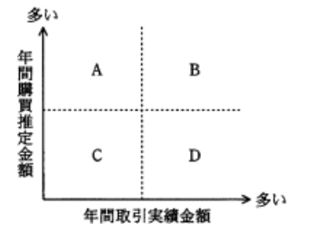

### ランダム ストラテジ系

---
事業部制組織を説明したもの

- A.**製品、地域などで構成された組織単位に、利益責任をもたせる**  
トップマネジメントの下に製品別や商品別、地域別、市場別などの単位で組織を分け、分化した組織ごとに自律的な意思決定を行う組織形態。各事業部ごとに営業・生産・開発などの職能組織があり、事業部ごとに予算や目標を持ち、独立採算が求められる

- ある問題を解決するために一定の期間に限って結成され、問題解決とともに解散する  
プロジェクト組織の説明

- 業務を機能別に分け、各機能について部下に命令、指導を行う  
職務別組織の説明

- 戦略的提携や共同開発など外部の経営資源を積極的に活用することによって、経営環境に対応していく  
アライアンスの説明

---
構成表の製品Aを300個出荷しようとするとき、部品bの正味所要量は何個か。A, a, b, cの在庫量は在庫表の通りとし、他の仕掛残、注文残、引当残などはないものとする

- A.**600**  
Aの在庫数は100個なので、200個の作成が必要。aは在庫が100個あるので、a500個と`b400個`、aの作成のために、さらに`b500個`が必要となる。bは在庫が既に300個あるため、400 + 500 - 300 = A.**600個**

---
業務の改善提案に対する資金が次の決定表で決められる。改善提案1と改善提案2に対する賞金の総額はいくらか  
改善提案1 : 改善額 20万円, 期間短縮3日  
改善提案2 : 改善額 5万円, 期間短縮2週間

- A.**2,000**  
決定表(ディジションテーブル)は、条件とその条件に対する処理や行動の関係を整理して表した表。条件を満たした場合の*Yes*、満たさない場合の*No*、実施する対応を*eXecute*でチェックする  
改善提案1 : 改善額10万円未満N, 機関短縮1週間未満Yなので、左から3列目のケースに該当し、賞金は1,000円  
改善提案2 : 改善額10万円未満Y, 機関短縮1週間未満Nなので、左から2列目のケースに該当し、賞金は1,000円

---
受注管理システムにおける要件のうち、非機能要件に該当するもの

- A.**受注管理システムの稼働率を決められた水準に維持するために、障害発生時は半日以内に回復できること**  
業務要件を実現するためにシステムに求められる機能要件以外の要件のことで、品質要求や制約要求が該当し、応答速度・ピーク時の処理能力・障害児の復旧速度・使いやすさ・セキュリティ要件などがある。制約条件の例では、使用するプログラム言語・運用スケジュール・データ保存期間・移行要件などがある

- 顧客から注文を受け付けるとき、与信残金額を計算し、結果がマイナスになった場合は、入力画面に警告メッセージを表示すること
- 受注を処理するとき、在庫切れの商品であることが分かるように担当者に警告メッセージを出力すること
- 出荷できる商品は、顧客から受注した情報を受注担当者がシステムに入力し、営業管理者が受注承認入力を行ったものに限ること  
業務をシステム上で実現するために欠かせない要件なので機能要件

---
UCS(*Universal multiple - octet Character*) - 2(*Unicode*)を説明したもの

- A.**全ての文字を2バイトで表現するコード体系であり、多くの国の文字体系に対応できる**  
ISO 10646で制定されている世界統一文字コードの規格。1文字を2バイトで表現するので、最大65536文字を割り当てられる。現在は1文字4バイトで表現し、最大4億文字を割り当てることができるUCS - 4が定義されている

- JISから派生したコード体系であり、英数字は1バイト、漢字は2バイトで表現する  
シフトJISの説明

- 主にUNIXで使用するコード体系であり、英数字は1バイト、漢字は2バイトで表現する  
EUC(*Extended Unix Code*)の説明

- 全ての文字を1バイトで表現するコード体系である  
全ての文字を2バイトで表現することを目指した文字コード体系

---
デジタルディバイドの解消のために取り組むべきこと

- A.**情報リテラシーの習得機会を増やしたり、情報通信機器や情報サービスが一層利用しやすい環境を整備したりすること**  
パソコンやインターネットなどの情報通信技術を使いこなせる者とそうでない者の間に生じる待遇や貧富、機会の格差のこと。IT技術の取得機会を増やす、学校教育での取得推進、容易に操作できる端末の開発、ネットワークインフラの整備などの実施が必要となる

- IT投資額の見積りを行い、投資目的に基づいて効果目標を設定して、効果目標ごとに目標達成の可能性を事前に評価すること  
ITガバナンスのための取り組み

- ITを活用した家電や設備などの省エネルギー化やテレワークなどによる業務の効率向上によって、エネルギー消費を削減すること  
グリーンITの取り組み

- 製品や食料品などの生産段階から最終消費段階又は廃棄段階までの全工程について、ICタグを活用して流通情報を追跡可能にすること  
トレーサビリティ確立のための取り組み

---
情報戦略の立案時に、必ず整合性を取るべき対象

- A.**中長期の経営計画**  
経営戦略の下に策定され、経営目標の達成に寄与するものでなければならない。立案時には、経営事業戦略・経営事業目標・中長期構想と整合性をとることが求められる。システム管理基準でも「情報システム全体の最適化目標を経営戦略に基づいて設定すること」「情報化投資計画は、経営戦略との整合性を考慮して策定すること」などのように経営計画との整合性の重視を強調する管理項目が挙げられている

---
SFAの説明

- A.**営業活動にITを活用して営業の効率と品質を高め、売上・利益の大幅な増加や、顧客満足度の向上を目指す手法・概念である**  
営業活動にモバイル技術やインターネット技術などのITを活用して、営業の質と効率を高め売上や利益増加に繋げようとする仕組み・システムのこと。営業日報の管理や商談管理機能(コンタクト管理、行動管理、評価・実績管理)があり、営業担当者個人の支援に加えて営業グループ内で情報共有を促進するなど、営業活動全体を支援する機能が備わっている

- 卸売業・メーカーが小売店の経営活動を支援することによって、自社との取引量の拡大につなげる手法・概念である  
リテールサポートの説明

- 企業全体の経営資源を有効かつ総合的に計画して管理し、経営の効率向上を図るための手法・概念である  
ERP(*Enterprise Resource Planning* : 企業資源計画)の説明

- 消費者向けや企業間の商取引を、インターネットなどの電子的なネットワークを活用して行う手法・概念である  
EC(*Electronic Commerce* : 電子商取引)の説明

---
図のような契約の下で、A社, B社, C社の開発要因がプロジェクトチームを組んでソフト開発業務を実施するとき、適法な行為

- A.**B社の担当者がC社の要員に業務の割り振りや作業スケジュールの指示を行う**  
派遣契約では派遣元の要員は派遣先の指揮命令の下で作業に従事することになる

- A社の担当者がB社の要員に直接作業指示を行う  
請負契約では、受注側の要員は受注側の指揮命令の下で業務を行う。そのためA社はB社の要員に直接作業指示を行うことはできない

- A社のリーダーがプロジェクトチーム全員の作業指示を行う  
A社とB社は請負契約で、B社は成果物を完成させる責任があり、方法は問われない。A社のプロジェクトの下で作業を行う必要はない

- B社の担当者が業務の進捗によってC社の要員の就業条件の調整を行う  
B社とC社に所属している要員との間に雇用関係はない。派遣元企業に所属する要員の就業条件の調整は派遣元企業が行う

---
RFIに回答した各ベンダに対してRFP(*Request for Proposal* : 提案依頼書)を提示した。今後のベンダ選定に当たって、公正に手続を進めるためにあらかじめ実施しておくこと

- A.**提案の評価基準や要求事項の適合度への重み付けをするルールを設けるなど、選定の手順を確立しておく**  
情報システムの調達を予定している企業・組織が発注先候補のITベンダに対して具体的なシステム提案をするよう求めること、それらのシステム要件や調達要件を取りまとめた文書を指す  
RFPの発行に当たり、取得者側は、提案書の評価基準や要求事項適合度の重み付けを含めて、ベンダ選択の手順を確立しておくことが望ましい

- ベンダ選定後、迅速に契約締結をするために、RFPを提示した全ベンダに内示書を発行して、契約書や作業範囲記述書の作成を依頼しておく  
契約交渉におけるユーザとベンダのバランスは、特定のベンダに内耳を与えた時点で、そのベンダ側に大きく傾くことになってしまう。公正に手続きを進めるためには内示書を発行すべきではない

- RFIの回答内容の評価が高いベンダに対して、選定から外れたときに備えて、再提案できる救済措置を講じておく
- 現行のシステムを熟知したベンダに対して、RFPの要求事項とは別に、そのベンダを選定しやすいように評価を高くしておく  
特定のベンダに対して有利な条件であるため公正な手続きとはいえない

---
表は投資目的に応じて、投資分類とKPIを整理したものである。投資目的のcに当てはまるものはどれか。選択肢はa ~ dのいずれかに入る

|投資目的|投資分類|KPI|
|------|-------|---|
|a|業務効率化投資|納期の遵守率、月次決算の所要日数|
|b|情報活用投資|提案事例の登録件数、顧客への提案件数|
|c|戦略的投資|新規事業のROI、新製品の市場シェア|
|d|IT基盤投資|システムの障害件数、検索の応答時間|

- A.**ビジネスの創出、競争優位の確立**  
ビジネス創出が新規事業のROI、競争優位の確立が新製品の市場シェアに対応し、cに該当する

- 作業プロセスの改善、作業品質の向上  
プロセスの改善が月次決算の所要日数、品質向上が納期の順守率に対応し、aに該当する

- システム維持管理コストの削減、システム性能の向上  
維持管理コストの削減がシステムの障害件数、システム性能の向上が検索の応答時間に対応し、dに該当する

- ナレッジの可視化、ナレッジの共有  
可視化が顧客への提案件数、共有が提案事例の登録件数に対応し、bに該当する

---
IoT(*Internet of Things* : モノのインターネット)の構成要素

- A.**インターネット又は閉域網に接続できる全てのものが対象となる**  
情報端末ではない電子機器や機械類などのモノにインターネット接続機能や通信機能・センサー機能を持たせ、機器が情報を相互にやり取りすることで自律的な制御を行わせる仕組みを指す。インターネットに接続でき、物理的な実体をもつ全てのものが含まれる

- アナログ式の機器を除く、デジタル式の機器が対象となる  
アナログ式であっても、取得したデータをデジタル化することでIoTを実装できる

- 自律的にデータを収集してデータ分析を行う機器だけが対象となる  
データ収集を行い、データを転送するだけのセンサーデバイス等の機器も対象となる

- 人や生物を除く、形のある全てのものが対象となる  
人間の健康状態、植物の状態をIoTで管理する例もある

---
システム開発を外部に発注する場合、受託側が契約不適合責任を負うもの

- A.**請負契約**  
売買契約や請負契約において引き渡された目的物や利害関係が契約内容に適合しない場合、売主等が買主等に負う責任のことを呼ぶ。不適合が見つかった場合、買主等は売主等に目的物の補修や不足物の引き渡しを請求したり、代金減額を請求したり、損害賠償を請求できる

- 委任契約  
特定の事務を処理することを委託する契約。事務の遂行に当たり善管注意義務はあるが、契約不適合責任はない

- パート契約  
雇用契約なので、雇用主と従業員の間に発注者の受託者の関係はない

- 派遣契約  
派遣労働者は派遣先の指揮監督の下で業務に従事するので、派遣元は仕事の結果に責任を負うことはない

---
製品開発のスピードアップ手法を次のa ~ dに分類した場合、bに相当するもの

|経営資源の確保(縦) 実現方法(横)|技術的アプローチ|組織的アプローチ|
|--------|-|-|
|組織内から|a|b|
|組織外から|c|d|

- A.**設計部門と生産部門の作業を並列に進めるコンカレントエンジニアリング**  
自社内の業務組織の改善であるため組織内の経営資源、組織的アプローチ(b)

- CAD・CAM・CAEなど既に一部利用しているツールの積極的な活用  
既に利用しているツールを使うので組織内の経営資源、コンピュータ技術を活用するため技術的アプローチ(a)

- 消費者ニーズを調査し、製品開発につなげるための市場調査会社の活用  
外部の市場調査会社を活用するので組織外の経営資源、市場ニーズの調査は技術的手法ではないため組織的アプローチ(d)

- 大学との共同研究開発や、同業他社からの技術導入  
大学や他社から技術を得るため組織外からの経営資源、技術的アプローチ(c)

---
プロダクトライフサイクルにおける成熟期の特徴

- A.**需要が大きくなり、製品の差別化や市場の細分化が明確になってくる。競争者間の競争も激化し、新品種の追加やコストダウンが重要となる**  
製品を市場に投入しえtから販売活動によって普及・成熟し、落ち込んで製品寿命が終わるまでの過程が、導入期, 成長期, 成熟期, 衰退期の順で推移していくと表現した概念。成熟期では製品改良・多様化が重要

- 市場が商品の価値を理解し始める。商品ラインもチャネルも拡大しなければならない。この時期は売上も伸びるが、投資も必要である  
成長期の特徴。他者との差別化が重要

- 需要が減ってきて、撤退する企業も出てくる。この時期の強者になれるかどうかを判断し、代替市場への進出なども考える  
衰退期の特徴。撤退時期の決定が重要

- 需要は部分的で、新規需要開拓が勝負である。特定ターゲットに対する信念に満ちた説得が必要である  
導入期の特徴。製品認知度の向上が重要

---
システムの運用設計においては、運用操作ミスを防止するために、あらゆる場合を想定した設計を行うことが大切である。これまでの経験を生かしながら、未知の状況を先読みして対処手順の検討、問題点の所在の確認を行う必要がある。これをまとめるときに活用できる手法

- A.**PDPC(*Process Decision Program Chart*)法**  
ある計画における目的達成のための全てのルートを図解で表すことで最適ルートを決定するための方法

- アローダイアグラム法  
プロジェクトの各作業間の関連性や順序関係を視覚的に表現する図

- 統計図法  
目的・目標を達成するための手段・方策を順次展開し、最適な手段・方策を追求する方法

- 連関図法  
複雑な要因の絡み合う事象について、事象間の因果関係や相互関係を整理しておくことで問題や要因を明らかにし、課題解決のための糸口を発見する手法

---
経営戦略策定に用いられるSWOT分析

- A.**競争環境における機会・脅威と事業の強み・弱みを分析する**  
今後の戦略立案に活かす手法の1つで、*Strength*(強み), *Weakness*(弱み・弱点), *Opportunity*(機会), *Threat*(脅威)の頭文字を取り、強みと弱みは企業の内部要因、機会と脅威は外部環境要因に分類される

- 競争に影響する要因と、他者の動き、自社の動きを分析する  
マクミシン理論などに代表されるゲーム理論の説明

- 市場に対するマーケティングツールの最適な組合せを分析する  
マーケティングミックスの説明

- 市場の成長性と占有率の観点から各事業の位置付けを分析する  
事業ポートフォリオ分析の説明

---
フィンテックのサービスの1つ、アカウントアグリゲーションの特徴

- A.**各金融機関のサービスに用いる、利用者のID・パスワードなどの情報をあらかじめ登録し、複数の金融機関の口座取引情報を一括表示できる**  
複数の金融機関の口座取引情報を1つのコンピュータ上に一括表示できるサービス。サービスを提供するWebサイトやスマホアプリなどに複数の口座情報等と認証情報(ID・パスワード等)を登録しておくことで、普通口座・証券口座・クレジットカード・電子マネー・店舗ポイントなどの異なる場所に分かれている資金や取引状況をまとめて閲覧が可能

- 資金移動業者として登録された企業は、少額の取引に限り、国内・海外送金サービスを提供できる  
資金移動サービスの説明

- 電子手形の受取り側が早期に債権回収することが容易になり、また、必要な分だけ債権の一部を分割して譲渡できる  
電子決済サービスの説明

- ネットショップで商品を購入した者に与信チェックを行い、問題がなければ商品代金の立替払いをすることによって、購入者は早く商品を入手できる  
エスクローサービスの説明

---
A社とB社がそれぞれ2種類の戦略を採る場合の利得が表のように予想される時、両社がそれぞれのマキシミン戦略を採った場合のA社の利得はどれか。表の各欄において、左側の数値がA社の利得、右側の数値がB社の利得とする

- A.**5**  
複数の人間による合理的な意思決定の方法を考える、ゲーム理論における戦略で、各戦略を選択した場合に`得られる最小利得が最も大きくなる戦略を選ぶ`保守的な方針  
A社の選択する戦略は、`戦略a1`を選択した場合は-15または20で最小利得は-15、`戦略a2`を選択した場合は5または0で最小利得は0となり、最小利得の値がより大きい`戦略a2`を選択する  
B社の選択する戦略は、`戦略b1`を選択した場合は15または-5で最小利得は-5、`戦略b2`を選択した場合は-20または0で最小利得は-20となり、最小利得の値がより大きい`戦略b1`を選択する  
両者が選択するのは戦略a2と戦略b1

---
著作権法で保護されるもの

- A.**コンパイラのプログラム**  
知的財産権の中でも文化・芸術に関するものにおいて、創作物・創作者に認められる権利で、著作権法はこれらを保護するための法律。情報産業ではプログラムやDBなどが著作物に該当し、保護対象

- アルゴリズム
- プログラム言語
- プロトコル  
プログラム言語そのもの、規約やプロトコル、解法・アルゴリズムは著作権保護の対象外

---
バランススコアカードの4つの視点に含まれるもの

- A.**顧客**  
企業のビジョンと戦略を実現するために業績を評価・分析する手法  
`財務の視点` : 株主や従業員などの利害関係社の期待に応えて良い業績を出すために、財務的にどのように行動すべきかの指標を設定する  
`顧客の視点` : 企業のビジョンの達成のため、顧客に対してどのように行動すべきかの指標を設定する  
`内部ビジネスプロセス(業務プロセス)の視点` : 財務的目標の達成や顧客満足度を向上させるために、優れた業務プロセスを構築するための指標を達成する  
`学習と成長の視点` : 企業のビジョンの達成のため、組織や個人としてどのように変化(改善)し能力向上を図るか指標を設定する

---
オンデマンド(*On - Demand*)型のサービス

- A.**利用者の要求に応じてインターネット上で配信される再放送のドラマ**  
オンデマンド型サービスのVOD(*Video On Demand*)の記述。利用者の求めに応じてサービスの提供を行い、利用者が好きな時に必要な量の情報や機能を受けられるように設計されたサービスを指す。インターネット環境を利用した動画配信やeラーニング、少部数の印刷に対応するオンデマンド印刷に対応するオンデマンド印刷、Webサイト、ブログなどの例がある

- インターネットサイトで購入したDVDで視聴する映画  
DVDでの視聴はサービスではない

- 出版社が部数を決めてオフセット印刷した文庫本  
製版コストが掛かるため少部数の印刷には適していない。版を使用しない印刷はオンデマンド印刷と呼ばれ、小ロットでの印刷に向いている

- 定期的に決められたスケジュールでスマートフォンに配信されるインターネットニュース  
配信時間が決められているものは、利用者がサービスを受けられる時間が制限されるため該当しない

---
インターネットオークションなどで利用されるエスクローサービスの取引モデルの5に当てはまる行為はどれか。番号は取引の順序を示す

- A.**商品受領の通知**  
エスクローサービス業社は、代金(手数料)を受け取る(2)、売主の商品発送(4)、買主の商品受領を確認(5)し、商品代金を売主に送金する(6)

- 代金の入金通知  
3に該当する

- 商品の発送  
4に該当する

- 代金の支払  
6に該当する

---
ワークフローシステムを用いて業務改善を行った時、期待できる効果

- A.**書類の申請から決裁に至る事務手続の処理速度が上がる**  
電子化された申請書や通知書を予め決められた作業手順(決裁ルート)に従い、集配信し、電子決裁処理を行うシステム。稟議・報告書・届出申請の承認手続きを電子化することで、手続きのスピード向上、業務効率化、内部統制強化を図ることが可能

---
アクセシビリティ(*Accessibility*)を説明したもの

- A.**ソフトウェアや情報サービス、Webサイトなどにおける、高齢者や障害者を含む幅広い利用者にとっての利用しやすさのこと**  
利用者が様々な製品や建物やサービスなどを支障なく利用できるか、その度合いのこと。Webサイトにおいては、そのページが情報を取得・発信できるように柔軟に設計されていて、アクセスした誰もが同様に情報を共有できるか、その度合いを意味する

- 住民基本台帳の情報をコンピュータネットワークで管理することによって、住民サービスの向上と行政事務処理の合理化を図ること  
住民基本台帳ネットワークシステムの説明

- 仕様が異なるコンピュータ間で、ネットワークなどを通じてそれぞれが管理するソフトウェアやデータを利用する際の相互運用性のこと  
インターオペラビリティの説明

- 製品や食料品など、生産段階から最終消費段階又は廃棄段階までの全工程について、履歴の追跡が可能であること  
トレーサビリティの説明

---
従業員1人当たりの勤務時間を減らして社会全体の雇用維持や雇用機会増加を図るもの

- A.**ワークシェアリング**  
人々の間で雇用を分かち合うことを意味する。1人当たりの労働時間を短縮したり仕事の配分を見直すことで労働の負荷を減らすとともに新たな雇用を生み出す取り組み  
`雇用維持型` : 企業の業績が悪化した場合に、1人当たりの労働時間を少なくすることで雇用を維持できるようにする  
`雇用創出型` : 1人のフルタイム従業員が行っていた仕事を、パートタイムなどの短時間雇用を複数人で賄うことで雇用機会を増やすタイプ

- カフェテリアプラン  
企業が用意した多彩な福利厚生サービスメニューの中から希望するサービスを従業員が自ら選べる、選択式の福利厚生制度

- フリーエージェント制  
一定の基準を満たした従業員が希望する部署・部門に対して、自ら売り込むことで異動の契機を与える人事制度

- ワークライフバランス  
仕事と生活の調和を実現する目的で多様かつ柔軟な働き方を目指す考え方

---
ソフトウェアパッケージのライセンス契約形態のうち、サイトライセンスを説明したもの

- A.**特定の企業や団体などにある複数のコンピュータでの使用を一括して認める**  
企業や学校など特定の施設(サイト)内に限り複数のコンピュータへの使用権を認めるライセンス形態。1本のソフトウェアで1つのコンピュータへの使用権が与えられる通常のライセンス契約と比較して、1ライセンスあたりの単価が低く抑えられるため、同一の施設に同じソフトウェアを大量導入するときに利用される

- 特定のサーバにインストールし、そのクライアントでの使用を認める  
サーバライセンスの説明

- 特定のコンピュータ又は一定数のコンピュータでの使用を認める
- 特定のユーザ又は一定数のユーザに使用を認める  
ボリュームライセンスの説明

---
準委任契約の説明

- A.**善管注意義務を負って作業を受託する契約**  
通常の委託契約(請負契約)と同様に委託先に業務を依頼することは同様だが、仕事の完成を契約の目的とする請負契約と異なり、業務(依頼された仕事)の実施自体を目的とする契約形態で、仕事の完成の義務は負わない。業務分析やIT戦略のコンサルティングなど、作業や事務の遂行を約束する契約であり、仕事の完成は約束されないが、委託元の求めに応じて報告の義務がある

- 成果物の対価として報酬を得る契約
- 成果物を完成させる義務を負う契約  
請負契約の説明

- 発注者の指揮命令下で作業を行う契約  
労働者派遣契約の説明

---
TLO(*Technology Licensing Organization* : 技術移転機関)の役割

- A.**大学の研究成果の特許化及び企業への技術移転の促進**  
大学や高等専門学校等における研究成果を特許化し、それを民間事業者に技術移転する法人のこと。大学等における技術に関する研究成果の民間事業者への移転の促進に関する法律(通称TLO法)に基づいて、承認・運用が行われており、2019年現在34機関が承認されている。  
大学等と民間事業者の間に立ち、大学の研究成果を特許化し、それを民間企業にライセンスしてそのロイヤリティを大学等に還元する。TLOの役割は、`大学の研究成果を特許化し、又は企業への技術移転を支援し、産学の仲介役を果たす`こと

- TLO自らが研究開発して取得した特許の、企業へのライセンス  
研究開発はTLOの関連する大学等で行う。TLOは大学等の研究成果を特許化し、企業にライセンスする役割がある

- 企業から大学への委託研究の問合せ及び申込みの受付  
研究開発はTLO承認時の実施計画の下に関連大学の主導で行う

- 新規事業又は市場への参入のための、企業の合併又は買収の支援  
技術移転を受けた中小企業に対して出資を行うことはあるが、合併・買収の支援は行わない

---
バランススコアカードの内部ビジネスプロセスにおける戦略目標と業績評価指標の例

- A.**製品の製造の生産性向上が目標であるので、製造期間短縮日数を指標とする**  
`内部ビジネスプロセス(業務プロセス)の視点` : 財務的目標の達成や顧客満足度を向上させるために、優れた業務プロセスを構築するための指標を達成する。原価率・不良率・生産性・リードタイム・サイクルタイムなど、組織の業務がどれだけ改善されたかを定量的に検証できる評価指標を設定する

- 持続的成長が目標であるので、受注残を指標とする  
`財務の視点` : 株主や従業員などの利害関係社の期待に応えて良い業績を出すために、財務的にどのように行動すべきかの指標を設定する

- 主要顧客との継続的な関係構築が目標であるので、クレーム件数を指標とする  
`顧客の視点` : 企業のビジョンの達成のため、顧客に対してどのように行動すべきかの指標を設定する

- 製品開発力の向上が目標であるので、製品開発領域の研修受講時間を指標とする  
`学習と成長の視点` : 企業のビジョンの達成のため、組織や個人としてどのように変化(改善)し能力向上を図るか指標を設定する

---
CIO(*Chief Information Officer*)が果たすべき主要な役割

- A.**情報化戦略を立案するに当たって、経営戦略を支援するために、企業全体の情報資源への投資効果を最適化するプランを策定する**  
経営戦略に沿った情報戦略や、IT投資計画に関する責任を持つ役職である最高情報責任者。CEO(最高経営責任者)、COO(最高執行責任者)を補佐し、企業の情報戦略の策定に当たるのが主な職務

- 情報システム開発・運用に関する状況を把握して、全社情報システムが最適に機能するように具体的に改善点を指示する  
システム部門責任者の役割

- 情報システムが企業活動に対して健全に機能しているかどうかを監査することによって、情報システム部門にアドバイスを与える  
システム監査人の役割

- 全社情報システムの最適な運営が行えるように、情報システムに関する問合せやトラブルに関する情報システム部門から報告を受け、担当部門に具体的指示を与える  
一般的なシステム管理者や、ヘルプデスクの責任者の役割

---
プロダクトポートフォリオマネジメント(PPM)における、花形の説明

- A.**市場成長率、市場占有率ともに高い製品である。成長に伴う投資も必要とするので、資金創出効果は大きいとは限らない**  
`花形`(*star*) : 占有率・成長率ともに高く資金の流入も大きいが、成長に伴い占有率の維持には多額の資金の投入を必要とする分野

- 市場成長率は低いが、市場占有率は高い製品である。資金創出効果が大きく、企業の支柱となる資金源である  
`金のなる木`(*cash cow*) : 市場の成長がないため追加投資が不要で、市場占有率の高さから安定した心筋・利益の流入が認められる分野

- 市場成長率は高いが、市場占有率が低い製品である。長期的な将来性を見込むことはできるが、資金創出効果の大きさは分からない  
`問題児`(*problem child*) : 成長率は高いが占有率は低いので、花形製品とするためには多額の投資が必要。投資が失敗し成長率が下がれば負け犬になってしまうため、慎重な対応が必要

- 市場成長率、市場占有率ともに低い製品である。資金創出効果は小さく、資金流出量も少ない  
`負け犬`(*dog*) : 成長率・占有率がともに低く、新たな投資による利益の増加も見込めないため市場からの撤退を検討するべき分野

---
営業損益を求める計算式

- A.**(売上高) - (売上原価) - (販売費及び一般管理費)**  
企業の主たる営業活動によって得られた利益・損失のことで、売上高から売上原価を差し引いた売上総利益から、販売費・一般管理費を差し引いて計算される

- (売上高) - (売上原価)  
売上総利益の計算方法

- (売上高) - (売上原価) - (販売費及び一般管理費) + (営業外損益)  
経常損益の計算方法

- (売上高) - (売上原価－販売費及び一般管理費) + (営業外損益) + (特別損益)  
税引前当期純利益の計算方法。ここから法人税・法人住民税・法人事業税等が引かれた額が当期純利益となる

---
T社では3種類の商品A, B, Cを販売している。現在、それぞれの商品には毎月10,000人, 20,000人, 80,000人の購入者がいる。来年から商品体系を変更して、4種類の新商品P, Q, R, Sを販売する予定である。そこで、既存の顧客が新商品を購入する割合と新規の顧客数を試算した。この試算について、適切な記述はどれか。表の各行に記載されている小数第1位までの数値が、該当する旧商品から新商品に乗り換える人の割合を表す

- A.**新商品Sの新規顧客数は、商品Cの購入者のうち新商品Sを購入する人数より少ないと予想している**  
商品Cの購入者で新商品Sを購入する人数は24,000人となり正しい説明

- 商品Aの購入者のうち、1,000人が新商品Qを購入すると予想している  
3,000人と予想される

- 商品Bの購入者は、新商品P、Q、R、Sのどれかを購入すると予想している  
商品Bの購入者が購入すると思われる新商品の割合の合計は0.9となり、同一顧客が複数種類の商品を購入することも考慮すると、残りの0.1以上の顧客は新商品を購入しない予想となる

- 新商品Pの購入見込者の5割は、商品Aの購入者であると予想している  
商品Pの購入者は20,000人と試算されている。商品Aの購入者の5割は5,000人なので、商品Pの購入者における商品Aの購入者は25%に過ぎない

---
ある工場で製品A, Bを生産している。製品Aを1トン生産するのに、原料P, Qをそれぞれ4トン, 9トン必要とし、製品Bについてもそれぞれ8トン, 6トン必要とする。製品A, Bの1トン当たりの利益は、それぞれ2万円, 3万円である。  
原料Pが40トン、Qが54トンしかない時、製品A, Bの合計の利益が最大となる生産量を求めるための線形計画問題として、定式化したものはどれか。ここで、製品A, Bの生産量をそれぞれxトン, yトンとする

- A.**条件 : 4x + 8y <= 40, 9x + 6y <= 54, x >=0, y >= 0**
- A.**目的関数 : 2x + 3y → 最大化**  
1次式を満たす変数の中で式を最大化(最小化)する値を求める方法。在庫としてもつ原材料を使用して最大利益を得るための販売量や、機械の稼働時間を最大限に生かして製造する製品など、限りある資源を最大限に活用したい場合にその組み合わせを得るために使用される  
製品A : 1トン = P : 4トン + Q : 9トン  
製品B : 1トン = P : 8トン + Q : 6トン  
Pの在庫40トンをxトンの製品Aとyトンの製品Bに割り当てる  
=> `4x + 8y = 40`  
Qの在庫54トンをxトンの製品Aとyトンの製品Bに割り当てる  
=> `9x + 6y = 54`  
製品Aの利益は2万円、製品Bの利益は3万円で、計算で求められた条件下で利益を最大化したいので、`2x + 3y → 最大化`

---
統計図法に関する説明

- A.**目的・目標を達成するための手段・方策を順次展開し、最適手段・方策を追求していく方法である**  
目的を達成する手段を見つける時に、`目的 - 手段`の連鎖を段階的に下位に掘り下げることで最適な手段を見いだす図法

- 事態の進展とともにいろいろな結果が想定される問題について、望ましい結果に至るプロセスを定める方法である  
PDPC法の説明

- 複雑な要因の絡み合う事象について、その事象間の因果関係を明らかにする方法である  
連関図法の説明

- ブレーンストーミングを行い、収集した情報で似た内容のものをグループ化し、解決すべき問題点を明確にする方法である  
親和図法の説明

---
A社の従業員がA社から出発して、取引先のB, C, D社を1回ずつ訪問してA社に戻りたい。各社間(*From - To*)の所要時間を表の通りとする、最短の巡回時間

|From \ To|A社|B社|C社|D社|
|---------|--|---|---|---|
|A社|-|20|35|40|
|B社|20|-|50|25|
|C社|35|50|-|30|
|D社|40|25|30|-|

- A.**110**  
A社を出発してA社に戻るので、3社の訪問順は6通りある  
B → C → Dの場合 : 20 + 50 + 30 + 40 = 140分  
B → D → Cの場合 : 20 + 25 + 30 + 35 = **110分**  
C → B → Dの場合 : 35 + 50 + 25 + 40 = 150分  
C → D → Bの場合 : 35 + 30 + 25 + 20 = **110分**  
D → B → Cの場合 : 40 + 25 + 50 + 35 = 150分  
D → C → Bの場合 : 40 + 30 + 50 + 20 = 140分

---
フィージビリティスタディ(*feasibility study*)の説明

- A.**新しい事業やプロジェクトなどの計画に対して、その実行可能性を評価するために調査し、検証することである**  
プロジェクトの実現可能性を事前調査・検討することをいう

- ある一定の役割を演じることによって、技術の習得、行動・価値観の理解、問題解決の能力開発などを促進することである  
ロールプレイングの説明

- 演繹的アプローチによって、目的とする機能を展開して理想システムを描き、現状を理想システムに合うように変えていく手法である  
演繹的アプローチの説明

- 複数人が集まって、他者の意見を批判せず自由に意見を出し合うことで、アイディアを創出していく手法である  
ブレーンストーミングの説明

---
不正アクセス禁止法において、不正アクセス行為に該当するもの

- A.**他人の利用者ID、パスワードを許可なく利用して、アクセス制御機能によって制限されているWebサイトにアクセスした**  
コンピュータネットワークに接続できる環境で、本人の承諾なしに他人のID・パスワード等を使って認証が必要なページに接続する行為及び本人に許可なく第三者へIDとパスワードを教えるなどの助長行為の禁止を定めた法律

- 会社の重要情報にアクセスし得る者が株式発行の決定を知り、情報の公表前に当該会社の株を売買した  
金融商品取引法上の規制される行為のインサイダー取引

- コンピュータウイルスを作成し、他人のコンピュータの画面表示をでたらめにする被害をもたらした  
電子計算機損壊等業務妨害罪に該当する行為

- 自分自身で管理運営するホームページに、昨日の新聞に載った報道写真を新聞社に無断で掲載した  
著作権侵害となる行為

---
企業活動における、BPM(*Business Process Management*)の目的

- A.**業務プロセスの継続的な改善**  
組織が繰り返し行う日々の業務で、段階的に業務プロセスの効率化や発展を目指すための管理手法。他のマネジメントプロセスと同様、業務分析及び設計 → 実行 → 監視 → 改善のPDCAサイクルを繰り返して継続的改善を実現する。BPR(*Business Process Reengineering*)が一度限りの抜本的な業務プロセスの再設計であるのに対し、BPMは継続的なプロセス改善を実現することが主な目的

- 経営資源の有効活用  
ERP(*Enterprise Resource Planning*)の目的

- 顧客情報の管理、分析  
CRM(*Customer Relationship Management*)の目的

- 情報資源の分析、有効活用  
BIツールやデータウェアハウスなどの説明

---
シェアリングエコノミーの説明

- A.**ソーシャルメディアのコミュニティ機能などを活用して、主に個人同士で、個人が保有している遊休資産を共有したり、貸し借りしたりする仕組みである**  
者やサービスを所有するのではなく、インターネット上のプラットフォームを介して個人間で使っていないモノ・場所・技能などを貸し借り・売買することで、共有していく経済の動きのこと。貸主は遊休資産の活用による収入が得られ、借主は購入や維持に関わるコスト削減をできる利点がある

- ITの活用によって経済全体の生産性が高まり、更にSCMの進展によって需給ギャップが解消されるので、インフレなき成長が持続するという概念である  
ニューエコノミーの説明

- ITを用いて、再生可能エネルギーや都市基盤の効率的な管理・運営を行い、人々の生活の質を高め、継続的な経済発展を実現するという概念である  
スマートシティの説明

- 商取引において、実店舗販売とインターネット販売を組み合わせ、それぞれの長所を生かして連携させることによって、全体の売上を拡大する仕組みである  
クリック & モルタルの説明

---
企業経営において、ステークホルダを重視する目的

- A.**顧客、株主、従業員などの利害関係者の満足度を向上させ、企業の継続した発展を図る**

- 企業存続の危機につながりかねない、経営者や従業員による不祥事の発生を抑制する  
コンプライアンス強化の目的

- 競合他社に対する差別化の源泉となる経営資源を保有し、競争力を強化する  
コアコンピタンス経営の説明

- 経営者の権力行使をけん制し、健全な経営を行うことができる仕組みを作る  
コーポレートガバナンスの目的

---
SCM(*Supply Chain Management*)の目的

- A.**調達から販売までの複数の企業や組織にまたがる情報を統合的に管理することによって、コスト低減や納期短縮などを目的とする**  
生産・在庫・購買・物流などの全ての情報をリアルタイムに交換・一元管理することで生産から販売に至る一連の流れ全体の効率を向上させることを目指す経営管理手法。脳筋短縮や在庫削減といった効果が期待できる

- 顧客情報や購買履歴、クレームなどを一元管理し、きめ細かな顧客対応を行うことによって、良好な顧客関係の構築を目的とする  
CRM(*Customer Resolutionship Management*)の説明

- 顧客情報や商談スケジュール、進捗状況などの商談状況を一元管理することによって、営業活動の効率向上を目的とする  
SFA(*Sales Force Automation*)の説明

- 生産や販売、在庫、会計など基幹業務のあらゆる情報を統合管理することによって、経営効率の向上を目的とする  
ERP(*Enterprise Resource Planning*)の説明

---
JIS X 0160(ソフトウェアライフサイクルプロセス : SLCP)では、ソフトウェアの取引における供給者の責任だけでなく、購入者の責任も規定している。購入者側の責任として適切なもの

- A.**受入基準及び手続の明確化**  
共通フレームとも呼ばれ、ソフトウェア取引において取得者と供給者の双方の目安とするためにソフトウェアのライフサイクルを可視化し、共通の物差しを規定したもの。購入者側では、受入対象品・受入範囲、受入の判断基準、受入期間などの方針及び条件(基準)を定義し、文書化することが望ましい

---
SFA(*Sales Force Automation*)の基本機能の1つのコンタクト管理について説明しているもの

- A.**顧客訪問日、営業結果などの履歴を管理し、見込客や既存客に対して効果的な営業活動を行う**  
IT技術やネットワーク技術を活用して、営業部門の業務を支援し営業成績の向上を図る経営手法。顧客との商談の記録を残しておく機能で、商談の進捗(経緯)を管理することを目的とし、進捗状況を営業部門全体で共有することにより部門全体で戦略的な営業方法を策案することも可能

---
ある製品の設定価格と需要の関係が1次式で表せる時、`a`に入れる適切な数値  
(1) : 設定価格を3,000円にすると、需要は0個になる  
(2) : 設定価格を1,000円にすると、需要は60,000個になる  
(3) : 設定価格を1,500円にすると、需要は`a`個になる

- A.**45,000**  
y = ax + bが成り立つ。設定価格をx、需要をyとして連立方程式を作成する  
0 = 3,000a + b(1)
60,000 = 1,000a + b(2)  
(1)より`b = -3,000a`なので、(2)に代入すると、  
-2,000a = 60,000  
`a = -3,000`, `b = 9,000,000`  
`y = -3,000x + 9,000,000`に設定価格1,500円(x)を代入すると、y = -4,500,000 + 9,000,000 = **45,000**

---
サイバーセキュリティ基本法の説明

- A.**国民に対し、サイバーセキュリティの重要性につき関心と理解を深め、その確保に必要な注意を払うよう努めることを求める規定がある**  
日本国におけるサイバーセキュリティに関する施策の推進にあたっての基本理念、及び国及び地方公共団体の責務等を明らかにし、サイバーセキュリティ戦略の策定その他サイバーセキュリティに関する施策の基本となる事項を定めた法律

- サイバーセキュリティに関する国及び情報通信事業者の責務を定めたものであり、地方公共団体や教育研究機関についての言及はない  
地方公共団体の責務や教育研究機関の責務にも言及されている

- サイバーセキュリティに関する国及び地方公共団体の責務を定めたものであり、民間事業者が努力すべき事項についての規定はない  
重要社会基盤事業者、サイバー関連事業者及びその他の事業者の責務についても言及されている

- 地方公共団体を"重要社会基盤事業者"と位置づけ、サイバーセキュリティ関連施策の立案・実施に責任を負うと規定している  
立案・実施に責任を負うのは国と規定されている。"重要社会基盤事業者"は道路・鉄道・上下水道・送電網・港湾・ダム・通信施設などの「国民生活及び経済活動の基盤であって、その機能が停止し、又は低下した場合に国民生活又は経済活動に多大な影響を及ぼすおそれが生ずるものに関する事業を行う者」と定義されているため、重要社会基盤事業者 = 地方公共団体ではない

---
PLM(*Product Lifecycle Management*)の目的

- A.**製品開発・製造・販売・保守・リサイクルに至る製造業のプロセスにおいて、製品に関連する情報を一元管理し、商品力向上やコスト低減を図る**

- NC工作機械・自動搬送装置・倉庫などを有機的に結合し、コンピュータで集中管理することで多品種少量生産に対応できる生産の自動化を実現する  
FMS(*Flexible Manufacturing System*)の目的

- 製品の生産計画に基づいてその生産に必要な資材の所要量を展開し、これを基準にして資材の需要とその発注時期を算出する  
MRP(*Materials Requirements Planning*)の目的

- 部品の供給から製品の販売までの一連のプロセスの情報をリアルタイムで交換することによって、在庫の削減とリードタイムの短縮を実現する  
SCMの説明

---
ROE(*Return on Equity* : 自己資本比率)を説明したもの

- A.**自己資本に対する収益性を示す指標**  
ある企業が、年間の企業活動を通じて「株主の投資額に比してどれだけ効率的に利益を獲得したか」を判断するのに用いられる指標。株主資本に対する利益の割合なので、株主が投資を行うときの目安の1つとなる

- 企業が保有する総資産に対する収益性を示す指標  
総資産利益率(*Return On Asset* : ROA)の説明。当期純損益を総資産で割った数値で、収益性と効率性を同時に示す指標

- 自己資本と総資本の比率から、財務体質の健全性を示す指標  
自己資本比率の説明。数値が高いほど負債(借金)が少なく、一般に健全な経営と判断される

- 自己資本と他人資本の有効活用の度合いを計る指標  
総資本回転率の説明。1年間に売上によって総資本が何度入れ替わったかを表す指標で、大きいほど効率良く売上を生んでいる企業であると言える

---
エンタープライズアーキテクチャ(*Enterprise Architecture*)の"4つの分類体系"に含まれるアーキテクチャは、ビジネスアーキテクチャ、テクノロジアーキテクチャ、アプリケーションアーキテクチャともう1つはどれか

- A.**データアーキテクチャ**  
組織の全体最適化の観点より、業務及びシステム双方の改革を実践するために、業務システムを統一的な手法でモデル化し、改善を目的とした設計・管理手法。EAではモデリングにより業務とシステムの形状(*As - Is*)とあるべき姿(*To - Be*)を整理し、あるべき姿の実現を目指して改善を図る。大企業や政府機関などの巨大な組織の業務手順・情報システムの標準化、組織の最適化を進めることによる経営効率化を図るための方法論として活用される  
`ビジネス・アーキテクチャ 政策・業務体系` : 政策・業務内容・実施主体・業務フロー等(説明書・構成図など)について、共通化・合理化など実現すべき姿を体系的に示したもの  
`データ・アーキテクチャ データ体系` : 各業務・システムにおいて利用される情報・システム上のデータ内容、各情報(データ : クラス図、エンティティ、リレーション図など)間の関連性を体系的に示したもの  
`アプリケーション・アーキテクチャ 処理体系` : 業務処理に最適な情報システムの形態(情報システム関連図、機能構成図など)を体系的に示したもの  
`テクノロジ・アーキテクチャ 技術体系` : システムを構築する際に利用する諸々の技術的構成要素(ハード・ソフト・ネットワーク等)を体系的に示したもの

---
HEMS(*Home Energy Management System*)の説明

- A.**複数の家電製品をネットワークでつなぎ、電力の可視化及び電力消費の最適制御を行うシステム**  
家庭で使用されるあらゆる電気機器をネットワークとして繋ぎ、エネルギー消費量を可視化しつつ積極的な制御を行うことで、省エネやピークカットの効果を目指す仕組み。政府は2030年までに全ての住宅にHEMSを設置することを目指している

- 太陽光発電システム及び家庭用燃料電池が発電した電気を、家庭などで利用できるように変換するシステム  
パワーコンディショナの説明

- 廃棄物の減量及び資源の有効利用推進のために、一般家庭及び事務所から排出された家電製品の有用な部分をリサイクルするシステム  
家電リサイクルの説明

- ヒートポンプを利用して、より少ないエネルギーで大きな熱量を発生させる電気給湯システム  
自然冷媒ヒートポンプ給湯器(エコキュート)の説明

---
ワンチップマイコンの内蔵メモリとしてフラッシュメモリが採用されている理由

- A.**マイコン出荷後もソフトウェアの書換えが可能である**  
組込みシステムの内蔵メモリとして従来からあるマスクROMはデータ保護ができる反面、出荷後に書換えはできず、アップデートにはROMの交換など莫大なコストを要することになる  
フラッシュメモリの登場により、機器のフタを開けなくてもユーザが電子的な操作だけでデータ書換えができるISP(*In - System Programming*)が可能になり、出荷後のアップデートが以前よりも容易に行えるようになっている

---
アンゾフの成長マトリクスにおける多角化戦略に当てはまるもの

- A.**技術開発、業務提携、M & Aなどで、新たな製品や市場での成長の機会を求める**  
`多角化(新規製品・新規市場)` : 現在の事業と関係ない分野に進出することで成長を図る戦略  
事業が成長・発展できる経営戦略を検討するために適したフレームワーク

- 現在の市場で現有製品の広告、宣伝を強化し、顧客の購入頻度や購入量を増やす  
`市場浸透戦略(既存製品・既存市場)` : 他社のマーケットシェアを奪ったり、自社の優良顧客を増やすことで成長を図る戦略

- 新たな機能を付加した製品や新規に開発した製品を、現在の市場に投入する  
`製品開発戦略(新規製品・既存市場)` : 現在の顧客に対して新製品を提案することで成長を図る戦略

- 現有製品で海外市場に進出し、新たな市場セグメントの開拓を図る  
`市場開拓戦略(既存製品・新規市場)` : 現状の製品の新顧客に提案することで成長を図る戦略

---
EDI(*Electronic Data Interchange*)を実施するための情報表現規約で規定されるべきもの

- A.**メッセージの形式**  
異なる組織に設置されている端末間で、通信回線を介して取引のためのメッセージ(データ)を交換すること、そのための仕組み  
`情報伝達規約(レベル1)` : ネットワーク回線や伝送手順など、文字通り情報をやり取りするための取り決め  
`情報表現規約(レベル2)` : データの構造や項目など、表現法のルールなど情報データを互いのコンピュータで理解できるようにするための取り決め  
`業務運用規約(レベル3)` : どんな情報をやり取りするか、  情報の訂正方法やエラーの扱いなどの業務やシステムの運用に関する取り決め  
`取引基本規約(レベル4)` : 検収時期、支払時期、支払方法などEDIにおける取引の法的有効性を確立するための取り決め

---
ビッグデータを有効活用し、事業価値を生み出す役割を担う専門人材であるデータサイエンティストに求められるスキルセットを表の3つの領域と定義した。データサイエンス力に該当する具体的なスキル

||データサイエンティストに求められるスキルセット|
|-|-------------------------------------|
|ビジネス力|課題の背景を理解した上で、ビジネス課題を整理・分析し、解決する力|
|データサイエンス力|人工知能や統計学などの情報科学に関する知識を用いて、予測・検定・関係性の把握及びデータ加工・可視化する力|
|データエンジニアリング力|データ分析によって作成したモデルを使えるように、分析システムを実装・運用する力|

- A.**分析要件に応じ、決定木分析、ニューラルネットワークなどのモデリング手法の選択、モデルへのパラメータの設定、分析結果の評価ができる**  
ビッグデータなどの大量のデータを、数学的・統計学的・機械学習・データマイニングなどの様々な手法を分析し、ビジネス上の課題解決を支援する職種。分析対象及び目的に適した分析手法を選択できる能力なので、データサイエンス力に該当する

- 事業モデル、バリューチェーンなどの特徴や事業の主たる課題を自力で構造的に理解でき、問題の大枠を整理できる  
事業分析能力に関する事柄なので、ビジネス力に該当する

- 扱うデータの規模や機密性を理解した上で、分析システムをオンプレミスで構築するか、クラウドサービスを利用して構築するかを判断し、設計できる  
分析システムの構築に関する事柄なので、データエンジニアリング力に該当する

- 分散処理のフレームワークを用いて、計算処理を複数サーバに分散させる並列処理システムを設計できる  
分析システムの構築に関する事柄なので、データエンジニアリング力に該当する

---
インターネットオークションにおいて、出品者と落札者の間の決済で使用されるエスクローサービス

- A.**決済を仲介し、落札者から送金を受け、商品の受渡し完了後に出品者へ送金を行う仕組みのこと**  
電子商取引において、信頼できる中立的な第三者が契約当事者の間に入ることで、支払いや商品発送などの安全性を確保する仲介サービス。仲介業者を依頼されたエスクローサービス業者は、買主から代金と手数料を受け取り、商品発送を確認、代金を売主に送金の流れで取引を仲介し、買主・売主にとって安全な取引を保証する。ネットオークションでは個人同士の取引によるトラブルの可能性もあるため、オプションとしてエスクローサービスの利用が可能な場合がある

- 決済に関する情報の利用に関して、情報の保護基準が守られているかを第三者機関によって監視する仕組みのこと  
PCIデータセキュリティスタンダード(PCI DSS)の説明

- 決済に関する電子メールなどの情報交換において、送信元とメールアドレスが正常であることを認証する仕組みのこと  
SPF(*Sender Policy Framework*)やDKIM(*DomainKeys Identified Mail*)に関する記述

- 決済に使用されるクレジットカード情報を暗号化したり、正規のショップであることを認証局によって確認したりすることによって、取引の安全を確保する仕組みのこと  
SET(*Secure Electronic Transactions*)の説明

---
社内の業務システムの要件定義の合意形成の対象者に含まれるもの

- A.**システムの運用・保守を担当している社内部門の責任者**  
利用部門を代表して合意を得る必要がある人物に該当する  
要件定義は、システム化の企画に基づいて、システムで実現すべき業務、その業務を実現するためにシステムに必要な機能、システムに求められる性能や特性を明らかにし、利用関係者と合意するプロセス。利用関係者には、利用者・運用者・支援者・開発者・製作者・教育訓練者・保守者・取得者などが含まれる  
開発しようとしているシステムは社内の業務システムなので、システムの利用者となるのは社内のユーザ部門ということになるため、完成したシステムを運用・保守することとなる社内部門の責任者の合意が必要。要件定義に利用部門の者が参加することで、利用者の要求が過不足なく反映されているかを確認でき、システムの完成後のトラブルを予防できる

- 開発要員を派遣している派遣元の責任者  
開発要員は利害関係者に含まれるが、その要員を派遣している派遣元の責任者は利用関係者に含まれない

- 当システムのRFP発行先の全てのベンダーの責任者  
システム開発をベンダに依頼する場合でも、要件定義の合意は契約を行うこととなるベンダのみで足りる。提案依頼を出した全てのベンダの合意を得る必要はない

- プロジェクト管理で使用する進捗管理ツールの提供元の責任者  
利用関係者に含まれない

---
EC(*Electronic Commerce*)におけるB to Cに該当するもの

- A.**バーチャルモール**  
アマゾンや楽天などの複数の電子商店が集まったWebサイトのこと

- CALS(*Computer Aided Logistics Support*)  
製品情報をDBで一元管理し共有することで、製品のコスト削減や生産性向上を図ることを目指す概念を表す

- Web - EDI(*Web Electronic Data Interchange*)  
EDIは専用のネットワークで情報を交換するが、Web - EDIはインターネット技術を用いた企業間商取引を表す。SSLやVPNなどの技術を使用することで、安全性を保ちつつ専用線を用いるよりコストダウンができる利点がある

- バーチャルカンパニー  
事務所をもたずにインターネット上で活動を行う企業形態

---
損益分岐点の特性の説明

- A.**損益分岐点での売上高は、固定費と変動費の和に等しい**  
`損益分岐点 = 固定費 / (1 - 変動比率)`が成り立つ。固定費または変動比率が小さいほど、損益分岐点は低くなる

- 固定費が変わらないとき、変動費率が低くなると損益分岐点は高くなる  
変動比率が低くなると損益分岐点も低くなる

- 固定費が変わらないとき、変動費率の変化と損益分岐点の変化は正比例する  
変化は大きくなるが正比例はしない

- 変動費率が変わらないとき、固定費が小さくなると損益分岐点は高くなる  
固定費が小さくなると損益分岐点は低くなる

---
"システム管理基準"によれば、情報システム全体の最適化目標を設定する際の着眼点

- A.**経営戦略への貢献を明確にしていること**  
情報戦略を立案し、効果的な情報システム投資とリスクを低減するためのコントロールを適切に整備・運用するための事項を取りまとめたもの。全体最適化計画は、経営戦略に基づいて設定され組織体全体の情報システムのあるべき姿を明確にし、投資効果とリスク算定の方法を明確にするなどの目的で策定される。策定の際には、組織体の長の承認・利害関係者の合意を得る必要がある

- 教育及び訓練に必要な資源を明確にしていること  
開発企画についての基準

- システム保守手順に基づきプログラムの変更を行っていること  
保守の実施についての基準

- 人的資源の外部からの調達方針を明確にしていること  
人的資源管理の方針についての基準

---
取引先ごとに、取引先企業の年間購買推定金額と自社との年間取引実績金額をグラフ上にプロットした。今後の営業方針に関する記述

- A.**領域Aの取引先は、大口顧客となる可能性を秘めており、営業を強化する方がよい**  
購買推定金額が大きい割に自社との取引は多くない。営業を強化することで自社との取引を拡大できる可能性がある

- 領域Bの取引先は、固定客と見てよく、営業力の投入を最小限に抑えておく方がよい  
購買推定金額、自社との取引金額ともに多く大口顧客と言える。この状態を維持するために営業を継続する策が適切

- 領域Cの取引先は、大口顧客になる可能性は低いが、固定客になる可能性を秘めており、営業を強化する方がよい  
購買推定金額、自社との取引金額ともに少ないため大口顧客になる可能性は低い。営業費を最小限に抑える策が適切

- 領域Dの取引先は、一層の取引増加が見込まれ、営業を強化する方がよい  
購買推定金額が小さく自社との取引金額は高い。購買推定金額が少なく、購買の大部分は自社との取引のため、取引増加は期待できそうにない

---
キャッシュフロー計算書において、営業活動によるキャッシュフローに該当するもの

- A.**商品の仕入れによる支出**  
`営業活動によるキャッシュフロー` : 商品・サービスの販売による収入や仕入・管理による支出など、企業の本業に係る事項を記載する区分

- 有形固定資産の売却による収入  
`投資活動によるキャッシュフロー` : 固定資産の取得・売却、有価証券の取得売却など、企業が行った投資活動に係る事項を記載する区分

- 株式の発行による収入
- 短期借入金の返済による支出  
`財務活動によるキャッシュフロー` : 株式や社債の発行、自己株式の取得、社債の返還・借入金の返済・支払利息など、資金調達や返済に係る項目を記載する区分

---
図は2つの会社の損益分岐点を示したものである。A社とB社の損益分岐点に関する記述

- A.**A社はB社より変動費率が小さいので、損益分岐点を超えた等しい売上高のとき、B社に比べて利益が大きい**  
売上高と費用の合計が等しく利益が0となる売上高のこと。費用は売上高の大小に関わらず一定してかかる固定費と、売上高の増加に比例して増加する変動費の2つに分類できる。売上高0の状態で発生している費用が固定費がA社では70、B社では30で、変動費 = 売上高 - 固定費なので変動比率はA社の方が小さい

- A社、B社ともに損益分岐点を超えた等しい売上高のとき、固定費の少ないB社の方がA社よりも利益が大きい  
固定費の多さは関係なく、損益分岐点を超えると変動比率の低いA社の利益が多くなる

- 両社の損益分岐点は等しいので、等しい利益を生み出すために必要な売上高は両社とも等しい  
損益分岐点前後の利益は売上高によって異なる

- 両社は損益分岐点が等しく、固定費も等しいので、売上高が等しければ、損益も等しい  
固定費は両社で異なる

---
IT投資に対する評価指標の設定に際し、バランススコアカードの手法を用いてKPIを設定する場合、内部ビジネスプロセスの視点に立ったKPIの例

- A.**注文受付から製品出荷までの日数を3日短縮とする**  
`内部ビジネスプロセス(業務プロセス)の視点` : 財務的目標の達成や顧客満足度を向上させるために、優れた業務プロセスを構築するための指標を達成する。原価率・不良率・生産性・リードタイム・サイクルタイムなど、組織の業務がどれだけ改善されたかを定量的に検証できる評価指標を設定する

- 売上高営業利益率を前年比5%アップとする  
`財務の視点` : 株主や従業員などの利害関係社の期待に応えて良い業績を出すために、財務的にどのように行動すべきかの指標を設定する。KPIの例ではROA, ROE, 株価, 売上高利益率などが挙げられる

- 顧客クレーム件数を1ヶ月当たり20件以内とする  
`顧客の視点` : 企業のビジョンの達成のため、顧客に対してどのように行動すべきかの指標を設定する。KPIの例では顧客満足度、成約率、客単価、クレーム件数などが挙げられる

- 新ステムの利用者研修会の受講率を100%とする  
`学習と成長の視点` : 企業のビジョンの達成のため、組織や個人としてどのように変化(改善)し能力向上を図るか指標を設定する。KPIの例では年間教育 / 訓練時間、資格取得数、特許取得数、従業員満足度などが挙げられる

---
新製品の設定価格と価格での予測需要との関係を表にした。最大利益が見込める新製品の設定価格はどれか。いずれの場合にも、次の費用が発生するものとする  
固定費 : 1,000,000円, 変動費 : 600円 / 個

|新製品の設定価格(円)|新製品の予測需要(個)|
|-----------------|-----------------|
|1,000|80,000|
|1,200|70,000|
|1,400|60,000|
|1,600|50,000|

- A.**1,600**  
利益は売上 - 費用で計算できる。固定費と変動費が決められているので、`利益 = 価格 * 販売個数 - (固定費 + 変動費 * 販売個数)`で求められる  
1,600 * 50,000 - (1,000,000 + 600 * 50,000) = 49,000,000

- 1,000  
1,000 * 80,000 - (1,000,000 + 600 * 80,000) = 31,000,000

- 1,200  
1,200 * 70,000 - (1,000,000 + 600 * 70,000) = 41,000,000

- 1,400  
1,400 * 60,000 - (1,000,000 + 600 * 60,000) = 47,000,000

---
契約タイプで一括請負契約に属するもの

- A.**契約で合意した内容を実現するために、指定された期日までに決められた価格で作成された成果物に対して対価が支払われる**  
請負人が仕事を完成することを約束し、注文者が仕事の成果物に対して報酬を支払うことを内容とする契約

- 請け負った作業の履行に対するコストが償還され、更にプロジェクトのコスト見積りに対して一定比率の固定フィーを受け取る  
実費償還契約の1つのコストプラス定額フィー契約(CPFF契約)の説明

- 請け負った作業の履行に対するコストが償還され、事前に取り決めたフィーと、契約で定めたパフォーマンス目標レベルの達成度に応じたインセンティブを受け取る  
実費償還契約の1つのコストプラスインセンティブフィー契約(CPIF契約)の説明

- 契約で合意した内容を実現するために、実施された労務に対する対価が支払われる  
タイムアンドマテリアル契約(TM契約)の説明

---
情報システムを調達する場合、bに入るもの  
a : 発注元はベンダにシステム化の目的や業務内容などを示し、情報提供を依頼する  
b : 発注元はベンダに調達対象システム、到達条件などを示し、提案書の提出を依頼する  
c : 発注元はベンダの提案書・能力に基づいて、調達先を決定する  
d : 発注元と調達先の役割や責任分担などを、文書で相互に確認する

- A.**RFP**(*Request for Proposal* : 提案依頼書)  
企業が発注先となるITベンダに対して具体的なシステム提案をするように求めること。システム要件や調達要件を取りまとめた文書のこと。  
RFI(*Request for Information* : 提案依頼書)は企業・組織がシステム調達や業務委託をする場合や、初めての取引となるベンダー企業に対して`情報の提供を依頼すること`、またはその際に提出される文書のこと。相手方が保有する技術・経験や、情報技術動向、導入予定のシステムが技術的に実現可能であるかなどを確認することができる。  
一般的な順序として相手の情報を得てから提案を依頼し、その後委託先の選定を経て、契約の締結という流れが適切なので、aから順にRFI、RFP、供給者の選定、契約の締結となる

---
コストプラス価格決定法を説明したもの

- A.**製造原価又は仕入原価に一定のマージンを乗せて価格を決定する**  
製品コストに一致の利幅を加えて製品価格とするコスト志向型の価格設定法。製品価格 = 売上原価 + 間接費 + 利益で表す

- 買い手が認める品質や価格をリサーチし、訴求力のある価格を決定する  
需要価格設定法の説明

- 業界の平均水準や競合企業の設定価格を参考に、競争力のある価格を決定する  
市場価格追随法の説明

- 目標販売量を基に、総費用吸収後に一定の利益率を確保できる価格を決定する  
目標利益法の説明

---
情報戦略における全体最適化策定の段階で、業務モデルを定義する目的

- A.**企業の全体業務と使用される情報の関連を整理し、情報システムのあるべき姿を明確化すること**  
組織体全体の情報システムは、個別の情報システムが有機的に関連し、生合成が相互に保たれ、効率的かつ効果的に目的に達成するものでなければならない(全6項目)。全体最適化では、経営要求や現状分析結果を基に情報システム導入後の業務形態・業務組織を検討し、目標とすべき新しい全体像(新業務モデル)を定義する  
・ITガバナンスの方針の明確化  
・情報化投資、情報化構想の決定における原則を定める  
・情報システム全体の最適化目標を経営戦略に基づいて設定する  
・システム化によって生ずる組織及び業務変更の方針を明確にする  
・情報セキュリティ基本方針を明確にする

- システム化の範囲や開発規模を把握し、システム化に要する期間、開発工数、開発費用を見積もること  
システム化計画を策定する目的

- 情報システムの構築のために必要なハードウェア、ソフトウェア、ネットワークなどの構成要素を洗い出すこと  
システム方式設計の目的

- 情報システムを実際に運用するために必要なユーザマニュアルや運用マニュアルを作成するために、業務手順を確認すること  
ソフトウェア要件定義の目的

---
ある製品ロットの抜き取り検査の結果を表すOC(*Operating Characteristic curve*)曲線(検査特性曲線)である。この図が表しているものはどれか

- A.**p2％よりも大きい不良率のロットが合格する確率は、L2以下である**  
製品の抜き取り検査をする際のロットの不良率と合格率の関係を表したもの。ロットの不良率がnである場合にロットの合格率が一意に決まることを示す

- p1％よりも大きい不良率のロットが合格する確率は、L1以上である  
L1以下になる

- p1％よりも小さい不良率のロットが不合格となる確率は、1.0 - L1以上である  
1 - L1以下になる

- p2％よりも小さい不良率のロットが不合格となる確率は、L2以下である  
1 - L2以下になる
