### ランダム テクノロジ系

- マネジメント系  
https://github.com/I-Kouta/FE/blob/main/category/management.md

- ストラテジ系  
https://github.com/I-Kouta/FE/blob/main/category/strategy.md

---
負数を2の補数で表す時、全てのビットが1であるnビットの2進数"1111…11"が表す数値、その数式

- A.**-1**  
2の補数表現された負数の絶対値を求めるには、2進数の整数を2の補数表現に変換するために行う、全ビット反転してから1足す手順を再度実行する  
全ビットが1の負数"1111"の場合、  
全ビットを反転 1111 → 0000 → (1を足す) → 0001  
絶対値が1の負数、つまり2の補数表現での1111は10進数では **−1**

- $-2^{n-1}-1$  
2の補数表現で"1000…01"の場合

- 0  
2の補数表現(または2進数)で"0000…00"の場合

- $2^n-1$  
2の補数表現で"0111…11"の場合

---
次の計算は何進法で成立するか  
`131 - 45 = 53`

- A.**7**  
10進法の引き算と同様に1番小さい位から計算する  
$11-5=3$  
$n+1-5=3$  
$n=7$

---
10進数の演算式`7 / 32`の結果を2進数で表したもの

- A.**0.00111**  
```math
\frac{7}{32} = \frac{4}{32}(\frac{1}{8}) + \frac{2}{32}(\frac{1}{16}) + \frac{1}{32}
```

---
$(1+α)^n$の計算を、$1+n*α$で近似計算できる条件

- A.**|α|が1に比べて非常に小さい**  
αの絶対値が十分小さければ近似計算が成り立つ

- |α|が n に比べて非常に大きい
- |α + n|が1より大きい
- |n * α|が1より大きい  
近似計算として成り立たない

---
16進数の小数0.248を10進数の分数で表したもの

- A.**73 / 512**  
16進数の小数点以下の部分を10進数で表すと、小数第一位が1 / 16、小数第二位が1 / 256、と桁が1つ小さくなるごとに1 / 16ずつ小さくなっていく  
$2/16+4/256+8/(256*16)$  
$=(64+8+1)/512$  
$=73/512$

---
負数を2の補数で表す8ビットの数値がある。この値を10進数で表現すると−100である。符号なしの数値として解釈した時の10進数でいくらか

- A.**156**  
正の数の2の補数を求めるには、全ビットの反転して1を加える。100を2進数で変換すると`01100100`なので、−100はこのビット列を反転したものに1を加えて表現した`10011100`(156)

---
最上位をパリティビットとする8ビット符号において、パリティビット以外の下位7ビットを得るためのビット演算

- A.**16進数`7F`とのANDをとる**  
論理積(AND)で特定位置のビットを取り出す操作。被演算ビットが0であれば結果が0、1であれば結果が1となり、被演算ビットがそのまま結果に反映される。下位7ビットを取り出したいので、最上位ビット以外を1としたビット列と論理積をとることで下位7ビットを取り出せる  
1010 1010  
0111 1111  
\--------  
0010 1010

- 16進数`0F`とのANDをとる  
下位4ビットしか取り出せない  
1010 1010  
0000 1111  
\--------  
0000 1111

- 16進数`0F`とのORをとる  
上位4ビットしか取り出せない  
1010 1010  
0000 1111  
\--------  
1010 1111

- 16進数`FF`とのXORをとる  
排他的論理和(XOR)を用いて特定位置のビットを反転させる操作  
1010 1010  
1111 1111  
\--------  
0101 0101

---
pを2以上の整数とする。任意の整数nに対して、$n=kp+m(0≦m<p)$を満たすkとmが一意に存在する。mをnのpによる余剰と呼び、`n mod p`で表す  
$(-10000)mod32768$に等しくなるもの

- A.**22768 mod 32768**  
nは除算の割られる数、pは割る数、kは商、mは余剰を表す  
$-10000=32768k+m$  
$k=-1$を代入すると$m=22768$(余剰)となる

- -(10000 mod 32768)  
余剰は-10000になる

- (-22768) mod 32768
- 10000 mod 32768  
余剰は10000になる

---
列中の少なくとも1つは1であるビット列が与えられた時、最も右にある1を残して他のビットを全て0にするアルゴリズムである。`00101000`が与えられた時、`00001000`が求まる。`a`に入る論理演算子はどれか  
1.与えられたビット列Aを符号なしの2進数とし、Aから1を引き、結果をBとする  
2.AとBの排他的論理和(XOR)を求め、結果をCとする  
3.AとCの`a`を求める

- A.**論理積(AND)**  
1.00101000から1引いた結果B -> `00100111`  
2.A(00101000)とB(00100111)の排他的論理和C -> `00001111`  
3.`00101000`(A) AND `00001111`(C) -> **`00001000`**(全て1の場合は1)

- 排他的論理和(XOR)  
`00101000` XOR `00001111` -> `00100111`(片方だけ1なら1)

- 否定論理積(NAND)  
`00101000` NAND `00001111` -> `11110111`(全て1の場合は0)

- 論理和(OR)  
`00101000` OR `00001111` -> `00101111`(片方でも1なら1)

---
ハッシュ表探索において、同一のハッシュ値となる確率が最も低くなるのは、ハッシュ値がどの分布で近似される時か

- A.**一様分布**  
格納する値からハッシュ関数でハッシュ値(格納アドレス)を計算する。計算結果が同一のハッシュ値になる確率を下げるには、ハッシュ値が散らばっていることが重要。一様分布では分布中のどこも要素の散り方が一定

---
0000 - 4999のアドレスをもつハッシュ表があり、レコードのキー値からアドレスに変換するアルゴリズムとして基数変換法を用いる。キー値が55550のアドレスはどれか。基数変換法は、キー値を11進数とみなし、10進数に変換した後、下4桁に対して0.5乗じた結果(小数点以下は切捨て)をレコードのアドレスとする

- A.**0260**  
11進数55550を10進数に変換する  
-> $11^1*5+11^2*5+11^3*5+11^4*5$  
$=55(1+11+121+1331)$  
$=55*1464=80520$  
下4桁0520に0.5を乗じて**0260**

---
表探索におけるハッシュ法の特徴

- A.**キーの関数値によって格納場所を決める**  
データの探索キーの値からデータの格納位置をハッシュ関数を用いて直接計算する方法。線形探索法や2分探索法とは異なり常に一定時間で目的のデータを探索可能。ハッシュ法では異なるキー値から同じ格納場所が計算されることがあり、本来格納されるべき所に格納できない事態が発生することもある

- 2分木を用いる方法の一種  
2分探索法の説明

- 格納場所の衝突が発生しない方法である  
別のキー値から同一の格納アドレスが求められてしまうことがある

- 探索に要する時間は表全体の大きさにほぼ比例する  
探索時間は表全体の大きさに関わらず常に一定

---
キーxのハッシュ関数として、h(x) = mod(x, 97)を用いる時、キー1094とハッシュ値が一致するものは、キー1-1000で幾つあるか。mod(x, 97)はxを97で割った余りを表す

- A.**11**  
ハッシュ法は、レコードのキー値とハッシュ関数を用いて格納アドレスを計算で求める方法。キー値の衝突(シノニム)を避けるため、ある程度大きなメモリ領域が必要となるが、基本的に1回の探索で目的のデータを見つけられる  
h(1094) = mod(1094, 97) = 1094 % 97 = 27  
割り算の商をnとすると、97で割った余りが27となる数は`97n + 27`となるので、  
$97n+27≦1000$  
$97n≦973$  
$n≦10.0…$  
$n=0,1,2,…,10$  
nは整数かつ0以上なので、ハッシュ値が一致するものは11個ある

---
数値を2進数で格納するレジスタがある。このレジスタに正の整数xを設定した後、"レジスタの値を2ビット左にシフトして、xを加える"操作を行うと、レジスタの値はxの何倍になるか。あふれ(オーバフロー)は、発生しないものとする

- A.**5**  
2進数をnビット左にシフトすると元の数値を$2^n$倍、右にシフトすると$2^{-n}$倍となる。左に2ビットシフト後にxを足しているので操作後のレジスタ値は元の値の5倍となる

---
0から9の数字と空白文字を組み合わせて長さ3の文字列を作る。先頭1文字には数字を使えるが、空白文字は使えない。2文字目以降には空白文字も使えるが、空白文字の後に数字を並べることは許されない。何通りの文字列を作ることができるか。同じ数字の繰返し使用を許すものとする

- A.**1110**  
3文字とも数字 : 1,000通り  
2文字目まで数字 : 100通り  
1文字目だけ数字 : 10通り  
上記3通りのケースが考えられ、全て足し合わせる

---
次のBNF(*Backus-Naur Form*)で定義される変数名に合致するもの  
<数字>::＝ 0｜1｜2｜3｜4｜5｜6｜7｜8｜9  
<英字>::＝ A｜B｜C｜D｜E｜F  
<英数字>::＝<英字>｜<数字>｜_  
<変数名>::＝<英字>｜<変数名><英数字>

- A.**F5_1**  
<英数字> : 数字または英字または`_`  
<変数名> : 英字1文字、または変数名の後ろに英数字が付いたもの  
::=は左辺と右辺の区切り、`|`はorの意味  
ある文字列が特定の非終端記号に合致するか判断する場合、文字を非終端記号に置き換えることを繰り返し、最終的に目的の非終端記号の形になるかを考える<br><br>
<英字><数字><英数字><数字>  
→<英字><英数字><英数字><英数字>  
→<変数名><英数字><英数字>  
→<変数名><英数字>  
→<変数名>となり、置き換え可能

- _B39  
<英数字><英字><数字><数字>  
→<英数字><英字><英数字><英数字>  
→<英数字><変数名><英数字>  
→<英数字><変数名>となり、先頭文字が`_`なので<変数名>には合致しない

- 246  
<数字><数字><数字>  
→<英数字><英数字><英数字>となり、<変数名>に置き換えられる部分はない

- 3E5  
<数字><英字><数字>  
→<数字><英字><英数字>  
→<英数字><変数名>となり、先頭文字が<数字>なので<変数名>には合致しない

---
次のBNFで定義されるビット列Sであるもの  
<S\>::=01|0<S\>1

- A.**000111**  
コンピュータ言語の構文などを記述するために使用される表記法。`|`は論理和(or)を表しているので、問題文のBNFは、01または0<S\>1であるという解釈をする。<S\>は両辺に現れているので再帰的な定義。<S\>に右辺のいずかれを代入すると、  
<S\> -> 0<S\>1 -> 00<S\>11 -> 000111

---
全ての命令が5サイクルで完了するように設計されたパイプライン制御のコンピュータがある。20命令を実行するには何サイクル必要となるか。全ての命令は途中で停止することなく実行できるものとする

- A.**24**  
パイプライン制御は、CPUが実行する命令を、読み出し(フェッチ)、解読(デコード)、アドレス計算、オペランド呼び出し、実行というような複数ステージに分け、各ステージを少しずつずらし独立した処理機構で並列に実行することで、処理時間全体を短縮させるCPUの高速化技法。今回は、1命令が5ステージに分割されている。それぞれのサイクルは並列実行されるので、20命令は24サイクルで実行される(20命令目が20サイクル目に開始する)

---
ベクトルコンピュータの特徴

- A.**1つの命令で配列中の複数のデータを同時に演算する**  
同じデータを並べた1次元配列を指す。この配列のデータに対して同じ処理をまとめてパイプラインで並列処理を行う演算をベクトル演算と呼び、実施に適すように設計されたプロセッサのこと。ベクトルプロセッサを搭載したコンピュータで、気象予測や物理学研究所のような複雑で大規模な演算が必要となる現場で使われている

- 多数のPCをネットワークで接続し協調動作させる  
グリッドコンピューティングの特徴。ベクトルコンピューティングとは異なり、多数の汎用プロセッサを並列接続することで高速処理を実現させている

- 多数の演算ユニットの接続形態を動的に切り替える  
マルチプロセッサシステムの特徴

- 命令パイプライン上で複数の命令を同時に実行する  
スーパースカラ方式の説明

---
コンピュータを2台用意しておき、現用系が故障したときは、現用系と同一のオンライン処理プログラムをあらかじめ起動して待機している待機系のコンピュータに速やかに切り替えて、処理を続行するシステム

- A.**ホットスタンバイシステム(即時復旧・高速復旧)**  
予備系にも主系と同じシステムを起動し、データを同期しておくことで、障害発生時に即座に予備系に切り替えられる方式。場所・機材・データの3つの用意が必要<br><br>
ウォームスタンバイ(中間的復旧) : 予備系の機材を用意してシステム設定を済ませ電源をONにしておくが、業務システムは起動せずに待機させておく方式。場所・機材が必要

- コールドスタンバイシステム(段階的復旧)  
復旧用に場所だけ用意しておき、非常時には予備系の機材を持ち込んでシステムを再開する方式

- マルチプロセッサシステム  
複数台のプロセッサを並列に動作させることで処理能力の向上を図ることを目的としたシステム構成。耐障害性とは無関係

- マルチユーザシステム  
複数の利用者が同時に利用できるように設計されたシステム

---
コンピュータシステムの構成に関する記述のうち、密結合マルチプロセッサシステムの説明

- A.**複数のプロセッサが主記憶を共用し、単一のOSで制御される。システム内のタスクは、基本的にどのプロセッサでも実行できるので、細かい単位で負荷を分散することで処理能力を向上させる**  
複数台のプロセッサを並列に動作させることで処理能力の向上を目的としたシステム構成。それぞれのCPU間で主記憶を共有するか否かで密結合型と疎結合型に分類される

- 通常は一方のプロセッサは待機しており、本稼働しているプロセッサが故障すると、待機中のプロセッサに切り替えて処理を続行する  
デュプレックスシステムの説明

- 複数のプロセッサが磁気ディスクを共用し、それぞれ独立したOSで制御される。ジョブ単位で負荷を分散することで処理能力を向上させる  
疎結合マルチプロセッサシステムの説明

- 並列に接続された2台のプロセッサが同時に同じ処理を行い、相互に結果を照合する。1台のプロセッサが故障すると、それを切り離して処理を続行する  
デュアルシステムの説明

---
次の状態遷移図で表現されるオートマトンで受理されるビット列はどれか。ビット列は左から順に読み込まれるものとする

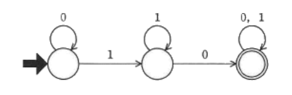

- A.**1010**  
ビット列が受理されるまでの流れは下記  
0を0回以上繰り返す  
1を出力する  
1を0回以上繰り返す  
0を出力する  
0又は1を0回以上繰り返した後、受理される  
1の後に1つ以上の0を含まなければならない

- 0000
- 0111
- 1111  
1の後に1つ以上の0を含まなければならない

---
設計する時に、状態遷移図を用いることが最適なシステム

- A.**設置したセンサの情報から、温室内の環境を最適に保つ温室制御システム**  
有限個の状態と遷移と動作の組み合わせからなる数学的モデルの有限オートマトンを視覚的に表現する図。時間経過や状態変化に応じて状態が変わるシステムの振る舞いを記述するのに適している。プロセス制御などの事象駆動(イベントドライブ)による処理の仕様や、システムに生じた事象をもとにどの状態に変化するかを一意に定義できるシステムを表現する時に用いられる  
温室制御システムは、センサで取得した温度が設定より高ければ温度を下げ、低ければ上げるといったように、以前の状態によってのみ次の処理が決定される。
入力情報やイベントによって、システムの状態が変わっていくシステムを設計するのに適した図式化手法

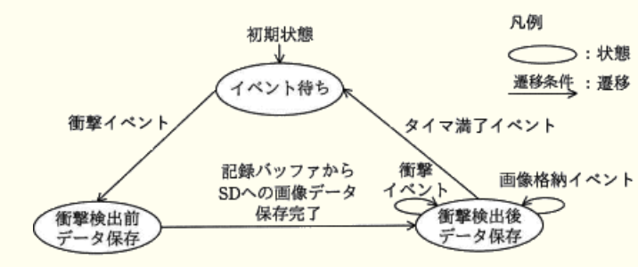

---
解像度6000dpiのスキャナで画像を読み込み、解像度300dpiのプリンタで印刷すると、印刷される画像の面積は元の画像の何倍になるか

- A.**4倍**  
dpi(*dots per inch*)は、1インチの長さを何ピクセル(画素)で表現しているかを示す単位。大きくなるほど面積当たりのピクセル数が増加するため、より繊細な画像となる。600dpi(1インチ四方)の画像データを300dpiのプリンタで印刷すると、300ピクセル分が1インチとして印刷されるので、600ピクセルの画像は2インチ四方で印刷されることになる

---
文字列を検査するための状態遷移表である。初期状態をaとし、文字列の検査中に状態がeになれば不合格とする。不合格となるものはどれか。文字列は左端から検査し、解答群中の△は空白を表す

||空白|数字|符号|小数点|その他|
|-|-|-|-|-|-|
|a|a|b|c|d|e|
|b|a|b|e|d|e|
|c|e|b|e|d|e|
|d|a|e|e|e|e|

- A.**12.2**  
12は数字なのでb、小数点でdになり以降の数字でeとなり不合格

- +0010  
+でcになる、以降は数字なので検査結果はb

- -1  
-でcになる、以降は数字なので検査結果はb

- 9.△  
数字でb、小数点でd、空白で検査結果はa

---
300円の商品を販売する自動販売機の状態遷移図はどれか。入力と出力の関係を"入力 / 出力"で表し、入力のaは100円硬貨を、bは100円硬貨以外を示し、S0 - S2は状態を表す。入力がbの場合はすぐにその硬貨を返却する。終了状態に遷移する際、出力の1は商品の販売を、0は何もしないことを示す

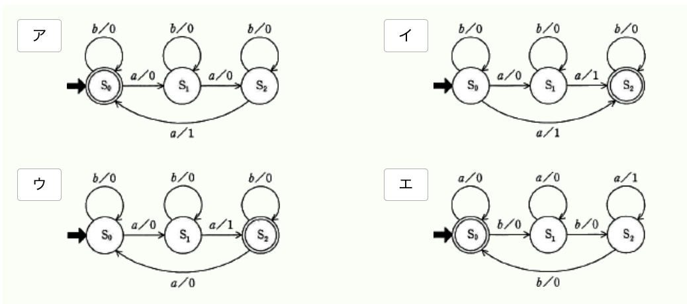

- A.**ア**  
`a / 1` : 100円硬貨が投入され、商品を販売する  
`a / 0` : 100円硬貨が投入され、何もしない  
`b / 1` : 100円硬貨以外が投入され、商品を販売する(どこにも出てこない)  
`b / 0` : 100円硬貨以外が投入され、何もしない  
100円硬貨が3枚投入された時点で商品を販売するので、初期状態S0からa / 0が2回続いた後にa / 1が発生する、b / 0の時は現在の状態に留まる

- イ  
100円硬貨が2枚投入された時点で商品が販売されてしまう。また初期状態で100硬貨投入後の遷移先が一意に定まらない

- ウ  
100円硬貨が2枚投入された時点で商品が販売されてしまう

- エ  
初期状態から100円硬貨を投入しても次の状態に遷移しない、100円硬貨以外を投入すると次の状態に遷移してしまう

---
実数aを$a=fr^e$と表す浮動小数点表示に関する記述

- A.**fは仮数、eは指数、rは基数**  
コンピュータの数値表現で用いられる方式。仮数部の桁数では表現仕切れない非常に大きな(小さな)数を、仮数部の指数部に掛けることで表すことが可能

---
浮動小数点形式で表現される数値の演算において、有効けた数が大きく減少するもの

- A.**絶対値がほぼ等しく、同符号である数値の減算**  
コンピュータ上で行う数値演算において発生する誤差の1つ(桁落ち)。浮動小数点演算の結果、有効桁数が減ってしまう現象で、絶対値に非常に近い値同士の減算、絶対値がほぼ等しい異符号である数値の加算を行った時に生じる

---
0以外の数値を浮動小数点表示で表現する場合、仮数部の最上位桁が0以外になるように、桁合わせする操作はどれか。仮数部の表現方法は絶対値表現とする

- A.**正規化**  
仮数部と指数部を調整することで、仮数部の最上位桁が0以外になるように桁合わせする操作。有効桁数を最大化し、丸め誤差をできるだけ少なくすることが目的  
0d 10.75 => 0b 1010.11 (4ビット右にシフト)=> 0b$0.101011*2^4$  
0d 0.1875 => 0b 0.0011 (2ビット左にシフト)=> 0b$0.11*2^{-2}$

---
記憶媒体の記録層として、有機色素を使い、レーザ光によってピットと呼ばれる焦げ跡を作って記録する光ディスク

- A.**CD-R(*Compact Disc Recordable*)**  
記録済で市販されているCD-ROMはアルミニウム製の薄膜に記録するのに対し、CD-Rは金属薄膜に塗布された有機色素の有無で反射の度合いを変化させる

- CD-RW(*Compace Disc ReWritable*)  
書換可能なCDで、ディスク上の記録素材をレーザで熱して結晶構造を変えることで反射率を変化させている

- DVD-RAM(*DVD Access Memory*)  
DVD±RQの1000回を上回る10万回以上の書き換えが可能なDVDで、記録面の使用材料はDVD-RWとは異なったアモルファス金属材料を使用している

- DVD-ROM(*DVD Read Only Memory*)  
読取専用のDVDで、読取用ピットを形どったマスタ原盤をもとに、プレスと張り合わせという物理的な方法で生産されている

---
DRAMの説明

- A.**コンデンサに電荷を蓄えた状態か否かによって1ビットを表現する。主記憶としてよく用いられる**  
コンデンサに負荷を蓄えた状態か否かによって情報を記憶する装置。集積度を上げることが比較的簡単で、大きな記憶容量が必要な主記憶に使用される。コンデンサの負荷は時間経過で失われてしまうため、一定間隔でリフレッシュ操作を行い続ける必要がある

- 製造時にデータが書き込まれる。マイクロプログラム格納用メモリとして用いられる  
マスクROMの説明

- 専用の装置でデータを書き込むことができ、紫外線照射で消去ができる  
UV - EPROM(*Ultra - Violet Erasable Programmable ROM*)の説明

- フリップフロップで構成され、高速であるが製造コストが高い。キャッシュメモリなどに用いられる  
SRAM(*Static RAM*)の説明

---
2つの安定状態をもつ順序回路

- A.**フリップフロップ**  
2つの安定状態をもつことで1ビットの状態を表現できる順序回路で、SRAMの記憶セルに使用されている。DRAMのような定期的なリフレッシュ動作が必要ないため高速な処理が可能

- NANDゲート  
否定論理積を実装した論理回路

- 加算器  
2つの2進数を入出力値とし、加算した結果を出力する電子回路

- コンデンサ  
電荷(電荷エネルギー)を蓄えたり、放出したりする電子部品

---
プログラム中に次の複合判定がある。  
`条件1 or (条件2 and 条件3)`  
判定条件網羅(分岐網羅)に基づいてテストする場合、追加するテスト項目として適切なもの  
[終了したテスト項目]  
1.条件1が真、条件2が偽、条件3が偽  
2.条件1が偽、条件2が真、条件3が真

- A.**条件1が偽、条件2が偽、条件3が真**  
ホワイトボックステストにおける網羅性のレベルの分岐網羅は、プログラム中の判定条件で結果が真となる場合、偽となる場合を少なくとも1回は実行するようにテストケースを設計する手法。終了しているテスト項目はどちらも真なので、分岐網羅を満たすには結果が偽となるテスト項目を追加する必要がある  
偽 or (偽 and 真) = 偽

- 条件1が真、条件2が偽、条件3が真  
真 or (偽 and 真) = 真

- 条件1が真、条件2が真、条件3が偽  
真 or (真 and 偽) = 真

- 条件1が真、条件2が真、条件3が真  
真 or (真 and 真) = 真

---
2つの入力と1つの出力を持つ論理回路で、2つの入力がともに1の時だけ、出力が0になるもの

- A.**NAND回路**  
AND回路の出力を反転させた回路(否定論理積)

||論理和(or)|論理積(and)|排他的論理和(xor)|否定論理積(nand)|
|-|--------|----------|---------------|--------------|
|0(偽) 0(偽)|0|0|0|1|
|0(偽) 1(真)|1|0|1|1|
|1(真) 0(偽)|1|0|1|1|
|1(真) 1(真)|1|1|0|0|

- AND回路  
2つの入力が共に1の時だけ1を出力する回路(論理積)

- OR回路  
2つの入力のうち少なくとも一方が1の時に1を出力し、2つとも0の時だけ0を出力する回路(論理和)

- XOR回路  
2つの入力値が同じ時は0、異なる時は1を出力する回路(排他的論理和)

---
図のNANDゲートの組合せ回路で、入力A, B, C, Dに対する出力Xの論理式はどれか。論理式中の"*"は論理積、"+"は論理和を表す

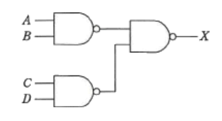

- A.**A\*B+C\*D**  
2つの入力が共にの時のみ0を出力し、その他の場合は1を出力する。AとB、CとD、またそれぞれの否定論理積を考える(ドモルガン則)  
$\overline{\overline{A*B} * \overline{C*D}}$  
$=\overline{\overline{A*B}} + \overline{\overline{C*D}}$  
$=A*B+C*D$

---
DRAM(*Dynamic Random Access Memory*)の特徴

- A.**メモリセル構造が単純なので高集積化することができ、ビット単価を安くできる**  
コンデンサに電荷を蓄えることにより情報を記憶し、電源供給が無くなると記憶情報も失われる揮発性メモリ。集積度を上げることが比較的簡単なためコンピュータの主記憶装置としてしようされている

- 書込み及び消去を一括又はブロック単位で行う  
DRAMはアドレス単位で読み書きや消去を行う

- データを保持するためのリフレッシュ操作又はアクセス操作が不要である  
SRAM(*Static Random Access Memory*)の説明。消えかけた電荷をコンデンサに充電するリフレッシュ動作を常に一定間隔で行うことでデータの保持をしている

- 電源が遮断された状態でも、記憶した情報を保持することができる  
揮発性メモリなので電源が途絶えると記憶内容も失われる

---
コンデンサに蓄えた電荷の有無で情報を記憶するメモリ

- A.**SDRAM**(*Synchronous Dynamic Random Access Memory*)  
コンデンサに電荷を蓄えることで情報を記憶し、電源供給が無くなると記憶情報も失われる揮発性メモリ。メモリセルと呼ばれるトランジスタ1個とコンデンサ1個の組ごとに1ビットの情報を記憶する。コンデンサに蓄えた電荷は時間が経つと失われるため、データ保持を目的とした定期的なリフレッシュ操作が必要

- EEPROM(*Electrically Erasable Programmable ROM*)  
フローティングゲートと呼ばれる部位に電荷を蓄え、周囲を絶縁体で囲うことで情報を記憶している

- SRAM(*Static RAM*)  
4 - 6個のトランジスタでフリップフロップ回路を構成し、フリップフロップ回路の状態で1ビットの情報を記憶する

- フラッシュメモリ  
フローティングゲートと呼ばれる部位に電荷を蓄え、周囲を絶縁体で囲うことによって情報を記憶している。EEPROMの一種だが、データの書き換えをブロック単位で行う(EEPROMはバイト単位)

---
SDメモリカードの上位規格の1つであるSDXC(SD eXtended Capacity)の特徴

- A.**ファイルシステムにexFATを採用し、最大2Tバイトの容量に対応できる**  
記憶容量の上限を2Tバイトまで引き上げたもの。標準サイズの他にMicroSDXCという小さいタイプもある

- GPS、カメラ、無線LANアダプタなどの周辺機能をハードウェアとしてカードに搭載している  
SDIO(*SD input / output*)の説明

- SDメモリカードの4分の1以下の小型サイズで、最大32Gバイトの容量をもつ  
micro SDHCの説明

- 著作権保護技術としてAACSを採用し、従来のSDメモリカードよりもセキュリティが強化された  
著作権保護技術は、CPRMを発展させたCPXM

---
仮想記憶機能をもつパソコンで表計算ソフトを使用中にワープロソフトを起動しようとしたところ、メモリ不足が原因で起動できなかった。根本的な解決策はメモリ増設であるが、それまでの対応で有効な手段

- A.**仮想記憶の大きさの設定値を増やす**  
プログラムが必要とするメモリサイズが主記憶のサイズを上回った場合、補助記憶装置(HDDなど)を仮想アドレス空間として使用することで、主記憶のサイズよりも大きなプログラムを実行可能にする方式。OSは起動するプログラムを主記憶の領域に展開(ロード)し、プログラムのロードに必要な空き領域が不足していると、ワープロソフトが起動できない。仮想記憶の容量を増やせば、主記憶として使用できる領域が増大しワープロソフトをメモリ領域にロードできる

- 磁気ディスク上の不要なファイルを消去する  
磁気ディスクの空き領域は増えるが、主記憶には影響しない

- 接続してある周辺装置を外す  
メモリ領域は増えない

- ワークシート中の未使用の列は、表示しないようにする  
主記憶上にはデータが記録されているため、主記憶の空き領域が増えることはない

---
8ビットの値を全ビットを反転する操作

- A.**16進数表記FFのビット列と排他的論理和をとる**  
あるビットと1の排他的論理和をとると、被演算ビットが0であれば結果は1、1であれば結果は0になる(入力の値が同じなら0、異なれば1)。反転させたいビット部分に1を設定したビット列を用意し、元のビット列との排他的論理和をとると良い

- 16進数表記FFのビット列と論理和をとる  
演算結果は全て1のビット列となる

- 16進数表記00のビット列と排他的論理和をとる
- 16進数表記00のビット列と論理和をとる  
演算結果は元のビット列と同じとなる

---
OSにおけるAPI(*Application Program Interface*)の説明

- A.**アプリケーションから、OSが用意する各種機能を利用するための仕組みである**  
アプリケーションに共通に標準化されたインターフェイスを提供するためにOSなどが提供するライブラリ。開発者はAPIを介してウィンドウ表示やプリンタ制御・ファイル読み書きなどのOSが持つ機能を呼び出すことができ、組み合わせることで目的プログラムを作成する

- アプリケーションがハードウェアを直接操作して、各種機能を実現するための仕組みである  
デバイスドライバの説明

- 複数のアプリケーション間でネットワークを介して通信する仕組みである  
プロセス間通信の説明

- 利用者の利便性を図るために、各アプリケーションのメニュー項目を統一する仕組みである  
CUA(*Common User Access*)の説明

---
パソコンのOSが提供する機能を利用するためのAPIに関する記述

- A.**アーキテクチャの異なるCPU間でも、同じOSとそのAPIを使用することによって、プログラムの互換性を高め、移植時の工数を削減することが可能である**  
アプリケーションが提供する機能を外部のプログラムから利用できるように、呼び出し方法や入出力仕様を定め外部公開をしたもの。開発者は、APIを介してウィンドウ表示やプリンタの制御・ファイル読み書きなどのOSが持つ機能を呼び出すことが可能

- APIで呼び出されるOSの処理モジュールは、あらかじめそれを利用するプログラムに静的にリンクしておく必要がある  
OSの提供するライブラリは、主記憶を効率的に利用するために実行ファイルと動的にリンクされる

- OSのAPIが提供されない周辺機器は、ユーザープログラムから利用又は制御することはできない  
OSのAPIが提供されない周辺機器は、デバイスドライバを介してユーザプログラムから利用・制御が可能

- 異なるOS間でもAPIは共通であり、APIだけを使用したプログラムであれば、再コンパイルだけでほかのOSへの移植が可能である  
OSが異なれば提供されるAPIも異なる

---
組込みシステムでリアルタイムOSが用いられる理由

- A.**期待される応答時間内にタスクや割込みを処理するための仕組みが提供される**  
資源管理のうち、時間資源の保護・実行時間の予測可能性を提供することに特化したものを指す。高優先度のタスクが発生した時に確実に実行されるように優先度方式のスケジューリングが採用される。入力に対して即時処理が求められるため、最適化されたOSであるリアルタイムOSが求められている

---
シリアルATAの特徴

- A.**ホットスワップ対応が可能である**  
電源を入れたまま機器の脱着をできる

- SAS(Serial Attached SCSI)と双方向の互換性がある  
コネクタは互換性があり、SATA規格のデバイスをそのままSASコネクタに接続可能。SATAインターフェイスにSASデバイスを接続は不可

- デイジーチェーン接続を採用している  
SATAは1本のケーブルに1つの機器を接続するポイントツーポイントの接続形態を採用している。デイジーチェーンはSCSIで採用されている接続形態

- パラレルATAとケーブル、コネクタに互換性がある  
接続互換性はない

---
ITサービスマネジメントにおいて、インシデント管理の対象となるもの

- A.**アプリケーションの応答の大幅な遅延**  
インシデントの発生につながりそうな事象も管理対象とする。アプリケーションの応答の大幅な遅延は、システムに何らかの障害が発生していたりサービス要求がシステムの許容量の限界に発生と考えられる。大きくなるとサービスの中断というインシデントになる可能性もあるため、早めの対処により問題をクリアしておく必要がある

---
バーコードには、検査数字(チェックディジット)を付加するのが一般的である。JANコード(標準タイプ、13けた)では、12けたの数の検査数字を次の方式で算出している。この方式で算出した図のバーコード(123456789012)の検査数字として適切な値  
1.検査数字を付加する前の右端の数字の位置を奇数ケタとし、左に向かって交互に奇数ケタと偶数ケタとする  
2.偶数ケタの数字の合計を求める  
3.奇数ケタの数字の合計を求め、その値を3倍する  
4.2と3の合計を求める  
5.4の値の1の位の数字を10から引く。ただし、1の位が0のときは0とする。4の値が123のときは10 - 3 = 7、120のときは0とする  
6.5で求めた数字を検査数字とし、右端ケタの右に付加する

- A.**8**  
2.偶数ケタの合計 -> 1 + 9 + 7 + 5 + 3 + 1 = 26  
3.奇数ケタの合計を3倍 -> (2 + 0 + 8 + 6 + 4 + 2) * 3 = 66  
4.2と3の合計 -> 26 + 66 = 92  
5.4の値の1の位の数字を10から引く -> 10 - 2 = **8**

---
入力装置の中で、ポインティングデバイスに分類され、CADシステムの図形入力などに使用されるもの

- A.**タブレット**  
コンピュータの入力装置の一種で、ディスプレイに表示されたポインタを移動させて画面上の位置を指定したり、座標データを入力したりするために使われる装置の総称  
マウスより繊細で正確にポインタ操作ができるため、コンピュータ上での図面作製やイラスト・絵画制作に用いられている

- OCR(*Optical Character Reader*)  
紙や画像内の文字をパターンマッチング技術やAI技術を用いて解析して読み取り、デジタルのテキストデータに変換する装置やソフトウェア

- OMR(*Optical Mark Reader*)  
紙などに記入(印刷)されたマークをデジタルデータとして読み取る光学式マーク認識装置。マークシートやバーコードがあり、ポインティングデバイスではない

- イメージスキャナ  
入力装置の1つではあるが、画像情報を取り込むための機器で、ポインティングデバイスではない

---
USBの転送モードのうち、主としてマウスやジョイスティック等に用いられるもの

- A.**インタラプト転送**  
一定間隔でデータを転送するためのもので、キーボードやマウスなどの接続で使用される

- アイソクロナス転送  
伝送路の負荷が高い状態でも特定の通信に対して必ず一定の転送量を確保する方式。音声や動画の再生などの途切れてはいけないデータの転送に使用される

- コントロール転送  
接続されたデバイスの設定や制御する際のデータ通信の際に使用される

- バルク転送  
ある程度まとまった大量のデータを非周期的に転送するためのもので、補助記憶装置やスキャナなどのデータ転送に使用される

---
インターネットに関係するプロトコルや言語に関する記述

- A.**HTTPは、HTML文書などを転送するためのプロトコルである**  
WebサーバとWebブラウザがデータを送受信するのに使われる

- FTPは、電子メールにファイルを添付して転送するためのプロトコルである  
ネットワーク上でファイル転送を行うための通信プロトコルなので電子メールの転送はできない。電子メールにファイルを添付して転送するための規格はMIME(*Multipurpose Internet Mail Extension*)

- HTMLは、文書の論理構造を表すタグをユーザーが定義できる言語である  
Webページを記述するためにタグを使って文書構造を表現するマークアップ言語で、タグは定義済みのものしか使用できない。文書の論理構造を表すタグをユーザが定義できる言語はXML(*eXtensible Markup Language*)

- SMTPは、画像情報を送受信するためのプロトコルである  
インターネット環境において、クライアントからサーバにメールを送信したり、サーバ間でメールを転送したりするのに用いられるプロトコル。画像処理の送受信にはMIMEを使用する

---
再帰的プログラムの特徴

- A.**実行中に自分自身を呼び出すことができる**  
実行中に自身を呼び出すことを呼び、再帰呼び出しを行っても正しい結果を返すことができる性質をもつプログラム

- 1度実行した後、ロードし直さずに再び実行を繰り返しても、正しい結果が得られる  
逐次再使用プログラムの特徴

- 主記憶上のどこのアドレスに配置しても、実行することができる  
再配置可能プログラムの特徴

- 同時に複数のタスクが共有して実行しても、正しい結果が得られる  
再入可能プログラムの特徴

---
オブジェクト指向プログラムの特徴

- A.**データを外部から隠ぺいし、メソッドと呼ばれる手続によって間接的に操作することができる。プログラムは、データとメソッドをひとまとまりにしたものの集まりである**  
C言語に代表される手続き型プログラムでは、プログラムは関数の組み合わせで構成されるのに対し、オブジェクト指向プログラムの考え方では、オブジェクトと呼ばれる機能をまとめた部品によってソフトウェアが構成される。データとそのデータに関連する手続き(*Method*)をひとまとまりとして定義することで、そのオブジェクトを部品として扱うことができる。オブジェクト内部の設計を知らなくても、外部から手続きを呼び出すことで目的の処理を実現できるようになる。ソフトウェア機能の部品化・再利用を行うことができ生産性も向上する

---
オブジェクト指向プログラミングの特徴

- A.**オブジェクトが相互にメッセージを送ることによって、協調して動作し、プログラム全体の機能を実現する**  
システムの構築の設計で、処理や対象の対象となるもの(オブジェクト)同士のやり取りの関係としてシステムを捉える考え方。データと手続きをひとまとめにしてカプセル化することで実現し、カプセル化、継承、多態性などの特徴をもっている

- オブジェクトの外部からオブジェクトの内部のデータを直接変更できるので、自由度が高い  
オブジェクト内部はブラックボックス化されている。外部からのアクセスは公開された性質を参照することで、間接的にオブジェクト内部を変更する

- 下位クラスは上位クラスの機能や性質を引き継ぐので、下位クラスに必要な性質は全て上位クラスに含まれる  
下位クラス独自の性質は、上位クラスに含まれない

- 個々のオブジェクトが使用するデータ(属性)は、あらかじめデータ辞書に登録しておく  
データとメソッドはオブジェクト内部に記述されている

---
オブジェクト指向によるシステム開発で利用され、分析から設計、実装、テストまで統一した表記法

- A.**UML**(*Unified Modeling Language*)  
オブジェクト指向開発で用いられる標準表記法群で、オブジェクト間の関連や動作・構成を表現する13種の図表から構成されている

- EAI(*Enterprise Application Integration*)  
企業内における多種多様なコンピュータシステム群を連携させ、データやビジネうプロセスを効率的に統合する機能やそれらを行うミドルウェア・アプリケーションのこと

- EJB(*Enterprise JavaBeans*)  
JavaBeansをサーバサイドで実現する技術仕様

- ERP(*Enterprises Resource Planning*)  
企業全体の経営資源を有効かつ統合的に計画管理し、経営の効率化を図るための手法

---
オブジェクト指向プログラミングにおける、多相性を実現するためのオーバライド(*Override*)の説明

- A.**スーパークラスで定義されたメソッドをサブクラスで再定義すること**  
上位クラスで定義されたメソッド(メンバ関数)を、下位クラス側の役割に応じて再定義し動作を変更すること。オブジェクト指向ではこの方法で、同じメッセージでもオブジェクト毎に異なる操作が行われる特性である多相性を実現している

- オブジェクト内の詳細な仕様や構造を外部から隠蔽すること  
カプセル化の説明

- 同一クラス内に、メソッド名が同一で、引数の型、個数、並び順が異なる複数のメソッドを定義すること  
オーバロードの説明。引数が異なる同名の関数を同一クラス内に定義する

- 複数のクラスの共通する性質をまとめて、抽象化したクラスを作ること  
汎化の説明。共通の特性を集めてクラスを作る

---
オブジェクト指向分析を用いてモデリングした時、クラスとオブジェクトの関係になる仕組み

- A.**公園, 代々木公園**  
クラスはオブジェクトがもつ性質を集めた設計図、オブジェクトは実体(インスタンス)。クラスは枠組みだけを定義した抽象的な概念であり、実際に値を割り当てて実体を示したものがオブジェクト

---
プログラミングの標準化に関する記述

- A.**プログラミングに関する規約を設けることによって、プログラマの犯しやすい誤りを未然に防止する効果がある**  
変数や関数の命名、コメント付加やインシデントに一定の規則をつけること。規則に従ってプログラミングを行うことでプログラマの犯しやすい誤りを未然に防止する効果がある。当初の作成者以外の人が作業を引き継いだり、修正を行う場合があり、他人の書いたソースコードでも読み取りやすくなり作業時の負荷が軽減される

---
UMLのアクティビティ図の特徴

- A.**多くの並行処理を含むシステムの、オブジェクトの振る舞いが記述できる**  
ビジネスプロセスの流れやプログラムの制御フローのような一連の手続きを可視化できる図。フローチャートと似た表記法で処理の流れを記述でき、処理の分岐やマージ、並行処理のフォークやジョイン、タイマ制御や例外処理なども表現できる

- オブジェクト群がどのようにコラボレーションを行うか記述できる  
コミュニケーション図の特徴

- クラスの仕様と、クラスの間の静的な関係が記述できる  
クラス図の特徴

- システムのコンポーネント間の物理的な関係が記述できる  
コンポーネント図の特徴

---
機密ファイルが格納されていて、正常に動作するPCの磁気ディスクを産業廃棄物処理業者に引き渡して廃棄する場合の情報漏洩対策

- A.**ランダムなビット列で、磁気ディスクの全領域を複数回上書きする**  
ゴミ箱に捨ててゴミ箱を空にするコマンドで消去・磁気ディスクをフォーマット(初期化)・リカバリディスクで工場出荷時の状態に戻すことでデータを完全に消去する必要がある。ファイル管理領域(ファイル名や位置などの情報を格納)と実データ領域に分かれて管理されており、実データは残った状態になっており、実データからファイルを復活できてしまう。ディスク内容を完全に消去するには、実データ領域を含むディスク上の全ての領域にデータを上書きする必要がある。1度だけではプラッタ(磁気ディスクの円盤部)上の残留磁気を読み取ってデータを復元されてしまう可能性もあるため、複数回の書き込みが必要になる

- 異なる圧縮方式で、機密ファイルを複数回圧縮する  
圧縮したファイルを展開すれば機密情報が漏洩してしまう

- 専用の消去ツールで、磁気ディスクのマスタブートレコードを複数回消去する  
実データは残ったままなので漏洩の危険がある

- ランダムな文字列で、機密ファイルのファイル名を複数回変更する  
ファイル名を変更しても元のファイル内容に影響は無いため漏洩の危険がある

---
デバイスドライバ(*Device Driver*)の役割

- A.**アプリケーションプログラムの要求に従って、ハードウェアを直接制御する**  
OSが標準でサポートしていない周辺機器の管理・制御するための抽象化したインターフェイスを他のアプリケーションソフトウェアに対して提供するソフトウェア。アプリケーションはデバイスドライバを介してプログラム上からハードウェアを操作できる。マウスやキーボード、ディスプレイ、USB接続などの周辺機器はOSに標準でデバイスドライバが組み込まれているが、その他は機種にあったドライバのインストールが必要

- 実行を待っているタスクの中から、次に実行するタスクを決定する  
タスクスケジューラの役割

- 複数のウインドウの、画面上での表示状態を管理する  
ウィンドウマネージャの役割

- 利用者が入力するコマンド文字列を解釈して、対応するプログラムを起動する  
OSのシェルの役割

---
図はプログラムを翻訳して実行するまでの流れを示したもの。コンパイラ、リンカ、ローダの入出力の組み合わせ

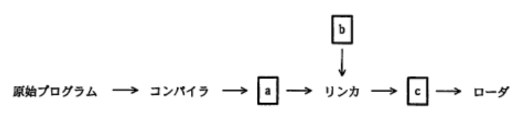

- a.**a : 目的プログラム, b : ライブラリモジュール, c : ロードモジュール**  
原始プログラム(ソースコード)から実行される流れは、  
1.コンパイラからソースプログラムを最適化し機械語に翻訳する  
2.リンカによって変換されたプログラムで使うライブラリが付け加えられロードモジュール(実行ファイル)を作る  
3.ロードモジュールを実行して処理を行う

---
プログラムを構成するモジュールの結合を、プログラム実行時に行う方式

- A.**動的リンキング**(ダイナミックリンキング)  
プログラムの実行中にそのモジュールが必要となった時点で結合して利用する方式。主に共用ライブラリやシステムライブラリなどをプログラムで使用する時に使われる

- インタプリタ  
ソースコードを1行ずつ解釈しながらプログラムを実行していく言語プロセッサの方式。一般にコンパイラによって作成される実行ファイル形式よりも解釈と実行が同時進行のため処理時間がかかる

- オーバーレイ  
主記憶に格納できない大きいプログラムを幾つかのブロックに分割し、その時に処理に必要なブロックだけを主記憶にロードして実行する方式

- 静的リンキング(スタティックリンキング)  
コンパイル後のオブジェクトコードと、ライブラリ / モジュールの結合を実行ファイル生成時(プログラム実行前)に行う方式

---
ある2つの言語処理系について記述したもので、Bと比べてAの利点を記述しているもの  
A.高水準言語で作成されたプログラムを、中間言語、アセンブラ言語又は機械語で記述されたプログラムに翻訳する  
B.原始プログラム中の命令分を一文ずつ解釈し、実行する

- A.**処理の最適化が図れる**  
Aのコンパイラ方式の説明。コンパイルの過程でソースコードの最適化を行ってから実行ファイルを生成する。インタプリタでは、ソースコードを1行ずつ翻訳しながら実行するため処理の最適化は行われない

- 対話的な実行環境が構築できる  
ともに対話的な実行環境を構築できる

- デバッグ機能を組み込みやすい  
デバッグ機能の組み込みやすさは変わらない

- プログラム作成とテストを並行してできる  
プログラムを変更し実行することが容易なので、Bのインタプリタの説明

---
パイプライン制御の特徴

- A.**命令の処理をプロセッサ内で複数のステージに細分化し、複数の命令を並列に実行する**

- 複数の命令を同時実行するために、コンパイラが目的プログラムを生成する段階で、それぞれの命令がどの演算器を使うかをあらかじめ割り振る  
AMP(*Asymmetric Multiple Processor*)型マルチプロセッサの説明

- 命令が実行される段階で、どの演算器を使うかを動的に決めながら、複数の命令を同時に実行する  
SMP(*Symmetric Multiple Processor*)型マルチプロセッサの説明

- 命令を更に細かなマイクロ命令の組合せで実行する  
マイクロプログラム制御の説明

---
コンパイラによる最適化の主な目的

- A.**プログラムの実行時間を短縮する**  
高水準で記述されたソースコードをコンピュータが解析できる機械語に一括変換するソフトウェア。字句解析、構文解析、意味解析、最適化、コード生成の5つの処理段階があり、この順で実行される。最適化は、実行効率の高いオブジェクトコードを生成するためにプログラムを再構成する処理  
・値の不変の変数や、定数同士の計算を定数で置き換える  
・不使用の命令を削除する  
・ループの展開、関数のインライン展開  
・累乗を乗算に、乗算を加算にする(より処理速度が速い)

- プログラムのデバッグを容易にする  
デバッグを容易にするのは、トレーサやインスペクタ、メモリダンプのような開発支援ツールなど

- プログラムの保守性を改善する  
ソースコードを記述する段階で、変数の命名規則やコメントの書き方など、プログラムの標準的な記述方式を定めることが必要

- 目的プログラムを生成する時間を短縮する  
コンパイラが行う最適化ではなく、コンパイルプログラム自体の最適化が必要

---
*Java*のプログラムにおいて、よく使われる機能などを部品化し、再利用できるようにコンポーネント化するための仕様

- A.***JavaBeans***  
プログラムの再利用を目的として*Java*言語で記述されたソフトウェア部品のこと。既存の*Bean*を組み合わせることで開発効率の向上、深い知識がなくてもソフトウェアに必要な機能が実装可能

- *JavaScript*  
動的なWebページの構築のためにHTML内に記述されるスクリプト言語。入力漏れのチェックや、HTMLを動的に編集することで動きのあるWebページを作ることが出来る

- *Java*アプリケーション  
*Java*で書かれたプログラムの実行形態の1つ。ローカルコンピュータ上の*Java Runtime Environment*で実行されるプログラムを指す

- *Java*アプレット  
Webを通してブラウザにダウンロードされクライアント側で実行される、*Java*で書かれたプログラムのこと

---
仮想記憶を用いたコンピュータでのアプリケーション利用に関する記述

- A.**仮想記憶を使用していても主記憶が少ないと、アプリケーション利用時にページフォルトが多発してシステムのスループットは低下する**  
主記憶が少ない状態でプログラムを多く実行すると、ページング処理が多発しシステムのオーバヘッドが増加し、アプリケーションのCPU使用率が極端に下がる現象が発生する(スラッシング)

- 仮想記憶は、磁気ディスクにインストールされたアプリケーションだけが利用できる  
CDやDVD、フラッシュメモリ上のプログラムでも利用できる

- アプリケーションには、仮想記憶を利用するためのモジュールを組み込んでおく必要がある
- 仮想記憶を利用するためには、個々のアプリケーションで仮想記憶を使用するという設定が必要である  
OSの提供する機能で、アプリケーション側での設定はない

---
システムが単位時間内にジョブを処理する能力の評価尺度

- A.**スループット(*Throughput*)**  
システムが単位時間当たりに処理できる仕事量を表す指標で、理代者側から見たシステム性能の評価基準となる

- MIPS(*Million Instruction Per Second*)値  
CPUが1sに実行できる命令数を100万回単位で表した指標

- 応答時間  
利用者がシステムへの処理要求を全て完了した時点から、システムが最初の反応を返すまでの時間のこと(レスポンスタイム)

- ターンアラウンドタイム  
利用者がシステムへの処理要求を開始した時点から、全ての応答出力を受け取るまでの時間のこと

---
スループットに関する記述

- A.**プリンタへの出力を一時的に磁気ディスク装置へ保存するスプーリングは、スループットの向上に役立つ**  
`スループット` : システムで単位時間当たりに処理される仕事の量のこと。データ処理においてはコンピュータに搭載されるCPUのクロック周波数やハードディスクの回転速度やOSなど様々な要因が影響し、システムのパフォーマンスの評価基準となる  
処理が遅いプリンタの出力に合わせてCPUがデータ転送処理を行うと、CPUに遊休時間が生じる。1度出力データを補助記憶装置へ転送し、補助記憶装置からプリンタへデータを転送することで、CPUは即座に次の処理へ移ることが可能(スプーリング処理)。これによりCPUの空き時間が減少し有効に使うことができるためスループットの向上が見込める

- ジョブとジョブの実行の間にオペレータが介入することによってシステムに遊休時間が生じても、スループットには影響を及ぼさない  
システムに遊休時間が生じると、単位時間当たりの仕事量は減少する

- スループットはCPU性能の指標であり、入出力の速度、オーバーヘッド時間などによって影響を受けない  
スループットはCPUの性能以外の様々な要因も影響する

- 多重プログラミングはターンアラウンドタイムの短縮に貢献するが、スループットの向上にはあまり役立たない  
1つの処理装置で見かけ上複数のプログラムを実行させる、マルチタスク方式のこと。1プログラムが入出力待ちなどの時、他のプログラムを処理させることでCPUの遊休時間を少なくすることができスループットの向上が見込める

---
入出力処理が主体のタスクをタイプA、CPU処理が主体のタスクをタイプBとする。マルチプログラミング環境で、同数のタイプAとタイプBのタスクを同時に実行する場合、システムのスループットが最も高くなることが期待できるスケジュール方式

- A.**優先度方式のスケジューリングを採用し、優先度はタイプAのタスクを高くし、タイプBのタスクを低くする**  
優先度方式は、各タスクに設定された優先度が高い順に実行していく方式。システムのスループットを高めるにはCPUの空き時間が少なくなるようなタスクスケジューリングにする必要がある。タスクAを優先的に処理し、入出力待ちの時にタスクBの処理を行うようにCPU処理と入出力が並行して実行されると最も効率が良くなる

- 優先度方式のスケジューリングを採用し、優先度はタイプAのタスクを低くし、タイプBのタスクを高くする  
優先度の低いタスクAのCPU処理はタスクBの完了後にまわされる。タスクBが完了しているので、タスクAが入出力待ちの時にCPUの処理するタスクがなくなりCPUに空き時間が生じる

- タイムスライス方式のスケジューリングを採用し、タイムクウォンタムはタイプAのタスクを長くし、タイプBのタスクを短くする
- タイムスライス方式のスケジューリングを採用し、タイムクウォンタムはタイプAのタスクを短くし、タイプBのタスクを長くする  
タイムスライス方式では、一定時間(タイムクウォンタム)毎にタスクを切り替えながら実行する方式。タスクAに使用権が与えられた時に入出力待ちとなっている場合が多く発生すると考えられる。この時にCPUには空き時間が生じスループットの低下を招く

---
2台のCPUからなるシステムがあり、使用中でないCPUは実行要求のあったタスクに割り当てられるようになっている。このシステムで、2つのタスクA、Bを実行する際、それらのタスクは共通の資源Rを排他的に使用する。それぞれのタスクA、BのCPU使用時間、資源Rの使用時間と実行順序は図に示す通り。2つのタスクの実行を同時に開始した場合、2つのタスクの処理が完了するまでの時間は何ミリ秒か。タスクA、Bを開始した時点では、CPU、資源Rともに空いているものとする

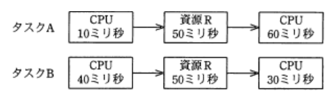

- A.**140**  
共通の資源Rを排他的に使用するとあり、1つのタスクが資源Rを使用している場合、もう一方のタスクは使用できずに待ち状態になる。各タスクに占有的に割り当てることでCPU処理待ちはしない  
CPU1 : 0ミリ秒からCPU, 60-120ミリ秒でCPU  
CPU2 : 0ミリ秒からCPU(40-60ミリ秒は待ち), 110-140ミリ秒でCPU  
資源R : 10ミリ秒からタスクA, 60-110ミリ秒までタスクBで使用

---
フラッシュメモリ(*flash memory*)の説明

- A.**書込み、消去とも電気的に行い、一括又はブロック単位で消去する**  
書き換え可能で、電源を切ってもデータが消えない不揮発性の半導体メモリ。フラッシュEEPROMまたはフラッシュROMとも言う。EEPROMの一種で書き込み、消去とも電気的に行うが、従来のEEPROMと違い1バイト単位の書き換えは出来ず、予めブロック単位で消去してから書き込みを行うことが特徴

- 1回だけ電気的に書込みができる  
OTROM(*One Time Programmable ROM*)の説明、フラッシュメモリは何度でも書き換え可能

- 一定時間内に再書込み(リフレッシュ動作)を行う  
DRAMの説明

- 書込みは電気的に行い、消去は紫外線によって行う  
書き込み・消去可能なEPROMの一種、UV_EPROMの説明

---
3次元コンピュータグラフィックに関する記述で、ポリゴン(*polygon*)の説明

- A.**閉じた立体となる多面体を構成したり、2次曲面や自由曲面を近似するのに用いられたりする基本的な要素**  
多角形を意味する言葉だが、3DCGでは多角形(多くは三角形か四角形)を組み合わせて曲面や凹凸がある物体を近似的にモデリングする技法のこと

- ある物体Aを含む映像aから他の形状の異なる物体Bを含む映像bへ、滑らかに変化する映像  
モーフィングの説明

- コンピュータ内部に記録されているモデルを、ディスプレイに描画できるように2次元化した映像  
レンダリング画像の説明。画像や画面の内容を指示する情報(数値や数式データ)を元にコンピュータ処理で具体的な画像を生成する操作(レンダリング)によって得られた画像のこと

- モデリングされた物体の表面に貼り付ける柄や模様などの画像  
テクスチャマッピングの説明

---
3次元CGのレンダリングにおける、隠線消去及び隠面消去の説明

- A.**指定された視点から見える部分だけを描くようにする**  
3DCGモデルは3次元の構造物なので視点によって見える部分が異なる。ある視点から見た時に物体の裏側または陰に位置ち見えなくなる線及び面を描画しないようにする処理。可視(不可視)を判定するアルゴリズムは、塗り重ね法、スキャンライン法、Z - バッファ法などがある

- 光源の位置と対象物体への光の当たり具合とを解析し、どのような色・明るさで見えるのかを決定する  
シェーディング(*Shading*)の説明

- 生成された画像について、表示する画面に収まる部分だけを表示する  
クリッピングの説明

- 物体の表面だけでなく物体の内部や背後に隠れた部分の形状も、半透明表示などによって画像として生成する  
半透明表示には対応していない。レイトレーシングなどの技法が用いられる

---
テクスチャマッピング(*Texture Mapping*)の説明

- A.**物体の表面に画像を貼り付けることによって、表面の質感を表現する**  
多数のポリゴン(多角形)の組合せで構成される3DCG表面に壁紙のようなものを貼り付け、擬似的な凹凸や表面模様などを付加することで質感の向上をもたらす技法

- 光源からの反射や屈折、透過を計算し描画していく  
レイトレーシングの説明

- 光源と物体の形状などに基づいて、表示するときに陰影をつける  
シェーディングの説明

- 表示画面からはみ出す箇所をあらかじめ見つけ、表示対象から外す  
クリッピングの説明

---
3次元グラフィックス処理におけるクリッピングの説明

- A.**画像表示領域にウィンドウを定義し、ウィンドウの外側を除去し、内側の見える部分だけを取り出す処理である**  
最終的な表示画面の範囲外(視点からみて可視できない部分)にあるデータを、CGの描画対象から除外する処理。最終的な仕上りに影響を与えない余分なデータを省くことで、後工程で必要となる計算量を減らし、作業効率を高めるために行われる

- CG映像作成における最終段階として、物体のデータをディスプレイに描画できるように映像化する処理である  
レンダリングの説明

- スクリーンの画素数が有限であるために図形の境界近くに生じる、階段状のギザギザを目立たなくする処理である  
アンチエイリアシングの説明

- 立体感を生じさせるために、物体の表面に陰影を付ける処理である  
シェーディング(陰影処理)の説明

---
コンピュータグラフィックスで図形を描画する際に、図形の境界近くの画素が変化する色彩の中間色を割り当てることで、境界に生じる階段状のギザギザを目立たなくする技術

- A.**アンチエイリアシング**  
デジタル画像の物体の輪郭に現れるピクセルのギザギザ(ジャギー)を、滑らかに見せるために周囲(背景)の画素値と平均化処理をして描画するCG技法

- クリッピング  
描画領域からはみ出した部分を切り捨てる作業。描画対象の一部がウィンドウの外にはみ出している場合、その部分の描画は不要のためクリッピング作業の段階で切り捨てられる

- シェーディング  
光源と描画対象との位置関係から、対象の印影を計算し明暗のコントラストで立体感を与える技法

- モーフィング  
CGを使ったアニメーションで使用される技法の1つで、ある物体から別の物体へと自然に変形する映像を見せる技法

---
アニメーションの作成過程で、センサーやビデオカメラなどを用いて人間や動物の自然な動きを取り込む技法

- A.**モーションキャプチャ**  
現実の人間や動物の関節などに装着されたマーカー(センサー)ごとの動きをデジタルデータとして連続的に記録する技術。得られたデータはスポーツ分野において身体の動きのデータ収集・分析や、CGアニメーションに実物のような動きを与えるために利用される

- キーフレーム法  
動きのポイントとなる物体の位置や形を定義し、その間をコンピュータ計算によって生成したフレームを補完することで滑らかなアニメーションを作成する技法

- ピクセルシェーダ  
3DCGにおいてテクスチャの表面色、光源、陰影などの情報をもとにピクセルを描画する色を計算する機能

- モーフィング  
CGにおいてある物体から別の物体へ変形していく間を、コンピュータ演算によって補完することで、自然な変形をする映像として作成する技法

---
スーパースカラの説明

- A.**複数のパイプラインを用いて、同時に複数の命令を実行可能にすることによって、高速化を図る方式である**  
CPU内部に複数のパイプラインを用意して、パイプラインの各ステージを並列に実行することで処理を高速化する手法

- 処理すべきベクトルの長さがベクトルレジスタより長い場合、ベクトルレジスタの長さの組に分割して処理を繰り返す方式である  
ベクトル処理方式の説明

- パイプラインを更に細分化することによって、高速化を図る方式である  
スーパーパイプラインの説明

- 命令語を長く取り、1つの命令で複数の機能ユニットを同時に制御することによって、高速化を図る方式である  
VLIW(*Very Long Instruction Word*)の説明

---
命令語に関する記述

- A.**命令の種類によっては、オペランドがないものもある**  
オペランドがなくオペレーションコードのみの0アドレス方式がある

- オペランドの個数は、その命令で指定する主記憶の番地の個数と等しい  
オペランドの個数と主記憶の番地は無関係。0から3のアドレス方式がある

- 1つのコンピュータでは、命令語長はすべて等しい  
RISC型CPUでは命令の長さは固定されているが、CISC型CPUでは命令ごとに長さが異なる

- 命令語長が長いコンピュータほど、命令の種類も多くなる  
命令語長と命令の種類は無関係

---
シノニムレコードの発生する可能性があるファイルアクセス

- A.**直接編成ファイルヘのレコードの追加**  
レコードのキー値から格納するアドレスを計算して、レコードをアドレスに直接格納する  
キー値をプログラムによってアドレスに変換するため、異なるキー値から同一のアドレスが計算されてしまうことがある。新たなレコードを追加する時に既にデータが格納されているアドレスが指定されてしまう可能性がある

- 区分編成ファイルヘのレコードの追加  
メンバと呼ばれる複数の順編成ファイルを格納したメンバ領域と、メンバの格納位置や名前を保存する登録域から構成され、メンバごとに順次アクセスできるようになっている

- 索引順編成ファイルのレコードの更新  
格納データに対して順次アクセスと直接アクセスの両方のアクセス方式を利用できる編成方式。基本データ域、索引域、あふれ域の3領域で管理を行う

- 順編成ファイルのレコードの更新  
順次アクセスを行うためのファイル編成方法で、レコードを先頭から純に格納する(シーケンシャルファイル)  
仮想記憶編成(VSAM)ファイル : 順編成、直接編成、索引順編成を含むファイル構成

---
Webアプリケーションサーバの機能

- A.**表示用のHTML文書を動的に生成する**  
ビジネスロジックが組み込まれたアプリケーションソフトウェアを実行することを専門とするサーバ。Webクライアントからの要求を処理するWebサーバと、DBMSを中心とするDB層の間にたち、トランザクションの管理、システムに固有の処理、DBの検索・加工などのそれぞれの層への橋渡しの役割をもつ処理を行う

- 外部からの不正パケットを排除する  
ファイアウォールの機能

- DBを管理する  
DBMS(*DataBase Management System*)の機能

- ホスト名をIPアドレスに変換する  
DNS(*Domain Name System*)の機能

---
Webサービスを利用する時のSOAPの役割

- A.**Webサービスの送受信プログラム間で、 XML形式のメッセージを受け渡す**  
ソフトウェア同士がメッセージを交換する遠隔手続き呼び出し(RPC)のためのプロトコル。汎用なデータ形式であるXMLに基づいて記述されており、Webサービスにとって有効な手段の1つ。Webサービスの場合、ソフトウェアが商品データを要求する時にXML形式であるSOAPリクエストを発行し、Webサービス側からも要求に基づいて商品データがSOAPメッセージとして返ってくる

- Webサービスのインタフェースを記述して、プログラムからサービスを利用できるようにする  
WSDL(*Web Services Description Language*)の説明

- Webサービスの情報を登録しておき、利用者がそのサービスを検索できるようにする  
UDDI(*Universal Description, Discovery and Integration*)の説明

- Webサービスプログラム間の配信保証や重複防止など、データ転送の信頼性を確保する  
WS - RM(*Web Services - ReliableMessaging*)の説明

---
クライアントサーバシステムにおいて、利用頻度の高い命令群をあらかじめサーバ上のDBMSに格納しておくことによって、クライアントサーバ間のネットワーク負荷を軽減する仕組み

- A.**ストアドプロシージャ(*Stored Procedure*)**  
DBに対する一連の処理をまとめた手続きにして、コンパイルして最適化したものをDB管理システムに保存したもの。通常のクエリを発行する代わりに、DB管理システム内のストアドプロシージャを呼び出すことで目的の処理を実行できる。1度の要求で、DBに複数のクエリを発行できる。クライアントとサーバ間のネットワーク負荷の軽減や処理速度の向上を期待できる

- 2相コミットメント  
コミットを2段階に分けて行うことで、分散DB環境におけるトランザクションの原子性・一貫性を保証する手法

- グループコミットメント  
ディスクに対する書き込み性能を向上するために、複数のトランザクションのコミット(ログ)をまとめてディスクに書き出す仕組み

- サーバプロセスのマルチスレッド化  
1プロセス内に同時並行的かつ非同期で実行する単位を複数作ることで、処理を高速に実行する仕組み

---
DBサーバを利用したクライアントサーバシステムにおいて、大量のSQL文が発生することでクライアントとサーバ間の通信負荷が問題となった。この時の解決策

- A.**ストアドプロシージャ機能の利用**  
よく利用される一連のSQL文からなるDB処理手続きをDB内に登録しておき、クライアントからCall文により呼び出すことで実行する機能。予めDB内にある命令を呼び出すだけなので、SQL文を1つずつ送信する必要がなく、クライアントとサーバ間の通信量を軽減できる

- インデックスの見直し  
検索速度の向上や入出力負荷の軽減などDBサーバの内部処理の最適化を目的として行われる。通信量には直接関係しない

- DBの再編成  
DBの断片化を解消するために、物理的な順序の最適化や空き領域の整理を行う処理。通信量の低減には寄与しない

- 動的SQLの利用  
実行時にSQL文を組み立てること。毎回新しいSQLを生成してサーバに送ることになるため、通信量は増える

---
クライアントサーバシステムにおけるRPCの説明

- A.**プログラム間の通信方式の1つで、処理の一部を他のコンピュータに任せる方式**  
*Remote*(遠く隔たった), *Procedure*(手続き), *Call*(呼び出し)の言葉の意味通り、実行中のプログラムと別のアドレス空間(通常は共有ネットワーク上の別のコンピュータ)にあるサブルーチンや手続きを実行することを可能にする技術

- 遠隔地からコンピュータにアクセスしてくるユーザが、登録済か否かを確認する方式  
リモートログインの説明

- DBに対する一連の処理手順を1つにまとめ、クライアントから引数を渡してサーバで処理を行う方式  
ストアドプロシージャの説明

- 別の場所にあるコンピュータの磁気ディスクを共有資源として遠隔利用する方式  
NAS(*Network Attached Storage*)の説明

---
2層クライアントサーバシステムと比較した3層クライアントサーバシステムの特徴

- A.**クライアント側の端末には、管理が容易で入出力のGUI処理だけを扱うシンクライアントを使用することができる**  
クライアントは問合せ内容の入力と結果の表示だけを担当するので、PC内にデータを保持しないとシンクライアント端末でも問題ない。クライアントサーバシステムは、サービスを要求する側であるクライアントと、サービスを提供するサーバに分離したコンピュータネットワークの形態  
`2層クライアントサーバシステム` : クライアント側がユーザへの入出力とデータ加工(ビジネスロジック)を担当し、クライアントからDBに直接接続する形態  
`3層クライアントサーバシステム` : 2層ではクライアントが担当していたデータ加工の機能を独立させ、プレゼンテーション層・アプリケーション層・データ層の3層に分離した形態

- クライアント側で業務処理専用のミドルウェアを採用しているので、業務処理の追加・変更などがしやすい  
業務処理はサーバ側のアプリケーションサーバが担当する。業務処理の追加変更がしやすい点は正しい。3層C / Sでは業務処理をアプリケーションサーバが一括して行うので、業務処理の変更時にはアプリケーションサーバに変更を加えるだけで済む利点がある。2層C / Sではクライアント端末の全てに変更を加えなければならない

- クライアント側で業務処理を行い、サーバ側ではデータベース処理に特化できるので、ハードウェア構成の自由度も高く、拡張性に優れている  
業務処理はサーバ側のアプリケーションサーバが担当する。ハードウェア構成の自由度が高く拡張性に優れているという点は正しい。3層C / Sにける各層は機能が独立し依存度が低いため、ハードウェア選択の自由度が高く、個々のサーバの能力をアップさせることで比較的容易にシステム全体の能力を向上させることができる利点がある

- クライアントとサーバ間でSQL文がやり取りされるので、データ伝送量をネットワークに合わせて最少化できる  
3層C / Sではクライアントからの入力内容を受け取ったアプリケーションサーバがその内容に応じてDBへのSQL文を構築する。SQL文がやり取りされるのはアプリケーションサーバとDBサーバ間になる

---
クライアントサーバシステムを構築する。Webブラウザによってクライアント処理を行う場合、専用のアプリケーションによって行う場合と比較して、最も軽減される作業

- A.**クライアント環境の保守**  
サービスを要求する側であるクライアントと、サービスを提供するサーバにアプリケーションの機能を分離した垂直分散システムの一形態。クライアント側のソフトウェアとして専用アプリを用いる場合、各クライアントPCにインストールする作業が生じる。Webブラウザをクライアントソフトウェアとして用いる場合、インストール作業は不要、システム更新はサーバ側の変更だけで済む

---
DCなどで採用されているサーバ、ネットワーク機器に対する直流給電の利点

- A.**交流から直流への変換、直流から交流への変換で生じる電力損失を低減できる**  
サーバやネットワーク機器などのコンピュータをはじめ、家庭内のほとんどの電気製品は直流電源、家庭やオフィスでは交流電源が供給されている。電気機器は内部のコンバータで交流 → 直流に変換するが、変換効率は80%程度。DCでは大量の電力を必要とし、電源の瞬断に備えてUPSが設置されている  
変換回数を少なくすることで、変換で生じる電力損失を低減できる

- 受電設備からCPUなどのLSIまで、同じ電圧のまま給電できる  
CPUやLSIは低電圧で動作するので、降圧が必要になる

- 停電の危険がないので、電源バックアップ用のバッテリを不要にできる  
停電は防止できない

- トランス(変圧器)を用いて容易に昇圧、降圧ができる  
交流ではトランスで自在に昇圧、降圧できるが、直流の変圧では手間が掛かる

---
接続コードを使用せずに、手元のPCから、間仕切りで隔てられた隣のPCへ画像ファイルを転送したい。この時利用できるインターフェイス

- A.***Bluetooth***  
2.4GHz帯の電波で、数m ~ 100m程度の距離の情報機器間で、電波を使い最大Mbpsの無線通信を行う規格。パソコン周辺機器の接続、ゲーム機、ハンズフリー通話、ヘッドホンなどに普及している。赤外線で無線通信を行うIrDAより通信間にある障害物に強い

- IEEE1394  
AV機器やコンピュータを有線接続する高速シリアルインターフェイス規格

- IrDA(*Infrared Data Association*)  
携帯電話のアドレス帳などのデータ交換を行う場合に使用される、赤外線で無線通信をする技術。通信範囲は30cm - 2m程度でBluetoothより狭く、壁で隔てられた場所同士の通信はできない

- シリアルATA(*Serial Advanced Technology Attachment*)  
コンピュータにハードディスクや光学ドライブなどを有線接続するためのインターフェイス規格

---
携帯情報端末(PDA)同士や、PDAとノート型パソコンとの間でデータ交換を行う場合に使われる、赤外線を用いたデータ転送の規格

- A.**IrDA**  
赤外線で30cm - 2m程度の近距離で無線通信を行う技術。携帯情報端末(PDA)同士やノートPCとの間の通信、携帯電話(ガラケー)のアドレス帳や画像のデータ交換などに使われていた

- IEEE1394  
*FireWire*とも呼ばれるAV機器やコンピュータを接続する高速シリアルインターフェイス規格、赤外線は使用しない

- PIAFS  
PHSを使用してデジタルデータをやり取りするために策定されたデータ通信規格

- RS-232C  
モデム、TA(ターミナルアダプタ)などの周辺機器とパソコンを接続するシリアルインターフェイス規格

---
CATV(*Cable Television*)回線を用いたデータ転送(インターネット接続サービス)の特徴に関する記述

- A.**ケーブルモデムを利用することによって、下り方向については数Mビット / 秒を超える高速伝送が可能である**  
施設内にCATVモデムを設置することで、最大数10Mビット / 秒の伝送が可能。通信ケーブルを使ってテレビ放送を配信・受信したり、インターネット接続や電話などの複合的なサービスを提供するシステム。ADSLと同様の理屈でテレビ放送で使用しない周波数帯域をデータ通信に割り当てることで両方の通信を実現している

- 回線によって各端末がセンターとスター型に接続されているので、端末同士の接続サービスが容易に実現できる  
各端末とセンターが構成するネットワークはツリー型

- データ伝送を行うためには、回線に光ファイバケーブルを使用しなければならない  
光ファイバを使った回線もあるが、同軸ケーブルの使用が主流

- 上り方向・下り方向とも回線速度が同じであり、双方向通信に最適である  
ADSLと同様に上りの帯域は下りの帯域に比べて狭いため速度に差が生じる

---
整数mがレジスタに2進数として入っている。3ビット左にシフトしたものにmを加えると、結果はmの何倍か。あふれが生じることはないものとする

- A.**9**  
2進数のビット列を左にnビットシフトすると元の数の$2^n$倍になり、右にnビットシフトすると元の数の$1/2^n$倍になる。整数mを左に3ビットシフトしてからmを加算しているので、  
$2^3*m+m=9m$

---
バブルソートの説明

- A.**隣り合う要素を比較して、大小の順が逆であれば、それらの要素を入れ替えるという操作を繰り返す**  
単純交換法(隣接交換法)は、隣り合う要素同士との比較・交換を繰り返すことで整列を行うアルゴリズム

- ある間隔おきに取り出した要素から成る部分列をそれぞれ整列し、更に間隔を詰めて同様の操作を行い、間隔が1になるまでこれを繰り返す  
シェルソートの説明

- 中間的な基準値を決めて、それよりも大きな値を集めた区分と、小さな値を集めた区分に要素を振り分ける。次に、それぞれの区分の中で同様の操作を繰り返す  
クイックソートの説明

- 未整列の部分を順序木にし、そこから最小値を取り出して整列済の部分に移す。この操作を繰り返して、未整列の部分を縮めていく  
ヒープソートの説明

---
プログラムテストの管理図において、全ての線が横ばい状態になった。この状態から推測できること

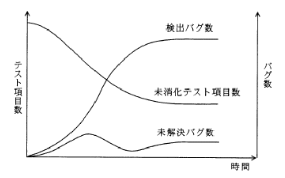

- A.**解決困難なバグに直面しており、その後のテストが進んでいない**  
以下のことが読み取れる  
・時間が進行しても未解決バグ数が減っていないので、バグが解決していない  
・未消化テスト項目数が減っていないのでテスト進行が滞っている  
・検出バグ数が増えていないので、新しいバグが検出されていない  
これらより、解決できないバグが検出されテスト工程の進行がストップしていると予想される

- テスト項目の消化実績が上がっており、バグの発生がなくなった  
未消化テスト項目が横ばいなので、テスト項目の消化が滞っている

- バグが多発し、テスト項目の消化実績が上がらなくなった  
テスト項目数の消化が滞っているが、検出バグ数も横ばいなのでバグが多発しているとはいえない

- バグ発生とテスト項目消化の比率が一致し、未解決バグがなくなった  
未解決バグ数は0になっていない

---
あるシステムをサブシステムa、bに分けて開発している。現在はそれぞれのサブシステムのテストが終了した段階である。現在までのテストに関するデータは表の通り。このシステムの基準テスト項目数は、10項目 / kステップである。バグ検出状況は下記の通り。サブシステムa, bの難易度を同等とすると、現状を適切に評価している記述

|サブシステム名|開発規模|テスト項目数|未解決バグ数|
|-----------|-------|----------|----------|
|a|30kステップ|300|0|
|b|20kステップ|200|0|

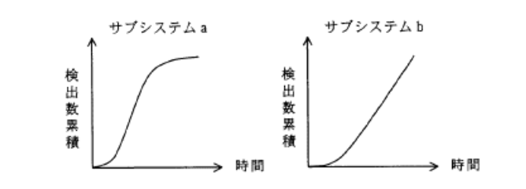

- A.**サブシステムaの方が、サブシステムbよりもバグの検出数が収束しており、品質は高いと判断できる**  
縦軸に検出バグ数、横軸にテストに要した時間(またはテスト消化件数)を取り、一般的な信頼度曲線と比較することでプログラムの品質を判断するために用いられるグラフ。aではテスト終盤以降バグの検出数が少なくなってきているため、未検出バグが少なく品質が高いと判断できる

- 2つのサブシステムとも、品質安定状況になく、追加テストが必要であると判断できる  
aは安定状態に近づいているが、bはバグの検出数が減少していないため安定状態とは言えない

- 2つのサブシステムとも、ほぼ同数のバグが検出されており、品質は同程度と判断できる  
bのテストは品質が安定するまでに更にバグの検出が予想されるため、品質はaの方が良いと判断できる

- 2つのサブシステムとも、未解決バグ数は0件であり、十分にテストされていると判断できる  
同程度の難易度にも関わらず、bのテストはバグの検出率が悪いのでテストに問題がある可能性が考えられる

---
電子メールの暗号化するために使用される方式

- A.**S / MIME**(*Secure / Multipurpose Internet Mail Extensions*)  
電子メールを盗聴や改ざんなどから守るために米国*RSA Data Security*社によって開発された技術で、暗号技術を使用して認証・改ざん検出・暗号化などの機能を電子メールソフトに提供するもの

- BASE64  
日本語の2バイトコードやバイナリデータを64個の英数字の組み合わせにエンコードする方式。日本語が使用できないSMTPにおいて日本語や添付ファイルを送信する際に利用されている

- GZIP  
*Deflate*アルゴリズムを用いた汎用のデータ圧縮プログラム。モダンブラウザのほぼ全てでサポートされているため、WebサーバからブラウザへのリクエストをGZIP圧縮することで転送量を削減したり、サイトの表示速度を向上させることなどに利用されている

- PNG(*Portable Network Graphics*)  
圧縮により画質の劣化のない可逆圧縮の画像ファイルフォーマットで、GIFよりも圧縮率が高く、現在ほぼ全てのブラウザでサポートされているためWebページの画像FOMAととして使用されている

---
手順の電子メールの送受信によって得られるセキュリティ上の効果  
1.送信者は、電子メールの本文を共通鍵暗号方式で暗号化し(暗号文)、その共通鍵を受信者の公開鍵を用いて公開鍵暗号方式で暗号化する(共通鍵の暗号化データ)  
2.送信者は、暗号文と共通鍵の暗号化データを電子メールで送信する  
3.受信者は、受信した電子メールから取り出した共通鍵の暗号化データを、自分の秘密鍵を用いて公開鍵暗号方式で復号し、得た共通鍵で暗号文を復号する

- A.**電子メールの本文の内容の漏洩の防止**  
本文は共通鍵により暗号化され、復号に使用する共通鍵も公開鍵で暗号化されている。本文の複合化には共通鍵が必要、共通鍵を入手するには受信者の秘密鍵が必要なため、盗聴されても通信内容が漏洩することはない<br><br>
S / MIMEで採用されているハイブリッド暗号方式の流れ。共通鍵を公開鍵暗号方式で安全に相手に配送し、その共通鍵を使って通信内容を暗号化・復号することで、安全性と効率性を両立している

- 送信者による電子メールの送達確認  
送信送達を行う仕組みはない

- 送信者のなりすましの検出
- 電子メールの本文の改ざんの有無の検出  
暗号化通信を行うものでありデジタル署名が付与されているわけではないので、改ざんの有無や送信者の認証は検知できない

---
送信者から電子メール本文とそのハッシュ値を受け取り、そのハッシュ値と受信者が電子メール本文から求めたハッシュ値とを比較することで実現できることは何か。受信者から送信者から受け取るハッシュ値は正しいものとする

- A.**電子メール本文の改ざんの有無の検出**  
通信データからハッシュ関数や共通鍵暗号を用いて生成される固定長のデータ(*Message Authentication Code* : メッセージ認証コード)を通信データに付加して送信し、受信側でMACを認証することでデータの改ざんの有無を検知し、通信データの完全性を保証することが可能

---
文書の内容を秘匿して送受信する場合の公開鍵暗号方式における鍵と暗号化アルゴリズムの取り扱い

- A.**暗号化鍵と暗号化アルゴリズムは公開するが、復号鍵は秘密にしなければならない**  
暗号化と復号に異なる鍵を使用する暗号方式。2つの鍵を1対のペアとして生成され、そのうち1つを秘密鍵として所有者が管理し、他方を公開鍵として広く誰でも利用できるようにする。秘密鍵が他者に知られないことに依存し、暗号アルゴリズムは公開されても問題ない(ケルクホフスの原理)。現代の暗号技術は秘密鍵以外が全て明らかになったとしても安全であるよう設計されている

---
画像符号化方式のうち、携帯電話などの低速回線用の動画像の符号化に用いられるもの

- A.**MPEG - 4**  
MPEGを低ビットレートでの使用にまで用途を拡大することを目標として策定された規格。数十k - 数百kビット / sの低ビットレートの圧縮方式で、携帯電子機器などへの利用を対象にしている。動画・音声全般を扱う多様なマルチメディア符号化フォーマットを規定しており、PCで動画を扱う際によく使われるDivやvidに技術が利用されている

- MPEG - 1  
1.5Mビット / 秒程度の圧縮方式で、主にCD - ROMなどの蓄積型メディアを対象にしたもの。CD - ROMに1時間程度の動画を記録することを目的に設計された方式

- MPEG - 2  
数M - 数十Mビット / sの広範の圧縮方式で、蓄積型メディア、放送、通信で共通に利用できる汎用の方式。放送やHDTVを想定した規格で、様々なまディアでの利用を想定して複数の解像度、圧縮率があり、DVD - Videoの映像記録に採用されている

- JPEG  
カラー静止画像の圧縮フォーマットなので不適切

---
エンベロープ暗号化の説明

- A.**暗号化鍵で平文を暗号化してから、その暗号化鍵を別の暗号化鍵で暗号化する**

---
液晶ディスプレイの説明

- A.**光の透過を画素ごとに制御し、カラーフィルターを用いて色を表現するディスプレイである**

- 電極の間に電気を通すと発光する特殊な有機化合物を挟んだ構造のディスプレイである  
有機ELディスプレイの説明

- 電子銃から発射された電子ビームが蛍光体に当たり発光することを利用するディスプレイである  
ブラウン管ディスプレイの説明

- 放電によって発生する紫外線と蛍光体を利用するディスプレイである  
プラズマディスプレイの説明

---
液晶ディスプレイと比較した場合、有機ELディスプレイの特徴

- A.**自ら発光する**  
電圧をかけると自ら発光する有機物を用いたディスプレイ。液晶ディスプレイで用いられるバックライトが不要で、低電圧駆動、低電力消費で動作し、視野角やコントラスト、応答速度の面で優れている

- 視野角が狭い  
見る方向によって階調が変わってしまうという現象がなく、180度に限りなく近い視野角をもつ

- 寿命が長い  
有機ELの有機物は、それ自体が発光するため液晶に比べて寿命が短い

- 発熱が少ない  
原理的には熱をほぼ放出しないが、大型化すると輝度を上げるために電流が必要となり、液晶と同程度の発熱が伴う

---
通信を要求したPCに対し、ARP(*Address Resolution Protocol*)の仕組みを利用して実現できる通信可否の判定方法

- A.**PCのMACアドレスを確認し、事前に登録されているMACアドレスである場合だけ通信を許可する**  
IPアドレスから対応する機器のMACアドレスを取得するプロトコル。無線LANルータなどでは、予めMACアドレスを登録しておいた機器からのみの接続を許可する**MACアドレスフィルタリング**の機能を備えている。無線LANルータ側では接続を要求するPCのIPアドレスからARPを用いることで対応するMACアドレスを取得し、登録済みMACアドレスを比較することで、正規の利用者以外からの接続を防止している

---
LANにおける媒体アクセス制御方式のうち、伝送媒体上でのデータフレーム衝突を検出する機能をもつ方式

- **CSMA / CD**(*Carrier Sense Multiple Access winth Collision Detection* : 搬送波感知多重アクセス / 衝突検出方式)  
1本の同軸ケーブルに複数のコンピュータが接続されているバス型のトポロジを前提とする。伝送路上に他のノードからフレームが送出されていないか確認し、他者が通信をしていなければ送信を中止してランダムな時間待って自分の通信を開始する

- CSMA / CA  
無線LAN規格のIEEE802.11系で使用されている通信プロトコル。無線通信では信頼できる衝突検出の仕組みはない

- トークンパッシング
- トークンパッシングリング  
LAN上を高速で巡回するトークンを確認したノードのみが送信権を得るため、衝突が発生しない仕組みになっている

---
複数のLANを接続するために用いる装置で、OSI基本参照モデルのデータリンク層のプロトコル情報に基づいてデータを中継する装置

- A.**ブリッジ**  
OSI基本参照モデルのデータリンク層で動作し、ネットワークを流れるMACフレーム(イーサネットフレーム)内のヘッダ情報に基づいて通信を中継する機器。MACフレームを受け取ったブリッジは、ヘッダ情報内のMACアドレスと自身がもつMACアドレステーブルに基づき、宛先が存在するポートにのみMACフレームを送出する

- リピータ  
ネットワークを流れる電気信号の増幅や整流を行う機器。主に信号の減衰を防ぎ、ネットワークの物理的な距離を延長するために使用される。OSI基本参照モデルの物理層で動作する

- ルータ  
異なるネットワーク同士を接続し、ネットワークに流れるパケットのIPアドレスを基に通信制御を行う機器。OSI基本参照モデルのネットワーク層で動作する

- ゲートウェイ  
異なるプロトコルやアーキテクチャのネットワークを接続し、データ形式やプロトコルの変換を行う装置。OSI基本参照モデルの7層全ての層の接続を行う

---
VPNで使用されるセキュアなプロトコルであるIPsec、L2TP、TLSのOSI基本参照モデルにおける相対的な位置関係

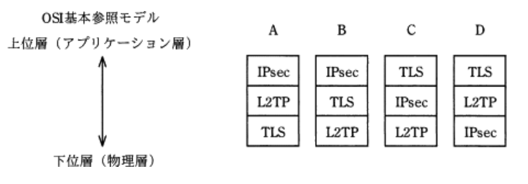

- A.**C**  
`TLS`(*Transport Layer Security*) : 通信の暗号化、デジタル証明書を利用した改ざん検出、ノード認証を含む統合セキュアプロトコル。**トランスポート層(第4層)で動作する**  
`IPsec`(*IP Security*) : IP(*Internet Protocol*)を拡張してセキュリティを高めたプロトコルで、改ざん検知、通信データの暗号化、送信元の認証などの機能を**ネットワーク層(第3層)** レベル(TCP / IPモデルのIP層)で提供する。認証プロトコルAHや認証 / 暗号化プロトコルESPを含む  
`L2TP`(*Layer 2 Tunneling Protocol*) : PPPなどのデータリンク層のフレームをカプセル化し、UDP / IPデータグラムに埋め込むことで、公衆ネットワーク上で伝達可能にするトンネルリングプロトコル。暗号化機能はないため必要に応じてIPsecと併用する必要がある。**データリンク層(第2層)で動作する**

---
TCP / IPネットワークで利用されるプロトコルのうち、ホストにロモーとログインし、遠隔操作できる仮想端末機能を提供するもの

- A.**TELNET**  
IPネットワークにおいて、遠隔地(リモート)にあるサーバを端末から操作できるようにする仮装端末ソフトウェア(プログラム)、またはそれを可能にするプロトコル。認証情報を含め通信を平文で送信する仕様がセキュリティ上の問題とされ、Telnetによるリモートログインは推奨されておらず、安全にリモートログインを行うにはSSHなど情報を暗号化して送信する技術を用いることが必要

- FTP(*File Transfer Protocol*)  
ネットワーク上でファイル転送を行うための通信プロトコル

- HTTP(*Hyper Text Transfer Protocol*)  
WebサーバとWebブラウザがTMLやXMLで記述されたハイパーテキストなど送受信するために使われるプロトコル

- SMTP(*Simple Mail Transfer Protocol*)  
インターネット環境において、クライアントからサーバにメールを受信したり、サーバ間でメール転送するのに用いられるプロトコル

---
TCP / IPの環境で使用されるプロトコルで、構成機器や障害児の情報収集を行うために使用されるネットワーク管理プロトコル

- A.**SNMP**(*Simple Network Management Protocol*)  
TCP / IPネットワーク上でネットワーク上の機器の情報を収集して、管理や制御を行う。マネージャと呼ばれる管理システムとエージェント(ルータやスイッチに含まれている機能)の間で、管理に必要な情報をやり取りする方法を定めている

- NNTP(*Network News Transfer Protocol*)  
インターネット上で情報を交換し合う電子掲示板システムであるNetNewsの記事を読んだり記事を投稿したり際に使われるプロトコル

- NTP(*Network Time Protocol*)  
ネットワークに接続されている環境において、機器が持つ時計を正しい時刻へ同期するための通信プロトコル

- SMTP(*Simple Mail Transfer Protocol*)  
インターネット環境において、クライアントからサーバにメールを送信したり、サーバ間でメールを転送するのに用いられる

---
システムの外部設計を完了させる時、顧客から承認を受けるもの

- A.**画面レイアウト**  
ユーザからのシステム要件をもとにシステムの機能を確定する作業工程。ユーザの立場からみた業務機能を中心に設計を行うことが目的で、サブシステムの定義と機能分割、論理データモデル設計、画面・帳票・コードの設計などが実施される

- システム開発計画  
企画段階や基本計画で実施される

- 物理DB仕様  
内部設計で実施される。外部設計の要件をコンピュータ・システム上で効率よく動作させるためのシステム開発側の視点で設計が行われる

- プログラム流れ図  
プログラム設計で実施される。プログラムの内部構造の詳細設計が行われる

---
アジャイル開発でイテレーション(*Iteration*)を行う目的

- A.**ソフトウェアに存在する顧客の要求との不一致を短いサイクルで解消したり、要求の変化に柔軟に対応したりする**  
アジャイル開発における反復の単位で、分析・設計・実装・テストの一連の活動を含む。概ね数週間定後ごとにこの開発サイクルを繰り返して次第に完成度を高めていく。短期間で区切ることで、開発の工程管理がしやすくなったり、計画の変更に対応しやすくなる利点がある

- タスクの実施状況を可視化して、いつでも確認できるようにする  
タスクボードの目的

- ペアプログラミングのドライバとナビゲータを固定化させない  
ピンポンペアプログラミングの目的

- 毎日決めた時刻にチームメンバが集まって開発の状況を共有し、問題が拡大したり、状況が悪化したりするのを避ける  
日次スクラムの目的

---
XP(*eXtreme Programming*)において、プラクティスとして提唱されているもの

- A.**ペアプログラミング**  
ソフトウェア開発手法で、アジャイルソフトウェア開発と称される一連の手法の先駆けとなったもの。叩き台となるプログラムを早期でに開発し、短いサイクルで頻繁にテストとリリースを繰り返し、顧客の要求への対応力と生産性を高め、リスクを低減することを目的としている。有益な要素を4カテゴリ19プラクティスとして定義している(共同・開発・管理者・顧客)。ペアプログラミングでは、2人1組で実装し、1人がコードを打ち込み、1人はチェックしながら補佐する役割を交代しながら開発を進める。問題解決の時間短縮、レビューを常に行える、集中力の持続、後々の共有に役立つなどの効果があるとされている

---
システム開発におけるウォーターフォールモデルの説明

- A.**開発工程を設計、実装、テストなどに分け、前の工程が完了してから、その成果物を使って次の工程を行う**  
開発の上流工程から下流工程の各工程間を、滝のように上から下に流れるように開発していくモデル。工程管理がしやすく、大規模なシステム開発に向いているが、工程の後戻りが生じると大幅なロスが生じる欠点がある

- 一度の開発ですべてを作るのではなく、基本的なシステムアーキテクチャの上に機能の優先度に応じて段階的に開発する  
インクリメンタルモデルの説明

- 試作品を作り、利用者の要求をフィードバックして開発を進める  
プロトタイピングモデルの説明

- 複雑なソフトウェアを全部最初から作成しようとするのではなく、簡単な部分から分析、設計、実装、テストを繰り返し行い、徐々に拡大していく  
スパイラルモデルの説明

---
ウォーターフォールモデルに関する記述

- A.**システム開発を工程順に進めるので、後戻りすればシステムの開発効率が著しく低下する**  
開発プロジェクトを時系列に要件定義・外部設計などの作業工程(局面・フェーズ)を分割し、原則前工程が完了しないと次工程に進まない(並行しない)。前工程の成果物の品質を確保し、前工程への後戻り(手戻り)を最小限にする開発モデル。工程管理がしやすく、大規模なシステム開発に向いているが、工程の後戻りが生じると、大幅な時間のログが生じる欠点がある

- アプリケーションの部分単位に設計・製造を行い、これを次々に繰り返す  
スパイラルモデルの説明

- 動作可能な試作品を作成し、要求仕様の確認・評価を早期に行う  
プロトタイプモデルの説明

- 利用者の参画、少人数による開発、開発ツールの活用によって短期間に開発する  
RAD(*Rapid Application Development*)開発の説明

---
CAPTCHA(キャプチャ)の目的

- A.**Webサイトなどにおいて、コンピュータではなく人間がアクセスしていることを確認する**  
人間によるアクセスかコンピュータによるアクセスかを判別する目的でWebサイトなどに組み込まれる仕組み。会員登録フォームや投稿フォームにおいて、自動プログラムによる大量の不正リクエストやスパム投稿を排除する目的で設置される。画像や文字の判別が一般的だったが、最近は複数の似た画像から指定されたものを選ぶものやパズル型、Webページ上の行動を解析して判別するタイプのものなど、よりコンピュータの突破が難しい方式が登場している

- 公開鍵暗号と共通鍵暗号を組み合わせて、メッセージを効率よく暗号化する  
ハイブリッド暗号方式の説明

- 通信回線を流れるパケットをキャプチャして、パケットの内容の表示や解析、集計を行う  
パケットキャプチャソフトやLANアナライザの説明

- 電子政府推奨暗号の安全性を評価し、暗号技術の適切な実装法、運用法を調査、検討する  
CRYPTRECの説明

---
キーロガー(*Keylogger*)の悪用例

- A.**ネットバンキング利用時に、利用者が入力したパスワードを収集する**  
PCへのキーボードやマウス入力を逐一監視し、それを記録するソフトウェアまたはハードウェア。悪意をもってPCにインストールされた場合には、利用者の入力情報を秘密裏に盗むことも可能で、キー入力データを解析し、IDやパスワード、クレジットカードの番号などを不正に入手される恐れがあることからセキュリティ上の問題となっている

- 通信を行う2者間の経路上に割込み、両者が交換する情報を収集し、改ざんする  
プロキシサーバを悪用した中間者攻撃に関する記述

- ブラウザでの動画閲覧時に、利用者の意図しない広告を勝手に表示する  
アドウェアを悪用した例

- ブラウザの起動時に、利用者がインストールしていないツールバーを勝手に表示する  
ブラウザをアドオンした悪用した例

---
SoC(*System on a Chip*)の説明

- A.**必要とされるすべての機能(システム)を同一プロセスで集積した半導体チップ**  
1つの半導体チップ上にシステムに必要な一連の機能を集積する回路の設計方法。占有面積の削減・高速化・低消費電力化・コスト削減などのメリットがあるとされている

- CPU、チップセット、ビデオチップ、メモリなどコンピュータを構成するための電子回路基板  
マイクロコントローラの説明

- CPU、メモリ、周辺装置などの間で発生するデータの受渡しを管理する一連の回路群を搭載した半導体チップ  
チップセットの説明

- プロセスが異なる機能は、個別に最適化されたプロセスで製造し、パッケージ上でそれぞれのチップを適切に配線した半導体チップ  
SiP(*System In Package*)の説明

---
プロセッサによってフェッチされた命令の格納順序を示している。`a`に当てはまるもの


- A.**命令レジスタ**  
主記憶から取り出された命令が格納される  
`命令フェッチ` : プログラムカウンタが示すアドレスから命令語を命令レジスタに取り出す(ここでは主記憶)  
`命令デコード` : 命令デコーダが取り出した命令を解読する  
`実行(有効)アドレス計算` : 命令語のオペランド部の値を用いて、演算対象のデータを保持する主記憶のアドレスを計算する  
`オペランドフェッチ` : 計算されたアドレス値を用いて主記憶からデータを汎用レジスタに取り出す  
`実行` : 解読された命令と演算対象のデータで命令を用いて演算を行う

- アキュムレータ  
演算途中の結果を一時的に保持しておくためのレジスタ

- データキャッシュ  
キャッシュメモリの1つで、データ(オペランド)をキャッシュしておく役割を持つ。`a`がプロセッサ内部の記憶装置であることを示しているが、キャッシュメモリはプロセッサ外部の装置なので不適切。データキャッシュは命令を格納しない

- プログラムレジスタ(プログラムカウンタ)  
次に実行するべき命令が格納されている主記憶上のアドレスを保持するレジスタ

---
処理装置で用いられるキャッシュメモリの使用目的

- A.**主記憶へのアクセス速度とプロセッサの処理速度の差を埋める**  
主記憶は補助記憶と比べ高速だがCPUと比較すると動作は遅く、この速度差からCPUが主記憶にアクセスしている間はCPUに待ち時間が生じ、処理効率の低下を招く。キャッシュメモリは、主記憶とは異なる半導体を使用した非常に高速にアクセスできるメモリで、CPUと主記憶の速度差を埋め、CPUの処理効率を向上させる役割をもつ

- 仮想記憶のアドレス変換を高速に行う  
TLB(*Translation Lookaside Buffer*)の説明

- 仮想記憶のページング処理を高速に行う  
メモリ管理ユニット(*Memory Management Unit*)の説明

- 使用頻度の高いプログラムを常駐させる  
主記憶の説明(いわゆるメモリ)

---
キャッシュメモリに関する記述

- A.**主記憶のアクセス時間とプロセッサの命令実行時間の差が大きいマシンでは、多段のキャッシュ構成にすることで実効アクセス時間が短縮できる**  
キャッシュメモリは多段構成にされることもあり、CPUに近いほうから1次キャッシュ、2次キャッシュと呼ぶ。CPUが主記憶より読込むのは命令とデータの2種類があり、1次キャッシュはそれぞれに個別のキャッシュを用意する分離型、2次キャッシュはどのデータも記憶できる統合型というように階層構成にするとCPUは命令とデータを同時に読み出すことができるので実行アクセス時間を短くすることができる

- キャッシュミスが発生するとキャッシュ全体は一括消去され、主記憶から最新のデータの転送処理が実行される  
ミスヒットした場合、必要となるブロックだけが主記憶からキャッシュに転送される

- キャッシュメモリの転送ブロックの大きさを仮想記憶のページの大きさと同じにすると、プログラムの実行効率が向上する  
通常、キャッシュメモリの転送ブロックサイズ(キャッシュラインサイズ)は数バイト ~ 数十バイトとページサイズと比較して相当に小さい。キャッシュメモリの転送ブロックを大きくすると転送回数が減るが使われない部分が増えます。この使われない部分がキャッシュメモリに多く存在するとヒット率が低下することになるため、結果としてプログラムの実行効率は低下してしまう

- キャッシュメモリは高速アクセスが可能なので、汎用レジスタと同じ働きをする  
レジスタは、キャッシュメモリよりもさらに高速

---
キャッシュメモリに関する記述

- A.**データ書込み命令を実行したときに、キャッシュメモリと主記憶の両方を書き換える方式と、キャッシュメモリだけを書き換えておき、主記憶の書換えはキャッシュメモリから当該データが追い出されるときに行う方式とがある**  
主記憶との同期をとる書込み方式は、キャッシュメモリと主記憶の両方を書き換えるのがライトスルー方式、主記憶の書き換えはキャッシュメモリから当該データが追い出される時に行うのがライトバック方式の2種類がある

- キャッシュメモリにヒットしない場合に割込みが生じ、プログラムによって主記憶からキャッシュメモリにデータが転送される  
キャッシュメモリに目的のデータが存在しないと主記憶を探索するが、割込みは発生しない

- キャッシュメモリは、実記憶と仮想記憶とのメモリ容量の差を埋めるために採用される  
ディスクキャッシュの説明。キャッシュメモリはCPUと主記憶の速度差を埋めるために設置される

- 半導体メモリのアクセス速度の向上が著しいので、キャッシュメモリの必要性は減っている  
半導体メモリの速度は向上しているが、CPUとの速度差は処理装置の加速度的な高性能化により益々拡大している

---
コンピュータの命令実行順序

- A.**命令フェッチ, 命令の解読, オペランド読出し, 命令の実行**  
1.プログラムカウンタを参照し、次の命令が格納されている位置を知る  
2.主記憶から命令レジスタに命令を読込む(`命令フェッチ`)  
3.次に実行する命令の主記憶上のアドレスをプログラムカウンタに格納する  
4.命令レジスタの命令を命令デコーダで解読(解釈)する(`命令の解読`)  
5.演算で必要となる値(オペランド)を主記憶から汎用レジスタに読込む(`オペランド読出し`)  
6.`命令を実行`する  
7.実行結果をメモリやレジスタに書込む

---
命令キャッシュを効果的に使用できるプログラムの作成方法

- A.**頻繁に実行される処理部分をまとめる**  
1度実行された命令は近い将来呼び出される可能性が高い考えに基づき、その命令をより高速にアクセスできるキャッシュメモリに保持させておく仕組み。プログラム中の頻繁に実行される処理部分をまとめておくことで、1度行った命令部分はキャッシュから読み出されることになり、より高速な処理が期待できる

---
無線LANやVPN接続などで利用され、利用者を認証するためのシステム

- A.***RADIUS***(*Remote Authentication Dial In User Service*)  
認証情報と認証手続き、利用ログの記録(アカウンティング)をネットワーク上のサーバに一元化することを目的としたシステム。アクセスサーバ機能と認証サーバ機能を分離した構成をとるため、複数のアクセス手段がある場合でも単一のサーバに認証を集約できる。常時接続方式のインターネット接続サービス、無線LAN、VLAN、コンテンツ提供サービスなどのサービス提供者側設備において、認証とアカウンティングを実現するプロトコルとして広く利用されている

- DES(*Data Encryption Standard*)  
共通鍵暗号方式の規格の1つ

- DNS(*Domain Name System*)  
ドメイン名とIPアドレスを対応付けるためのシステム

- IDS(*Instruction Detection System*)  
ホストやネットワークへの不正アクセスを監視し、検知した不正挙動をネットワーク管理者に通知する機能をもつソフトウェア・ハードウェアのこと

---
ある企業では、顧客マスタファイル、商品マスタファイル、担当者マスタファイル及び当月受注ファイルを基にして、月次で受注実績を把握している。各ファイルの項目が表のとおりであるとき、これら四つのファイルを使用して当月分と直前の3か月分の出力が可能な受注実績

|ファイル|項目|尾行|
|------|----|---|
|顧客マスタ|顧客コード, 名称, 担当者コード, 先月(2, 3ヶ月前)受注額|各顧客の担当者1人|
|商品マスタ|商品コード, 名称, 先月(2, 3ヶ月前)受注額|-|
|担当者マスタ|担当者コード, 氏名|-|
|当月受注|顧客コード, 商品コード, 受注額|当月の合計受注額|

- A.**担当者別の顧客別受注実績**  
ファイルを関係DBの表として関連をまとめると下記の通り。顧客マスタファイルには担当者コードの列があるので、担当者コードと顧客コードをキーとして並び替えることで当月と直前3ヶ月分の担当者別受注実績が出力可能

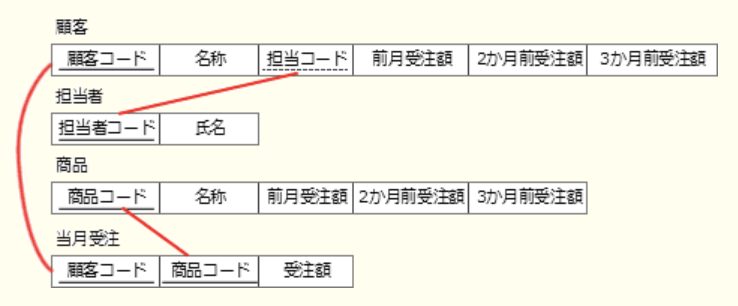

- 顧客別の商品別受注実績  
受注商品と顧客が関連付けられている記録があるのは当月分のみで、先月から3ヶ月前は受注合計額のデータしかない

- 商品別の顧客別受注実績  
商品マスタファイルは顧客別に集計されていない

- 商品別の担当者別受注実績  
商品マスタファイルに受注した商品と担当者を関連付ける項目(担当者コード)がないため、担当者別の出力はできない

---
ある商店では、約200品目の商品を取り扱っている。商品データの新規登録画面の入力項目のうち、入力方式としてプルダウン(ドロップダウン)メニューが適しているもの

| |項目|様式と規則|
|-|---|--------|
|ア|商品番号|5桁の英数字で、商品ごとに付番する|
|イ|商品名|40字以内の日本語で、商品ごとに命名する|
|ウ|商品区分|10字以内の日本語で、5区分ある|
|エ|価格|6桁の数字で、10,000-100,000円である|

- A.**ウ**  
決められた複数の選択肢からユーザが項目を選択するためのGUI部品。選択肢が少ない・直接入力よりも入力が早い・全項目を読まなくても選択できる・複数項目を選択しないという条件を満たす場合に利用可能。他の項目は商品ごとに異なるので項目数が品目数と同数近くになるため、適していない

---
顧客番号をキーとして顧客データを検索する場合、2分探索を使用するのが最も適しているもの

- A.**顧客番号の昇順に配置されているデータ構造**  
要素が昇順または降順に整列された集合に対して、探索範囲の中央に位置する値と目的の値を比較して探索範囲を半分に狭めることを再帰的に繰り返して目的のデータを探索する

---
2分探索において、データの個数が4倍になると、最大探索回数はどうなるか

- A.**2回増える**  
要素が昇順(降順)に整列された集合に対して、探索範囲の中央に位置する位置と探索する値を比較し、探索する値に応じて探索範囲を半分に狭めて探索することを繰り返すことで目的のデータを探索する。比較・探索を行うと探索範囲は1 / 4に減少する

---
使用性(ユーザビリティ)の規格(JIS Z 8521)では、“ある製品が、指定された利用者によって、指定された利用の状況下で、指定された目的を達成するために用いられる際の、有効さ、効率及び利用者の満足度の度合い”と定義している。定義中の“利用者の満足度”を評価する時に用いる方法

- A.**インタビュー法**  
有効性・効率・満足度の3指標で評価する必要がある。満足度だけは実際に操作を行ったユーザへの聞き取り調査でしか知ることが出来ない。満足度に対する評価は、利用者へのインタビューやアンケート調査などを行うことが適切な方法

- ヒューリスティック評価  
複数の専門家が、設計仕様書や紙のプロトタイプを見ながら、既知の経験則に照らし合わせて問題点を明らかにする手法

- ユーザビリティテスト  
数人の被験者がタスクを実行する過程を観察し、被験者の行動、発話からユーザインターフェイス上の問題点を発見する評価手法

- ログデータ分析法  
被験者に製品を操作してもらい、操作ログから利用パターンを分析しユーザビリティ問題を明らかにする評価手法

---
コードから商品の内容が容易に分かるようにしたい時、どのコード体系を選択するのが適切か

- A.**表意コード(*Mnemonic Code*)**  
値から対象のデータを容易に連想できる英数字・記号の組合せをコードとして割り当てる方式。他のコードよりも桁数が多くなるが、利用者が記憶しやすく、商品番号や製品の連番としてよく使用される(国名、役職など)

- 区分コード(ブロックコード)  
営業部は1000 - 1999、企画部は2000 - 2999というように、グループ毎に定められた範囲内でコードを割り当てる方式。上位桁を見るだけで属しているグループを判別できる特徴がある

- 桁別コード  
各桁(桁のグループ)に分類上の意味を持たせたコード体系。JANコード、ISBNコード、運転免許証の番号などが桁別コードに該当する

- 連番コード(シーケンスコード)  
0001 -> 0002 -> … -> 9999のように連続した値をデータに1つずつ割り当てる方法

---
SIEM(*Security Information and Event Management*)の機能

- A.**様々な機器から集められたログを総合的に分析し、管理者による分析と対応を支援する**  
OS, DB, アプリケーション, ネットワーク機器など多様なソフトウェアや機器が出力する大量のログデータを分析し、異常時に管理者に通知したり対策を知らせたりする仕組み。日本語ではセキュリティ情報およびイベント管理と訳される

- 隔離された仮想環境でファイルを実行して、C&Cサーバへの通信などの振る舞いを監視する  
サンドボックス技術を利用した機能

- ネットワーク上の様々な通信機器を集中的に制御し、ネットワーク構成やセキュリティ設定などを変更する  
SDN(*Software Defined Network*)の機能

- パケットのヘッダ情報の検査だけではなく、通信先のアプリケーショプログラムを識別して通信を制御する  
IPS(侵入防止システム)やWAF(*Web Application Firewall*)の機能。SIEMには通信を制御する機能は備わっていない

---
セキュリティプロトコルSSL(*Secure Sockets Layer*)の特徴

- A.**SSLを利用するWebサーバでは、そのFQDNをデジタル証明書に組み込む**  
通信の暗号化、デジタル証明書を利用した改ざん検知、ノード認証を含む統合セキュアプロトコル。主にWebブラウザとWebサーバ間でデータを安全にやり取りするための業界標準プロトコルとして使用されている。上位のアプリケーション層のプログラムから意識することなく利用が可能。通信相手の真正性を確認するためにデジタル証明書にはFQDNまたはIPアドレスを含める必要がある

- SSLはWebサーバだけで利用されるセキュリティ対策用のプロトコルで、ネットワーク層に位置するものである  
トランスポート層に位置する

- 個人認証用のデジタル証明書は、PCごとに固有のものを作成する必要がある  
PCごとに固有のものを作成する必要はない

- 日本国内では、政府機関に限り128ビットの共通鍵長のデジタル証明書を取得申請できる  
政府機関でなくても128ビット長のデジタル証明書の取得申請ができる。鍵長は40 - 256bit

---
WPA3はどれか

- A.**無線LANのセキュリティ規格**  
無線LANのセキュリティプロトコルWPA2の後続となる時期バージョン。KRACKsと呼ばれる4ウェイハンドシェイク時の脆弱性に伴い、WPA3ではセキュリティ強化が図られている

- HTTP通信の暗号化規格  
TLS(*Transport Layer Security*)やHTTPS(*HTTP Secure*)の説明

- TCP / IP通信の暗号化規格  
IPsec(*IP Security Architecture*)の説明

- Webサーバで使用するデジタル証明書の規格  
ITU - T X.509の説明

---
IPv4において、インターネット接続用ルータのNAT(*Network Address Translation*)機能の説明

- A.**プライベートIPアドレスとグローバルIPアドレスを相互に変換する機能である**  
プライベートIPアドレスとグローバルIPアドレスを1対1で相互変換する技術。複数の端末が同時にインターネット接続する場合に、対応する数のグローバルIPアドレスが必要

- インターネットへのアクセスをキャッシュしておくことによって、その後に同じIPアドレスのWebサイトへアクセスする場合、表示を高速化できる機能である  
プロキシやWebブラウザなどがもつキャッシュ機能の説明

- 通信中のIPパケットを検査して、インターネットからの攻撃や侵入を検知する機能である  
IDSやWAFがもつ機能

- 特定の端末宛てのIPパケットだけを通過させる機能である  
ファイアウォールがもつパケットフィルタリングの機能

---
社内ネットワークからインターネット接続を行う時に、インターネットへのアクセスを中継し、Webコンテンツをキャッシュすることによってアクセスを高速にする仕組みで、セキュリティ確保にも利用されるもの

- A.**プロキシ(*proxy*)**  
内部LANからのインターネットアクセスを中継する機器。Webページのアクセス時に内容をキャッシュしておき、次に同じページにアクセス要求があった場合にはインターネットに問い合わせることなくサーバに保持しているキャッシュをクライアントに返す。Webページアクセスはクライアントではなくプロキシサーバが代理で行うので、ネットワーク内部を外部から秘匿にできセキュリティ確保も期待できる

- DMZ(*DeMilitarized Zone*)  
ファイアウォールの中でも外でもない中間的なエリア。公開サーバなど外部からアクセスされる可能性のある情報資源を設置するエリア

- IPマスカレード(NAPT)  
プライベートIPアドレスとグローバルIPアドレスを1対1で相互変換するNATに、ポート番号でのクライアント識別を組み合わせた技術。1つのグローバルIPアドレスで複数のプライベートIPアドレスを持つノードが同時にインターネットに接続できる

- ファイアウォール  
ネットワーク同士の境界線に設置し、不正なデータの通過を阻止するためのもの

---
仮想記憶方式でページフォールトが発生した時、主記憶に最も古くから存在するページを追い出すアルゴリズム

- A.**FIFO(*First - in First - Out*)**  
先入れ先出し、置き換え対象の中に最も古くから存在するページを追い出すアルゴリズム

- LIFO(*Last - in First - out*)  
後入れ先出し、置き換え対象の中に最後に追加されたデータを追い出すアルゴリズム

- LFU(*Last Frequently Used*)  
置き換え対象の中で最も参照回数の少ないページを置き換えるアルゴリズム

- LRU(*Last Recently Used*)  
置き換え対象の中で最も長い時間参照されていないものを置き換え対象とするアルゴリズム

---
ページング方式の仮想記憶において、ページフォールトの発生回数を増加させる要因

- A.**主記憶に存在しないページへのアクセスが増加すること**  
プログラムの実行に必要なページが主記憶に存在していない時に発生する割込み。ページフォールトが発生すると、ページアウトやページインなどのページ置換え処理が実行される。主記憶に存在しないページへのアクセス要求によって発生し、主記憶に存在するページにアクセスしている限りは発生しない

---
外部割込みの原因となるもの

- A.**タイマによる時間経過の通知**  
タイマ割込みは、システムに設定されたタイマが所定時間を経過したときに発生する割込みで、外部割込みに分類される

システムにすぐに対処しなくてはならない問題などが生じたときに、実行中のプログラムの処理を強制的に停止し、優先的に事象の解決を図ることを可能にする仕組み。実行中のプログラムが原因でCPU内部で発生する内部割込みと、それ以外の(CPU外部で発生する)外部割込みに分類することができる  
・内部割込み  
実行中のプログラムが原因で起こる割込み。プログラム割込み、スーパーバイザコール割込み(プログラムからOSへの処理依頼)、ページフォールト割込みなど  
・外部割込み  
機械チェック割込み、タイマ割込み、入出力割込み

- ゼロによる除算命令の実行  
解が無限に存在するため不正な処理として扱われる。処理中のプログラムによって引き起こされる割込み(プログラム割込み)なので、内部割込みに分類される

- 存在しない命令コードの実行  
実行中のプログラムが原因で発生する割込みなので、内部割込みが分類される

- ページフォールトの発生  
プログラムが主記憶上に存在しないデータにアクセスしようとした時に発生する割込みで、内部割込みが分類される

---
内部割込みに分類されるもの

- A.**ゼロで除算を実行したことによる割込み**  
CPU内部の要因で発生する割込み。不正な処理が行われたことによるプログラム割込み(内部割込み)

- 商用電源の瞬時電源などの電源異常による割込み  
ハードウェア障害の際に行われる、機械チェック割込み(外部割込み)

- 入出力が完了したことによる割込み  
外部割込みの説明

- メモリパリティエラーが発生したことによる割込み  
メモリでのエラー発生はCPU外部のことなので外部割込み

---
OSが記憶領域の割当てと解放を繰り返すことによって、細切れの未使用領域が多数できてしまう現象

- A.**フラグメンテーション**  
主記憶を区画してプログラムに割り当てる結果生じる主記憶上の不連続な未使用領域のこと。未使用領域の合計が実行するタスクより大きくても不連続なためプログラムのロードができず、タスクを実行に使えない領域となっている状態

- コンバクション  
主記憶上の断片化した空き領域をまとめることで連続した空き領域を作り出しフラグメンテーションを解消する方法

- スワッピング  
何らかの理由で主記憶上にあるプログラムが長時間待ち状態になっている場合に、プログラムを実行中のまま補助記憶上のスワップファイルに退避し、他のプログラムを主記憶にロードすることで主記憶を効率的に利用する方法

- ページング  
仮想記憶管理方式の1つで仮想アドレス空間を固定長の区画(ページ)に分割、主記憶上も固定長に分割して、ページ単位で主記憶と補助記憶装置のアドレス変換を行う方式

---
主記憶に配置されたプログラムを、CPUが順に読み出しながら実行する方式

- A.**プログラム格納(内蔵)方式**  
処理するプログラムを外部から主記憶装置に格納しておいて、CPUが読込ながら処理を行うコンピュータアーキテクチャの方式

- DMA(*Direct Memory Access*)制御方式  
入出力装置がCPUを介さずにメモリとの間で直接データを転送する方式

- アドレス指定方式  
命令が処理対象とするデータの主記憶上の位置を指定する方式

- 仮想記憶方式  
プログラムが必要とするメモリサイズが主記憶のサイズを上回った場合、補助記憶装置(HDDなど)を仮想アドレス空間として利用することで、主記憶のサイズより大きなプログラムを実行可能にする方式

---
仮想記憶方式の1つに、仮想アドレス空間を固定調の領域に分割して管理するものがる。この固定調の領域を示す用語

- A.**ページ**  
仮想アドレス空間を固定調の区画に分割、同時に主記憶上も同じように固定長に分割して、ページ単位で主記憶と補助記憶装置のアドレス変換を行う方式。補助記憶装置から主記憶にページを移すことをページイン、主記憶から補助記憶装置に移す場合はページアウト

- セクタ  
磁気ディスク装置においてデータを記録するための最小単位

- セグメント  
実記憶空間や仮想記憶空間を論理的に意味のあるように分割するため、単位は可変長

- フレーム  
HDLC, イーサネットなどのデータリンク層における基本的な伝送単位

---
DBMSにおいて、スキーマを決める機能

- A.**定義機能**  
表、列、データ型、制約、索引、ビューなどのDB構造(スキーマ)そのものを規定する機能。SQLの定義機能を担うのがDDL(*Data Definition Language* : データ定義言語)

- 機密保全保護機能  
ユーザ認証、アクセス権限、利用ログの記録、暗号化などによってデータを安全に保つ機能

- 障害回復機能  
ロールバック、ロールフォワード、チェックポイント、更新前 / 更新後ログの記録などによってDBを障害から回復させる機能

- 保全機能  
排他制御や参照制約、表制約などによってデータの完全性を保つ機能

---
DBMSにおけるデッドロックの説明

- A.**複数のトランザクションが、互いに相手のロックしている資源を要求して待ち状態となり、実行できなくなること**  
共有資源を使用する2つ以上のプロセスが、互いに相手プロセスが必要とする資源を排他的に使用していて、互いのプロセスが相手が使用している資源の開放を待っている状態。プロセスが永遠に待ち状態になってしまうため、プロセスの続行ができなくなってしまう

- 2相ロックにおいて、第1相目でロックを行ってから第2相目でロックを解除するまでの状態のこと  
セキュア状態(中間状態)の説明。2相コミットメント制御において1相目で行うロック後に、各サイトのトランザクションがコミットもロールバック可能な状態にある

- ある資源に対して占有ロックと占有ロックが競合し、片方のトランザクションが待ち状態になること
- あるトランザクションがアクセス中の資源に対して、他のトランザクションからアクセスできないようにすること  
排他制御の説明

---
DBの排他制御におけるロックに関する説明

- A.**ロックには、読取り時に使用する共有ロックと、変更時に用いる占有ロックがある**  
共有ロックはデータを読み込む時に使い、他のトランザクションによる読取は可能だが更新処理ができなくなる。占有ロックはデータの更新の際に使い、資源がこの状態では他のトランザクションによる読み込みや更新ができなくなる

- デッドロックが発生した場合には、両方のトランザクションをロールバックする  
両方をロールバックすると、再実行時にデッドロックが発生する可能性があるため、片方のトランザクションをロールバックする

- ロックの粒度は大きいほど並列に実行されるトランザクションは多くなる  
粒度 : 表や行などのロックをかける単位のこと。粒度が小さいほど並行実行が可能になるが、ロックの回数が多くなり制御するためのオーバヘッドが増加する。粒度が大きいほど資源の開放待ち時間が増え、並行実行の多重度がヘ減るためDBの効率が低下する

- ロックを用いると、デッドロックが発生することはない  
共有資源を使用している2つ以上のプロセスが、互いに空いてプロセスが必要とする資源を占有ロックしていて、互いのプロセスが相手が使用している資源の開放を待っている状態

---
列A1から列A5から成るR表に対する次のSQL文は、関係代数のどの演算に対応するか  
`select A1, A2, A3 from R where A4 = 'a'`

- A.**選択と射影**  
結合 : 2つ以上の表を共通の列で関連付けて結合し、新たな表とする演算  
和 : いずれかに属する行を合わせて新たしい表を作る演算  
差 : 表Aに存在し、表Bに存在しない行のみで新しい表を作る演算  
R表の中からA4列の値が'a'である行(**選択**)のA1, A2, A3列を取り出す操作(**射影**)を行う

---
インターネットに接続された利用者のPCから、DMZ上の公開Webサイトにアクセスし、利用者の個人情報を入力すると、その個人情報が内部ネットワークのDBサーバに蓄積されるシステムがある。利用者個人のデジタル証明書を用いたTLS通信を行うことによって期待できるセキュリティ上の効果

- A.**PCとWebサーバ間の通信データを暗号化するとともに、利用者を認証することができるようになる**  
DMZを介した通信になっているので、コネクションを確立するのは利用者PCとWebサーバ、WebサーバとDBサーバの組みとなる。デジタル証明書は利用者個人のものなので利用者認証のために使用する  
TLS通信では、必須のサーバ認証とは別にオプションでクライアント認証を行うこともできる。利用者PCと通信を行うWebサーバは、利用者個人のデジタル証明書に付された認証局の署名を検証することで、デジタル証明書の正当性を確認する。デジタル証明書が正当なものならば、利用者(クライアント)の真正性が証明される

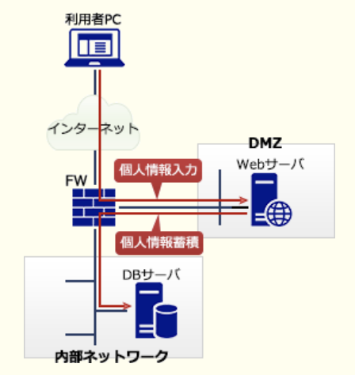

- PCとDBサーバ間の通信データを暗号化するとともに、正当なDBサーバであるかを検証することができるようになる  
利用者PCと通信を行うのはWebサーバ。利用者個人のデジタル証明書は利用者の認証に使用する

- PCとDBサーバ間の通信データを暗号化するとともに、利用者を認証することができるようになる  
DMZを介した通信なので利用者OCとDBサーバは通信を行わない。利用者PCと通信を行うのはWebサーバ

- PCとWebサーバ間の通信データを暗号化するとともに、正当なDBサーバであるかを検証することができるようになる  
利用者個人のデジタル証明書は利用者の認証に使用する

---
クラスCのプライベートIPアドレスとして利用できる範囲

- A.**192.168.0.0 ~ 192.168.255.255**  
クラスCのプライベートIPアドレスとして利用できる範囲。先頭8ビットが`11000000`(11から始まる)で、1ネットワーク内でノードに割り振れるアドレス数は最大254個

- 10.0.0.0 ~ 10.255.255.255  
クラスAのプライベートIPアドレスとして利用できる範囲。先頭8ビットが`00001010`(00から始まる)

- 128.0.0.0 ~ 128.255.255.255  
クラスBアドレスだが、プライベートIPアドレスとして利用できる範囲ではない

- 172.16.0.0 ~ 172.31.255.255.255  
クラスBのプライベートIPアドレスとして利用できる範囲。先頭8ビットが`10101100`(10から始まる)

---
文字列中で同じ文字が繰り返される場合、繰り返し部分を反復回数と文字の組に置き換えて文字を短くする方法

- A.**ランレングス符号化**  
連続したデータを、データ1つ分と連続した長さで表現して圧縮した方法。`AAAAABBBBBBBBBAAA`はA5B9A3と表せる。データが2種類だけで最初にAが来ることにすれば593だけで表せる。Bが最初に見つかった場合、Aが0回連続していることにすれば良いので、`BBBAAAAABBBBBAAA`は03553で表せる

---
稼働率が最も高いシステム構成はどれか。並列に接続したシステムは、少なくともどれかか1つか稼働していればよいものとする

- A.**稼働率80％の同一システムを3つ並列に接続**  
稼働率Rの機器がn個の並列構成になっているシステムの稼働率は、$1-(1-R)^n$  
$1-0.2^3=1-0.008=0.992$

- 稼働率70％の同一システムを4つ並列に接続  
$1-0.3^4=1-0.0081=0.9919$

- 稼働率90％の同一システムを2つ並列に接続  
$1-0.1^2=1-0.01=0.99$

- 稼働率99％の単一システム  
99% = 0.99

---
コンピュータシステムの運転状況を集計したところ、各月のCPU使用率と有休時間の合計は表の通り。3ヶ月からにおけるCPUの平均使用率

|月|使用率(%)|有休時間の合計(時間)|
|-|--------|------------------|
|4|60|120|
|5|80|20|
|6|20|80|

- A.**56%**  
有休時間の割合は`1 - 使用率`、各月の全稼働時間を計算する  
4月 -> 120 / (1 - 0.6) = **300h**  
5月 -> 20 / (1 - 0.8) = **100h**  
4月 -> 80 / (1 - 0.2) = **100h**  
CPU使用時間は、500 - 220 = **280h**  
平均CPU使用率は、280 / 500 = **0.56**

---
ある工場では、同じ製品を独立した2つのラインA, Bで製造している。ラインAでは製品全体の60%を製造し、ラインBでは40%を製造している。ラインAで製造された製品の2%が不良品であり、ラインBで製造された製品の1%が不良品であることが分かっている。この工場で製造された製品の1つを無作為に抽出して調べたところ不良品であった。その製品がラインAで製造された確率

- A.**75**  
製品全体を100個とすると、ラインAは60個、ラインBは40個。不良品はラインAでは12個(2%)、ラインBは4個(1%)。不良品全体のうちラインAのものの割合は、  
$12/(12+4)=0.75(75\%)$

---
ソフトウェアのリバースエンジニアリング(*Reverse Engineering*)の説明

- A.**既存のソフトウェアを解析し、その仕様や構造を明らかにする**  
既存製品やソフトウェアの動作を分解・解析して、構造や機能・動作を明らかにし、それに基づいて製造方法や動作原理、設計図、ソースコードなどを得る技法

- 開発支援ツールなどを用いて、設計情報からソースコードを自動生成する  
フォワードエンジニアリングの説明

- 外部から見たときの振る舞いを変えずに、ソフトウェアの内部構造を変える  
リファクタリングの説明

- 既存のソフトウェアを分析し理解した上で、ソフトウェア全体を新しく構築し直す  
リエンジニアリングの説明

---
ソフトウェア開発プロジェクトで行う構成管理の対象項目

- A.**プログラムのバージョン**  
ソフトウェアがどのような構成品目の組み合わせで構成されているかの構成識別体系を管理台帳や管理用のソフトウェアに記録して管理すること。個々のプログラム、ライブラリ、設計書、マニュアルなどの構成要素ごとに、変更内容、最新のバージョン番号、リリース番号、ビルド番号などが記録されている

---
クライアントPCで行うマルウェア対策

- A.**ウイルスがPCの脆弱性を突いて感染しないように、OS及びアプリケーションの修正パッチを適切に適用する**  
マルウェアは、不正な有害な動作をする目的で悪意をもって作成されたソフトウェアやプログラムの総称を意味する。OSやアプリケーションには毎日のように脆弱性が見つかっているので、提供される修正パッチをインストールしPCを堅牢な状態にしておくことが適切

- PCにおけるウイルスの定期的な手動検査では、ウイルス対策ソフトの定義ファイルを最新化した日時以降に作成したファイルだけを対象にしてスキャンする  
定義ファイルの更新以前にファイルがウイルスに感染している可能性があるため不適切

- 電子メールに添付されたウイルスに感染しないように、使用しないTCPポート宛ての通信を禁止する  
不必要なポートを塞ぐことはセキュリティ強化に効果的。ただし電子メールは平時使用されるサービスなので、ポート(TCP25)を塞ぐとウイルス以外の通常のメールが利用できなくなってしまう

- ワームが侵入しないように、クライアントPCに動的グローバルIPアドレスを付与する  
ワーム対策としてはクライアントPCにプライベートアドレスを設定し、NATやNAPTなどを介してインターネットに接続させる方法が適切。クライアントPCがグローバルIPで直接インターネットに接続できる環境だとワームの感染リスクが高まる

---
ウイルスの調査手法に関する記述

- A.**逆アセンブルはバイナリコードの新種ウイルスの動作を解明するのに有効な手法である**  
実行ファイルをアセンブリ言語に逆変換する。ソースコードが入手できないソフトウェアファイルの動作を知りたい場合、機械語ではなくプログラマが理解しやすいアセンブリ言語に変換した後で解析を行う

- パターンマッチングでウイルスを検知する方式は、暗号化された文書中のマクロウイルスの動作を解明するのに有効な手法である  
パターンファイル、ウイルス定義ファイル等を用いて、何らかの特徴的なコードをパターンとしてウイルス検査対象と比較することで検出する手法、暗号化されたウイルスには効果を発揮しない。他のファイル中に埋め込まれたウイルスが暗号化された場合、ファイル内の正常なデータや暗号化手法によって、元のウイルスのパターンと異なるデータとしてファイル内に存在することになるためパターンマッチしなくなる

- ファイルのハッシュ値を基にウイルスを検知する方式は、未知のウイルスがどのウイルスの亜種かを特定するのに確実な手法である  
亜種でもハッシュ値は似通った値にはならないので種類の特定には効果を発揮しない

- 不正な動作からウイルスを検知する方式は、ウイルス名を特定するのに確実な手法である  
ウイルス名の特定には不向きだが、検知された感染・発病動作からどの系統に属するウイルスであるかを判定することに向いている

---
経済産業省とIPAが策定した"サイバーセキュリティ経営ガイドライン(Ver1.1)"が、自社のセキュリティ対策に加えて、実施状況を確認すべきとしている対策

- A.**自社のサプライチェーンのビジネスパートナーが行うセキュリティ対策**  
サイバーセキュリティ経営ガイドラインは、サイバー攻撃から起業を守る観点で、経営者が認識する必要のある3原則、及び経営者が情報セキュリティ対策を実施する上での責任者となる担当幹部(CISO等)に指示すべき「重要10項目」をまとめたもの。  
・セキュリティ投資にリターンは望めないので、経営者がリーダーシップをとって対策を推進すべきである  
・系列企業やサプライチェーンのビジネスパートナ等を含めたセキュリティ対策が必要である  
・平時からのセキュリティ対策に関する情報開示など、ステークホルダとの適切なコミュニケーションが必要である

---
ネットワークシステムのセキュリティ対策に関する記述

- A.**閉域接続機能をもつ回線交換網を利用して、回線接続の範囲を特定の利用者グループに限定することは、外部からの不正アクセスの防止に有効である**

- ISDN回線やパケット交換回線では、接続時に通知される相手の加入者番号によって相手確認を行うことができる。これをコールバックと呼ぶ  
番号表示サービスの説明。コールバックは、受信側が一旦回線を切断した後、発信側に掛け直すことで利用者確認を行う手法

- 回線暗号化装置をDTE(通信制御装置や端末装置など)とDCE(モデムやDSUなど)の間に設置して、伝送区間ごとに暗号化を行う方法では、既設のハードウェアやソフトウェアの一部に変更が必要になる  
回線暗号化装置は暗号化と復号の機能を持っているため、既設のハードウェアやソフトウェアの変更は不要

- 無線LANの使用は、ケーブルを介在させないので伝送途中の盗聴防止に有効である  
無線LANは電波によって通信を行うため、盗聴や漏洩の危険性は有線LANよりも高くなる

---
利用者のPCから電子メールを送信する時や、メールサーバ間で電子メールを転送する時に使われるプロトコル

- A.**SMTP(*Simple Mail Transfer Protocol*)**  
インターネット環境において、クライアントからサーバにメールを送信したり、サーバ間でメールを転送するのに用いられる

- IMAP(*Internet Message Access Protocol*)  
電子メールの受信に使われるプロトコルで、POPと違いメールサーバ内のメールを選択して受信できる

- MIME(*Multipurpose Internet Mail Extension*)  
ASCII文字しか使用できないSMTPを利用したメールで、日本語の2バイトコードや画像データを送信するための仕組み

- POP3(*Post Office Protocol Version3*)  
ユーザがメールサーバから自身のメールを取り出す処理において使用するメール受信用プロトコル

---
SPF(*Sender Policy Framework*)の仕組み

- A.**電子メールを受信するサーバが、電子メールの送信元のドメイン情報と、電子メールを送信したサーバのIPアドレスから、ドメインの詐称がないことを確認する**  
1.送信側は、送信側ドメインのDNSサーバのSPFレコード(またはTXTレコード)に正当なメールサーバのIPアドレスやホスト名を登録し、公開しておく  
2.送信側から受信側へ、SMTPメールが送信される  
3.受信側メールサーバは、受信側ドメインのDNSサーバを通じて、MAIL FROMコマンドに記載された送信者メールアドレスのドメインを管理するDNSサーバに問い合わせ、SPF情報を取得する  
4.SPF情報との照合でSMTP接続してきたメールサーバのIPアドレスの確認に成功すれば、正当なドメインから送信されたと判断する

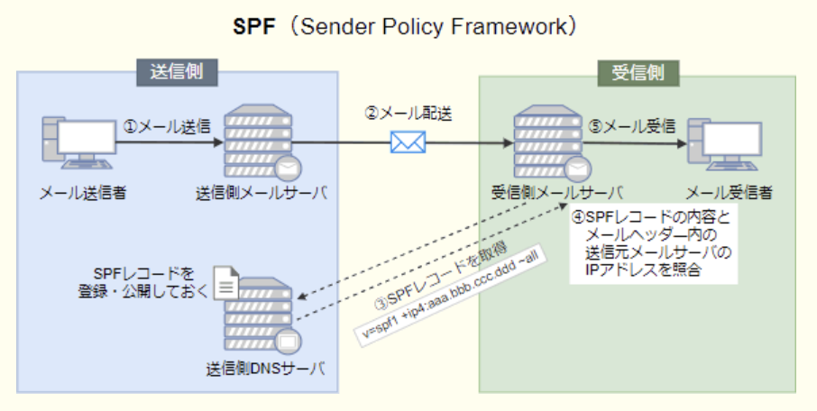

- 電子メールを受信するサーバが、電子メールに付与されているデジタル署名を使って、送信元ドメインの詐称がないことを確認する  
SPFではデジタル署名を使用しない。DKIM(*DomainKeys Identified Mail*)の仕組み

- 電子メールを送信するサーバが、送信する電子メールの送信者の上司からの承認が得られるまで、一時的に電子メールの送信を保留する  
メールの誤送信を防止するための仕組み

- 電子メールを送信するサーバが、電子メールの宛先のドメインや送信者のメールアドレスを問わず、全ての電子メールをアーカイブする  
メールアーカイブシステムの仕組み

---
標本化、符号化、量子化の3つの工程で、アナログをデジタルに変換する場合の順番

- A.**標本化, 量子化, 符号化**  
`標本化` : 時間的に連続したアナログ信号(振幅、周波数、電圧など)を一定の時間間隔で測定する  
`量子化` : 標本化で得られた数値などを整数などの離散値で近似する  
`符号化` : 量子化で得られた整数値を2進数のビットに対応付ける

---
スタブを使用したテストの説明

- A.**トップダウンでプログラムのテストを行うとき、作成したモジュールをテストするために、仮の下位モジュールを用意して動作を確認する**  
モジュール結合テストの手法のトップダウンテストにおいて必要となるテスト用モジュール。未完成の下位モジュールの代わりとして、テスト対象の上位モジュールからの呼び出しに対し、下位モジュールが返すべき適切な値を返却するなどの動作を行う

- 指定した命令が実行されるたびに、レジスタや主記憶の一部の内容を出力することによって、正しく処理が行われていることを確認する  
スナップショットダンプの説明

- プログラムの実行中、必要に応じて変数やレジスタなどの内容を表示し、必要であればその内容を修正して、テストを継続する  
インスペクタの説明

- プログラムを構成するモジュールの単体テストを行うとき、そのモジュールを呼び出す仮の上位モジュールを用意して、動作を確認する  
ドライバの説明(ボトムアップテスト)。未完成の上位モジュールに代わり、テスト対象の下位モジュールを呼び出すなどの動作を行う

---
コンピュータシステムのベンチマークテストの説明

- A.**測定用のソフトウェアを実行し、システムの処理性能を数値化して、他の製品と比較する**  
システムの使用目的に合わせたプログラム、評価対象の業務の典型的な処理プログラムを実行し、入出力や制御プログラムを含めたシステムの総合的な処理性能を測定する手法

---
テストで使用されるドライバ・スタブの説明

- A.**ドライバは、引数を渡してテスト対象モジュールを呼び出す**  
未完成の上位モジュールに代わり、テスト対象の下位モジュールに適切な引数を与えて呼び出すなどの役割を担う

- スタブは、テスト対象のモジュールからの戻り値の表示・印刷を行う  
モジュール結合テストの手法のトップダウンテストにおいて必要となるテスト用のモジュール。未完成の下位モジュールの代わりとして、テスト対象の上位モジュールからの呼び出しに対して、**下位モジュールが返すべき適切な値を返却するなどの役割を担う**

- スタブは、テスト対象モジュールを呼び出すモジュールである  
ドライブがテスト対象モジュールを呼び出す

- ドライバは、テスト対象モジュールから呼び出されるモジュールである  
テスト対象の下位モジュールを呼び出すモジュール

---
更新不可能なビュー

- A.**ビュー定義に`group by`句が含まれるビュー**  
実表に対して実表の行を挿入、更新、削除することができないビューでのこと。下記条件を満たしていると更新不可能  
集約関数(avg, count, sum, min, max)  
2つ以上の表の結合  
`group by`, `order by`, `model`, `connect by`, `start with`, `distinct`の各句  
select構文のリストにコレクション式, 副問合せ  
`with read only`が指定された副問合せ

---
Webサーバにおいて、クライアントからの要求に応じてアプリケーションプログラムを実行して、その結果をWebブラウザに返すなどのインタラクティブなページを実現するために、Webサーバと外部プログラムを連携させる仕組み

- A.**CGI**(*Common Gateway Interface*)  
ユーザの入力した情報によって表示するWebページを変化させるなど、動的なWebページを作成するための仕組み。どのプログラム言語を用いても作成できるが、実際はPHPやPerlが多用されている

- HTML(*Hyper Text Markup Language*)  
Web上のドキュメントを記述するためのマークアップ言語

- MIME(*Multipurpose Internet Mail Extension*)  
ASCII文字しか使用できないSMTPを利用したメールで、日本語の2バイトコードや画像データを送信するための仕組み

- URL(*Uniform Resource Locator*)  
インターネット上のリソースを特定するための形式的な記号の並びで、Webサイトの場合はホームページアドレスとも呼ばれる

---
静止画像データの圧縮方式の特徴

- A.**可逆符号化方式では、圧縮率は伸張後の画像品質に影響しない**  
`可逆符号化方式`(ロスレス圧縮) : 圧縮前後が完全に等しくなる圧縮方式。一般に不可逆圧縮と比較して圧縮率は低い。静止画像ではPNGやGIF、音声ではWMA Losslssなど  
`不可逆符号化方式` : 圧縮前後が完全には一致しない圧縮方式。可逆符号化方式より圧縮率が高く、圧縮率と画像劣化のバランスを選択でき、場面に応じた圧縮を行うことも可能。静止画像ではJPEG、音声ではMP3など

- 可逆符号化方式で圧縮したファイルのサイズは、非可逆符号化方式よりも小さくなる  
非可逆符号化方式の方が圧縮率が高いので、圧縮後のファイルサイズはその分小さくなる

- 非可逆符号化方式では、伸張後の画像サイズが元の画像よりも小さくなる  
色情報は少なくなるが、画像サイズは変化しない

- 非可逆符号化方式による圧縮では、圧縮率を変化させることはできない  
圧縮率の選択は可能

---
AIにおける機械学習(*Machine Learning*)の説明

- A.**記憶したデータから特定のパターンを見つけ出すなどの、人が自然に行っている学習能力をコンピュータにもたせるための技術**  
コンピュータに大量の学習データを与えることで、データからパターンや規則を学習させて、パターン認識や分類能力をもたせるAIの分野。人間が明治的にプログラムしなくても、アルゴリズムがデータを分析し、自ら制度を向上させることが特徴。教師あり学習、教師なし学習、強化学習などの学習方法がある

- コンピュータ、機械などを使って、生命現象や進化のプロセスを再現するための技術  
人工生命の説明

- 特定の分野の専門知識をコンピュータに入力し、入力された知識を用いてコンピュータが推論する技術  
エキスパートシステムの説明。判断式を人間が与えなければならないのに対し、機械学習では学習によって判断式をコンピュータ自身が導く点が異なる

- 人が双方向学習を行うために、Webシステムなどの情報技術を用いて、教材や学習管理能力をコンピュータにもたせるための技術  
*EdTech*の説明

---
知識ベースを利用して推論を行うもの

- A.**エキスパートシステム**  
人工知能研究から生まれたコンピュータシステムで、人間の専門家(エキスパート)の意思決定過程をコンピュータ上で再現するもの

- ニュートラルネットワーク  
脳機能に見られるいくつかの特性を計算機上のシミュレーションによって表現することを目指した数学モデル

- バーチャルリアリティ  
仮想現実と訳され、コンピュータなどによって作り出された世界をコンピュータグラフィックなどを利用してユーザに体験させる技術。コンピュータグラフィックを見せるだけでなく、ユーザが仮想世界に働きかけることができ、五感のいずかに反応が返ってくることで人口的な現実感を得られる

- ファジィコンピュータ  
通常の集合と異なり、点がある集合に属する・属さないの他にこの2つの中間的な状態を許容するファジィ集合を利用したファジィ制御を取り入れたコンピュータ

---
機械学習における教師あり学習の説明

- A.**正解のデータを提示したり、データが誤りであることを指摘したりすることによって、未知のデータに対して正誤を得ることを助ける**  
ラベル(正解)付きデータを使用する。入力に対する正しい出力の例を与えることで、入力と出力の関係を学習させる

- 個々の行動に対しての善しあしを得点として与えることによって、得点が最も多く得られるような方策を学習する  
強化学習の説明、正解データの代わりに与えられた環境における個々の行動に対して得点や報酬を与える。一連の行動に対して評価値を与えることで、高得点(最良)の行動を自律的に学習される

- コンピュータ利用者の挙動データを蓄積し、挙動データの出現頻度に従って次の挙動を推論する  
協調フィルタリング(教師なし学習)の説明、訓練データとして、ラベル無データを使用する

- 正解のデータを提示せずに、統計的性質や、ある種の条件によって入力パターンを判定したり、クラスタリングしたりする  
クラスタリング(教師なし学習)の説明

---
RFID(*Radio Frequency IDentification*)タグの特徴

- A.**電磁波を用いて情報を非接触で読み取る**  
ID情報を埋め込んだRFタグ(ICタグ)から電磁界や電波を用いて情報のやり取りを行う技術。非接触型ICカードに同様の技術が用いられている。見えなくても読むことができ、タグが目に見えない位置にあっても、ホコリや泥で汚れていても読み取りが可能

- 磁性体に記録された情報を接触によって読み取る  
磁気ストライプカードの説明

- 赤外線を用いて情報を非接触で読み取る  
タグ読取に赤外線を使用した例はないが、手のひら静脈認証において特徴パターンの抽出に赤外線が用いられることがある

- バーコードで記録された情報を光学的に読み取る  
OMR(*Optical Mark Reader* : 光学式マーク読取装置)の説明

---
バイオメトリクス認証には、身体的特徴を抽出して認証する方式と行動的特徴を抽出して認証する方式がある。行動的特徴を用いているもの

- A.**署名するときの速度や筆圧から特徴を抽出して認証する**  
行動的特徴。筆跡やキーストロークなどの特性

- 血管の分岐点の分岐角度や分岐点間の長さから特徴を抽出して認証する
- どう孔から外側に向かって発生するカオス状のしわの特徴を抽出して認証する
- 隆線によって形作られる紋様からマニーシャと呼ばれる特徴点を抽出して認証する  
身体的特徴。指紋や顔・虹彩または声紋・DNAなど長期間にわたり変化しない部分の特徴

---
空の状態のキューとスタックの2つのデータ構造がある。下記手順を順に実行した場合、変数xに代入されるデータはどれか。  
- データyをスタックに挿入することを push(y)、  
- スタックからデータを取り出すことを pop()、  
- データyをキューに挿入することを enq(y)、  
- キューからデータを取り出すことを deq()と表す

push(a)  
push(b)  
enq(pop())  
enq(c)  
push(d)  
push(deq())  
x <- pop()

- A.**b**  
スタックは後入れ先出し(LIFO)、キューは先入れ先出し(FIFO)構造。  
push(a), push(b) -> 上からa, bの順でスタックに格納されている  
enq(pop()) -> スタックから取り出したbをキューに格納  
enq(c) -> cをキューに格納  
push(d) -> 上からd, aの順でスタックに格納されている  
push(deq()) -> キューから取り出した`b`をスタックに格納  
x <- pop() ->この時点でスタックは上から`b, d, a`の順で格納されている

---
加減乗除を組み合わせた計算式の処理において、スタックを利用するのが適している処理

- A.**計算の途中結果を格納し、別の計算を行った後で、その計算結果と途中結果との計算を行う処理**  
後入れ先出し方式でデータを入出力するデータ構造で、データを追加するプッシュ命令(*push*)と最後に格納されたデータを取り出すポップ命令(*pop*)でデータ操作を行う。サブルーチン終了後の戻りアドレスや局所変数などを保持するのに使用される。後入れ先出しのデータ構造なので、最後に追加データとの演算を容易に行うことが可能

- 格納された計算の途中結果を、格納された順番に取り出す処理  
格納された順に取り出すにはキューのように先入れ先出し構造の必要がある

- 昇順に並べられた計算の途中結果のうち、中間にある途中結果だけ変更する処理
- リストの中間にある計算の途中結果に対して、新たな途中結果の挿入を行う処理  
単純なスタック構造では最後に格納されたデータしか取り出せないため、途中のデータだけを変更することはできない

---
データ構造の1つの木構造に関する記述

- A.**階層の上位から下位に節点をたどることによって、データを取り出すことができる**  

- 格納した順序でデータを取り出すことができる  
キューの記述

- 格納した順序とは逆の順序でデータを取り出すことができる  
スタックの記述

- データ部と1つのポインタ部で構成されるセルをたどることによって、データを取り出すことができる  
リストの記述

---
リストは、配列で実現する場合とポインタで実現する場合がある。リストを配列で実現した場合の特徴

- A.**リストにある実際の要素数にかかわらず、リストの最大長に対応した領域を確保し、実際には使用されない領域が発生する可能性がある**  
配列を用いる場合は最大の要素数を格納できるだけのメモリ領域を確保する必要がある。1000要素分確保しても実際の格納数が10要素程度だとすると、残りの990要素分のメモリ領域が無駄になる

- リストにある実際の要素数にかかわらず、リストへの挿入と削除は一定時間で行うことができる  
配列リストに要素を挿入する場合、挿入位置より後ろに格納されている要素を1つずつ後ろの領域へ移動しなければならない。削除の場合は削除位置より後ろに格納されている要素を1つずつ前に移動する必要がある。挿入や削除の対象要素が配列リストの前方であればあるほど、後方に存在する要素が多くなるため処理に時間がかかることになる

- リストの中間要素を参照するには、リストの先頭から順番に要素をたどっていくので、要素数に比例した時間が必要となる  
ポインタで実現するリストの特徴。配列リストでは要素をメモリ上の連続した領域に格納するため、添字と1要素のデータサイズから参照すべきメモリアドレスをすぐに計算できる。そのため要素の格納位置に関わらず参照時間は一定

- リストの要素を格納する領域の他に、次の要素を指し示すための領域が別途必要となる  
ポインタで実現するリストの特徴。配列リストは連続したメモリ領域に添字順に要素を格納するので、次の要素の位置を容易に計算できる。そのためポインタリストのように次の要素へのポインタを保持しておく必要はない

---
1画面が30万画素で、256色を同時に表示できるPCの画面全体を使って、30フレーム / sのカラー動画を再生表示させる。1分間に表示される画像のデータ量(Mバイト)に最も近いもの(データは圧縮しない)

- A.**540**  
256色を表現するには8ビット(1バイト)が必要、30万画素では30万バイトになる。30フレーム / sなので、  
1分では、$30フレーム*60s=1,800フレーム$  
1分間のデータ量は、$30万バイト*1,800フレーム=54,000万バイト=540Mバイト$

---
PCのクロック周波数に関する記述

- A.**CPUのクロック周波数と、主記憶を接続するシステムバスのクロック周波数は同一でなくてもよい**  
1秒間に何回のクロックが発振されるかを表す数値でプロセッサの性能指標に使われる。CPUと主記憶、拡張ポートを接続するシステムパスのクロック周波数はベースクロック・外部ロックなどと呼ばれ、必ずしも同一である必要はない

- CPUのクロック周波数の逆数が、1秒間に実行できる命令数を表す  
必ずしも1命令が1クロックで処理されるとは限らない

- CPUのクロック周波数を2倍にすると、システム全体としての実行性能も2倍になる
- 使用しているCPUの種類とクロック周波数が等しければ、2種類のPCのプログラム実行性能は同等になる  
実行性能は、主記憶やハードディスクの性能・OSの種類・ネットワーク速度などの様々な要因の影響により決まるため、CPUのクロック周波数を増やしても実行性能が2倍になるとは限らない

---
動作クロック周波数が700MHzのCPUで、命令の実行に必要なクロック数とその命令の出現率が下記の値の時のCPUの性能

|命令の種別|命令実行に必要なクロック数|出現率(%)|
|--------|----------------------|--------|
|レジスタ間演算|4|30|
|メモリ・レジスタ間演算|8|60|
|無条件分岐|10|10|

- A.**100MIPS**  
各命令を実行するのに必要なクロック数は、出現率を乗じて足し合わせると、1命令に必要な平均クロック数が分かる  
$1.2+4.8+1=7$  
CPUの動作クロック数は数は700MHzなので、1秒間の命令実行可能回数は、  
$700*10^6/7=100*10^6回=100MIPS$

---
2個の文字A, Bを使って長さ1以上7以下の文字列は何通りできるか

- A.**254**  
文字種が2で長さがnの場合の組み合わせ数は$2^n$で表せる  
2 + 4 + … + 64 + 128 = 254

---
事象Aと事象Bが独立である時に成立する式はどれか。P(X)は事象Xが起こる確率を表し、X∪Y及びX∩Yはそれぞれ事象Xと事象Yの和事象及び積事象を表す

- A.**P(A∩B) = P(A) * P(B)**  
少なくとも片方が発生する確率P(A∪B)はP(A) + P(B) - P(A∩B)で表される  
両方の事象が発生する確率P(A∩B)はP(A) * P(B)で表される

---
MTBFが21万時間の磁気ディスク装置がある。この装置100台から成る磁気ディスクシステムを1週間に140時間運転したとすると、平均何週間に1回の割合で故障を起こすか。磁気ディスクシステムは、信頼性を上げるための冗長構成は採っていないものとする

- A.**15**  
それぞれの機器が21万時間に1回故障すると、ディスクシステム全体では21万時間に100回の故障を起こす。システム全体のMTBFは2100時間、1週間に140時間運用するので、$2100/140=15$

---
安全性や信頼性を確保するための設計のうち、フールプルーフ(*fool proof*)に該当するもの

- A.**利用者が誤った操作をしても、システムに異常が起こらないようにする**  
不特定多数の人が操作するシステムに、入力データのチェックやエラーメッセージの表示などの機能を加えることで、人為的ミスによるシステムの誤動作を防ぐように設計する考え方

- 装置が故障したときは、システムが安全に停止するようにして、被害を最小限に抑える  
フェールセーフの説明

- 装置が故障したときは、利用できる機能を制限したり、処理能力を低下させたりしても、システムは稼働させる  
フェールソフトの説明

- 装置が故障しても、システム全体の機能に影響がないように、二重化などの冗長な構成とする  
フォールトトレランスの説明

---
信頼性設計におけるフェールソフトの例

- A.**クラスタ構成のシステムにおいて、あるサーバが動作しなくなった場合でも、他のサーバでアプリケーションを引き継いで機能を提供する**  
障害発生時に多少のシステムの機能低下を許容し、システム全体の運転継続に必要な機能を維持させようとする考え方。実践対応としてフォールバック(縮退運転)やフェールオーバー(いわゆる冗長構成)がある

- 一部機能の障害によってシステムが停止しないよう、ハードウェアやソフトウェアを十分に検証し、信頼性の高いものだけでシステムを構成する  
フォールトアボイダンスの例(問題を発生させないための備え)

- アプリケーションを間違って終了してもデータを失わないように、アプリケーション側の機能で編集中のデータのコピーを常に記憶媒体に保存する
- 電子メールでの返信が必要とされる受付システムの入力画面で、メールアドレスの入力フィールドを2つ設けて、同ーかどうかをチェックする  
フールプルーフの例(誤った操作によって異常が起きないようにする)

---
コンピュータシステムのライフサイクルを故障の面から、初期故障期間、偶発故障期間、摩耗故障期間の3期間に分類するとき、初期故障期間の対策に関する記述

- A.**設計や製造のミスを減らすために、設計審査や故障解析を強化する**  
設計・製造上の欠陥による故障が多発する期間のため、これらのミスを減らす対策が有効。設計や製造の不備や使用環境との相性によって故障率が高くなる期間

- 部品などの事前取替えを実施する  
摩耗故障期間の対策。材料や部品の劣化による故障回数が多くなる期間

- 時間計画保全や状態監視保全を実施する
- システムを構成するアイテムの累積動作時間によって経時保全を行う  
偶発故障期間の対策。初期の不具合が落ち着いて安定した稼働が長く続き、偶発的な呼称だけが発生する期間

---
コンピュータシステムの信頼性に関する記述

- A.**システムの予防保守は、MTBFを長くするために行う**  
`MTBF`(*Mean Time Between Failure*, 平均故障間隔) : システムが修理され正常に稼働し始めてから、次回故障するまでの間隔  
`MTTR`(*Mean Time To Repair*, 平均修復時間) : システムの故障を修理するために要した時間  
**稼働率 = MTBF / (MTBF + MTTR)**  
予防保守では、正常稼働に影響がなくても経年劣化などにより信頼性の低下した部品を前もって交換することで、将来の障害発生リスクが低くなりMTBFが向上する

- システムの遠隔保守は、MTTRを長くし、稼働率を向上させる  
遠隔地に設置されたシステムをネットワークを介して保守するサービス。現地に直接出向かなくても障害に対処することが可能となりMTTRは短くなる

- システムの稼働率は、MTTRとMTBFを長くすることによって向上する  
稼働率を向上させるにはMTBFを長く、MTTRを短くする

- システムの構成が複雑なほど、MTBFは長くなる  
複雑なほどMTBFは短くなる

---
稼働率が最も大きくなるもの

- A.**MTBFを2倍にし、MTTRを半分にする**  
平均故障間隔が2倍になり、平均修復時間が半分になれば稼働率は大きくなる

- MTBF、MTTRをそれぞれ2倍にする  
平均故障間隔も平均修復時間も2倍になると稼働率は変化しない

- MTBF、MTTRをそれぞれ半分にする  
平均故障間隔も平均修復時間も半分になると稼働率は変化しない

- MTBFを半分にし、MTTRを2倍にする  
平均故障間隔が半分になり、平均修復時間が倍になると稼働率は低下する

---
コンピュータシステムの性能評価に関する記述

- A.**運用中のシステムでは、ソフトウェアモニターを用いて統計データを収集し、分析することによって、性能上の問題点を把握することができる**

- CPU性能を測定するベンチマークプログラムは多くの応用範囲をカバーしているので、コンピュータ導入からシステム増強計画に至るまでの性能予測に利用できる  
プロセッサの性能を評価する時はSPEC、オンライントランザクション性能を評価する時にはTPCというように、それぞれの評価対象に適したプログラムを選択する必要がある

- コンピュータシステムの資源増強を計画する場合、負荷予測に基づくプロトタイピングモデルによって、システム全体を運用した場合の性能が確認できる  
資源を増強する部分の性能評価には有用だが、システム全体の性能までは確認できない

- システムが実際に稼働していない段階で、ハードウェアモニターによる模擬実験によって、コンピュータシステムの性能が予測できる  
専用の装置を用いてCPUやメモリの状況を測定・分析する手法。未稼働の状態でのモニタリングでは本番環境での使用状況の予測はできない

---
キャパシティ管理における将来のコンポーネント、並びにサービスの容量・能力及びパフォーマンスを予想する活動のうち、傾向分析(トレンド分析)はどれか

- A.**特定の資源の利用状況を時系列に把握して、将来における利用の変化を予測する**  
資源の使用状況やサービスのパフォーマンスに関するデータを収集し、推移を分析することで将来予測を行おうとする手法

- 待ち行列理論などの数学的技法を利用して、サービスの応答時間及びスループットを予測する  
数値解析モデルの説明

- 模擬的にトランザクションを発生させて、サービスの応答時間及びスループットを予測する  
シミュレーションモデルの説明

- モデル化の第一段階として、現在達成されているパフォーマンスを正確に反映したモデルを作成する  
ベースラインモデルの説明

---
モジュール間の情報の受け渡しがパラメータだけで行われる、結合度が最も弱いモジュール結合

- A.**データ結合**  
処理に必要なデータだけを単一のパラメータとして受け渡している  
モジュール同士の関連性の強さを表し、モジュール結合度が弱いほど関連するモジュールに変更があった場合の影響を受けにくくなるので、モジュールの独立性が高まり保守性が向上する

- 制御結合  
モジュールの動作を制御するための要素を受け渡している

- 共通結合  
大域宣言された単一のデータを、複数のモジュールが参照している

- 内容結合  
モジュールの内部を直接参照・使用している(結合度が最も強い)

---
CASE(*Computer Aided Software Engineering*)ツールが提供する機能のうち、上位CASEツールに属するもの

- A.**CFDの作成支援**  
コンピュータの支援によりソフトウェアの開発作業や保守を効率的に行うようにする開発支援ツール。要件定義から内部設計までの上流工程を支援するものと、プログラム設計からテスト保守までの下流工程を支援するツール、全てをカバーする総合CASEに分類される

- テストデータの作成支援
- プログラムの自動生成
- ライブラリの管理支援  
下流CASEに属する機能

---
フィードバック制御の説明

- A.**出力結果と目標値とを比較して、一致するように制御を行う**  
制御対象の現在の状態を定期的に測定し、目標値に近づけるように動作する自動制御方式。室内の温度を一定に保つなどの自動制御システムで多く用いられている。外乱を検知せず、修正動作は目標値と測定値の差異によってのみ決定される。外乱が生じても修正動作は測定値に影響が現れてからになる

- あらかじめ定められた順序で制御を行う  
シーケンス制御の説明。外乱自体を検知し、前もって出力への影響を打ち消すよう動作する

- 外乱の影響が出力に現れる前に制御を行う  
フィードフォワード制御の説明。フィードバック制御では外乱の影響が測定値に現れてから修正動作を行う

- 出力結果を使用せず制御を行う  
出力結果を新たな入力値として使用する

---
フィードバック制御の説明

- A.**外乱による影響を検知してから修正動作を行う**  
制御対象の現在の状態を定期的に測定し、測定値を目標値い近付けるように動作する自動制御方式。室内の温度を一定に保つなどの自動制御システムで多く用いられている。外乱を検知せず、修正動作は目標値と測定値の差異によってのみ決定される。外乱が生じても修正動作は測定値に影響が現れてからになる。フィードフォワード制御では、外乱自体を検知し、前もって出力への影響を打ち消すように動作する

- 外乱に弱く、それらの影響を増幅させてしまう  
フィードフォワード制御の特徴。制御している値に対して外乱が与える影響を見誤った場合に外乱の影響を強めることになってしまう。フィードバック制御では常に測定値と目標値の差異を小さくするように動作するので、外乱による影響を臓腑させることはない

- 外乱を検知して、その影響が出ないように修正動作を行う
- 外乱を予測して修正動作を行う  
フィードフォワード制御の説明。フィードバック制御では外乱の検知は行わない

---
H.264 / MPEG - 4 AVCに関する記述

- A.**ワンセグやインターネットで用いられる動画データの圧縮符号化方式**  
ワンセグ放送などの低速・低画質のものからデジタルハイビジョンTVクラスの高ビットレート用途に至るまで、幅広く利用されることを想定した動画の圧縮符号化に関する規格。1回毎の差分情報の量を小さくするなどの改良を行うことで、従来から使用されてきたMPEG - 2と比較して2倍以上の圧縮効率を実現しており、ワンセグ、テレビ会議システム、インターネット放送等の動画共有サービスなどさまざまな場面で使用されている

- インターネットで動画や音声データのストリーミング配信を制御するための通信方式  
RTSP(*Real Times Streaming Protocol*)の説明

- テレビ会議やテレビ電話で双方向のビデオ配信を制御するための通信方式  
SIP(*Session Initiation Protocol*)の説明

- テレビの電子番組案内で使用される番組内容のメタデータを記述する方式  
電子番組表(*Electronic Program Guide*)や電子コンテンツガイド(ECG)の説明

---
システムが稼働不能となった際のバックアップサイトをウォームサイト、コールドサイト、ホットサイトの3種類に分類した時、一般に障害発生から復旧までの時間が短い順に並べたもの

- A.**ホットサイト、ウォームサイト、コールドサイト**  
バックアップサイトは、大規模な自然災害などにより基幹となるコンピュータシステムやコンピュータセンターが機能しなくなった時に備えて用意される予備のコンピュータセンター  
`ホットサイト` : 障害発生時にできるだけ短時間にサービスが再開できるように日常から本システムと同じものを稼働させておき、非常事態時に素早く業務を引き継ぎ方式。常に本システムのデータとの同期が行われており、障害発生時に直ぐにその施設でシステムを運用できる体制になっている  
`ウォームサイト` : 施設内に本システムと同じものを全部(あるいは部分的に)設置し、業務システムを起動させない状態で待機させる方式。障害発生時に追加の機器やデータ及びプログラム媒体を搬入してから予備系システムを立ち上げて処理を引き継ぐ  
`コールドサイト` : コンピュータシステムを設置できる施設だけを確保しておき、障害発生時には機材などを搬入してバックアップセンターとして機能させる方式。障害発生後にシステムの導入とデータの復旧を行なって業務を引き継ぐ

---
DBのバックアップ処理には、フルバックアップ方式と差分バックアップ方式がある。差分バックアップ方式に関する記述

- A.**フルバックアップのデータで修復した後に、差分を加えて復旧する**  
`フルバックアップ方式` : 毎回ディスク全体のバックアップを行う方式。復旧時間は短くなるが、バックアップに要する時間は長い  
`差分バックアップ方式` : 定期的にフルバックアップを行い、フルバックアップの間の期間は、フルバックアップ以降に変更のあったファイル(差分)だけを記録していく方式。バックアップ時間は短く済むが、復旧の際はフルバックアップ -> 差分バックアップを適用の流れなので、フルバックアップ方式と比較して時間がかかる

- 障害からの回復時に差分だけ処理すればよいので、フルバックアップ方式に比べて復旧時間が短い  
フルバックアップファイルを適用後に差分ファイルを適用するので、フルバックアップファイル方式に比べて復旧時間は長くなる

- フルバックアップ方式と交互に運用することはできない  
交互の運用が可能

- フルバックアップ方式に比べ、バックアップに要する時間が長い  
フルバックアップ以降に変更のあったファイル(差分)だけをバックアップしていくので、毎回全体をバックアップするよりもバックアップに要する時間は短くなる

---
IPアドレス 10.128.192.10のアドレスクラス

- A.**クラスA**  
先頭ビットが0(10進数表記が0 - 127)

- クラスB  
先頭ビットが10(10進数表記が128 - 191)

- クラスC  
先頭ビットが110(10進数表記が192 - 223)

- クラスD  
先頭ビットが1110(10進数表記が224 - 239)

---
複数のWebサービスの入出力処理を連結させt新たなサービスを提供する、ロジックマッシュアップの例

- A.**利用者が入力した予算の範囲で宿泊可能な施設のリストを他のWebサービスから取得し、それらの宿泊施設の空室状況を別のWebサービスから取得して表示する**  
あるWebサービスから得られた出力を、他のWebサービスの入力として与えて、Webサービス同士の処理が連結されている<br><br>
複数の提供元によるWebサービスのAPIを組み合わせることで、新サービスを構築する手法。既存サービスやデータを再利用することで必要な機能を迅速に開発でき、開発コストと時間の削減に繋がるが、利用するAPIの廃止などに留意する必要がある。

- 利用者が選択した飲食店情報のページを表示する際に、他のWebサービスが提供する地図コンテンツをアクセスマップとして表示する  
プレゼンテーションマッシュアップの例。Webページ内に他のWebサービスが提供するコンテンツを表示する

- 利用者が選択した投資商品の情報を表示する際に、関連する経済指標のデータを複数のWebサービスから取得し、グラフに加工して表示する  
データマッシュアップの例。複数のWebサービスから取得したデータを統合して、視覚的に分かりやすく表示する

- 利用者がマウスのドラッグで地図を操作した際に、Webページ全体ではなく一部を読み直すことによって地図をスクロールして表示する  
*Ajax*による非同期通信の例

---
軽微な不正や犯罪を放置することによって、より大きな不正や犯罪が誘発されるという理論

- A.**割れ窓理論**  
小さな不正や犯罪を放置されている環境は、管理や人の目が不行きという印象を与え、より大きな不正や犯罪が起こりやすくなるとする環境犯罪学上の理論。1個のポイ捨てや落書き、掲示板上のスパムが放置されていると、さらに大きな違反が発生しやすくなる

- 環境設計による犯罪予防理論(CPTED)  
科学的根拠に基づいて物的な環境を適切に整備し、効果的に管理することで犯罪を予防しようとする考え方

- 日常活動理論  
ある時間・空間に犯罪者、犯行対象、守り手の不在という3要素が揃う事で犯罪機会が生まれるという考え方

- 不正のトライアングル理論  
不正行動は動機・プレッシャー、機会、正当化の3要素が全て揃った時に発生する考え方

---
自社開発したソフトウェアの他社への使用許諾に関する説明

- A.**特許で保護された技術を使っていないソフトウェアであっても、使用許諾することは可能である**  
ソフトウェアは著作物のため、著作者の権利に基づき利用希望者との使用許諾契約を交わすことが可能

- 既に自社の製品に搭載して販売していると、ソフトウェア単体では使用許諾できない  
販売されている製品に組み込まれていたとしても、ソフトウェア自体が著作物と見なされているため単体で使用許諾が可能

- 既にハードウェアと組み合わせて特許を取得していると、ソフトウェア単体では使用許諾できない  
ハードウェアとソフトウェアは別々の著作物のため、それぞれについて使用許諾が可能

- ソースコードを無償で使用許諾すると、無条件でオープンソースソフトウェアになる  
無償での使用許諾が直ちにオープンソース化に繋がるわけではない

---
ゼロデイ攻撃(*zero-day attack*)の特徴

- A.**脆弱性に対してセキュリティパッチが提供される前に当該脆弱性を悪用して攻撃する**  
あるOSやソフトクリームに脆弱性が存在することが判明し、ソフトウェアの修正プログラムがベンダから提供されるより前に、その脆弱性を悪用して行われる攻撃

- 特定のWebサイトに対し、日時を決めて、複数台のPCから同時に攻撃する  
DDoS攻撃の特徴

- 特定のターゲットに対し、フィッシングメールを送信して不正サイトに誘導する  
フィッシングの特徴

- 不正中継が可能なメールサーバを見つけて、それを踏み台にチェーンメールを大量に送信する  
スパムメール送信行為。第三者中継を許可しているSMTPサーバはスパムメールの踏み台にされてしまう

---
標的型攻撃メールで利用されるソーシャルエンジニアリング手法に該当するもの

- A.**件名や本文に、受信者の業務に関係がありそうな内容を記述する**  
差出人を取引先企業や官公庁や知人など信頼性のある人に偽装し、さらに、受信者の興味を引く件名や本文を使用することによって、ウイルスを仕込んだ添付ファイルを開かせたり、ウイルスに感染させるWebサイトのリンクをクリックさせるように巧妙に誘導する攻撃手法。  
この攻撃は、`メールの件名・本文にあたかもその企業・組織の業務に関係があるような内容を記述し受信者を錯覚させる`という人間の心理的な隙をつくソーシャルエンジニアリングの要素をもっている

- 件名に"未承諾広告※"と記述する  
スパムメールの特徴

- 支払う必要がない料金を振り込ませるために、債権回収会社などを装い無差別に送信する  
架空請求詐欺メールの特徴

- 偽のホームページにアクセスさせるために、金融機関などを装い無差別に送信する  
フィッシング詐欺メールの特徴

---
包括的な特許クロスライセンスの説明

- A.**技術分野や製品分野を特定し、その分野の特許権の使用を相互に許諾すること**  
2つ以上の企業や団体が互いに自らの持つ特許の実施権を許諾し合うこと。クロスライセンスを結んだ場合は自分の特許実施権を許諾する代わりに、使用料を支払わずに相手の特許を利用することができるメリットがある

- インターネットなどでソースコードを無償公開し、誰でもソフトウェアの改良及び再配布が行えるようにすること  
オープンソースソフトウェアの説明

- 自社の特許権が侵害されるのを防ぐために、相手の製造をやめさせる権利を行使すること  
特許権の行使の説明

- 特許登録に必要な費用を互いに分担する取決めのこと  
共同特許出願契約の説明

---
次の"受注台帳"表を"注文"表と"顧客"表に分解し、第3正規系にした時、両方に必要な属性はどれか。送付先と支払方法は注文ごとに決めるものとし、表の下線は主キーを表す  
受注台帳(<u>注文番号</u>, 注文年月日,顧客ID, 顧客名, 顧客住所, 品目, 数量, 送付先, 支払方法, 受注金額)

- A.**顧客ID**  
`第1正規化` : 繰り返し項目、集合知をなくす  
`第2正規化` : 主キーの一部によって一意に決まる属性を別表に移す  
`第3正規化` : 主キー以外の属性によって一意に決まる属性を別表に移す  
主キーが第一属性なので第2正規形の条件を満たしている。"受注台帳"表の主キー以外の属性では、顧客ごとに固有の"顧客ID"から顧客名・顧客住所が一意に導ける。この関係を**顧客(<u>顧客ID</u>, 顧客名, 顧客住所)** の別表に移すが、表同士を関連付けるために"顧客ID"を"受注台帳"表に残したままにしなければならない。表同士がある属性で関連づけられていないと、分解前の表を完全な状態で復元できない。"受注台帳"表の属性"顧客ID"は、"顧客ID"を参照する外部キーとなる

---
"従業員"表を第3正規形にしたものはどれか。下線部は主キーを表す  
従業員(従業員番号, 従業員氏名, {技能コード, 技能名, 技能経験年数})

- A.**<u>従業員番号</u>, <u>技能コード</u>, 技能経験年数**
- A.**<u>従業員番号</u>, 従業員氏名**
- A.**<u>技能コード</u>, 技能名**  
技能コード、技能名、技術経験年数は従業員1人につき複数の技能経験を有している場合がある。従業員番号だけでは複数ある技能を一意に決められないので、従業員番号と技能コードの組み合わせが主キーとなる

---
"発注伝票"を第3正規形に書き換えたものはどれか。下線部は主キーを表す  
発注伝票(<u>注文番号</u>, <u>商品番号</u>, 商品名, 注文数量)

- A.**発注(<u>注文番号</u>, <u>商品番号</u>, 注文数量), 商品(<u>商品番号</u>, 商品名)**  
`第1正規化` : 繰り返し項目、集合知をなくす  
`第2正規化` : 主キーの一部によって一意に決まる属性を別表に移す  
`第3正規化` : 主キー以外の属性によって一意に決まる属性を別表に移す  
発注伝票表は全属性が単一値なので第1正規形の条件を満たしているが、主キーの一部の商品番号に従属する商品名があるので第2正規形ではない。第2正規形とするには、商品番号とそれによって決まる商品名の関係を商品表として分離する。発注伝票票の中に商品番号の列を外部キーとして残し、分離した商品表とのリレーションを形成する。第3正規化では主キー以外に関数従属する属性があればその関係を別表に移すが、この条件を満たす関係は存在しないので第3正規系の条件を満たしている
