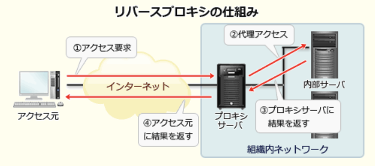
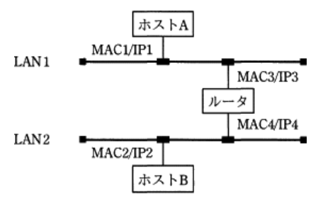
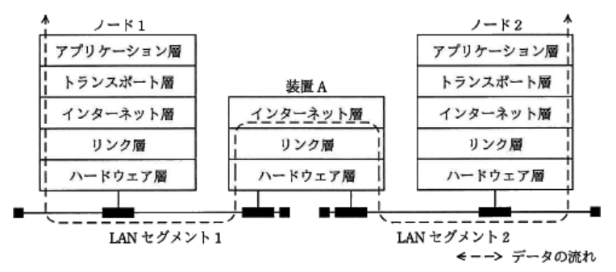
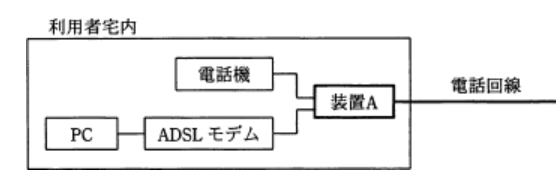
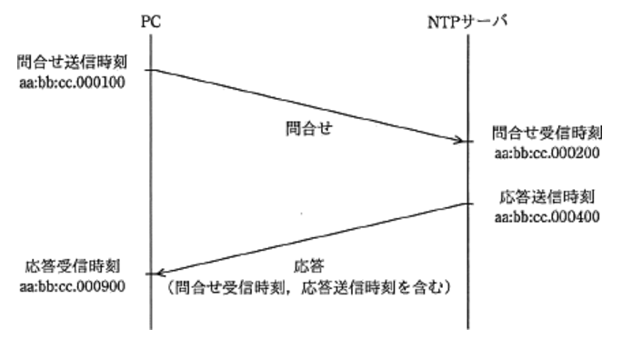
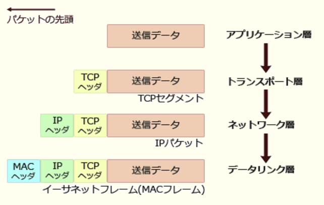
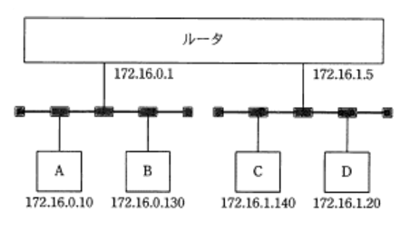
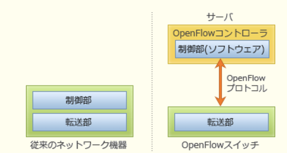

---
### 10.1 ネットワーク方式

---
1.無線LANで用いられるSSIDの説明

- A.**最長32オクテットのネットワーク識別子であり、接続するアクセスポイントの選択に用いられる**  
無線LANにおいて混信を避けるためにアクセスポイントと端末に設定するネットワーク識別子。Wi-Fiを設定する時に表示されるアクセスポイントを表す文字列がSSIDに当たり、最長32文字の任意の文字列を設定する。無線LANでは1端末が複数のアクセスポイントと通信できる、混信状態が発生し得る。これを回避するため、無線LANではアクセスポイントと端末にそれぞれSSIDを設定し一致する機器同士しか通信できないようにアクセス制御を行っている

- 48ビットのネットワーク識別子であり、アクセスポイントのMACアドレスと一致する  
BSSOD(*Basic Service Set Identifier*)の説明。SSIDは最長32文字の文字列(英数字と一定の記号)なので、最大32オクテット(バイト)

- 48ビットのホスト識別子であり、有線LANのMACアドレスと同様の働きをする  
SSIDは最長32文字のネットワーク識別子

- 最長32オクテットのホスト識別子であり、ネットワーク上で一意である  
SSIDはホスト識別子ではなくネットワーク識別子

---
2.Webサーバを使ったシステムにおいて、インターネット経由でアクセスしてくるクライアントから受け取ったリクエストをWebサーバに中継する仕組み

- A.**リバースプロキシ**  
クライアントとWebサーバの間のWebサーバ側に位置し、Webサーバを代理する形でクライアントからのリクエストを受け取り、そのリクエストをWebサーバに受け渡す仕組み。クライアントからのリクエストは必ずリバースプロキシを経由するので、リバースプロキシにアクセス制御や認証などの機能をもたせることで、Webサーバのセキュリティ向上が期待できる

- DMZ(*DeMilitarized Zone*)  
外部からアクセスされる可能性のある公開サーバ(Webサーバ・メールサーバ・プロキシサーバなど)などの情報資源を配置するためのネットワークセグメントのこと。外部ネットワーク・内部ネットワークとファイアウォールで隔てられており、ファイアウォールの中でも外でもない中間的なエリアに位置付けられる

- フォワードプロキシ  
フォワードは省略することもある。クライアントろWebサーバの間のクライアント側に位置し、クライアントの要求を受け取り、クライアントに代わってWebサーバにアクセスする仕組み

- プロキシARP  
あるホスト宛のARP要求に対して代理でARP応答をする機能で、ルータなどに備わっている

---
4.100Mビット / 秒のLANを使用し、1件のレコード長が1,000バイトの電文を1,000件連続で伝送する時の伝送時間は何秒か。LANの伝送効率は50%とする

1バイト = 8ビットなので、伝送効率100Mビットは、12.5Mバイト/s  
伝送するレコード全長は、レコード長1,000バイト * 1,000件 = 1Mバイト  
伝送効率も加味すると、  
1Mバイト * 2 / 12.5Mバイト/s = A.**0.16秒**

---
5.TCP、UDPのポート番号を識別し、プライベートIPアドレスとグローバルIPアドレスとの対応関係を管理することによって、プライベートIPアドレスを使用するLAN上の複数の端末が、1つのグローバルIPアドレスを共有してインターネットにアクセスする仕組み

- A.**NAPT**(*Network Address Port Translation* : IPマスカレード)  
プライベートIPアドレスとグローバルIPアドレスを1対1で相互変換するNATの考え方に、ポート番号でのクライアント識別を組み合わせた技術。内部LAN上の複数の端末を1つのグローバルIPアドレスで同時にインターネットに接続させることが可能。プライベートIPアドレスとインターネット通信に使用するポート番号を対応させることで端末の識別を行っている

- IPスプーフィング  
IPアドレスを偽装し正規のユーザになりすましてアクセスを行う攻撃手法

- IPマルチキャスト  
IPパケットを1回で複数の受信者に送信する方法。1回で1人の受信者に送信することをユニキャスト、1回で同じネットワークセグメントに属する全ての受信者に送信することをブロードキャストと呼ぶ

- NTP(*Network Time Protocol*)  
ネットワークに接続されている環境において、機器が持つ時計を正しい時刻へ同期するための通信プロトコル

---
7.10Mビット / 秒の回線で接続された端末間で、平均1Mバイトのファイルを、10秒ごとに転送するときの回線利用率は何%か。ファイル転送時には、転送量の20%が制御情報として付加されるものとし、1Mビット = 10の6乗ビットとする

回転利用率 = `転送量 / 回転速度`で求められる  
[1秒当たりの転送量] : 転送の際に転送量の20%の制御情報が付加されるので、実際に転送するデータ量は1.2Mバイト、ファイル転送は10秒ごとに行われるので、1秒当たりの平均転送量は、`0.12Mバイト`  
[転送速度] : 10Mビット / 秒 = `1.25Mバイト / 秒`  
回線利用率は、0.12Mバイト / 1.25Mバイト / 秒 = 0.096 = A.**9.6%**

---
9.1.5Mビット / 秒の伝送路を用いて12Mバイトのデータを転送するために必要な伝送時間は何秒か。伝送路の伝送効率は50%とする

転送するデータ量は、12Mバイト = `96Mビット`  
伝送効率は50%なので、  
96Mビット * 2/ (1.5Mビット / 秒) = A.**128秒**

---
10.携帯電話網で使用される通信規格の名称で、次の3つの特徴をもつもの  
・全ての通信をパケット交換方式で処理する  
・複数のアンテナを使用するMIMOと呼ばれる通信方式が利用可能である  
・国際標準化プロジェクト3GPP(*3rd Generation Partnership Project*)で標準化されている

- A.**LTE(*Long Term Evolution*)**  
第三世代携帯電話(3G)を拡張した通信規格で、下り最大100Mbps以上、上り最大50Mbps以上という家庭用ブロードバンドに匹敵する高速通信が可能な携帯電話用の通信規格(理論値)。MIMO(*Multiple Input Multiple Output*)は、無線通信において送信データを複数のストリームに分割し、複数のアンテナで送受信することで高速に伝送する技術

- MAC(*Media Access Control*)  
LANの媒体アクセス制御を行うデータリンク層の副層のこと。イーサネット用のCSMA / CDやトークンリング用のトークンバッシングなどがある

- MDM(*Mobile Device Management* : 携帯端末管理)  
企業や団体が、自組織の従業員に支給する複数のスマートフォンやタブレット端末を遠隔から一元管理する仕組みのこと

- VoIP(*Voice over Internet Protocol*)  
音声を各種符号化方式で圧縮し、パケットに変換した上でIPネットワークでリアルタイム伝送する技術

---
11.10Mバイトのデータを100,000ビット / 秒の回線を使って転送するとき、転送時間は何秒か。回線の伝送効率を50%とし、1Mバイト = 10の6乗バイトとする

データ量は、10Mバイト = `80Mビット`  
伝送効率50%を加味して、  
80 * 10の6乗ビット * 2 / 100,000ビット / 秒 = A.**1,600秒**

---
12.符号化速度が192kビット / 秒の音声データ2.4Mバイトを、通信速度が128kビット / 秒のネットワークを用いてダウンロードしながら途切れることなく再生するためには、再生開始前のデータのバッファリング時間として最低何秒間が必要か

符号化速度は、192kビット / 秒 = `24kバイト / 秒`  
再生時間は音声データサイズを符号化速度で割ると算出ができるので、  
2.4 * 10の6乗バイト / 24 * 10の3乗バイト / 秒 = `100秒`  
ダウンロードに要する時間は、音声データサイズを通信速度で割ると算出できるので、  
2.4 * 10の6乗バイト / 128kビット(16 * 10の3乗バイト) / 秒 = `150秒`  
ダウンロードにかかる時間と再生時間の差は、A.**50秒**  
再生時間よりダウンロード時間が長い状態ではデータの転送が遅れ、再生途中で停止してしまうことになるため、差の50秒分のデータを予め蓄えた状態で再生を開始し、再生しながらデータをダウンロードすれば途切れずに再生が行われる

---
14.本社と工場との間を専用線で接続してデータを伝送するシステムがある。このシステムでは2,000バイト / 件の伝票データを2件ずつまとめ、それに400バイトのヘッダ情報を付加して送っている。伝票データは、1時間に平均100,000件発生している。回線速度を1Mビット / 秒としたとき、回線利用率は約何%か

伝票データを2件ずつまとめヘッダ情報を付加しているので、`4,400バイト`  
1時間で平均100,000件発生しているので、1時間当たりの平均伝送容量は`220Mバイト`  
回転速度は3,600Mビット(450Mバイト) / 時間なので、220Mバイト / 450Mバイト = A.**約49%**

---
16.地上から高度約36,000kmの静止軌道衛星を中継して、地上のA地点とB地点で通信をする。衛星とA地点、衛星とB地点の距離がどちらも37,500kmであり、衛星での中継による遅延を10ミリ秒とする時、Aから送信し始めたデータがBに到達するまでの伝送遅延時間は何秒か。電波の伝搬速度は3 * 10の8乗m / sとする

伝搬速度は、3 * 10の8乗m / s = `3 * 10の5乗km / s`  
A地点、衛星、B地点の距離の合計は`75,000km`  
到達時間は、7.5 * 10の4乗km / 3 * 10の5乗km / s = `0.25s`  
遅延10ミリ秒を加算すると、A.**0.26s**

---
17.64kビット / 秒の回線を用いて10の6乗バイトのファイルを送信する時、伝送におよそ何秒掛かるか。回線の伝送効率は80%とする

送信するファイル量は10の6乗バイト = 8 * 10の6乗ビット = `8000kビット`  
伝送時間は、8000kビット / 64kビット / 秒 / 0.8 = A.**約156秒**

---
26.通信速度64,000ビット / 秒の専用線で接続された端末間で、平均1,000バイトのファイルを2秒ごとに転送するときの回線利用率はどれか。ファイル転送に伴い、転送量の20%の制御情報が付加されるものとする

通信速度64,000ビット / 秒 = `8,000バイト / 秒`  
20%の制御情報がファイルに付加されるので、1,200バイト / 2秒 = `600バイト / 秒`  
600 / 8,000 = 0.075 = A.**7.5%**

---
30.設置場所の異なるクライアントとサーバ間で、次の条件で通信を行う場合の応答時間は何秒か。クライアントの送信処理の始まりから受信処理が終了するまでを応答時間とし、距離による遅延は考慮しないものとする

| | |
|-|-|
|クライアントとサーバ間の回線速度|8Mビット / 秒|
|伝送効率|60%|
|電文長|上り1Mバイト、下り2Mバイト|
|クライアントの処理時間|送信、受信合わせて0.4秒|
|サーバの処理時間|送信、受信合わせて0.4秒|

伝送効率を加味すると実質の回線速度は、4.8Mビット / 秒 = `0.6Mバイト / 秒`  
電文長の総量は3Mバイトなので所要時間は5秒、処理時間を加味してA.**5.8秒**

---
37.ビット誤り率が1 / 600,000回線を使用し、2,400ビット / 秒の伝送速度でデータを送信した時、平均で何秒に1回のビット誤りが発生するか

1回の誤りが発生する600,000ビットを2,400 / 秒でどれくらいかかるか算出すると、600,000 / 2,400 = A.**250秒**

---
41.本社と工場との間を専用線で接続してデータを伝送するシステムがある。このシステムでは256バイト / 件の伝票データを10件ごとにまとめて、それに80バイトのヘッダー情報を付加して送っている。伝票は1時間に平均10,800件発生している。回線速度を9,600ビット / 秒としたとき、回線利用率は何%か

伝票は2640バイト(ヘッダ情報加味)。伝票は1秒当たり0.3回データが送信されるので、1秒間で2640バイト * 0.3秒 = `792バイト`  
回線速度9,600ビット / 秒は、1,200バイト / 秒なので、792バイト / 1,200バイト / 秒 = A.**66%**

---
42.制御用符号を含む長さ400バイトのデータを1時間当たり3,600件送信したい。伝送効率が60%である時、要件を満足する最低の回線速度は何ビット / 秒か

1時間当たり3,600件なので1件 / 秒で400バイト(3,200ビット)のデータを送信する。伝送効率が60%なので、3,200ビット / 0.6 = `約5,333ビット`、条件を満たす最も低い回線速度はA.**9,600ビット / 秒**

---
### 10.2 データ通信と制御

---
1.ルータの機能に関する記述

- A.**伝送媒体やアクセス制御方式の異なるネットワークの接続が可能であり、送信データのIPアドレスを識別し、データの転送経路を決定する**  
ネットワーク層でネットワーク同士を接続し、通過するパケットのIPアドレスでパケットを最適な経路に転送する通信装置。下位の伝送媒体(物理層)やアクセス制御方式(データリンク層)の方式に影響されることなく接続することが可能

- MACアドレステーブルの登録情報によって、データフレームをあるポートだけに中継するか、全てのポートに中継するかを判断する
- OSI基本参照モデルのデータリンク層において、ネットワーク同士を接続する  
ブリッジ・スイッチングハブの説明

- OSI基本参照モデルのトランスポート層からアプリケーション層までの階層で、プロトコル変換を行う  
ゲートウェイの説明

---
4.イーサネットで使用されるメディアアクセス制御方式のCSMA / CD(*Carrier Sense Multiple Access with Collision Detection*)に関する記述

- A.**それぞれのステーションがキャリア検知を行うとともに、送信データの衝突が起きた場合は再送する**  
1本の同軸ケーブルに複数のコンピュータが接続されているバス型のトポロジを前提として送信が行われる。伝送路上での衝突を許容する仕組みで、制御が簡単な割に伝送効率が良い。他のノードからフレームが送出されていないか確認、他者が通信をしていなければ自分の通信を開始し、複数の通信が同時に行われた場合は衝突を検出し、送信を中止してランダムな時間待ってから再送信する

- タイムスロットと呼ばれる単位で分割して、同一周波数において複数の通信を可能にする  
TDMA(*Time Division Multiple Access* : 時分割多元接続)の説明

- データ送受信の開始時にデータ送受信のネゴシエーションとしてRTS / CTS方式を用い、受信の確認はACKを使用する  
無線LANの通信手段のCSMA / CAの説明。RTS / CTS方式は、無線LANのアクセス制御方式の1つでRTS(*Request To Send* : 送信要求)フレームとCTS(*Clear To Send* : 受信準備完了)フレームを用いてフレームの衝突を防ぐことができるもの

- 伝送路上にトークンを巡回させ、トークンを受け取った端末だけがデータを送信できる  
トークンバッシング方式の説明

---
5.図のようなIPネットワークのLAN環境で、ホストAからホストBにパケットを送信する。LAN1において、パケット内のイーサネットフレームの宛先とIPデータグラムの宛先の組合せとして適切なものはどれか。図中の MACn / IPmはホスト又はルータがもつインタフェースのMACアドレスとIPアドレスを示す

- イーサネットフレームの宛先 : A.**MAC3**  
IPアドレスによってネットワーク層の通信を行うIPヘッダーを付加したパケット。最終的な送信先のIPアドレスとなる  
- IPデータグラムの宛先 : A.**IP2**  
MACアドレスによってデータリンク層の通信を行うために、IPパケットにMACヘッダーを付加したパケット。ルータは転送の際に宛先MACアドレスを書き換える  
ホストBとホストAはルータの外側(異なるブロードキャストドメイン)に属するため直接の通信はできないため、ルータを経由してホストBにパケットを届けることになる。

---
7.メディアコンバータ、リピータハブ、レイヤ2スイッチ、レイヤ3スイッチのうち、レイヤ3スイッチだけがもつ機能

- A.**ネットワーク層において、宛先アドレスに従って適切なLANポートにパケットを中継する機能**  
レイヤ2スイッチにルーティング機能を追加したもの。ネットワーク層で動作するルータがソフトウェアでパケットを処理するのに対し、スイッチは専用のハードウェアチップ(ASIC)で、速く処理を行うことができる

- データリンク層において、宛先アドレスに従って適切なLANポートにパケットを中継する機能  
レイヤ2スイッチの機能

- 物理層において、異なる伝送媒体を接続し、信号を相互に変換する機能  
メディアコンバータの機能

- 物理層において、入力信号を全てのLANポートに対して中継する機能  
リピータハブの機能

---
8.OSI基本参照モデルのトランスポート層以上が異なるLANシステム相互間でプロトコル変換を行う機器

- A.**ゲートウェイ**  
OSI基本参照モデルの7層全てを認識するが、主にトランスポート層以上でプロトコルの異なるネットワーク同士を接続する役割のある装置

- ブリッジ  
データリンク層で動作し、通過するパケットのMACアドレスから適切な送出ポートを判断する装置

- リピータ  
物理層で接続し、データ伝送中に弱くなった電気信号を増幅することで、データの伝送可能距離を延長するLAN間接続装置

- ルータ  
ネットワーク層で接続し、通過するパケットのIPアドレスを見てパケットを最適な経路に中継する通信装置

---
13.2つのLANセグメントを接続する装置Aの機能をTCP / IPの階層モデルで表した時、装置Aの名前

- A.**ルータ**  
インターネット層(ネットワーク層)で動作し、通過するパケットのIPアドレスをもとにパケットを最適な経路に中継する通信装置。2つのLANセグメントはインターネット層(ネットワーク層)で接続している。TCP / IP階層モデルではアプリケーション層にセッション層 / プレゼンテーション層 / アプリケーション層を含む

- スイッチングハブ  
リンク層(データリンク層)で接続詞、通過するMACフレームのMACアドレスをもとにハードウェア処理で適切なポートに転送する装置

- ブリッジ  
リンク層(データリンク層)で動作し、通過するデータフレームのMACアドレスをもとにソフトウェア処理で適切なポートに転送する装置

- リピータハブ  
ハードウェア層(物理層)で動作し、データ伝送中に弱くなった電気信号を増幅することで、データの伝送可能距離を延長する接続装置

---
21.OSI基本参照モデルにおけるネットワーク層の説明

- A.**エンドシステム間のデータ伝送を実現するために、ルーティングや中継などを行う**

- 物理的な通信媒体の特性の差を吸収し、上位の層に透過的な伝送路を提供する  
物理層の説明

- 隣接ノードの伝送制御手順(誤り検出、再送制御など)を提供する  
データリンク層の説明

- 各層のうち、最も利用者に近い部分であり、ファイル転送や電子メールなどの機能が実現されている  
アプリケーション層の説明

---
22.ネットワーク機器に付けられているMAC(*Media Access Control*)アドレスの構成

- 先頭24ビット : A.**OUI(ベンダID)**  
- 後続24ビット : A.**固有製造番号**  
ネットワーク上の各機器を識別するために、原則的に機器に一意に割り当てられている番号。イーサネットの場合48ビットの符号で、最初の24ビットがID(OUI)、次の8ビットが機器ID、最後の16ビットが製品のシリアルIDの構成

---
23.OSI基本参照モデルにおいて、エンドシステム間のデータ伝送の中継と経路制御の機能をもつ層

- A.**ネットワーク層**  
エンドシステム間のデータ伝送を実現するために、ルーティングや中継などを行う

`物理層` : 物理的な通信媒体の特性の差を吸収し、上位の層に透過的な伝送路を提供する  
`プレゼンテーション層` : データの表示形式を管理したり、文字コードやエンコードの種類などを規定する  
`アプリケーション層` : 最も利用者に近い部分で、ファイル転送や電子メールなどの機能が実現されている

- セッション層  
エンドユーザのアプリケーション・プロセス間でセッションの開始・終了・仮の機構、半永続的な対話を提供する

- データリンク層  
隣接ノードの伝送制御手順(誤り検出、再送制御など)を提供する

- トランスポート層  
エラー検出 / 再送などの伝送制御を担い通信の品質を保証する

---
32.既存の電話回線を利用したADSLサービスで、ADSLモデムと電話機を接続する装置A

- A.**スプリッタ**  
装置Aから電話機とADSLモデムに線が分かれている。データ用の高周波の信号と、音声用の低周波数の信号を分離・合成する装置

- ターミナルアダプタ(TA)  
ISDNで使用される装置で、パソコンや電話機などISDN非対応装置をTAを経由させることでDSUに接続させる

- ダイヤルアップルータ  
公衆回線網を使ってインターネットサービスプロバイダにアクセスする機能と、LANに接続する機能をあわせ持った機器

- ハブ  
スター型のLANで用いられる集線装置

---
37.IP電話において、電話番号とIPアドレスの対応を管理することを主たる機能とする装置

- A.**ゲートキーパ**  
IP電話サービスにおいてIPアドレスと電話番号などの相互変換などの機能をもつ機器

- IP電話機  
IP電話サービスを利用できる電話機

- VoIP(*Voice over IP*)ゲートウェイ  
音声データをIPネットワークで伝送する技術で、電話網とIPネットワーク間の中継を行う機器

- ルータ  
ネットワーク層で接続し、通過するパケットのIPアドレスを見てパケットを最適な経路に中継する通信装置

---
40.HDLC(*High - Level Data Link Control*)手順に関する基準

- A.**文字符号だけでなく、任意のビットパターンも伝送可能である**  
データリンク層のプロトコルで高効率・高信頼性を目指した伝送制御手順の一種。同期制御に任意のビットパターンを連続して送信可能なフラグ同期方式を採用し、パリティでは検出できないバースト誤りも検出可能なCRC方式を採用している

- OSI基本参照モデルのネットワーク層のプロトコルとして用いられる  
データリンク層のプロトコル

- パリティチェックによる誤り検出を用いて、誤りがある場合は再送要求をする  
ベーシック手順に関する記述。HDLCでは誤り検出にCRC方式を採用している

- 非同期型の手順なので、送信するフレームの順序は上位のレイヤで制御する  
フラグ同期方式が使われている

---
41.ATM(*Asynchronous Transfer Mode* : 非同期転送モード)交換方式の説明

- A.**あらゆる種類のデータを、セルと呼ばれる固定長のブロックに分割して伝送する方式である**  
高速通信を可能とするために送信するデータを48バイトのペイロード部に5バイトのヘッダ情報を付けた合計53バイトの固定セルに分割してデータを非同期通信でやり取りする交換方式。データをセルと呼ばれる固定長のブロックに分割し、各セルに宛先情報を含むヘッダを付加することで、種々のデータを統一的に扱う交換機。パケット交換方式では、到着するパケットが多種多様なパケットに対応するため、交換機ではソフトウェアにより複雑な処理を行っている。ATMでは分割単位を固定長にし、交換機での処理を複雑なソフトウェアではなくハードウェアによる高速な処理で行うことで、処理時間の短縮を実現している

- LAN間接続において、経路の設定やプロトコル別のフィルタリングを行う方式である  
ルータの役割

- 高速伝送を実現するために、ヘッダ情報について誤り制御を行わない方式である  
5バイトのヘッダ情報の中にはエラー制御のための情報であるHEC(*Header Error Control*)が含まれている

- マルチメディア用データを可変長のパケットを用いて効率よく伝送するための方式である  
AMTは全てのデータを53バイトの固定長で伝送する

---
47.CSMA / CD方式による10Mビット / 秒のLANの特徴

- A.**送信フレームの衝突が生じたときは、送信端末は送出を中断し、乱数に従った待ち時間の後に再送する**  
1本の同軸ケーブルに複数のコンピュータが接続されているバス型のトポロジを前提として送信が行われる。伝送路上での衝突を許容する仕組みで、制御が簡単な割に伝送効率が良い。他のノードからフレームが送出されていないか確認、他者が通信をしていなければ自分の通信を開始し、複数の通信が同時に行われた場合は衝突を検出し、送信を中止してランダムな時間待ってから再送信する。制御が簡単な割に効率が良いのが特徴だが、使用率の高いネットワークではコリジョンが多発し効率が急激に悪化するという問題点もある

- 多数の端末が同時にデータを送出する場合は、伝送路が時分割多重化されるので、10Mビット / 秒の伝送速度は保証されない  
伝送路は多重化されていないため、多数の端末が同時にデータを送出する場合にはコリジョンが発生する。伝送路の使用率が高まると衝突と再送信が多発するため伝送速度が低下する

- 端末がデータの送信権を確保するためには、トークンを獲得する必要がある  
トークンバッシング方式の説明。CSMA / CDはトークンによる通信制御は行われない

- 端末ごとにタイムスロットが決められるので、必ずそのタイミングでデータを送信する必要がある  
TDMA(*Time Division Multiple Access* : 時分割多元接続)方式の説明。CSMA / CDではタイムスロットは決められていない

---
48.Webアクセスで利用されるプロキシサーバの機能

- A.**内部ネットワークのクライアントが外部サーバと通信する場合、中継役となりクライアントの代わりに外部サーバに接続する**  
内部ネットワークからインターネットへのアクセスを代理して中継する装置またはそれを実現するソフトウェア。内部ネットワークの特定端末だけにインターネット接続を許可したり、外部ネットワークからのアクセスを制限するなど、ネットワークの境目で、ネットワーク間のアクセスを一元管理する。Webページアクセスはクライアントでなくプロキシサーバが代理して行うので、ネットワーク内部を秘匿にできセキュリティの確保が期待できる。Webページのアクセス時に内容をキャッシュしておき、次に同じページにアクセス要求があった場合にはインターネットに問い合わせることなくキャッシュをクライアントに返すキャッシュ機能によって回線の負荷を軽減する機能もある

- 外部サーバのホスト名とIPアドレスの対応表をもち、クライアントからの問合せに対してホスト名に対応するIPアドレスを通知する  
DNS(*Domain Name System*)サーバの説明

- クライアントを内部ネットワークに接続するときに、クライアントに対してIPアドレスを動的に割り当てる  
DHCP(*Dynamic Host Configuration Protocol*)サーバの説明

- 内部ネットワークで使っているプライベートIPアドレスとグローバルIPアドレスとを相互変換し、外部サーバとの直接通信を実現する  
NAT(*Network Address Translation*)機能の説明

---
56.送信側では、ビット列をある生成多項式で割った余りをそのビット列に付加して送信し、受信側では、受信したビット列が同じ生成多項式で割り切れるか否かで誤りの発生を判断する誤り検査方式

- CRC(*Cyclic Redundancy Check* : 巡回冗長検査)方式  
送信データから生成多項式により誤り検出用のデータを付加して送信する。受信側では送信側と同じ`生成多項式`を用いて受信データを除算し、送信されてきた誤り検出用のデータと比較することで誤りの有無を判断できる。単純なパリティチェックでは検出できない偶数個の誤りやバースト誤りを検出できる特徴がある

- 垂直パリティチェック方式  
データに検査用のパリティビットを付加することで誤りを検出する方式

- 水平パリティチェック方式  
パリティビットを付加する方向が垂直の場合と異なる

- ハミング符号方式  
情報ビットに対して検査ビットを付加することで、2ビットの誤り検出と1ビットの自動訂正機能をもった方式

---
### 10.3 通信プロトコル

---
2.TCP / IPネットワークで使用されるARP(*Address Resolution Protocol*)の説明

- A.**IPアドレスからMACアドレスを得るためプロトコル**  
ARP要求フレームの送信元のIPアドレス・MACアドレスと、MACアドレスを得たいノードのIPアドレスを格納して、イーサネットネットワークにブロードキャストし、受け取った各ノードは自身のIPアドレスと一致すればARP応答フレームに自身のMACアドレスを格納して送信元にユニキャストで送信する

- IPアドレスからホスト名(ドメイン名)を得るためのプロトコル  
DNS(*Domain Name System*)の逆引きの説明

- MACアドレスからIPアドレスを得るためのプロトコル  
RARP(*Reverse ARP*)

- ホスト名(ドメイン名)からIPアドレスを得るためのプロトコル  
DNSの正引きの説明

---
5.クライアントAがポート番号8080のHTTPプロキシサーバBを経由してポート番号80のWebサーバCにアクセスしているとき、宛先ポート番号が常に8080になるTCPパケット

- A.**AからBへのHTTP要求だけ**  
1.クライアントAは`宛先ポート番号に8080`、送信元ポート番号に任意の番号(p1)を設定してプロキシサーバBに送信する  
2.プロキシサーバBは宛先ポート番号に80、送信元ポート番号に任意の番号(p2)を設定してWebサーバCに送信する  
3.WebサーバCは宛先ポート番号にp2、送信元ポート番号に80を設定してプロキシサーバBに送信する  
4.プロキシサーバBは宛先ポート番号にp1、送信元ポート番号に8080を設定してクライアントAに送信する

---
6.192.168.0.0 / 23のIPv4ネットワークにおいて、ホストとして使用できるアドレスの個数の上限

プレフィックスは23なので、アドレス部は9ビット。2の9乗は512で、ネットワークアドレス(ホスト部が全て0)とブロードキャストアドレス(ホスト部が全て1)は予約されているので、ホストとして割り当て可能なアドレスの上限はA.**510個**

---
8.PCとWebサーバがHTTPで通信している。PCからWebサーバ宛てのパケットでは、送信元ポート番号はPC側で割り当てた50001、宛先ポート番号は80であった。WebサーバからPCへの戻りのパケットでのポート番号の組合せ

- 送信元(Webサーバ)のポート番号 : A.**80**
- 宛先(PC)のポート番号 : A.**50001**  
0 - 1023(`ウェルノウンポート番号`) : 利用するプロトコルが決まっている  
1024 - 49151(`ユーザポート番号`) : 利用するアプリケーションが決まっている  
49152 - 65535(`動的・私用ポート`) : 特に割当てがなく、一時的な使用や自動割当てに使われる  
PCのポート番号を50001、Webサーバのポート番号を80としているが、PC上の50001番のプログラムから送信され、Webサーバ上の80番のプログラム(HTTP)が宛先という意味。宛先ポート番号には送信元のPC(50001)、応答を送信するのはWebサーバ上のプログラム(80)が当てはまる

---
10.次のネットワークアドレスとサブネットマスクをもつネットワークでPCを利用する場合、割り振ってはいけないIPアドレス  
ネットワークアドレス : 200.170.70.16  
サブネットマスク : 255.255.255.240

- A.**200.170.70.31**  
最後の8ビットは`00010000`、サブネットマスクの最後が240なので0001までがネットワーク部。下位4ビットが全て1となる`00011111(31)`はブロードキャストアドレスなので不適切

- 200.170.70.17  
**0001**0001なので問題ない

- 200.170.70.20  
**0001**0100なので問題ない

- 200.170.70.30  
**0001**1110なので問題ない

---
12.次のIPアドレスとサブネットマスクをもつPCのネットワークアドレス  
IPアドレス : 10.170.70.19  
サブネットマスク : 255.255.255.240

プレフィックスは/ 28、19は2進数だと**0001**0011。ホスト部を全て0とすると16なのでA.**10.170.70.16**

---
15.2台のPCにIPv4アドレスを割り振りたい。サブネットマスクが255.255.255.240の時、両PCのIPv4アドレスが同一ネットワークに所属する組合せ

- **A.192.168.1.17と192.168.1.29**  
プレフィックスは/ 28  
192.168.1.14の末尾8ビット : **0000**1110  
192.168.1.17の末尾8ビット : **0001**0001  
192.168.1.29の末尾8ビット : **0001**1101  
192.168.1.33の末尾8ビット : **0010**0001  
192.168.1.49の末尾8ビット : **0011**0001

---
16.図はNTPによる時刻合わせの基本的な仕組みを表している。NTPサーバからの応答には、NTPサーバでの問合せ受信時刻と、応答送信時刻が含まれており、PCは図に示した四つの時刻からサーバ時刻とのずれを計算する。このとき、PCの内部時計はNTPサーバの時計と比べてどれだけずれているか。ここで、伝送遅延は問合せと応答で等しいものとする。図中の時刻は、PCとNTPサーバのそれぞれの内部時計の時刻であり、aa : bb : cc.ddddddはaa時bb分cc.dddddd秒(ddddddはマイクロ秒)を表す

- A.**200マイクロ秒進んでいる**  
PCの問い合わせ送信から応答受信までは800マイクロ秒、NTPサーバの問い合わせ受信から応答までが200マイクロ秒なので、往復に要した時間は600マイクロ秒。伝送遅延は問い合わせと応答で等しいため、伝送遅延は各々`300マイクロ秒`。  
NTPサーバの応答送信時刻が`aa : bb : cc.000400`なので、これに伝送遅延の300マイクロ秒を足した`aa : bb : cc.000700`がPCの応答受信時刻になるはず。しかしPCの応答受信時刻は`aa : bb : cc.000900`を示しているため、時計のずれが生じていると判断できる。PCとNTPサーバの時計の差はA.**200マイクロ秒**

---
21.IPv4アドレスに関する記述

- A.**192.168.0.0 / 24 のネットワークアドレスは、192.168.0.0 である**  
ホスト部が全て0なので192.168.0.0

- 192.168.0.0 ~ 192.168.255.255は、クラスCアドレスなのでJPNICへの届出が必要である  
192.168.0.0 ~ 192.168.255.255はクラスCのプライベートアドレスとして使用するため予約されている。組織内で自由に設定可能なアドレスのためJPNICへの届出は不要

- 192.168.0.0 / 24 のブロードキャストアドレスは、192.168.0.0 である  
ホスト部が全て1なので、192.168.0.255

- 192.168.0.1は、プログラムなどで自分自身と通信する場合に利用されるループバックアドレスである  
IPv4におけるループバックアドレスは`127.0.0.1`

---
22.TCP / IPネットワークにおいて、TCPコネクションを識別するために必要な情報の組み合わせ

- A.**IPアドレスとポート番号**  
TCP/IPネットワークにおいて通信を行う2つのノード間にコネクションと呼ばれる論理的な通信路を確立し、送達管理や、伝送管理などの機能を提供するプロトコル。トランスポート層は、通信の信頼性を確保する機能のほかに、アプリケーション間の通信を実現するという機能がある。IPアドレスは、パケットを送信元ホストから宛先ホストに届けるための情報で、パケットを送り届けるアプリケーションの情報は含まれていない。パケットの宛先となるアプリケーションを指定する情報がポート番号  
宛先IPアドレス・ポート番号はパケットを届けるのに必要で、送信元IPアドレス・ポート番号はパケットを受け取ったホストがパケットを返信する際に返信パケットに宛先としてセットするために必要

---
24.IPv4のグローバルIPアドレス

- A.**118.151.146.138**  
118は2進数だと**0**1110110。クラスAのプライベートIPアドレスは10.0.0.0 ~ 10.255.255.255(10.0.0.0 / 8)

- 127.158.32.134  
先頭の1バイトが127のIPアドレスはローカルループバックアドレス

- 172.22.151.43  
172は2進数だと**10**101100。172.16.0.0 ~ 172.31.255.255(172.16.0.0 / 12)はクラスBのプライベートIPアドレス

- 192.168.38.158  
192は2進数だと**110**00000。192.168.0.0 ~ 192.168.255.255(192.168.0.0 / 16)はクラスCのプライベートIPアドレス

---
25.TCP / IPネットワークで、データ転送用と制御用に異なるウェルノウンポート番号が割り当てられているプロトコル

- A.**FTP**(*File Transfer Protocol*)  
データ転送用に20 / TCP、制御用に21 / TCPが割り当てられる。制御用はファイルをダウンロードするGET(RETR)やアップロードのPUT(STOR)などのコマンド送信と、応答をやり取りするためのコネクション、データ転送用(20 / TCP)は制御用のコネクションとは別にデータの転送処理が発生する度に確立されるコネクション

- POP3(*Post Office Protocol version 3*)  
110 / TCPのみ

- SMTP(*Simple Mail Transfer Protocol*)  
通常のメール転送用に25 / TCP、メールソフトからメールサーバに届ける時の送信専用の宛先ポート(サブミッションポート)に587 / TCPを使用する

- SNMP(*Simple Network Management Protocol*)  
マネージャ側からエージェントに通知する時に161 / UDP、エージェント側からマネージャに通知する時に162 / UDPを使用する

---
29.IPv6アドレスの特徴

- A.**複数のアドレス表記法があり、その1つはアドレスの16進数表記を4文字(16ビット)ずつコロン(:)で区切る方法である**  
IPv6はアドレス長がIPv4の4倍あり、IPv4と同じ1バイトずつ.で区切る表記法では長くなるため、2バイト(16ビット)ずつ:で区切って16進数で表記する

- アドレス長は96ビットである  
IPv6のアドレス長は128ビット

- 全てグローバルアドレスである  
所属するネットワーク内(ルータを超えない範囲)でのみ有効なリンクローカルアドレス、IPv4のプライベートアドレスに相当するユニークローカルユニキャストアドレスがある

- 全てのIPv6アドレスとIPv4アドレスを、1対1に対応付けることができる  
IPv6はIPv4の2の96乗倍のアドレス空間を持つため全てを1対1で対応づけることはできない

---
32.1個のTCPパケットをイーサネットに送出した時、イーサネットフレームに含まれる宛先情報の送出順序

- A.**宛先MACアドレス、宛先IPアドレス、宛先ポート番号**  
アプリケーションから送信されたデータは、OSI基本参照モデル(TCP / IP階層モデル)の各層ごとのヘッダが付加されて次の階層に渡される。アプリケーション層で生成されたデータは、トランスポート層で`ポート番号`を含むTCPヘッダ、ネットワーク層で`IPアドレス`を含むIPヘッダ、データリンク層で`MACアドレス`を含むMACヘッダがそれぞれ付加される。イーサネットフレームはデータリンク層で通信を行うためのMACヘッダを付加したデータなので、ヘッダの送出順序は図の通りになる

---
33.TCP / IPのネットワークにおいて、TCPのコネクションを識別するために必要な情報の組み合わせ

- 必要 : A.**宛先IPアドレス・送信元IPアドレス・宛先TCPポート番号・送信元TCPポート番号**
- 不要 : A.**宛先MACアドレス・送信元MACアドレス**  
TCPは、TCP / IPネットワークにおいて通信を行う2つのノード間にコネクションと呼ばれる論理的な通信路を確立し、送達管理や伝送管理などの機能を提供するプロトコル  
トランスポート層では通信の信頼性を確保する機能の他に、アプリケーション間の通信を実現する機能がある。IPアドレスはパケットを送信元ホストから宛先ホストに届けるための情報で、パケットを送り届けるアプリケーションの情報は含まれていない。このパケットの宛先となるアプリケーションを指定する情報が`ポート番号`  
宛先IPアドレス・ポート番号はパケットを届けるのに必要で、送信元IPアドレス・ポート番号はパケットを受け取ったホストがパケットを返信する際に返信パケットに宛先としてセットするために必要となる

---
36.電子メールで使用されるプロトコルのPOP3の説明

- A.**メールサーバのメールボックスから電子メールを取り出す時に使用するプロトコルである**  
ユーザがメールサーバから自身のメールを取り出す処理において使用される、`メール受信用プロトコル`

- PPPのリンク確立後に、利用者IDとパスワードによって利用者を認証する時に使用するプロトコルである  
CHAP(*Challenge Handshake Authentication Protocol*)、PAP(*Password Authentication Protocol*)の説明

- メールサーバ間でメールメッセージを交換する時に使用するプロトコルである
- 利用者が電子メールを送る時に使用するプロトコルである  
SMTPの説明

---
38.TCP及びUDPのプロトコル処理において、通信相手のアプリケーションを識別するために使用されるもの

- A.**ポート番号**  
データの宛先となるアプリケーションを表す情報。IPアドレスは送受信の対象コンピュータを識別する情報

---
42.TCP / IPネットワークにおいて、2つのLANセグメントを、ルータを経由して接続する。ルータの各ポート及び各端末のIPアドレスを図の通りに設定し、サブネットマスクを全ネットワーク共通で255.255.255.128とする。ルータの各ポートのアドレス設定は正しいとした場合、IPアドレスの設定を正しく行っている端末の組合せ

サブネットマスクは共通で/ 25。各IPアドレスの4バイト目は、  
A : 172.16.0.10  => **0**0001010  
B : 172.16.0.130 => **1**0000010  
C : 172.16.0.140 => **1**0001100  
D : 172.16.0.20  => **0**0010100  
左側のネットワークのサブネットワークアドレスは、`172.16.0.0`、右側は`172.16.1.0`。ルータのポートと同じサブネットワークアドレスとなるのはA.**AとD**

---
44.IPアドレス10.1.2.146 / 28が属するサブネットワーク

- A.**10.1.2.144 / 28**  
144 => **1001**0000、146 => **1001**0010で下位8ビットが共通しているので同じサブネットワークに属する

- 10.1.2.132 / 26  
132 => **10**000100
- 10.1.2.132 / 28  
132 => **1000**0100
- 10.1.2.144 / 26  
144 => **10**010000  
これらは異なる

---
45.PCからサーバに対し、IPv6を利用した通信を行う場合、ネットワーク層で暗号化を行うのに利用するもの

- A.**IPsec**  
IP(*Internet Protocol*)を拡張してセキュリティを高め、改竄の検知、通信データの暗号化、送信元の認証などの機能をネットワーク層(TCP / IPモデルのインターネット層)で提供する  
IPv6はIPv4より使用できるIPアドレスが増えたのも特徴だが、これまでは上位の層で補完しなければならなかったユーザ認証、パケットの暗号化をIP層で行うIPsec(*Security Architecture for IP*)の機能がサポートされているなど機能強化が図られている

- PPP(*Point - to - Point Protocol*)  
電話回線を通じてコンピュータをネットワークに接続するダイヤルアップ接続でよく使われる、2点間を接続してデータ通信を行うための通信プロトコル

- SSH(*Secure Shell*)  
暗号や認証の技術を利用して、安全にリモートコンピュータと通信するためのプロトコル。POP3やFTPなどネットワーク上に平文のパスワードが流れてしまう既存のプロトコルを安全に利用する技術として利用されている

- SSL(*Secure Sockets Layer*)  
デジタル証明書を利用した改竄検出、ノード認証を含む統合セキュアプロトコル

---
57.TCP / IPのネットワーク192.168.31.0をサブネットマスク255.255.255.248のサブネットに分割する。このネットワーク全体では最大幾つのホストアドレスを割り当てられるか

プレフィックス長は/ 28なので、サブネット部が5ビット、ホスト部が3ビットとなる。サブネットワーク数は32、3ビットのホスト部で表現できるホスト数は6なので、32 * 6 = A>**192**

---
61.インターネットで使われるTCP、IPとOSI基本参照モデルの7階層との関係

- TCP(*Transmission Control Protocol*) : A.**トランスポート層**  
TCP / IPのネットワークにおいて、送達管理や伝送管理などの機能を持つコネクション型プロトコル

- IP(*Internet Protocol*) : A.**ネットワーク層**  
IPネットワークを分割管理するプロトコル。通信単位であるパケットを相手に送信する役割を担っている

---
65.インターネットに関係するプロトコルや言語に関する記述

- A.**HTTPは、HTML文書などを転送するためのプロトコルである**  
WebサーバとWebブラウザがデータを送受信するのに使われる

- FTPは、電子メールにファイルを添付して転送するためのプロトコルである  
ネットワーク上でファイル転送を行うための通信プロトコルなので電子メールの転送はできない。電子メールにファイルを添付して転送するための規格はMIME(*Multipurpose Internet Mail Extension*)

- HTMLは、文書の論理構造を表すタグをユーザーが定義できる言語である  
Webページを記述するためにタグを使って文書構造を表現するマークアップ言語で、タグは定義済みのものしか使用できない。文書の論理構造を表すタグをユーザが定義できる言語はXML(*eXtensible Markup Language*)

- SMTPは、画像情報を送受信するためのプロトコルである  
インターネット環境において、クライアントからサーバにメールを送信したり、サーバ間でメールを転送したりするのに用いられるプロトコル。画像処理の送受信にはMIMEを使用する

---
### 10.4 ネットワーク管理

---
2.ONF(*Open Networking Foundation*)が標準化を進めているOpenFlowプロトコルを用いたSDN(*Software - Defined Networking*)の説明

- A.**ネットワーク制御機能とデータ転送機能を論理的に分離し、コントローラと呼ばれるソフトウェアで、データ転送機能をもつネットワーク機器の集中制御を可能とするアーキテクチャ**  
ソフトウェア制御によって物理的なネットワーク構成にとらわれない動的で柔軟なネットワークを実現する技術全般を意味する。SDNを実現するための技術標準がOpenFlowプロトコルで、既存のネットワーク機器がもつ制御処理(コントロールプレーン)と転送処理(データプレーン)を分離することで、OpenFlowコントローラが中央集権的に複数のスイッチの転送制御を管理する。パケットやフレームをフローとして扱い、の様々な情報を使って柔軟に転送制御できるようになっている。スイッチはOpenFlowコントローラと通信を行いながら、OpenFlowコントローラから提供されるフローテーブルや直接の転送指示により転送先を判断する

- 管理ステーションから定期的にネットワーク機器のMIB(*Management Information Base*)情報を取得して、稼働監視や性能管理を行うためのネットワーク管理手法  
SNMP(*Simple Network Management System*)の説明

- データ転送機能をもつネットワーク機器同士が経路情報を交換して、ネットワーク全体のデータ転送経路を決定する方式  
従来のルーティングの仕組み

- ネットワーク制御機能とデータ転送機能を実装したソフトウェアを、仮想環境で利用するための技術  
ネットワーク仮想化(*Virtual Network Function*)の説明

---
5.LANに接続されているプリンタのMACアドレスを、同一LAN上のPCから調べる時に使用するコマンドはどれか。PCはこのプリンタを直前に使用しており、プリンタのIPアドレスは分かっているものとする

- A.**arp**  
ARPテーブルの管理に使用されるコマンドで、ARPテーブルの表示、エントリの追加 / 削除の機能をもつ。IPアドレスから対応する機器のMACアドレスを取得するARPと同名。PCのARPテーブルにはプリンタのIPアドレスに対応するMACアドレスが登録されており、有効期限内の情報とわかる。arpコマンドはパラメータとして-aを付けるとARPテーブルを表示できるので、その内容からプリンタのMACアドレスを知ることができる

- ipconfig  
自端末のネットワーク設定情報を表示するコマンド。IPアドレス、サブネットマスク、デフォルトゲートウェイの情報などが得られる

- netstat  
自端末のTCP / IPネットワーク接続状況を調べるコマンド。ルーティングテーブル、通信状態、通信相手、通信量などの情報が得られる

- ping  
対象ノードにパケットを送ることでネットワークの疎通診断を行う機能

---
9.TCP / IPの環境で使用されるプロトコルで、構成機器や障害児の情報収集を行うために使用されるネットワーク管理プロトコル

- A.**SNMP**(*Simple Network Management Protocol*)  
TCP / IPネットワーク上でネットワーク上の機器の情報を収集して、管理や制御を行う。マネージャと呼ばれる管理システムとエージェント(ルータやスイッチに含まれている機能)の間で、管理に必要な情報をやり取りする方法を定めている

- NNTP(*Network News Transfer Protocol*)  
インターネット上で情報を交換し合う電子掲示板システムであるNetNewsの記事を読んだり記事を投稿したり際に使われるプロトコル

- NTP(*Network Time Protocol*)  
ネットワークに接続されている環境において、機器が持つ時計を正しい時刻へ同期するための通信プロトコル

- SMTP(*Simple Mail Transfer Protocol*)  
インターネット環境において、クライアントからサーバにメールを送信したり、サーバ間でメールを転送するのに用いられる

---
### 10.5 ネットワーク応用

---
1.電子メールで静止画、動画、音声などの様々な情報を送ることができる仕組み

- A.**MIME**(*Multipurpose Internet Mail Extension*)  
ASCII文字しか使用できないSMTPを利用したメールで、日本語の2バイトコードや画像データを送信するための仕組み

- FTP(*File Transfer Protocol*)  
ネットワーク上でファイルの転送を行うための通信プロトコル

- POP(*Post Office Protocol*)  
ユーザがメールサーバから自身のメールを取り出す処理において使用する、メール受信用プロトコル

- TELNET(*Telecommunication Network*)  
端末からホストコンピュータにログインして遠隔操作を行うためのプロトコル

---
3.電子メールのヘッダフィルタのうち、SMTPでメッセージが転送される過程で削除されるもの

- A.***Bcc***(ブラインドカーボンコピー)  
toで指定した送信先以外にメールのコピーを送信しておきたい相手を指定する機能。自分以外の送り先のアドレスが通知されないため、toの相手とbccの相手の相互間で電子メールアドレスを知られたくない場合に使用する使用する

- *Date*  
メールが送信された時刻を表す

- *Received*  
メールが到着するまでに経由したメールサーバの一覧を表す

- *X - Mailer*  
送信元が使用したメールソフト名を表す
