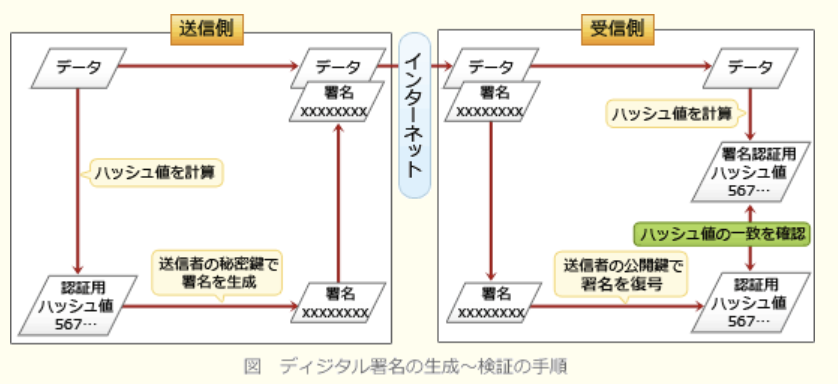
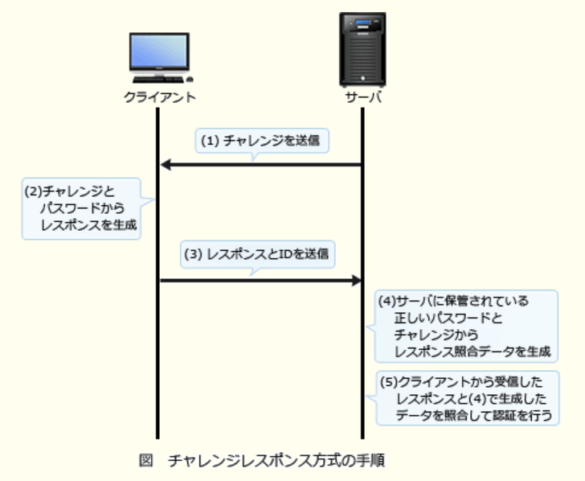
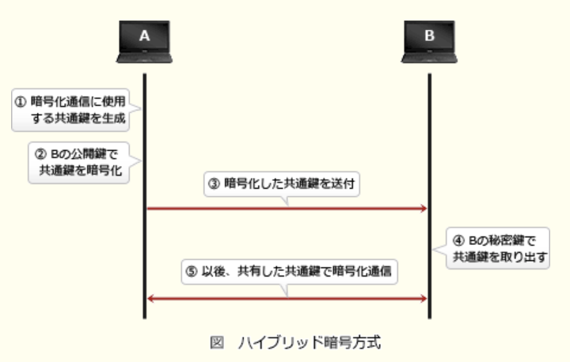
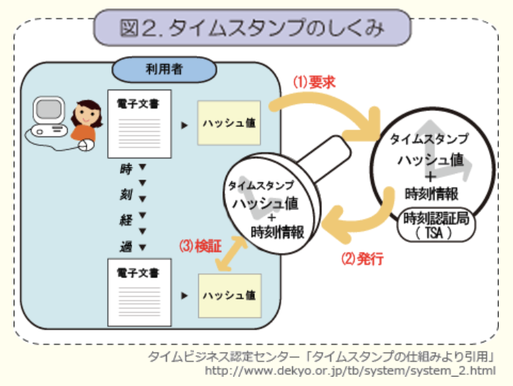
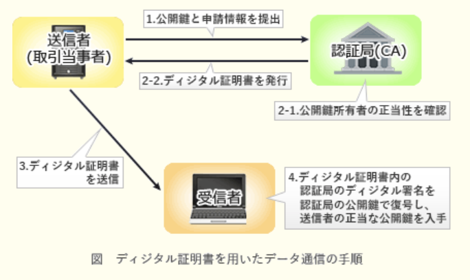
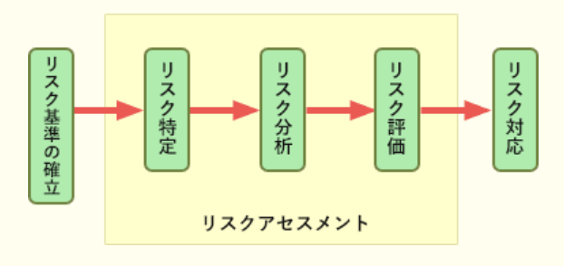
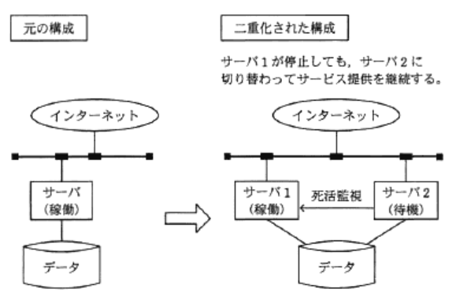

---
### 11.1 情報セキュリティ

---
1.シャドーITに該当するもの

- A.**IT部門の許可を得ずに、従業員又は部門が業務に利用しているデバイスやクラウドサービス**  
組織の公式な手続きを経ずに、業務に使用されているIT機器や情報システムのこと。許可を得ずに業務に使用されている従業員特有のパソコン・スマートフォン・タブレットや、承認を経ずに利用されている外部サービスなどがこれに該当する。  
導入に当たり十分な検討がされておらず、組織のセキュリティマネジメントが十分でないことも多く、セキュリティリスクが存在している。このような背景から、シャドーITへの対応が盗難や情報漏洩対策上の新たな課題として浮上してきている

- IT製品やITを活用して地球環境への負荷を低減する取組  
グリーンITの説明

- 攻撃対象者のディスプレイやキータイプを物陰から盗み見て、情報を盗み出す行為  
ショルダーハッキングの説明

- ネットワーク上のコンピュータに侵入する準備として、侵入対象の弱点を探るために組織や所属する従業員などの情報を収集すること  
フットプリンティングの説明

---
2.暗号方式に関する記述で適切なもの

- A.**共通鍵暗号方式では、暗号化及び復号に同一の鍵を使用する**  
錠をかける・開けるので同じ鍵を使用する、玄関のドアのようなイメージ

- AESは公開鍵暗号方式、RSAは共通鍵暗号方式の一種である  
ASEは共通鍵暗号方式、RSAは公開鍵暗号方式

- 公開鍵暗号方式を通信内容の秘匿に使用する場合は、暗号化に使用する鍵を秘密にして、復号に使用する鍵を公開する  
復号鍵は厳重に管理し、暗号化鍵は公開する

- デジタル署名に公開鍵暗号方式が使用されることはなく、共通鍵暗号方式が使用される  
公開鍵暗号方式を応用した技術。暗号化通信とは異なり、送信者が秘密鍵で暗号化したデータを、受信者が公開鍵で復号して検証することで、正当な送信者から送信されたデータであることを確認できる

---
3.XML署名を利用することでできることできること

- A.**XML文書全体に対する単一の署名だけではなく、文書の一部に対して署名を付与する部分署名や多重署名などの複雑な要件に対応する**  
XML文書にデジタル署名を埋め込んで改ざんを検知する技術。任意のデータファイルに対する署名の他にも、指定したエレメントなどのXML文書の一部に対しても署名を付与することが可能。  
`Detached Signature`  
`署名要素と署名対象要素が独立している`場合の署名形式。署名対象が別のファイルである場合や同じXML文書内でも要素の親子関係がないときなどに使う  
`Enveloped Signature`  
`署名要素が署名対象要素の子要素である`場合の署名形式。対象文書の中に署名が格納される  
`Enveloping Signature`  
`署名要素が署名対象要素の親要素である`場合の署名形式。署名の中に対象文書が格納される

- TLSにおいて、HTTP通信の暗号化及び署名の付与に利用することによって、通信経路上でのXMLファイルの盗聴を防止する  
HTTP通信の盗聴防止はTLSによって実現されている

- XMLとJavaScriptがもつ非同期のHTTP通信機能を使い、Webページの内容を動的に書き換えた上で署名を付与することによって、対話型のWebページを作成する  
Ajaxに関する記述

- 隠したい署名データを画像データの中に埋め込むことによって、署名の存在自体を外から判別できなくする  
ステガノグラフィに関する記述

---
4.オープンリダイレクトを悪用した攻撃に該当するもの

- A.**Webサイトにアクセスすると自動的に他のWebサイトに遷移する機能を悪用し、攻撃者が指定した偽のWebサイトに誘導する**  
URLパラメータやフォームデータなどの外部パラメータによって指定されたWebページに遷移するようにしているWebアプリケーションが、実装不備により、無制限にURLを受け入れてしまう状態。攻撃者がこの脆弱性を悪用することで、利用者は気付かないうちに信頼できるWebサイトに誘導されてしまい、誘導した先でフィッシングなどの被害に遭う危険がある

- HTMLメールのリンクを悪用し、HTMLメールに、正規のWebサイトとは異なる偽のWebサイトのURLをリンク先に指定し、利用者がリンクをクリックすることによって、偽のWebサイトに誘導する  
表撃型攻撃メール、フィッシングの例。HTMLでは、表示上のURLと実際のリンク先URLを異なるものにすることができるのを悪用した攻撃

- インターネット上の不特定多数のホストからDNSリクエストを受け付けて応答するDNSキャッシュサーバを悪用し、攻撃対象のWebサーバに大量のDNSのレスポンスを送り付け、リソースを枯渇させる  
DNSアンプ(リフレクタ)攻撃の説明

- 設定の不備によって、正規の利用者以外からの電子メールやWebサイトへのアクセス要求を受け付けるプロキシを悪用し、送信元を偽った迷惑メールの送信を行う  
踏み台攻撃の説明

---
5.発信者がメッセージのハッシュ値からデジタル署名のを生成するのに使う鍵

- A.**発信者の秘密鍵**  
1.送信者は、平文をハッシュ関数で圧縮したメッセージダイジェストを`送信者(自分)の秘密鍵`で暗号化し、平文と一緒に送信する  
2.受信者は、受信したメッセージダイジェストを`送信者(相手)の公開鍵`で復号し、受信した平文をハッシュ関数で圧縮したものと比較する  
3.1つの平文からハッシュ関数によって生成されるメッセージダイジェストは常に同じになるため、送信者から送られてきたメッセージダイジェストと、受信側でハッシュ化したメッセージダイジェストが同じなら、通信内容が改ざんされていないことが証明される

---
6.メッセージが改ざんされていないかどうか確認するために、そのメッセージからブロック暗号を用いて生成することができるもの

- A.**メッセージ認証符号**(*Message Authentication Code* : MAC)  
通信内容の改ざんの有無を検証し、完全性を保証するために通信データから生成される固定長のビット列のこと。生成には共通鍵暗号方式やハッシュ関数が用いられる。  
送信者はメッセージからMACを生成し、メッセージとともに送信する。  
送信者はメッセージからMACを生成し、メッセージとともに送信する。受信者は受け取ったメッセージから送信者と同様の方法でMACを生成し、受け取ったMACと自分が生成したMACを比較する。メッセージ・鍵・アルゴリズムが同じであれば生成されるMACは同じなので、一致すれば破損や改ざんがないと判断できる

- PKI(*Public Key Infrastructure*)  
公開鍵基盤のこと。公開鍵の正当性を第三者が保証する一連の仕組み

- パリティビット  
伝送時のデータ誤りを検出するために付加される検査用ビットのこと。送信するデータの一定長をビット列ごとに1ビットの検査ビットを付加し、受信側では受信データと検査ビットを照合することで誤りを検出する

- ルート証明書  
ルートCSが発行した証明書。デジタル証明書は、ルートCAを最上位とする上位CAが下位CAを認証して証明書を発行するという階層構造になっている。デジタル証明書の検証ではこの階層構造を遡り、最終的にルート証明書に行き着くかどうかで正当性を判断している

---
7.Webサイトで利用されるCAPTCHAに該当するもの

- A.**人からのアクセスであることを確認できるよう、アクセスした者に応答を求め、その応答を分析する仕組み**  
人間か、コンピュータによるアクセスか判別する目的でWebサイトに組み込まれる仕組み。歪めたり一部を隠した画像から文字を判別させる方式だったが、当初ほど有効ではなくなったため、最近では複数の似た画像から指定されたものを選ぶタイプやパズル、Webページ上の行動を解析して判別するタイプのものなど、よりコンピュータによる突破が難しい方式も登場している

- 不正なSQL文をデータベースに送信しないよう、Webサーバに入力された文字列をプレースホルダに割り当ててSQL文を組み立てる仕組み  
バインド機構の説明

- 利用者が本人であることを確認できるよう、Webサイトから一定時間ごとに異なるパスワードを要求する仕組み  
ワンタイムパスワードの説明

- 利用者が本人であることを確認できるよう、乱数をWebサイト側で生成して利用者に送り、利用者側でその乱数を鍵としてパスワードを暗号化し、Webサイトに送リ返す仕組み  
チャレンジレスポンス認証の説明

---
9.リバースブルートフォース攻撃に該当するもの

- A.**パスワードを1つ選び、利用者IDとして次々に文字列を用意して総当たりにログインを試行する**  
設定できるパスワード種が少ないシステムに対しては、通常のブルートフォースよりも効率的に認証を突破できる。安易なパスワードを使用していると攻撃を受けやすくなる。また、様々な利用者IDを次々と試すので、一般的なアカウントロックの仕組みでは防御しにくいという性質を持つ

- 攻撃者が何らかの方法で事前に入手した利用者IDとパスワードの組みのリストを使用して、ログインを試行する  
パスワードリスト攻撃の説明

- 利用者ID、及びその利用者IDと同一の文字列であるパスワードの組みを次々に生成してログインを試行する  
ジョーアカウント攻撃の説明

- 利用者IDを1つ選び、パスワードとして次々に文字列を用意して総当たりにログインを試行する  
ブルートフォース(総当たり)攻撃の説明

---
10.送信者Aからの文書ファイルと、その文書ファイルのデジタル署名を受信者Bが受信した時、受信者Bができることはどれか。受信者Bは送信者Aの署名検証鍵Xを保有しており、送信者Bと第三者は送信者Aの署名生成鍵Yを知らないものとする

- A.**文書ファイルが改ざんされていないこと、及びデジタル署名が署名生成鍵Yによって生成されたことを確認できる**  
送信するデジタル文書にデジタル署名を付けると、受信側で`発信元が正当であるか`、`改ざんの有無`の2点を確認できる。ただし、改ざん部位の特定、訂正の機能は有していない。デジタル署名の生成には`送信者の秘密鍵`を使用し、受信側の検証では`送信者の公開鍵`を使用する

- デジタル署名、文書ファイル及び署名検証鍵Xを比較することによって、文書ファイルに改ざんがあった場合、その部分を判別できる  
改ざんされた部位を特定することはできない

- 文書ファイルがマルウェアに感染していないことを認証局に問い合わせて確認できる  
デジタル署名はマルウェアに感染しているか確認する仕組みではない

- 文書ファイルとデジタル署名のどちらかが改ざんされた場合、どちらが改ざんされたかを判別できる  
一致しなければ改ざんがあったことは分かるが、どちらが改ざんされたかの判別はできない

---
12.サーバへのログイン時に用いるパスワードを不正に取得しようとする攻撃とその対策の組み合わせ

- A.辞書攻撃 : **推測されにくいパスワードを設定する**  
辞書に載っている英単語、人名、パスワードによく使われる文字列などを大量に登録したリスト(辞書ファイル)を用意して、1つずつ試すことでパスワードを解読しようとする攻撃手法

- A.スニッフィング : **パスワードを暗号化して送信する**  
通信経路上を流れるパケットを盗聴して、内容からパスワードの不正取得を試みる攻撃手段

- A.ブルートフォース攻撃 : **ログインの試行回数に制限を設ける**  
パスワードとして設定可能な文字数と文字種文字種の組み合わせを全て試すことで、パスワードの不正取得を試みる攻撃手法。パスワード長が短く、使用可能な文字種が少ない場合には、この手法で破られる可能性が長くなってしまう

---
14.企業のDMZ上で1台のDNSサーバを、インターネット公開用と、社内のPC及びサーバからの名前解決の問合せに対応する社内用とで共用している。このDNSサーバが、DNSキャッシュポイズニングの被害を受けた結果、直接引き起こされ得る現象

- A.**社内の利用者が、インターネット上の特定のWebサーバにアクセスしようとすると、本来とは異なるWebサーバに誘導される**  
DNSサーバからの名前解決要求があった場合に、正当なDNS応用よりも早く、偽の名前解決情報を含んだ応答を送りつけることで、そのDNSサーバに偽のキャッシュ情報(ドメイン名 / IPアドレスの組み)を登録させる攻撃。  
社内PCは外部のサイトにアクセスしようとする際に、DMZ上のサーバに名前解決を依頼するが、汚染されたDNSサーバは、偽のキャッシュ情報をもとに本来とは異なるサイトのIPアドレスを返す。これにより、社内PCが攻撃者の指定した悪意のあるサイトへ誘導され、機密情報を盗まれるなどの被害が生じる可能性がある

- DNSサーバのハードディスク上に定義されているDNSサーバ名が書き換わり、インターネットからのDNS参照者が、DNSサーバに接続できなくなる  
DNSサーバ名の書き換えは行わない

- DNSサーバのメモリ上にワームが常駐し、DNS参照元に対して不正プログラムを送り込む  
ワームに感染させる攻撃ではない

- 社内の利用者間の電子メールについて、宛先メールアドレスが書き換えられ、送信ができなくなる  
偽のキャッシュ情報が登録されることで別のサーバに誘導され、メールの盗聴・改ざんを受ける可能性はあるが、電子メールの宛先アドレスが書き換えられることはない

---
15.パスワードに使用できる文字の種類を`M`、パスワードの文字数を`n`とする時、設定できるパスワードの理論的な総数を求める数式

- A.**Mのn乗**  
文字種の数を文字数だけ乗じた数が正しい

---
16.チャレンジレスポンス認証方式に該当するもの

- A.**利用者が入力したパスワードと、サーバから受け取ったランダムなデータとをクライアントで演算し、その結果をサーバに送信する**  
通信経路乗に固定パスワードを流さないようにすることで、盗聴によるパスワードの漏洩やリプレイアタックを防止する認証方式。  
1.サーバは、クライアントから要求があるたびに異なる乱数値(チャレンジ)を生成して保持するとともに、クライアントへ送る  
2.クライアントは、利用者が入力したパスワードと(1)でサーバから送られた"チャレンジ"から所定の方法でレスポンスを計算する  
3.クライアントは、(2)で生成した"レスポンス"と利用者が入力した利用者IDをサーバに送る  
4.サーバは、クライアントから受け取った利用者IDで利用者情報を検索して、取り出したパスワードと(1)で保持していた"チャレンジ"を用いてクライアントと同じ手順でレスポンスを生成する(レスポンス照合データ)  
5.サーバは"レスポンス照合データ"とクライアントから受け取った"レスポンス"を比較し、両者が一致すれば認証成功とする

- 固定パスワードをTLSによって暗号化し、クライアントからサーバに送信する  
チャレンジレスポンス方式では、固定パスワードとサーバから送信された乱数(チャレンジ)を組み合わせたものをハッシュ化又は暗号化してサーバに返信する

- 端末のシリアル番号を、クライアントで秘密鍵を使って暗号化してサーバに送信する  
端末のシリアル番号は送信しない。端末ごとに固有の番号を使用するといつも同じ認証データが使われることになるので、リプレイアタックを受ける可能性がある

- トークンという装置が自動的に表示する、認証のたびに異なるデータをパスワードとしてサーバに送信する  
時刻同期式ワンタイムパスワードの説明。チャレンジレスポンス方式ではトークンは不要

---
17.OpenPGPやS / MIMEにおいて用いられるハイブリッド暗号方式の特徴

- A.**公開鍵暗号方式と共通鍵暗号方式を組み合わせることによって鍵管理コストと処理性能の両立を図る**  
公開鍵暗号方式を用いて交通鍵を通信相手へ安全に配送し、以後はその共通鍵を使用して暗号化通信を行う方式。それぞれの暗号方式には以下の短所がある  
`共通鍵暗号方式` : 安全に鍵を配送するのに手間がかかり、通信相手が増えると必要な鍵数が増える  
`公開鍵暗号方式` : 暗号化・復号に要する計算量が多いため処理に時間がかかる  
ハイブリッド暗号方式は、両者を組み合わせることで、当事者間で鍵を安全に共有しつつ、低い処理負荷での暗号化・復号を可能にしている

---
18.攻撃者が用意したサーバXのIPアドレスが、A社WebサーバのFQDNに対応するIPアドレスとして、B社DNSキャッシュサーバに記憶された。これによって、意図せずサーバXに誘導されてしまう利用者はどれか。A社・B社の各従業員は自社のDNSキャッシュサーバを利用して名前解決を行う

- A.**A社WebサーバにアクセスしようとするB社従業員**  
`DNSキャッシュポイズニング`は、DNSサーバに偽のキャッシュ情報を登録させ、汚染されたDNSサーバの利用者を、攻撃者の設定した別のサイトに誘導させようとする攻撃手法。利用者の名前解決要求に対して、偽のキャッシュ情報を元にした結果が返されると、利用者は意に反して別のサイトに移動させられてしまう。  
今回は、`A社WebサーバのFQDN`という名前で、`サーバXのIPアドレス`という偽のキャッシュ情報が、B社DNSキャッシュサーバに記憶されている。そのため、A社ドメインに対する名前解決要求をB社キャッシュサーバに行うと、`サーバXのIPアドレス`が返され、攻撃者の用意したサーバXにアクセスさせられてしまう。`各従業員は自社のDNSキャッシュサーバを利用する`ため、B社キャッシュサーバを利用するのはB社従業員のみ

---
19.メッセージにRSA方式のデジタル署名を付与して2者間で送受信する。その時のデジタル署名の検証鍵と使用方法

- A.**送信者の公開鍵であり、受信者がデジタル署名からメッセージダイジェストを算出する際に使用する**  
1.送信者は、メッセージをハッシュ関数にかけてメッセージダイジェスト(ハッシュ値)を得る  
2.送信者は、メッセージダイジェストを`送信者(自分)の秘密鍵で暗号化`し、デジタル署名と平文と一緒に送信する  
3.受信者は、受信したメッセージダイジェストを`送信者(相手)の公開鍵`で復号し、メッセージダイジェストを得る  
4.受信者は、受信したメッセージを送信者と同じハッシュ関数でハッシュ化したものと、3で復号したメッセージダイジェストを比較する  
5.1つの平文からハッシュ関数によって生成されるメッセージダイジェストは常に同じになるため、送信者から送られてきたメッセージダイジェストと、受信側でハッシュ化したメッセージダイジェストが同じなら、通信内容が改ざんされていないことが証明される

---
20.情報セキュリティにおいてバックドアに該当するもの

- A.**アクセスする際にパスワード認証などの正規の手続が必要なWebサイトに、当該手続を経ないでアクセス可能なURL**  
一度不正侵入に成功したコンピュータやネットワークにいつでも際侵入できるように攻撃者によって設けられた仕掛けのことを指す。外部からの問い合わせに呼応するプログラムを潜り込ませたり、OSの設定ファイルを書き換えたりすることによって仕掛けられる。  
侵入に成功した際にサーバ上にCGIファイルなどを設置して、URLでアクセスできるようにしておけば、認証を経ずにサーバ上の様々なファイルを扱うことが可能。IDやパスワードを使って通信を制限したり、使用権を確認したりするコンピュータの機能を無許可で利用するために、コンピュータ内に仕掛けられた通信接続の機能が該当する

- インターネットに公開されているサーバのTCPポートの中からアクティブになっているポートを探して、稼働中のサービスを特定するためのツール  
ポートスキャナーの説明

- ネットワーク上の通信パケットを取得して通信内容を見るために設けられたスイッチのLANポート  
ミラーポートの説明

- プログラムが確保するメモリ領域に、領域の大きさを超える長さの文字列を入力してあふれさせ、ダウンさせる攻撃  
バッファオーバーフロー攻撃の説明

---
21.ファイルの提供者は、ファイルの作成者が作成したファイルAを受け取り、ファイルAと、ファイルAにSHA-256を適用して算出した値Bとを利用者に送信する。その時、利用者が情報セキュリティ上実現できることはどれか。利用者が受信した値Bはファイルの提供者から事前に電話で直接伝えられた値と同じであり、改ざんされていないことが確認できているものとする

- A.**ファイルAにSHA-256を適用して値を算出し、その値と値Bを比較することによって、ファイルAの内容が改ざんされていないかどうかを検証できる**  
送信側で算出したハッシュ値と受信側で算出したハッシュ値を比較することで、通信経路上でファイルが改ざんされていないかどうか確認できる

ハッシュ関数は、任意の長さのデータを入力すると固定長のビット列(ハッシュ値、メッセージダイジェスト)を返す関数で、以下の特徴を持っている  
・入力データが同じであれば、常に同じメッセージダイジェストが生成される  
・入力データが少しでも異なっていれば生成されるメッセージダイジェストは大きく異なる  
・メッセージダイジェストから元の入力データを再現することが困難である  
・異なる入力データから同じメッセージダイジェストが生成される可能性が非常に低い  
このような特徴を利用して、ハッシュ関数は通信経路での改ざんの権利やユーザ認証、デジタル署名などの場面で活用されている

- 値BにSHA-256を適用して値Bからデジタル署名を算出し、そのデジタル署名を検証することによって、ファイルAの作成者を確認できる
- 値BにSHA-256を適用して値Bからデジタル署名を算出し、そのデジタル署名を検証することによって、ファイルAの提供者がファイルAの作成者であるかどうかを確認できる  
メッセージダイジェスト(値B)からデジタル署名を生成するには、ハッシュ関数ではなく公開鍵暗号を使用しないといけない。ハッシュ関数だと利用者側で復号することができない。正しくデジタル署名を生成したとしてもファイル作成者を確認はできない

- ファイルAの内容が改ざんされていても、ファイルAにSHA-256を適用して値を算出し、その値と値Bの差分を確認することによって、ファイルAの内容のうち改ざんされている部分を修復できる  
改ざん部位の特定はできない

---
24.パスワードリスト攻撃の手口に該当するもの

- A.**複数サイトで同一の利用者IDとパスワードを使っている利用者がいる状況に着目して、不正に取得した他サイトの利用者IDとパスワードの一覧表を用いて、ログインを試行する**  
利用者側で「パスワードの使い回しを控える」、管理者側で「2段階認証を行う」「ログイン履歴を表示し、利用者に確認してもらう」などの対策が考えられる

- 辞書にある単語をパスワードに設定している利用者がいる状況に着目して、攻撃対象とする利用者IDを1つ定め、辞書にある単語やその組合せをパスワードとして、ログインを試行する  
辞書攻撃に該当する

- パスワードの文字数の上限が小さいWebサイトに対して、攻撃対象とする利用者IDを1つ定め、文字を組み合わせたパスワードを総当たりして、ログインを試行する  
ブルートフォース攻撃(総当たり攻撃)に該当する

- よく用いられるパスワードを1つ定め、文字を組み合わせた利用者IDを総当たりして、ログインを試行する  
リバースブルートフォース攻撃(逆総当たり攻撃)に該当する

---
25.メッセージ認証符号(*Message Authentication Code*)の利用目的

- A.**メッセージが改ざんされていないことを確認する**  
通信データが改ざんされていないかを受信側で検査するために、通信データから生成する固定長のコード(メッセージダイジェスト)。  
送信側は、通信データを共通鍵暗号方式またはハッシュ関数で変換したコードを送信データに付加して送信し、受信側も同一の共通鍵暗号方式またはハッシュ関数を使って受信データを変換する。変換したコードの一致を確認し、一致していれば改ざんは行われていないと判断する。  
MACの目的は改ざんの検知なのでデジタル署名と似ているが、デジタル署名は公開鍵暗号方式を応用した技術であるのに対し、MACは共通鍵暗号方式やハッシュ関数を用いた仕組み

---
26.楕円曲線暗号(*Elliptic Curve Cryptography*)の特徴

- A.**RSA暗号と比べて、短い鍵長で同レベルの安全性が実現できる**  
楕円曲線上の点の演算を用いた公開鍵暗号方式。楕円曲線によって定義された有限可換群上の離散対数問題を解く際の計算量の多さを多さを安全性の根拠とし、同じ強度を想定した場合、RSAより鍵長を短くできる利点がある。ビットコインで採用されている暗号方式。  
公開鍵暗号方式は暗号化・復号に要する研鑽量が多いため、RSAの鍵長は処理負荷の面でネックとなっている。代わりに鍵長が少なくて済む楕円曲線暗号へのニーズが高まってきている。特に組込みシステムやIoTデバイスなどの資源に制約のある環境では有効な選択肢となる

- 共通鍵暗号方式であり、暗号化や復号の処理を高速に行うことができる  
共通鍵暗号方式ではなく、公開鍵暗号方式

- 総当たりによる解読が不可能なことが、数学的に証明されている  
不可能ではない。現実的に有効な時間での解読が難しいことを安全性の根拠にしている

- データを秘匿する目的で用いる場合、復号鍵を秘密にしておく必要がない  
他の公開鍵暗号方式と同様に、暗号化通信で用いる場合には、暗号化鍵を公開し、復号鍵を秘密にする

---
27.不正が発生する際には"不正のトライアングル"の3要素全てが存在すると考えられている。構成要素の説明

- A.**"機会"とは、情報システムなどの技術や物理的な環境・組織のルールなど、内部者による不正行為の実行を可能又は容易にする環境の存在である**  
`機会` : 不正を行おうと思えばいつでもできるような状態のこと。「悪用可能なシステムの不備が存在する」「チェックする人がいない」「やってもばれない」という職場環境が該当する

- "情報と伝達"とは、必要な情報が識別・把握及び処理され、組織内外及び関係者相互に正しく伝えられるようにすることである  
内部統制の基本的要素の1つで、不正のトライアングルとは関係ない

- "正当化"とは、ノルマによるプレッシャなどのことである  
`正当化` : 自分に都合の良い理由をこじつけて、不正を行うときに感じる「良心の呵責」を乗り越えてしまうこと。「組織のためで、悪いことではない」「自分のせいではない、組織・制度が悪い」「職場で不遇な扱いを受けている」等の身勝手な言い訳(罪悪感からの逃避や責任転嫁)が該当する

- "動機"とは、良心のかしゃくを乗り越える都合の良い解釈や他人への責任転嫁など、内部者が不正行為を自ら納得させるための自分勝手な理由付けである  
`動機・プレッシャー` : 自己の要求の達成や問題を解決するためには不正を行うしかないという考えに至った心情のこと。「過大なノルマ」「個人的に金銭的問題がある」という心情が該当する

---
29.AES-256で暗号化されていることが分かっている暗号分が与えられている時、ブルートフォース攻撃で鍵と解読した平文を得るまでに必要な試行回数の最大値

- **2の256乗**  
共通鍵暗号方式のAESでは、鍵長として128・192・256ビットが利用可能。ブルートフォース攻撃(総当たり攻撃)は、特定の文字数・文字種で設定される可能性のある全ての組合せを試すことで解読を試みる攻撃手法。文字種で0 ~ 9を使える4桁のパスワードであれば、0000 ~ 9999の1万通りを全て試す。鍵長256ビットであれば、正しく平文に戻せるのは`2の256乗`種類の中でいずれか1つということ。最後の1回で一致した場合が最大の試行回数となる

---
33.攻撃者がシステムに侵入する時にポートスキャンを行う目的

- A.**事前調査の段階において、攻撃できそうなサービスがあるかどうかを調査する**  
コンピュータやルータのアクセス可能な通信ポートを外部から調査する行為。スキャン対象からの応答でOSの種類、稼働しているサービスとそのバージョンなどの情報が得られるため、不正アクセスを行うための下調べや、脆弱性検査などの目的で実施される

---
35.セキュリティバイデザインの説明

- A.**システムの企画・設計段階からセキュリティを確保する方策のことである**  
情報セキュリティを企画・設計段階から確保するための方策と定義されている。開発プロセスの早期段階からセキュリティを考慮することで、後付けでセキュリティ機能を追加する場合と比べて「手戻りが少ない」「低コスト」「保守性の向上」などの利点があるとされている。IoTシステムについてはセキュリティバイデザイン思想で設計・構築・運用することが推奨されている

---
37.ボットネットにおいてC&C(コマンドコントロール)サーバが果たす役割

- A.**遠隔操作が可能なマルウェアに、情報収集及び攻撃活動を指示する**  
マルウェアが侵入に成功したコンピュータ群(ボットネット)の動作を制御するために用いられる外部の指令サーバ。  
マルウェアはC&Cサーバからの指令を受けて、乗っ取ったコンピュータで悪意のある活動を行う。外部から内部ネットワークに存在するマルウェアに対して通信を試みてもFWなどで遮断されてしまうため、マルウェア側からC&Cサーバに対して定期的に問い合わせを行い、その応答を使って指令を行う仕組みが用いられている(コネクトバック通信)

---
38.DNSキャッシュポイズニングに分類される攻撃内容

- A.**PCが参照するDNSサーバに偽のドメイン情報を注入して、利用者を偽装されたサーバに誘導する**  
DNSサーバからの名前解決要求があった場合に正常な応答に加えて偽の名前解決情報(ドメイン情報)を付加して送信し、サーバのキャッシュに偽の情報を登録させる攻撃手法。汚染されたDNSサーバを利用したユーザが、偽のキャッシュ情報をもとに悪意のあるサイトに誘導され、機密情報を盗まれるなどの被害が発生する可能性がある

- DNSサーバのソフトウェアのバージョン情報を入手して、DNSサーバのセキュリティホールを特定する  
攻撃のための情報を事前に収集する、フットプリンティングの説明。サーバソフトウェアのバージョン情報等の収集には、ポートスキャニングツールが用いられることがある

- 攻撃対象のサービスを妨害するために、攻撃者がDNSサーバを踏み台に利用して再帰的な問合せを大量に行う  
反射型DoS攻撃の一種の、DNSリフレクション攻撃の説明

- 内部情報を入手するために、DNSサーバが保存するゾーン情報をまとめて転送させる  
ゾーン転送を悪用した登録情報の収集

---
40.SQLインジェクション攻撃(*SQL Injection*)の説明

- A.**Webアプリケーションに問題があるとき、悪意のある問合せや操作を行う命令文をWebサイトに入力して、データベースのデータを不正に取得したり改ざんしたりする攻撃**  
Webアプリケーションに対してDBへの命令文を構成する不正な入力データを与え、Webアプリケーションが想定していないSQL文を意図的に実行させることで、DBを破壊したり情報を不正取得したりする攻撃。  
入力値の中でSQLとして特別な意味を持つ文字を適切にエスケープすることや、SQL文中の変数部分にプレースホルダを割り当てることで防ぐ。DBMSやライブラリによってはエスケープ処理が自動化されているものもある

- 悪意のあるスクリプトを埋め込んだWebページを訪問者に閲覧させて、別のWebサイトで、その訪問者が意図しない操作を行わせる攻撃  
クロスサイトリクエストフォージェリの説明

- 市販されているDBMSの脆弱性を利用することによって、宿主となるデータベースサーバを探して自己伝染を繰り返し、インターネットのトラフィックを急増させる攻撃  
*SQL Slammer*などのセキュリティホールを突いて感染を広げるタイプのワームの説明

- 訪問者の入力データをそのまま画面に表示するWebサイトに対して、悪意のあるスクリプトを埋め込んだ入力データを送ることによって、訪問者のブラウザで実行させる攻撃  
クロスサイトスクリプティングの説明

---
42.マルウェアについて、トロイの木馬とワーム(*Warm*)を比較した時、ワームの特徴

- A.**ネットワークやリムーバブルメディアを媒介して自ら感染を広げる**  
自己の複製をネットワークや電子メール、またはUSBメモリなどの外部メディアに送り込み、他のコンピュータへの拡散動作を繰り返す性質を持つマルウェア。感染したコンピュータへの悪影響はもとより、感染拡大によりネットワーク負荷やCPU負荷の増大といった二次被害をもたらす。それ自身が独立したプログラムであるため、別のシステムに感染しようとする時に宿主となるファイルを必要としない。ネットワークを介して他のコンピュータに感染を広げるのがワームの顕著な特徴。  
トロイの木馬は、見かけ上は正常動作をしているようになりすまして、秘密裏に悪意のある動作を行うように仕組まれたマルウェア。被害者が不正コードの仕込まれた実行形式のプログラム(.exeや.comなど)を実行することで、行動を開始することがほとんど。

- 勝手にファイルを暗号化して正常に読めなくする  
ランサムウェアの特徴

- 単独のプログラムとして不正な動作を行う  
どちらのマルウェアも単独で動作可能

- 特定の条件になるまで活動をせずに待機する  
トロイの木馬の特徴

---
44.ディレクトリトラサーバル攻撃に該当するもの

- A.**攻撃者が、パス名を使ってファイルを指定し、管理者の意図していないファイルを不正に閲覧する**  
ユーザが入力したファイル名をパラメータとして受け取り、それをもとに処理を行うアプリケーションに対して行われる攻撃手法。相対パス指定において親ディレクトリを表す(../)など、システムが想定外のファイル名を指定することで、本来秘匿にされているファイルを不正に閲覧・取得することを目的としている

- 攻撃者が、Webアプリケーションの入力データとしてデータベースへの命令文を構成するデータを入力し、管理者の意図していないSQL文を実行させる  
SQLインジェクションの説明

- 攻撃者が、利用者をWebサイトに誘導した上で、WebアプリケーションによるHTML出力のエスケープ処理の欠陥を悪用し、利用者のWebブラウザで悪意のあるスクリプトを実行させる  
XSS(クロスサイトスクリプティング)の説明

- セッションIDによってセッションが管理されるとき、攻撃者がログイン中の利用者のセッションIDを不正に取得し、その利用者になりすましてサーバにアクセスする  
セッションハイジャックの説明

---
45.共通鍵暗号の鍵を見つけ出そうとする、ブルートフォース攻撃に該当するもの

- A.**1組みの平文と暗号文が与えられたとき、全ての鍵候補を1つずつ試して鍵を見つけ出す**  
特定の文字数・文字種で設定される可能性のある全ての組合せを試すことで不正ログインやパスワード解析を試みる攻撃手法(総当たり攻撃)。パスワード長が短く、使用可能な文字種が少ない場合、この手法によって破られる可能性が高くなる。  
オンライン上での攻撃では数回の試行でロックアウトになってしまうことが多いため、オフライン環境で使用される解読手法

- 平文と暗号文と鍵の関係を表す代数式を手掛かりにして鍵を見つけ出す  
暗号化関数の線形近似式を発見することを基本とした「線形解読法」の説明

- 平文の一部分の情報と、暗号文の一部分の情報との間の統計的相関を手掛かりにして鍵を見つけ出す  
RC4の解読攻撃に使用される「関連鍵攻撃」の説明

- 平文を一定量変化させたときの暗号文の変化から鍵を見つけ出す  
入力値の差分が出力値の差分にどのような影響を与えるかを分析して解読を試みる「差分解読法」の説明

---
47.情報セキュリティにおけるタイムスタンプサービスの説明

- A.**電子データが、ある日時に確かに存在していたこと、及びその日時以降に改ざんされていないことを証明するサービス**  
対象の電子データのハッシュ値と、信頼できる第三者機関である時刻認証局(TSA : *Time Stamp Authority*)が発行する時刻情報を含んだ電子データ。検証時には、電子データのハッシュ値とタイムスタンプ内のハッシュ値の比較により、付与時点での`存在性`と、その時刻以後の`完全性`を確認でき、タイムスタンプにTSAのデジタル署名を付する方式もある

- 公式の記録において使われる全世界共通の日時情報を、暗号化技術を用いて安全に表示するWebサービス  
標準時配信サービスの説明

- 指紋・声紋・静脈パターン・網膜・虹彩などの生体情報を、認証システムに登録した日時を用いて認証するサービス  
バイオメトリクス認証の説明。一般的には登録した日時と認証手続きは関係ない

- ネットワーク上のPCやサーバの時計を合わせるための日時情報を途中で改ざんされないように通知するサービス  
NTP(*Network Time Protocol*)の説明

---
50.PKIにおける認証局が、信頼できる第三者機関として果たす役割

- A.**利用者やサーバの公開鍵を証明するデジタル証明書を発行する**  
認証局(*Certification Authority*)は、公開鍵暗号方式を用いた暗号化通信やデジタル署名において、`利用者の公開鍵`の正当性を保証するためのデジタル証明書を発行する機関。認証局は、デジタル証明書を発行する以外にもPKI(公開鍵基盤)において、「CRL(証明書執行リスト)の発行」「CPS(認証局運用規定)の公開」「デジタル証明書を検証するための認証局の公開鍵の公開」「認証局の秘密鍵の厳重な管理」も担っている

- 利用者からの要求に対して正確な時刻を返答し、時刻合わせを可能にする  
NTPサーバの役割

- 利用者から要求された電子メールの本文に対して、デジタル署名を付与する  
*S / MIME*や*OpenPGP*の役割

- 利用者やサーバの秘密鍵を証明するデジタル証明書を発行する  
認証局が正当性を証明するのは公開鍵

---
51.ICカードとPIN(*Personal Identification Number*)を用いた利用者認証における適切な運用

- A.**PINは、ICカードには同封せず、別経路で利用者に知らせる**  
クレジットカードやキャッシュカードキャッシュカードなどのICカードの利用時に入力を求められる暗証番号のこと。利用時にはカードを所有していることと、PINを知っていることの2つで二要素認証を行うことでカードの不正利用を防止する防止する仕組みになっている。PINが他人に知られるとなりすまし被害に遭う恐れがあるため、推測が困難な文字列を設定し秘密にして管理する必要がある

- ICカードによって個々の利用者を識別できるので、管理負荷を軽減するために全利用者に共通のPINを設定する  
PINが共通だと、他人のICカードを取得した者が不正使用することを防げないので不適切

- ICカード紛失時には、新たなICカードを発行し、PINを再設定した後で、紛失したICカードの失効処理を行う  
紛失したICカードの不正使用を防ぐため、執行処理を先に行う必要がある

- PINには、ICカードの表面に刻印してある数字情報を組み合わせたものを設定する  
ヒントになる情報をICカードに刻印すると、他人にPINを推測されてしまう危険性が増すため不適切

---
52.サーバにバックドアを作り、サーバ内で侵入の痕跡を隠蔽するなどの機能がパッケージ化された不正なプログラムのツール

- ***rootkit***  
攻撃者が不正侵入した痕跡を隠蔽したり、再び侵入するためのバックドアを設置するための機能をまとめたソフトウェア群。キーロガー・パスワード窃盗ツール・クレジットカードやオンラインバンキングの情報を盗むモジュール・DDoS攻撃用のボット・セキュリティソフトウェアを無効にする機能など、多数の悪意のあるツールが含まれている可能性がある

- RFID(*Ridio Frequency IDentification*)  
ID情報を埋め込んだRFタグ(ICタグ)から電磁界か電波を用いて情報のやり取りを行う技術で、ICカードなどで使用されている

- TKI(*Temporal Key Integrity Protocol*)  
無線ネットワーク規格で使われているセキュリティプロトコル。使用する鍵を一定時間ごとに更新することで暗号解読に対する耐性を高めた方式

- *web beacon*  
Webページに埋め込んだ見えないほどの小さな画像のことで、ユーザの利用環境や滞在時間・ページ遷移などの情報を得たりするために設置される。その情報の多くはアクセス解析などのために使用されている

---
53.別のサービスやシステムから流出したアカウント認証情報を用いて、アカウント認証情報を使い回している利用者のアカウントを乗っ取る攻撃

- A.**パスワードリスト攻撃**  
複数のサイトで同様のID・パスワードの組合せを使用している利用者が多いという傾向を悪用したもので、あるサイトに対する攻撃など何らかの方法で入手した認証情報のリストを用いて、複数の別のサイトへの不正ログインを試みる攻撃

- ブルートフォース攻撃(総当り攻撃)  
特定の文字数・文字種で設定される可能性のある組合せ全てを貯めることで不正ログインを試みるパスワードクラック手法。

- リバースブルートフォース攻撃  
パスワードを1つに固定し、利用者IDを総当りで試していくことで不正ログインを試みるパスワードクラック手法。設定できるパスワード種(数字4桁など)非常に少ないシステムに対しては、通常のブルートフォースよりも効率的に認証を突破できる。よく使われる安易なパスワードを使用していると、この攻撃の被害を受けやすくなる。さまざまな利用者IDを次々と試すので、一般的なアカウントロックの仕組みでは防御しにくい

- レインボー攻撃  
想定され得るパスワードとそのハッシュ値との対のリストを用いて、入手したハッシュ値からパスワードを効率的に解析する攻撃。通常パスワードは漏えい対策のためにハッシュ化された状態でサーバに記録されているが、レインボー攻撃はこのハッシュ化されたパスワードから本来のパスワードを推測することを目的としている

---
54.PCへの侵入に成功したマルウェアがインターネット上の指令サーバと通信を行う場合に、宛先ポートとしてTCPポート番号80が多く使用される理由

- A.**Webサイトの閲覧に使用されることから、通信がファイアウォールで許可されている可能性が高い**  
Webサイトを閲覧する際にブラウザとWebサーバで行われるHTTP通信のために予約されている通信ポート。Webサイトの閲覧に使うポートなので、PCからインターネット上のWebサイトにアクセスするためファイアウォールで通信を許可する設定になっていることが普通

- DNSのゾーン転送に使用されるので、通信がファイアウォールで許可されている可能性が高い  
DNSのゾーン転送で使われるポートは53 / TCP

- WebサイトのHTTPS通信での閲覧に使用されることから、侵入検知システムで検知される可能性が低い  
HTTPS通信で使われるポートは443 / TCP

- ドメイン名の名前解決に使用されるので、侵入検知システムで検知される可能性が低い  
DNSの名前解決で使われるポートは53 / UDP

---
57.スパイウェア(*Spyware*)に該当するもの

- A.**利用者の意図に反してPCにインストールされ、利用者の個人情報やアクセス履歴などの情報を収集するプログラム**  
利用者や管理者の意図に反してインストールされ、利用者の個人情報やアクセス履歴及びキーストロークなどの情報を秘密裏に収集し、勝手に外部の組織や個人に送信する不正プログラム。  
ユーザに気付かれずに情報を収集することが目的であるため、ウイルスの特徴であるシステムの改ざんやファイルの破壊などの目立つ活動は行わないことが多く、インストールされていることをユーザから隠すようになっている

- Webサイトへの不正な入力を排除するために、Webサイトの入力フォームの入力データから、HTMLタグ、JavaScript、SQL文などを検出し、それらを他の文字列に置き換えるプログラム  
サニタイジングの説明

- サーバへの侵入口となり得る脆弱なポートを探すために、攻撃者のPCからサーバのTCPポートに順番にアクセスするプログラム  
ポートスキャンツールの説明

- 利用者のパスワードを調べるために、サーバにアクセスし、辞書に載っている単語を総当たりで試すプログラム  
辞書攻撃を行うパスワードクラックツール

---
59.Webシステムのパスワードを忘れた時の利用者認証において合言葉を使用する場合、合い言葉が一致した後の処理のうち、セキュリティ上最も適切なもの

- A.**あらかじめ登録された利用者のメールアドレス宛てに、パスワード再登録用ページヘアクセスするための、推測困難なURLを送信する**  
パスワードを忘れたユーザを救済するための仕組みを`パスワードリマインダ`と呼ぶ。パスワードリマインダを設けることでユーザの利便性は高まるが、認証の機会が増えることでセキュリティが弱くなるため仕組みや設置の可否を慎重に検討する必要がある。  
「パスワードリマインダのWebページ上で1回限り有効なキー(短め)をユーザに発行する」 => 「1回限り有効な別のキー(長め)を含むURLを、ユーザが`予め登録している電子メールアドレス宛に`送信する」 => 「ユーザにそのURLのWebページにアクセスしてもらい、先ほどのキーを入力してもらう」 => 「キーが照合できたらパスワードの再設定・再発行を行う」 => 「一定回数以上照合に失敗したら2つのキーは無効にする(ロックアウト)」

- あらかじめ登録された利用者のメールアドレス宛てに、現パスワードを送信する  
受信者のメーラがメールの暗号化を行うS / MIMEやPGPに対応していなかったり、HTTP接続でないWebメールサービスを利用する際にはメールの内容が盗聴される恐れがある。またパスワードが記載されたメールの取扱い方法によっては、第三者に漏れてしまう可能性も考えられる。パスワードそのものをメールで送ることは不適切

- 新たにメールアドレスを入力させ、そのメールアドレス宛てに、現パスワードを送信する
- 新たにメールアドレスを入力させ、そのメールアドレス宛てに、パスワード再登録用ページヘアクセスするための、推測困難なURLを送信する  
攻撃者が任意のメールアドレスを指定できてしまうため不適切

---
63.標的型攻撃メールで利用されるソーシャルエンジニアリング手法に該当するもの

- A.**件名や本文に、受信者の業務に関係がありそうな内容を記述する**  
差出人を取引先企業や官公庁や知人など信頼性のある人に偽装し、さらに、受信者の興味を引く件名や本文を使用することによって、ウイルスを仕込んだ添付ファイルを開かせたり、ウイルスに感染させるWebサイトのリンクをクリックさせるように巧妙に誘導する攻撃手法。  
この攻撃は、`メールの件名・本文にあたかもその企業・組織の業務に関係があるような内容を記述し受信者を錯覚させる`という人間の心理的な隙をつくソーシャルエンジニアリングの要素をもっている

- 件名に"未承諾広告※"と記述する  
スパムメールの特徴

- 支払う必要がない料金を振り込ませるために、債権回収会社などを装い無差別に送信する  
架空請求詐欺メールの特徴

- 偽のホームページにアクセスさせるために、金融機関などを装い無差別に送信する  
フィッシング詐欺メールの特徴

---
64.キーロガー(*Keylogger*)の悪用例

- A.**ネットバンキング利用時に、利用者が入力したパスワードを収集する**  
PCへのキーボードやマウス入力を逐一監視し、それを記録するソフトウェアまたはハードウェア。悪意をもってPCにインストールされた場合には、利用者の入力情報を秘密裏に盗むことも可能で、キー入力データを解析し、IDやパスワード、クレジットカードの番号などを不正に入手される恐れがあることからセキュリティ上の問題となっている

- 通信を行う2者間の経路上に割り込み、両者が交換する情報を収集し、改ざんする  
プロキシサーバを悪用した中間者攻撃に関する記述

- ブラウザでの動画閲覧時に、利用者の意図しない広告を勝手に表示する  
アドウェアを悪用した例

- ブラウザの起動時に、利用者がインストールしていないツールバーを勝手に表示する  
ブラウザをアドオンした悪用した例

---
70.ソーシャルエンジニアリング(*Social Engineering*)に分類される手口

- A.**システム管理者などを装い、利用者に問い合わせてパスワードを取得する**  
技術的な方法ではなく、人の心理的な弱みやミスに付け込んでパスワードなどの秘密情報を不正に取得する行為の総称。管理者や関係者になりすまして秘密情報を不正取得する「なりすまし」、モニター画面やキーボード操作を利用者の背後から盗み見てログイン情報等を不正取得する「ショルダーハッキング」、ゴミ箱に捨てられているメモや書類を漁って秘密情報を不正取得する「トラッシング(スカベンジング)」、FAXやプリンタに残された印刷物、オフィス内のメモ・付箋・机上に放置された書類等から秘密情報を不正取得する「覗き見」などがある

---
74.PKI(公開鍵基盤)の認証局が果たす役割

- A.**失効したデジタル証明書の一覧を発行する**  
認証局(*Certification Authority*)は、公開鍵暗号方式を用いた暗号化通信やデジタル署名において、`利用者の公開鍵`の正当性を保証するためのデジタル証明書を発行する機関。「申請者の公開鍵にデジタル署名を付したデジタル証明書の発行」「CRL(証明書執行リスト)の発行」「CPS(認証局運用規定)の公開」「デジタル証明書を検証するための認証局の公開鍵の公開」「認証局の秘密鍵の厳重な管理」も担っている。  
CRLは、有効期限内であるにも関わらず、秘密鍵の漏洩、紛失、証明書の被発行者の規則違反などの理由で認証の役に立たなくなってしまったため、失効した(信用性のない)公開鍵証明書のリスト。CRLは認証局によって随時更新されている

---
77.パスワードを用いて利用者を認証する方法のうち、適切なもの

- A.**パスワードをハッシュ値に変換して登録しておき、認証時に入力されたパスワードをハッシュ関数で変換して比較する**  
認証する側がパスワードを平文のままDB等に格納している状態だと、不正アクセスを受けた際に、ログインに使えるパスワードそのものが漏えいしてしまうことになり、セキュリティ上好ましくない。  
不正アクセスを受けた際のパスワード漏えいを防ぐためには、DB等には平文のパスワードではなくパスワードのハッシュ値を格納するようにし、入力されたパスワードのハッシュ値とDB上のパスワードのハッシュ値と比較して認証する方法になっていることが大切。  
ハッシュ関数は同じ値が入力されれば常に同じハッシュ値を出力する性質を持つので、認証する側では相手の本当のパスワード値を知らなくても、ハッシュ値の比較によって入力されたパスワードが正しいことを確認できる

- パスワードに対応する利用者IDのハッシュ値を登録しておき、認証時に入力された利用者IDをハッシュ関数で変換して比較する  
認証にパスワードが使用されていないので不適切

- パスワードに対応する利用者IDのハッシュ値を登録しておき、認証時に入力されたパスワードをハッシュ関数で変換して比較する
- パスワードをハッシュ値に変換して登録しておき、認証時に入力された利用者IDをハッシュ関数で変換して比較する  
利用者IDのハッシュ値とパスワードのハッシュ値は全く異なる値になるので意味のない比較

---
78.企業内ネットワークやサーバに侵入するために攻撃者が組み込むもの

-  A.**バックドア**  
IDやパスワードを使って通信を制限したり、使用権を確認するコンピュータの機能を無許可で利用するために、コンピュータ内に(他人に知られる事無く)設けられた通信接続の機能を指す。  
コンピュータに存在するセキュリティホールを悪用して、外部からの不正アクセスによって意図的に設置される場合もあり、コンピュータの管理者権限を手に入れられてしまうような攻撃を受ける恐れもある

- シンクライアントエージェント  
シンクライアントからの要求に応じて、処理を代理して行うサーバ側のコンピュータのこと

- ストリクトルーティング  
通信パケットの転送経路を、送信側のルータで指定する方法

- デジタルフォレンジックス  
不正アクセスや情報漏洩などのセキュリティインシデントの発生時に、原因究明や法的証拠を保全するために対象となる電子的記録を収集・解析すること

---
82.コンピュータの犯罪の手口の1つのサラミ法

- A.**不正行為が表面化しない程度に、多数の資産から少しずつ詐取する方法である**  
銀行口座などの多数の資産から、不正行為が表面化しない程度に少しずつ搾取する行為

- 回線の一部に秘密にアクセスして他人のパスワードやIDを盗み出してデータを盗用する方法である  
不正アクセス、なりすましの説明

- ネットワークを介して送受信されている音声やデータを不正に傍受する方法である  
盗聴の説明

- プログラム実行後のコンピュータ内部又はその周囲に残っている情報をひそかに探索して、必要情報を入手する方法である  
スキャビンジング(ゴミ箱漁り)の説明

---
84.手順に示すセキュリティ攻撃  
(1) : 攻撃者が金融機関の偽のWebサイトを用意する  
(2) : 金融機関の社員を装って、偽のWebサイトへ誘導するURLを本文中に含めた電子メールを送信する  
(3) : 電子メールの受信者が、その電子メールを信用して本文中のURLをクリックすると、偽のWebサイトに誘導される  
(4) : 偽のWebサイトと気付かずに認証情報を入力すると、その情報が攻撃者に渡る

- A.**フィッシング**(*phishing*)
銀行やクレジットカード会社、ショッピングサイトなどの有名企業を装ったメールを送付し、メール本文内のハイパーリンクをクリックさせることで、本物そっくりな偽のWebサイトに誘導し、設置してある入力フォームに入力した情報などの個人情報を不正に搾取する行為

- DDoS(*Distributed Denial of Service*)攻撃  
ネットワークを介して不特定多数のコンピュータをウイルスに感染され、感染したコンピュータを遠隔操作することで標的のサーバへ一斉攻撃を仕掛ける攻撃を指す

- ボット  
感染したコンピュータを外部から遠隔操作できる状態にすることを目的に作られた悪性のプログラム

- メールヘッダーインジェクション  
宛先(To)や件名(Subject)などのメールヘッダを入力フォームなどの外部から指定できる場合に、改行文字を使ってメールヘッダや本文を追加・変更する手法

---
95.認証デバイスに関する記述

- A.**虹彩認証では、成人には虹彩の経年変化がないので、認証デバイスでのパターン更新がほとんど不要である**  
眼球の特徴で本人認証を行うバイオメトリクス認証技術。虹彩とは眼球の黒目部分、瞳孔の外側にある円状の部分のことで、その部分のしわのパターンが個人ごとに異なることを認証に利用している。  
虹彩認証の精度はメガネやコンタクトレンズをしてもほとんど低下しない。年を経ると変化する顔や声と異なり、一度登録した虹彩パターンは生涯にわたって利用が可能

- IEEE802.1Xでは、デジタル証明書や利用者ID・パスワードを格納するUSBキーは、200kバイト以上のメモリを内蔵することを規定している  
そのような規定はない

- 安定した大容量の電力を必要とする高度な処理には、接触型ICカードよりも非接触型ICカードの方が適している  
読み取りきに挿入した際に、表面の金メッキの端子部分から外部電源が供給される接触型に対し、非接触型は読取り機の磁界を通過する際の誘導起電力を利用している。そのため大容量の電力を必要とする用途には接触型が適している

- 静電容量方式の指紋認証デバイスでは、LED照明を設置した室内において正常に認証できなくなる可能性がある  
認証デバイスに直に触れて指紋を読み取るため、室内の明るさは問題にならない。光源が認証制度に影響するのは顔認証や虹彩認証

---
104.Webビーコンに該当するもの

- A.**Webページなどに小さい画像を埋め込み、利用者のアクセス動向などの情報を収集する仕組み**  
Web標識の意味。Webページに埋め込んだ非常に小さい画像(1 * 1ピクセル)の表示回数などにより利用者のページ遷移などの情報を得る。ここから得られた情報をもとにWebサイトのアクセス解析などを行う

---
106.通信販売の電子商取引では、受発注における改ざん・なりすまし・否認によって販売業者又は利用者に被害が及ぶ危険性がある。この3つの防止に適用できるセキュリティ技術

- A.**デジタル署名**  
公開鍵暗号方式を使ってデジタル文書の正当性を保証する技術で、「発信元が正当か」「改ざんの有無」の2点を確認できる。改ざんの検知はできるが、改ざん部位の特定・訂正機能はない

- ウイルスチェック  
通信データにウイルスが含まれているかチェックする仕組み

- ジャンクメールフィルター  
無差別に配信されているスパムメールを迷惑メールとして振り分ける技術

- ファイアウォール  
ネットワーク同士の境界線に設置し、不正なデータを通過を阻止するソフトウェア

---
107.データの破壊、改ざんなどの不正な機能をプログラムの一部に組み込んだものを送ってインストールさせ、実行させるもの

- A.**トロイの木馬**  
実行形式(.exe)を被害者が実行することで動作を開始し、一見通常の動作をしているように見せかけ、裏ではOSの設定変更、パスワードの窃盗、外部からの遠隔操作の踏み台になるなどの悪意のある動作を秘密裏に行うウイルス

- DoS(*Denial of Service*)攻撃  
通常ではあり得ない数のリクエストをサーバに送信することでサーバを過負荷状態にし、サーバのシステムダウンや応答停止などの障害を引き起こさせる攻撃手法

- 辞書攻撃  
パスワードとして利用されそうな単語を網羅した辞書データを用いて、パスワード解読を試みる攻撃手法

- バッファオーバーフロー攻撃  
プログラム中に潜むバグを悪用し、入力データを受け取るバッファ領域の内外を上書きすることで誤作動を引き起こさせる攻撃手段

---
113.2つの通信主体XとYの間で、次の手順の情報交換を行う認証  
(1) : Yは任意の女王を含む文字列(チャレンジ)をXへ送信する  
(2) : Xは予めX - Y間で定めた規則に基づき、受け取った文字列から新たな文字列(レスポンス)を生成し、Yへ返送する  
(3) : Yは、返送されてきた文字列(レスポンス)が正しいことを確認する

- A.**YがXを認証する**  
Yは、返送されてきたレスポンス文字列とチャレンジをXと同じ規則で変換した文字列を比較することで、Xが正当な通信相手であることを認証できる。X側にYから送られてくる情報は任意の文字列だけなのでXがYを認証する手立てはない

---
115.暗号方式に関する記述

- A.**通信の開始時に共通鍵を公開鍵暗号方式で暗号化して相手に送り、データの暗号化を共通鍵暗号方式で行う方法が実用化されている**  
公開鍵暗号と共通鍵暗号を組み合わせた`ハイブリッド方式`は、SSLやS / MIMEで実用化されている。  
1.乱数から共通鍵を生成する  
2.受信者の公開鍵で共通鍵を暗号化し受信者に送付する  
3.受信者は自身の秘密鍵で送付された共通鍵を復号  
4.共通鍵を使用して暗号化通信を行う  
暗号化と復号に共通鍵を使用するので、鍵管理を公開鍵暗号方式の枠組みで行いつつ、暗号化・復号の処理を高速に行うメリットがある

- 共通鍵暗号方式では、多数の相手との通信の際、同一の暗号化鍵を用いても安全である  
共通鍵暗号方式では、暗号化鍵と復号鍵が同じなので複数の通信相手が同一の暗号鍵では通信の秘匿が確保できない

- 公開鍵暗号方式では、暗号化鍵を通信相手へ秘密裏に配信する必要がある  
公開鍵暗号方式では、暗号化鍵を広く公開する

- 公開鍵暗号方式は、共通鍵暗号方式に比べて復号処理が単純かつ高速である  
公開鍵暗号方式では、共通鍵暗号方式より復号処理が複雑で処理時間がかかる

---
120.PCのコンピュータウイルスに関する記述

- A.**駆除作業では、ウイルスに感染していないOS起動ディスクを使用することによって、ブートセクタからの伝染を回避することができる**  
ブートセクタ型ウイルスは、MS-DOS時代に大流行したウイルスで、パソコンの起動時に最初に読み込まれる部分に感染し、そのまま起動させるとウイルスから感染してしまう。修復するにはOS起動ディスク(CDやフロッピーディスク)からパソコンを起動し、ワクチンソフトなどでウイルスの駆除を行う

- ウイルスの潜伏しているプログラムファイルがコンピュータ内に存在している場合であっても、コンピュータ利用者が意図的にファイルを起動しない限りほかのシステムに伝染しない  
ウイルスの中にはワームのように自身でネットワークに接続して増殖するようにプログラムされているものもある

- ウイルスは、主記憶装置を物理的に破壊したり、コンピュータ利用者の意図しない動作を引き起こしたりする  
ハードウェアの物理的な破壊は行わない。不正なプログラムによって論理的な破壊活動を行う

- ウイルスを検出・駆除するためのエンジンや定義ファイルなどが、最新のものに更新されているコンピュータでは感染しない  
感染のリスクが低くなるが、未知のウイルスに感染するリスクなどがあるため確率をゼロにすることはできない

---
123.利用者IDとパスワードの適切な運用管理方法

- A.**パスワードを他人に悪用されるのを防止するために、利用者が自分のパスワードをいつでも自由に変更できるようにする**  

- 管理作業を簡素化するために、現在使用されていない利用者IDとパスワードを再利用する  
以前の利用者によって利用者IDとパスワードが不正利用されてしまう可能性がある

- トラブル処理を迅速化するために、利用者IDとパスワードの一覧表を作成し、管理者が保管する  
一覧表の内容が流出することで不正利用を招いたり、管理者自身が不正に利用してしまう可能性がある

- 利便性を向上させるために、利用者登録申請書が届く前に、人事異動速報を見て新任者の利用者IDと仮のパスワードを登録する  
正式な手続きを経ずにIDとパスワードを登録することは適切な運用管理ではない

---
124.公開鍵暗号方式の用法で、送信者が間違いなく本人であることを受信者が確認できるもの

- A.**送信者は自分の秘密鍵で暗号化し、受信者は送信者の公開鍵で復号する**  
暗号化鍵は誰もが使用できるように公開し、復号鍵は受信者が厳重に管理されている。不特定多数の相手と暗号化通信を行う場合、送信者は受信者の公開鍵で暗号化し、受信者は自信の秘密鍵で複合を行うが、鍵ペアのどちらでも暗号化・復号ができる性質があるので、デジタル署名のように送信者が自信の秘密鍵で暗号化を行い、受信者は送信者の公開鍵で復号を行うこともできる。  
デジタル署名では、`送信者の公開鍵で復号したデータを検証する`ことで、送信元の確認と改ざんの有無を確認している。公開鍵に対応する秘密鍵を持っているのは1人だけであり、送信者の公開鍵で正しく復号できたのであれば、正当な秘密鍵を持っている送信者から送られてきたと判断できる

---
### 11.2 情報セキュリティ管理

---
1.ドライブバイダウンロード攻撃に該当するもの

- A.**利用者が悪意のあるWebサイトにアクセスした時に、Webブラウザの脆弱性を悪用して利用者のPCをマルウェアに感染させる**  
Webサイトに悪意のあるプログラムを埋め込んでおき、Webサイトに訪れた利用者のWebブラウザを経由して、利用者が気付かないようにそのプログラムをダウンロードさせたり、自動的に実行させる攻撃。脆弱性のある利用環境だと、Webページを閲覧しただけでマルウェアの被害に遭うおそれがある。単独で攻撃に使用されることも、標的型攻撃や水飲み場攻撃などで補助的に使用されることもある

- PCから物理的にハードディスクドライブを盗み出し、その中のデータをWebサイトで公開し、ダウンロードさせる  
物理的手段による窃盗に該当する

- 電子メールの添付ファイルを開かせて、マルウェアに感染したPCのハードディスクドライブ内のファイルを暗号化し、元に戻すための鍵を攻撃者のサーバからダウンロードさせることと引換えに金銭を要求する  
ランサムウェアに該当する

- 利用者に気付かれないように無償配布のソフトウェアに不正プログラムを混在させておき、利用者の操作によってPCにダウンロードさせ、インストールさせることでハードディスクドライブから個人情報を収集して攻撃者のサーバに送信する  
トロイの木馬に該当する。秘密裏にインストールさせるという点は共通だが、Webサイトではなく配布されるソフトウェアを利用するという点でドライブバイダウンロードとは異なる

---
2.JPCERTコーディネーションセンターの説明

- A.**特定の政府機関や企業から独立した組織であり、国内のコンピュータセキュリティインシデントに関する報告の受付・対応の支援・発生状況の把握・手口の分析・再発防止策の検討や助言を行っている**  
インターネットを介して発生する侵入やサービス妨害等のコンピュータセキュリティインシデントについて、日本国内のサイトに関する報告の受け付け・対応の支援・発生状況の把握・手口の分析・再発防止のための対策の検討や助言などを、技術的な立場から行っている。特定の政府機関や企業からは独立した中立の組織として、日本における情報セキュリティ対策活動の向上に積極的に取り組んでいる

- 産業標準化法に基づいて経済産業省に設置されている審議会であり、産業標準化全般に関する調査・審議を行っている  
日本産業標準調査会(JISC)の説明

- 電子政府推奨暗号の安全性を評価・監視し、暗号技術の適切な実装法・運用法を調査・検討するプロジェクトであり、総務省及び経済産業省が共同で運営する暗号技術検討会などで構成される  
CRYPTRECの説明

- 内閣官房に設置され、我が国をサイバー攻撃から防衛するための司令塔機能を担う組織である  
NISC(内閣サイバーセキュリティセンター)の説明

---
3.ファイルサーバについて、情報セキュリティにおける"可用性"を高めるための管理策

- A.**ストレージを二重化し、耐障害性を向上させる**  
障害発生に備えて構成部品を冗長化する策なので、`可用性`の向上に繋がる

- デジタル証明書を利用し、利用者の本人確認を可能にする  
正規の利用者以外によるデータへのアクセスを防止する策なので、`機密性`の向上に繋がる

- ファイルを暗号化し、情報漏えいを防ぐ  
紛失・盗聴の発生時にも第三者への情報漏洩を防止できるため、`機密性`の向上に繋がる

- フォルダにアクセス権を設定し、部外者の不正アクセスを防止する  
適切な権限を持つ者以外によるデータへのアクセスを防止する策なので、`機密性`の向上に繋がる

---
4.リスク対応のうち、リスクファイナンシングに該当するもの

- A.**システムが被害を受けるリスクを想定して、保険を掛ける**

リスク対応は、リスク分析・リスク評価の結果明らかになったリスクに対応方法を講じること。リスク対応では、リスクの大きさ・顕在化の可能性・情報資産の重要度・予算などを踏まえて最適な対応策をとることが重要となる。リスク対応は、大きく分けるとリスクコントロールとリスクファイナンス(ファイナンシング)及びリスク受容に分類できる。  
`リスクコントロール` : 潜在的なリスクに対して、リスクを回避したり低減したりする対策を講じること。リスク回避・リスク低減・リスク移転などがある  
`リスクファイナンス` : リスクが顕在化した場合に備えて、損失の補てんや対応のための資金確保策を講じること  
`リスク受容(リスク保有)` : リスクの損失額や顕在化の可能性が低いため、予算などとの兼ね合いから敢えて対処を行わないこと

- システムの被害につながるリスクの顕在化を抑える対策に資金を投入する  
リスクの顕在化を抑えるので、リスクコントロールのリスク低減に該当する

- リスクが大きいと評価されたシステムを廃止し、新たなセキュアなシステムの構築に資金を投入する  
リスク源であるシステムを廃止するので、リスクコントロールのリスク回避に該当する

- リスクが顕在化した場合のシステムの被害を小さくする設備に資金を投入する  
被害を小さくするので、リスクコントロールのリスク低減に該当する

---
5.JIS Q 27000:2014(情報セキュリティマネジメントシステム－用語)における、リスクレベルの定義

- A.**結果とその起こりやすさの組合せとして表現される、リスクの大きさ**  
リスクごとのリスクレベルは、リスク分析で決定される

- 脅威によって付け込まれる可能性のある、資産又は管理策の弱点  
脆弱性の定義

- 対応すべきリスクに付与する優先順位  
この記述に対応する定義はない

- リスクの重大性を評価するために目安とする条件  
リスク基準の定義

---
6.JIS Q 27000:2019(情報セキュリティマネジメントシステム - 用語)における真正性・信頼性に対する定義の組みのうち、適切なもの  
a : 意図する行動と結果とが一貫しているという特性  
b : エンティティは、それが主張するとおりのものであるという特性  
c : 認可されたエンティティが要求したときに、アクセス及び使用が可能であるという特性  
d : 認可されていない個人・エンティティ又はプロセスに対して、情報を使用させず、また、開示しないという特性

- A.**真正性 : b**  
- A.**信頼性 : a**  
cは可用性、dは機密性。  
`真正性` : 利用者・プロセス・システム・情報などの対象が、主張通り本物であることが明確である特性のこと  
`信頼性` : 情報システムによる処理に欠陥や不具合がなく、期待した処理が確実に行われている特性のこと

---
7.組織的なインシデント対応体制の構築や運用を支援する目的でJPCERT / CCが作成したもの

- A.**CSIRTマテリアル**  
組織的なインシデント対応体制である「組織内CSIRT」の構築を支援する目的で作成されたガイドライン。構想フェーズ、構築フェーズ、運用フェーズの3部構成になっていて、ITセキュリティに対応するための情報及びノウハウが提示されている。JPCERT / CCのWebサイトで閲覧可能

- ISMSユーザーズガイド  
ISMS認証基準(JIS Q 27001:2014)の要求事項について一定の範囲でその意味するところを説明しているガイド。JIPDECによって作成されている

- 証拠保全ガイドライン  
電磁的証拠の保全手続きの参考として、様々な事案について広く利用できるように策定された指針。デジタル・フォレンジック研究会によって作成されている

- 組織における内部不正防止ガイドライン  
組織が管理する情報と情報システムに対する内部不正の防止、及び不正行為発生時の早期発見と拡大防止のための体制の整備を推進するための指針。IPAによって作成されている

---
8.JIS Q 27000:2019(情報セキュリティマネジメントシステム - 用語)において、"エンティティは、それが主張するとおりのものであるという特性"と定義されているもの

- A.**真正性**(*Authenticity*)  
情報セキュリティマネジメントの付加的な要素で、利用者・プロセス・システム・情報などの対象が、主張通り本物であることが明確である特性のこと

- 信頼性(*Reliability*)  
意図する行動と結果が一貫している特性と定義されている

- 責任追跡性  
情報資産に行われたある操作について、ユーザと動作を一意に特定でき、過去に遡って追跡できる特性のこと

- 否認防止(*Non-Repudiation*)  
主張された事象又は処理の発生、及びそれを引き起こしたエンティティを証明する能力と定義されている

---
9.CSIRT(*Computer Security Incident Response Team*)の説明

- A.**企業内・組織内や政府機関に設置され、情報セキュリティインシデントに関する報告を受け取り、調査し、対応活動を行う組織の総称である**  
対象とする範囲でセキュリティ上の問題が起きていないかどうかを監視し、セキュリティインシデントの発生時に対応にあたるチームや組織の総称。セキュリティ意識の高まりとともに企業や組織内に設置される事例が増えている

`組織内CSIRT` : 組織内のセキュリティインシデントに対応する  
`国際連携CSIRT` : 国を代表する形で、国内のインシデントに関する報告の受け付け、対応の支援、発生状況の把握、手口の分析、再発防止のための対策の検討や助言などを、技術的な立場から行う  
`コーディネーションセンター` : 協力関係にあるほかのCSIRTとの情報連携や調整を行う  
`分析センター` : インシデント傾向分析、マルウェア解析、痕跡分析、注意喚起などを行う  
`ベンダーチーム` : 自社製品の脆弱性に対応する  
`インシデントレスポンスプロバイダ` : セキュリティベンダーやSoCなどの、CSIRT機能の一部を請け負う事業者

- IPアドレスの割当て方針の決定、DNSルートサーバの運用監視、DNS管理に関する調整などを世界規模で行う組織である  
ICANN(*The Internet Corporation for Assigned Names and Numbers*)の説明

- インターネットに関する技術文書を作成し、標準化のための検討を行う組織である  
IETF(*Internet Engineering Task Force*)の説明

- 情報技術を利用し、宗教的又は政治的な目標を達成するという目的をもつ者や組織の総称である  
ハクティビスト(*Hacktivist*)の説明

---
10.リスクアセスメントを構成するプロセス

- A.**リスク特定・リスク分析・リスク評価**  
リスクマネジメントの指針を示した規格(JIS Q 31000)では、リスクアセスメントを「リスク特定、リスク分析及びリスク評価を網羅するプロセス全体を指す」と定義している  
`リスク特定` : 組織の目的達成を助ける又は妨害する可能性のあるリスクを発見・認識し、記述する  
`リスク分析` : 必要に応じてリスクのレベルを含め、リスクの性質・特徴を理解する  
`リスク評価` : リスク分析の結果と確立されたリスク基準との比較をし、追加する行為の決定を裏付ける

---
11.経済産業省とIPAが策定した"サイバーセキュリティ経営ガイドライン(Ver1.1)"が、自社のセキュリティ対策に加えて、実施状況を確認すべきとしている対策

- A.**自社のサプライチェーンのビジネスパートナが行うセキュリティ対策**  
サイバーセキュリティ経営ガイドラインは、サイバー攻撃から起業を守る観点で、経営者が認識する必要のある3原則、及び経営者が情報セキュリティ対策を実施する上での責任者となる担当幹部(CISO等)に指示すべき「重要10項目」をまとめたもの。  
・セキュリティ投資にリターンは望めないので、経営者がリーダーシップをとって対策を推進すべきである  
・系列企業やサプライチェーンのビジネスパートナ等を含めたセキュリティ対策が必要である  
・平時からのセキュリティ対策に関する情報開示など、ステークホルダとの適切なコミュニケーションが必要である

---
12.情報の完全性を脅かす攻撃

- A.**Webページの改ざん**  
改ざんによる情報の破壊によって、完全性を低下させる

- システムを過負荷状態にするDoS攻撃  
サービス停止を引き起こすDoS攻撃は、可用性を脅かす攻撃

- システム内に保管されているデータの不正コピー
- 通信内容の盗聴  
許可されていない者に情報が漏れるので、機密性を脅かす攻撃

---
13.SaaS(*Software as a Service*)を利用するときの企業のセキュリティ管理についての記述で適切なもの

- A.**システムの構築を行わずに済み、アプリケーションソフトウェア開発に必要なセキュリティ要件の定義やシステムログの保存容量の設計が不要である**  
利用者側は、サービス提供事業者の構築したシステムの機能を利用することになる。したがってファイアウォールの設定や不正アクセスの管理・ソフトウェアアップデート・セキュリティパッチの適用などのシステム自体のセキュリティ管理から解放される利点がある

SaaSはクラウドサービスの一形態で、利用者が必要とするITの機能をインターネットを経由したサービスという形で提供する仕組み。企業や個人が個別にコンピュータやアプリケーションを所有して利用するのに比べて、ITに関する開発や調達や運用･保守の負担が軽減され、コスト削減にもなる技術、サービスとして注目されている

- システム運用を行わずに済み、障害時の業務手順やバックアップについての検討が不要である  
サービス障害時に備えて利用者側で重要データのバックアップを取っておく必要がある

- システムのアクセス管理を行わずに済み、パスワードの初期化の手続や複雑性の要件を満たすパスワードポリシーの検討が不要である  
利用するサービスと利用者ごとに適切なアクセス権限の付与を行い、パスワード設定のルールなども整備する必要がある。またパスワードを忘れるとサービスの利用ができなくなってしまうため、パスワード初期化方法を用意する措置も必要

- システムのセキュリティ管理を行わずに済み、情報セキュリティ管理規定の策定や管理担当者の設置が不要であ  
クラウドサービスの特性を理解した利用管理担当者を最低1人は確保する必要がある

---
15.ISMS適合性評価制度の説明

- A.**JIS Q 27001に基づき、組織が構築した情報セキュリティマネジメントシステムの適合性を評価する**

- ISO / IEC 15408に基づき、IT関連製品のセキュリティ機能の適切性・確実性を評価する  
ITセキュリティ評価及び認証制度(JISEC)の説明

- JIS Q 15001に基づき、個人情報について適切な保護措置を講じる体制を整備している事業者などを認定する  
プライバシーマーク制度の説明

- 電子政府推奨暗号リストに基づき、暗号モジュールが適切に保護されていることを認証する  
暗号モジュール試験及び認証制度(JCMVP)の説明

---
16.リスクアセスメントに関する記述

- A.**損失額と発生確率の予測に基づくリスクの大きさに従うなどの方法で、対応の優先順位を付ける**

リスクアセスメントは、リスクマネジメントにおける「リスクの特定」から「リスクの評価」までの一連の活動。  
発見されたリスクの全てに対策を行うことは現実的ではないので、通常は優先順位をつけて対応を行う。リスクが顕在化した場合の損害額と、そのリスクが発生する確率を勘案して優先度の根拠となる`リスクレベル`の決定を行うのがリスク分析

- 以前に洗い出された全てのリスクへの対応が完了する前にリスクアセスメントを実施することは避ける  
リスクアセスメントは組織内のリスクに変化が生じた時や、定期的に実施する

- 将来の損失を防ぐことがリスクアセスメントの目的なので、過去のリスクアセスメントで利用されたデータを参照することは避ける  
過去のデータが蓄積されている場合には、それを活用することで有効なリスクアセスメントにすることができる

- リスクアセスメントはリスクが顕在化してから実施し、損失額に応じて対応の予算を決定する  
リスクアセスメントは組織に潜在しているリスクを把握し、リスクを最適化するために実施される

---
18.会社や団体が、自組織の従業員に貸与するスマートフォンに対して、セキュリティポリシーに従った一元的な設定をしたり、業務アプリケーションを配信したりして、スマートフォンの利用状況などを一元管理する仕組み

- A.**MDM(*Mobile Device Management*)**  
企業が社員に支給する複数のスマートフォンやタブレット端末を、遠隔から一元管理するシステムや技術。「端末状態の制御やセキュリティ設定の一元管理」「リモートロック / ワイプなどによる紛失・盗難時の情報漏洩対策」「アプリのインストール禁止機能などによる不正利用の防止」の3つの機能がある

- BYOD(*Bring Your Own Device*)  
従業員が私的に保有するPCやスマートフォンなどの情報端末を職場に持ち込み、それを組織の管理の下で業務に利用すること

- ECM(*Enterprise Contents Management*)  
企業や組織におけるコンテンツや文書を1つのパッケージに取り込み、一元的に蓄積・管理・運用を行うシステムや技術

- LTE(*Long Term Evolution*)  
下り100Mbps以上、上り最大50Mbps以上という家庭用ブロードバンドに匹敵する通信が可能な携帯電話用の通信規格

---
21.システム障害を想定した事業継続計画(BCP)を策定する場合、ビジネスインパクト分析での実施事項

- A.**情報システムに許容される最大停止時間を決定する**  
障害や災害によりシステムが停止した場合の事業への影響を評価する分析手法。事業継続計画(BCP)策定の前提として行われ、分析の結果明らかになったビジネスへの影響度が高い項目について、許容可能な最大停止時間(*Maximum Tolerable Downtime*)や目標復旧時間(*Recovery Time Objective*)などを設定する

- BCPの有効性を検証するためのテストを実施する  
BCM(*Business Continuity Management* : 事象継続マネジメント)のプロセスにおける実施事項

- 情報システム障害時の代替手順と復旧手順について関係者を集めて教育する
- 情報システムに関する内外の環境の変化を踏まえてBCPの内容を見直す  
BCM活動の1つ

---
22.サーバ構成の二重化によって期待する効果

- A.**可用性の向上**  
システム構成はサーバを並列化し、障害発生時のサービス中断を最小限に留めることで稼働率を向上させることを目的としている

---
23.入力パスワードと登録パスワードを用いて利用者を認証する方法において、パスワードファイルへの不正アクセスによる登録パスワードの盗用防止策

- A.**パスワードをハッシュ値に変換して登録しておき、認証時に入力されたパスワードをハッシュ関数で変換して比較する**  
パスワードファイルの内容が盗み見られても、パスワードはハッシュ化されているので元のパスワードが推測されることはない。不正アクセスを受けると登録パスワードを保存してあるファイルの内容が盗み見られてしまう。このような事態を防ぐため、暗号化・ハッシュかなどのようにパスワードファイルの内容を見ても元のパスワードが推測できないような仕様とすることが有効な対策となる

- パスワードをそのまま登録したファイルを圧縮しておき、認証時に復元して、入力されたパスワードと比較する  
認証時のファイルが復元された時に、平文で保存されているパスワードが盗まれる可能性がある

- パスワードに対応する利用者IDのハッシュ値を登録しておき、認証時に入力された利用者IDをハッシュ関数で、変換して参照した登録パスワードと入力パスワードを比較する
- パスワードをそのまま登録しておき、認証時に入力されたパスワードと登録内容をともにハッシュ関数で変換して比較する  
パスワードファイルは平文なので不正アクセスを受けて盗まれてしまう可能性がある

---
27.Webサーバが外部から侵入され、コンテンツが改ざんされた後の対応の順序  
1.サーバ・IDS(*Instruction Detection System*)・ファイアウォールの各ログを解析し、不正アクセス手法・影響範囲・侵入経路を特定する  
2.システムを再構築し、最新のパッチやセキュリティ設定情報を適用する  
3.サーバをネットワークから切り離す  
4.ネットワークに接続後、しばらく監視する

- A.**3, 1, 2, 4**  
以下の順序が最適。  
1.被害の拡大を最小限に留めるため、被害を受けたWebサーバをLANケーブルを外すなどの方法でネットワークから切り離す  
2.ファイアウォールやサーバログなどを収集・分析することで、攻撃手法・影響範囲・侵入経路を特定し、そこから対処方法やWebサーバの復旧方法を検討する  
3.Webサーバを改ざん前の状態に復旧し、1で決定した対処方法を実施する  
4.ネットワークに再接続し、再度の攻撃に備えてしばらく監視を行う

---
28.JIS Q 27001:2006におけるISMSの確立に必要な事項1 ~ 3の順序関係のうち適切なもの  
1.適用宣言書の作成  
2.リスク対応のための管理目的及び管理策の選択  
3.リスクの分析と評価

- A.**3, 2, 1**  
情報セキュリティマネジメントシステムISMSの確立・運用における主な作業の流れは以下の通り。  
1.ISMS取得えの準備 ~ 基本方針の定義  
認証に向けて組織の体制作りをしたり、ISMSの適用範囲を決める。情報セキュリティ活動の方向性、法令・義務などを考慮して、ISMS基本方針を定義します  
2.リスクアセスメントの実施  
リスクアセスメントを行い、洗い出されたリスクを識別・分析・評価する  
3.リスク対応の選択  
リスクに対しての適切な対応策を選択する  
4.経営陣の承認を得る  
結果残った残留リスクと、ISMS導入・運用について経営陣の承認を得る  
5.適用宣言書の作成  
管理目的及び管理策、基準書・規定類などから構成される適用宣言書を作成する

---
30.システム障害の監視対象に関する記述

- A.**システムオペレータは、業務処理の遅延もシステム障害の原因となりうるので、監視の対象とする**

- 監視ソフトウェアで監視できない項目は、すべて人間が監視する必要がある  
全てを人間が行うのは現実的に困難なので、監視が必要な項目だけは人間が監視を行う

- 監視ソフトウェアは、システムコンソールに表示されるメッセージを監視している  
監視ソフトウェアは、ハードディスク障害やメモリエラー、トラフィック障害などのようにシステム障害に繋がる事象が発生しているかをモニタリングする

- システムオペレータは、障害が発生する可能性のあるすべての対象を常時監視する  
人間が全ての項目を常時監視するのは困難

---
31.リスク分析に関する記述

- A.**考えられるすべてのリスクに対処することは時間と費用がかかりすぎるので、損失額と発生確率を予測し、リスクの大きさに従って優先順位を付けるべきである**  
リスク分析では、洗い出されたリスクが顕在化する可能性と、損害を受ける情報資産の重要度などから各リスクの大きさ(危険度)を評価する。  
危険度の高いリスクには積極的に経営資源を投入し、危険度の低いリスクにはあまり経営資源を投入しないなど、メリハリのある対策を行うことで効率的なリスク管理を行うことができる

- リスク分析によって評価されたリスクに対し、すべての対策が完了しないうちに、繰り返しリスク分析を実施することは避けるべきである  
状況の変化により未知のリスクが発生している場合もある。リスクによる損失を少なくするためには、定期的にリスク分析を行い、その結果に対応したリスク対策を行うことが重要になる

- リスク分析は、将来の損失を防ぐことが目的であるから、過去の類似プロジェクトで蓄積されたデータを参照することは避けるべきである  
類似のプロジェクトであれば、同様のリスクが存在している可能性がある。見落としなく全てのリスクを把握しておくためにも、蓄積されたデータを参考にすることは問題ない

- リスク分析は、リスクの発生による損失額を知ることが目的であり、その損失額に応じて対策の費用を決定すべきである  
顕在化した場合の損失額が大きくても、発生の確率がないに等しいリスクに多額の費用をかけることは現実的ではない。損失額だけに注目するのではなく、発生確率をかけ合わせてリスクの大きさを評価し、対策費用の割当てを決める必要がある

---
### 11.3 セキュリティ技術評価

---
1.ファジング(*fuzzing*)に該当するもの

- A.**ソフトウェアに、問題を引き起こしそうな多様なデータを入力し、挙動を監視して、脆弱性を見つけ出す**  
検査対象のソフトウェア製品にファズと呼ばれる問題を引き起こしそうなデータを大量に送り込み、応答や挙動を監視することで脆弱性を検出する検査手法。ファズデータの生成、検査対象への送信、挙動の監視を自動で行うファジングツール(ファザー)と呼ばれるソフトウェアを使用して行う。開発ライフサイクルにファジングを導入することで「バグや脆弱性の低減」「テストの自動化・効率化によるコスト削減」が期待できる

- サーバにFINパケットを送信し、サーバからの応答を観測して、稼働しているサービスを見つけ出す  
ポートスキャンの説明

- サーバのOSやアプリケーションソフトウェアが生成したログやコマンド履歴などを解析して、ファイルサーバに保存されているファイルの改ざんを検知する  
ログ分析の説明

- ネットワーク上を流れるパケットを収集し、そのプロトコルヘッダーやペイロードを解析して、あらかじめ登録された攻撃パターンと一致した場合は不正アクセスと判断する  
パターンマッチングの説明
