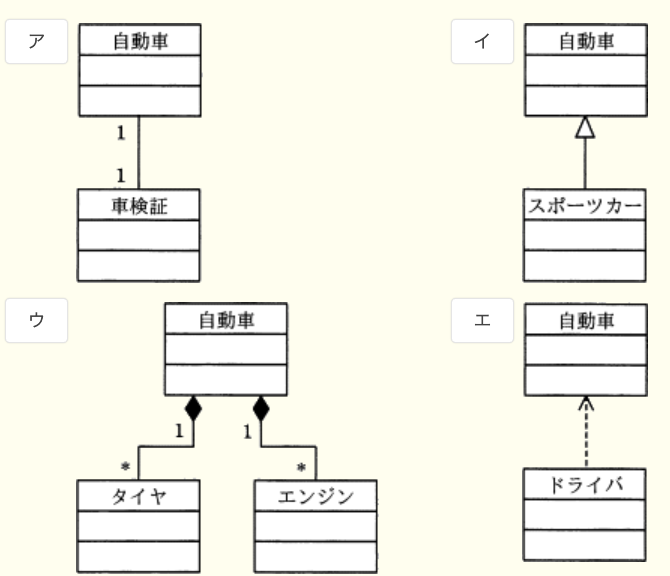
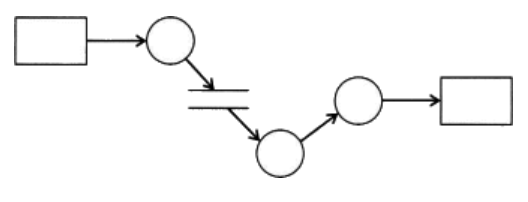
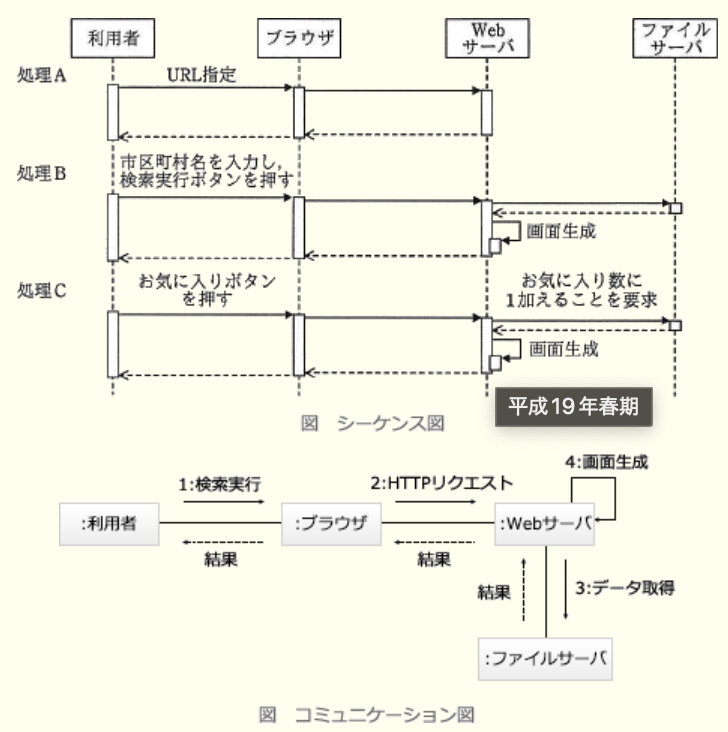
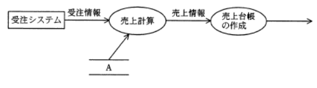
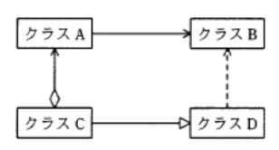
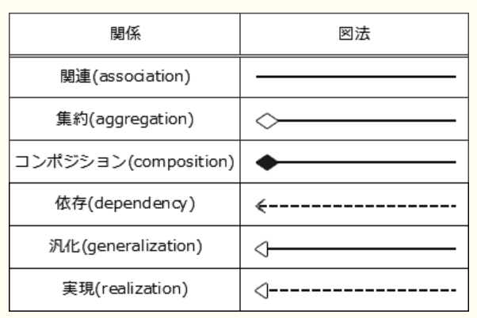
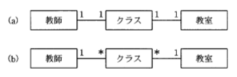

### 12.1 システム要件定義

---
1.システム開発の最初の工程で行う作業

- A.**現状の業務を分析し、システム要件を整理する**  
システム開発で最初に要件定義を実施する。現状の業務を分析し、新しいシステムに求められる機能をまとめる

- 各プログラムの内部構造を設計する  
プログラム設計で行われる作業

- サブシステムをプログラム単位まで分割し、各プログラムの詳細を設計する  
内部設計で行われる作業

- ユーザインタフェースを設計する  
外部設計で行われる作業

### 12.2システム方式設計(該当問題なし)

### 12.3 ソフトウェア要件定義

---
1.UMLのアクティビティ図の特徴

- A.**多くの並行処理を含むシステムの、オブジェクトの振る舞いが記述できる**  
ビジネスプロセスの流れやプログラムの制御フローのような一連の手続きを可視化できる図。フローチャートと似た表記法で処理の流れを記述でき、処理の分岐やマージ、並行処理のフォークやジョイン、タイマ制御や例外処理なども表現できる

- オブジェクト群がどのようにコラボレーションを行うか記述できる  
コミュニケーション図の特徴

- クラスの仕様と、クラスの間の静的な関係が記述できる  
クラス図の特徴

- システムのコンポーネント間の物理的な関係が記述できる  
コンポーネント図の特徴

---
2.UMLのユースケース図の説明

- A.**システムとアクタの相互作用を表現する**  
システムに要求される機能を利用者の視点から記述した図。主に要求分析段階でユーザの要件を特定するために作成され、システムの全体像を開発者と利用者が評価しやすくなる  
`アクタ` : システムのユーザが果たす役割を表し、システムと情報交換をしたり受動的に情報を受け取ったりする。人間、ハードウェア、外部システムがなりえる  
`ユースケース` : アクタとシステムとの相手の対話をモデル化したもので、アクタによって開始されシステムのある機能を実行する。システムのユーザがシステムを利用して遂行する単位業務の1つを抽象化したもの  
`関連` : アクタとユースケースの関連を表す実線  
`対象` : システム化対象範囲を表す長方形

- 外部からのトリガに応じて、オブジェクトの状態がどのように遷移するかを表現する  
ステートチャート図の説明

- クラスと関連から構成され、システムの静的な構造を表現する  
クラス図の説明

- データの流れに注目してシステムの機能を表現する  
DFD(*Data Flow Diagram*)の説明

---
3.UMLのクラス図のうち、汎化の関係を示したもの

- A.**イ**  
汎化 - 特化関係を示している。下位(スポーツカー)クラスは上位(自動者)クラスである、という関係を表す。汎化は、下位クラスに共通する特性を抜き出した上位クラスを定義する、下位クラスとの関係と呼び、下位クラスから上位クラスへ白抜きの矢印で表現する

- ア  
自動者と車検証が1対1で関連する多重度の関係を示している

- ウ  
黒い菱形の矢印が示すのは、分解 - 集約関係(コンポジション関連)

- エ  
破線の矢印で示されるのは、依存関係

---
4.システム開発で用いる設計技法のうち、決定表を説明したもの

- A.**条件の組合せと各組合せに対する動作とを表現したものである**  
ある事象について条件や選択肢を表形式で整理し、記述された条件・選択肢の組み合わせでどのような処理を行うべきか列挙したもの

- エンティティを長方形で表し、その関係を線で結んで表現したものである  
ER図の説明

- 外部インタフェース、プロセス、データストア間でのデータの流れを表現したものである  
DFD(*Data Flow Diagram*)の説明

- 処理や選択などの制御の流れを、直線又は矢印で表現したものである  
流れ図(フローチャート)の説明

---
5.図は構造化分析法で用いられるDFDの例である。図中の○が表しているもの

- A.**プロセス**(処理)  
DFDは、データの流れに着目して、対象となる業務のデータの流れと処理の関係を図式化する手法

- データストア  
上下の線で表す(画像中央)

- データフロー  
矢印で表す

---
6.UMLにおける振る舞い図の説明のうち、アクティビティ図のもの

- A.**ある振る舞いから次の振る舞いへの制御の流れを表現する**  
ビジネスプロセスの流れやプログラムの制御フローのような一連の手続きを可視化できる図。フローチャートと似た表記法で処理の流れを記述でき、処理の分岐やマージ、並行処理のフォークやジョイン、タイマ制御や例外処理なども表現できる

- オブジェクト間の相互作用を時系列で表現する  
シーケンス図の説明

- システムが外部に提供する機能と、それを利用する者や外部システムとの関係を表現する  
ユースケース図の説明

- 1つのオブジェクトの状態がイベントの発生や時間の経過とともにどのように変化するかを表現する  
状態遷移図の説明

---
7.UML2.0のシーケンス図とコミュニケーション図のどちらにも表現されるもの

- A.**オブジェクト間で送受信されるメッセージ**  
どちらもオブジェクト間のメッセージのやり取りを表現する図。シーケンス図は時系列に沿って表現し、コミュニケーション図はオブジェクト同士の関係の観点から表現する

- イベントとオブジェクトの状態  
状態遷移図で表現され、どちらにも表現されない

- オブジェクトがある状態にとどまる最短時間及び最長時間  
タイミング図で表現され、どちらにも表現されない

- オブジェクトがメッセージを処理している期間  
シーケンス図にだけ表現されるもの

---
8.UML2.0において、オブジェクト間の相互作用を時系列に表す図

- A.**シーケンス図**  
オブジェクト間のメッセージの流れを時系列を表す

- アクティビティ図  
システムなどのフローを記述する図

- コンポーネント図  
インターフェイスを介したコンポーネント同士の関係やコンポーネントの内容を表現する図

- 状態遷移図  
時間経過や状態変化に応じて状態が変わるようなシステムの振る舞いを記述する時に適した図式化手法

---
9.システムの外部設計を完了させる時、顧客から承認を受けるもの

- A.**画面レイアウト**  
ユーザからのシステム要件をもとにシステムの機能を確定する作業工程。ユーザの立場からみた業務機能を中心に設計を行うことが目的で、サブシステムの定義と機能分割、論理データモデル設計、画面・帳票・コードの設計などが実施される

- システム開発計画  
企画段階や基本計画で実施される

- 物理DB仕様  
内部設計で実施される。外部設計の要件をコンピュータ・システム上で効率よく動作させるためのシステム開発側の視点で設計が行われる

- プログラム流れ図  
プログラム設計で実施される。プログラムの内部構造の詳細設計が行われる

---
14.UMLのダイアグラムのうち、インスタンス間の関係を表現するもの

- A.**オブジェクト図**  
ある特定の時点でのオブジェクトのインスタンス間の静的な構造を記述する図

- アクティビティ図  
上流工程のビジネスプロセスの流れや下流工程のプログラムの制御フローを表すことができる図

- コンポーネント図  
インターフェイスを介したコンポーネント同士の関係やコンポーネントの内容を表現する図

- ユースケース図  
システムの振る舞いを表現する図で、システムに要求される機能をユーザ視点から示した図

---
16.ER図で表せるもの

- A.**エンティティ間の関連**  
DB化の対象となる実体(エンティティ)と実体の持つ属性(アトリビュート)、実体間の関連(リレーションシップ)を表現する図。任意のオブジェクトと関連でデータモデル化でき、特に関係DBの設計によく利用されている

---
17.DFD表記方法

- A.**矢印には、データを現す名前を付ける**  
行き先に向かって流れていくデータの名前をつける

- 2本の平行線は同期を意味し、名前は付けない  
データストアを意味し、データを蓄積するファイルの名前をつける。同期を意味するのは、アルゴリズムの流れ図の場合

- 円には、データを蓄積するファイルの名前を付ける  
プロセスを意味し、データ変換や加工が行われる処理の名前をつける

- 四角には、入力画面や帳票を現す名前を付ける  
データの源泉や行き先を示し、対象の名前をつける

---
20.UML2.0で定義している図のうち、動的な振る舞いを表現するもの

- A.**シーケンス図**  
オブジェクト間のメッセージの流れを時系列的に表現する図。メッセージのやり取りによってシステムがどのように遷移するか、システムの動的な部分を表現できる

- オブジェクト図  
クラスを実体化して生成されたオブジェクト同士の関係を表現する図

- クラス図  
クラス間の静的な関係を現す

- パッケージ図  
パッケージ同士の依存関係を描画することで論理的なグルーピングをするための図で、クラス図の一部

---
22.システム開発の外部設計工程で行う作業

- A.**論理データ設計**  
ユーザから見たシステム要件をもとにシステムの機能を確定する作業工程。ユーザの立場から見た業務機能を中心に行うことが目的で、作業工程の1つとして使用するコード体系を決定するなどの論理データ設計が含まれている続く内部設計では、外部設計の要件をコンピュータ・システム上で効率よく動作させるかというシステム開発側の視点で設計が行われる

- 物理データ設計  
内部設計工程で行う作業

- プログラム構造化設計  
プログラム設計工程で行う作業

- 要求分析  
要件定義工程で行う作業

---
23.図に示す売上管理システムのDFDの中で、Aに該当する項目

- A.**単価ファイル**  
データストアは、データやファイルを保管する場所(多くはDB)を意味している。データストアAから売上計算に矢印が伸びているため、受注システムからの受注情報とデータストアAから読み出したデータを使用して売上計算を行うという業務の流れとなる。売上高は、受注個数 * 単価で計算される

---
24.外部設計、内部設計の説明

- A.**外部設計ではデータ項目を洗い出して論理データ構造を決定し、内部設計では物理データ構造、データの処理方式やチェック方式などを決定する**  
`外部設計` : ユーザからのシステム要件をもとにシステムの機能を確定する作業工程。サブシステムの低ごと機能分割、論理データモデル設計、画面・帳票・コードの設計などが実装される  
`内部設計` : 外部設計の要件をコンピュータまたはシステム上で効率よく動作させるか、システム開発側の視点で行われる設計工程。昨日のプログラム単位への割り振り、物理データ設計、入出力画面・帳票への出力条件・チェック条件の詳細化、内部処理の詳細設計などが実施される

- 外部設計ではシステムを幾つかのプログラムに分割し、内部設計ではプログラムごとのDFDを作成する  
外部設計でDFDなどでシステムを幾つかのサブシステムに分割し、内部設計ではサブシステムをプログラム単位に分割する

- 外部設計と内部設計の遂行順序は、基本計画におけるユーザの要求に基づいて決定される  
内部設計は、外部設計の成果物を基に行うので、外部 → 内部の遂行順序は常に同じ

- 外部設計はコンピュータ側から見たシステム設計であり、内部設計はユーザ側から見たシステム設計である  
外部設計はユーザ側から見たシステム設計、内部設計はコンピュータ側から見たシステム設計

---
25.外部設計工程の論理データ設計で行うべき作業項目

- A.**データ項目の洗い出しとデータ構造の決定**  
ユーザからのシステム要件をもとにシステムの機能を確定する作業工程。ユーザの立場からみた業務機能を中心に設計を行うことが目的で、サブシステムの定義と機能分割、論理データモデル設計、画面・帳票・コードの設計などが実施される

- データファイル編成と媒体の決定
- データへのアクセス時間とデータファイルの容量の見積り
- データレコードのレイアウト決定  
全て内部設計で行う

---
26.OMGが標準化したUML

- A.**オブジェクト指向を用いたソフトウェア開発で使用されるモデリング言語**  
オブジェクト指向開発で用いられる標準表記法群で、オブジェクト間の関連や動作・構成を表現する13種の図表から構成される。UML2.0の13の図法は表現する対象によって構成図、振る舞い図に分類される  
`構成図` : システムの静的な構造をモデルで表現する。クラス図、コンポジット構成図、コンポーネント図、配置図、オブジェクト図、パッケージ図  
`振る舞い図` : システムの振る舞いをモデルで表現する。アクティビティ図、ユースケース図、シーケンス図、インタラクション概念図、コラボレーション図、タイミング図、ステートマシン図

- オブジェクトをほかのプログラムから利用するためのインタフェースの記述言語  
COBRA(*Cost estimation, Benchmarking and Risk Assessment*)の説明

- 表の定義やデータ操作などを行う関係DBの操作言語  
SQLの説明

---
28.UMLのクラス図において、集約の関係にあるクラス

- A.**クラスAとクラスC**  
クラス図においてクラス間の関係は下記の通り

---
29.UML(*Unified Modeling Language*)が定義する図のうち、オブジェクト間の相互作用を表現するためのもの

- A.**シーケンス図**  
オブジェクト間のメッセージのやり取りなどのオブジェクトの振る舞いを時系列に表す図

- オブジェクト図  
ある特定の時点でのオブジェクトのインスタンス間の静的な構造を記述する図

- クラス図  
クラス、属性、クラス間の関係から、システムの構造を記述する静的な構造図

- コンポーネント図  
インターフェイスを介したコンポーネント同士の関係やコンポーネントの内容を表現する図

---
30.学校における教師、クラス、教室の3つのエンティティの関係を表すER図について考える。2つのER図の読み方で適切なもの

- A.**aでは教師の担当できるクラスは1つだけであるが、bでは複数のクラスを担当することがある**  
bでは、1教師が複数のクラスに対応している

- aでは教師か教室を決めるとクラスが決まるが、bでは教師と教室を決めるとクラスが決まる  
教師と教室を決めてもクラスは設定しない。1教室を複数のクラスが使い、1教師が複数のクラスを受け持つ場合、教室と教師が決まってもクラスは決定されない

- aでは1つのクラスには常に同じ教室が割り当てられるが、bでは1つのクラスに複数の教室が割り当てられることがある  
bではクラスから見た教室の多重度が1なので、クラスごとに1教室を使用する

- aでは1つのクラスは常に1人の教師が担当するが、bでは1つのクラスを複数の教師で担当することがある
bではクラスから見た教師の多重度が1なので、1クラスは1教師が担当する

---
32.オブジェクト指向によるシステム開発で利用され、分析から設計、実装、テストまで統一した表記法

- A.**UML**(*Unified Modeling Language*)  
オブジェクト指向開発で用いられる標準表記法群で、オブジェクト間の関連や動作・構成を表現する13種の図表から構成されている

- EAI(*Enterprise Application Integration*)  
企業内における多種多様なコンピュータシステム群を連携させ、データやビジネうプロセスを効率的に統合する機能やそれらを行うミドルウェア・アプリケーションのこと

- EJB(*Enterprise JavaBeans*)  
JavaBeansをサーバサイドで実現する技術仕様

- ERP(*Enterprises Resource Planning*)  
企業全体の経営資源を有効かつ統合的に計画管理し、経営の効率化を図るための手法

### 12.4 ソフトウェア方式設計・詳細設計

---
1.オブジェクト指向の特徴

- A.**継承という概念によって、モデルの拡張や変更の際に変更箇所を局所化できる**  
下位クラスを作成する時に、継承によって上位クラスの機能や性質を引き継ぐことができる。上位クラスでの変更は自動的に下位クラスに適用されるので、継承を使わずに別個のクラスを定義する場合と比較して、変更の際に変更する箇所を少なくできる  
`カプセル化(情報隠蔽)` : オブジェクトの内部を外部から見えないようにしてブラックボックス化する  
`継承(インヘリタンス)` : あるクラスが上位クラスの特性を引き継いでいる関係のこと。上位の特性を引き継げることで差分プログラミングが可能となる  
`多態性(ポリモルフィズム)` : オブジェクトの操作呼び出しが、受け手側の特性で決まること。同じメッセージを送っても受け手のオブジェクトによって行われる操作が異なる様子を表す

- オブジェクト指向では、抽象化の対象となるオブジェクトに対する操作をあらかじめ指定しなければならない  
抽象クラスでは、複数のクラスに共通するメソッドの名前や引数などのみ(実際の処理内容を含まない)を定義できる(抽象メソッド)

- カプセル化によって、オブジェクト間の相互依存性を高めることができる  
カプセル化によってデータと手続きをオブジェクト内部にまとめることで、独立性が高くなる。結果、オブジェクト間の相互依存性を低くできる

- クラスの変更を行う場合には、そのクラスの上位にあるすべてのクラスの変更が必要となる  
下位クラスが独自に定義した変数や手続きは上位クラスに影響を与えないので、上位クラスを変更する必要はない

---
5.オブジェクト指向言語のクラスに関する記述

- A.**オブジェクトに共通する性質を定義したものがクラスであり、クラスを集めたものがクラスライブラリである**  
クラスライブラリは、関連する機能を提供する複数のクラスをひとまとまりにしたもの

- インスタンス変数には共有データが保存されているので、クラス全体で使用できる  
インスタンス変数は型であるクラスをもとにして作成したオブジェクトの実体。他のインスタンス変数と共有されるデータはクラスに定義され、インスタンス変数にはオブジェクトごとの個別データが保存される

- オブジェクトはクラスによって定義され、クラスにはメソッドと呼ばれる共有データが保存されている  
クラスで定義され、同一クラスと派生クラスで共有されるデータはクラス変数。プログラミング言語によっては静的フィールド、静的メンバ変数とも呼ばれる

- スーパークラスはサブクラスから独立して定義し、サブクラスの性質を継承する  
サブクラスはスーパークラスの性質を継承して定義する。スーパークラスが親クラス、サブクラスが子クラスに相当する

---
7.オブジェクト指向におけるクラスとインスタンスの関係

- A.**クラスの定義に基づいてインスタンスが生成される**  
クラスはオブジェクトの定義情報、インスタンスはクラスの定義情報を用いて生成された具体的なデータをもつ実体。クラスは定義情報をもち、1つのクラスから異なる値の複数のインスタンスが生成できる

- インスタンスはクラスの仕様を定義したものである  
クラスが、インスタンスの仕様を定義したもの

- 1つのインスタンスに対して、複数のクラスが対応する  
1つのインスタンスは、クラスの仕様を表す唯一のクラスと関連付けられる

- 1つのクラスに対して、インスタンスはただ1つ存在する  
1つのクラスから、複数のインスタンスを生成できる

---
9.オブジェクト指向における"委譲"(デリゲーション)

- A.**あるオブジェクトに対する操作をその内部で他のオブジェクトに依頼する仕組み**  
オブジェクトに依頼されたメッセージの処理を、他のオブジェクトに委ねること

- あるオブジェクトに対して操作を適用した時、関連するオブジェクトに対してもその操作が自動的に適用される仕組み  
伝搬(プロパゲーション)の説明

- 下位のクラスが上位のクラスの属性や操作を引き継ぐ仕組み  
継承(インヘリタンス)の説明

- 複数のオブジェクトを部分として用いて、新たな1つのオブジェクトを生成する仕組み  
合成(コンポジション)の説明

---
10.オブジェクト指向における、あるクラスの属性や機能がサブクラスで利用できること

- A.**継承**(インヘリタンス)  
上位クラスで定義されたデータ構造と手続きを、下位クラスが引き継いで使える特性のこと

- オーバーライド  
上位クラスで定義されたメソッド(メンバ関数)を、下位クラス側の役割に応じて再定義し動作を変更すること

- カプセル化  
オブジェクト内の詳細な仕様や構造を外部から隠蔽すること

- 多相性  
オブジェクトの操作呼び出しが、呼び出し側でなく受け手側の特性で決まる特性。同じメッセージを送っても受け手のオブジェクトによって行われる操作が異なる様子を表す

---
11.開発プロセスにおいて、ソフトウェア方式設計で行うべき作業

- A.**ソフトウェア品目に対する要件を、最上位レベルの構造を表現する方式であって、かつソフトウェアコンポーネントを識別する方式に変換する**  
ソフトウェアで実現する要件をソフトウェア方式に変換し、要件を達成するために必要なソフトウェア部品を定義する  
開発プロセスの設計部分は、`システム用件定義 → システム方式設計 → ソフトウェア要件定義 → ソフトウェア方式設計 → ソフトウェア詳細設計`の順に行われる

- 顧客に意見を求めて仕様を決定する  
要件定義プロセスで行う作業

- プログラムを、コード化した1行ごとの処理まで明確になるように詳細化する  
ソフトウェアコード作成で行う作業

- 要求内容を図表などの形式でまとめ、段階的に詳細化して分析する  
ソフトウェア詳細設計で行う

---
14.ソフトウェアのレビュー方法のインスペクション(*Inspection*)の説明

- A.**モデレータが全体のコーディネートを行い、参加者が明確な役割をもってチェックリストなどに基づいたコメントをし、正式な記録を残す**  
事前に役割を決められた参加者が責任のある第三者(モデレータ)の下で成果物を確認公式なレビュー技法。モデレータ、オーナー、インスペクター、プレゼンタ、スクライブなどの役割をもつ。参加者の役割が明確・チェックリストなど形式的な文書に基づいて実施・レビュー記録を正式な形で残す特徴がある

- 作成者を含めた複数人の関係者が参加して会議形式で行う。レビュー対象となる成果物を作成者が説明し、参加者が質問やコメントをする  
ウォークスルーの説明

- 参加者が順番に司会者とレビュアになる。司会者の進行によって、レビュア全員が順番にコメントをし、全員が発言したら、司会者を交代して次のテーマに移る  
ラウンドロビンの説明

- レビュー対象となる成果物を複数のレビュアに配布又は回覧して、レビュアがコメントをする  
パスアラウンドの説明

---
15.オブジェクト指向の基本概念

- A.**抽象化, カプセル化, 継承, クラス**  
システムの構築や設計で、システムの構成を処理や操作の対象となるもの(オブジェクト)同士のやり取りの関係として捉える考え方。データと手続きをひとまとまりにしてカプセル化することで実現する  
`抽象化` : 実体としてオブジェクト群から共通する性質・要素・動作を引き出して、事実を包括する概念を定義する  
`具体化` : 一般化されたクラスに、実態が持つ固有の性質・要素・動作を加えることで、実体に特化した概念を定義すること  
`カプセル化` : データ(属性)とデータに対する手続きを1つにまとめること。カプセルのようにオブジェクトの内部を隠蔽することで、使う人に内部の情報を知られずにオブジェクトを扱うことができる  
`継承` : 上位クラスをもとに下位クラスを定義する時、下位クラスに上位クラスの属性が引き継がれる性質  
`クラス` : いくつかの似ているオブジェクトに共通する性質を抜き出して、属性・手続きを一般化(抽象化)して新しく定義したもの  
`多様性` : オブジェクトへの操作呼び出しが、呼び出し側でなく受け手側の特性で決まる特性。同じメッセージを送っても受け手のオブジェクトによって行われる操作が異なる様子を表す

---
20.多相性を実現する時に、特有のもの

- A.**オーバライド**(*Override*)  
上位クラスで定義されたメソッド(メンバ関数)を、下位クラスの役割に応じて再定義すること。同じメッセージを送ってもオブジェクトごとに異なる操作が行われる特性である、多相性を実現している

- カプセル化  
データ(属性)とデータに対する手続きを1つにまとめてブラックボックス化すること

- 多重継承  
新たなクラスを作る際に複数のクラスから継承すること

- メッセージバッシング  
オブジェクトにメッセージを伝達すること

---
22.要求の分析・設計時に使用する、状態遷移図の説明

- A.**時間の経過や制御信号の変化などの、状態を変化させるきっかけと、変化を伴って実行する動作を記述する**  
時間経過や状態の変化に応じて状態が変わるようなシステムの振る舞いを記述する時に適した図式化手法。プロセス制御などの事象駆動(イベントドリブン)による処理の仕様を表現する時に適している

- 階層構造の形でプログラムの全体構造を記述する  
プログラム構造図の説明

- システムの機能を概要から詳細へと段階的に記述する  
システム設計図の説明

- 処理間のデータの流れをデータフロー、処理、データストア、外部の4つの記号で記述する  
DFD(*Data Flow Diagram*)の説明

---
23.ソフトウェアの分析・設計技法の特徴のうち、データ中心分析・設計技法(*Data Oriented Approach*)の特徴

- A.**対象業務領域のモデル化に当たって、情報資源のデータ構造に着目する**  
対象業務領域をモデル化する際に情報資源のデータ構造に着目することで、データの一貫性と整合性を確保しやすくなる  
プログラムとデータは独立したものと考え、データを中心に据えてシステム / ソフトウェアの設計を行う手法。ER図などで対象世界をモデル化し、それに基づいてデータ構造などを決め、プログラムは共通のデータを操作するものとして設計する  
データ構造は業務プロセスやビジネスロジックなどより時間や周りの変化の影響が少なく安定している。データ構造を基盤にシステム / ソフトウェアを設計することで、プロセス中心アプローチと比較し、柔軟性があり長期的な安定性を確保できる

- 機能の詳細化の過程で、モジュールの独立性が高くなるようにプログラムを分割していく  
オブジェクト指向アプローチの特徴

- システムの開発後の仕様変更は、データ構造や手続を局所的に変更したり追加したりすることによって、比較的容易に実現できる  
データを中心に設計するため、データ構造の変更を伴う仕様変更は難しくなる

- プログラムが最も効率よくアクセスできるようにデータ構造を設計する  
情報の局所参照性を考えた設計手法

---
24.オブジェクト指向開発において、オブジェクトのもつ振る舞いを記述したもの

- A.**メソッド**  
オブジェクトが持つ操作・機能に相当し、オブジェクトが特定のメッセージを受け取った時の振る舞いが記述される

- インスタンス  
型であるクラスをもとに、属性やメソッドに具体値を設定して作成した、オブジェクトの実体

- クラス  
オブジェクトに共通するデータ属性とメソッドをカプセル化した定義

- 属性  
オブジェクトがもつ文字列や数値のようなデータのこと

---
27.オブジェクト指向プログラミングの特徴

- A.**オブジェクトが相互にメッセージを送ることによって、協調して動作し、プログラム全体の機能を実現する**  
システムの構築の設計で、処理や対象の対象となるもの(オブジェクト)同士のやり取りの関係としてシステムを捉える考え方。データと手続きをひとまとめにしてカプセル化することで実現し、カプセル化、継承、多態性などの特徴をもっている

- オブジェクトの外部からオブジェクトの内部のデータを直接変更できるので、自由度が高い  
オブジェクト内部はブラックボックス化されている。外部からのアクセスは公開された性質を参照することで、間接的にオブジェクト内部を変更する

- 下位クラスは上位クラスの機能や性質を引き継ぐので、下位クラスに必要な性質は全て上位クラスに含まれる  
下位クラス独自の性質は、上位クラスに含まれない

- 個々のオブジェクトが使用するデータ(属性)は、あらかじめデータ辞書に登録しておく  
データとメソッドはオブジェクト内部に記述されている

---
28.モジュール設計書を基にモジュール強度を評価した際の適切な評価  
・モジュール設計書(抜粋)  
上位モジュールから渡される処理コードに対応した処理をする。処理コードが"I"の時は挿入処理、"U"の時は更新処理、"D"の時は削除処理

- A.**これは"論理的強度"のモジュールである。関連した幾つかの機能を含み、パラメータによっていずれかの機能を選択して実行している。現状では大きな問題となっていないとしても、仕様変更に伴うパラメータの変更による影響を最小限に抑えるために、機能ごとにモジュールを分割するか、機能ごとの入口点を設ける方がよい**  
モジュール内部の関連性の強さを表し、モジュール強度が高いほど他の影響を受けにくくなり再利用や拡張がしやすくなり、低いほど修正時に影響を受けやすい。1つのモジュールに挿入・更新・削除処理を行う機能を含み、処理コード(パラメータ)によって機能を選択して実行している。3機能は上位モジュールのデータに対していずれかの処理を行う意味で関連があるため、論理的強度となる  
`暗号的強度(低)` : 関係のない機能をまとめたモジュール  
`論理的強度` : 関連する複数の機能をまとめたモジュール  
`時間的強度` : プログラムの開始時など、特定の時期に実行する機能をまとめたモジュール  
`手順的強度` : 関連ある逐次的な機能をまとめたモジュール  
`連絡的強度` : 関連ある逐次的な機能で要素が連絡し合うものをまとめたモジュール  
`情報的強度` : 同じデータ構造や資源を扱う機能を1つにまとめたモジュール  
`機能的強度(高)` : 1機能を実現するためだけのモジュール

---
30.設計上の誤りを早期に発見することを目的として、作成者と複数の関係者が設計書をレビューする方法

- A.**ウォークスルー**  
設計上の誤りを早期に発見することを目的として、各工程の終了時点で、作成者を含めた複数の関係者が設計書やソースコードを検査するデザインレビューの手法。原則管理者には参加させない、誤りの発見を目的としその場で解決策を議論しない、事前に資料を配布し短時間で効率よく行うなどの特徴がある

- 机上デバッグ  
紙面に印刷したコードを見ながら人力で誤りを探り取り除く手法

- トップダウンテスト  
結合テストの時に上位のモジュールから下位のモジュールへと順に結合しながらテストをする手法

- 並行シミュレーション  
別途用意したテスト用のプログラムと検証対象のプログラムに同じデータを入力して出力値を比較する手法

---
32.オブジェクト指向において、属性と振る舞いを1つにまとめた構造にすること

- A.**カプセル化**  
オブジェクトの独立性を高めるため、内部をブラックボックス化する。オブジェクトのデータとそれに対応する操作をセットで定義し、外部からは特定の手続きだけの使用する許すことで実現する。オブジェクト内部の仕様変更があっても使う人は気にせず以前と同様にオブジェクトを扱える

- クラス化  
いくつかのオブジェクトに共通する性質や手続きを抜き出し、一般化したオブジェクトの定義情報

- 集約化
- 汎化  
クラス間の関係を表す。上位クラスを構成する下位クラスをまとめることは集約、下位クラスに共通する属性をまとめて上位クラスを定義することは汎化

---
34.オブジェクト指向におけるクラス間の関係

- A.**サブクラスではスーパークラスの操作を再定義することができる**  
スーパークラスで定義された操作はサブクラスに継承されるが、サブクラスではスーパークラスから継承した操作を再定義できる(オーバライド)

- クラス間の関連は、2つのクラス間でだけ定義できる  
関連・汎化・集約・コンポジション・実現・依存の6つの関連がある。2つのクラス間に限られず、1クラスが複数のクラスと関係を持つことが可能で、1つのスーパークラス(親クラス・基底クラス)に対して複数のサブクラス(子クラス・派生クラス)が存在することもある

- サブクラスのインスタンスが、スーパークラスで定義されている操作を実行するときは、スーパークラスのインスタンスに操作を依頼する  
サブクラスのインスタンスを作成する際は、親クラスのコンストラクタが呼ばれ、子クラスのコンストラクタが呼ばれる。そのため、サブクラスのインスタンスはスーパークラスで定義されている操作を自身の操作として実行できる

- 2つのクラスに集約の関係がある時には、集約オブジェクトは部品オブジェクトの属性と操作を共有する  
集約は全体と部分の関係を表す。2つのクラスに集約の関係がある時には、部品オブジェクトは集約オブジェクトの構成要素でしかないので、汎化関係と異なり属性と操作は共有しない

---
35.オブジェクト指向でシステムを開発する場合のカプセル化の効果

- A.**オブジェクトの内部データ構造やメソッドの実装を変更しても、ほかのオブジェクトがその影響を受けにくい**  
データ(属性)とデータに対する手続きを1つにまとめる。オブジェクトの内部を隠蔽することで、内部の情報を知らなくてもオブジェクトを扱うことができる。オブジェクトの内部を変更しても、それを扱う他のオブジェクトは、同一の命令で期待する操作を行うことが可能

- 既存の型に加えてユーザー定義型を追加できるので、問題領域に合わせてプログラムの仕様を拡張できる  
オブジェクト指向に限らず、手続き型言語でもユーザ定義型の追加は可能

- 子クラスとして派生するので、親クラスの属性を子クラスが利用できる  
継承(インヘリタンス)による効果

- 同一メッセージを送っても、受け手のオブジェクトによって、それぞれが異なる動作をするので、メッセージを受け取るオブジェクトの種類が増えても、メッセージを送るオブジェクトには影響がない  
多態性(ポリモルフィズム)の効果

---
36.開発プロセスにおける、ソフトウェア方式設計で行うべき作業

- A.**既に決定しているソフトウェア要件を、どのように実現させるかを決める**  
ソフトウェアで実現する要件をソフトウェア方式に変換し、要件を達成するために必要なソフトウェア部品を定義するアクティビティ。`ソフトウェア構造とコンポーネントの方式設計`・`外部、コンポーネント間の各インタフェースの方式設計`・`DBの最上位レベルでの設計`・`利用者文書(暫定版)の作成`・`ソフトウェア結合のためのテスト要求事項の定義`・`ソフトウェア方式設計の評価`・`ソフトウェア方式設計の共同レビューの実施`の7点が行われる

---
40.モジュールの独立性を高めるには、モジュール結合度を弱くする必要がある。モジュール受け渡し方法のうち、モジュール結合が最も弱いもの

- A.**データ項目だけをモジュール間の引数として渡す**  
データ結合。モジュール結合度が弱いほど別モジュールの変更の影響を受けにくくなり保守性は向上する。モジュール結合度が弱いほどモジュールの独立性は高い。モジュール結合度が弱い方から順に`データ結合 > スタンプ結合 > 制御結合 > 外部結合 > 共通結合 > 内部結合`

- 共通域に定義したデータを、関係するモジュールが参照する  
共通結合

- 制御パラメータを引数として渡し、モジュールの実行順序を制御する  
制御結合

- 必要なデータを外部宣言して共有する  
外部結合

---
41.ホワイトボックステストのテストデータを作成する時の注目点

- A.**プログラムのアルゴリズムなどの内部構造**  
プログラムやモジュールの単体テストとして実施されるテスト手法で、内部構造に基づき仕様書通りに動作するか検証するために実施される(内部構造が明らかな状態でテストを行う)

- 同値分割法を適用して得られた同値クラスごとの境界値  
同値分割法はブラックボックステストのテストデータを作成する時の手法

- プログラムの機能  
システム規格性確認テスト(システムテスト)での注目点

- プログラムの入力と出力の関係  
ブラックボックステストでの注目点

---
42.デザインレビューを実施する狙い

- A.**仕様の不備や誤りを早期に発見し、手戻り工数の削減を図る**  

---
45.UMLのクラス図に記述するもの

- A.**操作, 属性, ロール名**  

- アクティベーション, オブジェクト, ライフライン  

- オブジェクト, メッセージフロー, リンク  

- 初期状態, 終了状態, 遷移  
