### 9.1 データベース方式

---
1.関係モデルとその実装である関係DBの対応に関する記述

- A.**関係は、表に対応付けられる**  
関係モデルはデータの関係を数学的な集合論と述語論によって表現するモデルで、関係DBは関係モデルをコンピュータ上で実装したもの

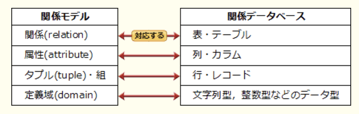

- 属性も列も、左から右に順序付けられる  
関係モデルは数学的モデルなので属性には順序の概念はないが、関係DBはデータを2次元の表で管理するため列順が生じる

- タプルも行も、ともに重複しない  
関係モデルのタプルは重複を許さないが、関係DBの場合は関係演算の結果によっては重複行が生じることがある

- 定義域(ドメイン)は、文字型又は文字列型に対応付けられる  
値の取り得る範囲・形式を制限するデータ型に対応する

---
2.関係モデルの属性に関する説明

- A.**関係内の属性の並び順に意味はなく、順番を入れ替えても同じ関係である**  
関係DBにおいて、関係は表、属性は列(カラム)、組(タプル)は行(レコード)に対応する。属性の並び・組の並びに意味はない。並び順が変わっても関係は変わらない

- 関係内の属性の定義域は重複してはならない  
属性が取り得る値の集合のことで、データ型と同じ意味でドメインとも呼ぶ。関係内の2つの属性に整数型などの同じ定義域を設定することを考えると、定義域の重複は問題にならない

- 関係内の2つ以上の属性に、同じ名前を付けることができる  
属性に付ける名前は関係内で一意でなければならない

- 名前をもたない属性を定義することができる  
属性には名前を付けなければならない

---
5.DBMSにおいて、スキーマ(*schema*)を決める機能

- A.**定義機能**  
データの内容・論理構造、記憶形式や編成などDBの構造を記述したもの

- 機密保護機能  
ユーザ認証、アクセス権限、利用ログの記録、暗号化などによってデータを安全に保つ機能

- 障害回復機能  
ロールバック、ロールフォワード、チェックポイント、更新前 / 更新後ログの記録などによってDBを生涯から回復する機能

- 保全機能  
排他制御や参照制約、表制約などによってデータの完全性を保つ機能

---
6.DBMSが3層スキーマアーキテクチャを採用する目的

- A.**データの物理的な格納構造を変更しても、アプリケーションプログラムに影響が及ばないようにする**  
`概念スキーマ` : DB化対象の業務とデータの内容を論理的な構造として記述したもの。関係モデルではER図の作成、表定義、表の正規化が該当する  
`外部スキーマ` : データの利用者からの見方を記述したもの。SQLのビューが外部スキーマに該当する  
`内部スキーマ` : データを記憶装置上にどのような形式で格納するかを記述したもの。ファイル編成やインデックスの設定などが該当する

- 関係演算によって元の表から新たな表を導出し、それが実在しているように見せる  
ビューの目的

- 対話的に使われるSQL文を、アプリケーションプログラムからも使えるようにする  
カーソル操作の目的

- プログラム言語を限定して、アプリケーションプログラムとDBMSを緊密に結合する  
緊密ではなく、分離する目的がある

---
7.DBMSが受け付けたクエリを実行するまでの処理の流れにおいて、該当する処理の組み合わせ

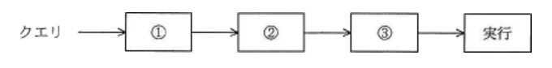

- A.**構文解析, 最適化, コード生成**  
`構文解析` : パーサが受け付けたSQLクエリを解析し、内容を解釈する  
`最適化` : クエリを最も効率よく実行できる方法を検討し決定する  
`コード生成` : 決定された方法でDBにアクセスするためのコードを生成する

---
8.SQL文を実行する際に、効率が良いと考えられるアクセス経路を選択する関係DB管理システム(RDBMS)の機能

- A.**オプティマイザ**(*Optimizer*)  
SQL文に対する結果は1つでも、RDBMSの内部ではインデックスの使用有無、結合の順番などからいくつかの実行方法が考えられる。SQL文を処理するために考えられる実行計画を全て検証し、最も効率が良いと予想される実行計画の決定を行う。更に最適な実行方法を決める基準には、アクセスパスに対して付けられた優先順位をもとに選択する`ルールベース`、アクセスする表やインデックスの統計情報をもとに見積もられたコストをもとに計算する`コストベース`の2種類がある

---
9.関係DB(*RelationalDataBase*)のデータ構造の説明

- A.**データを2次元の表によって表現する**  
データ構造を平坦な2次元の表で定義する。表をテーブル、行をレコード(タプル)、列をカラム(フィールド)と呼び、複数の表の関連は主キー同士または主キーと外部キーによって行われる

- 親レコードと子レコードをポインタで結合する  
木構造を使ってデータ構造を表す階層型DBの説明

- タグを用いてデータの構造と意味を表す  
SGMLやHTMLなどのマークアップ言語の説明

- データと手続を一体化(カプセル化)してもつ  
オブジェクト指向におけるクラスの説明

---
11.関係DBの説明

- A.**データを表として表現する。表間は相互の表中の列の値を用いて関連付けられる**

- 属性単位に、属性値とその値をもつレコード格納位置を組にして表現する。索引として利用される  
DBのアクセス効率を向上させるために使用される、インデックスの説明

- レコード間の関係を、ポインタを用いたデータ構造で表現する。木構造の表現に制限される  
階層型DBの説明

- レコード間の関係を、リンクを用いたデータ構造で表現する。木構造や網構造も表現できる  
ネットワーク型DBの説明

---
13.DBを記録媒体にどのように格納するか記述したもの

- A.**内部スキーマ**  
データを記憶装置上にどのような形式で格納するかを記述したもの。`ファイル編成やインデックスの設定`などが該当する

- 概念スキーマ  
DB化対象の業務とデータの内容を論理的な構造として記述したもの。関係モデルではER図の作成、表定義、表の正規化が該当する

- 外部スキーマ(サブスキーマ)  
データの利用者からの見方を記述したもの。SQLのビューが外部スキーマに該当する

---
14.関係データモデルにおいて、属性が取り得る値の集合を意味する用語

- A.**定義域**(*domain*)  
属性がもつデータ型と同じ意味。基本となる整数、文字列、日付等の他に列挙値や非負の整数などを定義域として設定できる。独自のドメインを定義するにはSQLの`create domain`文を使う

- 関係(リレーション)  
表同士の関連を意味する

- 実現値  
レコードや表に格納される個々のデータを意味する

- タプル(組)  
リレーショナルDBにおけるレコード・行を意味する

---
15.データモデルにおいて、データの関係を木構造で表すもの

- A.**階層モデル**  
木構造(階層構造)で表現する

- ERモデル  
実体(エンティティ)と実体のもつ属性(アトリビュート)、実体間の関連(リレーションシップ)を実現する図

- 関係モデル  
データを2次元の表で実現する

- ネットワークモデル  
親(子)レコードがそれぞれ複数のリンクをもち、多対多の関係を網状に表現できる

### 9.2 データベース設計

---
1.関係DBの主キーの性質

- A.**1つの表の中に、主キーの値が同じ行が複数存在することはない**  
一意性制約を説明している。表中の行を一意に識別できる性質を保持するため、主キーの値が同じ行が複数存在することはできない。主キーには非NULL制約も課される

- 主キーとした列に対して検索条件を指定しなければ、行の検索はできない  
主キー以外の列の値を使った検索もできる

- 数値型の列を主キーに指定すると、その列は算術演算の対象としては使えない  
主キー列を集計関数等で計算の対象とすることもできる

- 複数の列からなる主キーを構成することはできない  
1つの属性だけで行の特定ができない場合、複数の属性を組み合わせて複合主キーとすることがある

---
5.関係"注文記録"の属性間に関数従属性があり、それに基づいて第3正規形まで正規化を行って、"商品"、"顧客"、"注文"、"注文明細"の各関係に分解した。関係"注文明細"として、適切なものはどれか。{X, Y} は、属性XとYの組みを表し、X → Yは、XがYを関数的に決定することを表す。実線の下線は主キーを表す  
`注文記録` {注文記録, 注文日, 顧客番号, 顧客名, 商品番号, 商品名, 数量, 販売単価}  
`関係従属性`  
注文番号 → 注文日  
注文番号 → 顧客番号  
顧客番号 → 顧客名  
{注文番号, 商品番号} → 数量  
{注文番号, 商品番号} → 販売単価  
商品番号 → 商品名

- A.**注文明細(<u>注文番号</u>, <u>商品番号</u>, 数量, 販売単価)**

---
6.どこまで正規化された表か

|従業員番号|氏名|入社年|職位|職位手当|
|--------|---|------|---|-------|
|12345|情報 太郎|1991|部長|90,000|
|12346|処理 太郎|2005|課長|50,000|
|12347|技術 三郎|2007|課長|50,000|

- A.**第2正規形**  
主キーの一部だけで一意に決まる属性を別表に分離した状態(部分関数従属がない)。主キーは単一の属性値で部分関数従属がないため満たしている

- 第1正規形  
各データのキーが設定され、属性に繰り返し項目がない状態。属性の値として繰り返す項目がないため満たしている。

- 第3正規形  
主キー以外の属性によって一意に決まる属性を別表に分離した状態(推移関数従属が存在しない)。職位が決まれば職位手当は一意に決まるという従属関係があり、この関係を別表に分離しなければならない

---
9.データ項目の命名規約を設ける場合、次の命名規則だけでは回避できない事象  
1.データ項目名の末尾には必ず"名"、"コード"、"数"、"金額"、"年月日"などの区分語を付与し、区分語ごとに定めたデータ型にする  
2.データ項目名と意味を登録した辞書を作成し、異音同義語や同音異義語が発生しないようにする

- A.**データ項目"受注金額"の取り得る値の範囲がテーブルによって異なる**  
データ型は命名規則に定義されているが、値の範囲は定義されていないので回避できない

- データ項目"受信年月日"のデータ型として、日付型と文字列型が混在する  
データ項目の区分の末尾には必ず区分語を付与し、区分ごとに定めたデータ型にするので、末尾が"年月日"のデータ型は常に同じになる

- データ項目"賞与金額"と同じ意味で"ボーナス金額"というデータ項目がある  
辞書の作成によって異音同義語や同音意義語が発生しないようにする

- データ項目"取引先"が"取引先コード"か"取引先名"か判別できない  
データ項目名の末尾の規則より、取引先というデータ項目は存在し得ない

---
10.SQL文において、`foreign key`と`references`を用いて指定する制約

- A.**参照制約**  
`foreign key 列リスト references 親テーブル(列リスト)`  
外部キーを持つ表にレコードを追加する場合に、外部キー列の値は参照先の表の主キーとして存在するものでなければならない、また、別表から主キーの値を参照されている行は削除できないという制限を課す制約。関係DBの整合性を保つために設定される

- キー制約  
`primary`句や`foreign key`句で指定する

- 検査制約  
`check`句で指定する

- 表明  
整合性制約の一種で`create assertion`句で指定する

---
11.UMLを用いて表した図のデータモデルの解釈

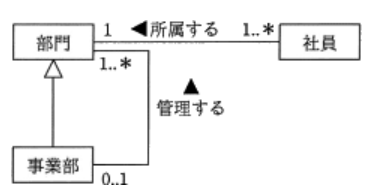

- A.**社員は事業部に所属できる**  
事業部クラスと部門クラスは汎化 - 特化関係にあり、事業部クラスは部門クラスを特化させた存在。事業部は部門の一種で、親クラスの部門に社員が所属できるなら、子クラスの事業部にも社員が所属できる

- 事業部以外の部門が部門を管理できる  
部門クラスとの間は"管理する"の関連名が付いているのは事業部 → 部門のみなので、事業部のみが部門を管理できる

- 所属する社員がいない部門が存在する  
部門から見た社員の多重度は1以上なので社員が所属しない部門は存在しない

- 部門は、いずれかの事業部が管理している  
部門から見た事業部の多重度は0か1のどちらかなので事業部に管理されていない部門も存在し得る

---
12.属性aの値が決まれば属性bの値が一意に定まることを、a → bで表す。社員番号が決まれば社員名が一意に定まるということの表現は、社員番号 → 社員名である。この表記法に基づいて、図のような関係が成立している属性 a ~ j を、関係DB上の3つのテーブルで定義する組合せ

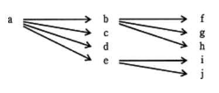

- A.**テーブル1{a, b, c, d, e}**
- A.**テーブル2{b, f, g, h}**
- A.**テーブル3{e, i, j}**  
以下2つの推移的関数従属がある  
a → b → {f, g, h}  
a → e → {i, j}  
表間を関連づけるb, eを別表に移す

---
13.図のデータモデルを3つの表で実装する。"A社への売上50,000円を2017年4月4日に現金勘定に計上した"ことを記録する"移動"表のa, bの適切な組み合わせ

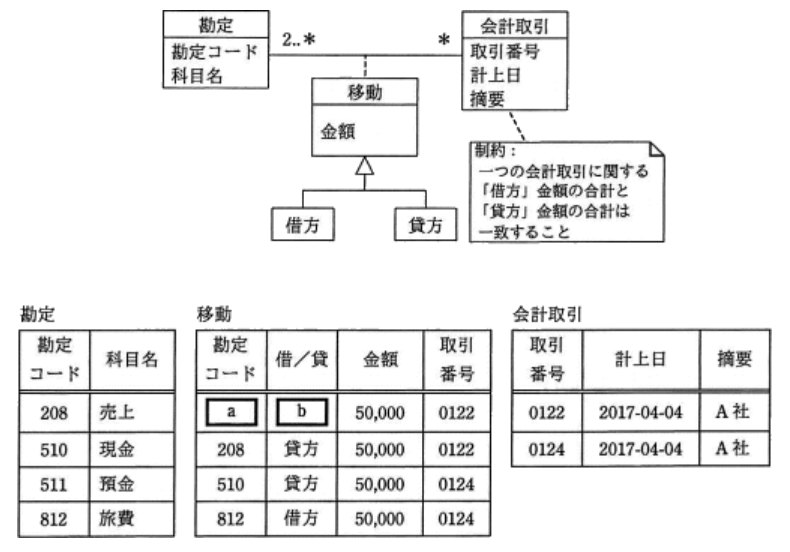

- A.**a : 510**
- A.**b : 借方**  
移動表の取引番号より、それぞれの取引について2件ずつレコードが記録されており、1つの取引において"812 : 旅費(借方)と510 : 現金(貸方)"が一対で登録されている。既に"208 : 売上(貸方)"のレコードが登録されているので、もう片方が該当する

---
14.ER図に関する記述

- A.**業務で扱う情報をエンティティ及びエンティテイ間のリレーションシップとして表現する**  
関係DBの概念モデル設計によく利用されるが、記法自体は関係モデルに限らず任意のオブジェクトとその関連の記述が可能

- 関係DBの表として実装することを前提に表現する  
関係DB用のモデリングだけに限らず、任意のオブジェクト(実体)とその関連を記述するのに使用可能

- データの生成から消滅に至るデータ操作を表現する  
DFD(*Data Flow Diagram*)に関する記述

- リレーションシップは、業務上の手順を表現する  
実体がもつ関連を表現する

---
16.関係DBにおいて、外部キーを定義する目的

- A.**関係する相互のテーブルにおいて、レコード間の参照一貫性が維持される制約をもたせる**  
関係DBの2つのテーブル間の参照整合性を保つための制約。SQLでは設定する属性に対して`foreign key`句を指定する。正規化された表同士を外部キーで結合することでデータの一貫性・正当性を保つことができる

---
20.RDBMSにおけるスキーマ(*Schema*)の説明

- A.**データの性質、形式、ほかのデータとの関連などのデータ定義の集合である**  
データの内容・論理構造・記述記憶や編成などDBの構造を記述したもの。概念スキーマ / 外部スキーマ / 内部スキーマの3グループに分けられている(3層スキーマアーキテクチャ)

- 実表ではない、利用者の視点による仮想的な表である  
ビューの説明

- データの挿入、更新、削除、検索などのDB操作の総称である  
SQL(*Structured Query Language*)の説明

- DBの一貫性を保持するための各種制約条件の総称である  
整合性制約の説明

---
21.関係を第3正規形まで正規化して設計する目的

- A.**冗長性を排除することによって、更新時異状を回避する**  
正規化の目的は冗長性の排除をすることで更新時異状を回避し、DBの一貫性を確保すること

- 値の重複をなくすことによって、格納効率を向上させる  
重複の排除は第1正規化で実施される

- 関係を細かく分解することによって、整合性制約を排除する  
表が多くなるほど整合性制約は増加する

- 属性間の結合度を低下させることによって、更新時のロック待ちを減らす  
パフォーマンス向上のために行うわけではない。正規化を行うと表が幾つかに分割され、更新時には表の結合が行われる。表が分割されるほど結合処理も増加するのでロック待ちの減少には繋がらない

---
24.UMLを用いて表した図のデータモデルに対する多重度の説明

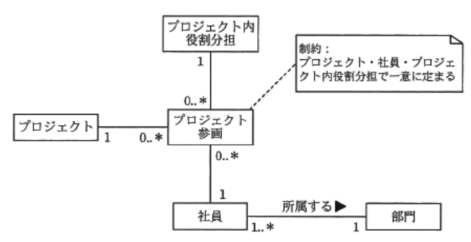

- A.**社員は同じプロジェクトに異なる役割分担で参画できる**  
プロジェクト参画のレコードは、プロジェクト・社員・プロジェクト内役割分担の3つのキーで決定される。プロジェクト参画に対するそれぞれの多重度は全て0以上なので、1社員が複数のプロジェクトに参画でき、同じプロジェクト内で異なる役割分担を担うことが許される

- 社員が複数のプロジェクトに参画する場合、全て同じ役割分担となる  
同じプロジェクトで異なる役割分担をすることができる

- 社員は1つ以上のプロジェクトに参画している  
社員から見たプロジェクト参画の多重度は0以上なので、1社員が参画するプロジェクト数は0以上になる

- 社員は複数の部門に所属できる  
社員から見た部門の多重度は1なので、社員が所属する部門数は常に1

---
25.ER図の説明

- A.**エンティティタイプ間には、1対多、多対多などのリレーションシップがある**  
DB化の対象となる実体(エンティティ)と実体の持つ属性(アトリビュート)、実体間の関連(リレーションシップ)を表現する図。任意のオブジェクトと関連をデータモデル化できるが、関係DBの設計においてよく使用される

- エンティティタイプ間の関連は、参照側から被参照側への方向の矢印線で表現する  
1対1、1対多、多対多という意味がある

- エンティティタイプには属性をもたせないで、リレーションシップタイプに属性をもたせる  
エンティティタイプは属性を持つ

- エンティティタイプの中に関連先のエンティティ名を記述することによって、リレーションシップを表す  
エンティティタイプ間を結ぶ矢印線で表す

---
28.UMLを用いて表した図のデータモデルの解釈  
納品(1..*) --- (0..1)請求

- A.**複数回の納品分をまとめて請求できる**  
1つ以上の納品が、0または1回の請求に対応している。納品に対して請求がない場合で、1回の請求が1つ以上の納品に対応することを考えると、複数回の納品分をまとめて請求できる

- 1回の納品に対して分割請求できる  
1納品に対して複数の請求が発生するので、1対1以上の関係になる

- 顧客への請求を支払いで相殺できる  
納品に対して請求が発生しない場合が存在するので、1対0(1)の関係になる

- 支払処理は納品と同時に実行される  
納品と請求が1対1で対応し、1対1の関係になる

---
31.DBMSが管理するデータ、利用者、プログラムに関する情報、それらの間の関係を保持するデータの集合体

- A.**データディクショナリ**  
DBやシステム開発においてデータの属性・性質などデータに関する情報の定義(メタデータ)を保存・管理するための辞書

- データウェアハウス  
企業内に散らばっているデータの有効活用を目的に、過去から現在までの基幹系DBや外部DBを整理・統合し効果的な戦略的意思決定を支援するためのDBのこと

- データマート  
データウェアハウスの中から特定の目的に合わせて、ある部分を取り出したり加工を施すなどした小規模なDB

- データマイニング  
データウェアハウスに蓄積されている大量の生データから、統計学的手法、数学的手法を用いて今まで知られていなかったデータの規則や因果関係を見つけ出す手法

---
32.次の"受注台帳"表を"注文"表と"顧客"表に分解し、第3正規系にした時、両方に必要な属性はどれか。送付先と支払方法は注文ごとに決めるものとし、表の下線は主キーを表す  
受注台帳(<u>注文番号</u>, 注文年月日,顧客ID, 顧客名, 顧客住所, 品目, 数量, 送付先, 支払方法, 受注金額)

- A.**顧客ID**  
`第1正規化` : 繰り返し項目、集合知をなくす  
`第2正規化` : 主キーの一部によって一意に決まる属性を別表に移す  
`第3正規化` : 主キー以外の属性によって一意に決まる属性を別表に移す  
主キーが第一属性なので第2正規形の条件を満たしている。"受注台帳"表の主キー以外の属性では、顧客ごとに固有の"顧客ID"から顧客名・顧客住所が一意に導ける。この関係を**顧客(<u>顧客ID</u>, 顧客名, 顧客住所)** の別表に移すが、表同士を関連付けるために"顧客ID"を"受注台帳"表に残したままにしなければならない。表同士がある属性で関連づけられていないと、分解前の表を完全な状態で復元できない。"受注台帳"表の属性"顧客ID"は、"顧客ID"を参照する外部キーとなる

---
33."発注伝票"表を第3正規形に書き換えたものはどれか。下線部は主キーを表す  
発注伝票(<u>注文番号</u>, <U>商品番号</u>, 商品名, 注文数量)

- A.**発注(<u>注文番号</u>, <u>商品番号</u>, 注文数量)**
- A.**商品(<u>商品番号</u>, 商品名)**  
"発注伝票"表は、全ての属性が単一値なので第1正規系を満たすが、主キーの一部の"商品番号"に関数従属する"商品名"があるため第2正規系ではない。第2正規系にするには"商品番号"と、"商品番号"によって一意によって定まる"商品名"の関係を"商品"表として分離する。"発注伝票"表の中に外部キーとして"商品番号"の列を残し、分離した"商品"表とリレーションを形成する。第3正規化では主キー以外の属性に関数従属する属性があれば、その関係を別表に移すが条件を満たす関係が存在しないので条件を満たしている

---
35."従業員"表を第3正規形にしたものはどれか。下線部は主キーを表す  
従業員(従業員番号, 従業員氏名, {技能コード, 技能名, 技能経験年数})

- A.**<u>従業員番号</u>, <u>技能コード</u>, 技能経験年数**
- A.**<u>従業員番号</u>, 従業員氏名**
- A.**<u>技能コード</u>, 技能名**  
技能コード、技能名、技術経験年数は従業員1人につき複数の技能経験を有している場合がある。従業員番号だけでは複数ある技能を一意に決められないので、従業員番号と技能コードの組み合わせが主キーとなる

---
37.次のような繰り返し構造のデータを、第3正規系に正規化したものはどれか。下線部分は主キーを表し、単位と単価は商品コードごとに決まるものとする

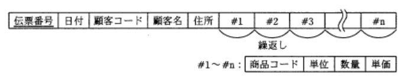

- A.**<u>伝票番号</u>, 日付, 顧客コード**
- A.**<u>顧客コード</u>, 顧客名, 住所**
- A.**<u>伝票番号</u>, <u>商品コード</u>, 数量**
- A.**<u>商品コード</u>, 単位, 単価**  
同じ伝票番号を持つレコードが複数存在することになるので、表中のレコードを一意に特定するために、伝票番号 + 商品レコードの複合主キーにしなければならない  
主キーの一部によって一意に決まる項目を別表に移す。伝票番号から日付・顧客コード・顧客名・住所の4つ、商品コードから単位と単価が一意に定まる  
主キー以外の項目によって一意に決まる項目を別表に移す。顧客コードから顧客名と住所が一意に定まる

---
38.属性xの値によって属性yが一意に決まることをx → yで表す。図に示される関係を第3正規系の表として正しく定義しているものはどれか。xの四角内に複数の属性がある場合、それら複数の属性全ての値によって、属性yの値が一意に決まることを示す

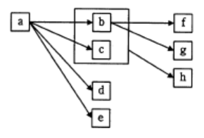

- A.**表1 {a, b, c, d, e}**
- A.**表2 {b, f, g}**
- A.**表3 {b, c, h}**  
第2正規系で、非キー属性が主キーに対して推移的に関数従属していないことが条件。下記のようなリレーションが成り立っている  
a → b, c, d, e  
b → f, g  
b + c → h

---
39."診療科"表、"医師"表及び"患者"表がある。患者がどの医師の診察も受けることができ、かつ診察する医師の特定もできる"診察"表はどれか。表定義中の実線は主キーを、取消線は外部キーを示す

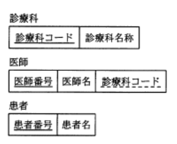

- A.**<u>~~医師番号~~</u>, <u>~~患者番号~~</u>, <u>診察日時</u>**  
診断表のレコードから医師と患者を特定するには、医師番号と患者番号が必要

- <u>~~診療科コード~~</u>, <u>~~患者番号~~</u>, <u>診察日時</u>  
医師表との関連がないので、どの医師が診察を行ったのか特定できない

- <u>~~医師番号~~</u>, <u>診察日時</u>
- <u>~~診療科コード~~</u>, <u>~~医師番号~~</u>, <u>診察日時</u>  
患者表との関連がないので、診察表のレコードがどの患者に対応するか特定できない

---
42.事務室が複数の建物に分散している会社で、PCの設置場所を管理するDBを作ることになった。"資産"、"部屋"、"建物"の3つの表を作成し、各表の関連付けを行った。新規にデータを入力する場合は、参照される表のデータが先に存在している必要がある。各表へのデータの入力順序として、適切なものはどれか。各表の下線部の項目は、主キー又は外部キーである

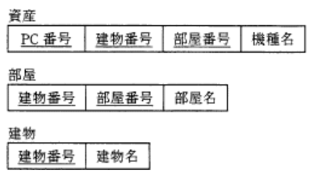

- A.**建物 → 部屋 → 資産**  
・資産表には建物番号と部屋番号があり、部屋表と建物表を参照している  
・部屋表には建物番号があるので、建物表を参照している  
・建物表には別の表を参照する属性がない  
参照する表のない建物表にデータを入力し、次に建物表のみを参照する部屋表、最後に建物表と部屋表を参照する資産表にデータを入力するという順序が適切

---
45.a ~ fからなるレコードがある。このレコードの主キーは項目aとbを組み合わせたものである。項目fは項目bによって特定できる。このレコードを第3正規形にしたもの

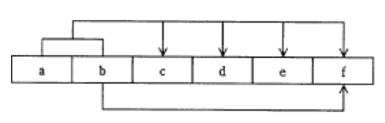

- A.**a, b, c, d, e | b, f**  
図のレコードは繰り返す項目がないので第1正規形になっている。第2正規形にするには、主キーの一部の項目bによって一意に決まる項目fを別表に移す作業を行う。このレコードには主キー以外の項目によって一意に決める項目がないため、第3正規形の条件を満たしているので、{b. f}から成る表と元のレコードから項目fを取り除いた2つで構成される

---
46.3つの表“商品”、“注文”、“顧客”に対するデータ操作の記述のうち、参照制約を受けることなく実行可能な操作はどれか。実線は主キー、取消線は外部キーを表す  
商品(<u>商品コード</u>, 商品名, 単位, 金額)  
注文(<u>注文コード</u>, ~~商品コード~~, 注文数, ~~顧客コード~~)  
顧客(<u>顧客コード</u>)

- A.**顧客表への新規レコード追加**  
外部キーを持つレコードを追加する場合、値は参照先のレコードの主キーとして存在しないとならない、別表から主キーの値を参照されている行は削除できないという制限が課されている

- 商品表のレコード削除  
注文表の商品コードで値が参照されているので実行不可

- 商品表のレコードの商品コードの変更  
もとの値を参照する注文票の商品コードがあるので実行不可

- 注文票へのレコード追加  
商品コードが商品表に存在し、顧客コードが顧客表に存在することが条件

---
47.データモデルの表記が次の表記法に従う時、適切なER図の解釈

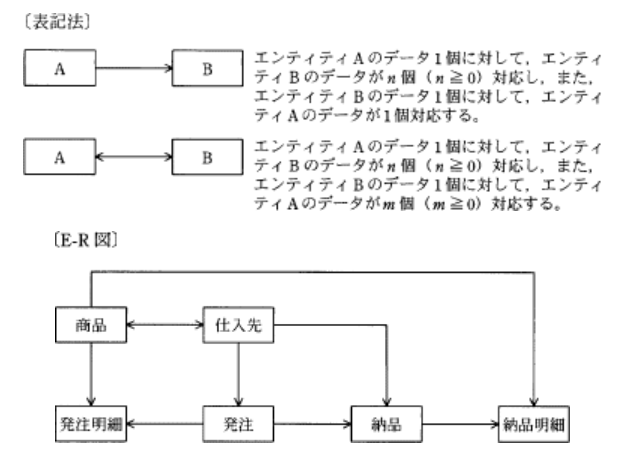

- A.**1つの発注で複数の仕入れ先に発注することはない**  
仕入先 → 発注なので、1発注に対応する仕入先は1つ。1回の発注は必ず1つの仕入先宛に行われる

- 同一の商品は1つの仕入先から仕入れている  
商品 → 仕入先なので、1商品に対して0以上の仕入先が対応する

- 発注明細と納品明細は1対1に対応している  
商品 → 納品明細なので、1納品明細に対応する商品は1つ。商品 → 発注明細なので、1商品に対して発注明細が0個以上存在する。1つの納品明細に対して複数の発注明細が対応している

- 1つの発注で複数の種類の商品を発注することはない  
仕入先 → 発注なので、発注1つに対応する仕入先は1つ。仕入先 → 商品なので1仕入先に複数の商品が存在する。1発注に複数商品が対応する場合がある

### 9.3 データ操作

---
1.国語と数学の試験を実施し、2教科の成績は氏名とともに得点表に記録されている。1教科は平均点以上で、残りの1教科は平均点未満の生徒氏名を得点表から抽出するSQL文はどれか  
条件A : 国語の点数が国語の平均点以上  
条件B : 数学の点数が数学の平均点以上

- A.**SELECT 生徒氏名 FROM 得点 WHERE (A OR B) AND NOT (A AND B)**  
andは論理積、orは論理和は表す。AまたはB and AでもBでもない部分の論理積(共通部分)なので、AかBどちらかに属している箇所のみが該当する

- SELECT 生徒氏名 FROM 得点 WHERE (A AND B) AND NOT (A AND B)  
AかつB and AかつBではない部分の論理積は存在しない

- SELECT 生徒氏名 FROM 得点 WHERE (A AND B) AND NOT (A OR B)  
AかつB and AでもBでもない部分の論理積は存在しない

- SELECT 生徒氏名 FROM 得点 WHERE (A OR B) AND NOT (A OR B)  
AまたはB and AまたはBではい部分の論理積は存在しない

---
4.埋込みSQLにおいて、問合せによって得られた導出表を1行ずつ親プログラムに引き渡す操作がある。この操作と関係の深い字句

- A.**CURSOR**  
埋込みSQLは、C, COBOL, Pascal, Javaのような手続き型プログラミングに関係DBを操作するためのSQLを埋め込む手法。カーソル操作は、アプリケーションプログラムからDBへの問合せによって得られた導出表を、表データを直接取扱えない手続き型プログラム言語に1行ずつ渡す機能を提供する。SQLではカーソル宣言に"delete cursor"、カーソル位置のデータ取得、次データへの移動に"fetch"文を使う

- ORDER BY  
抽出したデータを昇順に並び替えるために使用する

- UNION  
複数の問合せ結果を併合して1つの結果とするために使用する

- UNIQUE  
設定された列が他行がもつ値との重複を認めない制約を設定するために使用する

---
5.注文票と製品表に対して、次のSQL文を実行した時に得られる結果  
`select 製品名, 数量 from 注文, 製品 where 注文.製品コード = 製品.製品コード`

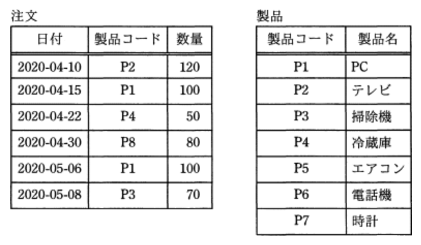

- A.

|製品名|数量|
|-----|---|
|テレビ|120|
|PC   |100|
|冷蔵庫|50 |
|PC   |100|
|掃除機|70 |

それぞれの表を製品コードで結合し、`select 製品名, 数量`で列を抜き出す

---
6.得点表から、学生ごとに全科目の点数の平均を算出し、平均が80点以上の学生の学生番号と平均点を求める。aに入れる適切な字句はどれか。実線の下線は主キーを表す。  
得点(<u>学生番号</u>, <u>科目</u>, 点数)  
SQL文 : select 学生番号, avg(点数) from 得点 group by `a`

- A.**学生番号 having avg(点数) >= 80**  
`group by`でグループ化した後にグループを絞るために`having`を使用する。学生ごとに全科目の平均を算出したいので、レコードを学生番号ごとにグルーピングした後、点数の平均が80以上の学生を選択する

---
7.関係モデルにおいて、関係から特定の属性だけを取り出す演算

- **射影(*protection***)  
表から指定された列(属性)を抽出する操作

- 結合(*join*)  
複数の表を共通する属性で結合して1つの表にする操作

- 選択(*selection*)  
表から指定された行(タプル)を抽出する操作

- 和(*union*)  
同属性を持つ2つの表の行を足し合わせて、1つの新しい表を作り出す操作

---
8."中間テスト"表からテストごと、教科ごとの平均点を求め、クラス名・教科名の昇順に表示するSQL文中のaに入れる字句  
中間テスト(クラス名, 教科名, 学生番号, 名前, 点数)  
SQL文 : select クラス名, 教科名, avg(点数) as 平均点 `a`

- A.**group by クラス名, 教科名 order by クラス名, 教科名**  
クラス・教科ごとに平均点を求めてグループ化し、表示はクラス名・教科名の昇順に行うため、整列優先順位の高い属性順に指定する

- group by クラス名, 教科名 order by クラス名, avg(点数)  
表示順がクラス名・平均点の順になってしまう

- group by クラス名, 教科名, 学生番号 order by クラス名, 教科名, 平均点  
学生番号を指定すると、クラス・教科・学生ごとの集計になってしまう

- group by クラス名, 平均点 order by クラス名, 教科名  
クラス名でしかグループ化されていないので、教科ごとの集計ができない。未指定の教科名列を指定しているため構文エラーとなる

---
11.関係XとYを自然結合した後、関係Zを得る関係代数演算

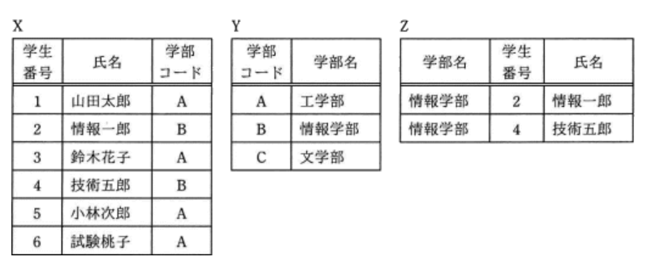

- A.**選択と射影**  
関係XとYに共通の属性"学部コード"で自然結合し、学部コードがBである2つを`選択`し、学部名・学生番号・氏名の3つの属性を取り出す(`射影`)と関係Zを得られる

---
12.埋込みSQLを用いたプログラムの一部において、Xを表す名前  
- EXEC SQL OPEN X;  
  - EXEC SQL FETCH X INFO :NAME, :DEPT, :SALARY;  
  - EXEC SQL UPDATE 従業員  
    - SET 給与 = 給与 * 1.1  
    - WHERE CURRENT OR X;  
-   EXEC SQL CLOSE X;

- A.**カーソル**  
組込みSQLは、C, COBOL, Pascalのような表データを直接扱えない手続き型プログラミングに、関係DBを操作するためのSQLを埋め込むための手法。問合せによって得られた導出表を1行ずつ親プログラムに引き渡しながら処理し、この操作において結果表内のある1行を参照する仕組みをカーソルと呼ぶ。カーソルから値を取り出したり、更新・削除処理を行ったりする  
1, 6行目 : カーソルXを開く、閉じる  
2行目 : 現在のカーソルXが指す  
3行目 : 行の値をホスト変数に格納  
5行目 : where句で現在のカーソル位置を指定

- スキーマ  
DB構造などを定義したもの

- テーブル  
属性と組みでデータを格納する表

- ビュー  
実表の一部、複数の実表から演算関係によって得られた結果を1つの表に見せかけた仮想の表

---
13.RDBMSが2つの表を結合する方法で、ソートマージ結合法に関する記述

- A.**結合する列の値で並べ替えたそれぞれの表の行を、先頭から順に結合する**  
双方の結合属性の値を整列し、先頭から突き合わせることで効率的に結合する手法。整列(整列)と突合わせで併合(マージ)する

- 一方の表の結合する列がインデックスに含まれている場合、もう一方の表の結合する列とインデックスの値で結合する  
インデックスの値は行の格納位置を表すため、列の値とは結合しない

- 一方の表の結合する列の値でハッシュ表を作成し、もう一方の表の結合する列と結合する  
ハッシュ結合表の説明

- 一方の表の結合する列の値を順に読み出し、もう一方の表の結合する列と結合する  
入れ子ループ法(ネストループ法)の説明

---
14.関係代数の演算のうち、関係R, Sの直積(R * S)に対応するselect文はどれか。関係R, Sを表R, Sに対応させ、表R, Sに行の重複はないものとする

- A.**SELECT * FROM R, S**
SQLでは結合条件を指定しない場合や、結合条件が誤っている場合に2つの表を直積結合した結果を返す。2つの関係(表)に含まれる要素の全ての組み合わせから成る表を得る演算。今回は関係Rの1行に対して関係Sのそれぞれの行を繋ぎ合わせた関係を返す

- SELECT * FROM R EXCEPT SELECT * FROM S
R表に存在し、S表に存在しない行から成る表(差集合)を返す演算

- SELECT * FROM R UNION SELECT * FROM S
2つの表の合わせた集合から重複を除去した表(和集合)で返す演算

- SELECT * FROM R INTERSECT SELECT * FROM S
R表とS表に共通する行から成る表(共通集合)を返す演算

---
15.社員表と部門表に対し、次のSQL文を実行した時の結果  
`select count(*) from 社員, 部門 where 社員.所属 = 部門.部門名 and 部門.フロア = 2`

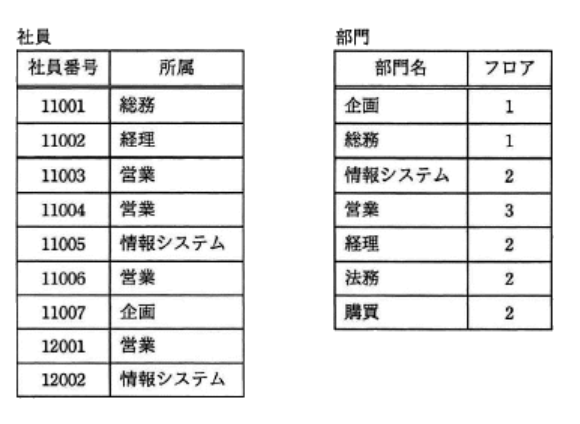

- A.**3**  
社員表の所属列と部門表の部門名列をキー列として結合する。結合された表中でフロア列が2の数を返す

---
17.出庫記録表に対するSQL文のうち、最も大きな値が得られるもの

|商品番号|日付      |数量|
|------|----------|---|
|NP200 |2015-10-10|3  |
|FP233 |2015-10-10|2  |
|NP200 |2015-10-11|1  |
|FP233 |2015-10-11|2  |

- A.**select count(*) from 出庫記録**  
行数を数える集計関数で、`4`が得られる

- select avg(数量) from 出庫記録 where 商品番号 = "NP200"  
一致する商品番号のレコードは2つで数量は合計4個、平均値として`2`が得られる

- select max(数量) from 出庫記録  
レコードの中で数量列の最大値の`3`が得られる

- select sum(数量) from 出庫記録 where 日付 = "2015-10-11"  
日付が一致するレコードは2行あり、数量の合計である`3`が得られる

---
18.ある企業では、顧客マスタファイル、商品マスタファイル、担当者マスタファイル及び当月受注ファイルを基にして、月次で受注実績を把握している。各ファイルの項目が表のとおりであるとき、これら四つのファイルを使用して当月分と直前の3か月分の出力が可能な受注実績

|ファイル|項目|尾行|
|------|----|---|
|顧客マスタ|顧客コード, 名称, 担当者コード, 先月(2, 3ヶ月前)受注額|各顧客の担当者1人|
|商品マスタ|商品コード, 名称, 先月(2, 3ヶ月前)受注額|-|
|担当者マスタ|担当者コード, 氏名|-|
|当月受注|顧客コード, 商品コード, 受注額|当月の合計受注額|

- A.**担当者別の顧客別受注実績**  
ファイルを関係DBの表として関連をまとめると下記の通り。顧客マスタファイルには担当者コードの列があるので、担当者コードと顧客コードをキーとして並び替えることで当月と直前3ヶ月分の担当者別受注実績が出力可能

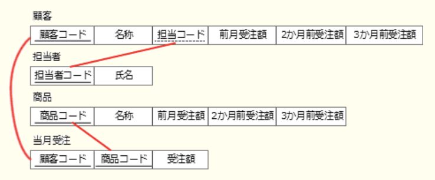

- 顧客別の商品別受注実績  
受注商品と顧客が関連付けられている記録があるのは当月分のみで、先月から3ヶ月前は受注合計額のデータしかない

- 商品別の顧客別受注実績  
商品マスタファイルは顧客別に集計されていない

- 商品別の担当者別受注実績  
商品マスタファイルに受注した商品と担当者を関連付ける項目(担当者コード)がないため、担当者別の出力はできない

---
20.表品票、在庫表に対するSQL文と、同じ結果が得られるSQL文はどれか。下線部は主キーを表す  
`select 商品番号 from 商品 where 商品番号 not in (select 商品番号 from 在庫)`  
商品 : <u>商品番号</u>, 商品名, 単価  
在庫 : <u>在庫番号</u>, 商品番号, 在庫数

- A.**`select 商品番号 from 商品 where not exists (select 商品番号 from 在庫.商品番号 = 在庫.商品番号)`**  
副問合せで在庫表の商品番号列に存在する値のリストを作成し、商品表の商品番号列と比較している。比較演算子は`not in`なので**商品表の商品番号列の中で、在庫表の商品番号列に存在しない商品番号のリスト**が得られる

- `select 商品番号 from 在庫 where exists (select 商品番号 from 商品)`  
在庫表の商品番号のうち、商品表の商品番号列の値として存在する行が得られる

- `select 商品番号 from 在庫 where not exists (select 商品番号 from 商品)`  
在庫表の商品番号のうち、商品表の商品番号列の値として存在しない行が得られる

- `select 商品番号 from 商品 where exists (select 商品番号 from 在庫.商品番号 = 在庫.商品番号)`  
両方の表に含まれる商品番号を返す

---
23.BOOKS表から書名にUNIXを含む行を全て探すためにSQL文を用いる。`a`に指定する文字列で適切なものはどれか。書名はBOOKS表の書名列に格納されている  
select * from BOOKS where 書名 like "a"

- A.**%UNIX%**  
like句は、0文字以上の任意の文字列にマッチする"%"、任意の1文字にマッチする"_"などのワイルドカードと呼ばれる文字を使用して、文字列パターンを条件に指定可能にする。書名に"UNIX"が含まれている行を抽出したいので、文字以上の任意の文字列にマッチする"%"を前後に付加して指定する

- %UNIX  
書名がUNIXで終わる場合にマッチする

- UNIX  
書名がUNIXの場合のみマッチする

- UNIX%  
書名がUNIXで始まる場合にマッチする

---
25.商品表のデータが次の状態の時、ビュー"収益商品"の行数が減少する更新処理  
`create view 収益商品 as select * from 商品 where 売値 - 仕入値 >= 40000`

|商品コード|品名|型式|売値|仕入値|
|--------|----|---|---|-----|
|S001|T|T2003|150,000|100,000|
|S003|S|S2003|200,000|170,000|
|S005|R|R2003|140,000|80,000|

- A.**商品コードS001の売値を130,000に更新する**  
売値 - 仕入値 = 30,000に減少し、S001の行がビューに表示されなくなる

- 商品コードS003の仕入値を150,000に更新する  
売値 - 仕入値 = 50,000に増加し、ビューに現れる行はS001, S003, S005の3行に増加する

- 商品コードS005の売値を130,000に更新する
- 商品コードS005の仕入値を90,000に更新する  
売値 - 仕入値 = 50,000に減少するが、もとからビューに表示されているので行数は変化しない

---
26.関係DB、注文票の顧客番号は、顧客表の主キー顧客番号に対応する外部キーである。参照の整合性を損なうデータ操作はどれか。データの並びは表の列の並びと同順とする

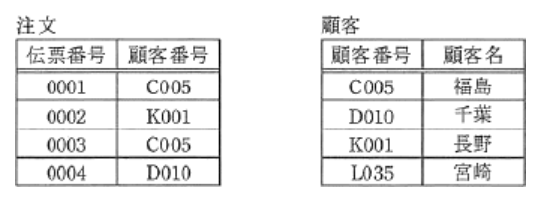

- A.**注文票に行`0006 F020`を追加する**  
顧客番号がF020の行は、顧客表に存在していないため追加できない。先に顧客表にレコードを追加してから注文表への追加を行う必要がある

- 顧客表の行`L035 宮崎`を削除する  
注文表の顧客番号列に、L035の値をもつ行がないので削除可能

- 注文票に行`0005 D010`を追加する  
顧客番号がD010の行は、既に顧客表に存在しているので問題なく追加できる

- 注文票の行`0002 K001`を削除する  
注文表の行の削除は問題ない

---
30.同じ属性から成る関係RとSがある。RとSの属性値の一部が一致する場合、関係演算`R - (R - S)`と同じ結果が得られるものはどれか。∩は共通集合、∪は和集合を表す

- A.**`R ∩ S`**  
R : R部分全体(Sの一部も含む)  
(R - S) : S部分を含まない、R部分  
R - (R - S) : Sの一部を含むRなので両者の共通部分

---
35.JavaのアプリケーションプログラムがDBにアクセスするための標準的なAPI(*Application Program Interface*)

- A.**JDBC**(*Java Database Connectivity*)  
JavaプログラムからリレーショナルDBに接続するためのAPI

- HTML  
Web上のドキュメントを記述するために、タグで文書構造を表現するマークアップ言語

- JavaVM  
Javaプログラムを実行するJava仮想マシンのこと。それぞれの環境に移植することで同じプログラムを様々なプラットフォームで実行可能

- SQL  
リレーショナルDB管理システム(RDBMS)において、データ操作や定義を行うための問合せ言語

---
37.商品表に対してデータの更新処理が正しく実行できるupdate文はどれか。商品表は次のcreate文で定義されている  
`create table 商品(商品番号 char(4), 商品名 char(20), 仕入先番号 char(6), 単価 int, primary key(商品番号))`

|商品番号|商品名|仕入先番号|単価|
|------|-----|---------|---|
|S001|A|XX0001|18,000|
|S002|A|YY0002|20,000|
|S003|B|YY0002|35,000|
|S004|C|ZZ0003|40,000|
|S005|C|XX0001|38,000|

- A.**`update 商品 set 商品名 = "D" where 商品番号 = "S003"`**  
`update 表名 set 列名 = 変更値(where 条件)`  
商品番号"S003"の行は1つなので、商品名を変更することが可能。create文から、商品番号が主キーと分かる

- `update 商品 set 商品番号 = "S001" where 商品番号 = "S002"`  
商品番号"S002"の行の商品番号を"S001"にすると、商品番号"S001"の行が2つになり主キーの一意性を満たさなくなってしまう

- `update 商品 set 商品番号 = "S006" where 商品名 = "C"`  
商品名がCの2行の両方が同じ商品番号になってしまうと主キーの一意性を満たさなくなってしまう

- `update 商品 set 商品番号 = null where 商品番号 = "S002"`  
主キーの商品番号をnull(空値)にはセットできない

---
40.SQLの構文で正しいもの

- A.**`select 注文日, avg(数量) from 注文明細 group by 注文日`**  
注文日ごとの数量が出力される

- `select 注文日, avg(数量) from 注文明細`  
注文日がgroup by句で指定されていない状態で、selectで注文日と集計関数が使用されている

- `select 注文日, avg(sum(数量)) from 注文明細 group by 注文日`  
avg関数は引数が列名でなければならない

- `select 注文日 from 注文明細 where sum(数量) > 1000 group by 注文日`  
where句はグループ化前に行を制限するので、集計関数を条件指定に使用はできない

---
42.関係DBの製品表と売上表から、売上報告のビュー表を定義するSQL文中の`a`に入るもの  
create view 売上報告(製品番号, 製品名, 納品数, 売上年月日, 売上金額) as `a` 製品.製品番号, 製品.製品名, 売上.納品数, 売上.売上年月日, 売上.納品数 * 製品.単価 from 製品.売上 where 製品.製品番号 = 売上.製品番号

|表名|列名|
|---|---|
|製品|製品番号, 製品名, 単価|
|売上|製品番号, 納品数, 売上年月日|

- A.**select**  
実表の一部または複数の実表から関係演算によって得られた結果を1つの表に見せかけた仮想の表。ビュー票はcreate view文で定義され、対象となる実表からselect文で列と行を抜き出す方法で定義される

- grant  
特定のユーザに票などのオブジェクトに対する権限を付与する時に使う

- insert  
表に行を挿入する時に使う

- schema  
DBに名前空間を定義するcreate schema文の一部

---
43.関係DBの操作に関する記述

- A.**結合は、2つ以上の表を連結して1つの表を生成することをいう**  
2つの表がもつ共通の属性(列)で結合して新しい票を作り出す操作。`where 表A.属性C = 表B.属性C`の構文で表の結合を指定する

- 射影は、表の中から条件に合致した行を取り出すことをいう  
表の中から特定の列を取り出すことをいう

- 選択は、表の中から特定の列を取り出すことをいう  
表の中から条件に合致した行を取り出すことをいう

- 挿入は、表に対して特定の列を挿入することをいう  
表に対して特定の行を差し込むことをいう。表への列の挿入はSQLの`add`句で行われるため、操作名は追加が適切

---
44.化粧品の製造を行っているA社では、販売代理店を通じて商品販売を行っている。今後の販売戦略に活用するために、次の3つの表からなるDBの作成を計画している。これらのデータを用いるだけでは得ることのできない情報  
顧客データ : `顧客, 氏名, 性別, 生年月日`  
販売代理店の日別販売データ : `販売代理店, 日付, 商品, 販売数量`  
顧客の商品購入データ : `顧客, 販売代理店, 商品, 販売数量`

- A.**販売代理店ごとの購入者数の日別差異**  
顧客の商品購入データには日付の項目がないため、日毎の購入者数情報は得られない

- 商品ごとの販売数量の日別差異  
販売代理店の日別販売データに、商品・販売数量・日付の項目があるので得られる

- 性別ごとの売れ筋商品  
顧客の商品購入データの顧客キーから、顧客データの性別を参照することで得られる

- 販売代理店ごとの購入者の年齢分布  
顧客の商品購入データの顧客キーから、顧客データの生年月日を参照することで得られる

---
45.SQLの実行結果がA表のようになった時、`a`に入れるべき字句  
select S_CODE, S_NAME, BU_NAME from BUSHO, SHAIN where `a`

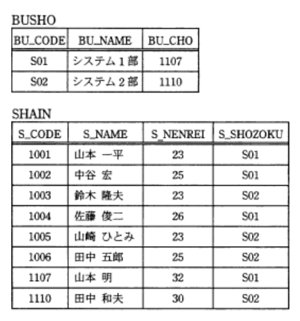

|S_CODE|S_NAME|BU_NAME|
|------|------|-------|
|1001|山本 一平|システム1部|
|1003|鈴木 隆夫|システム2部|
|1005|山崎 ひとみ|システム2部|

- A.**`BU_CODE = S_SHOZOKU and S_NENREI= 23`**  
2つの表を結合させており、表の結合をしていする、`BU_CODE = S_SHOZOKU`がある。SQL文の結果得られたA表の人の年齢が全員23で、その他にはS_NENREIが23のデータは存在しない

---
46.社員表から、職務がプログラマである社員が5人未満の部署の部署コードを探すSQL文はどれか。各列にnull値は含まれていない  
社員(社員番号, 社員名, 部署コード, 職務)

- A.**`select distinct 部署コード from 社員 S1 where 5 > (select count(S2.社員番号) from 社員 S2 where S1.部署コード = S2.部署コード and S2.職務 = "プログラマ")`**  
副問合せから返された値が5未満なら主問合せのwhere句は真を返す。所属するプログラマが5人未満の部署コードをもつ行のみが抽出され、中間表からselect句で部署コードを抜き出し、distinct句で重複行を排除する

- `select distinct 部署コード from 社員 S1 where 5 < (select count(S2.社員番号) from 社員 S2 where S1.部署コード = S2.部署コード and S2.職務 <> "プログラマ")`  
`where <`、`S".職務 <> "プログラマ"`の部分が正解の記述と異なる。プログラマではない社員が5人より多い部署コードを取り出すことになる

- `select distinct 部署コード from 社員 S1 where exists (select * from 社員 S2 where S1.部署コード = S2.部署コード and S2.職務 = "プログラマ") group by S1.部署コード having count(*) < 5`  
`having count(*) < 5`で、抽出対象を絞っているため、プログラマが5人未満でも所属する社員が5人以上であればその部署は抽出されない。プログラマが0人の部署もexists句が偽を返すため抽出されない

- `select distinct 部署コード from 社員 S1 where S1.部署コード in (select S2.部署コード from 社員 S2 where S1.部署コード = S2.部署コード and S2.職務 = "プログラマ" group by S2.部署コード having count(*) < 5)`  
プログラマが1人以上5人未満の部署コードは抽出されるが、0人の部署はwhere句の条件に合致せず抽出されない

---
50.更新不可能なビュー

- A.**ビュー定義に`group by`句が含まれるビュー**  
実表に対して実表の行を挿入、更新、削除することができないビューでのこと。集約関数(avg, count, sum, min max)・2つ以上の表の結合・`group by`, `order by`, `model`, `connect by`, `start with`, `distinct`の各句、select構文のリストにコレクション式、(副問合せ)、`with read only`が指定された副問合せでは更新不可能

---
53.カーソル操作に関する記述

- A.**プログラム言語は通常レコード単位の処理を行うのに対し、SQLでは集合単位の処理を行うので、その間をカーソルによって橋渡しする**  
アプリケーションプログラムからDBへの問合せによって得られた導入表を、表データを直接扱えない手続き型プログラム言語に渡す機能を実現するもの

- insert文を実行する前に、open文を実行してカーソルを開いておかなければならない  
insert文の実行前に、open文を実行する必要はない

- prepare文は、与えられたSQL文を実行し、結果を自分のプログラム中に記録する  
SQL文を実行するための準備を行う命令

- カーソル操作によって複数行を一括更新が可能となる  
プログラム言語は表をレコード(行)単位で扱うので、複数行の一括更新はできない

---
58.埋込型SQL文を使用して、プログラムから関係DBの表をアクセスするときの導出表を定義するためのSQL文

- A.**declare cursor**  
アプリケーションプログラムからDBへの問合せによって得られた導入表を、表データを直接扱えない手続き型プログラム言語に渡す機能を実現するもの

- close  
処理が終了したカーソルを閉じるための文

- fetch  
カーソル位置のデータ取得、次のデータへの移動をする文

- open  
declare文で定義されたカーソルを開く文

### 9.4 トランザクション処理

---
3.DBのトランザクションに関する記述

- A.**複数のトランザクション間でデッドロックが発生したので、トランザクションをDBMSがロールバックした**  
`デッドロック` : 共有資源を使用する複数尾トランザクションが、互いに相手のトランザクションが必要とする資源を排他的に使用していて、互いのトランザクションが相手が使用している資源の開放を待っている状態。永遠に待ち状態になってしまうため処理の続行ができない。発生時にはDBMSが両方のトランザクションをアボート(中止)し、ロールバックする

- 他のトランザクションにデータを更新されないようにするために、テーブルに対するロックをアプリケーションプログラムが解放した  
他のトランザクションにデータを更新されないようにする場合はデータにロックを掛ける。解放すると他のトランザクションに更新されてしまう

- トランザクション障害が発生したので、異常終了したトランザクションをDBMSがロールフォワードした  
トランザクション障害発生時には更新前ログを用いたロールバックを行ってDBをトランザクション開始時点の状態に戻す。ロールフォワード(前進復帰)はコミット済トランザクションの更新後ログを用いてDBを障害発生直前の状態に復旧する処理

- トランザクションの更新結果を確定するために、トランザクションをアプリケーションプログラムがロールバックした  
更新結果を確定する処理はコミット。ロールバックは、トランザクションの途中、プログラムのバグなどでアプリケーションが強制終了した場合に、更新前ログを用いてDBをトランザクション開始直前の状態に戻す処理

---
5.媒体障害の回復において、最新のDBのバックアップをリストアした後に、トランザクションログを用いて行う操作

- A.**バックアップ取得後にコミットした全てのトランザクションをロールフォワードする**  
DBの障害にはトランザクション操作、システム障害、媒体障害などの種類があり、回復方法が異なる。媒体障害は、ハードディスクなどの装置や機器自体の不具合により生じる障害。  
1.機器を正常に動作するものに取り換える  
2.バックアップデータを利用して、正常なディスクにバックアップ時点の状態を復元する  
3.`バックアップ取得時点以後`にコミットされたトランザクションについて、更新後ログを用いてDBに結果を反映させる、ロールフォワード処理(前進復帰)を行う
