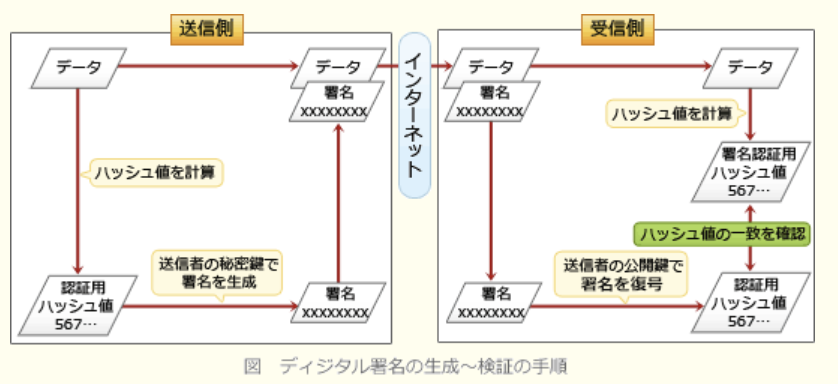

### 科目B

---
1.プログラム中の空欄に入る正しい答えの組み合わせを選択。配列の要素番号は1から始まる\
関数findPrimeNumbersは、引数で与えられた整数以下の、全ての素数だけを格納した配列を返す関数である。引数に与える整数は2以上である

- A.a:**maxNum**\
- A.b:**i / jの余りが0と等しい**

試し割り方をプログラムとして実装したもの。ある数について、2で割る、3で割る…を繰り返して、判定対象となる数の平方数まで割り切れなければ素数として判定するというもの\
・aについて\
プログラムの終盤を見ると、divideFlagがtrueと等しければ、ループ変数iを配列pnListに追加し、最終的に配列pnListを素数のリストとして返している。ループ変数iは現在判定対象となっている数を保持する変数として使われていることが分かる。\
素数は2以上の自然数なので、引数のmaxNum以下のうち、素数であるかどうかを判定すべき数は2 ~ maxNumまでの整数。そのため空欄aには「maxNum」が当てはまる。maxNum + 1にしてしまうと、引数の数より1大きいものまで素数として返されてしまう可能性があるため不適切\
・bについて\
二重のforループの内側に位置していて、if文の条件式となっている。空欄bの条件式がtrueのときは、次の行で変数divideFlagにfalseを格納している。\
どの選択肢でもi / jをしているように、ここでは変数iに対して、変数jを2から変数iの平方根まで増やしながら除算することを繰り返している。\
divideFlagがfalseになった場合、後続のif文で変数iの値が配列pnListに格納されなくなるので、divideFlagをfalse にするということは、現在の変数iの値を「素数ではない」と判定していることになる。\
変数iが素数でないと判定するのは、変数iに割り切れる数がある場合、i / j割り切れるときなので、空欄bには「i / jの余りが0と等しい」という条件式が当てはまる

---
2.次の記述中の正しい答えを選択\

- A.次のプログラムで、手続proc2を呼び出すと、**C, B, A, C**の順に出力される\
呼び出された手続きが終了した場合、呼出し元の手続きの処理に戻るということが正しい手順を考える上でのポイント。出力された文字を先頭から順に並べたものが正解

---
3.次の記述中の正しい答えを選択。配列の要素番号は1から始まる\
次の手続sortは、大域の整数型の配列dataの、引数firstで与えられた要素番号から引数lastで与えられた要素番号までの要素を昇順に整列する。また、first < last とする。手続きsortをsort(1, 5)として呼び出すと、αの行を最初に実行したときの出力はいくつか

- A.**{2, 1, 3, 5, 4}**

sort(1, 5)なので、pivot = 3, i = 1, j = 5

・data[i]がpivotより小さい間、jから1を加えることを繰り返す\
* while (data[i] < pivot)\
\* i ← i + 1\
* endwhile\
値が3より小さいdata[1]とdata[2]のとき、iは1 → 2、2 → 3と2回 + 1をして、i = 3で繰り返しが終了する

・data[j]がpivotより大きい間、jから1を引くことを繰り返す\
* while (pivot < data[j])\
\* j← j − 1
* endwhile\
値が3より大きいdata[5]とdata[4]のとき、jが5 → 4、4 → 3と2回 - 1をして、i = 3で繰り返しが終了する

・i >= jなので、while(true)の繰り返し処理が終了し、αの処理が行われる\
この時点でdata = {2, 1, 3, 5, 4}と初期値と同じで、先頭から順に出力する

---
4.次の記述中の正しい答えを選択。配列の要素番号は1から始まる\
関数addは、引数で指定された正の整数valueを大域の整数型の配列hashArrayに格納する。格納できた場合はtrueを返し、格納できなかった場合はfalseを返す。整数valueをhashArrayのどの要素に格納すべきかを、calcHash1及びcalcHash2を利用して決める。\
手続きtestは、関数addを呼び出して、hashArrayに正の整数を格納する。手続きtestの処理が終了した直後のhashArrayの内容はいくらか

- A.**{-1, 18, -1, 3, 11}**

手続きtestの最初で。配列hashArrayは{-1, -1, -1, -1, -1}に初期化されている。3回の関数addでは、以下のように値が格納される。\
・add(3)\
1.i ← calcHash1(3)が実行される\
2.value = 3、hashArrayの要素数が5なので、calcHash1(3)は、3 / 5の余りに1を加えた値、4を返す\
3.hashArray[4] = -1なので、3を格納して終了

・add(18)\
1.i ← calcHash1(18)が実行される\
2.value = 18、hashArrayの要素数が5なので、calcHash1(3)は、18 / 5の余りに1を加えた値、4を返す\
3.hashArray[4] != -1なので、else文に飛び、i ← calcHash2(18)が実行される\
4.value + 3 = 21、hashArrayの要素数が5なので、calcHash2(18)は21 / 5の余りに1を加えた数、2を返す\
5.hashArray[2] = -1なので、18を格納して終了

・add(11)\
1.i ← calcHash1(11)が実行される\
2.value = 11、hashArrayの要素数が5なので、calcHash1(11)は、11 / 5の余りに1を加えた値、2を返す\
3.hashArray[2] != -1なので、else文に飛び、i ← calcHash2(11)が実行される\
4.value + 3 = 14、hashArrayの要素数が5なので、calcHash2(11)は14 / 5の余りに1を加えた数、5を返す\
5.hashArray[5] = -1なので、11を格納して終了

---
5.次の記述中の正しい答えを選択。配列の要素番号は1から始まる\
コサイン類似度は、2つのベクトルの向きの類似性を測る尺度である。関数calcCosineSimilarityは、いずれも要素数がn(n >= 1)である実数型の配列vector1とvector2を受け取り、2つの配列のコサイン類似度を返す。配列vector1が{a1, a2, …, an}、配列vector2が{b1, b2, …, bn}のとき、コサイン類似度は次の数式で計算される。vector1とvector2のいずれも、全ての要素に0が格納されていることはないものとする

- A.**a : vector1[i] * vector2[i]**
- A.**b : denominator * (tempの正の平方根)**

・for文1つ目(a)\
分子の値を計算する式が入る。比較する2つの配列で同じ位置の要素同士を乗算した総和なので、aには**vector1[i] * vector2[i]** が当てはまる

・for文3つ目(b)\
変数denominatorは、直後の処理で分子の値(numerator)を割ることにそのまま使われているので、式中の最終的な分母の値を求めなくてはならない

変数denominatorには2つ目の処理で、aの2乗の平方根が格納されているので、式通りにするには、denominatorとbの和の平方根を乗ずれば良い。3つ目の繰り返し処理において、変数tempには配列vector2の各要素の2乗の総和が計算されているので、「temp」の平方根で求めることができる。bには**denominatorとtempの平方根を乗じる式**が当てはまる

---
6.下記業務において、A社では、初期設定の状態のままではA社にとって情報セキュリティリスクがあり、初期設定から変更するという対策が必要であると評価した。対策が必要であるとA社が評価した情報セキュリティリスクはどれか

- A.**B業務に従事する従業員が、攻撃者からの電子メールを複合機からのものと信じて本文中にあるURLをクリックし、フィッシングサイトに誘導される。その結果、A社の採用予定者の個人情報が漏えいする**\
複合機のメール送信が初期設定のまま行われていて、その情報は誰でも見られる状態になっているため、それを知っている第三者から攻撃メールが送られてきた場合、何も疑わずにそのまま開いてしまう可能性が高い。攻撃者は、マルウェアを添付ファイルにして、またはフィッシングサイトのURLを記載したメールを送信することによって、C社を攻撃することが可能

- B業務に従事する従業員が、複合機から送信される電子メールをスパムメールと誤認し、電子メールを削除する。その結果、再スキャンが必要となり、B業務が遅延する\
初期設定のままであり、誰がスキャンを実行してもメールの内容は同じなので、スパムメールと判断する材料もない。よって、スパムメールとして削除されることはないと言える

- 攻撃者が、複合機から送信される電子メールを盗聴し、添付ファイルを暗号化して身代金を要求する。その結果、A社が復号鍵を受け取るために多額の身代金を支払うことになる\
もし電子メールが盗聴に遭い添付ファイルが窃取されてしまっても、従業員ごとに異なる鍵で暗号化されているため、その内容を知られることはない。再度スキャンすればよいだけなので復号鍵のために金銭を支払う必要はなく、また情報漏えいについて身代金を要求してきても、攻撃者は復号できないため応ずる必要はないと言える

- 攻撃者が、複合機から送信される電子メールを盗聴し、本文に記載されているURLを使ってBサーバにアクセスする。その結果、A社の採用予定者の個人情報が漏えいする\
Bサーバは、自社の社内ネットワークに設置されているため、攻撃者が電子メール中のURLをクリックしても、外部からBサーバにアクセスすることはできない

A社は、放送会社や運輸会社向けに広告制作ビジネスを展開している。A社は、人事業務の効率化を図るべく、人事業務の委託を検討することにした。A社が委託する業務(以下B業務)を下記に示す

`採用予定者から郵送されてくる入社時の誓約書、前職の源泉徴収票などの書類をPDFファイルに変換し、ファイルサーバに格納する`

委託先候補のC社は、B業務について、次のようにA社に提案した。\
・B業務だけに従事する専任の従業員を割り当てる\
・B業務では、下記の複合機のスキャン機能を使用する

・`スキャン機能を使用する際は、従業員ごとに付与した利用者IDとパスワードをパネルに入力する`\
・`スキャンしたデータをPDFファイルに変換する`\
・`PDFファイルを従業員ごとに異なる鍵で暗号化して、電子メールに添付する`\
・`スキャンを実行した本人宛てに電子メールを送信する`\
・`PDFファイルが大きい場合は、PDFファイルを添付する代わりに、自社の社内ネットワーク上に設置したサーバ(以下Bサーバ(1))に自動的に保存し、保存先のURLを電子メールの本文に記載して送信する`\
`(1) : Bサーバにアクセスする際は、従業員ごとの利用者IDとパスワードが必要になる`

A社は、C社と業務委託契約を締結する前に、秘密保持契約を締結した。その後、C社に質問表を送付し、回答を受けて、業務委託での情報セキュリティリスクの評価を実施した。その結果、図3の発見があった

・`複合機のスキャン機能では、電子メールの差出人アドレス・件名・本文及び添付ファイル名を初期設定(1)の状態で使用しており、誰がスキャンを実行しても同じである`\
・`複合機のスキャン機能の初期設定情報はベンダーのWebサイトで公開されており、誰でも閲覧できる`\
`(1) : 複合機の初期設定はC社の情報システム部だけが変更可能である`

---
1.プログラムを実行すると出力される内容は何か

- A.**3, 2**\
初期状態は、{x, y, z} => {1, 2, 3}\
x ← yの処理後、{x, y, z} => {2, 2, 3}\
y ← zの処理後、{x, y, z} => {2, 3, 3}\
z ← xの処理後、{x, y, z} => {2, 3, 2}\

---
2.プログラムを実行すると出力される内容は何か\
関数fizzBuzzは、引数で与えられた値が、3で割り切れて5で割り切れない場合は`3で割り切れる`を、5で割り切れて3で割り切れない場合は`5で割り切れる`を、3と5で割り切れる場合は`3と5で割り切れる`を返す。それ以外の場合は`3でも5でも割り切れない`を返す

- A.**a : 3と5**
- A.**b : 3**
- A.**c : 5**

1.3で割り切れる\
2.5で割り切れる\
3.3と5で割り切れる\
1と2の条件はそれぞれ3の条件の一部分となっている。3の条件を満たすときは常に1または2の条件を満たすため、aに1を入れると"3(5)で割り切れる"と表示されてしまうため不適切。そのため一番最初の判定条件であるaには"3と5"を入れ、どちらでも割り切れなかった値について、3で割り切れるか、5で割り切れるかの判定を行う必要がある。bとcはどちらの順番でも正しく動作する

---
3.正しい答えを選択。配列の要素番号は1から始まる\
関数makeNewArrayは、要素数2以上の正数型の配列を引数に取り、正数型の配列を返す関数である。関数makeNewArrayをmakeNewArray({3, 2, 1, 6, 5, 4})として呼び出した時、戻り値の配列の要素番号5の値はいくつか

- A.**17**

in = {3, 2, 1, 6, 5, 4}
`outの末尾にin[1]の値を追加する`\
=> in[1]の3なので、out = {3}\
for文による繰り返し処理を行う。inの要素数は6なので、iの値を2から6まで1ずつ増やす操作を5回繰り返す\
・i = 2\
tail ← out[要素数 = 1] = 3\
outの末尾にtail + in[i] = 3 + 2 = 5を追加する\
=> out = {3, 5}\
・i = 3\
tail ← out[要素数 = 2] = 5\
outの末尾にtail + in[i] = 5 + 1 = 6を追加する\
=> out = {3, 5, 6}\
・i = 4\
tail ← out[要素数 = 3] = 6\
outの末尾にtail + in[i] = 6 + 6 = 12を追加する\
=> out = {3, 5, 6, 12}\
・i = 5\
tail ← out[要素数 = 4] = 12\
outの末尾にtail + in[i] = 12 + 5 = **17を追加する**\
=> out = {3, 5, 6, 12, 17}\
・i = 6\
tail ← out[要素数 = 5] = 17\
outの末尾にtail + in[i] = 17 + 4 = 21を追加する\
=> out = {3, 5, 6, 12, 17, 21}\

(別解)\
outの末尾に追加される値は、\
out[1] = in[1] = 3\
out[2] = in[1] + in[2] = 5\
…\
out[5] = in[1] ~ in[5]の和 = 3 + 2 + 1 + 6 + 5 = 17

---
4.関数gcdは、引数で与えられた2つの正の整数`num1`、`num2`の最大公約数を、以下の性質を利用して求める。\
(1) : num1 = num2の時、両者の最大公約数はnum1である\
(2) : num1 > num2の時、両者の最大公約数は(num1 - num2)とnum2の最大公約数と等しい\
(3) : num2 > num1の時、両者の最大公約数は(num2 - num1)とnum1の最大公約数と等しい

- A.**a : `while(x != y)`**
- A.**b : `x > y`**
- A.**b : `endwhile`**

a, c : 最大公約数はnum1 = num2の時のnum1と説明がある。2つの正の整数について、(2)または(3)の処理1度でnum1 = num2になるとは限らず、両者が等しくなるまで繰り返す必要があるため、while文が当てはまる\
b : if文が一致の場合、x - yをしているので、xの方が大きい。つまり、`x > y`

---
5.正しい答えを選択\
関数calcは、正の実数xとyを受け取り、`(x ** 2 + y ** 2) ** 0.5`の計算結果を返す。関数powは、第1引数として正の実数aを、第2引数として実数bを受け取り、aのb乗の値を実数型で返す

- A.**pow(pow(x, 2) + pow(y, 2), 0.5)**\
xの平方根はxの0.5乗の意味。\
x ** 2 = pow(x, 2)\
第1引数に`pow(x, 2) + pow(y, 2)`、第2引数に`0.5`を指定すると適切

---
6.関数revは8ビット型の引数byteを受け取り、ビットの並びを逆にした値を返す。関数revをrev(01001011)として呼び出すと、戻り値は11010010となる。\
演算子`^`はビット単位の論理積、演算子`v`はビット単位の論理和、演算子`>>`は論理右シフト、演算子`<<`は論理左シフトを表す

- A.**`r ← (r << 1) v (rbyte ^ 00000001)`**
- A.**`rbyte ← rbyte >> 1`**\
`rbyte ^ 00000001`の部分では、rbyteの最下位ビットを取得している。この取得したビットと1ビット左シフトした変数rを論理和演算することで、変数rbyteの最下位ビットが変数rの最下位ビットにコピーされる。その後、変数rbyteを右に1つずらすことで、次に対象となる最下位ビットを移動させている。\
for文で上記の処理が繰り返されることにより、「変数rbyteの最下位ビットを取得」「変数rを1ビット左シフト」「変数rbyteの最下位ビットを変数rの最下位ビットにコピー」「変数rbyteを1ビット右シフトの流れができ、8回繰り返すと引数byteの最下位ビットから順に変数rの先頭ビットに格納されていることになる」

論理積 : 両方のビットが1の時のみ1を出力し、それ以外では0を出力する。マスクビットの特定箇所を1をすることで、他方のビット列から1とした部分のビットを取り出すことができる\
論理和 : 少なくとも1つのビットが1の時に1を出力する\
論理右(左)シフト : ビット列全体を指定された数だけずらす。はみ出たビット部分は無視し、空いたビットが0で埋める

- `r ← (r << 7) v (rbyte ^ 00000001)`
- `rbyte ← rbyte >> 7`\
`rbyte ← rbyte >> 7`では、変数rbyteを7ビット右にシフトした値で更新している。引数が01001011だったと仮定すると、繰返し処理の1回目においてrbyteの値が00000000に変わることになり、その後の繰返し処理で元のビット列の情報を得ることが不可能になってしまうので不適切

- `r ← (r << 1) v (rbyte >> 7)`
- `rbyte ← r`\
変数rに代入される`(rbyte << 1) ∨ (rbyte >> 7)`は、`rbyte << 1`は変数rbyteを1ビット左にシフトするので最下位ビットが0のビット列、`rbyte >> 7`は変数rbyteを7ビット右にシフトするので、従前の先頭ビットが最下位ビットの値であり、それ以外は0のビット列となる。この2つのビット列の論理和をとると、ビット列全体を1ビット左にずらして空いた(0埋めされた)最下位ビットの位置に、従前の先頭ビットが入ることになる。\
8回繰り返しても、終了時の変数rは元の引数byteと同じビット列になるだけなので不適切

- `r ← (r >> 1) v (rbyte << 7)`
- `rbyte ← r`\
変数rに代入される`(rbyte >> 1) ∨ (rbyte << 7)`は、`rbyte >> 1`は変数rbyteを1ビット右にシフトするので先頭ビットが0のビット列、`rbyte << 7`は変数rbyteを7ビット左にシフトするので、従前の最下位ビットが先頭ビットの値であり、それ以外が0のビット列となる。この2つのビット列の論理和をとると、ビット列全体を1ビット右にずらして空いた(0埋めされた)先頭ビットの位置に、従前の最下位ビットが入ることになる。\
8回繰り返しても、終了時の変数rは元の引数byteと同じビット列になるだけなので不適切

---
7.関数factorialは非負の整数nを引数にとり、その階乗を返す関数である。非負の整数nの階乗はnが0のときに1になり、それ以外の場合は1からnまでの整数を全て掛け合わせた数となる

- A.**n * factorial(n - 1)**\
factorial(4)\
= 4 * factorial(3)\
= 4 * 3 * factorial(2)\
= 4 * 3 * 2 * factorial(1)\
= 4 * 3 * 2 * 1 * factorial(0)\
= 4 * 3 * 2 * 1 * 1 = 24

- (n - 1) * factorial(n)\
factorial(4)\
= 3 * factorial(4)\
= 3 * 3 * factorial(4)\
無限ループになってしまい値が返ってこないので誤り

- factorial(n - 1)\
factorial(4)\
= factorial(3)\
= factorial(2)\
= factorial(1)\
= factorial(0) = 1\
結果が常に1になってしまうため誤り

- n\
factorial(4) = 4\
引数をそのまま返すだけなので誤り

- n * (n - 1)\
factorial(4)\
= 4 * 3 = 12\
引数の値とそれよりも1少ない数の積を返すだけで、階乗の結果とはならない

- n * factorial(1)\
factorial(4)\
= 4 * factorial(1)\
= 4 * 1 * factorial(1)\
= 4 * 1 * 1 * factorial(1)\
無限ループになってしまい値が返ってこないので誤り

---
8.優先度付きキューを操作するプログラムである。優先度付きキューとは扱う要素に優先度を付けたキューであり、要素を取り出す際には優先度の高いものから順番に取り出される。クラス PrioQueueは優先度付きキューを表すクラスである。クラス PrioQueueの説明を図に示す。優先度は整数型の値1, 2, 3のいずれかで、小さい値ほど優先度が高いものとする。prioSchedを呼び出した時の出力の順は何か

- A.**[A, C, D, D]**

`enqueue`はキューの最後尾に要素を追加する操作、`dequeue`はキューから要素を取り出す操作。`dequeue`では、キューの中で最も優先度の高い(優先度`prio`が小さい)要素を取り出し、同じ優先度の要素が複数ある場合には、より先に追加された要素が取り出す\
この操作を踏まえて、プログラムの処理をトレースする\
`enqueue("A", 1)`\
[("A", 1)]\
`enqueue("B", 2)`\
[("A", 1), ("B", 2)]\
`enqueue("C", 2)`\
[("A", 1), ("B", 2), ("C", 2)]\
`enqueue("D", 3)`\
[("A", 1), ("B", 2), ("C", 2), ("D", 3)]\
`dequeue()` : 最も優先度の高いAを取り出す\
[("B", 2), ("C", 2), ("D", 3)]\
`dequeue()` : B, Cの優先度が同じなので、先に追加されたBを取り出す\
[("C", 2), ("D", 3)]\
`enqueue("D", 3)`\
[("C", 2), ("D", 3), ("D", 3)]\
`enqueue("B", 2)`\
[("C", 2), ("D", 3), ("D", 3), ("B", 2)]\
`dequeue()` : C, Bの優先度が同じなので、先に追加されたCを取り出す\
[("D", 3), ("D", 3), ("B", 2)]\
`dequeue()` : 最も優先度の高いBを取り出す\
[("D", 3), ("D", 3)]\
`enqueue("C", 2)`\
[("D", 3), ("D", 3), ("C", 2)]\
`enqueue("A", 1)`\
[("D", 3), ("D", 3), ("C", 2), ("A", 1)]\
・出力する前のキューの中身は上記の通り。この状態から`dequeue`を4回繰り返すと優先度の高い順にA, C, D, Dと出力される

---
9.正しい答えを選択。配列の要素番号は1から始まる\
手続`order`は、図の2分木の、引数で指定した節を根とする部分木をたどりながら、全ての節番号を出力する。大域の配列`tree`が図の2分木を表している。配列treeの要素は、対応する節の子の節番号を、左の子、右の子の順に格納した配列である。配列 `tree`の要素番号1の要素は、節番号1の子の節番号から成る配列であり、左の子の節番号2、右の子の節番号3を配列{2, 3}として格納する。手続orderをorder(1)として呼び出すと出力はどの順か

- A.**8, 4, 9, 2, 10, 5, 11, 1, 12, 6, 13, 3, 14, 7**

プログラム`order`には、処理対象となっている節が有する子の数(tree[n]の要素数)によって3つの処理に分岐させている。\
・その節が2つの子を持つ(tree[2]の要素数が2)\
要素の1番目の節番号(左)の子を探索し、自身の節番号を出力する、要素の2番目の節番号(右)を探索する(tree[n]の要素数が1)\
・その節が1つの子を持つ\
要素の1番目の節番号(左)を探索し、自身の節番号を出力する\
・その節が子を持たない\
自身の節番号を出力する  
節番号1を根として探索すると処理は以下の通り。\
1.`order(1)`を呼び出す\
=> 配列tree[1]は2つの要素{2, 3}を持つので、そのうち1番目の要素(tree[1][1])である節番号2を対象として`order(2)`を呼び出す\
2.配列tree[2]は2つの要素{4, 5}を持つので、そのうち1番目の要素(tree[2][1])である節番号4を対象として`order(4)`を呼び出す\
=> 配列tree[4]は2つの要素{8, 9}を持つので、そのうち1番目の要素(tree[4][1])である節番号8を対象として`order(8)`を呼び出す\
3.配列tree[8]は要素を持たないので`8`を出力して終了、呼び出し元の`order(4)`の処理に戻る\
4.`order(4)`は自身の節番号4を出力した後、2番目の要素(tree[4][2])である節番号9を対象として`order(9)`を呼び出す\
5.配列tree[9]は要素を持たないので`9`を出力して`order(4)`の処理に戻る

---
10.手続`delNode`は、単方向リストから、引数posで指定された位置の要素を削除する手続である。引数posは、リストの要素数以下の正の整数とする。リストの先頭の位置を1とする。\
クラスListElementは、単方向リストの要素を表す。クラスListElementのメンバ変数の説明を表に示す。ListElement型の変数はクラスListElementのインスタンスの参照を格納するものとする。大域変数listHeadには、リストの先頭要素の参照があらかじめ格納されている

|メンバ変数|型|説明|
|--------|-----------|---|
|val|文字型|要素の値|
|next|ListElement|次の要素を参照 次の要素がない時の状態は未定義|

- A.**prev.next.next**

リスト構造は、隣接するデータ同士を参照(ポインタ)で連結して表現するデータ構造。単方向リストでは、最初の要素から最後の要素までが1方向に連結されたもの。\
リスト構造では、要素を削除すると要素同士の繋がりが途中で途切れてしまうため、要素を削除する際には、削除する要素の1つ前の参照を付け替える操作が必要となる。\
プログラムでは`posが1と等しい`という条件式で処理を分岐させている。pos = 1、つまり1番目の要素を削除するときに行っている処理は、`listHead`に`listHead.next`を代入するというもの。これは先頭要素の次の要素(2番目の要素)を先頭要素に置き換える操作。これにより1番目の要素はリストから離脱することになり削除される。\
・pos = 2\
変数`prev`の初期値である先頭要素をそのまま`prev`として使う\
・pos <= 3\
3番目の要素を削除する場合、`prev`に2番目の要素を格納したいので1回、4番目の要素を削除する場合、`prev`に3番目の要素を格納したいので2回、というように`pos - 2回分`だけポインタを移動して、`prev`に削除対象の要素の1つ前の要素を設定する  
空欄を含む処理は、`prev.next`(削除対象の要素への参照)を付け替える操作。リスト要素の削除は、削除対象の要素をリストの連結から外すことによって行うので、削除対象の要素の1つ後ろの要素への参照を設定することになる。削除対象の要素(prev.next)の次(next)なので`prev.next.next`が適切

---
11.正しい答えを選択。配列の要素番号は1から始まる\
関数binSortをどのように呼び出すと、戻り値の配列には未定義の要素が含まれず、値が昇順に並んでいるか

- A.**{2, 6, 3, 1, 4, 5}**\
(流れ)\
bins[2] ← 2\
bins[6] ← 6\
bins[3] ← 3\
bins[1] ← 1\
bins[4] ← 4\
bins[5] ← 5\
bins[] = {1, 2, 3, 4, 5, 6}

整数型の配列 : binSort(これを求める : data)\
整数型n ← dataの要素数 : => `6`つ\
整数型の配列 : bin ← {`6`個の未定義の値}\
このプログラムは、値がnである要素をn番目に格納することで昇順の整列を行うようになっている。このプログラムでは値によって格納位置が一意に決まるので、同じ値があると同じ箇所に重複して代入されてしまい、不足している数字を添字とする要素が未定義のままとなる。引数に値の重複がある場合、戻り値の配列に未定義の要素が含まれる

---
12.正しい答えを選択。配列の要素番号は1から始まる\
関数simRatioは、引数として与えられた要素数1以上の2つの文字型の配列s1とs2を比較し、要素数が等しい場合は、配列の並びがどの程度似ているかの指標として、(要素番号が同じ要素の文字同士が一致する要素の組みの個数 / s1の要素数)を実数型で返す。配列の全ての要素が一致する場合の戻り値は1, いずれの要素も一致しない場合の戻り値は0である。\
2つの配列の要素数が等しくない場合は-1を返す。\
関数simRatioに与えるs1, s2及び戻り値の例を表に示す。プログラムでは、配列の領域外を参照してはならないものとする

|s1|s2|戻り値|
|---------------|---------------|-----|
|[a, p, p, l, e]|[a, p, p, l, e]|1|
|[a, p, p, l, e]|[a, p, r, i, l]|0.4|
|[a, p, p, l, e]|[m, e, l, o, n]|0|
|[a, p, p, l, e]|[p, e, n]|-1|

- **s1[i] = s2[i]**\
プログラムの戻り値は「要素番号が同じ要素の文字同士が一致する要素の組の個数 / s1の要素数」と説明されている。最後に`cnt / s1`の要素数を戻り値としていることから、`cnt`は問題文でいう「要素番号が同じ要素の文字同士が一致する要素の組みの個数」を格納する変数であることが分かる。\
if文では条件式がtrueのときに`cnt`をインクリメント(+1)しており、空欄には「引数s1とs2の同じ位置の文字が等しい」という意味の式を入れることになる。同じ要素番号の文字を比較したいので、`s1[i]`と比較すべきは`s2[i]`

---
13.正しい答えを選択。配列の要素番号は1から始まる\
関数searchは、引数`data`で指定された配列に、引数`target`で指定された値が含まれていればその要素番号を返し、含まれていなければ-1を返す。dataは昇順に整列されており、値に重複はない。\
関数searchには不具合がある。どのような場合、無限ループになるか

- A.**要素数が2で、targetがdataの末尾要素の値と等しい**\
low = 1、high = 2としてwhile文が開始される。middleは1。引数dataは昇順に整列されており、data[1]は目的のデータ(target)よりも小さいので、lowにmiddleの値を代入する(low = 1)。再度low = 1、high = 2を繰り返すことになり、同じ処理が行われてしまう

昇順で整列されたデータ群から目的のデータを探し、要素番号を返すプログラム(2分探索法)。\
1.探索範囲の中央に位置する値と目的地を比較する\
2.目的値の方が小さければ中央から探索範囲の最後まで、目的値の方が大きければ探索範囲の最初から中央まで探索範囲から除外する(探索範囲を1 / 2にする)\
3.目的地を見つけるまで1・2を繰り返す\
なお、本来の2分探索では一致しなかった中央の要素を探索範囲から外すが、中央要素を含めて新しい探索範囲としてしまっているので正しく動作しない

- 要素数が1で、targetがその要素の値と等しい\
low = 1、high = 1としてwhile文が開始される。middleは1。data[1]が目的のデータ(target)と等しいので、要素番号1を返して終了。`data[1] != target`の場合、low(high)に1が代入されて無限ループとなる

- 要素数が2で、targetがdataの先頭要素の値と等しい\
low = 1、high = 2としてwhile文が開始される。middleは1。data[1]が目的のデータ(target)と等しい(else以降)ので、要素番号1を返して終了

- 要素に-1が含まれている\
無限ループになることはない

---
14.正しい答えを選択。配列の要素番号は1から始まる\
要素数が1以上で、昇順に整列済みの配列を基に、配列を特徴づける5つの値を返すプログラムである。\
関数summarizeをsummarize({0.1, 0.2, 0.3, 0.4, 0.5, 0.6, 0.7, 0.8, 0.9, 1}) として呼び出すと戻り値はいくつか

- A.**{0.1, 0.4, 0.6, 0.8, 1}**

関数`summarize`ではfor文を使って配列pの要素1つずつに対してサブルーチンである関数`findRank`を呼び出し、その結果を戻り値の配列である`rankData`に追加する。\
配列pは{0, 0.25, 0.5, 0.75, 1}なので、`rankData`には、5つの結果が格納されることになる。`sortedData`の要素数は10なので、関数`findRank`内で使われている「`sortedData`の要素数 - 1」は9\
・findRank(sortedData, p[1])\
i ← (0 * 9) = 0を切り上げた値 => 0\
return sortedData[1] = **0.1**  
・findRank(sortedData, p[2])\
i ← (0.25 * 9) = 2.25を切り上げた値 => 3\
return sortedData[4] = **0.4**  
・findRank(sortedData, p[3])\
i ← (0.5 * 9) = 4.5を切り上げた値 => 5\
return sortedData[6] = **0.6**  
・findRank(sortedData, p[4])\
i ← (0.75 * 9) = 6.75を切り上げた値 => 7\
return sortedData[8] = **0.8**  
・findRank(sortedData, p[5])\
i ← (1 * 9) = 9を切り上げた値 => 9\
return sortedData[10] = **1**  

---
15.記述中の組み合わせを選択\
三目並べにおいて自分が勝利する可能性が最も高い手を決定する。次の手順で、ゲームの状態遷移を木構造として表現し、根以外の各節の評価値を求める。その結果、根の子の中で最も評価値が高い手を、最も勝利する可能性が高い手とする。自分が選択した手を○、相手が選択した手を×で表す(以下手順)。  
・1.現在の盤面の状態を根とし、勝敗がつくか、引き分けとなるまでの考えられる全ての手を木構造で表現する。\
・2.葉の状態を次のように評価する。\
(1)自分が勝ちの場合は10\
(2)自分が負けの場合は-10\
(3)引き分けの場合は0\
・3.葉以外の節の評価値は、その節の全ての子の評価値を基に決定する。\
(1)自分の手番の節である場合、子の評価値で最大の評価値を節の評価値とする。\
(2)相手の手番の節である場合、子の評価値で最小の評価値を節の評価値とする。\
- ゲームが図の最上部ぶある根の状態の時、自分が選択できる手は3つある。そのうちAが指す子の評価値は`a`であり、Bが指す子の評価値は`b`である

- A.**a : 0**
- A.**b : -10**

・Aが指す子の評価値\
葉の1つ上の節は、1つしか子を持たないので葉の評価値そのままが節の評価値となる(左側の節は0、右側の節は10)。その1つ上の節は相手の手番なので、評価値0と10を比較して小さいほうの0が評価値となる  
・Bが指す子の評価値\
葉の1つ上の右側の節は、1つしか子を持たないので葉の評価値そのままが評価値となる(左側の節は-10、右側の節は0)。その1つ上の節は相手の手番なので、評価値-10と0を比較して小さいほうの-10が評価値となる

---
16.正しい答えを選択。2つの空欄には同じ答えが入り、配列の要素番号は1から始まる\
Unicodeの符号位置を、UTF-8の符号に変換するプログラムである。本問で数値の後ろに`(16)`と記載した場合は、その数値が16進数であることを表す。\
Unicodeの各文字には、符号位置と呼ばれる整数値が与えられている。UTF-8は、Unicodeの文字を符号化する方式の1つであり、符号位置が`800(16)`以上`FFFF(16)`以下の文字は、次のように3バイトの値に符号化する。\
3バイトの長さのビットパターンを`1110`<u>`xxxx`</u> `10`<u>`xxxxxx`</u> `10`<u>`xxxxxx`</u>とする。ビットパターンの下線の付いた`x`の箇所に、符号位置を2進数で表した値を右詰めで格納し、余った`x`の箇所に0を格納する。この3バイトの値がUTF-8の符号である。\
ひらがなの「あ」の符号位置である`3042(16)`を2進数で表すと`11 0000 0100 0010`である。上に示したビットパターンの`x`の箇所に右詰めで格納すると、`1110xx11 10000001 10000010`となる。余った2つの`x`の箇所に0を格納すると、「あ」のUTF-8の符号`11100011 10000001 10000010`が得られる。\
関数`encode`は、引数で渡されたUnicodeの符号位置をUTF-8の符号に変換し、先頭から順に1バイトずつ要素に格納した整数型の配列を返す。`encode`には、引数として、`800(16)`以上`FFFF(16)`以下の整数値だけが渡されるものとする

- A.**64**

符号位置は800(16)以上FFFF(16)以下とある。\
・800(16) : `1000 0000 0000(2)`\
・FFFF(16) : `1111 1111 1111 1111(2)`\
引数`codePoint`のビット長は12ビット以上16ビット以下となる。また、変数`utf8Bytes`の値はそれぞれ\
・utf8Bytes[1] = 224(10) = 1110 <u>0000</u>(2)\
・utf8Bytes[2] = 128(10) = 10<u>00 0000</u>(2)\
・utf8Bytes[3] = 128(10) = 10<u>00 0000</u>(2)\
架線部分に`codePoint`から切り出したビット列をコピーすることになる。\
for文ではループ変数iをデクリメントしながら3回繰返す。各回で行うべき処理は以下の通り。\
1回目 : utf8Bytes[3]に`codePoint`の下位6ビットをコピー\
2回目 : utf8Bytes[2]に`codePoint`の下位7ビット目から12ビット目までの6ビットをコピー\
3回目 : utf8Bytes[1]に`codePoint`の残りの部分をコピー\
変数`cp` から下位6ビットを取得する方法は、10進数の整数で下位3桁を取得したいときに「10の3乗 = 1,000」で割った余りを求めるのと同じで、2進数で下位3桁を取得するときには「2の3乗 = 8」で割ることになる。下位6ビットを取得したいので「2の6乗 = 64」を使うのが適切

---
17.指摘事項の各項番それぞれに対処する組織の適切な組み合わせ

製造業のA社では、ECサイト(以下A社のECサイトをAサイトという)を使用し、個人向けの製品販売を行っている。Aサイトは、A社の製品やサービスが検索可能で、ログイン機能を有しており、あらかじめAサイトに利用登録した個人(以下会員という)の氏名やメールアドレスといった情報(以下会員情報という)を管理している。Aサイトは、B社のPaaSで稼働しており、PaaS上のDBMSとアプリケーションサーバを利用している。\
A社は、Aサイトの開発、運用をC社に委託している。A社とC社との間の委託契約では、Webアプリケーションプログラムの脆弱性対策は、C社が実施するとしている。\
最近、A社の同業他社が運営しているWebサイトで脆弱性が悪用され、個人情報が漏えいするという事件が発生した。そこでA社は、セキュリティ診断サービスを行っているD社に、Aサイトの脆弱性診断を依頼した。脆弱性診断の結果、対策が必要なセキュリティ上の脆弱性が複数指摘された。D社からの指摘事項は以下の通り。

項番1 : `Aサイトで利用しているアプリケーションサーバのOSに既知の脆弱性があり、脆弱性を悪用した攻撃を受けるおそれがある`\
項番2 : `Aサイトにクロスサイトスクリプティングの脆弱性があり、会員情報を不正に取得されるおそれがある`\
項番3 : `Aサイトで利用しているDBMSに既知の脆弱性があり、脆弱性を悪用した攻撃を受けるおそれがある`

Aサイト : B社のPaaSで稼働、PaaS上のDBMSとアプリケーションサーバを利用している\
C社 : プログラムの脆弱性対策を実施している

- A.**項番1 : B社**
- A.**項番2 : C社**
- A.**項番3 : B社**

・項番1 :\
Aサイトは、B社のPaaS上のアプリケーションサーバとDBMSを利用して稼働している。PaaS(*Platform as a Service*)は、ネットワーク、サーバ、OS、ストレージなど、ソフトウェアを開発し稼働させるためのプラットフォーム(共通基盤)をサービスの形で提供する。プラットフォームの維持管理はサービス事業者側の責任で行われるので、アプリケーションサーバの脆弱性管理に対処するのはB社  
・項番2 :\
クロスサイトスクリプティング(XSS)は、Webアプリケーションのセキュリティ上の不備を突いて、動的に生成されるWebページに悪意のあるスクリプトを混入させることで、攻撃者が仕込んだ操作を実行させたり、別のサイトを介してユーザのクッキーや個人情報を盗んだりする攻撃。Aサイトのうち検索機能やログイン機能の部分はWebアプリケーションであり、その実装上の不備が原因なので、AサイトのWebアプリケーションの脆弱性対策を委託されているC社が対処すべき事案  
・項番3 :\
DBMSはB社のPaaSとして提供されているので、脆弱性に対処するのはサービス事業者であるB社

---
18.A社はIT開発を行っている従業員1,000名の企業である。総務部50名、営業部50名で、他は開発部に所属している。開発部員の9割は客先に常駐している。現在、A社におけるPCの利用状況は以下の通りである

1.A社のPC\
・総務部員、営業部員及びA社オフィスに勤務する開発部員には、会社が用意したPC(A社PC)を1人1台ずつ貸与している\
・客先常駐開発部員には、A社PCを貸与していないが、代わりに客先常駐開発部員がA社オフィスに出社したときに利用するための共用PCを用意している\
2.客先常駐開発部員の業務システム利用\
・客先常駐開発部員が休暇申請、経費精算などで業務システムを利用するためには共用PCを使う必要がある\
3.A社のVPN利用\
・A社には、VPNサーバが設置されており、営業部員が出張時にA社PCからインターネット経由で社内ネットワークにVPN接続し、業務システムを利用できるようになっている。規則で、VPN接続にはA社PCを利用すると定められている  
・A社では、客先常駐開発部員が業務システムを使うためだけにA社オフィスに出社するのは非効率的であると考え、客先常駐開発部員に対して個人所有PCの業務利用(BYOD)とVPN接続の許可を検討することにした

設問 : 客先常駐開発部員に、個人所有PCからのVPN接続を許可した場合、増加する又は新たに生じると考えられるリスクを2つ

- A.**VPN接続が増加し、可用性が損なわれるリスク**\
最大で客先に常駐する810人の客先常駐開発部員が個人所有PCでVPN接続をすることになるため、A社オフィスのインターネット回線やVPN装置の負荷が増すことになる。負荷増大に伴う通信遅延や応答速度の低下によって、可用性が損なわれるリスクがある

- A.**マルウェアに感染した個人所有PCが社内ネットワークにVPN接続され、マルウェアが社内ネットワークに拡散するリスク**\
新たに個人所有PCが社内ネットワークと通信を行うことになるので、その通信を介してマルウェアが社内ネットワークに侵入するリスクがある

- 客先常駐開発部員がA社PCを紛失するリスク\
客先常駐開発部員にはA社PCが貸与されないので、紛失するリスクはない

- 客先常駐開発部員がフィッシングメールのURLをクリックして個人所有PCがマルウェアに感染するリスク\
BYOD導入前と後で変わらない

- 総務部員が個人所有PCをVPN接続するリスク\
個人所有PCの業務利用は、客先常駐開発部員だけに認められる。VPN接続の際には認証が行われるので、総務部員が個人所有PCでVPN接続するリスクはない

---
19.A社は従業員200名の通信販売業者である。一般消費者向けに生活雑貨、ギフト商品などの販売を手掛けている。取扱商品の1つである商品Zは、Z販売課が担当している

・Z販売課の業務 :\
現在、Z販売課の要員は、商品Zについての受注管理業務及び問合せ対応業務を行っている。商品Zについての受注管理業務の手順は以下の通り。\
・商品Zの顧客からの注文は電子メールで届く。\
1.入力\
販売担当者は、届いた注文(変更・キャンセルを含む)の内容を受注管理システム(以下Jシステム)に入力し(A社情報システム部が運用。販売責任者・販売担当者)、販売責任者(Z販売課の課長1名のみ)に承認を依頼する\
2.承認\
販売責任者は、注文の内容とJシステムへの入力結果を突き合わせて確認し、問題がなければ承認する。問題があれば差し戻す

・Jシステムの操作権限\
Z販売課では、Jシステムについて、次の利用方針を定めている。\
[方針1] : ある利用者が入力した情報は、別の利用者が承認する\
[方針2] : 販売責任者は、Z販売課の全業務の情報を閲覧できる\
Jシステムでは、業務上必要な操作権限を利用者に与える機能が実装されている。  
商品Zの受注管理業務が受注増によって増えていることから、B社に一部を委託することにした(商品Zの受注管理業務の入力作業を行うB社従業員を商品ZのB社販売担当者といい、商品ZのB社販売担当者の入力結果を閲覧して、不備があればA社に口頭で差戻しを依頼するB社従業員を商品ZのB社販売責任者という)  
委託に当たって、Z販売課は情報システム部にJシステムに関する次の要求事項を伝えた。\
[要求1] : B社が入力した場合は、A社が承認する\
[要求2] : A社の販売担当者が入力した場合は、現状どおりにA社の販売責任者が承認する  
上記を踏まえ、情報システム部は今後の各利用者に付与される操作権限を表1にまとめ、Z販売課の情報セキュリティリーダであるCさんに確認をしてもらった

設問 : 表1中のa1・a2に入れる字句の適切な組み合わせ

- A.**a1 : 商品ZのB社販売責任者**
- A.**a2 : 商品ZのB社販売責任者**

方針1のある利用者が入力した情報は別の利用者が承認する「職務の分離」と、業務上必要な操作権限を利用者に与える「最小権限の原則」を考慮する。\
[要求1]の「B社が入力した場合はA社が承認する」、[要求2]の「A社の販売担当者が入力した場合は、現状通りにA社の販売責任者が承認する」より、承認権限が付与される(省略)のロールはZ販売課の販売責任者であることが分かる。空欄に入るのは、`B社販売責任者`と`B社販売担当者`のいずれかになる。\
B社販売担当者は入力作業を行うので、Jシステムに対する入力権限と閲覧権限が必要。B社販売責任者の役割は、B社販売担当者の入力結果を閲覧することなので、最小権限の原則より閲覧権限のみ与えるのが適切

---
20.A社は栄養補助食品を扱う従業員500名の企業である。A社のサーバ及びファイアウォール(以下FW)を含む情報システムの運用は情報システム部が担当している。\
ある日、内部監査部の監査があり、FWの運用状況について情報システム部のB部長が説明したところ、下記の指摘を受けた  
・FWを含め、情報システムの運用は、情報システム部の運用チームに所属する6名の運用担当者が担当している\
・FWの運用には、FWルールの編集、操作ログの確認、並びに編集後のFWルールの確認及び操作の承認(以下、編集後のFWルールの確認及び操作の承認を操作承認という)の3つがある\
・FWルールの編集は事前に作成された操作指示書に従って行う\
・FWの機能には、FWルールの編集、操作ログの確認、及び操作承認の3つがある。\
・FWルールの変更には、FWルールの編集と操作承認の両方が必要である。操作承認の前に操作ログの確認を行う\
・FWの利用者IDは各運用担当者に個別に発行されており、利用者IDの共用はしていない。\
・FWでは、機能を利用する権限を運用担当者の利用者IDごとに付与できる\
・現在は、6名の運用担当者とも全権限を付与されており、運用担当者はFWのルールの編集後、編集を行った運用担当者が操作に誤りがないことを確認し、操作承認をしている\
・FWへのログインにはパスワードを利用している。パスワードは8文字の英数字である。\
・FWの運用では、運用担当者の利用者IDごとに、ネットワークを経由せずコンソールでログインできるかどうか、ネットワークを経由してリモートからログインできるかどうかを設定できる。\
・FWは、ネットワークを経由せずコンソールでログインした場合でも、ネットワークを経由してリモートからログインした場合でも、同一の機能を利用できる\
・FWはサーバルームに設置されており、サーバルームには他に数種類のサーバも設置されている\
・運用担当者だけがサーバルームへの入退室を許可されている

|指摘|指摘内容|
|---|-------|
|指摘1|FWの運用の作業の中で、職務が適切に分離されていない|
|指摘2|(省略)|
|指摘3|(省略)|
|指摘4|(省略)|

設問 : FWルールの誤った変更を防ぐための改善策

- A.**運用担当者を、FWルールの編集を行う者、操作ログを確認し、操作承認をする者に分け、それぞれに必要最小限の権限を付与する**\
FWルールの編集業務に係る権限を別の人に適切に切り分けることが適切

「`現在は、6名の運用担当者とも全権限を付与されており、運用担当者はFWのルールの編集後、編集を行った運用担当者が操作に誤りがないことを確認し、操作承認をしている`」について。同一人物がFWの編集と操作承認をできてしまう現状の運用では、運用担当者の不正・誤り・誤謬等の検知をすることができないので、適切な内部統制が行われているとは言えない。これが職務分離上の問題点となる。\
この問題を解決するには、同一人物が編集と操作承認を行うことができないように、FWルールの編集業務に係る編集、確認、承認の権限を別の人に振り分けることが必要

- *Endpoint Detection and Response*(EDR)をコンソールに導入し、監視を強化する\
PC、スマートフォン、サーバなどのネットワークの末端(エンドポイント)に導入するセキュリティソフトウェアで、導入された機器の状況や挙動ログを監視し、不審な挙動があれば管理者に通知する仕組みを持っている。コンソール端末への不正ログインやマルウェアの活動に対しては効果的だが、1人が編集と操作承認ができることは変わらないので不適切

- FWでの運用担当者のログインにはパスワード認証の代わりに多要素認証を導入する\
他の運用担当者になりすまして操作が行われるリスクへの対策だが、職務分離とは関係ない

- FWのアクセス制御機能を使って、運用担当者をコンソールからログインできる者、リモートからログインできる者に分ける\
1人が編集と操作承認をできることには変わらないので不適切

- FWの運用担当者を1人に限定する\
1人に権限が集中すれば更に不正等が発生するリスクが高まる

- 運用担当者の一部を操作ログの確認だけをする者とし、それらの者には操作ログの確認権限だけを付与する\
全権限を有している人が1人でもいれば、編集と操作承認を行えることに変わりはないので不適切

- 作業を行う運用担当者を、曜日ごとに割り当てる\
職務の分離は、運用担当者のスケジュールを調整することではなく、職務内容と権限を適切に分けること。曜日ごとに担当者を分けても1人が編集と操作承認ができることは変わらない

---
1.ある施設の入場料は、0歳から3歳までは100円、4歳から9歳までは300円、10歳以上は500円である。関数`fee`は、年齢を表す0以上の整数を引数として受け取り、入場料を返す。空欄に入る回答は何か

- A.**ageが9以下**\
入場料`ret`を300にしたいのは4歳から9歳までなので、空欄には「ageが4以上9以下」のときにtrueとなる条件式が入る。空欄の分岐処理は、`ageが3以下`がNoとなった後に位置しているため、この分岐処理にかかるのはageが4以上(4歳以上)という条件を満たしていることになる。よって、追加で9歳以下、すなわちageが9以下という式で絞り込めば、4歳以上9歳以下の人の入場料を300円とすることが可能

- (ageが4以上) and (ageが9より小さい)\
「9より小さい」には9歳を含まないため、9歳が500円となってしまう

- (ageが4と等しい) or (ageが9と等しい)\
4歳または9歳だけが300円となり、それ以外の5 ~ 8歳の入場料は500円になってしまう

- (ageが4より大きい) or (ageが9以下)\
「4より大きい」には4歳を含まないため、4歳が500円になってしまう

- ageが4以上\
10歳以上の人も300円になってしまう

- ageが4より大きい\
4歳が500円となり、10歳以上の人が300円になってしまう

- ageが9より小さい\
「9より小さい」には9歳を含まないため9歳が500円となってしまう

---
2.次のプログラムは、整数型の配列`array`の要素の並び順を逆順にする。a, bに入る組み合わせを選択。配列の要素番号は1から始まる

- A.**a : `array`の要素数- left + 1**
- A.**b : array[left]**

配列`array`の要素数は5つ。for文内は、leftを1から2まで1ずつ増やす。\
right ← `array`の要素数 - left + 1 = 5を代入\
tmp ← array[5] = 5を代入\
array[right] ← array[left] = 1を代入\
array[left] ← tmp = 5\
この時点ではarray = {5, 2, 3, 4, 1}  
以下2回目の処理 :\
right ← `array`の要素数 - left + 1 = 4を代入\
tmp ← array[4] = 4を代入\
array[right] ← array[left] = 2を代入\
array[left] ← tmp = 4\
この時点で、array = {5, 4, 3, 2, 1}となる

---
3.a, bに入る組み合わせを選択\
手続`append`は、引数で与えられた文字を単方向リストに追加する手続である。単方向リストの各要素は、クラス`ListElement`を用いて表現する。クラス`ListElement`の説明を図に示す。`ListElement`型の変数はクラス`ListElement`のインスタンスの参照を格納するものとする。大域変数`listHead`は、単方向リストの先頭の要素の参照を格納する。リストが空のときは`listHead`は未定義である

|メンバ変数|型|説明|
|--------|--|---|
|val\\ |文字型|リストに格納する文字|
|next\\|ListElement|リストの次の文字を保持するインスタンスの参照。初期状態は未定義|

|コンストラクタ|説明|
|-----------|----|
|ListElement(文字型 : qVal)|引数qValでメンバ変数valを初期化する|

- A.**a : 未定義**
- A.**b : `curr`**\
リスト構造は、隣接するデータ同士を参照(ポインタ)で連結して表現するデータ構造。本問の単方向リストは、最初の要素から最後の要素までが1方向に連結されたもの。\
リスト構造では、要素を追加するには要素同士のつながりに途中で割り込む形となるため、要素を追加する際には、追加する要素の1つ前の参照を付け替える操作が必要となります。本問では、データ（val）と次の要素への参照（next）を持つ各要素を ListElement型 として定義している  
・aについて :\
`curr ← ListElement(qVal)`の部分で追加要素の`ListElement`を作成している。\
その後空欄aを含む分岐に移り、条件式がtrueのときには`listHead ← curr`を行っている。これは追加する要素を変数`listHead`(リストの先頭要素への参照)に設定する処理であり、リストの先頭に追加要素が格納されることになります。追加要素の格納位置をリストの先頭にすべきなのは、リスト内に要素がひとつもないとき。リストが空のときは、変数`listHead`は初期値である"未定義の値"のままとなっているので、この処理を行うのは「`listhead`が未定義のとき」となる  
・bについて :\
単方向リストへの要素追加では、先頭から順に末尾の要素までたどり、末尾要素の参照を追加する要素に書き換える必要がある。\
else文はリスト内に要素が1つ以上存在するときの処理で、「1.while文を使って末尾の要素まで進める」「2.末尾要素の参照を書き換える」の2つの処理を行っている。while文では`next`の値が未定義でない間、`prev`を次の要素に進めており、これが1の処理。末尾の要素の`next`は未定義となっているので、末尾の要素に当たった時点でwhile文による繰返し処理は終了する。while文から抜けたとき、変数`prev`には末尾の要素が格納されているので、その`next`(参照)には追加要素である`curr`を設定する処理が適切。参照の設定によりリストの末尾に追加要素が格納される

---
4.a ~ cに入る組み合わせを選択。配列の要素番号は1から始まる\
要素の多くが0の行列を疎行列という。次のプログラムは、二次元配列に格納された行列のデータ量を削減するために、疎行列の格納に適したデータ構造に変換する。関数`transformSparseMatrix`は、引数`matrix`で二次元配列として与えられた行列を、整数型配列の配列に変換して返す。関数`transformSparseMatrix`を`transformSparseMatrix({{3, 0, 0, 0, 0}, {0, 2, 2, 0, 0}, {0, 0, 0, 1, 3}, {0, 0, 0, 2, 0}, {0, 0, 0, 0, 1}})`として呼び出したときの戻り値は{{a}, {b}, {c}}である

- A.**a : 1, 2, 2, 3, 3, 4, 5**
- A.**b : 1, 2, 3, 4, 5, 4, 5**
- A.**c : 3, 2, 2, 1, 2, 3, 1**

引数`matrix`は5つの配列を要素として保持する二次元配列
* matrix = {
\* 1 : {3, 0, 0, 0, 0},
\* 2 : {0, 2, 2, 0, 0},
\* 3 : {0, 0, 0, 1, 3},
\* 4 : {0, 0, 0, 2, 0},
\* 5 : {0, 0, 0, 0, 1}
* }

この配列を引数としてプログラムを呼び出すと、以下のように処理される\
`sparseMatrix ← {{}, {}, {}}`\
`matrix[1] = {3, 0, 0, 0, 0}`の要素を1つずつ(matrix[1, j])を見て、値が0でなければ以下を行う\
・`sparseMatrix[1]`の末尾にiの値を追加する\
・`sparseMatrix[2]`の末尾にjの値を追加する\
・`sparseMatrix[3]`の末尾にmatrix[i, j]の値を追加する\
matrix[1]のうち0でないのは1番目の要素のみなので、i, j, matrix[1, j]の値をそれぞれ配列`sparseMatrix`に追加する\
`sparseMatrix[1]`にi = 1を追加 => {1}\
`sparseMatrix[2]`にj = 1を追加 => {1}\
`sparseMatrix[3]`にmatrix[1, 1] = 3を追加 => {3}  
matrix[2]のうち0でない2, 3番目の要素をi, j, matrix[2, j]をそれぞれ配列`sparseMatrix`に追加する\
`sparseMatrix[1]`にi = 2を追加 => {1, 2}\
`sparseMatrix[2]`にj = 2を追加 => {1, 2}\
`sparseMatrix[3]`にi = matrix[2, 2] = 2を追加 => {3, 2}\
(j = 3の時の処理)\
`sparseMatrix[1]`にi = 2を追加 => {1, 2, 2}\
`sparseMatrix[2]`にj = 3を追加 => {1, 2, 3}\
`sparseMatrix[3]`にi = matrix[2, 3] = 2を追加 => {3, 2, 2}  
matrix[3]のうち0でない4, 5番目の要素をi, j, matrix[2, j]をそれぞれ配列`sparseMatrix`に追加する\
`sparseMatrix[1]`にi = 3を追加 => {1, 2, 2, 3}\
`sparseMatrix[2]`にj = 4を追加 => {1, 2, 3, 4}\
`sparseMatrix[3]`にi = matrix[3, 4] = 1を追加 => {3, 2, 2, 1}\
(j = 5の時の処理)\
`sparseMatrix[1]`にi = 3を追加 => {1, 2, 2, 3, 3}\
`sparseMatrix[2]`にj = 5を追加 => {1, 2, 3, 4, 5}\
`sparseMatrix[3]`にi = matrix[3, 5] = 3を追加 => {3, 2, 2, 1, 3}  
matrix[4]のうち0でない4番目の要素をi, j, matrix[2, j]をそれぞれ配列`sparseMatrix`に追加する\
`sparseMatrix[1]`にi = 4を追加 => {1, 2, 2, 3, 3, 4}\
`sparseMatrix[2]`にj = 4を追加 => {1, 2, 3, 4, 5, 4}\
`sparseMatrix[3]`にi = matrix[3, 5] = 3を追加 => {3, 2, 2, 1, 3, 2}  
matrix[5]のうち0でない5番目の要素をi, j, matrix[2, j]をそれぞれ配列`sparseMatrix`に追加する\
`sparseMatrix[1]`にi = 5を追加 => **{1, 2, 2, 3, 3, 4, 5}**\
`sparseMatrix[2]`にj = 5を追加 => **{1, 2, 3, 4, 5, 4, 5}**\
`sparseMatrix[3]`にi = matrix[5, 5] = 1を追加 => **{3, 2, 2, 1, 3, 2, 1}**

---
5.任意の異なる2文字をc1・c2とするとき、英単語群に含まれる英単語において、c1の次にc2が出現する割合を求めるプログラムである。英単語は英小文字だけから成る。英単語の末尾の文字がc1である場合、その箇所は割合の計算に含めない。図に示す4語の英単語"importance", "inflation", "information", "innovation"から成る英単語群において、c1を"n"、c2を"f"とする。英単語の末尾の文字以外に"n"は5つあり、そのうち次の文字が"f"であるものは2つである。この場合求める割合は`2 / 5 = 0.4`である。c1・c2の並びが一度も出現しない場合、c1の出現回数によらず割合を0と定義する。\
プログラムにおいて、英単語群はWords型の大域変数`words`に格納されている。クラスWordsのメソッドの説明は表参照。文字列に対する演算子"+"は文字列の連結、整数に対する演算子"÷"は実数として計算する

|メソッド|戻り値|説明|
|------|------|---|
|freq(str)|整数型|英単語群中の文字列strの出現回数を返す|
|freqE(str)|整数型|英単語群中で、文字列strで終わる英単語の数を返す|

- A.**words.freq(s1＋s2) ÷ (words.freq(s1) － words.freqE(s1))**

c1が"n"、c2が"f"だった場合を考えると、c1の次にc2が出現する数回数は以下の通り\
`("nf"の並びが出現する回数) / (文字列の末尾以外で"n"が出現する数)`  
プログラム上では、変数`s1`に`c1`、変数`s2`に`c2`が格納されているので、それぞれ以下の式で表すことができる\
1.c1の次にc2が出現する数 :\
`s1`と`s2`が並ぶ文字列`(s1 + s2)`の出現回数を知りたいので、`words.freq(s1 + s2)`\
2.文字列の末尾以外で"n"が出現する数 :\
"n"が出現する数は`words.freq(s1)`、文字列の末尾に"n"が出現する数は`wordsE.freq(s1)`なので、`words.freq(s1) - wordsE.freq(s1)`

---
6.それぞれに対処する組織の適切な組み合わせを選択

製造業のA社では、ECサイト(A社のECサイトをAサイトという)を使用し、個人向けの製品販売を行っている。Aサイトは、A社の製品やサービスが検索可能で、ログイン機能を有しており、あらかじめAサイトに利用登録した個人(以下会員という)の氏名やメールアドレスといった情報(以下会員情報という)を管理している。Aサイトは、B社のPaaSで稼働しており、PaaS上のDBMSとアプリケーションサーバを利用している。\
A社はAサイトの開発、運用をC社に委託している。A社とC社との間の委託契約では、Webアプリケーションプログラムの脆弱性対策は、C社が実施するとしている。\
最近、A社の同業他社が運営しているWebサイトで脆弱性が悪用され、個人情報が漏えいするという事件が発生した。そこでA社は、セキュリティ診断サービスを行っているD社に、Aサイトの脆弱性診断を依頼した。脆弱性診断の結果、対策が必要なセキュリティ上の脆弱性が複数指摘された。D社からの指摘事項を以下の通り。

項番1 : `Aサイトで利用しているDBMSに既知の脆弱性があり、脆弱性を悪用した攻撃を受けるおそれがある`\
項番2 : `Aサイトで利用しているアプリケーションサーバのOSに既知の脆弱性があり、脆弱性を悪用した攻撃を受けるおそれがある`\
項番3 : `ログイン機能に脆弱性があり、AサイトのDBに蓄積された情報のうち、会員には非公開の情報を閲覧されるおそれがある`

- A.**項番1 : B社**
- A.**項番2 : B社**
- A.**項番3 : C社**

・項番1 :\
B社のPaaS上のアプリケーションサーバとDBMSを利用して稼働している。PaaS(*Platform as a Service*)は、ネットワーク、サーバ、OS、ストレージなど、ソフトウェアを開発し稼働させるためのプラットフォーム(共通の基盤)をサービスの形で提供するもの。PaaSにおいて、プラットフォームの維持管理はサービス事業者側の責任で行われるので、DBMSの脆弱性管理に対処するのはB社  
・項番2 :\
項番1と同じく、OSはB社のPaaSとして提供されているので、脆弱性に対処するのはサービス事業者であるB社  
・項番3 :\
Aサイトのうち検索機能やログイン機能の部分はWebアプリケーションであり、その実装上の不備が原因なので、AサイトのWebアプリケーションの脆弱性対策を委託されているC社が対処すべき事案

---
流通業のF社では、システム部が受注システムを運用している。このシステムは、F社とその関連会社が利用している。ある日、朝から受注システムが使えないという状況が発生した。これを知った関連会社の社員がF社の担当窓口に問い合わせたところ、受注システムでアプリケーション障害が発生しており、それが関連会社に通報されていないことが分かった。サービスの回復後にシステム部で通報ミスの原因を調べたところ、障害時の連絡先一覧表が古く、連絡先には関連会社が含まれていないことが分かった。システム部では、インシデント管理及び問題管理のプロセスが有効に機能しなかったことを反省し、リスク管理部の監査担当者の協力を得て、プロセス全体の見直しを実施した。監査担当者は、見直しで発見された管理上の問題点とそれらに対する改善勧告を表1のようにまとめて、システム部長に報告した。F社ではインシデントの発生から問題の分析・解決までを、障害管理DB(以下DB)で管理している。DBの項目は、次の通りである。管理上の問題は多数あったが、システム部は、重要と判断した項番1 - 3について早急に改善することにした\
1.障害管理番号(連番)\
2.障害の発生日時\
3.システム名\
4.コンポーネント名\
5.障害の状況(文章で記述)\
6.解決の方法(文章で記述)\
7.解決担当者名\
8.解決日時

(1)通報とフォローのプロセスについては、下記改善をすることにした\
運用責任者が`a`を判断。\
・レベル3以上 : 役員と関連会社に通報し、社内Webに利用者向け状況を掲載(発生時、発生後1hごと)\
・レベル2 : システム部長が通報先を判断して通報(発生時、発生後適時)\
・レベル1 : システム部外への通報はしない  
DBに2つの項目を追加する。障害時に最初に判断すべき項目として、`項目a`を設け、そのレベルを事前に定義しておく。障害発生時は、レベルに応じた通報を行う。また、`項目b`を設け、これまで重大障害時に ホワイトボードなどに記録していた対応状況や回復状況の内容をDBに記録し、システム部員が状況を共有できるようにする  
(2)解決日時が空欄の問題があることについては、下記改善をすることにした\
・毎週の問題管理委員会でその週に解決予定の問題の解決状況を確認\
・長い間未解決のままの問題は毎月1回その処置を検討  
解決日時が空欄の問題を調査したところ、実際に未解決のものと解決日時の登録漏れとが混在していた。そこでDBに`項目c`を設け、これを基準に問題の解決状況を問題管理委員会で毎週フォローする。問題管理委員会は実務担当者で構成し、決定事項をシステム部長に後日報告する。未解決の問題のうち、長期間残ってしまう`d`などは、月1回問題管理委員会で終了扱いとするかどうかを決定する。また、解決日時の登録漏れの原因として、次のことが分かった。すなわち、解決方針が決まった問題は、問題管理を離れて、その解決のための作業を`e`のプロセスとして実施している。そのため、DB中の解決日時の更新を、つい忘れてしまう。そこで、問題の解決作業の場合は、該当する障害管理番号を`e`に引き継いで双方の管理が連動するよう、手続を変更する  
(3)DBの項目と使いやすさについては、下記改善をすることにした\
・今回は項番1, 2の対応で設けた項目だけを追加\
・システム管理者向けにDBの表示順序を変更  
不足項目について、今回は項番1、2の対応に必要な項目の追加にとどめる。
次に、現在のDBの内容の表示順序は、障害管理番号の降順で、重要な問題を見分けにくい。そこで、今回追加する項目を含めて表示の順序を見直し、システム管理者向けに、未解決の問題を重要なものから順に表示するため、`f`が空欄の問題を`a`の降順に並べて表示する機能を追加する

- A.**a : 障害の影響度**\
a, b, cはDBに新たに設ける項目なので、既に項目に存在している解決日時と障害の発生日時は除外する\
発生したインシデントに対する優先度または重大度を表す項目と分かる。インシデントおよびサービス要求に対する処理手順は、`記録・優先度割当て・分類・記録の更新・段階的取扱い・解決・終了`としており、障害発生の初期段階に行うこととして優先度割り当てを挙げている

- A.**b : 障害対応の経緯(追記形式)**\
記録したいものが文章形式のデータであることから、記述形式または追記形式の選択肢に絞られる。記録すべきは刻々と変わる障害時の状況であって解決方法ではない

- A.**c : 解決予定日時**\
解決日時が空欄であることの改善内容として、毎週の問題管理委員会でその週に解決予定の問題の解決状況を確認するとある。現状でのDB項目は解決日時しか無く解決する予定であるか確認できる項目がないので、どのインシデントが今週解決予定かが不明。この問題の解消のために設ける項目

- A.**d : 原因が特定できず、その後再発しない問題**\
1度限り起きた原因不明の問題で同じ問題が長期間発生していない時は、偶発的な発生と考えられ、業務への影響度等を考慮して終了扱いにすることも検討すべき\
- システム部においてスキルのある担当者がいないので、解決できない問題 : 解決のためのスキルが特定されているということは、原因がある程度判明している問題。担当者のスキル不足が問題ならば、外部組織の技術を確保して解決するkとも検討すべき\
- 放置していても、業務に大きな支障がない問題 : 小さな支障はある問題のため、原因が特定されているのであれば計画的に改善を進めるべき\
- 予算不足で、システム変更作業ができない問題 : 予算が確保できれば解決できる問題なので終了扱いにすべきではない

- A.**e: 変更管理**\
変更による影響度や変更作業の実現可能性を調査した上で、変更を実施するかどうか決定し、変更スケジュールなどを作成する\
- キャパシティ管理 : サービス利用者が要求するサービスレベルに対し、システムに将来必要とされるリソースを管理する\
- 構成管理 : ITサービスを構成する全てのIT資産を明確化し、維持管理及び他のプロセスが効率的なサービスを提供できるように構成情報の提供を行う\
- サービスレベル管理 : サービスの利用者と提供者の間でSLA(*Service Level Agreement*)を締結し、維持管理する

- A.**f : 解決日時**\
必要な機能は、未解決の問題を重要なものから順に表示する機能。表1項番2に、問題の解決が完了していないことを示す、解決日時が空欄のものが多数あるとあり、解決日時を参照することで未解決問題であるかどうか判別できる。そのため未解決問題のみを表示するには、解決日時が空欄になっているレコードを選択すれば良い

---
遊園地Yでは、各アトラクションの入り口にICカードの読取り機を設置して、入園者の利用状況を収集するシステムを導入した。入園者は、全てのアトラクションを追加料金なしで利用できるパスポートか、アトラクション利用の都度、料金が課金される入園券のいずれかを購入し、対応するICカードを受け取る。ICカードは退園時に料金を精算してから返却する。入園者は退園まで遊園地を出ることはないものとする。遊園地Yでは、システム導入前は入園者の情報を図1に示す表で構成されるDBで管理していた。下線付きの項目は主キーを表す

DBを再設計した。記述内の空欄を埋める\
入園者表に退園時刻の項目を追加することによって、`a`が分かるようになった。また、利用表を追加することによって、`b`が分かるようになった。各アトラクションには一意のアトラクション番号を割り振って、利用表から分離したアトラクション表を作成した

- A.**a : 入園者の滞在時間**\
入園者表にはシステム導入前から入園時刻の項目がある。退園時刻の項目を加えることで、入園者の滞在時間を計算できるようになる

- A.**b : 入園者のアトラクション利用状況**\
利用者表には利用時刻とアトラクション番号の項目があり、入園者がいつ、どのアトラクションを利用したかの情報が格納されていく。システム導入前は不明だった入園者のアトラクション利用状況(利用回数、回転率、人気など)がわかるようになる。待ち行列に到着した時刻が記録されていないため、待ち時間は測定できない

アトラクション毎の延べ利用者数を表示する。次のSQL文の空欄を埋める\
- select 利用表.アトラクション番号, アトラクション表.アトラクション名, `c` from 利用者表, アトラクション表 where 利用表.アトラクション番号 = アトラクション表.アトラクション番号 group by 利用表.アトラクション番号, アトラクション表.アトラクション名

- A.**count(*)**\
where句で利用者表とアトラクション表を結合し、group by句でアトラクション毎にグルーピングが行われている。利用表はアトラクション1回の利用で1レコードが追加されるため、延べ利用者数を知るためにはグループ毎のレコード数を数える。グループにおける行(レコード数)を返す集計関数を追加する  
SQL処理の流れ\
1.where句 : アトラクション名列で利用者表とアトラクション表を結合\
2.group by句 : 結合した表をアトラクション番号とアトラクション名でグループ化\
3.count(*)でグループ毎に行数を数えてselect句で抽出して表示

- avg(利用表.アトラクション番号)\
グループ内での平均を返す集計関数

- max(利用表.アトラクション番号)\
グループ内での最大値を返す集計関数

- sum(利用表.アトラクション番号)\
グループ内での合計値を返す集計関数

入園券でアトラクションを利用した入園者のうち、退園時の精算において2,000円以上を支払った入園者について、精算額が多い入園者から降順に、入園者番号と精算額を表示する。入園券の購入者は入園者表の券種に"01"が設定されている。次のSQL文の正しい答えを選択
- select 入園者表.入園者番号, sum(アトラクション表.料金) as 支払金額 from 入園者表, 利用者表, アトラクション表 where 入園者表.入園者番号 = 利用表.入園者番号 and 利用表.アトラクション番号 = アトラクション表.アトラクション番号 and `d` group by 支払金額 desc

- A.**入園者表.券種 = '01' group by 入園者表.入園者番号 having sum(アトラクション表.料金) >= 2000**\
2,000円以上支払った入園者を特定するには、利用表をもとに入園者毎の利用金額を算出する必要がある。SQLでは、where句で行を選択 -> group by句でグループ化の順序で処理が行われるため、where句には集計関数を使用した条件は指定できない(having句を使用)。入園者毎の利用金額の合計が条件になるため、group byで入園者毎に行をグループ化し、having sumで料金の合計が2,000円以上のグループを選択する。group by句で指定していない列をselect句で使っていると構文エラーとなる

パスポートを購入する際に提示することで料金が割引になる会員証を発行することになった。図3に示すとおり、会員情報を格納する会員表を作成し、入園者表に会員番号を格納する項目を追加する。次のSQL文で抽出できるようになる会員についての正しい答えを選択。1回も入園していない会員はいないものとする。会員登録をしていない入園者の場合、入園者表の会員番号にはnullを設定する

- select 会員表.会員番号, 会員表.氏名 from 会員表, 入園者表 where 会員表.会員番号 = 入園者表.会員番号 group by 会員表.会員番号, 会員表.氏名 having max(入園者表.入園日) < '20260101'

- A.**2016年以降に1回も入園していない会員**\
会員表と入園者表を結合し、会員番号と会員名でグループ化した後、having句で抽出条件を指定する。グループ化で入園記録が会員毎に集まった状態になっているため、集計関数(max)は、会員に紐付けられた入園記録の最も値の大きいもの(最後に入園した日付)を返す。having句は最後の入園日が2016年1月1日より小さいグループを抽出条件をしているため、日付の値がそれより以前の会員を表示する

---
ある銀行の個人顧客口座の口座管理手数料、現金自動預払機(ATM)での預払い及びATM使用手数料に関する口座情報を更新するプログラムである。口座は口座番号で識別される。口座には、所定の口座管理手数料が毎月掛かり、その月の月末処理で残高から引き落とされる。この口座管理手数料は、その口座の前月末日時点の残高が10万円以上であれば、当月分は掛からない。口座に対してのATMからの預入れ及び引出しの操作には、1回当たり所定のATM使用手数料が掛かり、操作時に、その口座の残高から自動的に引き落とされる。このATM使用手数料も、その口座の前月末日時点の残高が10万円以上であれば、当月分は掛からない。同一口座に対しては、預入れ及び引出しの操作が完了するまで、他の操作は行えないものとする。DBには、所定の口座管理手数料及び所定のATM使用手数料と、口座ごとの残高及び手数料マークが格納されている。手数料マークは、前月末日時点の残高が10万円未満であった場合に"真"、そうでない場合に"偽"となる。プログラムを構成する各モジュール間の関連を図に示す\

[預払トランザクション構成モジュール]\
次の各処理が用意されており、口座ごとに、預払い1件を単位として1つのトランザクションを構成する
`処理A` : ATMでの預払操作に対応して、DBを更新する命令を作成し、DB更新モジュールに送る\
`処理B` : 残高不足となる場合は、利用者にメッセージで伝え、預払処理を行わない\
`処理C` : DBを更新する命令1件に対して、所定のATM使用手数料を 口座から引き落とす命令を作成し、DB更新モジュールに送る\
[月末処理モジュール]\
次の各処理が用意されており、月末処理のため、口座ごとに1つのトランザクションを構成し、必要な処理を行う。月末処理は、月末日のATMからの操作受付終了後に行う\
`処理D` : 翌月のために手数料マークを設定する命令を作成し、DB更新モジュールに送る\
`処理E` : 所定の口座管理手数料を残高から引き落とした新たな残高を計算する。 新たな残高を書き戻す命令を作成して、DB更新モジュールに送る。 計算結果の残高が負の値になることもある

預払トランザクション構成モジュールでは、それぞれの実行条件に従って処理A - C及びDBへのアクセスが実行される。順番は下記の通り\
`a` -> `b` -> `c` -> 処理C\
月末処理モジュールの処理Dでの手数料マークの設定に最低限必要なデータは`d`である。また、処理Eは実行される場合とされない場合がある。処理Eの実行判定に必要なデータと、処理Eの実行に最低限必要なデータは`e`である。ここで、月末処理モジュールの処理D、処理Eの両方が実行される場合、その順番は`f`である

- A.**a : DBの検索**
- A.**b : 処理B**
- A.**b : 処理A**\
処理Bで口座残高が参照されるため、処理Bの前にDBを検索し該当する口座情報を取得しておく必要があるため、処理Bの前にDB検索をする必要がある。残高不足となる支払要求はDB更新命令を発行しないため、処理Bで有効操作か判断 -> 処理Bで有効と判断された預払操作に対して、処理AはDB更新命令を発行するという手順が適切

- A.**d : その口座の残高**\
手数料マークには、先月末時点の残高によって真偽が記録される。この審議を判断するのに必要な情報は口座残高情報のみ

- A.**e : 所定の口座管理手数料、その口座の残高、その口座の手数料マークの値**\
手数料マークを確認し、口座管理手数料の引き落としが必要かを判断する。引き落としが必要な口座は、口座残高から指定の口座管理手数料を引いた金額を計算する。実行判定には手数料マークが、処理の実行には口座の残高と口座管理手数料の情報が必要

- A.**f : 処理Eの次に処理D**\
手数料マークは先月末時点の残高を判断基準にする。手数料マーク付けが口座管理手数料の引き落とし処理より先に実行された場合、口座管理手数料の引き落としによって残高が10万円未満になってしまうケースでも手数料マークに真が付与されてしまうため誤り。先に処理E(口座管理手数料を引き落とした場合の残高の計算)を行い、その後の口座残高情報に基づき処理D(手数料マークの設定)を行わなければならない

---
1ビット同士を加算する半加算器の真理値表は下記の通り(Cは桁上がり、ZはXとYの和)
|X|Y|C|Z|
|-|-|-|-|
|0|0|0|0|
|0|1|0|1|
|1|0|0|1|
|1|1|1|0|

下位からの桁上がり$C_{in}$を考慮して1ビット同士を加算する真理値表は下記の通り(Cは桁上がり、ZはX, Y, 下位からの桁上がりの和)
|$C_{in}$|X|Y|C|Z|
|--------|-|-|-|-|
|0|0|0|0|0|
|0|0|1|0|1|
|0|1|0|0|1|
|0|1|1|1|0|
|1|0|0|0|1|
|1|0|1|1|0|
|1|1|0|0|1|
|1|1|1|1|1|

半加算器を実現する論理回路は下記の通り。図1の`a`に入る答えを選択。andは論理積、orは論理和、xorは排他的論理和、nandは否定論理積、norは否定論理和を表す\

- A.**a : xor(排他的論理和)**\
CはX, Yとも1の時のみ1の出力となるため論理積。Zはどちらか一方のみが1の時のみ1を返すので排他的論理和(xor)

全加算器は、図2に示すように半加算器を2段に接続して実現する。半加算器1はXとYを加算し、半加算器2は半加算器1の結果と$C_{in}$を加算する。半加算器1の桁上がりを$C_{1}$、半加算器2の桁上がりを$C_{2}$とする。それぞのれ関係は下記の通り\

|$C_{in}$|X|Y|$C_1$|$C_2$|
|--------|-|-|-----|-----|
|0|0|0|0|0|
|0|0|1|0|0|
|0|1|0|0|0|
|0|1|1|1|0|
|1|0|0|0|0|
|1|0|1|0|1|
|1|1|0|0|1|
|1|1|1|`c`\|`c`\|

- A.**b : or**\
$C_1$, $C_2$とも0の場合は0、どちらか一方でも1であれば1となる

- A.**$C_1$ = 1, $C_2$ = 0**\
半加算器1ではX, Yの演算が行われる。両方とも1なので **$C_1$は1**、Zは0。半加算器2では下位桁からの繰り上がりの$C_{in}$と半加算器からのZ = 0の演算を行う。$C_{in}$ = 1、Z = 0なので、繰り上がり桁の **$C_2$は0**、Zは1

A、B及びSを2の補数表現による4ビットの符号付2進整数とし、それぞれのビット表現を$A_4A_3A_2A_1$、$B_4B_3B_2B_1$、$S_4S_3S_2S_1$で表す。符号ビットは$A_4、B_4、S_4$。図3は、AとBの加算を行い、結果をSに求める加算器であり、半加算器と全加算器で実現されている。$C_1$ - $C_4$は半加算器及び全加算器からの桁上がりを表す。この加算器に、Aとして-1を、Bとして-2(いずれも10進表記)を与えたとき、図3の$C_1$ - $C_4$の値として正しい組合せを選択\

- A.**$C_1$ = 0, $C_2$ = 1, $C_3$ = 1, $C_4$ = 1**\
A(-1)の2の補数は1111、B(-2)の補数は1110。$A_4A_3A_2A_1$ = {1, 1, 1, 1}、$B_4B_3B_2B_1$ = {1, 1, 1, 0}として計算をすると$C_1$以外で桁上がりが発生する

---
真を1、偽を0として、主要な論理演算の真理値表は下記の通り
|A|B|A and B|A or B|A xor B|A nand B|A nor B|not A|
|-|-|-------|------|-------|--------|-------|-----|
|0|0|0|0|0|1|1|1|
|1|0|0|1|1|1|0|0|
|0|1|0|1|1|1|0|-|
|1|1|1|1|0|0|0|-|

and, or, xor, notの各論理演算を行う論理回路を用いて、nandとnorの論理演算を行う論理回路を作成した。X, Y, は1ビットの入力、Zは1ビットの出力とする\
nandの論理回路は`a`である\
norの論理回路は`b`である

- A.**a : イ**\
論理積の否定なので、X, Yとも1が入力の時のみ0となる。どちらか一方でも0であれば1が出力される

- A.**b : ア**\
論理和の否定なので、X, Yとも0が入力の時のみ1となる、どちらか一方でも1であれば0が出力される

各1ビットの入力X, Yを加算して、結果を各1ビットのZと桁上がりCに出力する半加算器は下記の通り
|X|Y|C|Z|
|-|-|-|-|
|0|0|0|0|
|0|1|0|1|
|1|0|0|1|
|1|1|1|0|

- A.**xor**\
zはX, Yのいずれかのみが1の時のみ1となるため、排他的論理和が適切

各1ビットの入力X, Yと、下位桁からの1ビットの桁上がり$C_{in}$を加算して、結果を各1ビットのZと桁上がりのCに出力する全加算器の真理値表を下記表3、論理回路は図2。図2の空欄に入る内容を選択
|$C_{in}$|X|Y|C|Z|
|--------|-|-|-|-|
|0|0|0|0|0|
|0|0|1|0|1|
|0|1|0|0|1|
|0|1|1|1|0 ($\beta$)|
|1|0|0|0|1 ($\beta$)|
|1|0|1|1|0|
|1|1|0|1|0|
|1|1|1|1|1|

- A.**or**\
最後のCに1が出力される(繰り上がり)のは、X, Y, $C_{in}$のうち、2つ以上が1の場合。1つ目の半加算器CはX, Yのandによって決定されるので**1になるのは双方とも1の場合**。ZはX, Yのxorで決定するので1となるのは片方のみが1の場合\
2つ目の加算器では、1番目の半加算器の出力Zと下位桁からの繰り上がりとの演算を行う。入力Xが1(=X, Y片方が1)かつ$C_{in}$が1の場合は繰り上がりが発生し、**Cに1が出力される**\
どちらか一方、または両方が1の場合に繰り上がりが発生し最終的なCは1になるのでor回路が適切

2の補数表現による4ビットの符号付き2進整数を加算する加算器が図3。2進整数$A_4A_3A_2A_1$と$B_4B_3B_2B_1$を加算して、$S_4S_3S_2S_1$を出力する。添字は桁の位置を示す

最上位ビットの加算において、$A_4, B_4, C_3$の値が$\beta$部分の組み合わせになる時、桁溢れが生じる。これを検出するためにの論理回路を図4、$S_1-S_4$が全て0となる場合を検出する論理回路を図5に示す。それぞれの図の空欄に入る内容を選択

- A.**c : xor**\
2の補数を使ったビット列の加算では、最上位ビットからの繰り上がりを無視する・加算した結果も2の補数で表現される・ビット列で表現できる範囲を超えるとオーバーフローとなり、正しく計算されない特徴がある。桁溢れが発生しているのは、\
正の数(最上位ビット1)同士の加算結果が負の数(最上位ビット1)になる\
負の数(最上位ビット0)同士の加算結果が負の数(最上位ビット0)になる\
$\beta$部分では$C_{in}$とCの値が反転している。最上位ビットの演算で$C_3, C_4$が反転しているかどうかで桁溢れの有無が分かる。反転しているかの判定は2つの入力が異なっている場合に1を出力するxor回路が適切

- A.**d : nor**\
出力ZFの前はAND回路で、両方の入力が共に1の時だけ1が出力される(全て0の判定)。全てが0の場合を判定するには$S1_1 - S_4$までが全て0の場合だけ2つの`d`からの出力が1になる必要がある。両方が0の時だけ1を出力するnor回路が適切

---
SSHは遠隔ログインのための通信プロトコル及びソフトウェアで、通信データの盗聴対策や、通信相手のなりすましを防ぐ仕組みを備えている。SSHでは、サーバにログインしてデータをやり取りする通信(以下、ログインセッション)に先立って、安全な通信経路の確立と利用者認証を行う必要がある。安全な通信経路の確立、利用者認証及びログインセッションを合わせてSSHセッションと呼ぶ。その流れを、図1に示す

[安全な通信経路の確立の概要]\
1.クライアントがサーバにアクセスする\
2.サーバとクライアントが、SSHセッションで使用する暗号アルゴリズムについて合意する\
3.サーバとクライアントが、通信データの暗号化に使用するセッション鍵と、他のSSHセッションと区別するためのセッション識別子について合意する\
4.<u>①クライアントがサーバ認証を行う</u>。サーバ認証では、クライアントが予め入手して正当性を確認しておいた`a`を用い、サーバによるセッション識別子へのデジタル署名が正しいかどうかを検証する\
5.合意した暗号アルゴリズムとセッション鍵を用いて、<u>②共通鍵暗号方式による</u>通信データの暗号化を開始する。これ以降の通信は、全て暗号化される  
[利用者認証の概要]\
クライアントからサーバへのログインでは、サーバは利用者認証を行う。SSHの利用者認証の方式には、デジタル署名を用いる"公開鍵認証"とパスワードを用いる"パスワード認証"がある\
"公開鍵認証"では、クライアントの公開鍵を事前にサーバに登録しておき、この登録されている公開鍵に対応する秘密鍵をクライアントがもっていることをサーバが確認する。この確認では、クライアントがセッション識別子などに対するデジタル署名をサーバに送信し、サーバが`b`を用いてデジタル署名を検証する\
"パスワード認証"では、クライアントが利用者IDとパスワードを送信し、サーバは受け取ったパスワードが当該利用者のパスワードと一致していることを検証する。なお、<u>③"パスワード認証"は、"公開鍵認証"に比べて、安全性が低いと考えられている</u>

- A.**a : サーバの公開鍵**\
サーバによるセッション識別子へのデジタル署名が正しいか検証することで、サーバ認証を行う。DCはデータの受信側で送信元確認を改ざん検知を行う仕組み。送信者が本文のハッシュ値を`自分の秘密鍵`で変換したものを本文と送信し、受信者はDCを`送信者の公開鍵`で検証する。検証対象のDCの送信者はサーバなので、クライアントはサーバの公開鍵を用いてDCを検証し、サーバ認証を行う

- A.**b: : クライアントの公開鍵**\
登録されている公開鍵に対応する秘密鍵をクライアントが持っていることをサーバが確認する。クライアントから送信されたDCは、`クライアントの秘密鍵`で作成されたものなので、サーバは`クライアントの公開鍵`でDCを検証する。公開鍵と秘密鍵はペアなので、検証が成功すれば、クライアントが所有する秘密鍵は発行済の公開鍵に対応すると判断できる

本文①、クライアントがサーバ認証を行うことによって防ぐことができる攻撃

- A.**中間者攻撃**\
攻撃者がクライアントとサーバとの通信の間に割込み、クライアントと攻撃者との間の通信を攻撃者とサーバとの間の通信として中継することで正規の相互認証が行われているようにしてセキュリティを破る攻撃手法。正当なサーバになりますました攻撃者がクライアントへ偽のサーバのクライアントへ偽のサーバの公開鍵を送り通信を確立しようとする。しかし治前に入手したサーバの公開鍵を利用してサーバ認証を行うので、正当な秘密鍵を持たない攻撃者はサーバ認証を受けられず、この仕組みにより中間者攻撃を防止できる

本文②、通信データの暗号化に公開鍵暗号方式ではなく、共通鍵暗号方式を用いる理由

- A.**共通鍵暗号方式は、公開鍵暗号方式よりも暗号処理が高速である**\
暗号化 / 復号処理が高速(約10,000倍)。SSH, S / MIME, TLSなどのセキュアプロトコルでは、暗号化通信のパフォーマンスを高めるために、認証と暗号化鍵の配送を公開鍵暗号方式で行い、暗号化通信は共通鍵暗号方式で行うハイブリッド方式を採用している

- 共通鍵暗号方式は、公開鍵暗号方式よりも解読に時間が掛かる\
復号も共通鍵暗号方式の方が高速

- 共通鍵暗号方式は、公開鍵暗号方式よりも鍵の再利用が容易である\
暗号化鍵を再利用すると、通信当事者以外によって通信を復号される可能性があり秘匿性が保たれない。SSHでは、セッション毎に異なる暗号化鍵を使用することで再利用を防いでいるが、暗号化鍵の生成には公開鍵暗号方式が用いられる

- 共通鍵暗号方式は、公開鍵暗号方式よりも鍵の配布が容易である\
共通鍵暗号方式では、暗号化通信のために暗号化鍵を安全に共有しておく必要がある。公開鍵暗号方式では鍵配送の手間がない。SSHでは鍵の共有に公開鍵暗号方式を使用している

本文③、パスワード認証は、公開鍵認証に比べて安全性が低いと考えられている理由

- A.**"パスワード認証"では、サーバが攻撃者に乗っ取られていた場合、送信したパスワードを攻撃者に取得されてしまう**\
パスワード認証では利用者IDとパスワードをサーバに送信するので、サーバが乗っ取られていた場合、認証情報を攻撃者に取得され、リプレイ攻撃を受ける可能性がある。公開鍵認証であれば、DCやクライアントの鍵が窃取されていたとしても、クライアントの秘密鍵が漏洩しなければ正当なクライアントになりますまして不正ログインされるリスクはない

- "パスワード認証"では、正当なサーバとは異なるサーバに接続させられてしまっても利用者が気づけない\
パスワード認証の際に行われるサーバ認証によって、通信を行うサーバの正当性は確認されている

- "パスワード認証"では、パスワードだけを用いるが、"公開鍵認証"では、パスワードの他にデジタル署名も用いる\
公開鍵認証ではパスワードを使用しない

- "パスワード認証"では、利用者のパスワードが平文でネットワーク上を流れるので、盗聴されるとパスワードを取得されてしまう\
クライアント認証は事前に確立された安全な通信経路上(暗号化通信)で行われる。クライアントから送信されるパスワードは暗号化されているので、通信経路上での盗聴の恐れはない

---
A社は、関東のN事業所で利用している営業支援システムを、関西のM事業所でも利用することにした。営業支援システムのサーバはN事業所のコンピュータセンタに設置されている。M事業所でN事業所の営業支援システムを利用するために、システム部が中心となってIPsecを利用したVPNの導入を検討し、報告書を作成した\
[報告書の内容(抜粋)]\
1.ネットワーク構成 : M 事業所から N 事業所の営業支援システムに接続するためのネットワーク構成を図1に示す。VPNの実現には、VPNルータを利用する

2.IPsecの説明 : IPsecは、暗号技術を用いてインターネットでデータを安全に送受信するための規格である。IPsecには、暗号化に利用する鍵を安全に交換する仕組みや、相手のVPNルータを認証する仕組みがある\
3.IPsecの要素技術の説明 :\
3-1 暗号化に利用する鍵を安全に交換する仕組み : IPsecでは、VPNルータ間で暗号化に利用する鍵を、安全に交換する仕組みの1つとして、*Diffie - Hellman* 鍵交換法(DH法)を利用している。DH法で作成された鍵(DH鍵)を暗号化に利用する

3-2 相手のVPNルータを認証する仕組み : IPsecでは、データ受信側のVPNルータがデータ送信側のVPNルータを認証する仕組みの1つとして、RSAアルゴリズムを用いたデジタル署名を利用している

4.IPsecを利用したVPNの導入効果 : IPsecは、`d`層でセキュリティを実現するプロトコルなので、アプリケーションを変更せずに通信のセキュリティを担保できる。パケットを暗号化することによって`e`を行い、RSAアルゴリズムを用いたデジタル署名を利用することによって`f`及び改ざんの検知を行っている

Z = 11, X = 7, Y = 5の場合、DH鍵の正しい値

- A.**10**\
安全でない通信経路を使用して、暗号化に使用する暗号化鍵(共通鍵)を生成し、ノード間で共有するためのアルゴリズム。SSLやIPsecなどのセキュアな通信プロトコルで安全に共通鍵を共有する手段の1つとして使用されている(実際のZはもっと大きい、堅牢性が増す)\
[鍵A] : $2^X mod Z$の式で生成される\
$2^7\%11 = 7$\
[鍵B] : $2^Y mod Z$の式で生成される\
$2^5\%11 = 10$\
[DH鍵] : $鍵B^X mod Z$または$鍵A^Y mod Z$の式で生成される\
・10の7乗を11で割った余りを求める\
$10^7 \equiv x(mod 11)$ : 10の7乗とxは11で割った余りが等しい\
$10 \equiv -1(mod 11)$ : 11/10 = 1余り-1と考える\
$10^7 \equiv (-1)^7(mod 11)$\
$-1 \equiv 10(mod 11)$ : 余りは負で記載しない

デジタル署名の空欄に入る適切な答え

- A.**a : 送信側の秘密鍵**
- A.**b : 共通鍵**
- A.**c : 送信側の公開鍵**\
送信者は、メッセージのハッシュ値を生成し、`送信者の秘密鍵`で署名して、署名データを作成する\
送信者は署名データをメッセージに付加して送信、受信する\
受信したメッセージのハッシュ値と`送信者の公開鍵`を使用してデータを検証する

IPsecを利用したVPNの導入効果に関する記述の空欄に入る適切な答え

- A.**d : ネットワーク**\
IPを拡張してセキュリティを高め、改ざんの検知、通信データの暗号化、送信元の認証などの機能をOSI基本参照モデルのネットワーク層(TCP / IPモデルのインターネット層)で提供するプロトコル

- A.**e : 盗聴の対策**\
VPNはインターネットを介して仮想的な専用通信路を構築する仕組み。インターネット上の講習回線を使用する場合、データが盗聴される可能性があるためパケットの暗号化によって通信経路上での盗聴・改ざんを防ぐ。暗号化されたデータを傍受されても、復号鍵が無ければ元のデータを復元できないので通信データを秘匿できる

- A.**f : なりすましの検知**\
DCによって、発信元の正当性と改ざんの有無を確認できる。送信者の公開鍵を使用して検証できることでなりすましの検知を行い、メッセージのハッシュ値の同一を確認することで改ざんの検知を行う

---
IPv4のIPアドレスのうち、全世界で重複しないように管理されているグローバルIPアドレスはインターネットへの接続に利用でき、プライベートIPアドレスは社内LANなどの閉じたネットワークだけで利用できる。プライベートIPアドレスだけが割り当てられている機器(LAN内機器)とインターネットに接続されている外部の機器(インターネット機器という)とは直接通信することはできないが、例えば、NAT(*Network Address Translation*)を使うことによって通信することができるようになる。本問で扱うNATは、NAPT(Network Address Port Translation)とも呼ばれる、ルータが搭載している機能であり、通過するパケットのIPアドレス及びポート番号を書き換えることによって、LAN内機器とインターネット機器との通信を可能にする。下記にLAN内機器とインターネット機器との通信の際にルータを通過するパケットの、IPアドレス及びポート番号の書換えの概要を示す。送信パケットとはLAN内機器がインターネット機器に向けて送信するパケットのことをいい、受信パケットとはルータがインターネット機器から受信するパケットのことをいう

||書換え対象|書換え前|書換え後|
|-|-------|-------|------|
|送信パケット|送信元IPアドレス|LAN内機器のIPアドレス|ルータのグローバルIPアドレス|
||送信元ポート番号|LAN内機器のポート番号|ルータのポート番号|
|受信パケット|宛先IPアドレス|ルータのグローバルIPアドレス|LAN内機器のIPアドレス|
||宛先ポート番号|ルータのポート番号|LAN内機器のポート番号|

静的NATでは、ルータのグローバルIPアドレス及びルータのポート番号の組みとLAN内機器のIPアドレス及びLAN内機器のポート番号の組みとの対応をあらかじめ定義しておき、定義に基づいて、送信パケットと受信パケットの書換え対象のIPアドレス及びポート番号を書き換える。動的NATでは、送信パケットと受信パケットの書換え対象のIPアドレス及びポート番号を、次のように書き換える\
(1) 送信パケットの送信元IPアドレス及び送信元ポート番号の書換え\
1.送信パケットの送信元IPアドレス及び送信元ポート番号の、書換え前の組み(LAN内機器のIPアドレス及びLAN内機器のポート番号の組み)と書換え後の組み(ルータのグローバルIPアドレス及びルータのポート番号の組み)とを、関連付けて一定期間記憶する\
2.送信パケットの送信元IPアドレス及び送信元ポート番号の組みを、書換え前の組みとして記憶している間は、関連付けられている書換え後の組みに書き換える\
3.送信パケットの送信元IPアドレス及び送信元ポート番号の組みを、書換え前の組みとして記憶していない時は、ルータに割り当てられている幾つかのグローバルIPアドレスのうちの1つと、そのIPアドレスで使用されていないポート番号のうちの1つとの組みに書き換える
(2) 受信パケットの宛先IPアドレス及び宛先ポート番号の書換え\
受信パケットの宛先IPアドレスと宛先ポート番号の組みが、上記(1) 1の書換え後の組みとして記憶されている間は、関連付けられている書換え前の組みに書き換える

次のケースのうち、静的NATよりも動的NATの適しているもの

- A.**2.LAN内機器から、インターネット機器にアクセスする**\
LAN内機器を秘匿でき、LAN内機器が増えても定義の手間が掛からない点から動的NATが適している。予めLAN内機器に決まったプライベートIPアドレスとポート番号を割り振るので、そのLAN内機器が使用するポートは毎回固定される。外部から内部の機器にアクセスする際は、その機器が使用するポート番号を指定すれば、インターネット側からLAN内機器にアクセスしたい時に有効な方式\
動的NATはLAN内機器が使用するポートが毎回異なるので、インターネット側からLAN内機器にはアクセスできない(適用なポート番号を指定してもルータは変換テーブルにないパケットを破棄する)。LAN内機器を外部から秘匿できるセキュリティ効果があり、インターネットに接続するLAN内機器を外部からのアクセスから守る際には有効。動的NATではLAN内機器を増設した場合でも変換テーブルを定義し直す必要がないメリットがある

- 1.インターネット機器からアクセス可能なサーバを、LAN内機器として設置する\
動的NATではポート番号が毎回異なるので、インターネット側からLAN内機器にすることは困難

- 3.インターネットを介する異なるLANのLAN内機器同士が、予め決まった固定のポートを使い、相互に通信する\
動的NATはポート番号が毎回異なるので、インターネットを介してLAN内機器同士が通信することは困難

IPv6とIPv4とは互換性がないので、IPv6のネットワーク内の機器(IPv6機器)とIPv4のネットワーク内の機器(IPv4機器)とは直接通信することができない。IPv6機器からIPv4機器にアクセスする方法の1つに、NATの機能を拡張したNAT64と、DNSの機能を拡張したDNS64との組合せによる方法がある。この方法によるIPv6機器からIPv4機器へのアクセスの流れを次に示す\
(1) IPv6機器は、アクセス先の機器のIPアドレスを、DNS64から入手する。DNS64は`a1`のネットワークに置かれるDNSであり、ホスト名に対応するIPアドレスの問合せに対し、対応する`a2`アドレスがあればそれを返し、対応する`a2`アドレスがなく、`a3`アドレスがあればそれを`a2`アドレスに変換して返す。IPv4アドレスのIPv6アドレス表現は、当該IPv4アドレスを示す4バイトの前に、予め決められた12バイトのプレフィクスを付加したものである\
(2) IPv6機器は、入手したIPアドレスに宛ててIPv6のパケットを送信する\
(3) (2)のパケットがIPv4機器向けならば、当該パケットとその返信パケットは、NAT64の機能をもつルータ(NAT64ルータ)が受信する\
(4) NAT64ルータは、IPv6機器からIPv4機器に向けて送信されたIPv6のパケットをIPv4のパケットに、その返信パケットであるIPv4のパケットをIPv6のパケットに、それぞれ変換し、転送する。IPアドレス及びポート番号は、動的NATによる書換えの考え方を用いて変換する。NAT64ルータによるIPアドレスとポート番号の変換例を、図1に示す

- A.**a1 : IPv6, a2 : IPv6, a3 : IPv4**\
DNS64は、DNSキャッシュサーバとして動作し、IPv6機器からの名前解決要求(DNSクエリ)を受け取り、名前解決をDNSサーバに依頼する。外部のDNSから帰ってきたIPアドレスがIPv6ならそのまま返し、IPv4なら12バイトのプレフィックスを付加して返す。対応関係をNATの変換テーブルに記録し、IPv6機器は通信する相手に関わらず、常にIPv6アドレスを宛先にして通信できる\
IPv6機器からIPv4機器にアクセスする方法で、NATのように送信側ネットワークに配置され、外部のIPv4機器からの通信に含まれるIPアドレスを相互変換する。IPv6アドレスがあればそれを返し、存在していなければIPv4があればIPv6に変換する

- A.**b : 192.168.0.2**\
NAT64は、IPv6機器が次送信したIPv4機器向けのパケットを受信すると、IPv6アドレスをIPv4アドレスに変換し、IPヘッダを付け替えてIPv6形式のパケットをIPv4形式のパケットに変換しIPv4機器に送信する。IPv4機器からの応答があった場合、IPv4パケットを受信し、IPヘッダの付け替えを行いIPv6パケットにしてから内部のIPv6機器に返す\
bはIPv6機器から受信したIPv6パケットをIPv4に変換する。変換したIPv4パケットをIPv4機器に転送しているので、宛先はIPv4機器のIPアドレス

- A.**c : 192.168.0.1**\
NAT64はIPv6機器とIPv4機器の通信を仲立ちするので、IPv4機器からの応答は自身で受信する。IPv4機器はIPv6アドレスを認識できないので、自身のIPv4パケットを設定する

- A.**d : 64:ff9b::c0a8:2**\
IPv4からの応答をIPv6パケットに変換する。IPv6機器は宛先IPアドレスを64:FF9b::c0a8:2にして送信しているので、応答パケットの送信元IPアドレスも同じである必要がある

---
情報システム会社のX社では、プロジェクトを遂行する際、協力会社との間で機密情報を含むファイルの受渡しを手渡しで行っていた。X社は、効率化のために、次期プロジェクトからは、インターネットを経由してファイルを受け渡すことにした。X社で働くAさんは、ファイルを受け渡す方式について検討するように、情報セキュリティリーダーであるEさんから指示された。Aさんは、ファイルを圧縮し、圧縮したファイルを共通鍵暗号方式で暗号化した上で電子メール(メールという)に添付して送信し、別のメールで復号用の鍵を送付する方式をEさんに提案した。しかし、Eさんから"①<u>Aさんの方式は安全とはいえない</u>"との指摘を受けた。Aさんは、暗号化について再検討し、圧縮したファイルを公開鍵暗号方式で暗号化してメールに添付する方式をEさんに提案したところ、"その方式で問題はないが、相手の`a`を入手する際には、それが相手のものであると確認できる方法で入手する必要がある点に注意するように"と言われた

本文中の下線①でEさんから指摘を受けた理由

- A.**ファイルを添付したメールと、鍵を送付するメールの両方が盗聴される可能性がある**\
両方のメールが盗聴されるとファイルが復号される。添付ファイルと複合する鍵(パスワード)を別のメールで送っても情報漏洩の危険性を下げるだけで根本的な対策にはならない

- 圧縮してから暗号化する方式は、暗号化してから圧縮する方式よりも解読が容易である\
どちらの手順での暗号化の強度は同じ

- 圧縮ファイルを暗号化してもファイル名は暗号化されない\
設定によりファイル名を含めて暗号化できる。ファイル名が暗号化されていなくても、データが暗号化されていれば秘匿性の問題はない

- 共通鍵暗号方式は、他の暗号方式よりも解読が容易である\
共通鍵か公開鍵かは関係なく、暗号の強度は使用するアルゴリズムによる

- A.**a : 公開鍵**\
送信者が受信者の公開鍵で暗号化し、受信者は自身の秘密鍵で復号する。aでは公開鍵暗号通信で相手の鍵を問われているので公開鍵。偽装された公開鍵を使用してしまうと第三者に盗聴される可能性があるため、入手した公開鍵の真正性に留意する必要がある

次期プロジェクトでは、協力会社であるP社、Q社、R社及びS社と協業する。プロジェクトの期間は12か月である。Aさんは、各協力会社との間でファイルを受け渡す方式について、Eさんから次のように指示されたので、更に検討を進めることにした\
[ファイルを受け渡す方式に関するEさんからの指示]\
1.メールを使用する方式以外も検討すること\
2.ファイルを受け渡す方式は、協力会社ごとに異なっていてもよい\
3.協力会社間ではファイルを受け渡さない\
4.ある協力会社との間で、ファイルを受け渡すためにアカウントを登録する必要があるシステムを使う場合、その会社からプロジェクトに参加する社員全員のアカウントを登録すること\
5.受け渡すファイルの機密度に合った方式を選択すること。機密度には"低"と"高"の2種類がある。X社のセキュリティポリシーでは、機密度が"高"のファイルを、オンラインストレージサービスを利用して受け渡すことを禁止している\
6.費用(初期費用とプロジェクト期間中の運用費用の合計)が最も安い方式を選択すること

|協力会社|参加人数(人)|受け渡すファイルの機密度|
|------|-----------|--------------------|
|P社|10|"低"だけ|
|Q社| 5|"低"と"高"|
|R社|50|"低"だけ|
|S社|25|"低"と"高"|

ファイルを受け渡す方式は、3つの候補を検討した\
[ファイルを受け渡す方式の候補]\
1.VPNとファイルサーバ : X社の拠点と協力会社の拠点との間でVPN環境を構築し、ファイルを受け渡すためのファイルサーバをX社に設置する。協力会社ごとに、異なるVPN環境の構築と異なるファイルサーバの設置を行う。この方式では、1つの協力会社につき、初期費用としてVPN環境の構築とファイルサーバの設置に100,000円、運用費用としてファイルサーバの運用及びVPN利用に、合わせて月額50,000円が掛かる。初期費用、運用費用ともに利用者数の多寡による影響はない\
2.オンラインストレージサービス : インターネット上で提供されているオンラインストレージサービスを利用してファイルを受け渡す。このサービスは、利用者にHTTP over TLSでのアクセスを提供しており、ファイルを安全に受け渡せる。この方式では、初期費用は掛からないが、運用費用として利用者1人当たり月額500円が掛かる。X社では、全社員がこのサービスを利用することにしたので、X社の社員についての運用費用はこのプロジェクトの費用には含めない\
3.暗号化機能付きメールソフト : 公開鍵暗号方式を使った暗号化機能付きメールソフトを導入し、メールにファイルを添付して受け渡す。この方式を安全に運用するためには、導入時にプロジェクトの参加者全員に対して、メールソフトの利用方法などに関する研修が必要である。この方式では、初期費用として、メールソフトの導入及び研修に、利用者1人当たり30,000円が掛かるが、運用費用は掛からない。X社では、全社員がこのメールソフトを利用することにしたので、X社の社員についての初期費用はこのプロジェクトの費用には含めない\
Aさんは各協力会社との間でファイルを受け渡す方式について、Eさんからの指示に基づき協力会社毎に選択すべき方式を検討した。結果と、費用(初期費用とプロジェクト期間中の運用費用の合計)が下記

|協力会社|選択すべき方式|費用(円)|
|------|------------|-------|
|P社|オンラインストレージ|60,000|
|Q社|`b`|---|
|R社|---|---|
|S社|`c`|`d`|

- A.**b : 暗号化機能付きメールソフト**\
Q社とS社は機密度が"高"のファイルを扱うので、オンラインストレージサービスでの受け渡しは禁止されている\
VPN方式 : 10万 + 5万 * 12 = 70万円\
メールソフト : 3万 * 5 = 15万円

- A.**c : VPNとファイルサーバ**\
VPN方式 : 10万 + 5万 * 12 = 70万円\
メールソフト : 3万 * 25 = 75万円

- A.**d : 700,000**\
S社にはVPN方式がより良い選択
