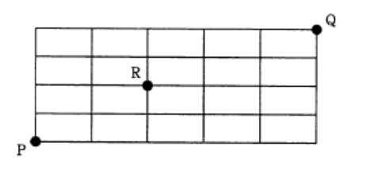
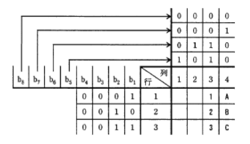
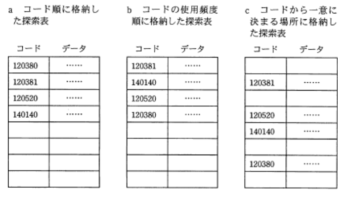
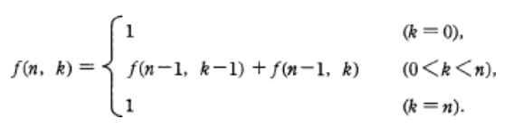
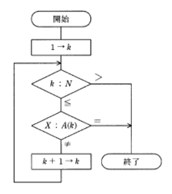
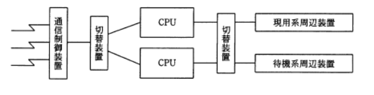
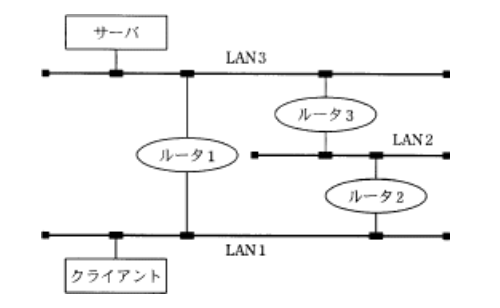
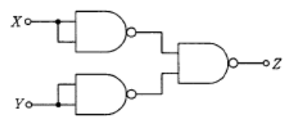
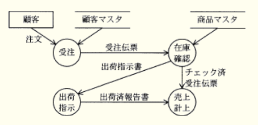
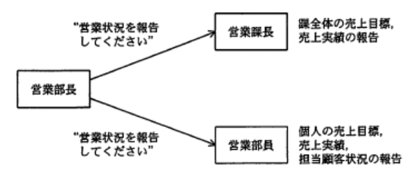

### オリジナル模擬試験問題1

### `テクノロジ系`

---
1.1バイトのデータで0のビット数と1のビット数が等しいもののうち、符号なしの2進整数として見たときに最大になるものを10進整数として表したもの

- A.**240**  
対象となる1バイトのデータは8ビットで構成されるので、0と1の数がそれぞれ4つずつ。  
2進数でも10進数と同様に上位けたほど位が大きくなるので、最大となるのは「1111 0000」のとき

---
2.8ビットのデータの下位2ビットを変化させずに、上位6ビットの全てを反転させる論理演算

- A.**16進数FCと排他的論理和をとる**  
2進数「1111 1100」と排他的論理和をとると、1の箇所は0 => 1、1 => 0に変わる

|x|y|結果|
|-|-|---|
|0|0|0  |
|1|0|1  |
|0|1|1  |
|1|1|0  |

論理演算を利用したビット操作には、論理積(AND)を用いて特定位置のビットを取り出す操作と、排他的論理和(XOR)を用いて特定位置のビットを反転させる操作がある。  
あるビットと1の排他的論理和演算は、被演算ビットが**0であれば結果が1、1であれば結果が0になる**のでビットが反転する特徴をもっている

- 16進数03と排他的論理和をとる  
2進数「0000 0011」と排他的論理和をとると、下2桁ビットが0 => 1、1 => 0に変わる
- 16進数03と論理和をとる
- 16進数FCと論理和をとる

---
3.図の線上を、点Pから点Rを通って、点Qに至る最短経路は何通りあるか

- A.**60通り**

P => Rについて :  
縦に2回、横に2回、計4回の移動の組み合わせなので、  
`4! / (2! * 2!) = 6通り`  
R => Qについて :  
縦に2回、横に3回、計5回の移動の組み合わせなので、  
`5! / (2! * 3!) = 10通り`  
それぞれの積で、`6 * 10 = 60通り`

---
4."A"と"2"をこの順にJISコードで表したもの

- A.**01000001 00110010**  
列番号(上位4ビット)と行番号(下位4ビット)の組み合わせで1つの文字を表す。Aは列番号4、行番号1なので、「0100 0001」、2は列番号3、行番号2なので、「0011 0010」、この2つを繋いだものが答え

---
5.探索の平均計算量が最も小さい探索手法の組み合わせ

- A.**a : 2分探索**
- A.**b : 線形探索**
- A.**c : ハッシュ法探索**

・a : コード順に格納した探索表 :  
線形探索では`(n + 1) / 2`回、二分探索法では`Math.log2(n)`回が平均探索回数となる。データが昇順または降順に整列されている場合は、線形探索よりも二分探索の平均計算量が小さくなる  
・b : コードの使用頻度順に格納した探索表 :  
使用頻度が高いデータが探索表の先頭のほうにたくさんあることになります。線形探索では探索表の先頭から順番に探索していくので、このような探索表が有効な方式。  
２分探索法は、データが整列されていないと使えないという条件があり、この表はハッシュ法に対応していないので、線形探索が唯一使用できる方法  
・c : コードから一意に決まる場所に格納した探索表  
ハッシュ法は、探索データのキー値からそのデータの格納場所(アドレス)を直接計算する方法で、(シノニムが発生しなければ)1回の計算で一意に目的のデータにたどりつくことができる。  
1回の探索でいいので、この探索表の場合、ハッシュ表探索が最も計算量が少ない

---
6.次の関数*f(n, k)* の、*f(4, 2)* の値

f(4, 2)  
= f(3, 1) + f(3, 2)  
f(3, 1)  
= f(2, 0) + f(2, 1)  
= 1 + f(1, 0) + f(1, 1)  
= 1 + 1 + 1 = **3**  
ここまでで、f(3, 1) = 3  
f(3, 2)  
= f(2, 1) + f(2, 2)  
= f(2, 1) + 1  
= f(1, 0) + f(1, 1) + 1  
= 1 + 1 + 1 = **3**  
以上より、*f(4, 2)* = 6

---
7.配列Aの1番目からN番目の要素に整数が格納されている(N > 1)。次の図はXと同じ値が何番目の要素に格納されているかを調べる流れ図。この流れ図の実行結果として正しい記述

- A.**Xと同じ値が配列の1番目とN番目の2か所にある場合、kには1が設定されている**  
値が一致すればループを抜けその後の探索は行われない。そのためkには配列中でXと同じ値をもつ要素のインデックスである1が設定される

流れ図中で変数kは、現在何番目の要素を探索しているかを表す数値を保持する役割をもっている。探索目的の値Xと配列に格納されている値が一致すればループ処理を抜け、このときkには配列中での一致した値をもつインデックスが格納されていることになる

- Xと同じ値が配列中にない場合、kには1が設定されている
- Xと同じ値が配列中にない場合、kにはNが設定されている  
配列中に探索対象の値が無いと配列の最後の要素(k = N番目)まで探索が行われる。その後の処理でkには1が加算され値はN + 1になり、上部"k : N"の分岐によりループを抜けることになる。Xと同じ値が配列中にない場合、kにはN + 1が設定される

- Xと同じ値が配列の1番目とN番目の2か所にある場合、kにはNが設定されている  
値が一致した時点でループを抜けるため1が設定される

---
8.XMLの特徴

- A.**XMLでは、ネットワークを介した情報システム間のデータ交換を容易にするために、任意のタグを定義することができる**  
XML(*eXtensible Markup Language*)は、ユーザが定義したタグを用いて文書構造を記述するマークアップ言語。  
HTMLがWebページを記述するための言語であるのに対して、XMLは、データ交換のための汎用のデータ形式。HTMLで使用するタグは事前に定義済みのものだが、XMLではユーザが新しくタグや属性を定義・使用することが可能

- XMLでは、HTMLにWebページの表示性能の向上を主な目的とした機能を追加している  
XMLはWebサービスのデータ受け渡しにも使用されるが、目的はデータ交換で、表示性能の向上ではない

- XMLで用いることができるスタイル言語は、HTMLと同じものである  
HTMLではスタイル言語にCSS(*Cascading Style Sheets*)が用いられるが、XMLではXSL(*eXtensible Style Language*)というスタイル言語が用いられる

- XMLは、SGMLを基に開発されたHTMLとは異なり、独自の仕様として開発された  
XMLもHTMLと同様にSGML(*Standard Generalized Markup Language*)をベースに開発された

---
9.50MIPSの処理装置の平均命令実行時間

- A.**20ナノ秒**  
MIPS(*million instructions per second*)は、1秒間の命令実行回数を百万単位で表すCPU性能の指標。50MIPSであれば1秒間に5,000万回の命令時を実行できるという意味。1命令当たりの実行時間は、  
1秒 / 5,000万回(5 * 10の7乗)  
= 2 * 10の-8乗  
= 20 * 10の-9乗  
= 20ナノ秒

---
10.外部割り込みに分類されるもの

- インターバルタイマによって、指定時間経過時に生じる割込み  
タイマ割り込みは、CPUの内部で発生するものではなく、内蔵されるタイマーで設定してある時間が経過した時に外部から割り込みを発生される

割り込み(*interrupt*)は、すぐに対処しなければならない問題などシステムに生じた時に、実行中のプログラムの処理を一旦停止し、優先的に事象の解決を図ることを可能にする仕組み。実行中のプログラムが原因でCPU内部で発生する内部割り込みと、それ以外のCPU外部で発生する外部割り込みに分類することができる

- 演算結果のオーバーフローやゼロによる除算で生じる割込み
- 仮想記憶管理において、存在しないページへのアクセスによって生じる割込み
- ソフトウェア割込み命令の実行によって生じる割込み
=> 全て内部割り込みに分類される

---
11.システムA、Bのキャッシュメモリと主記憶のアクセス時間は表の通り(単位 : ナノ秒)。あるプログラムをシステムAで実行したときのキャッシュメモリのヒット率と実効アクセス時間は、システムBで実行したときと同じになった。このときのキャッシュメモリのヒット率

|             |システムA|システムB|
|-------------|--------|-------|
|キャッシュメモリ|15      |10     |
|主記憶        |50      |70     |

- A.**0.8**  
メモリの実効アクセス時間は、キャッシュメモリと主記憶が存在する場合、実際の1アクセスに要する平均時間。求めるための公式は、  
`(キャッシュメモリのアクセス時間 * ヒット率) + 主記憶のアクセス時間 * (1 - ヒット率)`  
2つのシステムの実効アクセス時間が同じなので、ヒット率を文字hとして方程式を用いてヒット率を求める  
15h + (50(1 - h)) = 10h + (70(1 - h))  
50 - 35h = 70 - 60h  
25h = 20  
h = **0.8**

---
12.主記憶装置の高速化の技法として、主記憶を幾つかのアクセス単位に分割し、各アクセス単位をできるだけ並行動作させることによって実効アクセス時間を短縮する方法

- A.**メモリインタリーブ**  
物理上はひとつである主記憶領域を、同時アクセス可能な複数の論理的な領域(バンク)に分け、それぞれのバンクに対してデータの読み書きを並列で行うことにより、メモリアクセスの高速化を図る技術。奇数アドレスはバンク1、偶数アドレスはバンク2というように、連続したアドレスを複数のバンクに割り振っていく。通常は、連続するアドレスに次々とアクセスされることが多いため、見かけ上並列アクセスしているようになり、実効アクセス時間が短くなる。「主記憶に並列アクセス」がキーワード

- 仮想記憶  
プログラムが必要とするメモリサイズが主記憶のサイズを上回った場合、補助記憶装置(HDDなど)を仮想アドレス空間として使用することで、主記憶のサイズよりも大きなプログラムを実行可能にする方式

- キャッシュメモリ方式  
主記憶は補助記憶と比べ高速だがCPUと比較すると随分動作が遅く、この速度差からCPUが主記憶にアクセスしている間はCPUに待ち時間が生じ、処理効率の低下を招いてしまう。キャッシュメモリは、主記憶とは異なる半導体を使用した非常に高速にアクセスできるメモリで、このようなCPUと主記憶の速度差を埋め、CPUの処理効率を向上させる役割をもっている

- ダイレクトメモリアクセス(DMA)  
コンピュータシステム内でのデータ転送方式の1つ。CPUを介さずに周辺機器やメインメモリ(RAM)などの間で直接データ転送を行う方式

---
13.CPUや低速の入出力装置などで構成されるシステムの処理効率の向上を図るために、入出力データを一時的に磁気ディスク装置に蓄える処理方式

- A.**スプーリング**  
CPUと低速な入出力装置の動作を独立して並列実行するため、低速入出力装置(プリンタなど)への入出力を磁気ディスク装置などの高速な外部記憶装置を介して実行する機能。CPUは低速な入出力装置の動作完了を待つことなく次の処理に移れるのでCPUの使用効率が増し、システムのスループットを向上させる効果が期待できる

- キャッシング  
使用頻度の高いデータを低速な記憶装置ではなくメモリ上に格納しておくことで、読出しを高速化する手法

- スラッシング  
仮想記憶のページング方式で、ページインとページアウトが頻発して処理速度が遅くなる現象

- ページング  
仮想記憶管理方式の1つで仮想アドレス空間と主記憶空間を、ページと呼ばれる固定長の区画に分割し、ページ単位で主記憶と補助記憶装置のアドレス変換を行う方式

---
14.PCと周辺機器などを無線で接続するインターフェイスの規格

- A.**Bluetooth**
免許申請や使用登録の不要な2.4GHz帯の電波を用いて、数mから100m程度の距離の情報機器間で、電波を使い最大24Mbpsの無線通信を行う規格。パソコン周辺機器の接続、ゲーム機、ハンズフリー通話、ヘッドフォンなどに幅広く普及してきている

- IEEE1394  
パソコンと周辺機器を接続するためのシリアルインターフェイスの規格で、FireWireとも呼ばれる。無線の接続方法ではなくケーブルで接続する

- PCI(*Peripheral Component Interconnect*)  
コンピュータのプロセッサと周辺機器との間の通信を行うためのパスアーキテクチャの1つ

- USB2.0(*Universal Serial Bus version 2.0*)  
現在最も普及している周辺機器接続のためのシリアルインターフェイス規格。USBにもWirelessUSBという無線のインターフェイスが存在する

---
15.フォールトトレラントシステムの説明

- A.**システムが部分的に故障しても、システム全体としては必要な機能を維持するシステム**  
システムの一部に障害が発生しても全体としては停止することなく稼働を続け、その間に復旧を図るような設計となっているシステム

- 地域的な災害などの発生に備えて、遠隔地に予備を用意しておくシステム  
遠隔地にバックアップサイトを用意するシステムは、待機状態によってホットサイト、ウォームサイト、コールドサイトと呼ばれる

- 複数のプロセッサがネットワークを介して接続され、資源を共有するシステム  
マルチプロセッサシステムの説明

- 複数のプロセッサで1つのトランザクションを並行して処理し、結果を照合するシステム  
デュアルシステムの説明

---
16.2系統のシステムで構成され、一方は現用系としてオンライン処理を行い、もう一方は待機系として現用系の故障に備えている。通常、待機系はバッチ処理を行っている。このようなシステム構成

- A.**デュプレックスシステム**  
主系と待機系からなる2系列の処理システム構成。通常時は主系でオンライン処理、待機系でバッチ処理を行っているが、主系の障害発生時には、主系で行っていたオンライン処理を待機系に引き継ぎ処理を継続する。2系統ある現用系(主系)と待機系を装置によって切り替え可能になっている

- シンプレックスシステム  
全ての機器が1系統で構成されるシンプルなシステム。安価に構築できるが耐障害性は低くなる

- デュアルシステム  
同じ処理を2組のコンピュータシステムで行い、その結果を照合機でチェックしながら処理を進行していくシステム構成

- パラレルプロセッサシステム  
1つのシステムに複数のCPUがあり並列処理ができるコンピュータシステム。CPUの障害時には故障したCPUを切り離して継続稼働できるが、それ以外の機器は二重化していない

---
17.3層クライアントサーバシステム(*client-server system* : C / S)を構成する各層を、クライアント側に近い順に並べたもの

- A.**プレゼンテーション層, ファンクション層, データベースアクセス層**  
サービスを要求する側(クライアント)と、サービスを提供するサーバに分離したコンピュータネットワークの形態。  
3層クライアントサーバシステムでは、ユーザの入出力を担当する`プレゼンテーション層`、業務処理に依存するデータ加工を行う`ファンクション層`、DB処理を行う`データベースアクセス層`の3層に分離したモデル

---
18.図のようなLAN設備がある。LAN1のクライアントはLAN3に接続されているサーバを使用して業務処理を行っている。通常はルータ1を介して通信を行っているが、ルータ1の故障時にはルータ2, 3を介して通信を行う。このLAN1とLAN3をつなぐLAN設備の稼働率は幾らか。各ルータの故障率は0.1とし、故障時の切替えに時間はかからず、ルータ以外のLAN設備の故障は考慮しない

- A.**0.981**  
各ルータの稼働率は0.9。LAN1とLAN3が通信するためには、ルータ1、またはルータ2・ルータ3の両方ともが稼働している必要がある。ルータ2・ルータ3が直列に接続されている部分の稼働率は、  
0.9の2乗 = 0.81  
ルータ1も並列に接続されているので、  
1 - (1 - 0.9)(1 - 0.81)  
= 1 - 0.1 * 0.19  
= 1 - 0.019 = 0.981

---
19.あるシステムは5,000時間の運用において、故障回数は20回、合計故障時間は2,000時間だった。おおよそのMTBF、MTTR、稼働率の組み合わせ

- A.**MTBF : 150時間**
- A.**MTTR : 100時間**
- A.**稼働率 : 60%**

MTBF(*Mean Time Between Failures*) :  
システムが修理され正常に稼働し始めてから、次回故障するまでの平均故障間隔  
MTTR(*Mean Time To Repair*) :  
平均修理時間のことで、システムを修理するために要した平均時間  
稼働率(アベイラビリティ) :  
ある期間の間に、システムが正常に稼働している割合  
運用時間5,000時間の中で故障が20回あり、その合計時間が2,000時間なので、MTTRは、  
`2,000時間 / 20回 = 100時間`  
正常に稼働していたのは3,000時間なので、故障回数で割るとMTBFは、  
`3,000時間 / 20回 = 150時間`  
稼働率は、  
`3,000 / 5,000 = 60%`

---
20.仮想記憶システムにおいて主記憶の容量が十分でない場合、プログラムの多重度を増加させるとシステムのオーバーヘッドが増加し、アプリケーションのプロセッサ使用率が減少する状態を表すもの

- A.**スラッシング**  
仮想記憶システムにおいて主記憶の容量が不十分な場合にプログラムの多重度が増加すると、ページング処理が多発する。このようにシステムのオーバーヘッドが増加したこよによりアプリケーションのCPU使用率が減少し、処理速度が遅くなる(*thrashing*)

- フラグメンテーション  
主記憶や補助記憶装置の記憶領域の中に使用されない領域の断片が多く存在した状態になる現象。連続したメモリ領域を確保しにくくなりアクセス効率が低下する

- ページング  
仮想記憶管理方式の1つで仮想アドレス空間と主記憶空間をページと呼ばれる固定長の区画に分割し、このページ単位で主記憶と補助記憶装置のアドレス変換を行う方式

- ボトルネック  
処理性能や通信性能の向上を阻む支障となっている要素のこと

---
21.Java Servlet(サーブレット)の説明

- A.**Javaで開発されたプログラムであり、クライアントの要求に応じてWebアプリケーションサーバ上で実行される**  
Javaを用いてWebページのためのHTML文書を動的に生成したり、データ処理を**Webサーバ上で**行うサーバサイドのプログラム技術。Java言語で書かれているので様々なプラットフォームで使える利点がある

- Javaで開発されたプログラムであり、サーバからダウンロードして実行される  
Javaアプレットの説明

- Javaで開発されたプログラムをアプリケーションの部品として取り扱うための規約である  
Java Beansの説明

- Javaで開発されたプログラムを実行するインタプリタであり、バイトコードと呼ばれる中間コードを実行する機能をもつ  
Java仮想マシンの説明

---
22.各種言語プロセッサの説明

- A.**ジェネレータは、入力・処理・出力などの必要な条件をパラメータで指示することによって、処理目的に応じたプログラムを生成する**  
繰り返し動作の振る舞いを少ない記述で制御するために用いられる特殊なサブルーチン(他の処理(間数)から呼び出される処理(間数))で、必要条件をパラメータで指定することで、パラメータに応じたプログラムを自動で生成する

- アセンブラは、ある処理系用に書かれた原始プログラムを、他の処理系用の原始プログラムに変換する  
トランスレータの説明

- インタプリタは、他のコンピュータ用のプログラムを解読し、実行するマイクロプログラムである  
エミュレータの説明

- トランスレータは、高水準言語で書かれたプログラムを、解釈しながら実行する  
インタプリタの説明

---
23.プログラミングツールに関する記述

- A.**デバッグ時にデータ構造の内容を確認するためのツールをインスペクターという**  
プログラム実行中のある時点での変数の値、構造体のような複雑なデータ構造、ポインタで繋がれたデータの値などを容易に確認できるようにしたデバッグツール

- プログラム単位の機能説明や定義を容易に探索するためのツールをトレーサという  
トレーサは、プログラムの実行過程を1命令単位で時系列にモニタリングできるツール

- プログラム内又はプログラム間の実行経路を確認するためのツールをシミュレーターという  
シュミレータは、実際に実験を行うのではなくコンピュータプログラム上で模擬試験をするためのツール

- プログラムのソースコードを編集するために、文字の挿入、削除、置換えなどの機能をもつツールをブラウザという  
エディタの説明。ブラウザはインターネットを閲覧するために使用するソフトウェア

---
24.HTMLとXMLの特徴の比較

- A.**HTMLでは要素によっては終了タグを省略できるが、XMLでは開始タグと終了タグで内容を囲むか、空要素の形式で記述する必要がある**  
XMLでは終了タグは省略できない

- HTMLでは属性値をすべて二重引用符(")または一重引用符(')で囲む必要があるが、XMLではその必要がない  
HTMLでは属性値を引用符で囲まないこともできるが、XMLでは属性値の引用符囲みは必須

- HTMLではユーザーが独自に要素を定義できるが、XMLでは言語仕様で決められた要素だけが有効である  
XMLではユーザが独自にタグを定義できる

- HTMLでは要素名の大文字と小文字を区別するが、XMLでは区別しない  
HTMLでは大文字と小文字の区別がないが、XMLでは区別される

---
25.電気信号によってデータの書換え、消去が可能なメモリであり、電源を切っても内容を保持できるもの

- A.**フラッシュメモリ**  
区分的にはEEPROMの一種で、ROM(*Read Only Memory*)に分類されるが、書き換えが可能なためROMでもRAMでもない存在として別に分類されている場合もある。  
フラッシュメモリは、「書き換え可能」「電源を切ってもデータが消えない」「電気的に消去・書込みが可能」という特徴をもち、USBメモリやSDカードなどが携帯電話、デジカメ、デジタルオーディオプレーヤーなどの記憶媒体として広く普及している

- DRAM(*Dynamic RAM*)  
コンピュータの主記憶に使用されるメモリ。電源を切ると記憶情報が失われてしまう(揮発性メモリ)

- SRAM(*Static RAM*)  
DRAMよりも高速に動作し、キャッシュメモリに使用されるメモリ。電源を切ると記憶情報が失われてしまう(揮発性メモリ)

- マスクROM  
記憶されている情報の書き換えができない読出し専用の不揮発性のメモリ

---
26.NAND回路による組合せ回路の出力Zを表す式。画像はNAND回路、・は論理積、+は論理和、XバーはXの否定

- A.**X + Y**  
NAND(*Not AND*)回路は、AND回路の否定なので2つの入力が1の時だけ0を出力し、その他では1を出力する。X, Yがそれぞれ0, 1の場合のZの値は以下の通り

|X|Y|Z(OR回路と同等)|
|-|-|-------------|
|0|0|0            |
|1|0|1            |
|0|1|1            |
|1|1|1            |

|X|Y|Z(NAND回路)|
|-|-|----------|
|0|0|1         |
|1|0|1         |
|0|1|1         |
|1|1|0         |

X, Y両方が0の場合だけZは0で、それ以外ではZは1なので、この回路図はOR回路の出力と同じになる

|X|Y|Z(論理積, and回路)|
|-|-|----------------|
|0|0|0               |
|1|0|0               |
|0|1|0               |
|1|1|1               |

|X|Y|Z(論理和, or回路)|
|-|-|---------------|
|0|0|0              |
|1|0|1              |
|0|1|1              |
|1|1|1              |

---
27.ポインティグデバイスに分類される機器

- A.**タブレット**  
マウスより繊細で正確にポインタ操作ができるため、コンピュータ上でのイラスト・絵画製作に用いられている

ポインティングデバイスはコンピュータのうち入力装置に分類され、ディスプレイに対して位置や現在の状況を指示・入力するための装置(マウス、タッチパッドなどが代表)

- OCR(*Optical Character Reader*)  
光学式文字読取装置のことで、パターンマッチング技術を用いて書かれた文字を解析し読み取る

- キーボード  
入力装置だが、文字入力を基本とした機器で、ポインティング絵バイスではない

- スキャナー  
入力装置だが、画像情報を取り込むための機器で、ポインティングデバイスではない

---
28.取引先ごとの売掛金の上限額と現在までの売掛金の合計値が、取引先マスタファイルに登録されている。このとき、新たな注文による取引を、売掛金の上限額の点から受け付けてよいかどうかを調べる

- A.**リミットチェック**  
新たな注文に対してチェックしなければならないことは、現在の売掛金の額と新たな注文の額を足した場合に売掛金の上限額を超えないかどうか。入力データの上限(下限)が予め分かっている時に、入力データが範囲内に収まっているか検査をすること

- シーケンスチェック  
データが決められた順序で入力されているかを検査すること

- 重複チェック  
入力データが既に入力済みでないかを検査すること

- フォーマットチェック  
入力データの長さや並び順などが決められた書式になっているかを検査すること

---
29.音声のサンプリングを1秒間に11,000回行い、サンプリングした値をそれぞれ8ビットのデータとして記録する。`32 * 10の6乗バイト`の容量をもつUSBフラッシュメモリに、最大およそ何分の音声を記録できるか

- A.**約48分**  
8ビット = 1バイトなので、1秒間で11kバイトの容量が必要。フラッシュメモリの容量は32 * 10の6乗バイトなので、  
(32 * 10の6乗) / (11 * 10の3乗)  
= 約2.9 * 10の3乗s  
= 約2900s = 約48.3min

---
30.バーチャルリアリティ(*Virtual Reality*)の説明

- A.**コンピュータで模倣した物体や空間を、コンピュータグラフィックスなどを使用して実際の世界のように知覚できるようにすることである**  
仮想現実と訳され、コンピュータなどによって作り出された世界をコンピュータグラフィックスなどを利用してユーザーに体験させる技術。  
単にコンピュータグラフィックスを見せるだけでなく、ユーザが仮想世界に働きかけることができ、人間の五感のいずれかにその反応が返ってくることで人工的な現実感の経験ができる

- 画像を上から順次表示するのではなく、モザイク状の粗い画像をまず表示して、徐々に鮮明に表示することによって、GUIを改善することである  
インターレースの説明

- 自動車や飛行機の設計に使われている風洞実験などの代わりに、コンピュータを使用しても模擬実験することである  
コンピュータ・シミュレーションの説明

- 別々に撮影した風景と人物をコンピュータを利用して合成し、実際とは異なる映像を作ることである  
デジタル合成写真の説明

---
31.データの正規化に関する記述

- A.**データの重複や矛盾を排除して、DBの論理的なデータ構造を導き出す**  
データの正規化はDBを構築する際にデータの重複や矛盾を排除して、データの整合性と一貫性を図るために行われる

- 関係DBに特有なDB構築技法であり、データの信頼性と格納効率を向上させる  
目的はデータの一貫性と整合性の確保

- DBの運用管理を容易にするために、レコードをできるだけ短く分割する  
目的は保全性のためではない

- ファイルに格納するデータの冗長性をなくすることによって、アクセス効率を向上させる  
目的はデータの一貫性と整合性の確保

---
32.学生表と学部表に対し次のSQL文を実行した結果。上が学生表、下が学部表

`select 氏名 from 学生, 学部 where 所属 = 学部名 and 学部.住所 = "新宿"`

|氏名   |所属 |住所|
|------|----|----|
|合田知子|理  |新宿|
|青木俊介|工  |渋谷|
|川内聡 |人文 |渋谷|
|坂口祐子|経済|新宿|

|学部名|住所|
|-----|---|
|理   |新宿|
|工   |新宿|
|人文 |渋谷|
|経済 |渋谷|

- A.(以下回答)

|**氏名**   |
|----------|
|**合田知子**|
|**青木俊介**|

(以下解説)  
問題のSQL文は、「学生表の所属カラム」と「学部表の学部名表の学部名カラム」で結合して、学部表の住所が新宿の行を取り出し、氏名カラムのみを抜き出す、という意味

|`氏名`   |所属 |住所|学部名|住所 |
|--------|----|----|-----|-----|
|`合田知子`|理  |新宿|理   |`新宿`|
|`青木俊介`|工  |渋谷|工   |`新宿`|
|川内聡   |人文 |渋谷|人文  |渋谷 |
|坂口祐子  |経済|新宿|経済  |渋谷  |

---
33.関係DB管理システムにおけるスキーマ(*schema*)の説明

- A.**データの性質、形式、ほかのデータとの関連などのデータ定義の集合である**  
データの内容、論理構造、記憶形式や編成などDBの構成を記述したもの。ANSI / X3 / SPARCではスキーマを、概念スキーマ・外部スキーマ・内部スキーマの3つのグループに分ける提案を行い、これを3層スキーマアーキテクチャと呼ぶ

- 実表ではない、利用者の視点による仮想的な表である  
ビューの説明

- データの挿入、更新、削除、検索などのDB操作の総称である  
SQL(*Structured Query Language*)の説明

- DBの一貫性を保持するための各種制約条件の総称である  
整合性制約の説明

---
34.DBの排他制御に関する記述

- A.**あるトランザクションによって共有ロックがかけられている資源に対して、別のトランザクションから共有ロックをかけることは可能である**

共有ロック :  
データを読込む時に使うロックで、この状態では他のトランザクションによる更新処理ができなくなる  
占有ロック :  
データを更新する時に使うロックで、この状態では他のトランザクションから読込みや更新ができなくなる  
ある資源に対して`共有ロック`がかけられている場合のみ、別のトランザクションから`共有ロック`をかけることが可能。その他の場合は、その資源に対してロックをかけることはできない

|獲得するロック(右) 資源の状態(下)|共有ロック|占有ロック|
|--------|----|---|
|共有ロック|可  |不可|
|占有ロック|不可|不可|

- あるトランザクションによって共有ロックがかけられている資源に対して、別のトランザクションから占有ロックをかけることは可能である  
共有ロックが掛けられていると更新処理が禁止されるので、占有ロックをかけることはできない

- あるトランザクションによって占有ロックがかけられている資源に対して、別のトランザクションから共有ロックをかけることは可能である  
占有ロックが掛けられていると読込みや更新が禁止されるので、その他のロックをかけることはできない

- あるトランザクションによって占有ロックがかけられている資源に対して、別のトランザクションから占有ロックをかけることは可能である  
占有ロックが掛けられていると読込みや更新が禁止されるので、その他のロックをかけることはできない

---
35.関係DBの表aに対して、表bとcを得る操作の組み合わせ

c

- A.**表b : 選択**  
表aから特定のレコードを取り出した表。つまり、表から選択したレコードを取り出す操作をしている

- A.**表c : 射影**  
表aから"山岳名称"カラムを取り出した表。つまり、表から選択したカラムを取り出す操作をしている

---
36.運用中のDBに対し、定期的に再編成処理を行う目的

- A.**DBに対し、追加、更新、削除を繰り返すと、再利用されない領域が発生し、DBの使用領域の増大と処理速度の低下を招く。不連続な空き領域を整理して、性能劣化を回避するために行う**  
再編成は、DB内にレコードの追加や削除によって断片的な未使用領域が増加した場合や、繋がりのあるレコードが非連続的な領域に格納され、順次アクセスの効率が低下した場合に行われる処理。DBシステムでは、記憶領域の効率的な使用とデータアクセスの速度向上のために定期的な再編成が必要となる

---
37.制御用符号を含む長さ400バイトのデータを1時間当たり3,600件送信したい。伝送効率が60%の時、要件を満たす最低の回線速度

- A.**9,600ビット / s**  
1秒当たりの送信量は、  
400 * 8 = 3,200ビット  
伝送効率は6割なので、  
回線速度 > 3,200 / 0.6 = 5,333ビット / s  
5,333ビット / sの回線であれば条件を満たす

---
38.OSI基本参照モデルの第3層に位置し、通信の経路選択機能や中継機能を果たす層

- A.**ネットワーク層**  
エンドシステム間のデータ転送を実現するために、ルーティング(通信経路選択)や中継などを行う役割をもつ  
アプリケーション層(第7層)  
最も利用者に近い部分であり、ファイル転送や電子メールなどの機能が実現されている  
プレゼンテーション層(第6層)  
データの表示形式を管理したり、文字コードやエンコードの種類などを規定する役割をもつ  
セッション層(第5層)  
アプリケーションプロセス間での会話を構成し、同期をとり、データ交換を管理するために必要な手段を提供する役割をもつ  
トランスポート層(第4層)  
エラー検出 / 再送などの伝送制御を担い通信の品質を保証する役割をもつ  
データリンク層(第2層)  
隣接ノード間の伝送制御手順(誤り検出、再送制御など)を提供する役割をもつ  
物理層(第1層)  
物理的な通信媒体の特性の差を吸収し、上位の層に透過的な伝送路を提供する役割をもつ

---
39.TCP / IPの環境で使用される使用されるプロトコルのうち、構成機器や障害時の情報収集を行うために使用されるネットワーク管理プロトコル

- A.**SNMP(*Simple Network Management Protocol*)**  
TCP / IPネットワーク上でネットワーク上の機器の情報を収集して、監視や制御を行うためのプロトコル。マネージャと呼ばれる管理システムとエージェント(ルータやスイッチに組み込まれている機器の1つ)の間で、管理に必要な情報をやり取りする方法を定めている

- NNTP(*Network News Transfer Protocol*)  
インターネット乗で情報を交換し合う電子掲示板システムであるNetNewsの記事を読むことと投稿するために使われるプロトコル

- NTP(*Network Time Protocol*)  
ネットワークに接続されている環境において、機器が持つ時計を正しい時刻(協定世界時 : UTC)へ同期するための通信プロトコル

- SMTP(*Simple Mail Transfer Protocol*)  
インターネット環境において、クライアントからサーバにメールを送信したり、サーバ間でメールを転送するのに用いられるプロトコル

---
40.クライアント管理ツールに備わっている機能のうち、業務に無関係なソフトウェアがインストールされていないことを確認する最も有効なもの

- A.**インベントリ収集**  
インベントリ(*inventory*)は、企業などで使用されている情報機器の資産情報のこと。企業のPC、インストールされているソフトウェア、プリンタ、CPU、メモリなどは全て該当する。インベントリ収集ツールは、利用者側のPCを個別操作をせずに、PCの情報を得ることができるソフトウェア。ソフトウェアのバージョンも収集できるため、ソフトウェアアップデートが行われず脆弱性が放置されているPCなども洗い出すことができる

---
41.ある商店が、顧客からネットワークを通じて注文を受けるために、公開鍵暗号方式を利用し、注文の内容が第三者にわからないようにする。商店、顧客それぞれが利用する鍵の種類

- A.**商店 : 秘密鍵**
- A.**顧客 : 公開鍵**  
公開鍵暗号方式は、暗号化と複合に異なる鍵を使用する暗号方式。暗号化鍵は誰もが使用できるように公開し(公開鍵)、復号鍵は受信者が厳重に管理する(秘密鍵)。  
暗号化鍵と復号鍵は一対のペアとして生成され、1つの暗号化鍵で暗号化されたデータは、その鍵のペアである復号鍵でしか元のデータに戻せないため、復号を行えるのは正当な受信者のみであることが保証されている。  
不特定多数の顧客は商店へ注文をするときに商店の公開鍵を用いて通信内容を暗号化する。商店は暗号化された注文データを秘密鍵を用いて復号するという手順で暗号通信が実現できる

---
42.フィッシング(*phishing*)の手口に該当するもの

- A.**電子メールを発信して受信者を誘導し、実在する会社などを装った偽のWebサイトにアクセスさせ、個人情報をだまし取る**  
銀行やクレジットカード会社、ショッピングサイトなどの有名企業を装ったメールを送付し、個人情報を不正に搾取する行為。メール本文内のハイパーリンクをクリックさせることで、本物そっくりな偽のWebサイトに誘導し、設置してある入力フォームに入力した情報などの個人情報を不正に収集するインターネットを用いた詐欺の一種

- Webページに入力した内容をそのまま表示する部分がある場合、ページ内に悪意のスクリプトを埋め込み、ユーザとサーバに被害を与える  
クロスサイトスクリプティング(XSS)の手口

- ウイルスに感染したコンピュータを、インターネットなどのネットワークを通じて外部から操る  
ボットの手口

- コンピュータ利用者のIPアドレスやWebの閲覧履歴などの個人情報を、ひそかに収集して外部へ送信する  
スパイウェアの手口

---
43.コンピュータウイルス対策で用いられるウイルス定義ファイルに関する記述

- A.**既知ウイルスのシグネチャコードを記録したファイルであり、ウイルス対策ソフトがウイルス検出時に使用する**  
ウイルス定義ファイルは、ウイルスが持つ特徴的なコードをパターン(シグネチャコード)として収録したファイルで、ウイルス対策ソフトがウイルスを検出するために使われる。検査対象のファイルとウイルス定義ファイル内の様々なパターンを比較することで、ウイルスの検出を試みる方法をパターンマッチング方式という

---
44.バイオメトリクス認証システムの判定しきい値を変化させる時の、FRR(本人拒否率)とFAR(他人受入率)の関係

- A.**FRRを減少させると、FARは増大する**  
バイオメトリクス認証は、指紋・虹彩・顔など人間の身体的な特徴や行動の特性など個人に固有の情報を用いて本人の認証を行う方式。  
精度は本人拒否率(*False Rejection Rate*)と他人受入率(*False Acceptance Rate*)の組合せで評価される。「本人であるにも関わらず本人ではないと判断されてしまう確率」「他人であるにも関わらず本人であると誤認してしまう確率」の両者はトレードオフの関係にあり、一方を減少させると他方は増大することになる。通常は十分なセキュリティを確保するため本人拒否率よりも他人受入率が十分に低くなるように設定されている

---
45.ユースケースは、システムへの機能的要求を明確にする手段として、利用者とシステムとのやり取りを定義したものである。ユースケースを利用してモデル化するのが適切なもの

- A.**預金者がATMから現金を引き出す**  
システムとユーザがやり取りを行う業務であるため、ユースケースを用いてモデリングすることが適切な事例

ユースケース図は、オブジェクトモデリング言語であるUMLに含まれる、システムが外部に提供する機能(ユースケース)とシステムのユーザ(アクタ)の関連を表現する図。システムに要求される機能をユーザの視点から示したものであるため、主に要求分析段階でユーザの要件を特定するために作成される  
アクタ :  
・システムのユーザが果たす役割を表す  
・システムと活発に情報交換したり、システムから受動的に情報を受け取ったりする  
・人間、ハードウェア、外部システムが該当し得る  
ユースケース :  
・アクタとシステムとの間の対話をモデル化する  
・アクタによって開始され、システムのある機能を実行する  
・システムのユーザがシステムを利用して遂行する単位業務の1つを抽象化したもの

---
46.DFD(*Data Flow Diagram*)の説明

- A.**適用業務をデータの流れに注目して視覚的に表現したもの**  
データの流れに着目し、データフロー・プロセス・データストア・源泉の4つの構成要素を組み合わせることで、対象となる業務のデータの流れと処理の関係を分かりやすく図式化する構造化分析手法

- 業務などの処理手順を流れ図記号を用いて視覚的に表現したもの  
フローチャート(流れ図)の説明

- システムの状態がどのように遷移していくかを視覚的に表現したもの  
状態遷移図の説明

- 実体及び実体感の関連という概念を用いてデータの構造を視覚的に表現したもの  
ER図の説明

---
47.図において"営業状況を報告してください"という同じ指示(メッセージ)に対して、営業課長と営業部員は異なる報告(サービス)を行っている。オブジェクト指向において、このような特性を表す用語

- A.**多様性**  
ポリモルフィズムとも呼ばれる。オブジェクトの操作呼び出しが、呼び出し側でなく受けて側の特性で決まる特性。同じメッセージを送っても受けてによて行われる操作が異なる様子。  
この問題では、同じ指示(メッセージ)を異なるオブジェクト(営業課長、営業部員)に送った時、異なるサービスが返されている

- カプセル化(情報隠蔽)  
オブジェクトの内部を隠蔽(ブラックボックス化)すること。使う人は内部の情報を知らなくてもオブジェクトを扱うことができる

- インヘリタンス(継承)  
あるクラスが上位にあたるクラスの特性を引き継いでいる関係のこと。上位の特性を引き継ぐことで差分プログラミングが可能となる

---
48.ホワイトボックステストの説明

- A.**モジュールの内部構造に注目してテストする**  
プログラムやモジュールの単体テストとして実施されるテスト手法で、内部構造に基づき仕様書どおりに動作するかを検証するために実施される。内部構造が明らかな状態でテストを行うことからホワイトボックステストと呼ばれている。  
このテストではモジュール内部に内存しているバグを取り除くことを目的としているため、内部仕様上の分岐条件などを可能な限り網羅しているテストケースを作成することが重要で、テストケースの網羅方法としては、命令網羅・判定条件網羅・条件網羅・判定条件 / 条件網羅・複数条件網羅などいくつかの方法が存在する

- 下位のモジュールから上位のモジュールへと、順次結合してテストする  
結合テストの1つであるボトムアップテスト

- 上位のモジュールから下位のモジュールへ、順次結合してテストする  
結合テストの1つであるトップダウンテスト

- モジュールの内部構造を考慮することなく、仕様書どおりに機能するかどうかをテストする  
ブラックボックステスト

---
49.*Java Script*の非同期通信機能を使うことで、画面遷移が起こらない動的なユーザインターフェイスを実現する技術

- A.***Ajax***(*Asynchronous JavaScript + XML*)  
*Java Script*がもつ非同期通信機能を用いてインターフェイスの構築などをウェブブラウザ内で行う技術の総称。  
Webブラウザのみで動作することが特徴で、非同期通信でサーバからデータを取得し、データの内容によってダイナミックHTMLで画面を動的に書き換えることで画面遷移を伴わない動的なWebアプリケーションを実現している。  
検索エンジンのキーワード入力中に内容によって候補が表示されたり、キー入力の度にリアルタイムに検索結果を表示する機能にも*Ajax*が使われており、GmailやGoogleMapがある

- *JSF*(*Java Server Faces*)  
Webアプリケーションのインターフェイスを構築するためのフレームワーク

- *RSS*  
ニュースやブログなど各種のウェブサイトの更新情報を簡単にまとめ、配信するための幾つかの文書フォーマット

- *SNS*(*Social Network Service*)  
mixi、GREE、モバゲータウンなど社会的ネットワークをインターネット上で構築するサービス

---
50.システムを上流工程から下流工程まで順番に進める時、システムの利用者によるテストの段階で大幅な手戻りが生じることがある。それを防ぐために、早い段階で試作ソフトウェアを作成して利用者の要求事項を明確にする方法

- A.**プロトタイピング**  
開発の早い段階から試作品(プロトタイプ)を作り、利用者の確認を得ながら開発を進めていく手法。試作品を作ることでシステムについての誤解を早い段階で発見でき、下流工程での手戻りの可能性を少なくできる
