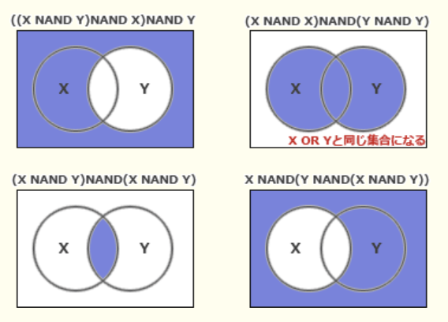
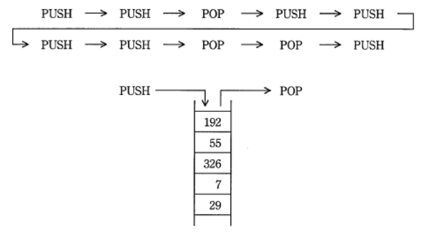
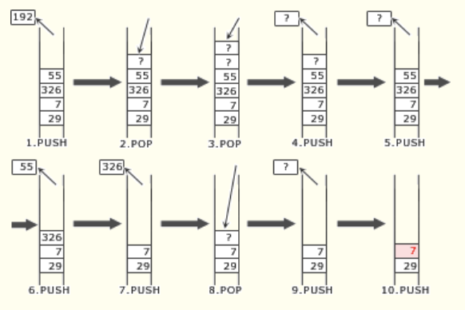
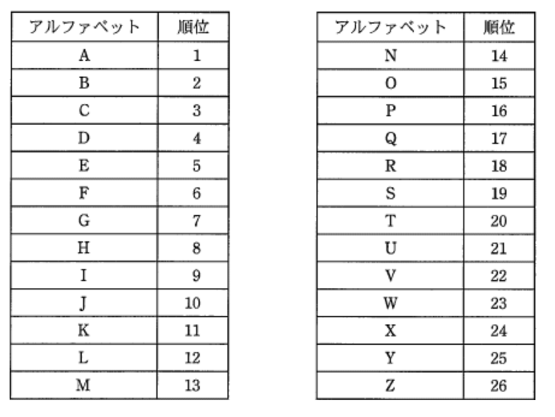

### オリジナル模擬試験問題2

### `テクノロジ系`

---
1.次に示す手順は、列中の少なくとも1つは1であるビット列が与えられた時、最も右にある1を残し、他のビットを全て0にするアルゴリズムである。例えば、`00101000`が与えられた時、`00001000`が求まる。aに入る論理演算  
手順1 : 与えられたビット列Aを符号なしの2進数と見なし、Aから1を引き、結果をBとする  
手順2 : AとBの排他的論理和(XOR)と求め、結果をCとする  
手順3 : AとCの`a`を求め、結果をAとする

- A.**論理積(AND)**  
`00101000`(A)  
`00001111`(C) => 00001000

`00101000`(A)を処理する場合を想定する  
手順1 : 1を引くと、`00100111`(B)  
手順2 : `00101000` XOR `00100111` => `00001111`(C)  
手順3 : `00101000`(A)と`00001111`(C)を比較  
`00101000`(A)  
`00001111`(C)

- 排他的論理和(XOR)  
`00101000`(A)  
`00001111`(C) => 00100111

- 否定論理積(NAND)  
`00101000`(A)  
`00001111`(C) => 11110111

- 論理和(OR)  
`00101000`(A)  
`00001111`(C) => 00101111

---
2.XとYの否定論理積`X NAND Y`は、`NOT(X AND Y)`として定義される。`X OR Y`をNANDだけで表した論理式

- A.**(X NAND X) NAND (Y NAND Y)**  
X = Y = 0の場合、  
`(0 NAND 0) NAND (0 NAND 0)` = **0**  
X =1, Y = 0の場合、  
`(1 NAND 1) NAND (0 NAND 0)`  
= `0 NAND 1` = **1**

`X OR Y` : 論理和。X, Yの**どちらか一方でも1であれば1、全て0なら0**  
`X NAND Y`, `NOT(X AND Y)` : 1つでも0であれば1、全て1なら0

- `((X NAND Y) NAND X) NAND Y`  
X = Y = 0の場合、  
`((0 NAND 0) NAND 0) NAND 0`  
= `(1 NAND 0) NAND 0`  
= 1 NAND 0 = **1**  
X =1, Y = 0の場合、  
`((1 NAND 0) NAND 1) NAND 0`  
= `(1 NAND 1) NAND 0`  
= `0 NAND 0` = **1**

- `(X NAND Y) NAND (X NAND Y)`  
X = Y = 0の場合、  
`(0 NAND 0) NAND (0 NAND 0)`  
= `1 NAND 1` = **0**  
X =1, Y = 0の場合、  
`(1 NAND 0) NAND (1 NAND 0)`  
= `1 NAND 1` = **0**

- `X NAND (Y NAND (X NAND Y))`  
X = Y = 0の場合、  
`0 NAND (0 NAND (0 NAND 0))`  
= `0 NAND (0 NAND 1)`  
= `0 NAND 1` = **1**  
X =1, Y = 0の場合、  
`1 NAND (0 NAND (1 NAND 0))`  
= `1 NAND (0 NAND 1)`  
= `1 NAND 1` = **0**

---
3.浮動小数点形式で表現された数値の演算結果における丸め誤差の説明

- A.**数表現のけた数に限度があるので、最下位けたより小さい部分について四捨五入や切上げ、切捨てを行うことによって生じる誤差である**

- 演算結果がコンピュータの扱える最大値を超えることによって生じる誤差である  
オーバーフローの説明

- 乗除算において、指数部が小さい方の数値の仮数部の下位部分が失われることによって生じる誤差である  
情報落ちの説明

- 絶対値がほぼ等しい数値の加減算において、上位の有効数字が失われることによって生じる誤差である  
けた落ちの説明

---
4.関数f(x)は、引数も戻り値も実数型である。この関数を使った1 ~ 5から成る手続を考える。手続の実行を開始してから十分な回数を繰り返した後、3で表示されるyの値に変化がなくなった。このとき成立する関係式  
1.x ← a  
2.y ← f(x)  
3.yの値を表示する  
4.x ← y  
5.2に戻る

- A.**f(y) = y**  
yの値が一定であるということは、十分な回数を繰り返すと、`y = f(x)`の関係が成立するということになる。2の処理のf(x)には、4の処理においてyが代入されていることが分かる  
4.x ←  y // x = y  
2.y ← f(x) // f(x) = f(y)  
3.yの値を表示する  
`f(x) = f(y)`となり、上記の式のf(x)はf(y)に置き換えることができるので、`y = f(y)`の関係式が成立しているといえる

---
5.PUSH命令でスタックにデータを入れ、POP命令でスタックからデータを取り出す。動作中のプログラムにおいて、ある状態から次の順で10個の命令を実行した時、スタックの中のデータは図のようになった。1番目のPUSH命令でスタックに入れたデータはどれか

- A.**7**  
実行された命令を遡るので、pushでデータを取り除き、popでデータを入れる  
1.push : 最上位の192を取り除く  
2.pop : ??(不明の値)を積む  
3.pop : ?(不明の値)を積む  
4.push : ?(不明の値)を取り除く  
5.push : ??(不明の値)を取り除く  
6.push : 55を取り除く  
7.push : 326を取り除く  
8.pop : ???(不明の値)を積む  
9.push : ???(不明の値)を取り除く  
10.push : 最初のpush命令。最上位にあるのは**7**

---
6.データ構造の1つの木構造に関する記述

- A.**階層の上位から下位に節点をたどることによって、データを取り出すことができる**  

- 格納した順序でデータを取り出すことができる  
キューの記述

- 格納した順序とは逆の順序でデータを取り出すことができる  
スタックの記述

- データ部と1つのポインタ部で構成されるセルをたどることによって、データを取り出すことができる  
リストの記述

---
7.2,000個の相異なる要素が、キーの昇順に整列された表がある。外部から入力したキーによってこの表を2分探索して、該当するキーの要素を取り出す。該当するキーが必ず表中にあることが分かっている時、キーの比較の最大回数

- A.**11**  
2分探索法は、要素が昇順または降順に整列された集合に対して、探索範囲の中央に位置する値と探索する値を比較し、探索する値の方が小さければ目的の値は範囲の先頭から中央まで、探索する値の方が大きければ目的の値は範囲の中央から最後までに存在すると判断し、次回は探索範囲を1 / 2に狭めて探索することを再帰的に繰り返し目的のデータを探索するアルゴリズム。平均比較回数は`log2(N)回`、最大比較回数は`log(2)N + 1回`となる(Nは探索対象全体の要素数)。`log2(2001)`は10 ~ 11の間の数値なので、最大比較回数は11回

---
8.アルファベット3文字で構成されるキーがある。次の式によってハッシュ値hを決めるとき、キー`SEP`と衝突するのはどれか。a mod bは、aをbで割った余りを表す  
h = (キーの各アルファベットの順位の総和) mod 27

- A.**FEB**  
SEPは、`6 + 5 + 2 = 13`  
h = 13 mod 27 = **13**  
キー`SEP`とハッシュ値が一致するので衝突が発生する

SEPは、`19 + 5 + 16 = 40`  
ハッシュ値は40 mod 27 = **13**

- APR  
SEPは、`1 + 16 + 18 = 35`  
h = 35 mod 27 = **8**

- JAN  
SEPは、`10 + 1 + 14 = 25`  
h = 25 mod 27 = **25**

- NOV  
SEPは、`14 + 15 + 22 = 51`  
h = 51 mod 27 = **24**

---
9.クロック周波数が1GHzのCPUがある。このCPUの命令種別が表の2つから成っている時の処理能力

|命令種別|実行時間(クロック)|出現頻度(%)|
|------|----------------|---------|
|命令1 |10              |60        |
|命令2 |5               |40        |

- A.**125MIPS**  
MIPS(*million instruction per second*)は、1秒間の命令実行回数を百万単位で表すCPU性能の単位。  
10 * 0.6 + 5 * 0.4 = `8クロック`  
CPUのクロック周波数を平均クロック数で割れば、1秒あたりに実行可能な命令数を計算できる  
100 * 10 ** 7 / 8 = 125 * 10 ** 7 = **125MIPS**

---
10.キャッシュメモリに関する記述

- A.**主記憶のアクセス時間とプロセッサの命令実行時間の差が大きいマシンでは、多段のキャッシュ構成にすることで実効アクセス時間が短縮できる**  
キャッシュメモリは多段構成にされることもあり、CPUに近いほうから1次キャッシュ、2次キャッシュと呼ぶ。CPUが主記憶より読込むのは命令とデータの2種類があり、1次キャッシュはそれぞれに個別のキャッシュを用意する分離型、2次キャッシュはどのデータも記憶できる統合型というように階層構成にするとCPUは命令とデータを同時に読み出すことができるので実行アクセス時間を短くすることができる

- キャッシュミスが発生するとキャッシュ全体は一括消去され、主記憶から最新のデータの転送処理が実行される  
ミスヒットした場合、必要となるブロックだけが主記憶からキャッシュに転送される

- キャッシュメモリの転送ブロックの大きさを仮想記憶のページの大きさと同じにすると、プログラムの実行効率が向上する  
通常、キャッシュメモリの転送ブロックサイズ(キャッシュラインサイズ)は数バイト ~ 数十バイトとページサイズと比較して相当に小さい。キャッシュメモリの転送ブロックを大きくすると転送回数が減るが使われない部分が増えます。この使われない部分がキャッシュメモリに多く存在するとヒット率が低下することになるため、結果としてプログラムの実行効率は低下してしまう

- キャッシュメモリは高速アクセスが可能なので、汎用レジスタと同じ働きをする  
レジスタは、キャッシュメモリよりもさらに高速

---
11.外部割り込みに分類されるもの

- A.**インターバルタイマによって、指定時間経過時に生じる割込み**  
CPUの内部で発生するものではなく内蔵されるタイマーで設定してある時間が経過した時に外部から割込みを発生させる

割り込み(*Interrupt*)は、すぐ対処しなければならない問題などがシステムに生じた時に、実行中のプログラムを一旦停止し、優先的に事象の解決を図ることを可能にする仕組み。  
`実行中のプログラムが原因でCPU内部で発生する`内部割込みと、それ以外の`CPU外部で発生する`外部割込みに分類できる

- 演算結果のオーバーフローやゼロによる除算で生じる割込み
- 仮想記憶管理において、存在しないページへのアクセスによって生じる割込み
- ソフトウェア割込み命令の実行によって生じる割込み  
いずれも内部割り込みに分類される
