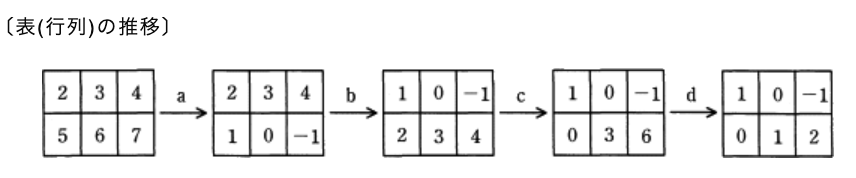
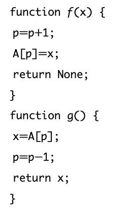
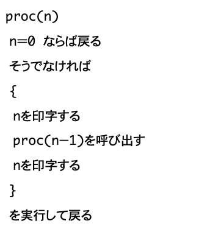
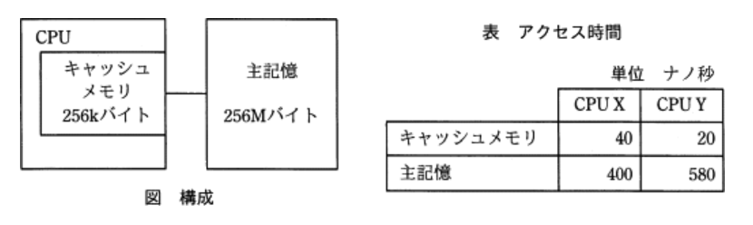
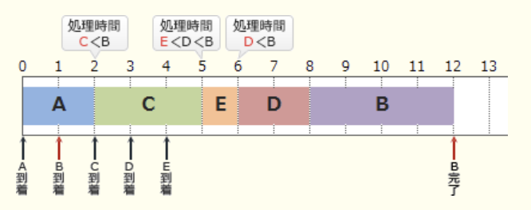

### 令和3年度免除試験問題

### `テクノロジ系`

---
1.nビットの値L1, L2がある。次の操作によって得られる値L3は、L1, L2に対するどの論理演算の結果と同じか  
(1) : L1とL2のビットごとの論理和をとって、変数Xに記憶する  
(2) : L1とL2のビットごとの論理積をとってさらに否定をとり、変数Yに記憶する  
(3) : X, Yのビットごとの論理積をとって、結果をL3とする

- A.**排他的論理和**  
L1を`1010`、L2を`1100`とする  
(1) : `1010`と`1100`の論理和Xは`1110`  
(2) : `1010`と`1100`の論理積は`1000`、その否定Yは`0111`  
(3) : `X = 1110`と`Y = 0111`の論理積L3は`0110`

---
2.0以上65,536未満の整数xを16ビットの2進数で表現して、上位8ビットと下位8ビットを入れ替える。得られたビット列を2進数とみなした時、その値をxを用いた式で荒らしたものはどれか。`a / b`はaをbで割った商の整数部分、`a % b`はaをbで割った余りを表す。式の中の数値は10進法

- A.**(x / 256) + (x % 256) * 256**

16ビットの2進数を、`11110000 00001111`として上位8ビットと下位8ビットを入れ替えると、以下のようになる  
11110000 00001111 => `00001111 11110000`  
入れ替え後の下位8ビットは、入れ替え前の上位8ビットを右に8ビット分シフトすることで得られる。右に8ビットシフトした値は、元の値を256で割ることで表現できる。  
11110000 00001111 / 256 = `00000000 11110000`  
入れ替え後の上位8ビットは、入れ替え前の下位8ビットを左に8ビット分シフトすることで得られる。下位8ビットは256で割った余りであり、左に8ビット分シフトした値は、下位8ビットの値を256倍することで表現できる  
00000000 00001111 * 256 = `00001111 00000000`  
それぞれ行った操作を足し合わせると、  
`x / 256 + (x % 256) * 256`

---
3.通信回線を使用したデータ伝送システムに、M / M / 1の待ち行列モデルを適用すると、平均回線待ち時間、平均伝送時間、回線利用率の関係は以下の式で表すことができる  
`平均回線待ち時間 = (平均伝送時間 * 回線利用率) / (1 - 回線利用率)`  
回線利用率が0から徐々に増加していく場合、平均回線待ち時間が平均伝送時間よりも最初に長くなるのは、回線利用率がいくつを超えた時か

- **0.5**  
平均回線待ち時間が平均伝送時間より長くなるには、`回線利用率 / (1 - 回線利用率) > 1`が条件。回線利用率が50%(0.5)の時に1になり、50%より大きくなると1を超えて、平気回線待ち時間が平均伝送時間より長くなる

---
4.連立一次方程式  
`2x + 3y = 4`  
`5x + 6y = 7`  
x, yの項の係数、定数項だけを取り出した表(行列)を作り、基本操作1 ~ 3のいずれかを順次施すことで、  
`x = -1, y = 2`と解が得られた。  
表(行列)が次のように左から右に推移する場合、同じ種類の基本操作が施された箇所の組み合わせはどれか  
[基本操作]  
1 : ある行に0でない数を掛ける  
2 : ある行と他の行を入れ替える  
3 : ある行に他の行の定数倍を加える

- A.**aとc**  
a ; 下の行がそれぞれ-4, -6, -8されている。上の行の値の−2倍を加算しているので、**(3)**の操作にあたる  
b : ある行と他の行を入れ替える **(2)**  
c : 下の行がそれぞれ-2, 0, 2されている。上の行の値の−2倍の値を加算してるので、**(3)**の操作にあたる  
d : 下の行に`1 / 3`を掛ける **(1)**

---
5.多数のクライアントが、LANに接続された1台のプリンタを共同利用するときの印刷要求から印刷完了までの所要時間を、待ち行列理論を適用して見積もる場合について考える。プリンタの運用方法や利用状況に関する記述のうち、M / M / 1の待ち行列モデルの条件に**反しないもの**

- A.**印刷の緊急性や印刷量の多少にかかわらず、先着順に印刷する**  
待ち行列に並んだ順にサービスを受けると考える

待ち行列モデルは、客が先着順でサービスを受けるのを待っている場合に、待ち行列に並ぶ時間を確率論的に求めるモデル。  
条件をa / b / cの形式で表し、aは客の到着時間、bはサービス提供時間、cはサービスを提供する窓口数を示している。Mはランダムを意味しているので、サービスを提供する窓口が1つで他の条件がランダムとなる。  
待ち行列モデルでは、空いた窓口には直ぐに次の顧客を割り当ててサービスを開始するサービスを開始することを条件としているので、窓口の状況に応じて客がサービスを待つことが条件となっている場合には正しく分析することができない

- 一部のクライアントは、プリンターの空き具合を見ながら印刷要求する  
プリンタの処理状況によって処理要求の到着間隔を操作するのは、到着間隔がランダムという条件に反する

- 印刷待ちの文書データの総量がプリンターのバッファサイズを超えるときは、一時的に受付を中断する  
印刷待ちデータがあるのに窓口が受付を中断するのは、M / M / 1の条件に反する

- 1つの印刷要求から印刷完了までの所要時間は、印刷の準備に要する一定時間と、印刷量に比例する時間の合計である  
印刷要求から印刷完了までの所要時間は、待ち行列に並ぶ時間、窓口について印刷の準備に要する時間、印刷する時間の合計となる

---
6.a, b, c, dの4文字からなるメッセージを符号化してビット列にする方法として表のア ~ エの4通りを考えた。この表はa, b, c, dの各1文字を符号化する時のビット列を表している。メッセージ中のそれぞれの頻度は、それぞれ50%, 30%, 10%, 10%であることが分かっている。符号化されたビット列から元のメッセージが一意に複合可能であって、ビット列の長さが最も短くなるのはどれか

| |a |b |c  |d  |
|-|--|--|---|---|
|ア|0 |1 |00 |11 |
|イ|0 |01|10 |11 |
|ウ|0 |10|110|111|
|エ|00|01|10 |11 |

- A.**ウ**  
一意の複合が可能。各文字の出現頻度を考慮して1文字を表現するのに必要な平均ビットは、  
`(1 * 0.5) + (2 * 0.3) + (3 * 0.1) + (3 * 0.1) = 1.7`  
最小ビットで圧縮できる方式を考える前に、各方式が符号化されたビット列から元のメッセージを一意に複合可能かどうか検証し、条件を満たす方式についてだけビット数を計算する。  
`出現頻度の高い文字に短いビット列を割り当てて表現する`ことで、1文字を表現するのに使用する平均ビット長を最小とする圧縮技術をハフマン符号化と言う

- ア  
ビット列に`11`があった場合、bbとdの区別がつかないため、一意に複合できない

- イ  
ビット列に`00110`があった場合、aadaとabcの区別がつかないため、一意に複合できない

- エ  
各文字が2ビットずつなので一意の複合が可能。1文字を表現するのに必要な平均ビットは2ビットなのでビット列が長くなる

---
7.十分な大きさの配列Aと初期値が0の変数pに対して、関数*f(x)* と*g(x)* が次の通り定義されている。配列Aと変数pは、関数*f(x)* と*g()* だけでアクセス可能である。これらの関数が操作するデータ構造はどれか

- A.**スタック**  
後入れ先出し(LIFO)のデータ構造。  
*f(x)* は、配列中のpを+1した位置にxを代入している。*g()* は、配列中の位置pの値を返し、pを-1している。この2つの関数で使われている変数pは、現在、配列に格納されている要素数を保持する変数として使われている。  
*f(x)* を実行した時には配列の末尾に要素が追加され、*g()* を実行した時には配列の末尾の要素が返される。`配列の最後にデータを追加する`、`最後に追加されたデータを取り出す`という2つの操作を合わせると、後入れ先出しのデータ構造を実現できる

- キュー  
先入れ先出し(FIFO)のデータ構造

- ハッシュ  
任意のデータから一意に求めた固定長のデータ

- ヒープ  
親の値は子の値以上という制約で構成された木構造

---
8.自然数をキーとするデータをハッシュ表を用いて管理する。キーxのハッシュ関数*h(x)* を、  
`h(x) = x mod n`  
とすると、任意のキーa, bが衝突する条件はどれか。nはハッシュ表の大きさであり、`x mod n`はxをnで割った余りを表す

- A.**a - bがnの倍数**  
33 - 18 = 15となり、nの倍数という条件を満たしている

衝突するので、`a mod n = b mod n`の条件を仮定する。  
{a, b, n} = {33, 18, 5}とすると、  
`a mod n = 33 % 5 = 3`  
`b mod n = 18 % 5 = 3`

- a + bがnの倍数  
33 + 18 = 51となり、nの倍数ではない

- nがa + bの倍数  
33 + 18 = 51であり、3は51の倍数ではない

- nがa - bの倍数  
33 - 18 = 15であり、3は15の倍数ではない

---
9.再起的に定義された手続`proc`で、`proc(5)`を実行した時、印字される数字を順番に並べたもの

- A.**5432112345**  
`proc(5)` : n = 0でないので**5**を印字、`proc(4)`を呼び出す  
`proc(4)` : n = 0でないので**4**を印字、`proc(3)`を呼び出す  
…  
`proc(1)` : n = 0でないので**1**を印字、`proc(0)`を呼び出す  
`proc(0)` : n = 0なので`proc(1)`に戻る  
`proc(1)` : **1**を印字して`proc(2)`に戻る  
…  
`proc(4)` : **4**を印字して`proc(5)`に戻る  
`proc(5)` : **5**を印字して処理を終了する  
印字された数字を順番に並べると、**5432112345**となる

---
10.オブジェクト指向のプログラム言語で、クラスや関数、条件文などのコードブロックの範囲はインデントの深さによって指定する仕様であるもの

- A.***Python***  
コードブロックのインデントが構文規則となっていることがソースコード上の特徴。`{}`で囲む必要がなく、条件式全体を`()`で囲む必要がない。インデントの強制により誰が記述してもある程度整形されたソースコードになるため、可読性に優れていると言える

- *JavaScript*
- *Perl*  
`{}`で囲むことでコードブロックを指定する。C、*Java*など一般的なプログラミング言語が該当する。コードブロック内のインデントは、コーディング規約上の指定であり言語仕様上は任意。また、コードブロック内の処理が1つの時には`{}`を省略可能

- *Ruby*  
特定のキーワードと`end`で囲むことでコードブロックを指定する

---
11.CPUのプログラムレジスタ(プログラムカウンタ)の役割

- A.**命令を読み出すために、次の命令が格納されたアドレスを保持する**  
CPUの制御装置内にあるレジスタの1つで、次に読みだして実行すべき命令が格納されている主記憶上のアドレスを保持する役割を担う。CPUがプログラムカウンタからアドレスを読み出すと、プログラムカウンタは命令長の分だけ自動的に加算され、次の命令のアドレスを指すようになっている。分岐命令の際は、ジャンプ先のアドレスをプログラムカウンタにセットすることで命令実行順序を制御する

- 演算を行うために、メモリから読み出したデータを保持する  
汎用レジスタの説明

- 条件付き分岐命令を実行するために、演算結果の状態を保持する  
アキュムレータの説明

- 命令のデコードを行うために、メモリから読み出した命令を保持する  
命令レジスタの役割

---
12.コンピュータは、入力・記憶・演算・制御・出力の5つの機能を実現する各装置から構成される。命令はどの装置から取り出され、どの装置で解釈されるか
- A.**取り出し : 記憶**  
コンピュータが処理すべきデータを保持しておく装置。レジスタやキャッシュメモリ、主記憶、補助記憶装置や外部記憶装置などがこの機能に相当する
- A.**解釈 : 制御**  
プロセッサの演算装置やレジスタの動作、記憶装置の読み書き・入出力などを制御する装置。プロセッサがこの機能を担っている
- 演算  
加減算やOR、ANDなどの論理演算、比較演算やシフト演算などを行う装置。プロセッサがこの機能を担っている
- 入力  
コンピュータが利用者からの情報を読み込む装置。キーボードやマウス、ペンタブレットやタッチパネルが相当する
- 出力  
コンピュータが実行状態や実行結果を出力する機能。ディスプレイやプリンタ、スピーカーなどが相当する

---
13.図に示す構成で、表に示すようにキャッシュメモリと主記憶のアクセス時間だけが異なり、他の条件は同じ2種類のCPU XとYがある。あるプログラムをCPU XとYでそれぞれ実行したところ、両者の処理時間が等しかった。キャッシュメモリのヒット率は幾らか。CPU処理以外の影響はないものとする

- A.**0.90**  
キャッシュメモリがある時は、CPUはまずキャッシュメモリにアクセスし、キャッシュメモリに目的のデータが存在しなければ主記憶にアクセスする。つまり、メモリへの平均アクセス時間は、キャッシュメモリのアクセス時間、ヒット率、主記憶のアクセス時間から求めることができる。  
`主記憶のアクセス時間 = キャッシュメモリのアクセス時間 * ヒット率 + 主記憶のアクセス時間 * (1 - ヒット率)`  
ヒット率をpとすると、CPU Xの平均アクセス時間は、  
`40p * 400 * (1 - p)`  
CPU Yの平均アクセス時間は、  
`20p * 580 * (1 - p)`  
両者の処理時間は等しいので、両者を方程式にすることでヒット率を求めることができる  
`40p * 400 * (1 - p) = 20p * 580 * (1 - p)`  
`-360p + 400 = -560p + 580`  
`200p = 180`  
`p = 18 / 20 = 0.90`

---
14.1ピクセル当たり24ビットのカラー情報をビデオメモリに記憶する場合、横1,024ピクセル・縦768ピクセルの画面表示に必要なメモリ量は約何Mバイトか。1Mバイトは10の6乗バイトとする

- **2.4Mバイト**
768 = 3 * 2の8乗  
1024 = 2の10乗  
768 * 1024 = 3 * 2の18乗  
画面表示に必要なビット数は、  
`3 * 24 * 2の18乗ビット`  
`= 18 * 2の20乗ビット`  
`= 約18 * 10の6乗ビット`  
1バイト = 8ビットで変換すると、  
約2.25Mバイト

---
15.フェールセーフの考え方

- A.**システムに障害が発生したときでも、常に安全側にシステムを制御する**  
システムの不具合や故障が発生したときでも、障害の影響範囲を最小限に留め、常に安全を最優先にして制御を行う考え方。「工業用機械で侵入禁止区域をセンサーで監視し、人や物の侵入を感知した時には機械を緊急停止する」「信号機が故障した時には全てを赤信号にする」という設計が実践例

- システムの機能に異常が発生したきに、すぐにシステムを停止しないで機能を縮退させて運用を継続する  
障害発生時に縮退運転を行うフェールソフトの考え方

- システムを構成する要素のうち、信頼性に大きく影響するものを複数備えることによって、システムの信頼性を高める  
冗長構成によって耐障害性を高めるフォールトトレラントの考え方

- 不特定多数の人が操作しても、誤動作が起こりにくいように設計する  
フールプルーフの考え方

---
16.一定の時間内にシステムによって処理される仕事量を表す用語

- A.**スループット**(*throughput*)  
システムで単位時間当たりに処理される仕事量を表す。データ処理におけるスループットには、コンピュータに搭載されるCPUのクロック周波数やハードディスクの回転速度、OSなど、様々な要因が影響し、システムのパフォーマンスの評価基準となる

- アクセスタイム  
CPU・主記憶装置・補助記憶装置などの間でデータがやり取りされる時間のこと

- オーバーヘッド  
本来目的とする処理とは別に余分に(間接的に)掛かってしまう処理のこと

- ターンアラウンドタイム  
入力作業の開始から全ての出力作業を終えるまでに要する時間のこと

---
17.5つのジョブA ~ Eに対して、ジョブの多重度が1で、処理時間順方式のスケジューリングを適用した場合、ジョブBのターンアラウンドタイムは何秒か。OSのオーバーヘッドは考慮しないものとする

|ジョブ|到着時間|単独実行時の処理時間|
|-----|------|-----------------|
|A    |0     |2                |
|B    |1     |4                |
|C    |2     |3                |
|D    |3     |2                |
|E    |4     |1                |

- A.**11**

ターンアラウンドタイムは、入力の開始を始めた時から全ての出力を受け取るまでに要する時間のことを指す。処理時間順方式は、処理時間の短いタスクを優先的に実行するスケジューリング方式。新たなタスクが到着すると処理の待ち行列に加わり、CPUが空くと待ち行列の中から予想処理時間が最も短いタスクが選択され、実行状態に移される。処理時間が短い順に実行されるため、A, C, E, D, Bの順で実行される

---
18.4ブロック分のキャッシュメモリC0 ~ C3が表に示す状態である。ここで、新たに別のブロックの内容をキャッシュメモリにロードする必要が生じた時、C2のブロックを置換の対象とするアルゴリズム

|キャッシュメモリ|ロード時間(分 : 秒)|最終参照時刻(分 : 秒)|参照回数|
|--|------|------|--|
|C0|0 : 00|0 : 08|10|
|C1|0 : 03|0 : 06|1 |
|C2|0 : 04|0 : 05|3 |
|C3|0 : 05|0 : 10|5 |

- A.**LRU**(*Least Recently Used*)  
最後に参照された時刻が、最も昔であるものを置き換え対象とするので、C2が対象となる

- FIFO  
先入れ先出し。最も昔にロードされたものを置き換え対象とするので、C0が対象となる

- LFU(*Least Frequently Used*)  
最も使用頻度(回数)の少ないものを置き換え対象とするので、C1が対象となる

- LIFO  
先入れ後出し(後入れ先出し)、最も新しくロードされたものを置き換え対象とするので、C3が対象となる

---
19.ページング方式の仮想記憶において、主記憶に存在しないページをアクセスした場合の処理や順番の適切なものはどれか。主記憶には現在、空きのページ枠はないものとする

- A.**ページフォールト => 置換え対象ページの決定 => ページアウト => ページイン**  
ページング方式は、仮想記憶管理方式の1つで仮想アドレス空間をページと呼ばれる`固定長`の区画に分割するとともに主記憶のアドレス空間(実アドレス空間)も同じように固定長に分割して、ページ単位で主記憶と仮想記憶(補助記憶装置)のアドレス変換を行う方式。ページング方式では、ページの置き換えに伴う3つの処理を呼び出す。  
`ページフォールト`  
アクセス要求のあったページが主記憶上に存在しない状態  
`ページイン`  
ページを仮想記憶から主記憶に移すこと  
`ページアウト`  
ページを主記憶から仮想記憶に移すこと
