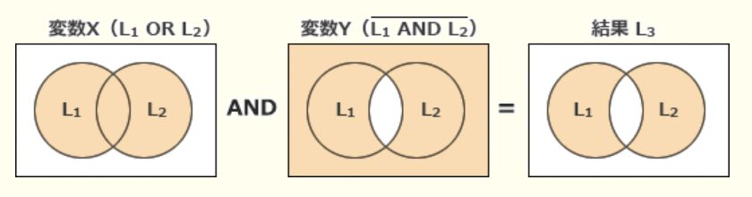

### 令和3年度免除試験問題

### `テクノロジ系`

---
1.nビットの値L1, L2がある。次の操作によって得られる値L3は、L1, L2に対するどの論理演算の結果と同じか  
(1) : L1とL2のビットごとの論理和をとって、変数Xに記憶する  
(2) : L1とL2のビットごとの論理積をとってさらに否定をとり、変数Yに記憶する  
(3) : X, Yのビットごとの論理積をとって、結果をL3とする

- A.**排他的論理和**  
L1を`1010`、L2を`1100`とする  
(1) : `1010`と`1100`の論理和Xは`1110`  
(2) : `1010`と`1100`の論理積は`1000`、その否定Yは`0111`  
(3) : `X = 1110`と`Y = 0111`の論理積L3は`0110`

---
2.0以上65,536未満の整数xを16ビットの2進数で表現して、上位8ビットと下位8ビットを入れ替える。得られたビット列を2進数とみなした時、その値をxを用いた式で荒らしたものはどれか。`a / b`はaをbで割った商の整数部分、`a % b`はaをbで割った余りを表す。式の中の数値は10進法

- A.**(x / 256) + (x % 256) * 256**

16ビットの2進数を、`11110000 00001111`として上位8ビットと下位8ビットを入れ替えると、以下のようになる  
11110000 00001111 => `00001111 11110000`  
入れ替え後の下位8ビットは、入れ替え前の上位8ビットを右に8ビット分シフトすることで得られる。右に8ビットシフトした値は、元の値を256で割ることで表現できる。  
11110000 00001111 / 256 = `00000000 11110000`  
入れ替え後の上位8ビットは、入れ替え前の下位8ビットを左に8ビット分シフトすることで得られる。下位8ビットは256で割った余りであり、左に8ビット分シフトした値は、下位8ビットの値を256倍することで表現できる  
00000000 00001111 * 256 = `00001111 00000000`  
それぞれ行った操作を足し合わせると、  
`x / 256 + (x % 256) * 256`

---
3.通信回線を使用したデータ伝送システムに、M / M / 1の待ち行列モデルを適用すると、平均回線待ち時間、平均伝送時間、回線利用率の関係は以下の式で表すことができる  
`平均回線待ち時間 = (平均伝送時間 * 回線利用率) / (1 - 回線利用率)`  
回線利用率が0から徐々に増加していく場合、平均回線待ち時間が平均伝送時間よりも最初に長くなるのは、回線利用率がいくつを超えた時か

- **0.5**  
平均回線待ち時間が平均伝送時間より長くなるには、`回線利用率 / (1 - 回線利用率) > 1`が条件。回線利用率が50%(0.5)の時に1になり、50%より大きくなると1を超えて、平気回線待ち時間が平均伝送時間より長くなる
