### 令和4年免除

### `テクノロジ系`

---
1.任意のオペランドに対するブール演算Aの結果とブール演算Bの結果が互いに否定の関係にあるとき、AはBの(又は、BはAの)相補演算であるという。排他的論理和の相補演算

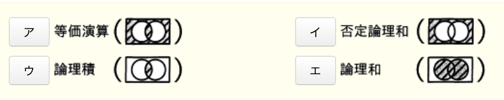

- A.**等価演算**

相補演算は、集合演算によって得られる結果が互いにもう一方の演算の補集合となっている関係。AとnotA、X AND YとNOT(X AND Y)のような関係になっているものを指す。  
排他的論理和(XOR)は、2つの入力値が異なれば真、同じであれば偽を返す論理演算。  
排他的論理和の相補演算となるのは、XORの補集合が結果として得られる演算で、適切なのは等価演算となる

---
2.2の補数で表された負数`10101110`の絶対値

- A.**01010010**  
2の補数とは、負数を表現する方法の1つ。ある正の数の2の歩数を求めるには、全てのビットを反転して1を加える

---
3.隣接行列Aで表されるグラフはどれか。隣接行列は、n個の節点から成るグラフのViとVjを結ぶ枝が存在する時は、第i行第j列と第j行第i列の要素が1となり、存在しない時は0となるn行n列の行列である  
(隣接行列A)  
`0110`  
`1001`  
`1001`  
`0110`

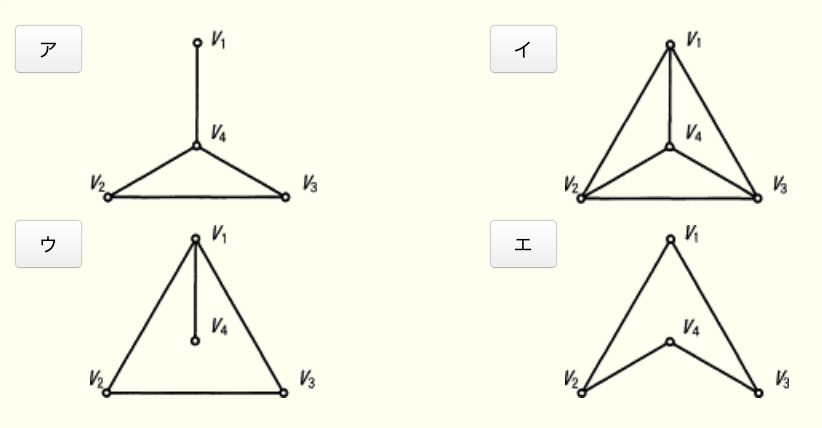

- A.**エ**

隣接行列と節点の関係を整理すると次の通り。  

|  |V1|V2|V3|V4|
|--|--|--|--|--|
|V1|0 |1 |1 |0 |
|V2|1 |0 |0 |1 |
|V3|1 |0 |0 |1 |
|V4|0 |1 |1 |0 |

V1 ~ V4の節点のうち結ぶ枝が存在する関係は、「V1とV2」「V1とV3」「V2とV4」「V3とV4」の4つが存在する

---
4.5本のクジがあり、そのうち2本が当たりである。2本同時に引いた時、2本とも当たりである確率

- A.**1 / 10**  
5本のクジから2本の当たりを選ぶので、5C2 = 10通り。2本の当たりクジの両方を選択する組み合わせは、元々2本しか存在しない当たりクジを全て引くので1通り

---
5.逆ポーランド表記法で表現したもの  
`((a + b)(c + d)) / (a - d)`

- A.**ab + cd +* ad - /**  
逆ポーランド表記法(後置表記法)は、演算子を2つの被演算子の右側に記述する表記法。通常の数式`a + b`を逆ポーランド表記法にすると`ab+`となる。  
通常の式を逆ポーランド表記法で表現する時には、通常の式を計算するのと同じ順番で計算式を解くのと同じ要領で変換していく。1度変換した部分はひとまとまりの項として扱うことがポイント  
1.分子の括弧内の式を変換する :  
`(ab+ * cd+) / (a - d)`  
2.分子の乗算を変換する :  
`(ab+ cd+)* / (a - d)`  
3.分母の式を変換する :  
`(ab+ cd+)* / ad-`  
4.分母の除算を変換する :  
`ab+ cd+* ad- /`

---
6.2分木を入力するためのテキスト表現を規定した。図のように節に番号をつけた時、テキスト表現として適切なもの  
1.(左部分木の節番号又はテキスト表現、節番号、右部分木の節番号又はテキスト表現)と表す  
2.部分木が空の時はxを書く

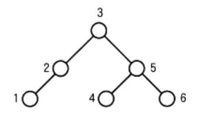

- A.**((1, 2, x), 3, (4, 5, 6))**  
木構造の根である"3"の左部分木に着目すると、"2"が節であり左部分木は"1"、右部分木は空になっている。(左, 節, 右)のルールに従うと、この部分木のテキスト表現は`(1, 2, x)`となる。  
次に根"3"の右部分木に着目すると、"5"が節であり左部分木は"4"、右部分木は"6"となっている。この部分木のテキスト表現は`(4, 5, 6)`となる

---
7.与えられた正の整数x0、x1(x0 > x1)の最大公約数を次の手順で決める。x0 = 175、x1 = 77の場合、手順2は何回実行するか。a → bは、AをBに代入することを表す  
[手順]  
1.2 → i  
2.x(i - 2)をx(i - 1)で、割った余剰 → xi  
3.xi = 0ならばx(i - 1)を最大公約数として終了する  
4.i + 1 → iとして、2に戻る

1.iに2を代入する  
`2-1`.x0(175)をx1(77)で割った余りは21 → x2  
3.i = 3として戻る  
`4-2`.x1(77)をx2(21)で割った余りは14 → x3  
5.i = 4として戻る  
`6-3`.x2(21)をx3(14)で割った余りは7 → x4  
5.i = 5として戻る  
`6-4`.x3(14)をx4(7)で割った余りは0 → x5  
7.x5 = 0なので、x4 = 7として終了  
手順2の操作は4回行った

---
8.バブルソートの説明

- A.**隣り合う要素を比較して、大小の順が逆であれば、それらの要素を入れ替えるという操作を繰り返す**  
単純交換法(隣接交換法)は、隣り合う要素同士との比較・交換を繰り返すことで整列を行うアルゴリズム

- ある間隔おきに取り出した要素から成る部分列をそれぞれ整列し、更に間隔を詰めて同様の操作を行い、間隔が1になるまでこれを繰り返す  
シェルソートの説明

- 中間的な基準値を決めて、それよりも大きな値を集めた区分と、小さな値を集めた区分に要素を振り分ける。次に、それぞれの区分の中で同様の操作を繰り返す  
クイックソートの説明

- 未整列の部分を順序木にし、そこから最小値を取り出して整列済の部分に移す。この操作を繰り返して、未整列の部分を縮めていく  
ヒープソートの説明

---
9.異なるn個のデータが昇順に整列された表がある。この表をm個のデータごとのブロックに分割し、各ブロックの最後尾のデータだけを線形探索することによって、目的のデータの存在するブロックを探し出す。次に、当該ブロック内を線形探索して目的のデータを探し出す。この時の平均比較回数を表す式はどれか。mは十分大きく、nはmの倍数とし、目的のデータは必ず表の中に存在するものとする

- A.**(m / 2) + (n / 2m)**

線形探索法は、探索対象データの先頭から1つずつ順番に比較することで目的のデータを探す方法。線形探索法では、n個のデータの中から目的のデータを探す時の平均比較回数は`(n + 1) / 2`回。  
最初は`n個のデータをm個ごとのブロックに分割した`最後尾のデータのみを探索する。表のデータは昇順に整列されているので、各ブロック最後尾の並びも昇順になっている。この最後尾データの並びに対して「目的のデータ <= 各ブロックの最後尾データ」を順次チェックし、目的のデータが存在するブロックを探す。  
この1回目の探索では、データを1つずつチェックしていくので線形探索の考え方を準用できる。探索するデータ数は`n / m`個なので、目的のデータが存在するブロックが決定するまでの平均比較回数は、  
`(n/m + 1) / 2`(回)  
2回目は、1回目の探索によって見つけたブロック内を線形探索する。探索する。探索するデータ数はm個なので、目的のデータを見つけるまでの平均比較回数は、  
`(m + 1) / 2`(回)  
2つの比較回数の合計は、  
`(n/m + 1) / 2 + (m + 1) / 2`(回)  
mは十分に大きいという条件があるが、`n / m`が十分に大きいとは限らないので定数項の+1は省略不可。  
`(n/m + 1) / 2 + (m + 1) / 2`  
`= {n/m + 1 + m + 1} / 2`  
`= (n/m + m + 2) / 2`  
`= n / 2m + m / 2 + 1`  
`n / 2m`は、nがmより十分大きい場合に無視できない、定数項は`2 / m`が十分大きいので無視できると考えると、平均比較回数は、  
`n / 2m + m / 2`

---
10.正の整数Mに対して、2つの流れ図に示すアルゴリズムを実行した時、結果xの値が等しくなるようにしたい。aに入れる適切な条件

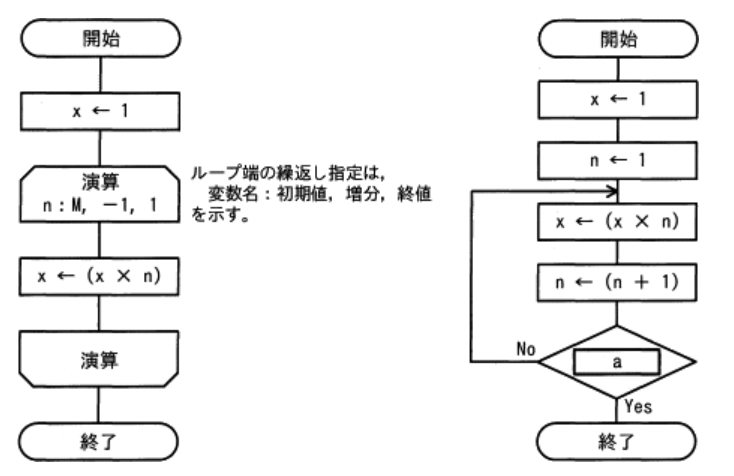

- A.**n > M**  
n = 2, M = 2で、条件を満たさないのでループ先頭に戻る。  
x ← 2, n ← 3  
n = 3, M = 2で、条件を満たす。`x = 2`で左の流れ図と同じ値となる

2つのアルゴリズムで共通のMは正の整数という条件があるので、Mに適当な数値を当てはめることで解答を導く。Mを2として、左のアルゴリズムを解き、結果のxの値が右の式でも出力される条件はどれかを考える

左図 :  
xに1を代入  
変数nを、初期値2から1ずつ減らして、1で終わる  
`x ← 1 * 2 = 2`  
右図 :  
(aの直前)  
x = 1, n = 2

- n < M  
n = 2, M = 2で、条件を満たさないのでループ先頭に戻る。ループ内ではnの値は1ずつ加算されるため、n < Mを満たすことはない

- n > M - 1  
n = 2, M = 2で、条件を満たす。xの値は1で、左の流れ図とは異なる値となる

- n > M + 1  
n = 2, M = 2で、条件を満たさないのでループ先頭に戻る。  
x ← 2, n ← 3  
n = 3, M = 2で、条件を満たさないのでループ先頭に戻る。  
x ← 6, n ← 4  
n = 4, M = 2で、条件を満たすが`x = 6`なので、左の流れ図とは異なる値となる

---
11.表の命令ミックスによるコンピュータの処理性能(単位 : MIPS)

|命令種別|実行速度(ナノ秒)|出現頻度(%)|
|------|--------------|----------|
|整数演算命令|10|50|
|移動命令|40|30|
|分岐命令|40|20|

- A.**40**  
MIPS(*million instructions per second*)は、1秒間の命令実行回数を百万単位で表すCPU性能の指標。2MIPSであれば1秒間に200万回の命令を実行できるという意味。  
3種類の命令を実行するのに必要な実行速度に出現頻度を重み付けすることで、1命令当たりの平均実行時間を求める  
10 * 0.5 + 40 * 0.3 + 40 * 0.2  
= 5 + 12 + 8 = 25ナノ秒  
次に、25ナノ秒の命令を1秒で何回実行できるかを計算する  
1s / 25ナノ秒  
= 0.04 * 10の9乗秒
= 4 * 10の7乗回  
MIPSは命令実行回数を百万単位で表したものなので、 
= 4 * 10の7乗回 / 100万回(10の6乗)  
`= 40MIPS`

---
12.同じ命令セットをもつコンピュータA, Bがある。それぞれのCPUクロック周期、及びあるプログラムを実行したときのCPI(*Cycles Per Instruction*)は表の通り。そのプログラムを実行したとき、コンピュータAの処理時間は、コンピュータBの処理時間の何倍になるか

||CPUクロック周期|CPI|
|-|------------|---|
|コンピュータA|1ナノ秒|4.0|
|コンピュータB|4ナノ秒|0.5|

- A.**2倍**  
CPIは、CPUが1つの命令を実行するのに必要となる平均クロック数を表す。CPUクロック周期はクロックが発生する時間間隔なので、1命令を処理するのに要する時間は、`CPUクロック周期 * CPI`で求めることができる。  
コンピュータA, Bそれぞれの1命令の処理時間は  
A : 1ナノ秒 * 4CPI = 4ナノ秒  
B : 4ナノ秒 * 0.5CPI = 2ナノ秒  
コンピュータAが1命令を処理する時間はコンピュータBの2倍で、同じプログラムを実行すれば、処理時間は2倍になる

---
13.アクセス時間の最も短い記憶装置

- A.**CPUのレジスタ**  
CPUが内部に持つ少量で非常に高速な記憶装置。アキュムレータ、汎用レジスタ、プログラムカウンタ、インデックスレジスタ、命令レジスタ、ステータスレジスタなどがある

コンピュータで使われる記憶装置を高速に動作するものから順に並べると、`レジスタ > キャッシュメモリ > 主記憶 > ディスクキャッシュ > HDD / SSD > 磁気テープ`となる。論理的な位置がCPUに近いほど高速な関係性がある

- CPUの2次キャッシュメモリ  
CPUと主記憶の読み書き速度の差を埋めるために設置される高速な記憶装置

- 磁気ディスク  
主記憶と補助記憶装置の読み書き速度の差を埋めるために設置される記憶装置(ディスクキャッシュ)

---
14.毎分6,000回転、平均位置決め時間20ミリ秒で、1トラック当たりの記憶容量20kバイトの磁気ディスク装置がある。1ブロック4kバイトのデータを1ブロック転送するのに要する平均アクセス時間は何ミリ秒か。磁気ディスクコントローラーのオーバーヘッドは無視できるものとし、1kバイト = 1,000バイトとする

- **27ミリ秒**

磁気ディスクのアクセス時間は以下の式で求められる。  
`平均シーク時間 + 平均回転待ち時間 + データ転送時間`  
・平均位置決め時間(シークタイム) :  
磁気ディスクのヘッドが、目的のデータが保存されている位置まで移動するのにかかる時間の平均。この問題では`20ミリ秒`で定められている  
・平均回転待ち時間(サーチタイム) :  
ヘッドの移動が完了した後、読み出すレコードの先頭が磁気ヘッドの位置まで磁気ディスクが回転してくるのを待つ時間の平均。ディスクが1回転するのにかかる時間の半分が平気回転待ち時間となる  
・データ転送時間 :  
目的のデータを読み出すのに要する時間  
6,000回転 / minの磁気ディスクが1回転するのにかかる時間は、  
`60秒 / 6,000 = 10ミリ秒`  
平均回転待ち時間は、ディスクが1回転するのにかかる時間の半分なので、`5ミリ秒`  
データ転送速度は、1回転(1トラック)20kバイトなので、4kバイトを読み取るのにかかる時間は、  
10ミリ秒 * (4k / 20k) = `2ミリ秒`  
総和は、20 + 5 + 2 = `27ミリ秒`

---
15.ジョブの多重度が1で、到着順にジョブが実行されるシステムにおいて、表に示す状態のジョブA ~ Cを処理する時、ジョブCが到着してから実行が終了するまでのターンアラウンドタイムは何秒か。OSのオーバーヘッドは考慮しないものとする(単位 : 秒)

|ジョブ|到着時刻|処理時間(単独実行時)|
|-----|------|-----------------|
|A    |0     |5                |
|B    |2     |6                |
|C    |3     |3                |

- A.**11**  
ターンアラウンドタイムは、利用者がシステムに処理要求を開始してから、全ての結果を受け取るまでに要する時間のこと。  
ジョブCの到着は処理開始時点から3秒後、完了は処理開始時点から14秒後なので、ターンアラウンドタイムは11秒

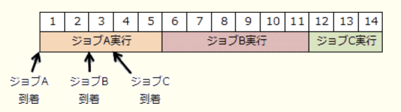

---
16.3層クライアントサーバシステムの各層の役割

- A.**ファンクション層は、データを加工してプレゼンテーション層に返信する**  
データベースアクセス層から返された結果を、ユーザに分かるように加工してからプレゼンテーション層に返す

3層クライアントサーバシステムは、システムをクライアント(利用者)に近い側から「プレゼンテーション層」「ファンクション層」「データベースアクセス層」の3つに論理的に分離したシステムモデル  
・プレゼンテーション層 :  
クライアントからデータを入力を受け付けたり、問合せ結果を表示するなどユーザの入出力を担う層  
・ファンクション層 :  
サーバ側でクライアントの問合せを中継したり、データ層から取得したデータを加工してクライアントに送ったりとデータの変換処理を担う層  
・データベースアクセス層(データ層) :  
DBへのアクセス・保管などDB処理を集中的に担う層

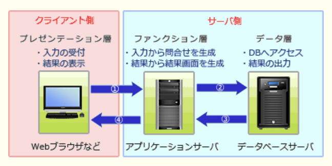

- データベースアクセス層は、データを加工してプレゼンテーション層に返信する  
データ加工はファンクション層が行う

- ファンクション層は、データベースアクセス層で組み立てられたSQL文を解釈する  
SQL文の解釈はデータベースアクセス層の役割

- プレゼンテーション層は、データベースアクセス層にSQL文で問い合わせる  
3層C / Sシステムではプレゼンテーション層からデータベースアクセス層に直接的に要求することはない。SQL文を組立てデータベースアクセス層に問合せを行うのはファンクション層の役割

---
17.仮想記憶管理におけるページ置換えアルゴリズムとしてLRU方式を採用する。主記憶のページ枠が、4000, 5000, 6000, 7000番地(いずれも16進数)の4ページ分で、プログラムが参照するページ番号の順が、1 → 2 → 3 → 4 → 2 → 5 → 3 → 1 → 6 → 5 → 4の時、最後の参照ページ4は何番地にページインされているか。最初の1 → 2 → 3 → 4の参照で、それぞれのページは4000, 5000, 6000, 7000番地にページインされるものとする

- A.**6000**

LRU(*Least Recently Used*)は、置換え対象の中で最後に参照されてからの時間が最も長いページを置換え対象とするアルゴリズム。番号は、左から4000, 5000, 6000, 7000番地とする

1.最初の1から4までは設問の指示通りページインする  
`1, 2, 3, 4`  
2.2は主記憶に存在するのでページアウトは発生しない  
`1, 2, 3, 4`  
3.5は主記憶に存在しないのでページ置換えが必要。この時点で最も昔に参照されたページは1なので、1をページアウトしその位置に5をページインする  
`5, 2, 3, 4`  
4.3は主記憶に存在するのでページアウトは発生しない  
`5, 2, 3, 4`  
5.1は主記憶に存在しないのでページ置換えが必要。この時点で最も昔に参照されたページは4なので、4をページアウトしその位置に1をページインする  
`5, 2, 3, 1`  
6.6は主記憶に存在しないのでページ置換えが必要。この時点で最も昔に参照されたページは2なので、2をページアウトしその位置に6をページインする  
`5, 6, 3, 1`  
7.5は主記憶に存在するのでページアウトは発生しない  
`5, 6, 3, 1`  
8.4は主記憶に存在しないのでページ置換えが必要。この時点で最も昔に参照されたページは3なので、3をページアウトしその位置に4をページインする  
`5, 6, 4, 1`  
操作終了時点でページ4は左から3番目の6000番地にページインしている

---
18.仮想記憶におけるページ置換えアルゴリズムの1つのLRUを説明した記述

- A.**最も長い間参照されていないページを追い出す**  
置換え対象のうち最後に参照されてからの時間が最も長いもの、つまり最も長い時間使用されていないものを置換え対象とするアルゴリズム

- あらかじめ設定されている優先度が最も低いページを追い出す  
静的優先度順のアルゴリズムは、ページ置換えアルゴリズムとしては存在しない。優先度の高いページが主記憶に残り続けることで、使用できる記憶領域が少なくなってしまうため

- 主記憶に存在している時間が最も長いページを追い出す  
FIFO(*First in First out* : 先入れ先出し)の説明

- 主記憶に存在している時間が最も短いページを追い出す  
LIFO(*Last in First out* : 後入れ先出し)の説明

---
19.Hadoop(ハドゥープ)の説明

- A.**大規模なデータセットを分散処理するためのソフトウェアライブラリ**  
大規模なデータの分散処理基盤を提供するソフトウェアライブラリ

ペタバイト級の大規模データの蓄積・処理の分散処理を実現するミドルウェア。Googleが論文として発表した分散処理フレームワーク「*MapReduce*」および分散ファイルシステム「*Google File System*」を基盤技術に、オープンソースとしてJavaで実装したもの。分散ファイルシステムのHDFS(*Hadoop Distributed File System*)と、分散処理のフレームワークである*Hadoop MapReduce*の2つから構成される

- JavaEE仕様に準拠したアプリケーションサーバ  
WildFlyの説明

- LinuxやWindowsなどの様々なプラットフォーム上で動作するWebサーバ  
ApacheやNginxなどの説明

- 機能の豊富さが特徴のRDBMS  
PostgreSQLなどの説明

---
20.`0xABCD1234`をリトルエンディアンで4バイトのメモリで配置したものはどれか。0 ~ +3はバイトアドレスのオフセット値

- A.(以下回答)

|0     |+1    |+2    |+3    |
|------|------|------|------|
|**34**|**12**|**AB**|**CD**|

エンディアンは、バイト単位のデータをメモリに記録するときの方式で、リトルエンディアンは、記録するデータの下位バイトから順番に、メモリのアドレスを若い方に格納していく方式。  
ビッグエンディアンは、データの上位バイトから順番に並べていく方式(下図)。  
ビッグエンディアンは人間がデータの並びを認識しやすい、リトルエンディアンはコンピュータがデータを処理しやすいという特徴がある

|0 |+1|+2|+3|
|--|--|--|--|
|AB|CD|12|34|

---
21.ワンチップマイコンの内蔵メモリとしてフラッシュメモリが採用されている理由

- A.**マイコン出荷後もソフトウェアの書換えが可能である**  
組込みシステムの内蔵メモリとして従来からあるマスクROMはデータ保護ができる反面、出荷後に書換えはできず、アップデートにはROMの交換など莫大なコストを要することになる。  
フラッシュメモリの登場により、機器のフタを開けなくてもユーザが電子的な操作だけでデータ書換えができるISP(*In-System Programming*)が可能になり、出荷後のアップデートが以前よりも容易に行えるようになっている

---
22.全加算機の入力x, y, zに1, 0, 1を入力した時、出力となるc(けた上げ数)、s(和)の値

- A.**c : 1**
- A.**s : 0**  
全加算機は、2進数の加算を行う論理回路で、2進数の1桁分の加算を下位からの桁上がりを含めて計算できる。出力cは*Carry out*の略で桁上がり数を、sは*Sum*の略で合計を表している。  
3つの入力値(x = 1, y = 0, z = 1)を合計すると2で2進数で表すと10となる。c(けた上げ数)には1、s(和)は0が出力される

---
23.A社では優良顧客について調査することになった。優良顧客は、最近購入実績があり、かつ購入金額の多い顧客とする。優良顧客の選定基準を決めるために、最近の1か月・2か月・3か月・…について、期間ごとに購入金額ごとの顧客数を求めて、顧客購入分析表を作成することにした。最も適切な顧客購入分析表

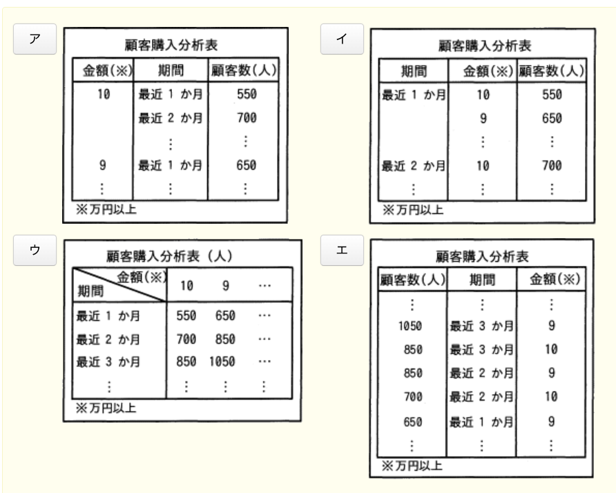

- A.**ウ**  
分割表を用いることにより、全体の分布が明らかになり、優良顧客の対象となるグループが左上に集まっている。これにより、選定基準を決めるのに見やすい図となっている

- ア  
購入金額が多いグループが上位に並ぶようになっている。優良顧客となるべきグループが離れて配置することになるので分析表としては使いにくい

- イ  
購入磁気が近いグループが上位に並ぶようになっている。優良顧客となるべきグループが離れて配置することになるので分析表としては使いにくい

- エ  
購入金額や購入実績に関係なく、顧客数が多いグループが上位になっている。優良顧客となるべきグループがバラバラに配置されている

---
24.音声などのアナログデータをデジタル化するために用いられるPCMで、音の信号を一定の周期でアナログ値のまま切り出す処理

- A.**標本化**  
連続的なアナログ値(振幅、周波数、その他の測定可能な性質)を一定の時間間隔(サンプリング周波数)で測定して、時系列的に連続的でない値(離散値)にすること

- 量子化  
標本化で得られたアナログデータを、離散的なデジタルデータとして近似的に表すこと。量子化ビット数が16ビットであれば、65,536種類のいずれかの値で近似することになる

- 符号化  
量子化で得られたデータをビットとして表現すること

---
25.事務室が複数の建物に分散している会社で、PCの設置場所を管理するDBを作ることになった。`資産`・`部屋`・`建物`の3つの表を作成し、各表の関連付けを行った。新規にデータを入力する場合は、参照される表のデータが先に存在している必要がある。各表へのデータの入力順序として、適切なものはどれか。各表の下線部の項目は、主キー又は外部キーである  
資産 :  
<u>`PC番号`</u> : <u>`建物番号`</u> : <u>`部屋番号`</u> : <u>`機種名`</u>  
部屋 :  
<u>`建物番号`</u> : <u>`部屋番号`</u> : `部屋名`  
建物 :  
<u>`建物番号`</u> : `建物名`

- A.**建物 → 部屋 → 資産**  
新規にデータを入力する場合は、参照される表のデータが先に存在している必要があるという条件と、各表に存在するキーから以下のことが分かる。  
・資産表には建物と部屋番号があり、部屋表と建物表を参照している  
・部屋表には建物番号があるので、建物表を参照している  
・建物表は別の表を参照する属性がない  
この関係を踏まえると、まずは参照する表のない建物表にデータを入力し、その次に建物表のみを参照する部屋表にデータを入力し、最後に建物表と部屋表を参照する資産表にデータを入力するという順序が適切

---
26.表に対するSQLのGRANT文の説明

- A.**表の利用者に対し、表への問合せ、更新、追加、削除などの操作権限を付与する**  
特定のユーザに票などのオブジェクトに関する権限を付与するSQL文  
`grant オブジェクトの権限 on オブジェクト名 to {ユーザ名 | ロール名 | public} [with grant option]`  
付与されている権限を取り消すには、`revoke`文を使用する  
`revoke オブジェクトの権限 on オブジェクト名 to {ユーザ名 | ロール名 | public} [with grant option]`

- パスワードを設定してDBへの接続を制限する  
`alter user`文の説明

- ビューを作成して、ビューの基となる表のアクセスできる行や列を制限する  
`create view`文の説明

- 表のデータを暗号化して、第三者がアクセスしてもデータの内容が分からないようにする  
`create table`文または`alter table`文の説明

---
27.部品在庫管理台帳における、部品・仕入先・在庫の3つのエンティティの関係をデータモデルとして記述した。エンティティa ~ cの組合せとして適切なものはどれか。`1 - *`は1対多の関連を表す

|部品コード|部品名|仕入先コード|仕入先名|仕入日付|仕入価格|在庫数|
|---|-|----|-|-----|-----|-----|
|001|R|Z010|A|9/1  |1,500|1,000|
|001|R|Z010|A|10/15|1,400|1,500|
|002|S|Z010|A|9/20 |800  |500  |
|003|T|Z015|B|10/8 |1,600|1,450|
|003|T|Z020|C|9/15 |1,200|800  |

a - `1 - *` - b - `* - 1` - c

- A.**a : 部品**
- A.**b : 在庫**
- A.**c : 仕入先**

仕入先Aからは少なくとも部品Rと部品Sの2部品を仕入れている。1つの仕入先が複数の部品に関連しているため、仕入先エンティティから見た部品のエンティティの多重度は多となる。  
また、部品Tは仕入先Bと仕入先Cの2箇所から仕入れている。1つの部品が複数の仕入先に関連しているので、部品エンティティから見た仕入先エンティティの多重度も多となる。  
よって、部品エンティティと仕入先エンティティは多対多の関係を持つ。  
多対多は関係DBとして実装できない(非正規形)なので、連関エンティティを新たに設け1対多の関係2つに分解する。この設問では、在庫エンティティが連関エンティティに該当する

---
28.次の表は、営業担当者のある年度の販売実績である。この表の第1期から第4期の販売金額の平均が4,000万円以上で、どの期でも3,000万円以上販売している営業担当者の名前を求めるSQL文として、適切なものはどれか。金額の単位は千円とする

|番号|名前|第1期|第2期|第3期|第4期|
|---|----|----|----|----|-----|
|123|山田 一郎|29,600|31,900|36,600|41,500|
|594|鈴木 太郎|43,500|45,300|30,400|46,400|
|612|佐藤 花子|49,600|39,400|42,300|51,100|

- A.`select 名前 from 販売実績`  
`where (第1期 + 第2期 + 第3期 + 第4期) >= 16000 and`  
`第1期 >= 3000 and 第2期 >= 3000 and 第3期 >= 3000 and 第4期 >= 3000`

・それぞれの期の販売金額の平均が4,000万円以上 :  
`(第1期 + 第2期 + 第3期 + 第4期) >= 16000`または  
`(第1期 + 第2期 + 第3期 + 第4期) / 4 >= 4000`  
・どの期でも3,000万円以上販売している :  
`第1期 >= 3000 and 第2期 >= 3000 and 第3期 >= 3000 and 第4期 >= 3000`  
両条件をともに満たす行を選択したいため、andで結合する必要がある

---
29.DBシステムにおいて、2つのプログラムが同一データへのアクセス要求を行う時、後続プログラムのアクセス要求に対する並行実行の可否の組合せのうち、適切なものはどれか。表中の○は2つのプログラムが並行して実行されることを表し、×は先行プログラムの実行終了まで後続プログラムは待たされることを表す

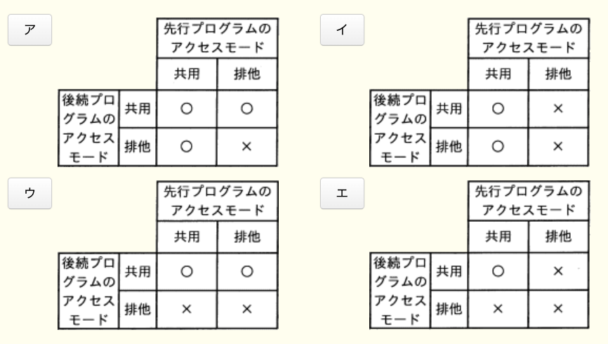

- A.**エ**

・共有ロック :  
データを読込むときに使うロックで、資源がこの状態の場合は他のトランザクションによる更新処理ができなくなる(読込みは可能)  
・排他(占有)ロック :  
データを更新するときに使うロックで、資源がこの状態の場合は他のトランザクションによる読込みや更新ができなくなる  
上記の性質から、ある資源に共用または排他ロックが設定されているときの新たなロックの可否は、「資源にかけられているロックが"共用"である場合にのみ、後続のトランザクションが新たに"共用ロック"をかける」ことができる

---
30.TCP / IPネットワークで使用されるARP(*Address Resolution Protocol*)の説明

- A.**IPアドレスからMACアドレスを得るためプロトコル**  
ARPはIPアドレスから対応する機器のMACアドレスを取得するプロトコル

IPアドレスからMACアドレスを得る手順は以下の通り。  
1.ARP要求フレームに送信元のIPアドレス・MACアドレスとMACアドレスを得たいノードのIPアドレスを格納して、イーサネットネットワークに`ブロードキャスト`する  
2.ARP要求フレームを受け取った各ノードは、フレーム内の解決対象IPアドレスが自身のIPアドレスと一致すれば、ARP応答フレームに自身のMACアドレスを格納して送信元に`ユニキャスト`で送信する

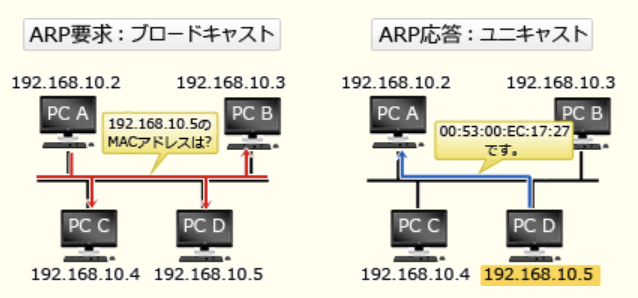

- IPアドレスからホスト名(ドメイン名)を得るためのプロトコル  
DNS(*Domain Name System*)の逆引きの説明

- MACアドレスからIPアドレスを得るためのプロトコル  
RARP(*Reverse Address Resolution Protocol*)の説明

- ホスト名(ドメイン名)からIPアドレスを得るためのプロトコル  
DNSの正引きの説明

---
31.ルータの機能に関する記述

- A.**伝送媒体やアクセス制御方式の異なるネットワークの接続が可能であり、送信データのIPアドレスを識別し、データの転送経路を決定する**  
ルータは、OSI基本参照モデルのネットワーク層でネットワーク同士を接続し、通過するパケットのIPアドレスを見てパケットを最適な経路に転送する通信装置。ネットワーク層は、OSI基本参照モデル第3層に位置するため下層の伝送媒体(物理層)やアクセス制御方式(データリンク層)の方式に影響されることなく接続することが可能となる

- MACアドレステーブルの登録情報によって、データフレームをあるポートだけに中継するか、全てのポートに中継するかを判断する  
ブリッジ、スイッチングハブの説明

- OSI基本参照モデルのデータリンク層において、ネットワーク同士を接続する  
ブリッジ、スイッチングハブの説明

- OSI基本参照モデルのトランスポート層からアプリケーション層までの階層で、プロトコル変換を行う  
ゲートウェイの説明

---
32.電子メールで静止画・動画・音声などの様々な情報を送ることができる仕組み

- A.**MIME**(*Multipurpose Internet Mail Extension*)  
ASCII文字しか使用できないSMTPを利用したメールで、日本語の2バイトコードや画像データを送信するための仕組み

- FTP(*File Transfer Protocol*)  
ネットワーク上でファイル転送を行うための通信プロトコル

- POP(*Post Office Protocol*)  
ユーザがメールサーバから自身のメールを取り出す処理において使用するメール受信用プロトコル

- TELNET(*Telcommunication Network*)  
端末からホストコンピュータにログインして遠隔操作を行うためのプロトコル

---
33.ONF(*Open Networking Foundation*)が標準化を進めているOpenFlowプロトコルを用いたSDN(*Software-Defined Networking*)の説明

- A.**ネットワーク制御機能とデータ転送機能を論理的に分離し、コントローラーと呼ばれるソフトウェアで、データ転送機能をもつネットワーク機器の集中制御を可能とするアーキテクチャ**  
ソフトウェア制御によって物理的なネットワーク構成にとらわれない動的で柔軟なネットワークを実現する技術全般を意味する

SDNを実現するための技術標準がOpenFlowプロトコルであり、既存のネットワーク機器がもつ制御処理(コントロールプレーン)と転送処理(データプレーン)を分離することで、OpenFlowコントローラが中央集権的に複数のスイッチの転送制御を管理する。OpenFlowではパケットやフレームをフローとして扱い、フローの様々な情報を使って柔軟に転送制御できるようになっている。スイッチはOpenFlowコントローラと通信を行いながら、OpenFlowコントローラから提供されるフローテーブルや直接の転送指示により転送先を判断する

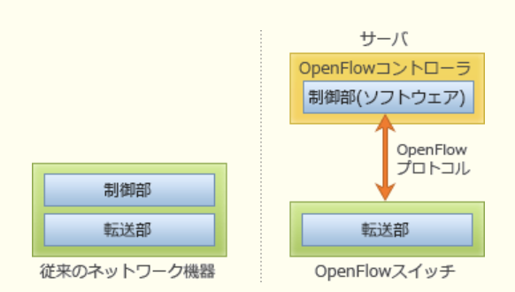

- 管理ステーションから定期的にネットワーク機器のMIB(*Management Information Base*)情報を取得して、稼働監視や性能管理を行うためのネットワーク管理手法  
SNMP(*Simple Network Management Protocol*)の説明

- データ転送機能をもつネットワーク機器同士が経路情報を交換して、ネットワーク全体のデータ転送経路を決定する方式  
従来のルーティングの仕組み

- ネットワーク制御機能とデータ転送機能を実装したソフトウェアを、仮想環境で利用するための技術  
ネットワーク仮想化(*Virtual Network Function*)の説明

---
34.2.4GHz帯の無線LANのアクセスポイントを、広いオフィスや店舗などをカバーできるように分散して複数設置したい。2.4GHz帯の無線LANの特性を考慮した運用をするために、各アクセスポイントが使用する周波数チャネル番号の割当て方

- A.**アクセスポイント相互の電波の干渉を避けるために、隣り合うアクセスポイントには、例えば周波数チャネル番号1と6、6と11のように離れた番号を割り当てるのがよい**  
2.4GHz帯ではチャネルが5つ以上離れていないと電波干渉が起こるので、通信範囲が重なり合うアクセスポイントには、1, 6, 11などの離れた番号を割り当てる必要がある

無線LANネットワークでは、近接するネットワークとの電波干渉を避けるために、使用する周波数帯をネットワークごとに微妙にずらすことが可能になっている。この時に設定する値をチャネル(チャンネル)と言う。  
2.4GHz帯を使用するIEEE802.11gでは1 ~ 13のチャネル(11bでは1 ~ 14)を選択できるが、1つのチャネルの周波数帯域は22MHz、各チャネルは5MHzずつ区切られているので、近接するチャネル同士は周波数帯が一部重なっていて電波干渉が起きる。このため、近くの無線LANネットワークで同じまたは近接するチャネルが使用されていると通信が不安定になってしまうという特性がある。5GHz帯を使用する無線LAN規格では各チャネルの周波数帯は完全に独立しているので、近接するチャネルを設定しても2.4GHz帯のような電波干渉は起きない

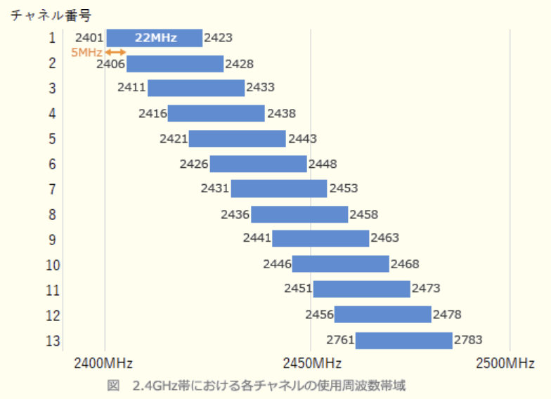

- PCを移動しても、PCの設定を変えずに近くのアクセスポイントに接続できるように、全てのアクセスポイントが使用する周波数チャネル番号は同じ番号に揃えておくのがよい  
無線LANを利用している端末が移動した際、シームレスに他のアクセスポイントに接続できる機能をハンドオーバと言う。ハンドオーバ時は端末が全チャネルのスキャンを行ってアクセスポイントを検出するため、同じチャネル番号である必要はない

- 異なるSSIDの通信が相互に影響することはないので、アクセスポイントごとにSSIDを変えて、かつ周波数チャネル番号の割当ては機器の出荷時設定のままがよい  
SSIDが異なれば混信(意図しないアクセスポイントに接続してしまうこと)は起こらないが、使用する周波数帯によって生じる電波干渉は避けれられない。機器の初期設定は同一の値になっていることが多いため、そのままの設定で使用すると通信が不安定になるおそれがある

- 障害時に周波数チャネル番号から対象のアクセスポイントを特定するために、設置エリアの端から1, 2, 3と順番に使用する周波数チャネル番号を割り当てるのがよい  
隣り合うネットワークに近接するチャネル番号を設定することになるので、電波干渉が起こり、通信が不安定になる恐れがある

---
35.2要素認証に該当する仕組み

- A.**パスワード認証、静脈認証**  
知識による認証と身体的特徴による認証なので2要素認証に該当する

ICカードとパスワード、指紋とパスワードなどのように、利用者が知っている・持っている・有している情報のうち2種類の要素を使用して認証を行う方式。2段階で認証を行うのでセキュリティを高めることはできるが、認証システムの導入コストが掛かることや認証のプロセスが煩雑になるデメリットもある

- クライアント証明書、ハードウェアトークン  
どちらも所有による認証

- 静脈認証、指紋認証  
どちらも身体的特徴による認証

- パスワード認証、秘密の質問の答え  
どちらも知識による認証

---
36.オープンリダイレクトを悪用した攻撃に該当するもの

- A.**Webサイトにアクセスすると自動的に他のWebサイトに遷移する機能を悪用し、攻撃者が指定した偽のWebサイトに誘導する**  
URLパラメータやフォームデータなどの外部パラメータによって指定されたWebページに遷移するようにしているWebアプリケーションが、実装不備により、無制限にURLを受け入れてしまう状態。攻撃者がこの脆弱性を悪用することで、利用者は気付かないうちに信頼できるWebサイトから悪意のあるWebサイトに誘導されてしまい、誘導した先でフィッシングなどの被害に遭う危険がある

- HTMLメールのリンクを悪用し、HTMLメールに、正規のWebサイトとは異なる偽のWebサイトのURLをリンク先に指定し、利用者がリンクをクリックすることによって、偽のWebサイトに誘導する  
標的型攻撃メールやフィッシングの例。HTMLでは、表示上のURLと実際のリンク先URLを異なるものにすることができることを悪用した攻撃

- インターネット上の不特定多数のホストからDNSリクエストを受け付けて応答するDNSキャッシュサーバを悪用し、攻撃対象のWebサーバに大量のDNSのレスポンスを送り付け、リソースを枯渇させる  
DNSアンプ(リフレクタ)攻撃

- 設定の不備によって、正規の利用者以外からの電子メールやWebサイトへのアクセス要求を受け付けるプロキシを悪用し、送信元を偽った迷惑メールの送信を行う  
踏み台攻撃の説明

---
37.発信者がメッセージのハッシュ値からデジタル署名を生成するのに使う鍵

- A.**発信者の秘密鍵**  
1.送信者は、平文をハッシュ関数で圧縮したメッセージダイジェストを`送信者の秘密鍵`で暗号化し、平文と一緒に送信する  
2.受信者は、受信したメッセージダイジェストを`送信者の公開鍵`で複合し、受信した平文をハッシュ関数を圧縮したものと比較する  
3.1つの平文からハッシュ関数によって生成されるメッセージダイジェストは常に同じになるため、送信者から送られてきたメッセージダイジェストと、受信側でハッシュ化したメッセージダイジェストが同じなら、通信内容が改ざんされていないことが証明される

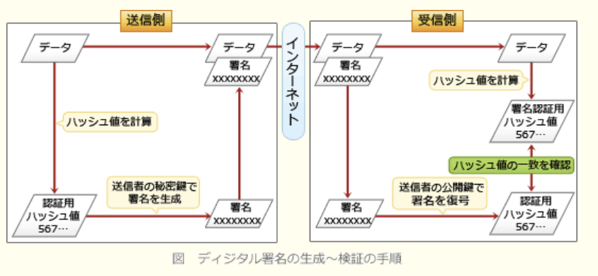

---
38.メッセージが改善されていないかどうか確認するため、そのメッセージから、ブロック暗号を用いて生成することができるもの

- A.**メッセージ認証符号**  
メッセージ改ざんの有無を受信側で検査するために付加されるデータ

メッセージ認証符号(*Message Authentication Code*)は、通信内容の改ざんの有無を検証し、完全性を保証するために通信データから生成される固定長のビット列のこと。生成には共通鍵暗号方式やハッシュ関数が用いられる。  
送信者は、メッセージからMACを生成し、メッセージとともに送信する。受信者は、受け取ったメッセージから送信者と同様の方法でMACを生成し、受け取ったMACと自分が生成したMACを比較する。メッセージ・鍵・アルゴリズムが同じであれば、生成されるMACは同じになるので、両者が一致すればメッセージが破損したり改ざんされたりしていないと判断できる

- PKI(*Public Key Infrastructure*)  
公開鍵基盤のこと。公開鍵の正当性を第三者が保証する一連の仕組み

- パリティビット  
伝送時のデータ誤りを検出するために付加される検査用ビットのこと。送信するデータの一定長のビット列ごとに1ビットの検査ビットを付加し、受信側では受信データと検査ビットを照合することで誤りを検出する

- ルート証明書  
ルートCAが発行した証明書。デジタル証明書は、ルートCAを最上位とする上位CAが下位CAを認証して証明書を発行するという階層構造になっている。デジタル証明書の検証ではこの階層構造を遡り、最終的にルート証明書に行きつくかどうかによって正当性を判断している

---
39.化学製品を製造する化学プラントに、情報ネットワークと制御ネットワークがある。この2つのネットワークを接続し、その境界に、制御ネットワークのセキュリティを高めるためにDMZを構築し、制御ネットワーク内の機器のうち、情報ネットワークとの通信が必要なものをこのDMZに移した。DMZに移した機器はどれか

- A.**定期的にソフトウェアをアップデートする機器に対して、情報ネットワークから入手したアップデートソフトウェアを提供するパッチ管理サーバ**  
DMZに移すのは`情報ネットワークとの通信が必要なもの`。パッチ管理サーバは、アップデートソフトウェアを情報ネットワークから入手するとあり、DMZに移す機器となる

DMZ(*Demilitarized Zone*)は、外部に公開するために隔離した内部ネットワークのこと。  
近年の制御システムのオープン化・ネットワーク化に伴い、制御システムのセキュリティ脅威は増大している。情報ネットワークで発生したマルウェア被害の影響を制御ネットワークに与えないために、情報ネットワークと制御ネットワークはできるだけ分離しておき、必要最小限の接続に留めることが大切

---
40.JPCERTコーディネーションセンター(JPCERT / CC)の説明

- A.**特定の政府機関や企業から独立した組織であり、国内のコンピュータセキュリティインシデントに関する報告の受付・対応の支援・発生状況の把握・手口の分析・再発防止策の検討や助言を行っている**  
インターネットを介して発生する侵入やサービス妨害等のコンピュータセキュリティインシデントについて、日本国内のサイトに関する報告の受け付け・対応の支援・発生状況の把握・手口の分析・再発防止のための対策の検討や助言などを、技術的な立場から行なっている。  
特定の政府機関や企業からは独立した中立の組織として、日本における情報セキュリティ対策活動の向上に積極的に取り組んでいる

- 産業標準化法に基づいて経済産業省に設置されている審議会であり、産業標準化全般に関する調査・審議を行っている  
日本産業標準調査会(JISC)の説明

- 電子政府推奨暗号の安全性を評価・監視し、暗号技術の適切な実装法・運用法を調査・検討するプロジェクトであり、総務省及び経済産業省が共同で運営する暗号技術検討会などで構成される  
CRYPTRECの説明

- 内閣官房に設置され、我が国をサイバー攻撃から防衛するための司令塔機能を担う組織である  
NISC(内閣サイバーセキュリティセンター)の説明

---
41.入室時と退室時にIDカードを用いて認証を行い、入退室を管理する。この時、入室時の認証に用いられなかったIDカードでの退室を許可しない、又は退室時の認証に用いられなかったIDカードでの再入室を許可しないコントロールを行う仕組み

- A.**アンチパスバック**  
セキュリティ区画の出入口で利用者IDごとに入退室の時刻を記録することで、次の例のような矛盾のある入退室行動を制限する仕組み。  
1.直近の記録が入室である利用者の入室行動  
2.直近の記録が体質、またはその日の入室記録がない利用者の退室行動  
通常の利用であれば入室と退室はペアのため、このような矛盾は生じない。しかし「他人が入室する際に一緒に入室する」「他人が退室するのとすれ違いに入室する」などの共連れ行為で入室した利用者は、アンチパスバックにより正当な方法での退室が禁止される

- TPMOR(*Two Person Minimum Occupancy Rule*)  
最初の入室者と最後の退室者に対して2人同時の入室・退室を課すことで、セキュリティ区画内に1人のみが在室する状況を防止する仕組み。直訳すると"2人以上の最小滞在ルール"

- インターロックゲート  
入室ゲートを二重扉にすることで1人ずつしか入退室できないようにする装置

- パニックオープン  
火災報知機の作動や停電等の非常事態発生時に、入退室ゲートを自動的に解錠し避難経路を確保する仕組み

---
42.Webシステムにおいて、セッションの乗っ取りの機会を減らすために、利用者のログアウト時にWebサーバ又はWebブラウザにおいて行うべき処理はどれか。利用者は自分専用のPCにおいて、Webブラウザを利用しているものとする

- A.**WebサーバにおいてセッションIDを無効にする**

IPAで公開されているセキュアプログラミング講座では、セッション乗っ取りの機会を低減するための予防策として、「セッションタイムアウト」「明示的なログアウト機能」を挙げている  
・セッションタイムアウト :  
Webアプリケーションにはセッションタイムアウト機能を設ける。ユーザはログアウト操作を忘れてしまうことがある  
・明示的なログアウト機能 :  
Webアプリケーションには明示的なログアウト機能を設ける。出来れば各ページでログアウト操作を行えると良い  
利用者がログアウトを要求した場面では、Webアプリケーションは次のような操作を行うべきとしている。  
・Webサーバ側でセッションIDを確実に無効にする。その後同じセッションIDがクライアントから送られてきても受け付けない  
・Webブラウザ側のセッションIDを消去する  
一般的なWebページのセッション管理方式では、WebブラウザとWebサーバでセッションIDを共有することで同じ利用者かどうかを判断しています。セッションIDさえ一致すれば、第三者からのアクセスを正規のアクセスとして判断してしまう可能性があるということであり、不要なセッションIDを有効なままにしておくのはセキュリティ上のリスクになる。  
セッションIDを必要とするのはログイン中だけなので、ログアウトが要求された(セッションIDが不要になった)時点でWebサーバ側(可能であればWebブラウザも)のセッションIDを無効化し、それ以降は無効化されたセッションIDを拒否することで、セッション乗っ取りの機会を最小限に減らせる

---
43.図のような構成と通信サービスのシステムにおいて、Webアプリケーションの脆弱性対策のためのWAFの設置場所として最も適切な箇所はどこか。WAFには通信を暗号化したり、複合したりする機能はないものとする

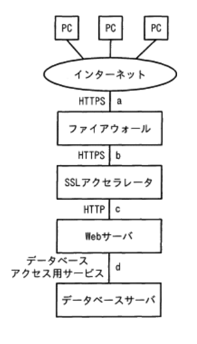

- A.**c**  
WAF(*Web Application Firewall*)は、通過するパケットのIPアドレスやポート番号だけでなくペイロード部(データ部分)をチェックすることで、Webアプリケーションに対するこれらの攻撃を検知し、遮断することが可能なファイアウォール。  
パターンマッチングやHTTPヘッダの検証などによって不正な通信を検知するが、HTTPS通信が行われている経路上のパケットは暗号化されていてペイロード部分を見ることができないため、これらの検知手法が使えない。そのためaとbは設置場所として不適切。  
WAFによる不正アクセスの検知・遮断はWebアプリケーションによって処理が実行される前におこなれる必要があるためdも不適切。  
SSLアクセラレータは、SSL / TLS通信におけるパケットの暗号化と複合を高速に行う専用の機器。Webサーバの処理負荷を軽減する目的で設置される

---
44.ICカードの耐タンパ性を高める対策

- A.**信号の読み出し用プローブの取付けを検出するとICチップ内の保存情報を消去する回路を設けて、ICチップ内の情報を容易には解析できないようにする**  
解読や偽造に対して物理的に情報を保護するための機能なので、耐タンパ性を高める行為に該当する

耐タンパ性とは、ハードウェアやソフトウェアのセキュリティレベルを表す指標で、外部からの物理的接触により機器内部の構造を不当に解析・改変したり、重要データを取り出そうとしたりする行為に対してどの程度の耐性を有するかを表す

- ICカードとICカードリーダーとが非接触の状態で利用者を認証して、利用者の利便性を高めるようにする  
システムの使用性を高めるための対策

- 故障に備えてあらかじめ作成した予備のICカードを保管し、故障時に直ちに予備カードに交換して利用者がICカードを使い続けられるようにする  
システムの信頼性を高めるための対策

- 利用者認証にICカードを利用している業務システムにおいて、退職者のICカードは業務システム側で利用を停止して、他の利用者が利用できないようにする  
システムのセキュリティを高めるための対策

---
45.ソフトウェアの使用性を向上させる施策

- A.**オンラインヘルプを充実させ、利用方法を理解しやすくする**  
使用性(*Usability*)を向上させる施策。分かりやすさ、使いやすさの度合い。副特性に理解性・取得性・運用性が含まれる

ISO / IEC9126(JIS X 0129)では、ソフトウェアの品質特性として6つと、品質特性をブレークダウンした21の品質副特性を定めている。  
・効率性(*Efficiency*) :  
目的達成のために使用する時間や資源の度合い。副特性に時間効率性・資源効率性が含まれる

・保守性(*Maintainability*) :  
保守(改訂)作業に必要な労力の度合い。副特性に解析性・変更性・安定性・試験性が含まれる

・移植性(Portability) :  
移植のしやすさ、別の環境へ移した際そのまま動作する度合い。副特性に環境適用性・設置性・規格適合性・置換性が含まれる

- 外部インタフェースを見直し、連携できる他システムを増やす  
機能性(*Functionality*)を向上させる施策。目的から求められる必要な機能の実装の度合い。副特性に合目的性・正確性・相互運用性・標準適合性・セキュリティが含まれる

- 機能を追加し、業務の遂行においてシステムを利用できる範囲を拡大する  
機能性を向上させる施策

- データの複製を分散して配置し、装置の故障によるデータ損失のリスクを減らす  
信頼性(*Reliability*)を向上させる施策。機能が正常動作を続ける度合い、障害の起こりにくさの度合い。副特性に成熟性・障害許容性・回復性が含まれる

---
46.オブジェクト指向における基底クラスと派生クラスの関係にあるもの

- **"図形"と"三角形"**  
三角形は図形であると言えるので、汎化 - 特化関係にある  
*is - a*(汎化- 特化)関係 :  
"動物 - 犬"や"家電 - テレビ"などのように、「yyはxxである」で表される関係。上位クラス(基底クラス)の特性を継承して作成される下位クラスは派生クラスやサブクラスと呼ばれる  

- "会社"と"社員"  
社員は会社の一部と言えるので、集約 - 分解関係になる  
- "自動車"と"エンジン"  
エンジンは自動車の一部と言えるので、集約 - 分解関係になる  
- "人間"と"頭"  
頭は人間の一部と言えるので、集約 - 分解関係になる  
*part- of*(集約- 分解)関係 :  
"コンピュータ - CPU"や"自転車 - サドル"などのように、「yyはxxの一部である」で表される関係

---
47.売上ファイルのレコードの項目の1つに処理区分があり、この処理区分に応じた処理をしたい。全売上データに対する各処理区分の出現比率は予め分かっている。処理区分を判定するための比較回数に関する記述のうち、適切なもの

- A.**出現比率が最も大きい処理区分から先に判定すると、全体の比較回数が少なくなる**  
大は1度、中と小は2回で判定される。平均比較回数は、  
1 * 0.6 + 2 * 0.3 + 2 * 0.1 = 1.4回  
プログラムでの分岐処理でも同様に、出現比率が高いものを先に判定するほど、比較回数は少なく済む

処理を2つに分岐させるなら常に1回の判定で良いが、3つ以上の処理に分岐させる場合には、条件判定の記述順によって全体の比較回数が変わることになる。出現回数の多い処理区分ほど、少ない判定回数で済む順序になっている必要がある。  
条件を単純化して、出現比率が最も大きい処理区分(大、60%)が、中間の処理区分(中、30%)、最も小さい処理区分(小、10%)と仮定する

- 出現比率が中間の処理区分のものを先に判定すると、全体の比較回数が少なくなる  
中は1度、大と小は2回で判定される。平均比較回数は、  
1 * 0.3 + 2 * 0.6 + 2 * 0.1 = 1.7回

- 出現比率が最も小さい処理区分から先に判定すると、全体の比較回数が少なくなる  
小は1度、大と中は2回で判定される。平均比較回数は、  
1 * 0.1 + 2 * 0.6 + 2 * 0.3 = 1.9回

- どのような順番でも全体の比較回数は同じである  
判定する順序により全体の比較回数は異なる

---
48.エラー埋込み法による残存エラーの予測において、テストが十分に進んでいると仮定する。当初の埋込みエラー数は48個である。テスト期間中に発見されたエラーの内訳は、埋込みエラー数が36個、真のエラーが42個である。残存する真のエラー数は何個と推定されるか

- A.**14**  
埋め込みエラー36個に対して、真のエラーが42個発生している。埋め込みエラー48個に対して、x個の真のエラーがあるとすると、  
36 : 42 = 48 : x  
x = (7 * 6 * 8 * 6) / (6 * 6) = **56**  
既に42個のエラーは出現しているため、  
56 - 42 = 14

---
49.回帰テスト(リグレッションテスト)の説明

- A.**プログラムを修正したことによって、想定外の影響が出ていないかどうかを確認するためのテストである**  
既存のソフトウェアが新しい変更や修正を導入した際に、既存の機能に影響を与えないことを確認するために行われる(退行てすととも呼ばれる)

保守作業等によりシステムに変更を加えた場合に、それにより以前まで正常に機能していた部分に不具合や影響が出ていないかを検証するテスト。回避圧段階で実施したテストケースを全て再実施して検証するほか、影響を与え得る部分に限定してテストを再実施するなどの方法がある

- 新規に作成したプログラムの各モジュールの誤りを検出するためのテストである  
既存のモジュールに生じる誤りを検出するためのテスト

- ホワイトボックステストに限定して、単体モジュールの誤りを検出するためのテストである  
単体テストの説明

- 毎回、テストケースとテストデータを、作り直して行うテストである  
通常、リグレッションテストでは、過去に既存のモジュールがパスしたテストケースを再利用するので、毎回テストケースを作り直す必要はない

---
50.アジャイル開発におけるプラクティスの1つであるバーンダウンチャートはどれか。図中の破線は予定(予想)、実線は実績を表す

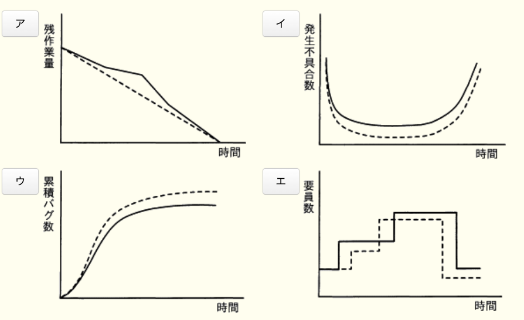

- A.**ア**  
縦軸に残作業量、横軸に時間を取り、実績をプロットしていくことで作業の消化具合を視覚的に把握できるようにした図。プロジェクトの経過に伴い残作業量は減っていくので、基本的には右肩下がりのグラフになる。  
作業開始時の最大作業量から目標となるリリース日もしくはイテレーション終了日までを直線で結び、理想的な作業進行を表す予定線を書いておく。イテレーションや作業日の終わりに実績をプロットしていく際に、この予定線より上となる場合は計画より作業が遅れている、予定線より下となる場合は計画より作業が進んでいる、と判断することができる。バーンダウンチャートを作成することで、プロジェクトの明確な進捗状況をチーム内で共有でき、適切な対策を適切なタイミングで実施できるようになる効果がある

- イ  
故障率曲線

- ウ  
バグ管理図

- エ  
要因ヒストグラム

### `マネジメント系`

---
51.次のプレシデンスダイアグラムで表現されたプロジェクトスケジュールネットワーク図を、アローダイアグラムに書き直したものはどれか。プレシデンスダイアグラムの依存関係は全てFS関係とする

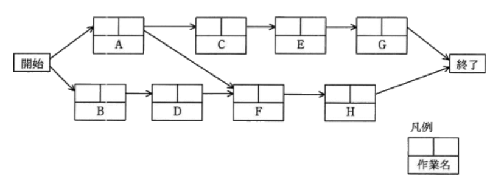

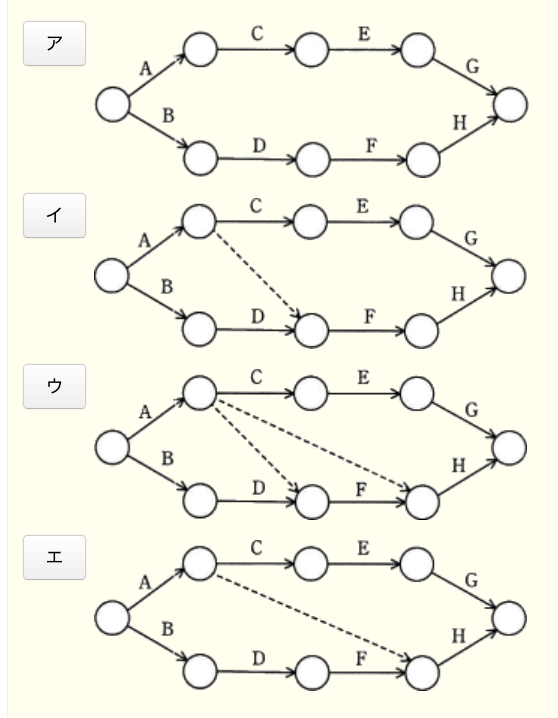

- A.**イ**  
作業Aと作業Dからの矢印が作業Fに向かって伸びており、これは作業Fの開始条件が作業Aおよび作業Dの両方の完了であることを示している。アローダイアグラムの中で、作業Aの結合点からのダミー作業線および作業Dの矢印が、作業F開始の結合点に向かって記述されている

プレシデンスダイアグラム法(PDM法)は、個々の作業を四角で囲み、作業同士を矢印で結ぶことで作業順序や依存関係を表現する図法。アローダイアグラムでは作業を矢印で結合点を丸のノードで示すので、記述方法が根本的に異なる。  
アローダイアグラムではある作業の終了が別の作業の開始条件となる「終了 - 開始」(*Finish to Start*)の依存関係しか表現できないが、プレシデンスダイアグラムでは「開始 - 開始」(*Start to Start*)、「開始 - 終了」(*Start to Finish*)、「終了 - 終了」(*Finish to Finish*)の関係を記述できるのが特徴。  
FS関係は、ある作業の終了が別の作業の開始条件となっている関係を意味しており、アローダイアグラムの矢印で示される依存関係がこれに相当する。

- ア  
作業Aと作業FのFS関係が表現されていない

- ウ  
存在しない作業Aと作業HのFS関係が記述されている

- エ  
作業Aと作業HのFS関係を表すため誤り

---
52.アプリケーションにおける外部入力・外部出力・内部論理ファイル・外部インタフェースファイル・外部照会の5つの要素の個数を求め、それぞれを重み付けして集計する。集計した値がソフトウェア開発の規模に相関するという考え方に基づいて、開発規模の見積りに利用されるもの

- A.**ファンクションポイント法**  
外部入出力と内部ファイル数などの個数と開発難易度からファンクションポイントを求め、それを基に開発規模を見積もる手法

コスト見積りにおいて、外部入出力や内部ファイルの数と難易度の高さから論理的に開発規模を見積もる手法。システムの機能と複雑さなどの因子をもとにファンクションポイントを算出して、開発工数を見積る。利用者側に見える出力帳票をもとに、開発規模を見積もるので依頼者側とのコンセンサス(合意)が取りやすいという特徴がある

- COCOMO(*Constructive Cost Model*)  
予想されるプログラム行数にエンジニアの能力や要求の信頼性などの補正係数を掛け合わせて開発工数や期間、要員や生産性を見積もる手法

- Dotyモデル  
ソフトウェア開発の工数は、プログラムのステップ数の指数乗に比例するという考え方で開発工数を見積もる手法

- putnamモデル  
総開発工数から、それを分解した各開発工程の工数を推定するトップダウン式の手法

---
53.品質の定量評価の指標のうち、ソフトウェアの保守性の評価指標になるもの

- A.**(修正時間の合計) / (修正件数)**  
保守性は、修正のしやすさに関するソフトウェア製品の能力と定義している。保守性の度合いは、そのソフトウェアを修正するために要するコストの高低によって決まり、修正1件当たりに要した時間を表す式が評価指標として適切

- (最終成果物に含まれる誤りの件数) / (最終成果物の量)  
残存バグ数の割合を表す式で、信頼性の評価指標

- (変更が必要となるソースコードの行数) / (移植するソースコードの行数)  
別環境への移植に際して変更が必要となるソースコードの割合を表す式で、移植性の評価指標

- (利用者からの改良要求件数) / (出荷後の経過月数)  
月当たりの改良要求件数を表す式で、機能性の評価指標

---
54.プロジェクトで発生している品質問題を解決するに当たって、図を作成して原因の傾向を分析したところ、全体の80%以上が少数の原因で占められていることが判明した。作成した図はどれか

- A.**パレート図**  
多数の要素の中から管理対象とすべき重要な群を明らかにするために使用する。値の大きい順に分析対象の項目を並べた棒グラフと、累積構成比を表す折線グラフを組み合わせた複合グラフで、主に複線の分析対象の中から重要である要素を識別できる

- 管理図  
中央線及び上限・下限を示す原回線を引いて、製品などの特性値を打点することで、工程の状態や品質を時系列に表した図。工程が安定した状態にあるかどうかを判断するために使用される

- 散布図  
縦軸・横軸に2項目の量や大きさ等を対応させて、分析対象のデータを打点した図。2項目間の分布・相関関係を把握するのに使用される

- 特性要因図  
特性(結果)とそれに影響を及ぼしたと思われる要因(原因)の関係を体系的に表した図。多数の要素を直接的な原因と間接的な原因に分別したり、真の問題点を明確にしたりするために使用される

---
55.合意されたサービス提供時間が7時 ~ 19時であるシステムにおいて、ある日の16時にシステム障害が発生し、サービスが停止した。修理は21時まで掛かり、当日中にサービスは再開できなかった。当日のサービスは予定どおり7時から開始され、サービス提供の時間帯にサービスの計画停止は行っていない。この日の可用性は何%か。可用性は小数点以下を切り捨てるものとする

- A.**75**  
サービスの可用性は、サービス提供時間の計画に対する実績の割合。サービス提供時間の計画は12時間。その日はサービスを再開できていないので、実績は7時から16時までの9時間。よってサービスの可用性は、  
9時間 / 12時間 = 75%

---
56.新システムの開発をしている。システムの総所有費用(TCO)は何千円か。このシステムは開発された後、3年間使用されるものとする(単位 : 千円)

|項目                  |費用  |
|---------------------|------|
|ハードウェア導入費用    |40,000|
|システム開発費用        |50,000|
|導入教育費用           |5,000 |
|ネットワーク通信費用 / 年|1,500 |
|システム保守費用 / 年   |7,000 |
|システム運営費用 / 年   |5,000 |

- A.**135,500**  
TCO(*Total Cost Ownership*)は、ある設備・システムなどを取得してから廃棄に至るまでのライフサイクル全体で発生するコストの総額を表し、総所有コストとも呼ばれる。イニシャルコストとランニングコストで構成される。  
システム導入にかかるイニシャルコストは、  
40,000 + 50,000 + 5,000 = `95,000千円`  
運用保守にかかるランニングコストは、年間のコスト3年分で、  
(1,500 + 7,000 + 5,000) * 3 = `40,500千円`  
上記2つの額を合算すると、  
95,000 + 40,500 = `135,500千円`

---
57.システム運用におけるデータの取扱いに関する記述

- A.**入力データのエラー検出は、データを処理する段階で行うよりも、入力段階で行った方が検出及び修正の作業効率が良い**  
間違った入力データが与えられると、それが波及して複数の処理に不具合が出る可能性があるので、一般的に修正作業のコストが増す。処理段階で発生したエラーの原因を究明するのにも時間がかかる。入力段階でエラーを排除する仕組みを取り入れた方が作業効率が良くなる

- エラーデータの修正は、データの発生元で行うものと、システムの運用者が所属する運用部門で行うものに分けて実施する  
エラーデータの修正は、データの発生元で行うのが適切な運用

- 原始データの信ぴょう性のチェック及び原始データの受渡しの管理は、システムの運用者が所属する運用部門が担当するのが良い  
原始データの信憑性のチェック及び原始データの受渡しの管理は、そのデータについて熟知しているデータ発注元の部門が担当するが適切

- データの発生元でエラーデータを修正すると時間が掛かるので、エラーデータの修正はできるだけシステムの運用者が所属する運用部門に任せる方が良い  
運用中にエラーデータを検出した場合、それが運用部門内で容易に修正できるものであったとしても、運用規程に定められているエラーの修正と再処理手順に基づき対処する。運用方法としては管理者やシステム管理部門に報告して指示を仰ぐのが原則

---
58.システム監査において、電子文書の真正性の検証に電子証明書が利用できる公開鍵証明書取得日、電子署名生成日及び検証日の組合せはどれか。公開鍵証明書の有効期間は4年間とし、当該期間中の公開鍵証明書の更新や失効は考慮しない前提とする

|選択肢|公開鍵証明書取得日|電子署名生成日|検証日|
|-----|---------------|-----------|-----|
|ア|2014 / 3 / 1|2016 / 8 / 1|2020 / 12 / 1|
|イ|2016 / 1 / 1|2018 / 12 / 1|2020 / 2 / 1|
|ウ|2017 / 4 / 1|2017 / 5 / 1|2020 / 12 / 1|
|エ|2018 / 8 / 1|2016 / 7 / 1|2020 / 3 / 1|

- A.**ウ**  
証明書取得後に署名されており、検証日も証明書の有効期限内なので問題なく真正性の検証が行える

- ア  
検証日には公開鍵証明書が有効期限切れになっているため検証に使用できない

- イ  
検証日には公開鍵証明書が有効期限切れになっているため検証に使用できない

- エ  
署名の生成日が証明書取得日よりも前になっている。証明書発行前に生成された署名はその正当性が担保されないため、文書の真正性の検証には使えない

---
59.システム監査人が行う改善提案のフォローアップ

- A.**改善提案に対する監査対象部門の改善状況をモニタリングする**  

システム監査人は、監査結果に改善提案を記載した場合、提案に基づいて所用の措置が講じられているかを確認し、改善状況をモニタリングしなければならない。このシステム監査人のシステム監査後の役割をフォローアップと言う。  
フォローアップは、監査対象部門の責任において実施される改善をシステム監査人が事後的に確認するという性質のもので、監査人は、改善の実施そのものに責任をもつことはない。改善計画の策定及びその実行への関与は、監査人の独立性と客観性を損なうことに留意しなければならない。  
「改善の実施を指示する」「実施状況の管理を行う」「改善実施計画を策定する」のいずれも監査対象部門が行うべきことだと判断できる。監査人の役割は被監査側が実施する改善計画を見守り、改善計画が適切に遂行されるように助言を行うことなので、"改善状況をモニタリングする"が適切

- 改善提案に対する改善の実施を監査対象部門の長に指示する
- 改善提案に対する監査対象部門の改善実施プロジェクトの管理を行う
- 改善提案の内容を監査対象部門に示した上で改善実施計画を策定する

---
60.システム開発委託先(受託先)から委託元(委託者)に納品される成果物に対するユーザ受入テストの適切性を確かめるためのシステム監査の要点

- A.**受託者から納品された成果物に対して、委託者が要件定義に基づきユーザ受入テストを実施していること**  
委託先から納品された成果物に対する受入テストは「委託元が作成したテスト計画に基づいて委託元が実施している」ことが重要。受入テストの適切性・公平性が損なわれ、成果物の不具合を(意図的に)見逃してしまうリスクがある

- 委託者が作成したユーザ受入テスト計画書に従って、受託者が成果物に対してユーザ受入テストを実施していること  
受託側が受入テストを実施しているため誤り

- 受託者が成果物と一緒にユーザ受入テスト計画書を納品していること  
受入テスト計画は委託元が作成する

- 受託者から納品された成果物に対して、監査人がユーザ受入テスト計画を策定していること  
監査人が受入テスト計画を策定することはない

### `ストラテジ系`

---
61.エンタープライズアーキテクチャにおいて、業務と情報システムの理想を表すモデル

- A.**To - Beモデル**  
対象の理想的な将来像・目標を表現するモデル。EAでは「政策・業務体系」「データ体系」「適用処理体系」「技術体系」の4体系で、それぞれ最初に現状を分析した現状モデル(*As - Is*)を整理し、目標とする理想モデル(*To - Be*)を描き、最後に現状と理想目標を比較した現実的な次期モデルを作成する

- EA参照モデル  
政府が公開しているEAのひな形のこと

- ザックマンモデル  
EAの基礎となっているフレームワークで、5種類の異なる立場の視点とそれぞれの5W1Hの側面から分析・記述する手法

- データモデル  
対象業務を情報システムやDBMSにおける抽象的な形式としてモデル化したもの

---
62.情報戦略を投資効果を評価する時、利益額を分子、投資額を分母にして算出するもの

- **ROI(*Return on Investment*)**  
投資利益率のこと。投資額に対してどれだけ利益を生み出しているかを見る尺度で、`(利益額 / 投資額) * 100`で算出する。ROIが大きいほど投資対効果が高いことになる

- EVA(*Economic Value Added*)  
経済的付加価値のこと。企業が一定期間に生み出した経済的価値を評価する指標の1つ。  
`EVA = 税引後営業利益 - 投下資本 * 資本コスト`

- IRR(*Internal Rate of Return*)  
内部収益率のこと。投資により将来得られるキャッシュフローの現在価値と投資額の現在価値とが等しくなる割引率(内部収益率)を求め、投資により見込まれる内部収益率が本来得るべき利回りより大きいかどうかで投資の可否を判断する手法

- NPV(*Net Present Value*)  
正味現在価値のこと。投資により得られるキャッシュフローを現在価値に換算し、そこから投資額を引いた正味現在価値を求め、その額が0を上回っているかどうかで投資の可否を判断する手法

---
63.テレワークで活用しているVDIに関する記述

- A.**PC環境を仮想化してサーバ上に置くことで、社外から端末の種類を選ばず自分のデスクトップPC環境として利用できるシステム**  
仮想デスクトップ環境を提供する技術。VDI(*Virtual Desktop Infrastructure* : 仮想デスクトップ基盤)は、サーバ内にクライアントごとの仮想マシンを用意して仮想デスクトップ環境を構築する技術。利用者はネットワークを通じてVDIサーバ上の仮想デスクトップ環境に接続し、クライアントPCにはVDIサーバからの**操作結果画面のみが転送される**仕組みになっている

この仕組みにより、クライアントがインターネット上のサイトと直接的な通信を行わなくなるので、クライアントPCをインターネットから分離できる。利用者の操作により不正なマルウェアをダウンロードしてしまったとしても、保存されるのはVDIサーバ上の仮想環境なので、クライアントPCへの感染を防げる。汚染された仮想環境を削除してしまえばVDIサーバへの影響もない

- インターネット上に仮想の専用線を設定し、特定の人だけが利用できる専用ネットワーク  
VPN(*Virtual Private Network*)の説明

- 紙で保管されている資料を、ネットワークを介して遠隔地からでも参照可能な電子書類に変換・保存することができるツール  
スキャナーや文書管理システムの説明

- 対面での会議開催が困難な場合に、ネットワークを介して対面と同じようなコミュニケーションができるツール  
テレビ(ビデオ)会議システムの説明

---
64.社内の業務システムの要件定義の合意形成の対象者に含まれるもの

- A.**システムの運用・保守を担当している社内部門の責任者**  
利用部門を代表して合意を得る必要がある人物に該当する

要件定義は、システム化の企画に基づいて、システムで実現すべき業務、その業務を実現するためにシステムに必要な機能、システムに求められる性能や特性を明らかにし、利用関係者と合意するプロセス。利用関係者には、利用者・運用者・支援者・開発者・製作者・教育訓練者・保守者・取得者などが含まれる。  
開発しようとしているシステムは社内の業務システムなので、システムの利用者となるのは社内のユーザー部門ということになる。したがって、完成したシステムを運用・保守することとなる社内部門の責任者の合意が必要。要件定義に利用部門の者が参加することで、利用者の要求が過不足なく反映されているかを確認することができ、システムの完成後に「欲しかったのはこれじゃない」という結果になるのを予防することができる

- 開発要員を派遣している派遣元の責任者  
開発要員は利害関係者に含まれるが、その要員を派遣している派遣元の責任者は利用関係者に含まれない

- 当システムのRFP発行先の全てのベンダーの責任者  
システム開発をベンダに依頼する場合でも、要件定義の合意は契約を行うこととなるベンダのみで足りる。提案依頼を出した全てのベンダの合意を得る必要はない

- プロジェクト管理で使用する進捗管理ツールの提供元の責任者  
利用関係者に含まれない

---
65.半導体ファブレス企業の説明

- A.**製品の企画・設計及び開発は行うが、半導体製造の工場は所有しない**  
*fabless*の通り、fab(*fabrication* : 生産工場)を所有せずに製造業としての活動を行う企業のこと。半導体産業はファブレスが主流となっている業種の1つ。  
ファブレス企業は、自社で企画・設計や開発を行い、製造を他の企業に委託、そして完成した製品を自社ブランドとして販売するというビジネスモデルをとる。生産工場を持たないことで設備投資や維持管理の負担やリスクを回避できることや、設計や販売に注力できるメリットがある

- 委託者の依頼を受けて、自社工場で半導体製造だけを行う  
半導体チップの製造を専門的に請け負うファウンドリ企業の説明

- 自社で設計し、自社工場で生産した製品を相手先ブランドで納入する  
せっけいも含めて受託するODM(*Original Design Manufacturer*)の説明

- 自社内で回路設計から製造まで全ての設備をもち、自社ブランド製品を販売する  
垂直統合型デバイスメーカー(*Integrated Device Manufacturer*)の説明

---
66.M&Aの説明

- A.**新規分野への進出や、事業の拡大・再編などのために、他社の経営資源を獲得し活用する**  
M&A(*Mergers and Acquisitions*)は、合併と買収の略で、自社に吸収合併したり他社の株式を多く取得し買収することで子会社化し、自社の経営資源とすることが可能な戦略。新規事業や市場への参入、企業グループの再編・事業統合・経営が不振な企業の救済など様々な目的で実施される

- 企業独自のノウハウや技術などによって競争優位を維持・強化できる分野に対して、資金と人材を集中的に投入する  
選択と集中の説明

- 自社の業務プロセスを改革する際に、他社のベストプラクティスと比較分析を行う  
ベンチマーキングの説明

- それぞれの事業を、市場成長率と市場占有率のマトリックスによって分析し、経営資源の最適な配分を行う  
事業ポートフォリオ分析の説明

---
67.企業の競争戦略におけるフォロワ戦略

- A.**目標とする企業の戦略を観察し、迅速に模倣することで、開発や広告のコストを抑制し、市場での存続を図る**  
フォロワ企業の戦略。リーダやチャレンジャの戦略を模倣して、市場での地位を維持している企業。  
フォロワ企業は、リーダ企業からの報復を招かないことに注意して収益性を高めていく必要がある。フォロワ企業には、リーダ企業にとってあまり美味しくない市場(中低価格志向の市場等)にターゲットを定め、選択と集中を進める戦略がよく見られる

- 上位企業の市場シェアを奪うことを目標に、製品・サービス・販売促進・流通チャネルなどのあらゆる面での差別化戦略をとる  
チャレンジャ企業のとる差別化戦略。リーダに次ぐシェアを保持し、リーダに競争をしかける企業

- 潜在的な需要がありながら、大手企業が参入してこないような専門特化した市場に、限られた経営資源を集中する  
ニッチャ企業のとるニッチ戦略。小さいながらも、特定の市場で独自の地位を築いている企業

- 利潤、名声の維持・向上と最適市場シェアの確保を目標として、市場内の全ての顧客をターゲットにした全方位戦略をとる  
リーダ企業のとる全方位(フルライン)戦略。市場においてナンバー1のシェアを誇る企業

---
68.コモディティ化の説明

- A.**技術の成熟などによって、他社製品との差別化が価格以外の点で困難になること**  
汎用品化とも呼ばれ、ある製品やカテゴリーについてメーカーや販売会社ごとの機能的・品質的な差異がごく僅かとなり、均一化している様子をいう。  
この様な状態では、価格以外の差別化要素がないため値下げ競争に陥りやすくなり、メーカーや小売業者を含む市場全体の収益性が低下しまう傾向がある

- 革新的な発明に基づいて、従来は市場に存在しなかった製品を開発し、市場に投入すること  
プロダクトイノベーションの説明

- 技術革新によって、後発製品が先発製品の市場を衰退させること  
破壊的イノベーションの説明

- 市場での価格競争を避けるために、他社製品とは異なる機能をもった製品を開発し、販売すること  
ブルーオーシャン戦略の説明

---
69.TLO(*Technology Licensing Organization* : 技術移転機関)の役割

- A.**大学の研究成果の特許化及び企業への技術移転の促進**  
大学や高等専門学校等における研究成果を特許化し、それを民間事業者に技術移転する法人のこと。大学等における技術に関する研究成果の民間事業者への移転の促進に関する法律(通称TLO法)に基づいて、承認・運用が行われており、2019年現在34機関が承認されている。  
大学等と民間事業者の間に立ち、大学の研究成果を特許化し、それを民間企業にライセンスしてそのロイヤリティを大学等に還元する。TLOの役割は、`大学の研究成果を特許化し、又は企業への技術移転を支援し、産学の仲介役を果たす`こと

- TLO自らが研究開発して取得した特許の、企業へのライセンス  
研究開発はTLOの関連する大学等で行う。TLOは大学等の研究成果を特許化し、企業にライセンスする役割がある

- 企業から大学への委託研究の問合せ及び申込みの受付  
研究開発はTLO承認時の実施計画の下に関連大学の主導で行う

- 新規事業又は市場への参入のための、企業の合併又は買収の支援  
技術移転を受けた中小企業に対して出資を行うことはあるが、合併・買収の支援は行わない

---
70.PLM(*Product Lifecycle Management*)の目的

- A.**製品開発・製造・販売・保守・リサイクルに至る製造業のプロセスにおいて、製品に関連する情報を一元管理し、商品力向上やコスト低減を図る**

- NC工作機械・自動搬送装置・倉庫などを有機的に結合し、コンピュータで集中管理することで多品種少量生産に対応できる生産の自動化を実現する  
FMS(*Flexible Manufacturing System*)の目的

- 製品の生産計画に基づいてその生産に必要な資材の所要量を展開し、これを基準にして資材の需要とその発注時期を算出する  
MRP(*Materials Requirements Planning*)の目的

- 部品の供給から製品の販売までの一連のプロセスの情報をリアルタイムで交換することによって、在庫の削減とリードタイムの短縮を実現する  
SCMの説明

---
71.政府は、IoTを始めとする様々なICTが最大限に活用され、サイバー空間とフィジカル空間とが融合された"超スマート社会"の実現を推進してきた。必要なモノやサービスが人々に過不足なく提供され、年齢や性別などの違いにかかわらず、誰もが快適に生活することができるとされる"超スマート社会"実現への取組

- A.**Society5.0**  
狩猟社会・農耕社会・工業社会・情報社会に続く、5番目の新たな社会を指し、日本が目指すべき未来社会の姿として政府で提唱されている。  
サイバー空間(仮想空間)とフィジカル空間(現実空間)を高度に融合させたシステム(サイバーフィジカルシステム : CPS)により、経済発展と社会的課題の解決を両立する、人間中心の社会。IoT(*Internet of Things*)で全ての人とモノがつながり、様々な知識や情報が共有され、今までにない新たな価値を生み出すことで、様々な課題や困難を克服する。社会の変革(イノベーション)を通じて、これまでの閉塞感を打破し、希望の持てる社会、世代を超えて互いに尊重し合あえる社会、1人1人が快適で活躍できる社会を目指す

- e - Gov  
各府省がインターネットを通じて提供する行政情報の総合的な検索・案内サービスの提供、各府省に対するオンライン申請・届出等の手続の窓口サービスの提供を行う政府のポータルサイト

- Web2.0  
2000年代中頃以降に起こったWebの利用形態の変容を表す言葉。従来は情報の送り手と受け手が固定され、送り手から受け手への一方的な流れだったが、巨大掲示板・SNS・ブログなどの登場により、インターネットは誰もが自由に情報を発信できる新たなフェーズに移行した

- ダイバーシティ社会  
性別・国籍・年齢・障害の有無・性的指向等の属性の違いを超え、多様な立場や価値観を認め合って、各々が生き生きと働き、活躍し、生活する社会

---
72.製品開発のスピードアップ手法を次のa ~ dに分類した場合、bに相当するもの

|経営資源の確保(縦) 実現方法(横)|技術的アプローチ|組織的アプローチ|
|--------|-|-|
|組織内から|a|b|
|組織外から|c|d|

- A.**設計部門と生産部門の作業を並列に進めるコンカレントエンジニアリング**  
自社内の業務組織の改善であるため組織内の経営資源、組織的アプローチ(b)

- CAD・CAM・CAEなど既に一部利用しているツールの積極的な活用  
既に利用しているツールを使うので組織内の経営資源、コンピュータ技術を活用するため技術的アプローチ(a)

- 消費者ニーズを調査し、製品開発につなげるための市場調査会社の活用  
外部の市場調査会社を活用するので組織外の経営資源、市場ニーズの調査は技術的手法ではないため組織的アプローチ(d)

- 大学との共同研究開発や、同業他社からの技術導入  
大学や他社から技術を得るため組織外からの経営資源、技術的アプローチ(c)
