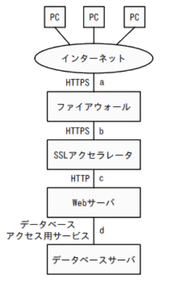
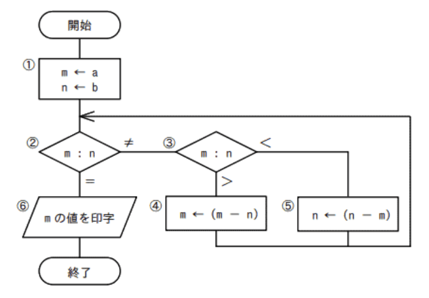
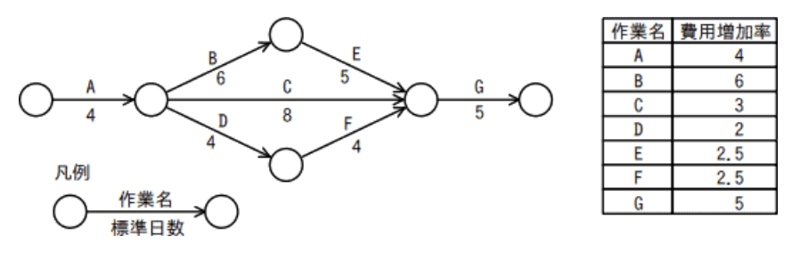
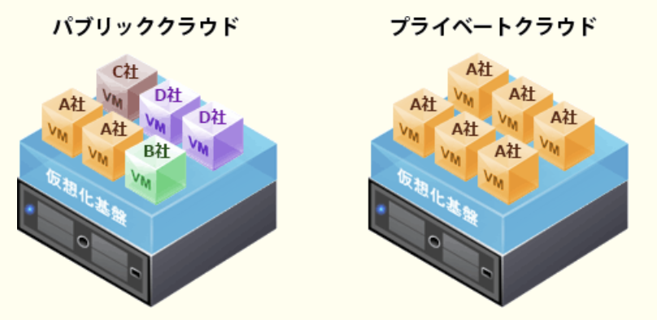
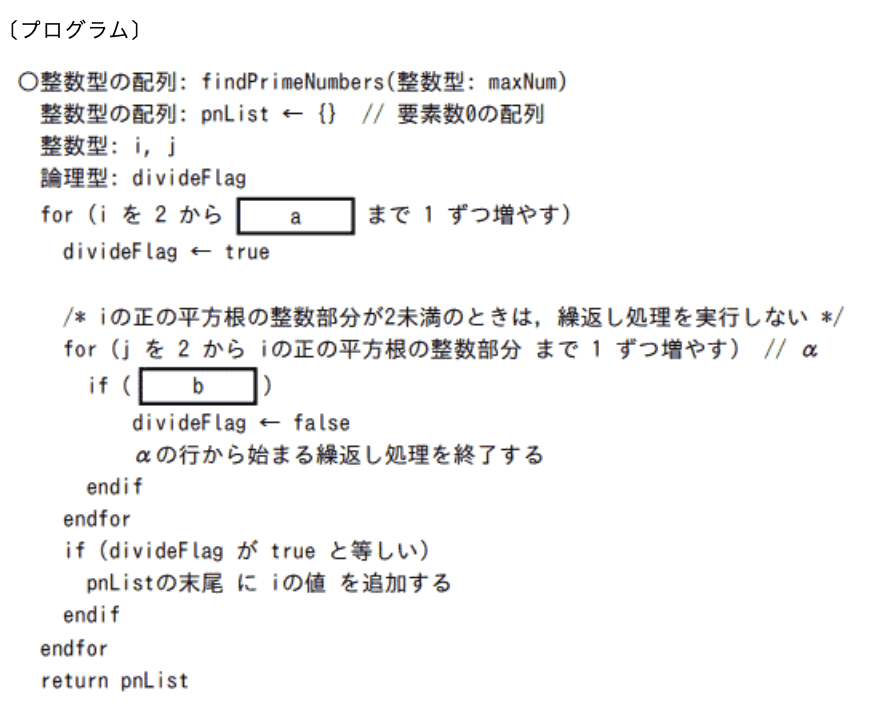
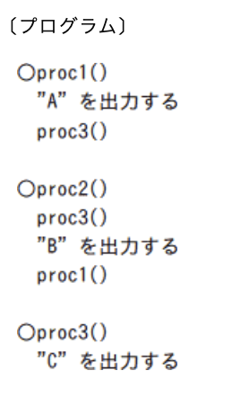
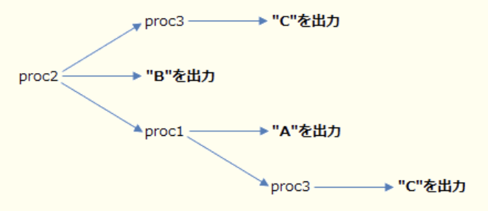
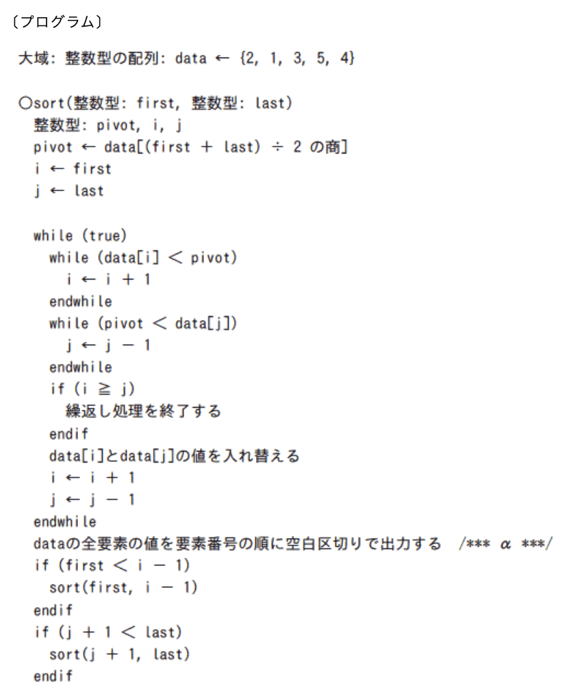

### 令和5年公開問題

### 科目A

### `テクノロジ系`

---
1.16新小数`0.C`を10進小数に変換したもの

- A.**0.75**  
Cは10進数だと12(8 + 4)、2進数だと1100。2の-1乗の位と2の-2乗の位が1なので、  
1 / 2 + 1 / 4 = 3 / 4 = 0.75

---
2.双方向のポインタをもつリスト構造のデータを表に示す。この表において新たな社員Gを社員Aと社員Kの間に追加する。追加後の表のポインタの中で追加前と比べて値が変わるポインタだけをすべて列記したもの  
表
|アドレス|社員名|次ポインタ|前ポインタ|
|------|------|--------|--------|
|100   |社員A  |300     |0       |
|200   |社員T  |0       |300     |
|300   |社員K  |200     |100     |

追加後の表
|アドレス|社員名|次ポインタ|前ポインタ|
|------|------|--------|--------|
|100   |社員A  |a       |b       |
|200   |社員T  |c       |d       |
|300   |社員K  |e       |f       |
|400   |社員G  |x       |y       |

- A.**a, f**

追加前の社員名をポインタの示すアドレスの順([]内はアドレス)に並べる。前ポインタが"0(参照なし)"の要素が先頭、次ポインタが"0(参照なし)"の要素が末尾に配置される

100 : 社員A[次300, 前0] => 300 : 社員K[次200, 前100] => 200 : 社員T[次0, 前300]

社員Gは、社員Aと社員Kの間に追加される

100 : 社員A[**次300**, 前0] => 400 : 社員G[次A, 前B] => 300 : 社員K[次200, **前100**] => 200 : 社員T[次0, 前300]

A, G, Kのポインタの参照が正しく繋がるためには、Gのひとつ前であるAの次ポインタと、Gのひとつ後であるKの前ポインタをそれぞれ400に更新する必要がある

---
3.コンピュータの高速化技術の1つであるメモリインタリーブに関する記述

- A.**主記憶を複数の独立して動作するグループに分けて、各グループに並列にアクセスする方式**  
物理上はひとつである主記憶領域を、同時アクセス可能な複数の論理的な領域(バンク)に分け、それぞれのバンクに対してデータの読み書きを並列で行うことにより、メモリアクセスの高速化を図る技術。奇数アドレスはバンク1、偶数アドレスはバンク2というように、連続したアドレスを複数のバンクに割り振っていく。通常は、連続するアドレスに次々とアクセスされることが多いため、見かけ上並列アクセスしているようになり、実効アクセス時間が短くなる。「主記憶に並列アクセス」がキーワード

- 主記憶と入出力装置、又は主記憶同士のデータの受渡しをCPU経由でなく直接やり取りする方式  
DMA(*Direct Memory Access*)の説明

- 主記憶にデータを送り出す際に、データをキャッシュに書き込み、キャッシュがあふれたときに主記憶へ書き込む方式  
主記憶とキャッシュメモリの同期方法の1つであるライトバック方式の説明

- 主記憶のデータの一部をキャッシュにコピーすることによって、レジスタと主記憶とのアクセス速度の差を縮める方式  
キャッシュメモリの説明

---
4.エッジコンピューティングの説明

- A.**利用者や機器に取り付けられたセンサーなどのデータ発生源に近い場所にあるサーバなどでデータを一次処理し、処理のリアルタイム性を高めること**  
利用者や端末と物理的に近い場所に処理装置を分散配置して、ネットワークの端点でデータ処理を行う技術の総称。処理装置をクラウド上に配置する従来の方式よりも端末と処理装置の距離が短縮されるので、アプリケーション処理の低遅延化やネットワーク負荷の低減が期待できる。高いリアルタイム性が要求されるIoTに適した技術として注目されている

- 画面生成やデータ処理をクライアント側で実行することによって、Webアプリケーションソフトウェアの操作性や表現力を高めること  
リッチクライアントの説明

- データが送信されてきたときだけ必要なサーバを立ち上げて、処理が終わり次第サーバを停止してリソースを解放すること  
サーバレスアーキテクチャの説明

- 複数のサーバやPCを仮想化して統合することによって一つの高性能なコンピュータを作り上げ、並列処理によって処理能力を高めること  
グリッドコンピューティングの説明

---
5.3次元グラフィックス処理におけるクリッピングの説明

- A.**画像表示領域にウィンドウを定義し、ウィンドウの外側を除去し、内側の見える部分だけを取り出す処理である**  
最終的な表示画面の範囲外(視点からみて可視できない部分)にあるデータを、CGの描画対象から除外する処理。最終的な仕上りに影響を与えない余分なデータを省くことで、後工程で必要となる計算量を減らし、作業効率を高めるために行われる

- CG映像作成における最終段階として、物体のデータをディスプレイに描画できるように映像化する処理である  
レンダリングの説明

- スクリーンの画素数が有限であるために図形の境界近くに生じる、階段状のギザギザを目立たなくする処理である  
アンチエイリアシングの説明

- 立体感を生じさせるために、物体の表面に陰影を付ける処理である  
シェーディング(陰影処理)の説明

---
6.次の関数従属を満足するとき、成立する推移的関数従属はどれか。"A→B"はBがAに関数従属していることを表し、"A→{B、C}"は、"A→B"かつ"A→C"が成立することを表す  
・関数従属  
1.{注文コード、商品コード} → {顧客注文数量、注文金額}  
2.注文コード → {注文日、顧客コード、注文担当者コード}  
3.商品コード → {商品名、仕入先コード、商品販売価格}  
4.仕入先コード → {仕入先名、仕入先住所、仕入担当者コード}  
5.顧客コード → {顧客名、顧客住所}

- A.**注文コード → 顧客コード → 顧客住所**  

ある関係においてA→Cのように直接的な関数従属性があるのではなく、A→B→Cというようにある属性を経由することで、結果的にA→Cの関数従属性が成り立つことを言う。A→B→Cの場合、Aが決まればBが一意に決まり、Bが決まればCが一意に決まるので、CはAに関数従属している。ある属性を介して関数従属が成立する時、その関係性を推移的関数従属と言う

- 仕入先コード → 仕入担当者コード → 仕入先住所  
4つ目の関数従属より、仕入れ先コードが決まると、仕入先名・仕入先住所・仕入担当者コードが一意に決定する。仕入担当者コードと仕入先住所の間には関数従属性はない

- 商品コード → 仕入先コード → 商品販売価格  
3つ目の関数従属より、商品コードが決まると、商品名・仕入先コード・商品販売価格が一意に決定する。仕入先コードと商品販売価格の間には関数従属性はない

- 注文コード → 商品コード → 顧客注文数量  
注文コードから商品コードへの関数従属はないため「注文コード → 商品コード」が成立しない

---
7.トランザクションが、DBに対する更新処理を完全に行うか、全く処理しなかったのように取り消すか、のどちらかの結果になることを保証する特性

- A.**原子性(*atomicity*)**  
トランザクション内の処理がすべて実行されるか、または全く実行されないことを保証する性質

トランザクションは、処理の整合性を保つために必要なひとまとまりの処理の単位。一部だけが処理されて終了することは許されず、処理がすべて実行されるか、または全く実行されないのいずれかの状態で終了しなければならない。DBMSでは、「コミットで全ての処理を確定する」「ロールバックで処理を全て巻き戻す」のいずれかの状態でトランザクションが終了するように制御されている

- 一貫性(*consistency*)  
トランザクションによりデータの矛盾が生じないこと、つまり常にDBの整合性が保たれていることを保証する性質

- 耐久性(*durability*)  
一旦正常終了したトランザクションの結果は、以後システムに障害が発生しても失われないことを保証する性質。永続性と呼ばれる場合もある

- 独立性(*isolation*)  
複数のトランザクションを同時に実行した場合と、順番に実行した場合の結果が等しくなることを保証する性質。隔離性と呼ばれることもある

---
8.IPv4ネットワークにおいて、ネットワークの意思疎通に使われるもの

- A.**ping**  
IPネットワークにおいて対象のコンピュータまでの通信が正常にできるかを確認するために使用するコマンド。pingを実行して相手から応答があれば、相手のコンピュータがネットワーク上に存在し、自分のコンピュータから相手のコンピュータまでのネットワークに異常がないことを確認できる。ネットワーク層のプロトコルであるICMPの「*echo request*」メッセージを対象ノードに投げ、対象ノードから「*echo reply*」メッセージが返す仕組みにより、ネットワークの疎通確認を行っている

- BOOTP(*Bootstrap Protocol*)  
ネットワークに接続されたクライアントが、IPアドレスやホスト名、サブネットマスク等を自動的に取得するためのプロトコル。DHCPより前に開発されたが、使用される機会は少なくなってきている

- DHCP(*Dynamic Host Configuration Protocol*)  
TCP / IPネットワークで、ネットワークに接続するノードへのIPアドレスの割当てを自動的に行うプロトコル

- MIB(*Management Information Base*)  
ネットワーク機器が外部に自分の状態・情報を知らせるために公開している情報のこと。SNMPは、MIBを参照することでネットワークを監視・制御を行う

---
9.ドライブバイダウンロード攻撃に該当するもの

- A.**利用者が悪意のあるWebサイトにアクセスしたときに、Webブラウザの脆弱性を悪用して利用者のPCをマルウェアに感染させる**  
Webサイトに悪意のあるプログラムを埋め込んでおき、Webサイトに訪れた利用者のWebブラウザを経由して、利用者に気付かないようにそのプログラムをダウンロードさせたり、自動的に実行させる攻撃。脆弱性のある利用環境だと、Webページを閲覧しただけでマルウェアの被害に遭う可能性もある。単独で利用されることもあるが、標的型攻撃や水飲み場攻撃などで補助的に使用されることもある

- PCから物理的にハードディスクドライブを盗み出し、その中のデータをWebサイトで公開し、ダウンロードさせる  
物理的手段による窃盗に該当する

- 電子メールの添付ファイルを開かせて、マルウェアに感染したPCのハードディスクドライブ内のファイルを暗号化し、元に戻すための鍵を攻撃者のサーバからダウンロードさせることと引換えに金銭を要求する  
ランサムウェアに該当する

- 利用者に気付かれないように無償配布のソフトウェアに不正プログラムを混在させておき、利用者の操作によってPCにダウンロードさせ、インストールさせることでハードディスクドライブから個人情報を収集して攻撃者のサーバに送信する  
トロイの木馬に該当する。秘密裏にインストールさせるのは共通だが、Webサイトではなく配布されるソフトウェアを利用する点が異なる

---
10.図のような構成と通信サービスのシステムにおいて、Webアプリケーションの脆弱性対策のためのWAFの設置場所として最も適切な箇所はどこか。WAFには通信を暗号化したり、複合したりする機能はないものとする

- A.**c**  
WAF(*Web Application Firewall*)は、通過するパケットのIPアドレスやポート番号だけでなくペイロード部(データ部分)をチェックすることで、Webアプリケーションに対するこれらの攻撃を検知し、遮断することが可能なファイアウォール。  
パターンマッチングやHTTPヘッダの検証などによって不正な通信を検知するが、HTTPS通信が行われている経路上のパケットは暗号化されていてペイロード部分を見ることができないため、これらの検知手法が使えない。そのためaとbは設置場所として不適切。  
WAFによる不正アクセスの検知・遮断はWebアプリケーションによって処理が実行される前におこなれる必要があるためdも不適切。  
SSLアクセラレータは、SSL / TLS通信におけるパケットの暗号化と複合を高速に行う専用の機器。Webサーバの処理負荷を軽減する目的で設置される

---
11.次の流れ図において、`1, 2, 3, 5, 2, 3, 4, 2, 6`の順で実行させるために、`1`でmとnに与えるべき初期値aとbの関係(ともに正の整数)

- A.**3a = 2b**  
m = 2b / 3, n = b  
1, 2, 3, 5の時点で、m : n = 2b / 3 : b / 3  
その後に2, 3, 4の時点で、m : n = b / 3 : b / 3  
2, 6と続くので適切

5でnを1回更新、4で1回更新して、6の段階でm = nとなる。  
4の処理では、「更新前のmの値」は、「更新後のm」とnの和。処理後はm = nなので、更新前のmの値は2nと表すことができる。  
5の処理では、「更新前のnの値」は、「更新前のn」とmの和。m = 2nなので、更新前のnの値は3nと表すことができる。  
処理開始時に、m : n = 2 : 3であれば最終的にm = nとなる。初期値aとbの関係は、a : b = 2 : 3、3a = 2bが正解

- a = 2b  
m = 2b, n = b  
1, 2, 3, 4, 2, 6となり不適切

- 2a = b  
m = b / 2, n = b  
1, 2, 3, 5の時点で、m : n = b / 2 : b / 2  
その後に2, 6と続くので不適切

- 2a = 3b  
m = 3b / 2, n = b  
1, 2, 3, 4の時点で、m : n = b / 2 : b  
その後に2, 3, 5, 2, 6と続くので不適切

---
12.アジャイル開発手法のスクラムにおいて、開発チームの全員が1人ずつ「昨日やったこと」「今日やること」「障害になっていること」などを話し、全員でプロジェクトの状況を共有するイベント

- A.**デイリースクラム**  
開発チーム全員の活動の共有とコミュニケーションの促進を目的として、スプリント実施中に毎日10 ~ 15分程度行われる確認・調整のための会議

スクラムは、アジャイル開発の方法論の1つで、開発プロジェクトを数週間程度の短期間ごとに区切り、その期間内に分析、設計、実装、テストの一連の活動を行い、一部分の機能を完成させるという作業を繰り返しながら、段階的に動作可能なシステムを作り上げるフレームワーク。スクラム開発では開発反復の単位をスプリントといい、スプリント実施の際に行う各イベントが定義されている

- スプリントレビュー  
スプリントの終了時に、関係者を集めて成果物のデモンストレーションを行い、成果物を検査し、フィードバックを得る

- スプリントプランニング  
スプリントの開始に先立って行われるミーティングで、プロダクトバックログの中から、そのスプリントで開発するものを決定する

- レトロスペクティブ  
スプリント終了時に次のスプリントを見据えて行われる振り返り。上手くいったこと・上手くいかなかったこと・それに対する改善方・解決法を話し合う

### `マネジメント系`

---
13.図に示すとおりに作業を実施する予定であったが、作業Aで1日の遅れが生じた。各作業の費用増加率を表の値とするとき、当初の予定日数で終了するために掛かる増加費用を最も少なくするには、どの作業を短縮すべきか。費用増加率とは、作業を1日短縮するのに要する増加費用を指す

- A.**E**  
・A, B, E, G => 20  
・A, C, G => 17  
・A, D, F, G => 17  
クリティカルパス(外せない作業)は「A, B, E, G」で、プロジェクト全体の最短完了日数は20日。Aの1日遅れを取り戻すには、B, E, Gのいずれかの作業を1日短縮する必要がある。費用増加率が最も少ないEを短縮することになる

---
14.A社では、従業員が自宅のPCからインターネット経由で自社のネットワークに接続して仕事を行うテレワーキングの実施を計画している。A社が定めたテレワーキング運用規程について、情報セキュリティ管理基準(平成28年)に従って監査を実施した。判明した事項のうち、監査人が、指摘事項として監査報告書に記載すべきもの

- A.**テレワーキングで使用するPCへのマルウェア対策ソフト導入の要不要は、従業員それぞれが判断する**  
テレワーキングを行う場合、マルウェアに対する保護及びファイアウォールの要件を条件・制限として定めることとされている。セキュリティ対策は組織が基準を定め、従業員に対して順守させなければならないので、指摘事項に該当する

- テレワーキング運用規程に従うことを条件に、全ての従業員が利用できる  
テレワーキング活動を許可する組織は、テレワーキングを行う場合の条件および制限を定めた方針を発行しなければならない。運用規程を定めて従業員に順守させることは問題ない

- テレワーキングで従業員が使用するPCは、A社から支給されたものに限定する  
テレワーキングにおいて個人が所有する機器の使用を許さない場合、テレワークのための適切な装置および保管用具の用意に関する事項を指針・取り決めに含めることとされている。使用するPCを支給されたものに限定することは問題ない

- テレワーキングで使用するPCを、従業員の家族に使用させない  
テレワーキングを行う場合、家族や訪問者による装置および情報へのアクセスに関する規則・手引を定めることとされている。家族の使用を禁止する定めは問題ない

### `ストラテジ系`

---
15.ハイブリッドクラウドの説明

- A.**自社専用に使用するクラウドサービスと、汎用のクラウドサービスとの間でデータ及びアプリケーションソフトウェアの連携や相互運用が可能となる環境を提供すること**  
複数の異なるクラウド環境(パブリッククラウド・プライベートクラウド)やオンプレミス環境(自社運用システム)を組み合わせてひとつのシステムとして利用する形態

クラウドサービスはその利用形態により、不特定多数が共同で利用する「パブリッククラウド」と、ある利用者が専有して利用する「プライベートクラウド」に分けることができる。パブリッククラウドはコストが低く抑えられる反面、多くの利用者で共用するためカスタマイズ性やセキュリティ面で劣る。一方、プライベートクラウドはカスタマイズ性やセキュリティに優れる反面、導入や利用にかかるコストが高いことやリソースを柔軟に増減させることが難しいといったことがデメリット。  
ハイブリッドクラウドは、機密性の高い情報はプライベートクラウドやオンプレミスに、そうでない情報はパブリッククラウドに配置するなど、データやアプリケーションごとの要件に応じて適切なクラウドを使い分けることで、セキュリティ・コンプライアンス・パフォーマンス・コストの最適化を図ろうとするアプローチ。クラウド上で運用できないデータやアプリケーションがある場合、部分的にクラウドを使うなどオンプレミスとクラウドの良さを掛け合わせた運用も可能。ただ複数のシステムを相互運用する関係から、システムが複雑になって運用が難しくなるという課題もある

- クラウドサービスが提供している機能の一部を、自社用にカスタマイズして利用すること
- クラウドサービスのサービス内容を、消費者向けと法人向けの両方を対象とするように構成して提供すること
- クラウドサービスのサービス内容を、有償サービスと無償サービスとに区分して提供すること

---
16.ダイバーシティマネジメントの説明

- A.**性別や年齢、国籍などの面で従業員の多様性を尊重することによって、組織の活力を向上させることである**  
多様性意味で、性別・年齢・人種・民族・信仰・障がい・性的指向・経験など、様々な背景の違いからそれぞれ異なる特性を有していることを指す。  
企業や組織の活動に、多様な人材を取り込んで積極的に活用することによって、新たな価値の創造や競争力の強化を図ろうとする経営手法。女性の活躍の場の拡大、国際化の推進、障がい者・高齢者・若年者を積極的に雇用することなどがダイバーシティマネジメントの事例と言える

- 従業員が仕事と生活の調和を図り、やりがいをもって業務に取り組み、組織の活力を向上させることである  
ワークライフバランスの説明

- 自ら設定した目標の達成を目指して従業員が主体的に業務に取り組み、その達成度に応じて評価が行われることである  
MBO(*Management by Objectives* : 目標による管理)の説明

- 労使双方が労働条件についての合意を形成し、協調して収益の増大を目指すことである  
労使協調の説明

---
17.ERP(*Enterprise Resource Planning*)の説明

- A.**企業全体の経営資源を有効かつ総合的に計画して管理し、経営の効率向上を図るための手法・概念である**  
組織全体の経営資源(ヒト・モノ・カネ・情報)と業務プロセスを統合して、計画的に管理する手法や概念。企業全体の様々な部門や機能(財務・人事・製造・在庫管理・販売・購買など)にわたるデータを一元化することでビジネスの透明性を高め、リアルタイムで情報を共有・分析することで、意思決定の迅速化や業務プロセスの最適化を実現する。ERPを実現するための統合型ソフトウェアをERPパッケージと呼ぶ

- 営業活動にITを活用して営業の効率と品質を高め、売上・利益の大幅な増加や、顧客満足度の向上を目指す手法・概念である  
SFA(*Salas Force Automation*)の説明

- 卸売業・メーカーが小売店の経営活動を支援することによって、自社との取引量の拡大につなげる手法・概念である  
リテールサポートの説明

- 消費者向けや企業間の商取引を、インターネットなどの電子的なネットワークを活用して行う手法・概念である  
電子商取引(*Electronic commerce*)の説明

---
18.イノベータ理論では、消費者を新製品の購入時期によって、イノベータ・アーリーアダプタ・アーリーマジョリティ・レイトマジョリティ・ラガードの5つに分類する。アーリーアダプタの説明

- A.**新商品、サービスなどを早期に受け入れ、消費者に大きな影響を与える層であり、流行に敏感で、自ら情報収集を行い判断する層**  
アーリーアダプタ(*Early Adopters* : 初期採用者)の説明。流行に敏感で、情報収集を自ら行い判断する人。他の消費者への影響力が大きく、オピニオンリーダとも呼ばれる。早い順から2番目に位置し、発言した意見や感想が顧客の購買行動に重要な影響を与えるとされる人々。医薬品業界の著名教授、ファッション業界のモデルや芸能人、最近ではYouTuberなども挙げられる

- 新しい製品及び新技術の採用には懐疑的で、周囲の大多数が採用している場面を見てから採用する層  
レイトマジョリティ(*Late Majority* : 後期追随者)の説明。比較的懐疑的で、周囲の大多数が試している場面を見てから同じ選択をする。フォロワーズとも呼ばれる

- 新商品・サービスなどを、リスクを恐れず最も早い段階で受容する層  
イノベータ(*Innovators* : 革新者)の説明。冒険心にあふれ、新しいものを進んで採用する人

- 世の中の動きに関心が薄く、流行が一般化してからそれを採用することが多い層であり、場合によっては不採用を貫く、最も保守的な層  
ラガード(*Laggards* : 遅滞者)の説明。最も保守的で、流行や世の中の動きに関心が薄い。イノベーションが伝統になるまで採用しない。伝統主義者とも呼ばれる

---
19.CIOの説明

- A.**情報管理、情報システムに関する戦略立案及び執行を統括する最高責任者**  
*Chief Information Officer*の略で、最高情報責任者のこと。企業や組織において、経営戦略を達成するためにどのようなIT化を図ればよいかを考えて情報戦略を立案し、具体的なIT投資計画を策定しその実現に最終的な責任を持つ役職。情報化戦略を立案するにあたって、経営戦略と整合性をとりながら、全社的な観点から企業全体の情報資源への投資効果を最適化するプランを策定する役割をもつ

- 経営戦略の立案及び業務執行を統括する最高責任者  
CEO(*Chief Executive Officer* : 最高経営責任者)の説明

- 資金調達、財務報告などの財務面での戦略策定及び執行を統括する最高責任者  
CFO(*Chief Financial Officer* : 最高財務責任者)の説明

- 自社の技術戦略や研究開発計画の立案及び執行を統括する最高責任者  
CTO(*Chief Technology Officer* : 最高技術責任者)の説明

---
20.ボリュームライセンス契約の説明

- A.**企業などソフトウェアの大量購入者向けに、インストールできる台数をあらかじめ取り決め、ソフトウェアの使用を認める契約**  
ソフトウェアに個別のライセンスをするのではなく、特定のコンピュータ群や一定数のコンピュータでの使用権を一括して認めるライセンス契約の形態。同じソフトウェアを大量に使用する組織にとってはライセンス管理や契約の手間が省け、かつ大量購入による割引価格が適用される利点がある。一定規模以上の企業及び教育機関や官庁のように、多数のコンピュータを同一環境で使用する場合に購入が検討されることがある

- 使用場所を限定した契約であり、特定の施設の中であれば台数や人数に制限なく使用が許される契約  
サイトライセンス契約の説明

- ソフトウェアをインターネットからダウンロードしたとき画面に表示される契約内容に同意するを選択することによって、使用が許される契約  
クリックラップ契約・オンクリック契約の説明

- 標準の使用許諾条件を定め、その範囲で一定量のパッケージの包装を解いたときに、権利者と購入者との間に使用許諾契約が自動的に成立したとみなす契約  
シュリンクラップ契約の説明

### 科目B

---
1.プログラム中の空欄に入る正しい答えの組み合わせ  
配列の要素番号は1から始まる。関数findPrimeNumbersは、引数で与えられた整数以下の、全ての素数だけを格納した配列を返す関数である。引数に与える整数は2以上である

- A.a:**maxNum**  
- A.b:**i / jの余りが0と等しい**

試し割り方をプログラムとして実装したもの。ある数について、2で割る、3で割る…を繰り返して、判定対象となる数の平方数まで割り切れなければ素数として判定するというもの  
・aについて  
プログラムの終盤を見ると、divideFlagがtrueと等しければ、ループ変数iを配列pnListに追加し、最終的に配列pnListを素数のリストとして返している。ループ変数iは現在判定対象となっている数を保持する変数として使われていることが分かる。  
素数は2以上の自然数なので、引数のmaxNum以下のうち、素数であるかどうかを判定すべき数は2 ~ maxNumまでの整数。そのため空欄aには「maxNum」が当てはまる。maxNum + 1にしてしまうと、引数の数より1大きいものまで素数として返されてしまう可能性があるため不適切  
・bについて  
二重のforループの内側に位置していて、if文の条件式となっている。空欄bの条件式がtrueのときは、次の行で変数divideFlagにfalseを格納している。  
どの選択肢でもi / jをしているように、ここでは変数iに対して、変数jを2から変数iの平方根まで増やしながら除算することを繰り返している。  
divideFlagがfalseになった場合、後続のif文で変数iの値が配列pnListに格納されなくなるので、divideFlagをfalse にするということは、現在の変数iの値を「素数ではない」と判定していることになる。  
変数iが素数でないと判定するのは、変数iに割り切れる数がある場合、i / j割り切れるときなので、空欄bには「i / jの余りが0と等しい」という条件式が当てはまる

---
2.次の記述中の正しい答えを選択  

- A.次のプログラムで、手続proc2を呼び出すと、**C, B, A, C**の順に出力される  
呼び出された手続きが終了した場合、呼出し元の手続きの処理に戻るということが正しい手順を考える上でのポイント。出力された文字を先頭から順に並べたものが正解

---
3.次の記述中の正しい答えを選択。配列の要素番号は1から始まる  
次の手続sortは、大域の整数型の配列dataの、引数firstで与えられた要素番号から引数lastで与えられた要素番号までの要素を昇順に整列する。また、first < last とする。手続きsortをsort(1, 5)として呼び出すと、αの行を最初に実行したときの出力はいくつか

sort(1, 5)なので、pivot = 3, i = 1, j = 5

・data[i]がpivotより小さい間、jから1を加えることを繰り返す  
* while (data[i] < pivot)  
  * i ← i + 1  
* endwhile  
値が3より小さいdata[1]とdata[2]のとき、iは1 → 2、2 → 3と2回 + 1をして、i = 3で繰り返しが終了する

・data[j]がpivotより大きい間、jから1を引くことを繰り返す  
* while (pivot < data[j])  
  * j← j − 1
* endwhile  
値が3より大きいdata[5]とdata[4]のとき、jが5 → 4、4 → 3と2回 - 1をして、i = 3で繰り返しが終了する

・i >= jなので、while(true)の繰り返し処理が終了し、αの処理が行われる  
この時点でdata = {2, 1, 3, 5, 4}と初期値と同じで、先頭から順に出力する
