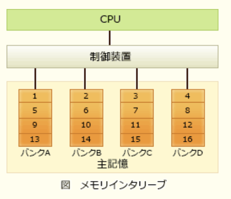

### 令和5年公開問題

### `テクノロジ系`

---
1.16新小数`0.C`を10進小数に変換したもの

- A.**0.75**  
Cは10進数だと12(8 + 4)、2進数だと1100。2の-1乗の位と2の-2乗の位が1なので、  
1 / 2 + 1 / 4 = 3 / 4 = 0.75

---
2.双方向のポインタをもつリスト構造のデータを表に示す。この表において新たな社員Gを社員Aと社員Kの間に追加する。追加後の表のポインタの中で追加前と比べて値が変わるポインタだけをすべて列記したもの  
表
|アドレス|社員名|次ポインタ|前ポインタ|
|------|------|--------|--------|
|100   |社員A  |300     |0       |
|200   |社員T  |0       |300     |
|300   |社員K  |200     |100     |

追加後の表
|アドレス|社員名|次ポインタ|前ポインタ|
|------|------|--------|--------|
|100   |社員A  |a       |b       |
|200   |社員T  |c       |d       |
|300   |社員K  |e       |f       |
|400   |社員G  |x       |y       |

- A.**a, f**

追加前の社員名をポインタの示すアドレスの順([]内はアドレス)に並べる。前ポインタが"0(参照なし)"の要素が先頭、次ポインタが"0(参照なし)"の要素が末尾に配置される

100 : 社員A[次300, 前0] => 300 : 社員K[次200, 前100] => 200 : 社員T[次0, 前300]

社員Gは、社員Aと社員Kの間に追加される

100 : 社員A[**次300**, 前0] => 400 : 社員G[次A, 前B] => 300 : 社員K[次200, **前100**] => 200 : 社員T[次0, 前300]

A, G, Kのポインタの参照が正しく繋がるためには、Gのひとつ前であるAの次ポインタと、Gのひとつ後であるKの前ポインタをそれぞれ400に更新する必要がある

---
3.コンピュータの高速化技術の1つであるメモリインタリーブに関する記述

- A.**主記憶を複数の独立して動作するグループに分けて、各グループに並列にアクセスする方式**  
物理上はひとつである主記憶領域を、同時アクセス可能な複数の論理的な領域(バンク)に分け、それぞれのバンクに対してデータの読み書きを並列で行うことにより、メモリアクセスの高速化を図る技術。奇数アドレスはバンク1、偶数アドレスはバンク2というように、連続したアドレスを複数のバンクに割り振っていく。通常は、連続するアドレスに次々とアクセスされることが多いため、見かけ上並列アクセスしているようになり、実効アクセス時間が短くなる。「主記憶に並列アクセス」がキーワード

- 主記憶と入出力装置、又は主記憶同士のデータの受渡しをCPU経由でなく直接やり取りする方式  
DMA(*Direct Memory Access*)の説明

- 主記憶にデータを送り出す際に、データをキャッシュに書き込み、キャッシュがあふれたときに主記憶へ書き込む方式  
主記憶とキャッシュメモリの同期方法の1つであるライトバック方式の説明

- 主記憶のデータの一部をキャッシュにコピーすることによって、レジスタと主記憶とのアクセス速度の差を縮める方式  
キャッシュメモリの説明
