### サンプル問題

### 科目A

### `テクノロジ系`

---
1.負数を2の補数で表すとき、8ビットの2進正数nに対し－nを求める式はどれか。+ は加算を表し、ORはビットごとの論理和、XORはビットごとの排他的論理和を表す

- A.**(n XOR 11111111) + 00000001**  
2の補数とは、負数を表現する方法の1つ。ある正数に対応する2の補数に求めるには、**全てのビットを反転して1を加える。**全ビットを反転するときに使われる論理演算が**排他的論理和(XOR)** で、次のような特徴がある。  
・「XOR 0(0との排他的論理和)」の結果は元のビットそのままとなる  
・「XOR 1(1との排他的論理和)」の結果は元のビットを反転したビットとなる

|入力||出力             |
|---|-|----------------|
|X  |Y|Z               |
|0  |0|0(Xの値そのまま)  |
|1  |0|1(Xの値そのまま)  |
|0  |1|1(Xを反転した値)  |
|1  |1|0(Xを反転した値)  |

この性質を生かして、排他的論理和はあるビット列中で特定の部分だけを反転させるときに用いられる。  
2進正数nから2の補数表現の-nを得るには、  
1.nの全ビットを反転する => n XOR 11111111  
2.結果に1を加算する => + 00000001

---
2.10進整数j(0 < j < 100)を8桁の2進数に変換する処理を表している。2進数は下位桁から順に、配列の要素NISHIN(1)からNISHIN(8)に格納される。流れ図のa及びbに入れる処理はどれか。j div 2はjを2で割った商の整数部分を、j mod 2はjを2で割った余りを表す

変換の繰り返し処理は、kは初期値1から1ずつ、8まで増やす。  
j ← j div 2 : jを2で割った商の整数部分  
j ← j mod 2 : jを2で割った余り

- A.**a : `NISHIN(k) ← j mod 2`**
- A.**b : `j ← j div 2`**  
10進数から2進数に変換する方法で、2で割ることを繰り返す方法をアルゴリズムとして表したもの。aでは2で割った余りを格納し(0 or 1)、bではjを2で割る

50の場合は下記のようになる

---
3.P、Q、Rはいずれも命題である。命題Pの真理値は真であり、命題(not P) or Q及び命題(not Q) or Rのいずれの真理値も真であることが分かっている。Q、Rの真理値はどれか。X or YはXとYの論理和、not XはXの否定を表す

- A.**Q : 真**  
- A.**R : 真**  
命題(not P) or Q => Pではない(偽)またはQ => 真、つまり命題Qは真  
命題(not Q) or R => Qではない(偽)またはR => 真、つまり命題Rは真

---
4.入力記号、出力記号の集合が{0, 1}であり、状態遷移図で示されるオートマトンがある。0011001110を入力記号とした場合の出力記号はどれか。入力記号は左から順に読み込まれるものとする。S1は初期状態を表し、遷移の矢印のラベルは、入力 / 出力を表している

- A.**0001000110**  
オートマトンは、コンピュータの状態、遷移をモデル化したもの。何かしらの操作(入力)をすると状態が遷移する。s1の場合、入力0であれば0を返し再度s1に遷移し、入力1であれば0を返しs2に遷移する  
0に対して**0を返す** : s1  
0に対して**0を返す** : s1  
1に対して**0を返す** : s1からs2  
1に対して**1を返す** : s2からs3  
0に対して**0を返す** : s3からs1  
0に対して**0を返す** : s1  
1に対して**0を返す** : s1からs2  
1に対して**1を返す** : s2からs3  
1に対して**1を返す** : s3  
0に対して**0を返す** : s3からs1

---
5.2分探索木になっている2分木

- A.**イ**  
左から昇順に整列されているため正しい

2分探索木は2分木の各節にデータをもたせることで探索を行えるようにした木。各節がもつデータは、「**その節から出る左部分木にあるどのデータよりも大きく、右部分木のどのデータよりも小さい**」という条件がある。  
つまり、どの部分においても、「左 < 中 < 右」の関係を満たしていれば2分探索木といえる

- ア  
15, 14の位置が反対

- ウ  
15, 16, 14の順番が異なる

- エ  
左から昇順になっていない。2分探索木ではないが、全ての葉が同じ深さを持っているため完全2分探索木という形状になっているになっている

---
6.配列Aが図2の状態のとき、図1の流れ図を実行すると、配列Bが図3の状態になった。図1のaに入れる操作はどれか。配列A、Bの要素をそれぞれA(i, j)、B(i, j)とする

- A.**B(j, 7－i) ← A(i, j)**  
i・jともに初期値0から1ずつ、7まで増加する。配列Aから配列Bへ、図が時計回りに90度回転している。  
B(1, 7) => A(0, 1)  
B(4, 4) => A(3, 4)  
B(1, 5) => A(2, 1)

---
7.10進法で5桁の数「a1a2a3a4a5」をハッシュ法を用いて配列に格納したい。ハッシュ関数をmod(a1 + a2 + a3 + a4 + a5 , 13)とし、求めたハッシュ値に対応する位置の配列要素に格納する場合、54321は配列のどの位置に入るか。mod(x, 13)はxを13で割った余りとする

- A.**2**  
54321の格桁の和は15なので、mod(15, 13) = 2

ハッシュ関数(引数を一定の規則で変換した値を返す関数)を用いて、探索するデータのキー値からデータの格納アドレスを直接計算する方法。データの格納場所が一意に決まるので挿入、検索、削除が高速に行える反面、格納に必要なデータ領域が多く必要という特徴がある

---
8.自然数nに対して、次のとおり再帰的に定義される関数f(n)を考える。f(5)の値はどれか  
f(n) : if n <= 1 then return 1 else return n + f(n－1)

- A.**15**  
再帰関数は、関数内で自身を読み出す構造になっている関数で、以下のような処理を行う。  
・引数nが1以下のとき、1を返す  
・それ以外のとき、n + f(n - 1)を返す  
f(5)  
= 5 + f(4)  
= 5 + 4 + f(3)  
= 5 + 4 + 3 + f(2)  
= 5 + 4 + 3 + 2 + f(1)  
= 5 + 4 + 3 + 2 + 1  
= 15

---
9.プログラムのコーディング規約に規定する事項

- A.**領域割付け関数を使用するときは、割付けができなかったときの処理を記述する**  
領域割付け関数は必ず成功するとは限らない。メモリブロックを確保できないまま後続の処理に進むとそこでエラーになってしまうため、領域割付け関数の戻り値をチェックするなどして割付け失敗時の分岐処理を記述するべき

- 局所変数は、用途が異なる場合でもデータ型が同じならば、できるだけ同一の変数を使うようにする  
1つの変数の役割は1つにするのが原則。用途が異なる場合には別々の変数として定義し、用途がわかるように適切な命名を行うべき

- 処理性能を向上させるために、ループの制御変数には浮動小数点型変数を使用する  
ループの制御変数には整数型を用いるのが原則。ループの制御変数に浮動小数点型変数(*float*等)を用いると、インクリメントやデクリメントの際の誤差が積み重なり、期待した結果を得られないことがある。そのためループの制御変数には整数型を使用するべき。また、浮動小数点型は整数型よりも演算が遅いので、わずかだが処理性能も低下する

- 同様の計算を何度も繰り返すときは、関数の再帰呼出しを用いる  
同様の処理を繰り返すときには、その処理をサブルーチン化して独立した関数にすることを検討すべき。再帰関数は、処理がわかりにくくなることや実行時のスタックサイズが予測できずオーバーフローを起こす可能性があるため、コーディング規約で使用を禁止されることもある

---
10.外部割り込みの原因となるもの

- A.**タイマによる時間経過の通知**  
タイマ割り込みは、システムに設定されたタイマが所定時間を経過したときに発生する割り込みで、外部割り込みに分類される

システムにすぐに対処しなくてはならない問題などが生じたときに、実行中のプログラムの処理を強制的に停止し、優先的に事象の解決を図ることを可能にする仕組み。実行中のプログラムが原因でCPU内部で発生する内部割込みと、それ以外の(CPU外部で発生する)外部割込みに分類することができる  
・内部割込み  
実行中のプログラムが原因で起こる割込み。プログラム割込み、スーパーバイザコール割込み(プログラムからOSへの処理依頼)、ページフォールト割込みなど  
・外部割込み  
機械チェック割込み、タイマ割込み、入出力割込み

- ゼロによる除算命令の実行  
解が無限に存在するため不正な処理として扱われる。処理中のプログラムによって引き起こされる割込み(プログラム割込み)なので、内部割込みに分類される

- 存在しない命令コードの実行  
実行中のプログラムが原因で発生する割り込みなので、内部割り込みが分類される

- ページフォールトの発生  
プログラムが主記憶上に存在しないデータにアクセスしようとした時に発生する割込みで、内部割込みが分類される

---
11.メモリのエラー検出及び訂正にECCを利用している。データバス幅2のn乗ビットに対して冗長ビットがn + 2ビット必要なとき、128ビットのデータバス幅に必要な冗長ビット数

- **9**  
128は2の7乗なので、n = 7。冗長ビットは、2のn乗ビットに対してn + 2ビット必要なので7 + 2 = 9ビット必要

---
12.主記憶の実効アクセス時間が短い順に並べたもの

|キャッシュメモリ|||主記憶|
|-------------|-|-|---|
|有無|アクセス時間(ナノs)|ヒット率(%)|アクセス時間(ナノs)|
|A なし|-|-|15|
|B なし|-|-|30|
|C あり|20|60|70|
|D あり|10|90|80|

- **A, D, B, C**

CPUがメモリにアクセスする時は、まず高速なキャッシュメモリへのアクセスを試み、キャッシュメモリに目的のデータが無かった時にだけ主記憶にアクセスする。キャッシュメモリに目的のデータがある確率がヒット率。キャッシュメモリと主記憶が存在する時、実際に1アクセスに要する平均時間を**実効アクセス時間**といい、以下の式で表す  
**(キャッシュメモリのアクセス時間 * ヒット率) + 主記憶のアクセス時間 * (1 - ヒット率)**  
A, Bにはキャッシュメモリがないので、主記憶のアクセス時間 = 実行アクセス時間となる(15, 30)  
C : (20 * 0.6) + 70 * (1 - 0.6) = 12 + 28 = 40  
D : (10 * 0.9) + 80 * (1 - 0.9) = 9 + 8 = 17  
アクセス時間が短い順から、A(15), D(17), B(30), C(40)

---
13.仮想化マシン環境を物理マシン20台で運用しているシステムがある。次の運用条件のとき、物理マシンが最低何台停止すると縮退運転になるか  
運用条件(これら以外の条件は考慮しなくて良い) :  
1 : 物理マシンが停止すると、そこで稼働していた仮想マシンは他の全ての物理マシンで均等に稼働させ、使用していた資源も同様に配分する  
2 : 物理マシンが20台のときに使用する資源は、全ての物理マシンにおいて70%である  
3 : 1台の物理マシンで使用している資源が90%を超えた場合、システム全体が縮退運転となる

20台のマシンが70%で稼働している  
=> 20 * 0.7 = 14  
14の処理を1台90%まで処理可能  
14 / 0.9 = 15.5  
15台では稼働不可、16では稼働できる  
=> 最大4台の停止が許容できる。停止台数が5台になった時点で物理マシンの資源使用率が90%を超え縮退運転に移行する

---
14.1台のサーバ、3台のクライアント及び2台のプリンターがLANで接続されている。このシステムはクライアントからの指示に基づいて、サーバにあるデータをプリンタに出力する。各装置の稼働率が表のとおりであるとき、このシステムの稼働率を表す計算式はどれか。クライアントは3台のうちどれか1台でも稼働していればよく、プリンターは2台のうちどちらかが稼働していればよい

- A.**a(1 - (1 - b) ** 3)(1 - (1 - c) ** 2)**

複数機器で構成されているシステムの全体を計算するには、直列接続の稼働率・並列接続の稼働率を求める公式を使う  
・直列接続の稼働率 :  
稼働率R1, R2の2つの機器があり、両方稼働していなければシステムが停止してしまう場合の稼働率  
R1 * R2  
・並列接続の稼働率 :  
稼働率R1, R2の2つの機器があり、少なくとも一つが稼働していればシステムの稼働が継続する場合の稼働率  
1 - (1 - R1)(1 - R2)  
設問のシステム構成では、サーバ・クライアント・プリンタの各1台が稼働していればシステムとしての稼働を続けられる。それぞれの機器は並列、全体としては直列となる  
クライアント3台部分の稼働率は、  
1 - (1 - b) ** 3  
プリンタ2台部分の稼働率は、  
1 - (1 - c) ** 2  
それぞれの部分は直列接続なので、全体としての稼働率は、  
a(1 - (1 - b) ** 3)(1 - (1 - c) ** 2)

---
15.図の送信タスクから受信タスクにT秒間連続してデータを送信する。1秒当たりの送信量をS、1秒当たりの受信量をRとしたとき、バッファがオーバーフローしないバッファサイズLを表す関係式として適切なものはどれか。受信タスクよりも送信タスクの方が転送速度は速く、次の転送開始までの時間間隔は十分にあるものとする

- A.**L >= (S - R) * T**  
受信タスクの転送速度より送信タスクが速いということは、バッファが送出するデータ量よりも受け取るデータ量が多いということ。この状態だとバッファが抱えるデータ量が少しずつ増えていくことになり、やがてバッファの容量からあふれ、オーバーフローが生じる可能性がある。  
送信が100バイト / s、受信が80バイト / sの速度とすると、1s当たり20バイトがバッファに溜まることになる。この20バイトは、送信タスクからの受信量(S)から受信タスクへの送信量(R)を引いたデータ量、S - Rで表すことができる。これは1s当たりの滞留量なので、T秒間の連続送信中にバッファに溜まる最大データ量は(S - R) * Tで表すことができる。  
オーバーフローを防ぐには、バッファサイズ(L)をこの数値以上にする必要がある

---
16.インタプリタ(*interpreter*)の説明

- A.**原始プログラムを、解釈しながら実行するプログラムである**  
高水準言語で記述されたプログラムのソースコードを、実行時に1命令ずつ解釈しながら実行するソフトウェア。対して予めソースコードを機械語などに一括して翻訳するソフトウェアはコンパイラ(*Compiler*)と呼ぶ。  
ソースコードの解釈と実効を交互に行いながら実行するので、コンパイラ方式と比較してプログラムの実行速度が遅くなる傾向にあり、プログラム中にバグがあった場合は実効が停止する。ただし、開発時に作成とテストの繰り返しを容易に行うことのできる利点もある

- 原始プログラムを、推論しながら翻訳するプログラムである  
トランスレータの説明

- 原始プログラムを、目的プログラムに翻訳するプログラムである  
コンパイラの説明

- 実行可能なプログラムを、主記憶装置にロードするプログラムである  
ローダの説明

---
17.3つの媒体A ~ Cに次の条件でファイル領域を割り当てた場合、割り当てた領域の総量が大きい順に媒体を並べたもの  
条件 :  
1.ファイル領域を割り当てる際の媒体選択アルゴリズムとして、空き領域が最大の媒体を選択する方式を採用する  
2.割当て要求されるファイル領域の大きさは、順に90, 30, 40, 40, 70, 30(Mバイト)であり、割当てられたファイル領域は、途中で解放されない  
3.各媒体は容量が同一であり、割当て要求に対して十分な大きさをもち、初めは全て空きの状態である  
4.空き容量の大きさが等しい場合には、A, B, Cの順に選択する

- A.**C, B, A**  
C = 40 + 70 = 110  
B = 30 + 40 + 30 = 100  
A = 90

---
18.ファイルシステムの絶対パス名を説明したもの

- A.**ルートディレクトリから対象ファイルに至るパス名**  
階層の最上位であるルートディレクトリを基点として、目的のファイルやディレクトリまでの全ての経路をディレクトリ構造に従って示す方法

- あるディレクトリから対象ファイルに至る幾つかのパス名のうち、最短のパス名  
あるディレクトリから別のディレクトリに至るパスは1つしかないので、最長・最短のパス名という概念は存在しない

- カレントディレクトリから対象ファイルに至るパス名  
相対パスの説明。現在作業を行っているカレントディレクトリを基点として、目的のファイルやディレクトリまでの全ての経路をディレクトリ構造に従って示す方法

- ホームディレクトリから対象ファイルに至るパス名  
絶対パスの基点となるのはホームディレクトリではなく、ルートディレクトリ。Linuxではホームディレクトリは~(チルダ)で表し、そこからの相対パスを指定する方法がある

---
19.DRAM(*Dynamic Random Access Memory*)の特徴

- A.**メモリセル構造が単純なので高集積化することができ、ビット単価を安くできる**  
コンデンサに電荷を蓄えることにより情報を記憶し、電源供給が無くなると記憶情報も失われる揮発性メモリ。集積度を上げることが比較的簡単なためコンピュータの主記憶装置としてしようされている

- 書込み及び消去を一括又はブロック単位で行う  
DRAMはアドレス単位で読み書きや消去を行う

- データを保持するためのリフレッシュ操作又はアクセス操作が不要である  
SRAM(*Static Random Access Memory*)の説明。消えかけた電荷をコンデンサに充電するリフレッシュ動作を常に一定間隔で行うことでデータの保持をしている

- 電源が遮断された状態でも、記憶した情報を保持することができる  
揮発性メモリなので電源が途絶えると記憶内容も失われる

---
20.次のような注文データが入力されたとき、注文日が入力日以前の営業日かどうかを検査するチェック  
`伝票番号(文字) : 注文日(文字) : 商品コード(文字) : 数量(数値) : 顧客コード(文字)`

- A.**論理チェック**  
関連のある項目の値に論旨的矛盾がないかどうかチェックするもの

注文データは注文確定後に入力されるはずなので、注文日がデータ入力日よりも後の日付になることはない。貸出日が返却日より後の日付だったり、仕入数よりも販売数が多くなることも起こり得ない。  
このように、複数の項目の関連から入力されたデータが論理的に矛盾していないかを検証する

- シーケンスチェック  
入力データが定められた順に並んでいるかどうか検証するもの

- 重複チェック  
入力データと同じデータが既に入力済みではないか(一意か)を検証するもの

- フォーマットチェック  
入力データの桁数や文字手などの書式や形式が定められた基準に従っているかを検証するもの

---
21.RDBMS(*Relational Database Management System*)におけるビューに関する記述

- A.**ビューとは、名前を付けた導出表のことである**  
ビューは。関係演算によって得られた導出表に名前を付け、簡単に呼び出せるようにしたもの

1つ以上の基礎となる表(基底表 : DBに実データを持つ表)や他のビューから、何らかの関係演算によって得られた結果(導出表)に名前を付けたもの。仮想的な表で、実表とは異なり実際のデータは持っていない。ビューを作成するには、SQLの`create view`文を使用する

- ビューに対して、ビューを定義することはできない  
ビューをもとにしたビューを定義することも可能

- ビューの定義を行ってから、必要があれば、その基底表を定義する  
記述は逆で、基底表を定義してからビューを定義するという順序。ビューのデータは基底表のデータに依存するので、規定表が定義されていない状態ではビューを作成することはできない

- ビューは1つの基底表に対して1つだけ定義できる  
1つの基底表をもとにした複数のビューを定義することも可能

---
22.UMLを用いて表した図の概念データモデルの解釈

- A.**従業員は、同時に複数の部署に所属してもよい**  
従業員から見た部署の多重度は1以上なので、1人の従業員が複数の部署に所属できる

UMLのクラス図の多従度の記法は次の通り。多重度は、関連するクラス同士において、一方のクラスのインスタンスにもう一方のクラスのインスタンスが対応する数を表す

|多重度表記|意味 |
|---------|----|
|0..1     |0か1|
|1(1..1)  |常に1|
|\*(0..\*)|0以上|
|1..*     |1以上|

・1..*  
従業員から見た部署の多重度。従業員は1つ以上の部署に所属する  
・0..*  
部署から見た従業員の多重度。部署には従業員が0人以上所属する

- 従業員の総数と部署の総数は一致する  
1つの部署には0人以上の従業員が所属可能で、1人の従業員が複数の部署に所属することも可能。総数が一致しなければならないとする制約も記述されていないので、一致するとは限らない

- 従業員が所属していない部署の存在は許されない  
部署から見た従業員の多重度は0以上なので、所属する従業員が0人の部署の存在も許される

- どの部署にも所属していない従業員が存在してもよい  
従業員から見た部署の多重度は1以上なので、従業員は少なくとも1つの部署に所属しないといけない

---
23.ビッグデータの貯蔵場所であるデータレイク(*Data Lake*)の特徴

- A.**あらゆるデータをそのままの形式や構造で格納しておく**  
データレイクは、規模や種類に関係無く、どのようなデータでもそのまま保存できるリポジトリ

川の流れのように絶えず流れ込んでくる多種多様な生データを、規模に関わらず本来のフォーマットのまま蓄積しておく巨大な貯水庫。蓄積するデータの生成元には、Webサイトやソーシャルメディア、モバイルアプリ及びIoTデバイスなどを含む。  
蓄積されたデータは、機械学習・予測分析・データ検出・プロファイリングなどに役立てられるが、どのように使用するかは基本的に利用者に任せられている。収集する範囲を決めずにそのままのデータが一元的に管理されているため、分析の際に求めるデータが不足したり、他システムから寄せ集めたりといった問題がなくなる

- データ量を抑えるために、データの記述情報であるメタデータは格納しない  
本来のフォーマットのまま保存する

- データを格納する前にデータ利用方法を設計し、それに沿ってスキーマをあらかじめ定義しておく  
事前に用途や目的が決まっているわけではないので、データモデルは定義しない

- テキストファイルやバイナリデータなど、格納するデータの形式に応じてリポジトリを使い分ける  
多種多様なデータが単一のデータレイクに混在して保存される

---
24.関係モデルにおいて表Xから表Yを得る関係演算

- A.**射影(*projection*)**  
表から指定された列を抽出する操作

関係DBの理論である関係モデルでは、表を集合演算及び関係演算によって操作する。結合、射影、選択、商(表1のうち表2の全ての項目を含む行の集合を返す)がある

- 結合(*join*)  
複数の表を共通する属性で結合して1つの表にする操作

- 選択(*selection*)  
表から指定された行を抽出する操作

- 併合(*merge*)  
存在しない

---
25.IoTで用いられる無線通信技術で、近距離のIT機器同士が通信する無線PAN(*Personal Area Network*)と呼ばれるネットワークに利用されるもの

- A.**BLE(*Bluetooth Low Energy*)**  
無線通信規格Bluetoothの一部で、"*Low Energy*"の名のとおり低消費電力に特化した通信モード。通信速度は低速ながら、ボタン電池1個で数ヶ月から数年間の連続稼働ができるほど省電力性に優れ、低コストであることからIoTネットワークでの活用が期待されている。最大通信距離は選択する速度によって10ｍ ~ 400ｍ程度である

- LTE(*LongTerm Evolution*)  
第3世代携帯電話(3G)を拡張した通信規格で、下り最大100Mbps以上、上り最大50Mbps以上という家庭用ブロードバンドに匹敵する高速通信が可能な携帯電話用の通信規格。厳密にいえばLTEは3.9Gに相当するが、一般的にはLTE = 4Gの意味として使われている

- PLC(*Power Line Communication*)  
電力線を通じてデータ通信を行う技術。データと電力に異なる周波数帯域を用いて合成した1本のケーブルで送る

- PPP(*Point-to-Point Protocol*)  
電話回線を使用して1対1で通信するためのデータリンク層のプロトコルで、ルータ同士の接続やルータとモデムの通信に用いる

---
26.1.5Mビット / sの伝送路を用いて12Mバイトのデータを転送するために必要な伝送時間は何秒か。伝送路の伝送効率は50%とする

- **128**  
伝送速度 = 伝送データ量 / 伝送速度

12Mバイト = 96Mビット  
伝送効率は50%なので、  
96Mビット / (1.5Mビット / s / 50%)  
= 96Mビット / 0.75Mビット / s  
= 128s

---
27.TCP / IPを利用している環境で、電子メールに画像データなどを添付するための規格

- A.**MIME(*Multipurpose Internet Mail Extension : マイム*)**  
本来アスキー文字(0 ~ 9、A ~ Z、a ~ zと制御文字で構成される128文字)しか使用できないSMTPを利用したメールで、日本語などのマルチバイト文字(全角文字)や画像データなどを送信できるようにする仕組み。アスキー文字以外のデータをbase64などを用いてエンコードすることで、SMTP上で送受信できるようにしている。  
S / MIME(*Secure MIME*)は、MIMEに暗号化とデジタル署名の機能を付けて、電子メールのセキュリティを高める拡張仕様

- JPEG(*Joint Photographic Experts Group*)  
デジタルカメラで撮影したフルカラー静止画像などを圧縮するのに一般的な方式で、設定により非可逆圧縮方式と可逆方式の先学が可能

- MPEG(*Moving Picture Experts Group*)  
映像データの圧縮方式の1つで、MPEG1, 2, 4, 7などの規格がある

- SMTP(*Simple Mail Transfer Protocol*)  
インターネット環境で使われる電子メール転送プロトコル

---
28.トランスポート層のプロトコルで、信頼性よりもリアルタイム性が重視される場合に用いられるもの

- A.**UDP(*User Datagram Protocol*)**  
リアルタイム性重視のトランスポート層のプロトコル

TCPでは通信の信頼性を担保するために、コネクション確立・再送処理・輻輳処理などの様々な仕組みが取り入れられているが、その分だけ通信のオーバーヘッドは増加してしまう。TCPから信頼性を確保する機能を取り除き、ヘッダ構成の簡素化によりデータ比率を高めることで、軽量で効率性の高い通信を実現するプロトコルがUDP。信頼性よりも効率性やリアルタイム性が重視される音声や画像のストリーム配信、および、DNS・DHCP・NTPなどのアプリケーション層プロトコルで用いられている

- HTTP(*Hyper Text Transfer Protocol*)  
アプリケーション層のプロトコル

- IP(*Internet Protocol*)  
ネットワーク層のプロトコル

- TCP(*Transfer Control Protocol*)  
トランスポート層のプロトコルだが、通信の信頼性を重視する通信に用いられる

---
29.PCとWebサーバがHTTPで通信している。PCからWebサーバ宛てのパケットでは、送信元ポート番号はPC側で割り当てた50001、宛先ポート番号は80であった。WebサーバからPCへの戻りのパケットでのポート番号の組合せ

|送信元(Webサーバ)のポート番号|宛先(PC)のポート番号|
|-------------------------|-----------------|
|80|50001|
|50001|80|
|80, 50001以外からサーバ側で割り当てた番号|80|
|80, 50001以外からサーバ側で割り当てた番号|50001|

- A.**送信元のポート番号 : 80**
- A.**宛先のポート番号 : 50001**

ポート番号はTCP / IP通信において、コンピュータが通信に使用するプログラムを識別するための16ビットの識別子。0 ~ 1023番(ウェルノウンポート番号)は利用するプロトコルが決まっている、1024 ~ 49151番(ユーザポート番号)は利用するアプリケーションが決まっている、49152 ~ 65535番(動的・私用ポート)は特に割り当てがなく、一時的な使用や自動割り当てに使われる。  
IPアドレスがネットワーク上の機器を一意に識別するものなら、ポート番号はその宛先の機器内のどのプログラムが通信を行ったのかを識別する情報。IPアドレスとポート番号の関係は「建物の住所」と「部屋番号」の関係に似ていて、両者が揃うことで正しい宛先に届けることができる。  
TCP / IPでは、IPアドレスを指定することで指定した宛先に情報を届けることができるが、IPアドレスだけでは、その宛先で稼働しているどのプログラムデータを必要としているか、またはどのプログラムからデータが送出されたのかは判別することができない。この通信対象のプログラムを識別するための情報がポート番号。パケットを受け取った機器は、TCP / UDPヘッダ内のポート番号を確認することで、受信したデータを受け渡すプログラムを決定している。  
設問では、PCからWebサーバ宛のパケットについて、PCのポート番号が50001番、Webサーバのポート番号が80番としており、PC上の50001番のプログラムから送信され、Webサーバ上の80番のプログラム(HTTP)が宛先という意味。WebサーバからPCへの戻りパケットでは、送信元であるPC上の50001番のプログラムに応答を返したいので、宛先ポート番号は50001番。応答を送信するのはWebサーバ上の80番のプログラム(HTTP)なので、送信元ポート番号は80番

---
30.緊急事態を装って組織内部の人間からパスワードや機密情報を入手する不正な行為の分類

- A.**ソーシャルエンジニアリング**  
技術的な手法でなく、人の心理的な弱みやミスに付け込んでパスワードなどの秘密情報を不正に取得する行為の総称。なりすまし・ショルダーハッキング・トラッシング・覗き見などがある

- トロイの木馬  
一見、無害で正常に動作している普通のプログラムのように見せかけ、裏ではユーザーのキーストロークを盗んだり、秘密情報を外部に送信したり、バックドアとして不正アクセスに加担したりするなどの攻撃を行うマルウェア

- 踏み台攻撃  
インターネット上にある多数のコンピュータに対して、あらかじめ攻撃プログラムを仕掛けておき、攻撃者からの命令で対象のサーバを攻撃させる手法。意識しないうちに攻撃者から操作され、攻撃に加担させられてしまうことを「踏み台にされる」と言う

- ブルートフォース攻撃  
パスワードクラックや暗号鍵の解読に用いられる手法の1つ。特定の文字数および文字種で設定される可能性のある全ての組合せを試すことでパスワードクラックを試みる攻撃手法

---
31.ボットネットにおけるC&C(コマンドコントロールサーバ)サーバの役割

- A.**侵入して乗っ取ったコンピュータに対して、他のコンピュータへの攻撃などの不正な操作をするよう、外部から命令を出したり応答を受け取ったりする**  
マルウェアが侵入に成功したコンピュータ群(ボットネット)の動作を制御するために用いられる外部の指令サーバ。マルウェアはC&Cサーバからの指令を受けて、乗っ取ったコンピュータで悪意のある活動を行う。単純に外部から内部ネットワークに存在するマルウェアに対して通信を試みてもFWなどで遮断されてしまうため、マルウェア側からC&Cサーバに対して定期的に問い合わせを行い、その応答を使って指令を行う仕組みが用いられている(コネクトバック通信)

- Webサイトのコンテンツをキャッシュし、本来のサーバに代わってコンテンツを利用者に配信することによって、ネットワークやサーバの負荷を軽減する  
CDN(*Contents Delivery Network*)の役割

- 外部からインターネットを経由して社内ネットワークにアクセスする際に、CHAPなどのプロトコルを用いることによって、利用者認証時のパスワードの盗聴を防止する  
認証サーバの役割

- 外部からインターネットを経由して社内ネットワークにアクセスする際に、チャレンジレスポンス方式を採用したワンタイムパスワードを用いることによって、利用者認証時のパスワードの盗聴を防止する  
認証サーバの役割

---
32.メッセージ認証符号(*Message Authentication Code*)の利用目的

- A.**メッセージが改ざんされていないことを確認する**  
通信データが改ざんされていないかを受信側で検査するために、通信データから生成する固定長のコード(メッセージダイジェクト)。  
送信側は、通信データを共通鍵暗号方式またはハッシュ関数で変換したコードを送信データに付加して送信し、受信側も同一の共通鍵暗号方式またはハッシュ関数を使って受信データを変換する。変換したコードの一致を確認し、一致していれば改ざんは行われていない、一致しなければ改ざんの可能性があると判断する。  
MACの目的は改ざんの探知なのでデジタル署名と似ているが、デジタル署名は公開鍵暗号方式を応用した技術であるのに対し、MACは共通鍵暗号やハッシュ関数を用いた仕組み

- メッセージの暗号化方式を確認する
- メッセージの概要を確認する
- メッセージの秘匿性を確保する

---
33.UPS(*Uninterruptible Power Supply*)の導入によって期待できる情報セキュリティ対策の効果

- A.**電源の瞬断に起因するデータの破損を防ぐ**  
落雷などによる突発的な停電が発生した時に自家発電装置が電源を供給し始めるまでの一定時間、システムに電源を供給する役目をもつ装置で、無停電電源装置とも呼ばれる。装置内部に電気を蓄えていて、概ね数分から30分程度の給電に対応している。  
自家発電装置がない場合でも、UPSはシステムを安全に終了する時間を与えてくれる。コンピュータの電源が急に遮断されるとデータの破損を引き起こすが、UPSの設置により処理中のデータやシステムを保護し、完全性の低下を防げる効果を期待できる

---
34.ファジング(*fuzzing*)に該当するもの

- A.**ソフトウェアに、問題を引き起こしそうな多様なデータを入力し、挙動を監視して、脆弱性を見つけ出す**  
検査対象のソフトウェア製品にファズと呼ばれる問題を起こしそうなデータを大量に送り込み、応答や挙動を監視することで未知の脆弱性を検出する検査手法。  
ファズデータの生成・検査対象への送信・挙動の監視を自動で行うファジングツール(ファザー)と呼ばれるソフトウェアを使用して行う。開発ライフサイクルにファジングを導入することで、「バグや脆弱性の低減」「テストの自動化・効率化によるコスト削減」が期待できるため、大手企業の一部で徐々に活用され始めている

- サーバにFINパケットを送信し、サーバからの応答を観測して、稼働しているサービスを見つけ出す  
ポートスキャンの説明

- サーバのOSやアプリケーションソフトウェアが生成したログやコマンド履歴などを解析して、ファイルサーバに保存されているファイルの改ざんを検知する  
ログ分析の説明

- ネットワーク上を流れるパケットを収集し、そのプロトコルヘッダやペイロードを解析して、あらかじめ登録された攻撃パターンと一致するものを検出する  
パターンマッチングの説明

---
35.マルウェアの動的解析に該当するもの

- A.**検体をサンドボックス上で実行し、その動作や外部との通信を観測する**  
マルウェアを実際に動作させて解析を行っているため動的解析に当たる

検出したマルウェアの動作解析には2種類の解析がある  
・動的解析(ブラックボックス解析)  
サンドボックス(他に影響を与えない隔離された環境)で検体を実際に動作させてその挙動を監視し、マルウェアの動作を解析すること  
・静的解析(ホワイトボックス解析)  
検体の実行可能形式ファイルを逆コンパイル(ソースコードに還元する処理)し、ソースコードを直接読むことで、マルウェアがどのような動作をするか解析すること

- 検体のハッシュ値を計算し、オンラインデータベースに登録された既知のマルウェアのハッシュ値のリストと照合してマルウェアを特定する  
コンペア法の説明。マルウェアの解析手法というより、マルウェアを検知するための手法

- 検体をネットワーク上の通信データから抽出し、さらに逆コンパイルして取得したコードから検体の機能を調べる  
ソースコードを調べているので静的解析の説明

- ハードディスク内のファイルの拡張子とファイルヘッダの内容を基に、拡張子が偽装された不正なプログラムファイルを検出する  
メタ情報を利用したマルウェア検出手法に該当し、解析手法ではない

---
36.SQLインジェクション攻撃を防ぐ方法

- A.**入力された文字が、DBへの問合せや操作において、特別な意味をもつ文字として解釈されないようにする**  
ユーザからの入力をもとにSQL文を組み立てるウェブアプリケーションのセキュリティ上の不備を悪用して、DBシステムを不正に操作するSQL文を発行させ、情報の不正取得やDBの破壊を行う攻撃。ユーザの入力値の中でSQLにおいて特別な意味を持つ文字(単一引用符、バックスラッシュなど)を、無効化してからSQL文に組み込むことで重要かつ効果的な対策となる

- 入力にHTMLタグが含まれていたら、HTMLタグとして解釈されない他の文字列に置き換える  
クロスサイトスクリプティング(XSS)攻撃を防ぐ方法

- 入力に上位ディレクトリを指定する文字(../)を含まれているときは受け付けない  
ディレクトリトラバーサル攻撃を防ぐ方法

- 入力の全体の長さが制限を超えているときは受け付けない  
バッファオーバフロー攻撃を防ぐ方法

---
37.電子メールをドメインAの送信者がドメインBの宛先に送信するとき、送信者をドメインAのメールサーバで認証するためのもの

- A.**SMTP-AUTH(*SMTP Authentication*)**  
送信側のメールサーバで送信者を認証する仕組み

電子メールの送信プロトコルであるSMTPは、古典的な規格ということもあり、元来メールの投稿者を認証する仕組みが備わっていない。メールサーバ間の転送でも同様のため、第三者中継に乗じたスパムメールに悪用されていた。  
SMTP-AUTH(*SMTP Authentication*)は、メール投稿にあたってユーザー認証の仕組みがないSMTPを拡張し、ユーザー認証機能を追加した仕様。利用するにはメールサーバとクライアントの双方が対応していなければならないが、メール送信する際にユーザ名とパスワードで認証を行い、認証されたユーザのみからのメール送信を許可することで不正な送信要求を遮断することができる

- APOP(*Authenticated POP*)  
メール受信の際に、チャレンジレスポンス方式の認証を行うことで平文の認証情報がネットワークに流れるのを防止するプロトコル。POPにはユーザ名とパスワードがネットワークに平文で流れる脆弱性があり、これを改良した方式

- POP3S(POP3 over TLS)  
TLSのセキュアな通信路上でメールソフトからメールサーバ間のPOP通信を行うプロトコル

- S / MIME(*Secure MIME*)  
公開鍵暗号技術を使用して認証・改ざん検出・暗号化などの機能を電子メールソフトに提供するもの。認証は送受双方のメールソフト間で行われる

---
38.オブジェクト指向プログラムにおいて、データとメソッドを1つにまとめ、オブジェクトの実装の詳細をユーザーから見えなくすること

- A.**カプセル化**  
オブジェクトのデータとそれに対する操作をセットで定義し、オブジェクトの内部をブラックボックス化すること。オブジェクト内部の仕様変更があった場合でも、外部からはそれを気にすることなく扱えるため、オブジェクトの独立性が高まる

- インスタンス  
型であるクラスに実際に値を割り当てることで作成したオブジェクトの実体

- クラスタ化  
類似するデータ等を集団化することを指し、オブジェクト指向の概念ではない

- 抽象化  
ある実体としてのオブジェクト群から共通する性質・要素・動作を引き出して、それらの事実を包括する概念を定義することを指す。人間がもつ性質を定義した人間クラスを作成したり、人間・ゴリラ・サルから共通する要素を引き出し、霊長類クラスを作成したりすることなどが抽象化に該当する

---
39.モジュール結合が最も弱くなるもの

- A.**2つのモジュール間で必要なデータ項目だけを引数として渡す**  
最もモジュール結合度が弱くなるデータ結合に関する説明

モジュール結合度は、モジュール同士の関連性の強さを示す概念。モジュール同士の結合度合いが強ければ、関連するモジュールに変更があった場合の影響は大きく、反対に結合度が弱ければ影響を受けにくくなる。独立性と保守性の観点から、モジュール分割の際には**モジュール結合度が低くなるように設計する**ことが望まれる。データの受け渡し方法などにより6段階のレベルに区分されている。  
・データ結合(弱い)  
処理に必要なデータだけを単一のパラメータとして受け渡している

・スタンプ結合  
処理に必要なデータだけをレコードや構造体などのデータ構造として受け渡している

・制御結合  
もう1つのモジュールの制御要素を受け渡している

・外部結合  
外部宣言された共通データを参照している

・共通結合  
共通域に宣言された共通データを参照している

・内部結合  
お互いのモジュール内部を直接参照・分析している

- 1つのモジュールで、できるだけ多くの機能を実現する  
モジュール強度に関する説明で、モジュール結合度と直接的な関係はない

- 他のモジュールとデータ項目を共有するためにグローバルな領域を使用する  
外部結合に関する説明

- 他のモジュールを呼び出すときに、呼び出したモジュールの論理を制御するための引数を渡す  
制御結合に関する説明

---
40.モジュールの内部構造を考慮することなく、仕様書どおりに機能するかどうかをテストする手法

- A.**ブラックボックステスト**  
システムの内部構造を考慮せずに、入力に対する出力が仕様通りになっているかを検証するテスト

システムの内部構造を考慮せず、システムに与える入力とそれに対する出力だけに着目して、入力に対する出力が仕様書通りになっているか検証するテスト。内部でどのような処理が行われているかは無視するため、システムの内部をブラックボックス(中が見えない箱)に見立ててブラックボックステストと呼ぶ。主にシステムテストや運用テストで用いられる

- トップダウンテスト  
モジュール間の結合テストでモジュール構成の上位モジュールから順にテストしていく方法。未完成の下位モジュールの代替として必要となる仮のモジュールをスタブという

- ボトムアップテスト  
モジュール間の結合テストでモジュール構成の下位モジュールから順にテストしていく方法。未完成の上位モジュールの代替として必要となるモジュールをドライバという

- ホワイトボックステスト  
プログラムの内部構造や処理に注目して実施するテスト。記述したソースコードが設計書通りに正しく実装されているかを検証する目的で開発者自身や開発チームによって実施される

---
41.アジャイル開発のスクラムにおけるスプリントのルールで適切なもの

- A.**プロジェクトで設定したスプリントの期間でリリース判断が可能なプロダクトインクリメントができるように、スプリントゴールを設定する**  
スプリントゴールは、スプリント唯一の目的であり、スプリントランニングで設定される。スプリントゴールには、そのスプリントで行う作業がもたらす価値のインクリメントを設定する

スクラムは、アジャイル開発の方法論の1つで、開発プロジェクトを収集間程度の短期間ごとに区切り、その期間内に分析・設計・実装・テストの一連の活動を行い、一部分の機能を完成させるという作業を繰り返しながら、段階的に動作可能なシステムを作り上げるフレームワーク

- スプリントの期間を決定したら、スプリントの1回目には要件定義工程を、2回目には設計工程を、3回目にはコード作成工程を、4回目にはテスト工程をそれぞれ割り当てる  
1つのスプリント内で分析・設計・実装・テストを行うので誤り

- 成果物の内容を確認するスプリントレビューを、スプリントの期間の中間時点で実施する  
スプリントレビューは、スプリントの終了時に、関係者を集めて成果物のデモンストレーションを行い、成果物を検査し、フィードバックを得るイベント。中間地点では実施しない

- 毎回のスプリントプランニングにおいて、スプリントの期間をゴールの難易度に応じて、1週間から1か月までの範囲に設定する  
スプリントは1ヶ月以内の決まった長さにしなければならないので誤り

### `マネジメント系`

---
42.プロジェクトライフサイクルの一般的な特性

- A.**リスクは、プロジェクトが完了に近づくにつれて減少する**  
プロジェクトのリスク(不確実性)は、プロジェクト開始時が最も高く、終了に近づくにつれて減少していく

- 開発要員数は、プロジェクト開始時が最多であり、プロジェクトが進むにつれて減少し、完了に近づくと再度増加する  
一般的に、プロジェクトの要員数は開発作業を実施するプロジェクト実行中が最も多く、プロジェクト開始時と終結時はそれより少なくなる

- ステークホルダがコストを変えずにプロジェクトの成果物に対して及ぼすことができる影響の度合いは、プロジェクト完了直前が最も大きくなる  
ステークホルダがコストを変えずにプロジェクトの成果物に対して及ぼすことができる影響の度合いは、プロジェクト開始時が最も大きくなる(成果物の作成に着手していないため)。一度プロジェクトが開始してしまうと成果物の変更に伴う計画修正及び追加コストの発生が見込まれるため、コストを変えずに影響を与えられる度合いはプロジェクトの進行とともに小さくなっていく

- プロジェクトが完了に近づくほど、変更やエラーの修正がプロジェクトに影響する度合いは小さくなる  
プロジェクトが完了に近づくほど、修正や手戻りに要するコストは高くなる

---
43.ソフトウェア開発の見積方法の1つであるファンクションポイント法の説明

- A.**ソフトウェアの機能を入出力データ数やファイル数などによって定量的に計測し、複雑さによる調整を行って、ソフトウェア規模を見積もる方法である**  
外部入出力や内部ファイルの数と難易度の高さからファンクションポイント(数値)を算出し、論理的に開発環境を見積もる手法。画面や帳票の数などを基準に見積もるので、依頼者からのコンセンサス(合意)が得られやすいという長所がある

- 開発規模が分かっていることを前提として、工数と工期を見積もる方法である。ビジネス分野に限らず、全分野に適用可能である  
COCOMOの説明

- 過去に経験した類似のソフトウェアについてのデータを基にして、ソフトウェアの相違点を調べ、同じ部分については過去のデータを使い、異なった部分は経験に基づいて、規模と工数を見積もる方法である  
類推見積法の説明

- 単位作業項目に適用する作業量の基準値を決めておき、作業項目を単位作業項目まで分解し、基準値を適用して算出した作業量の積算で全体の作業量を見積もる方法である  
標準値法(標準タスク法)の説明

---
44.アローダイアグラムの日程計画をもつプロジェクトの、開始から終了までの最小所要日数

- A.**12**  
A, B, E, H, J => 12日, これがクリティカルパスになる  
A, C, F, I, J => 11日  
A, D, G => 9日  
アローダイアグラム上の全ての経路を検証して、クリティカルパスとプロジェクト全体の最小所要日数を求める。最も所要日数の長い経路がクリティカルパスになる

---
45.サービスマネジメントのプロセス改善におけるベンチマーキング

- A.**業界内外の優れた業務方法(ベストプラクティス)と比較して、サービス品質及びパフォーマンスのレベルを評価する**  
自社の製品・サービスなどを定量的・定性的に測定し、同じプロセスに関する業界内外の成功事例(ベストプラクティス)と比較し、自社の良い点や悪い点を評価する分析手法。分析によりベストプラクティスとの差異が明らかになった後は、ベストプラクティスを参考にして目標や実行計画を設定することで業務改善を進めていく

- ITサービスのパフォーマンスを財務・顧客・内部プロセス・学習と成長の観点から測定し、戦略的な活動をサポートする  
バランススコアカードの説明

- サービスのレベルで可用性・信頼性・パフォーマンスを測定し、顧客に報告する  
サービスレベル管理の説明

- 強み・弱み・機会・脅威の観点からITサービスマネジメントの現状を分析する  
SWOT分析の説明

---
46.ディスク障害時に、フルバックアップを取得してあるテープからディスクにデータを復元した後、フルバックアップ取得時以降の更新後コピーをログから反映させてDBを回復する方法

- A.**ロールフォワード**  
更新後ログを用いてコミット済のトランザクションを再現し、DBを障害発生直前の状態に回復する作業。  
全身復帰と訳され、DBシステムに障害が起こった時に、更新後ログを用いて今まで処理したトランザクションを再現し、システム障害直前までDB情報を復帰させる処理。  
ディスクの媒体障害が発生した際には、新しいディスクに入れ替えた後にフルバックアップデータからデータを復元し、続いてバックアップ時点から障害発生時点までのトランザクションの内容をロールフォワード処理でDBに適用する

- チェックポイントリスタート  
トランザクション障害やシステム障害から復帰するときに、直前のチェックポイント(DB処理とディスク内容の同期ポイント)まで戻ってから再開する方法

- リブート  
システム障害などから回復するためにマシンを再起動すること

- ロールバック  
トランザクション障害やシステム障害の発生でトランザクションが正常に終了しなかった場合に、**更新前ログ**を用いてDBをトランザクション開始直前の状態に戻す処理

---
47.経営者が社内のシステム監査人の外観上の独立性を担保とするために講じる措置

- A.**システム監査人の所属部署を内部監査部門とする**  
システム監査基準(H30)でも、組織体に内部監査部門が設置されている場合には、当該部門がシステム監査を実施することが望ましい、としている。  
システム監査は、性質上、監査対象から独立した立場で実施されているという外観が確保される必要がある。システム監査人の行動規範である「システム監査基準」では、システム監査人には「外観上の独立性」と「精神上の独立性」が必要であるとしている

・外観上の独立性  
システム監査人は、監査対象の領域又は活動から、独立かつ客観的な立場で監査が実施されているという外観に十分に配慮しなければならない  
・精神上の独立性  
システム監査人は、監査の実施に当たり、客観的な視点から公正な判断を行わなければならない  
企業内に所属するシステム監査人が外観上の独立性を保つためには、監査対象となるどの部門からも独立したポジションである必要がある。企業内に経営者直轄の内部監査部門を設置してシステム監査人をそこに所属させれば、どの部門からも独立した公平なポジションとなり、外観上の独立性を保つことができる

- システム監査人にITに関する継続的学習を義務付ける  
システム監査人の専門能力を高めるための措置

- システム監査人に必要な知識や経験を定めて公表する  
システム監査人の目的、権限と責任を明確に定めるための措置

- システム監査人の監査技法研修制度を設ける  
システム監査人の専門能力を高めるための措置

---
48.情報セキュリティ監査において、可用性を確認するチェック項目

- A.**中断時間を定めたSLAの水準が保たれるように管理されていること**  
「中断時間を定めた」という点から、このSLA項目がシステムの稼働率に関連するものと分かり、可用性のチェック項目であると判断できる

・可用性(*Availability*)  
利用者が必要な時に必要なだけシステムを利用できる度合い  
・機密性(*Confidentiality*)  
許可された正規のユーザだけが情報にアクセスできる特性  
・完全性(*Integrity*)  
情報が完全で、改ざん・破壊されていない特性

- 外部記憶媒体の無断持出しが禁止されていること  
機密性のチェック項目

- データ入力時のエラーチェックが適切に行われていること  
完全性のチェック項目

- DBが暗号化されていること  
機密性のチェック項目

### `ストラテジ系`

---
49.テレワークで活用しているVDIに関する記述

- A.**PC環境を仮想化してサーバ上に置くことで、社外から端末の種類を選ばず自分のデスクトップPC環境として利用できるシステム**  
仮想デスクトップ環境を提供する技術

VDI(*Virtual Desktop Infrastructure* : 仮想デスクトップ基盤)は、サーバ内にクライアントごとの仮想マシンを用意して仮想デスクトップ環境を構築する技術。利用者はネットワークを通じてVDIサーバ上の仮想デスクトップ環境に接続し、クライアントPCにはVDIサーバからの**操作結果画面のみが転送される**仕組みになっている。  
この仕組みにより、クライアントがインターネット上のサイトと直接的な通信を行わなくなるので、クライアントPCをインターネットから分離できる。利用者の操作により不正なマルウェアをダウンロードしてしまったとしても、それが保存されるのはVDIサーバ上の仮想環境なので、クライアントPCへの感染を防げる。汚染された仮想環境を削除してしまえばVDIサーバへの影響もない

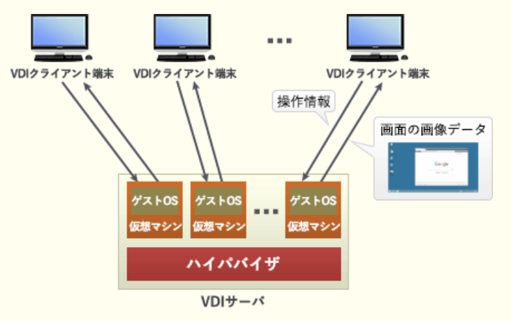

- インターネット上に仮想の専用線を設定し、特定の人だけが利用できる専用ネットワーク  
VPN(*Virtual Private Network*)の説明

- 紙で保管されている資料を、ネットワークを介して遠隔地からでも参照可能な電子書類に変換・保存することができるツール  
スキャナや文書管理システムの説明

- 対面での会議開催が困難な場合に、ネットワークを介して対面と同じようなコミュニケーションができるツール  
テレビ(ビデオ)会議システムの説明

---
50.投資案件において、5年間の投資効果をROI(*Return On Investment*)で評価した場合、4つの案件で最もROIが高いものはどれか。割引率は考慮しなくても良いものとする

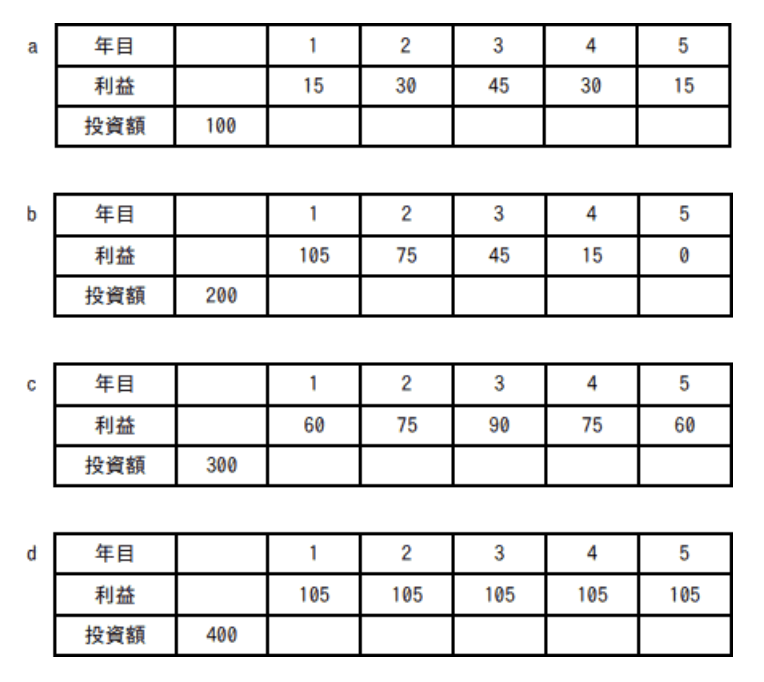

- A.**a**  
ROI(投下資本利益率)は、投資額に対してどれだけ利益を生み出しているかを見る指標で、以下の式で求める  
「ROI(%) = (利益 / 投資額) * 100」

a :  
(15 + 30 + 45 + 30 + 15) / 100 = **1.35**

b :  
(105 + 75 + 45 + 15) / 200 = 1.2

c :  
(60 + 75 + 90 + 75 + 60) / 300 = 1.2

d :  
(105 + 105 + 105 + 105 + 105) / 400 = 1.31

---
51.国や地方公共団体などが、環境への配慮を積極的に行なっているとされている評価されている製品・サービスを選んでいる取り組み

- A.**グリーン購入**  
環境負荷の少ない製品、環境保護の少ない製品、環境保護に取り組む企業から優先的に購入する調達方針。  
2001年にグリーン購入法が施工された。国等の機関にグリーン購入を義務付けるとともに、地方公共団体や事業者・国民にもグリーン購入に努めることを求めている

- CSR(*Corporate Social Responsibility*)  
企業活動において経済的成長だけでなく、環境や社会からの要請に対し、責任を果たすことが企業価値の向上につながるという考え方

- エコマーク認定  
生産から廃棄までを通じて環境への負荷が少なく、環境保全に役立つと認められた商品を認定する制度。認定された商品はエコマークを表示することができる

- 環境アセスメント(環境影響評価)  
主として大規模開発事業等による環境への影響を事前に調査することで、予測・評価を行う手続きのこと

---
52.コアコンピタンス(*Core Competence*)の説明

- A.**競合他社には真似できない自社ならではの卓越した能力**  
成功や競争優位の源泉となるその企業独自のノウハウや技術などのように、競合他社には真似できない「企業の核となる能力」のこと。事業を展開していく上では自社のコアコンピタンスを正しく認識し、その強みが生かせる分野に展開していく経営手法を言う。  
ある能力がコアコンピタンスかどうかは、模倣可能性(真似される可能性)、移動可能性(他分野への適用)、代替可能性、希少性、耐久性(継続的に競争優位を保てるか)の5点を考慮しなければならない。Googleの検索エンジン、アップルのハードウェア開発技術、トヨタ自動車の生産プロセスなどが挙げられる

- 経営を行う上で法令や各種規制、社会的規範などを遵守する企業活動  
コンプライアンスの説明

- 市場・技術・商品(サービス)の観点から設定した、事業の展開領域  
事業ドメインの説明

- 組織活動の目的を達成するために行う、業務とシステムの全体最適化手法  
ITガバナンスの説明

---
53.新事業に取り組む際の手法として、E.リースが提唱したリーンスタートアップの説明

- A.**実用最小限の製品・サービスを短期間で短期間で作り、構築・計測・学習というフィードバックループで改良や方向転換をして、継続的にイノベーションを行う手法**  
トヨタ生産方式を起源とするリーン生産方式の着想を起業プロセスに応用した方法論。企業プロセスに関わる無駄をなくし、科学的にマネジメントを行うことで、起業・新事業・新製品開発で陥りやすい失敗を少なくすることを目的としている

市場や未来は不確実なもので、どの製品・サービスが顧客に受け入れられるか世に出してみるまで分からないという実情な中、リーンスタートアップでは詳細な事業遂行計画を立てるのではなく、検証済みの仮説に基づいて、できるだけ早く実用最小限の製品(*Minimum Viable Product*)を作り、構築・計測・学習のフィードバックループを小さいバッチサイズで回すことが肝となっている。検証による学びで継続的に調整を行ったり、時に大胆に方向転換(ピボット)を行ったりすることを繰り返しながら、本当に顧客価値があるものを市場に提供するというのが基本コンセプトになっている

- 国・地方公共団体など、公共機関の補助金・助成金の交付を前提とし、事前に詳細な事業計画を検討・立案した上で、公共性のある事業を立ち上げる手法  
事前に詳細な事業計画を検討・立案しているので、リーンスタートアップではない

- 市場環境の変化によって競争力を喪失した事業分野に対して、経営資源を大規模に追加投入し、リニューアルすることによって、機関事業として再出発を期す手法  
リーンスタートアップでは失敗した時の痛手を軽減したり、途中で方向転換したりするために、最初から大規模な経営資源を投入することはしない

- 持続可能な事業を迅速に構築し、展開するために、予め詳細に立案された事業計画を厳格に遂行して、成果の検証や計画の変更を最小限にとどめる手法  
予め詳細に立案された事業計画を厳格に実行しているので、リーンスタートアップではない。仮説に誤りがあると途中で分かっていても方向転換ができず、計画的に失敗してしまうという結果に陥りやすい

---
54.IoTの活用事例のうち、HEMS(*Home Energy Management System*)の説明

- A.**太陽光発電装置などのエネルギー機器、家電機器、センサー類などを家庭内通信ネットワークに接続して、エネルギーの可視化と消費の最適制御を行う**  
住戸で使用されるあらゆる家電や電気設備をネットワークに接続し、エネルギー使用状況を可視化しつつ積極的に制御を行うことで、省エネやピークカットの効果を目指す仕組み。政府は2030年までに全住宅にHEMS(ヘムス)を設置することを目指している

- 工場内の機械に取り付けたセンサーで振動・湿度・音などを常時計測し、収集したデータを基に機械の劣化状態を分析して、適切なタイミングで部品を交換する  
予知保全の説明

- 自動車に取り付けたセンサーで車両の状態、路面状況などのデータを計測し、ネットワークを介して保存し分析することによって、効率的な運転を支援する  
ADAS(先進運転支援システム)の説明

- 情報通信技術や環境技術を駆使して、街頭などの公共設備や交通システムをはじめとする都市基盤のエネルギーの可視化と消費の最適制御を行う  
スマートシティの説明

---
55.ロングテールの説明

- A.**インターネットショッピングで、売上の全体に対して、あまり売れない商品群の売上合計が無視できない割合になっていること**  
膨大な商品を低コストで扱うことができるインターネットを使った商品販売において、実店舗では陳列されにくい販売機会の少ない商品でも、それらを数多く取り揃えることによって十分な売上を確保できることを説明した経済理論

一般的に商品の売り上げはパレートの法則(2 : 8の法則)に従うので、実店舗では売り場面積や物流などの問題から上位20%の商品を優先的に販売することになる。しかし、インターネット販売では従来の小売店販売面積の制約に縛られず、商品をDBに登録するだけで膨大な膨大な商品点数を揃えることが可能。この商品点数の多さを活かし、小さくても確かにある販売機会を大量に集めることで、実店舗では実現不可能部分で大きな売上が生じるという現象が起こる

- Webコンテンツを構成するテキストや画像などのデジタルコンテンツに、総合的・体系的な管理、配信などの必要な処理を行うこと  
CMS(*Content Management System*)の説明

- 自分のWebサイトやブログに企業へのリンクを掲載し、他者がこれらのリンクを経由して商品を購入した時に、企業が紹介料を払うこと  
アフィリエイトの説明

- メーカーや卸売業者から商品を直接配送することによって、在庫リスクを負うことなく自分のWebサイトで商品が販売できること  
ドロップシッピングの説明

---
56.CGM(*Consumer Generated Media*)の例

- A.**個人が、自ら使用した商品などの評価に関する情報を、不特定多数に向けて発信するブログやSNSなどのWebサイト**  
掲示板、Q&Aサイト、SNS、口コミ投稿サイトなど、ユーザが投稿した内容をもとにページが作成されていくWebコンテンツの形態。講義的な意味ではブログも含まれる。サイト上でユーザ同士が意見交換したりできることから、Web運営者の一方的な情報提供に留まらず、コミュニティとして機能を持ち合わせているサイトが多くなっている。  
利用者の投稿によりページが生成されていく特性を持つサイトが該当する

- 企業が、経営状況や財務状況、業務動向に関する情報を、個人投資家向けに公開する自社のWebサイト
- 企業が、自社の商品の特徴や使用方法に関する情報を、一般消費者向けに発信する自社のWebサイト
- 行政機関が、政策、行政サービスに関する情報を、一般市民向けに公開する自組織のWebサイト

---
57.製品X, Yを生産するために2種類の原料A, Bが必要である。製品1個の生産に必要となる原料の量と調達可能量は表の通り。製品X, Yの1個当たりの販売利益が、それぞれ100円, 150円であるときの最大利益

|原料|製品Xの1個当たりの必要量|製品Yの1個当たりの必要量|調達可能量|
|-|-|-|---|
|A|2|1|100|
|B|1|2|80 |

- A.**7,000**

原料A, Bの両方を調達可能まで使い切るときの、X, Yの生産量の組み合わせを連立方程式で求める  
・`2x + y = 100`  
・`x + 2y = 80`  
=> x = 40, y = 20  
調達可能量まで原料A, Bを使った場合、Xを40個、yを20個を生産することができる。この場合、製品Xで4,000円、製品Yで3,000円の利益を得られる

---
58.令和2年4月に30万円で購入したPCを3年後に1万円で売却する時、固定資産売却損は何万円か。耐用年数は4年、減価償却は定額法、定額法の償却率は0.250、残存価額は0円とする

- A.**6.5**

固定資産売却損益は、固定資産を売却した時の譲渡額と売却時の帳簿価額の差によって生じる損益。  
・最初に売却時点での帳簿価額を計算する。減価償却は償却率0.250の定額法で行うので、1年ごとの償却額は、  
`30万円 * 0.250 = 7.2万円`  
売却は購入から3年後に行われたので、売却時点での帳簿価額は、  
`30万円 - (7.5万円 * 3年) = 7.5万円`  
帳簿価額7.5万円の物を1万円で売ったので損をしている。両者の差額を固定資産売却額を固定資産売却損として、`6.5万円`を計上することになる

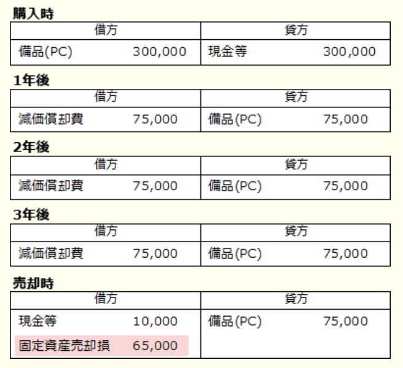

---
59.売上高が100百万円のとき、変動費が60百万円、固定費が30百万円掛かる。変動比率、固定費は変わらないものとして、目標利益18百万円を達成するのに必要な売上高はいくらか

- A.**120百万円**

売上高、固定費、変動費、利益の間には次のような関係がある。  
`利益 = 売上高 - 変動費 - 固定費`  
`変動費 = 売上高 * 変動比率`  
変動比率 = 変動費 / 売上高 = 0.6  
上の式に代入すると、  
18 = x - (x * 0.6) - 30  
0.4x = 48  
x = 120(百万円)

---
60.労働者派遣法に基づく、派遣先企業と労働者との関係(太線)

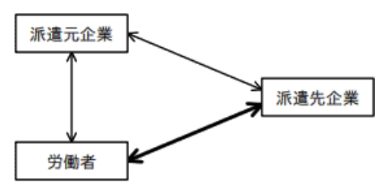

- A.**指揮命令関係**  
派遣先企業と労働者の間に生じる

- 請負契約関係  
労働者派遣契約なので、どの関係にも請負契約関係は生じない

- 雇用関係  
派遣元企業と労働者の間に生じる

- 労働者派遣契約関係  
派遣元企業と派遣先企業の間に生じる

### 科目B

---
1.プログラムを実行すると出力される内容は何か

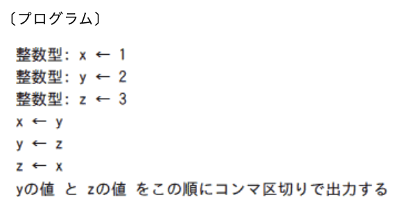

- A.**3, 2**  
初期状態は、{x, y, z} => {1, 2, 3}  
x ← yの処理後、{x, y, z} => {2, 2, 3}  
y ← zの処理後、{x, y, z} => {2, 3, 3}  
z ← xの処理後、{x, y, z} => {2, 3, 2}  

---
2.プログラムを実行すると出力される内容は何か  
関数fizzBuzzは、引数で与えられた値が、3で割り切れて5で割り切れない場合は`3で割り切れる`を、5で割り切れて3で割り切れない場合は`5で割り切れる`を、3と5で割り切れる場合は`3と5で割り切れる`を返す。それ以外の場合は`3でも5でも割り切れない`を返す

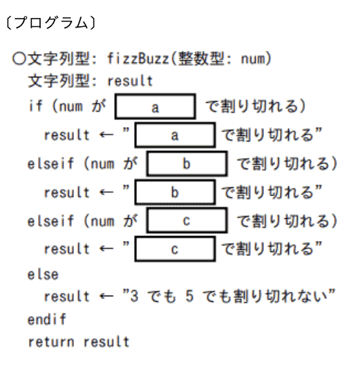

- A.**a : 3と5**
- A.**b : 3**
- A.**c : 5**

1.3で割り切れる  
2.5で割り切れる  
3.3と5で割り切れる  
1と2の条件はそれぞれ3の条件の一部分となっている。3の条件を満たすときは常に1または2の条件を満たすため、aに1を入れると"3(5)で割り切れる"と表示されてしまうため不適切。そのため一番最初の判定条件であるaには"3と5"を入れ、どちらでも割り切れなかった値について、3で割り切れるか、5で割り切れるかの判定を行う必要がある。bとcはどちらの順番でも正しく動作する

---
3.正しい答えを選択。配列の要素番号は1から始まる  
関数makeNewArrayは、要素数2以上の正数型の配列を引数に取り、正数型の配列を返す関数である。関数makeNewArrayをmakeNewArray({3, 2, 1, 6, 5, 4})として呼び出した時、戻り値の配列の要素番号5の値はいくつか

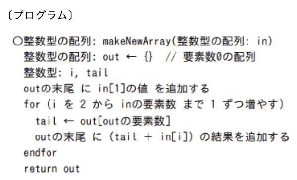

- A.**17**

in = {3, 2, 1, 6, 5, 4}
`outの末尾にin[1]の値を追加する`  
=> in[1]の3なので、out = {3}  
for文による繰り返し処理を行う。inの要素数は6なので、iの値を2から6まで1ずつ増やす操作を5回繰り返す  
・i = 2  
tail ← out[要素数 = 1] = 3  
outの末尾にtail + in[i] = 3 + 2 = 5を追加する  
=> out = {3, 5}  
・i = 3  
tail ← out[要素数 = 2] = 5  
outの末尾にtail + in[i] = 5 + 1 = 6を追加する  
=> out = {3, 5, 6}  
・i = 4  
tail ← out[要素数 = 3] = 6  
outの末尾にtail + in[i] = 6 + 6 = 12を追加する  
=> out = {3, 5, 6, 12}  
・i = 5  
tail ← out[要素数 = 4] = 12  
outの末尾にtail + in[i] = 12 + 5 = **17を追加する**  
=> out = {3, 5, 6, 12, 17}  
・i = 6  
tail ← out[要素数 = 5] = 17  
outの末尾にtail + in[i] = 17 + 4 = 21を追加する  
=> out = {3, 5, 6, 12, 17, 21}  

(別解)  
outの末尾に追加される値は、  
out[1] = in[1] = 3  
out[2] = in[1] + in[2] = 5  
…  
out[5] = in[1] ~ in[5]の和 = 3 + 2 + 1 + 6 + 5 = 17

---
4.関数gcdは、引数で与えられた2つの正の整数`num1`、`num2`の最大公約数を、以下の性質を利用して求める。  
(1) : num1 = num2の時、両者の最大公約数はnum1である  
(2) : num1 > num2の時、両者の最大公約数は(num1 - num2)とnum2の最大公約数と等しい  
(3) : num2 > num1の時、両者の最大公約数は(num2 - num1)とnum1の最大公約数と等しい

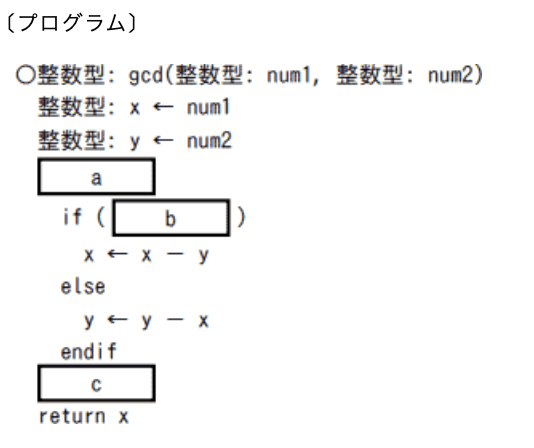

- A.**a : `while(x != y)`**
- A.**b : `x > y`**
- A.**b : `endwhile`**

a, c : 最大公約数はnum1 = num2の時のnum1と説明がある。2つの正の整数について、(2)または(3)の処理1度でnum1 = num2になるとは限らず、両者が等しくなるまで繰り返す必要があるため、while文が当てはまる  
b : if文が一致の場合、x - yをしているので、xの方が大きい。つまり、`x > y`

---
5.正しい答えを選択  
関数calcは、正の実数xとyを受け取り、`(x ** 2 + y ** 2) ** 0.5`の計算結果を返す。関数powは、第1引数として正の実数aを、第2引数として実数bを受け取り、aのb乗の値を実数型で返す

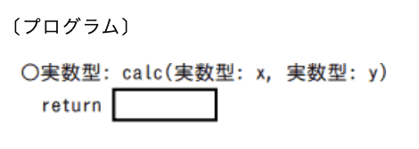

- A.**pow(pow(x, 2) + pow(y, 2), 0.5)**  
xの平方根はxの0.5乗の意味。  
x ** 2 = pow(x, 2)  
第1引数に`pow(x, 2) + pow(y, 2)`、第2引数に`0.5`を指定すると適切

---
6.関数revは8ビット型の引数byteを受け取り、ビットの並びを逆にした値を返す。関数revをrev(01001011)として呼び出すと、戻り値は11010010となる。  
演算子`^`はビット単位の論理積、演算子`v`はビット単位の論理和、演算子`>>`は論理右シフト、演算子`<<`は論理左シフトを表す

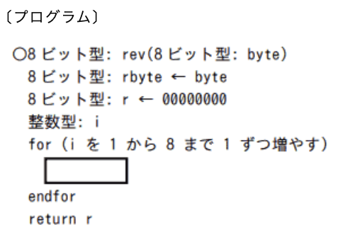

- A.**`r ← (r << 1) v (rbyte ^ 00000001)`**
- A.**`rbyte ← rbyte >> 1`**  
`rbyte ^ 00000001`の部分では、rbyteの最下位ビットを取得している。この取得したビットと1ビット左シフトした変数rを論理和演算することで、変数rbyteの最下位ビットが変数rの最下位ビットにコピーされる。その後、変数rbyteを右に1つずらすことで、次に対象となる最下位ビットを移動させている。  
for文で上記の処理が繰り返されることにより、「変数rbyteの最下位ビットを取得」「変数rを1ビット左シフト」「変数rbyteの最下位ビットを変数rの最下位ビットにコピー」「変数rbyteを1ビット右シフトの流れができ、8回繰り返すと引数byteの最下位ビットから順に変数rの先頭ビットに格納されていることになる」

論理積 : 両方のビットが1の時のみ1を出力し、それ以外では0を出力する。マスクビットの特定箇所を1をすることで、他方のビット列から1とした部分のビットを取り出すことができる  
論理和 : 少なくとも1つのビットが1の時に1を出力する  
論理右(左)シフト : ビット列全体を指定された数だけずらす。はみ出たビット部分は無視し、空いたビットが0で埋める

- `r ← (r << 7) v (rbyte ^ 00000001)`
- `rbyte ← rbyte >> 7`  
`rbyte ← rbyte >> 7`では、変数rbyteを7ビット右にシフトした値で更新している。引数が01001011だったと仮定すると、繰返し処理の1回目においてrbyteの値が00000000に変わることになり、その後の繰返し処理で元のビット列の情報を得ることが不可能になってしまうので不適切

- `r ← (r << 1) v (rbyte >> 7)`
- `rbyte ← r`  
変数rに代入される`(rbyte << 1) ∨ (rbyte >> 7)`は、`rbyte << 1`は変数rbyteを1ビット左にシフトするので最下位ビットが0のビット列、`rbyte >> 7`は変数rbyteを7ビット右にシフトするので、従前の先頭ビットが最下位ビットの値であり、それ以外は0のビット列となる。この2つのビット列の論理和をとると、ビット列全体を1ビット左にずらして空いた(0埋めされた)最下位ビットの位置に、従前の先頭ビットが入ることになる。  
8回繰り返しても、終了時の変数rは元の引数byteと同じビット列になるだけなので不適切

- `r ← (r >> 1) v (rbyte << 7)`
- `rbyte ← r`  
変数rに代入される`(rbyte >> 1) ∨ (rbyte << 7)`は、`rbyte >> 1`は変数rbyteを1ビット右にシフトするので先頭ビットが0のビット列、`rbyte << 7`は変数rbyteを7ビット左にシフトするので、従前の最下位ビットが先頭ビットの値であり、それ以外が0のビット列となる。この2つのビット列の論理和をとると、ビット列全体を1ビット右にずらして空いた(0埋めされた)先頭ビットの位置に、従前の最下位ビットが入ることになる。  
8回繰り返しても、終了時の変数rは元の引数byteと同じビット列になるだけなので不適切

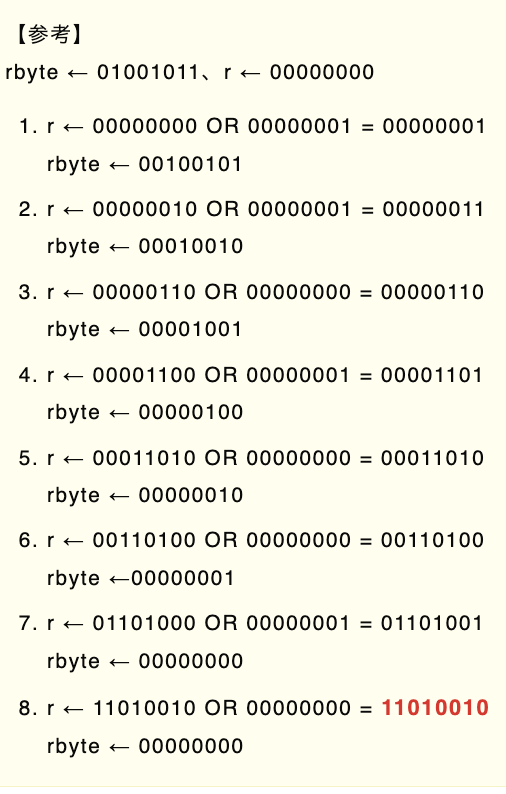

---
7.関数factorialは非負の整数nを引数にとり、その階乗を返す関数である。非負の整数nの階乗はnが0のときに1になり、それ以外の場合は1からnまでの整数を全て掛け合わせた数となる

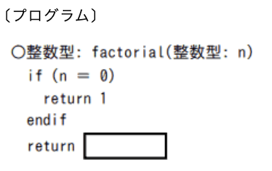

- A.**n * factorial(n - 1)**  
factorial(4)  
= 4 * factorial(3)  
= 4 * 3 * factorial(2)  
= 4 * 3 * 2 * factorial(1)  
= 4 * 3 * 2 * 1 * factorial(0)  
= 4 * 3 * 2 * 1 * 1 = 24

- (n - 1) * factorial(n)  
factorial(4)  
= 3 * factorial(4)  
= 3 * 3 * factorial(4)  
無限ループになってしまい値が返ってこないので誤り

- factorial(n - 1)  
factorial(4)  
= factorial(3)  
= factorial(2)  
= factorial(1)  
= factorial(0) = 1  
結果が常に1になってしまうため誤り

- n  
factorial(4) = 4  
引数をそのまま返すだけなので誤り

- n * (n - 1)  
factorial(4)  
= 4 * 3 = 12  
引数の値とそれよりも1少ない数の積を返すだけで、階乗の結果とはならない

- n * factorial(1)  
factorial(4)  
= 4 * factorial(1)  
= 4 * 1 * factorial(1)  
= 4 * 1 * 1 * factorial(1)  
無限ループになってしまい値が返ってこないので誤り

---
8.優先度付きキューを操作するプログラムである。優先度付きキューとは扱う要素に優先度を付けたキューであり、要素を取り出す際には優先度の高いものから順番に取り出される。クラス PrioQueueは優先度付きキューを表すクラスである。クラス PrioQueueの説明を図に示す。優先度は整数型の値1, 2, 3のいずれかで、小さい値ほど優先度が高いものとする。prioSchedを呼び出した時の出力の順は何か

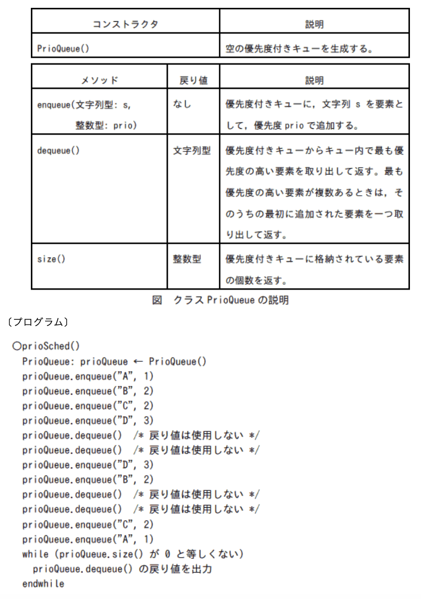

- A.**[A, C, D, D]**

`enqueue`はキューの最後尾に要素を追加する操作、`dequeue`はキューから要素を取り出す操作。`dequeue`では、キューの中で最も優先度の高い(優先度`prio`が小さい)要素を取り出し、同じ優先度の要素が複数ある場合には、より先に追加された要素が取り出す  
この操作を踏まえて、プログラムの処理をトレースする  
`enqueue("A", 1)`  
[("A", 1)]  
`enqueue("B", 2)`  
[("A", 1), ("B", 2)]  
`enqueue("C", 2)`  
[("A", 1), ("B", 2), ("C", 2)]  
`enqueue("D", 3)`  
[("A", 1), ("B", 2), ("C", 2), ("D", 3)]  
`dequeue()` : 最も優先度の高いAを取り出す  
[("B", 2), ("C", 2), ("D", 3)]  
`dequeue()` : B, Cの優先度が同じなので、先に追加されたBを取り出す  
[("C", 2), ("D", 3)]  
`enqueue("D", 3)`  
[("C", 2), ("D", 3), ("D", 3)]  
`enqueue("B", 2)`  
[("C", 2), ("D", 3), ("D", 3), ("B", 2)]  
`dequeue()` : C, Bの優先度が同じなので、先に追加されたCを取り出す  
[("D", 3), ("D", 3), ("B", 2)]  
`dequeue()` : 最も優先度の高いBを取り出す  
[("D", 3), ("D", 3)]  
`enqueue("C", 2)`  
[("D", 3), ("D", 3), ("C", 2)]  
`enqueue("A", 1)`  
[("D", 3), ("D", 3), ("C", 2), ("A", 1)]  
・出力する前のキューの中身は上記の通り。この状態から`dequeue`を4回繰り返すと優先度の高い順にA, C, D, Dと出力される

---
9.正しい答えを選択。配列の要素番号は1から始まる  
手続`order`は、図の2分木の、引数で指定した節を根とする部分木をたどりながら、全ての節番号を出力する。大域の配列`tree`が図の2分木を表している。配列treeの要素は、対応する節の子の節番号を、左の子、右の子の順に格納した配列である。配列 `tree`の要素番号1の要素は、節番号1の子の節番号から成る配列であり、左の子の節番号2、右の子の節番号3を配列{2, 3}として格納する。手続orderをorder(1)として呼び出すと出力はどの順か

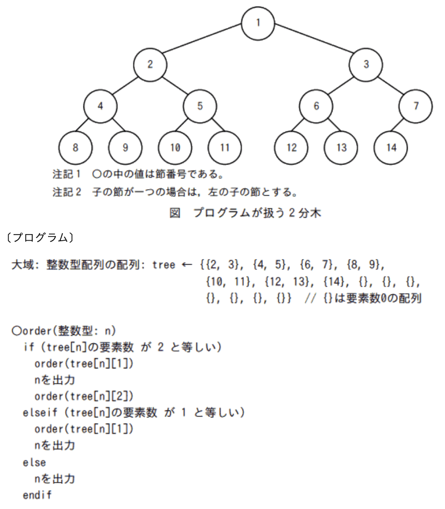

- A.**8, 4, 9, 2, 10, 5, 11, 1, 12, 6, 13, 3, 14, 7**

プログラム`order`には、処理対象となっている節が有する子の数(tree[n]の要素数)によって3つの処理に分岐させている。  
・その節が2つの子を持つ(tree[2]の要素数が2)  
要素の1番目の節番号(左)の子を探索し、自身の節番号を出力する、要素の2番目の節番号(右)を探索する(tree[n]の要素数が1)  
・その節が1つの子を持つ  
要素の1番目の節番号(左)を探索し、自身の節番号を出力する  
・その節が子を持たない  
自身の節番号を出力する  
節番号1を根として探索すると処理は以下の通り。  
1.`order(1)`を呼び出す  
=> 配列tree[1]は2つの要素{2, 3}を持つので、そのうち1番目の要素(tree[1][1])である節番号2を対象として`order(2)`を呼び出す  
2.配列tree[2]は2つの要素{4, 5}を持つので、そのうち1番目の要素(tree[2][1])である節番号4を対象として`order(4)`を呼び出す  
=> 配列tree[4]は2つの要素{8, 9}を持つので、そのうち1番目の要素(tree[4][1])である節番号8を対象として`order(8)`を呼び出す  
3.配列tree[8]は要素を持たないので`8`を出力して終了、呼び出し元の`order(4)`の処理に戻る  
4.`order(4)`は自身の節番号4を出力した後、2番目の要素(tree[4][2])である節番号9を対象として`order(9)`を呼び出す  
5.配列tree[9]は要素を持たないので`9`を出力して`order(4)`の処理に戻る

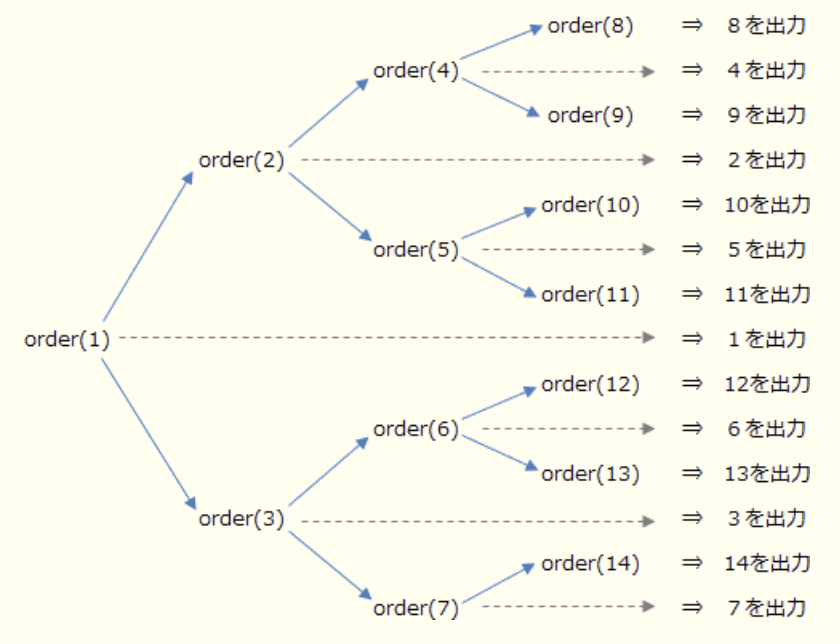

---
10.手続`delNode`は、単方向リストから、引数posで指定された位置の要素を削除する手続である。引数posは、リストの要素数以下の正の整数とする。リストの先頭の位置を1とする。  
クラスListElementは、単方向リストの要素を表す。クラスListElementのメンバ変数の説明を表に示す。ListElement型の変数はクラスListElementのインスタンスの参照を格納するものとする。大域変数listHeadには、リストの先頭要素の参照があらかじめ格納されている

|メンバ変数|型         |説明|
|--------|-----------|---|
|val     |文字型      |要素の値|
|next    |ListElement|次の要素を参照 次の要素がない時の状態は未定義|

- A.**prev.next.next**

リスト構造は、隣接するデータ同士を参照(ポインタ)で連結して表現するデータ構造。単方向リストでは、最初の要素から最後の要素までが1方向に連結されたもの。  
リスト構造では、要素を削除すると要素同士の繋がりが途中で途切れてしまうため、要素を削除する際には、削除する要素の1つ前の参照を付け替える操作が必要となる。  
プログラムでは`posが1と等しい`という条件式で処理を分岐させている。pos = 1、つまり1番目の要素を削除するときに行っている処理は、`listHead`に`listHead.next`を代入するというもの。これは先頭要素の次の要素(2番目の要素)を先頭要素に置き換える操作。これにより1番目の要素はリストから離脱することになり削除される。  
・pos = 2  
変数`prev`の初期値である先頭要素をそのまま`prev`として使う  
・pos <= 3  
3番目の要素を削除する場合、`prev`に2番目の要素を格納したいので1回、4番目の要素を削除する場合、`prev`に3番目の要素を格納したいので2回、というように`pos - 2回分`だけポインタを移動して、`prev`に削除対象の要素の1つ前の要素を設定する  
空欄を含む処理は、`prev.next`(削除対象の要素への参照)を付け替える操作。リスト要素の削除は、削除対象の要素をリストの連結から外すことによって行うので、削除対象の要素の1つ後ろの要素への参照を設定することになる。削除対象の要素(prev.next)の次(next)なので`prev.next.next`が適切

---
11.正しい答えを選択。配列の要素番号は1から始まる  
関数binSortをどのように呼び出すと、戻り値の配列には未定義の要素が含まれず、値が昇順に並んでいるか

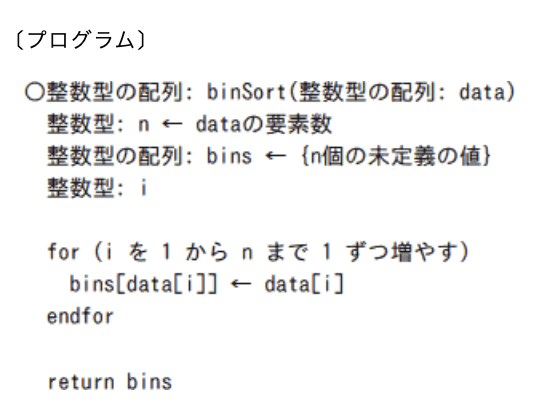

- A.**{2, 6, 3, 1, 4, 5}**  
(流れ)  
bins[2] ← 2  
bins[6] ← 6  
bins[3] ← 3  
bins[1] ← 1  
bins[4] ← 4  
bins[5] ← 5  
bins[] = {1, 2, 3, 4, 5, 6}

整数型の配列 : binSort(これを求める : data)  
整数型n ← dataの要素数 : => `6`つ  
整数型の配列 : bin ← {`6`個の未定義の値}  
このプログラムは、値がnである要素をn番目に格納することで昇順の整列を行うようになっている。このプログラムでは値によって格納位置が一意に決まるので、同じ値があると同じ箇所に重複して代入されてしまい、不足している数字を添字とする要素が未定義のままとなる。引数に値の重複がある場合、戻り値の配列に未定義の要素が含まれる

---
12.正しい答えを選択。配列の要素番号は1から始まる  
関数simRatioは、引数として与えられた要素数1以上の2つの文字型の配列s1とs2を比較し、要素数が等しい場合は、配列の並びがどの程度似ているかの指標として、(要素番号が同じ要素の文字同士が一致する要素の組みの個数 / s1の要素数)を実数型で返す。配列の全ての要素が一致する場合の戻り値は1, いずれの要素も一致しない場合の戻り値は0である。  
2つの配列の要素数が等しくない場合は-1を返す。  
関数simRatioに与えるs1, s2及び戻り値の例を表に示す。プログラムでは、配列の領域外を参照してはならないものとする

|s1             |s2             |戻り値|
|---------------|---------------|-----|
|[a, p, p, l, e]|[a, p, p, l, e]|1    |
|[a, p, p, l, e]|[a, p, r, i, l]|0.4  |
|[a, p, p, l, e]|[m, e, l, o, n]|0    |
|[a, p, p, l, e]|[p, e, n]      |-1   |

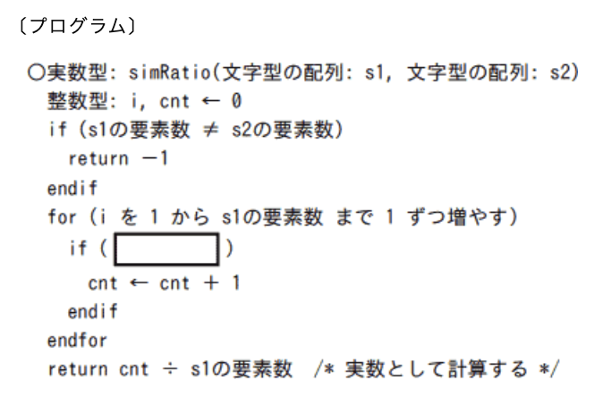

- **s1[i] = s2[i]**  
プログラムの戻り値は「要素番号が同じ要素の文字同士が一致する要素の組の個数 / s1の要素数」と説明されている。最後に`cnt / s1`の要素数を戻り値としていることから、`cnt`は問題文でいう「要素番号が同じ要素の文字同士が一致する要素の組みの個数」を格納する変数であることが分かる。  
if文では条件式がtrueのときに`cnt`をインクリメント(+1)しており、空欄には「引数s1とs2の同じ位置の文字が等しい」という意味の式を入れることになる。同じ要素番号の文字を比較したいので、`s1[i]`と比較すべきは`s2[i]`

---
13.正しい答えを選択。配列の要素番号は1から始まる  
関数searchは、引数`data`で指定された配列に、引数`target`で指定された値が含まれていればその要素番号を返し、含まれていなければ-1を返す。dataは昇順に整列されており、値に重複はない。  
関数searchには不具合がある。どのような場合、無限ループになるか

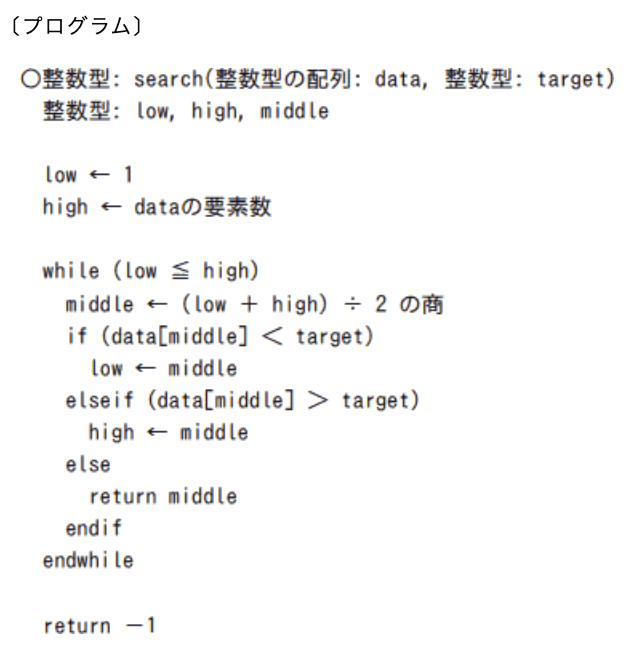

- A.**要素数が2で、targetがdataの末尾要素の値と等しい**  
low = 1、high = 2としてwhile文が開始される。middleは1。引数dataは昇順に整列されており、data[1]は目的のデータ(target)よりも小さいので、lowにmiddleの値を代入する(low = 1)。再度low = 1、high = 2を繰り返すことになり、同じ処理が行われてしまう

昇順で整列されたデータ群から目的のデータを探し、要素番号を返すプログラム(2分探索法)。  
1.探索範囲の中央に位置する値と目的地を比較する  
2.目的値の方が小さければ中央から探索範囲の最後まで、目的値の方が大きければ探索範囲の最初から中央まで探索範囲から除外する(探索範囲を1 / 2にする)  
3.目的地を見つけるまで1・2を繰り返す  
なお、本来の2分探索では一致しなかった中央の要素を探索範囲から外すが、中央要素を含めて新しい探索範囲としてしまっているので正しく動作しない

- 要素数が1で、targetがその要素の値と等しい  
low = 1、high = 1としてwhile文が開始される。middleは1。data[1]が目的のデータ(target)と等しいので、要素番号1を返して終了。`data[1] != target`の場合、low(high)に1が代入されて無限ループとなる

- 要素数が2で、targetがdataの先頭要素の値と等しい  
low = 1、high = 2としてwhile文が開始される。middleは1。data[1]が目的のデータ(target)と等しい(else以降)ので、要素番号1を返して終了

- 要素に-1が含まれている  
無限ループになることはない

---
14.正しい答えを選択。配列の要素番号は1から始まる  
要素数が1以上で、昇順に整列済みの配列を基に、配列を特徴づける5つの値を返すプログラムである。  
関数summarizeをsummarize({0.1, 0.2, 0.3, 0.4, 0.5, 0.6, 0.7, 0.8, 0.9, 1}) として呼び出すと戻り値はいくつか

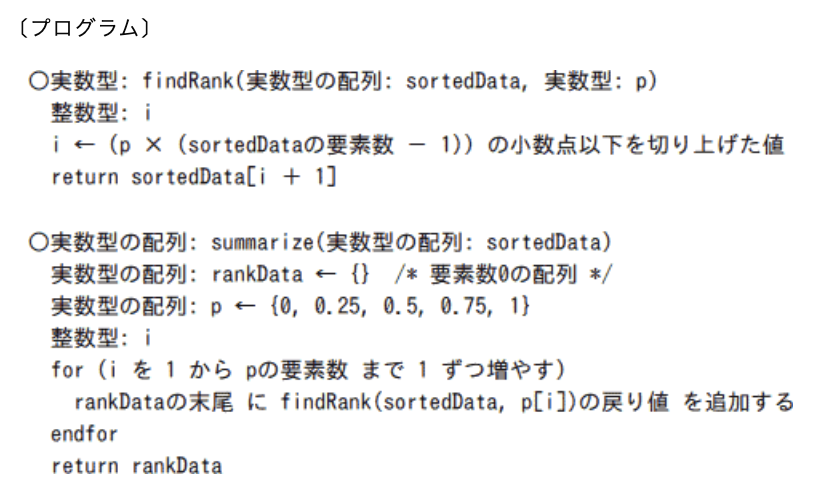

- A.**{0.1, 0.4, 0.6, 0.8, 1}**

関数`summarize`ではfor文を使って配列pの要素1つずつに対してサブルーチンである関数`findRank`を呼び出し、その結果を戻り値の配列である`rankData`に追加する。  
配列pは{0, 0.25, 0.5, 0.75, 1}なので、`rankData`には、5つの結果が格納されることになる。`sortedData`の要素数は10なので、関数`findRank`内で使われている「`sortedData`の要素数 - 1」は9  
・findRank(sortedData, p[1])  
i ← (0 * 9) = 0を切り上げた値 => 0  
return sortedData[1] = **0.1**  
・findRank(sortedData, p[2])  
i ← (0.25 * 9) = 2.25を切り上げた値 => 3  
return sortedData[4] = **0.4**  
・findRank(sortedData, p[3])  
i ← (0.5 * 9) = 4.5を切り上げた値 => 5  
return sortedData[6] = **0.6**  
・findRank(sortedData, p[4])  
i ← (0.75 * 9) = 6.75を切り上げた値 => 7  
return sortedData[8] = **0.8**  
・findRank(sortedData, p[5])  
i ← (1 * 9) = 9を切り上げた値 => 9  
return sortedData[10] = **1**  

---
15.記述中の組み合わせを選択  
三目並べにおいて自分が勝利する可能性が最も高い手を決定する。次の手順で、ゲームの状態遷移を木構造として表現し、根以外の各節の評価値を求める。その結果、根の子の中で最も評価値が高い手を、最も勝利する可能性が高い手とする。自分が選択した手を○，相手が選択した手を×で表す(以下手順)。  
・1.現在の盤面の状態を根とし、勝敗がつくか、引き分けとなるまでの考えられる全ての手を木構造で表現する。  
・2.葉の状態を次のように評価する。  
(1)自分が勝ちの場合は10  
(2)自分が負けの場合は-10  
(3)引き分けの場合は0  
・3.葉以外の節の評価値は、その節の全ての子の評価値を基に決定する。  
(1)自分の手番の節である場合，子の評価値で最大の評価値を節の評価値とする。  
(2)相手の手番の節である場合，子の評価値で最小の評価値を節の評価値とする。  
- ゲームが図の最上部ぶある根の状態の時、自分が選択できる手は3つある。そのうちAが指す子の評価値は`a`であり、Bが指す子の評価値は`b`である

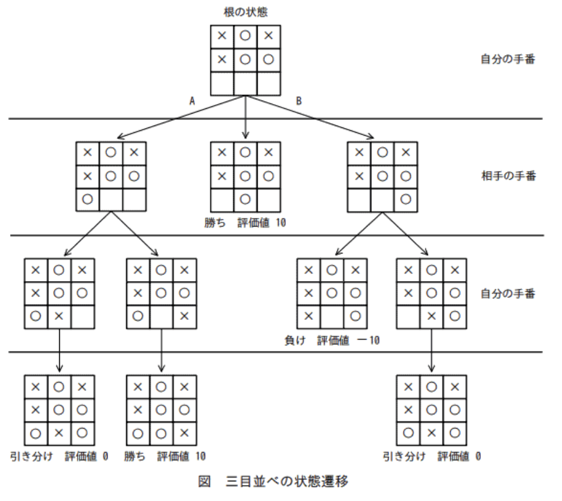

- A.**a : 0**
- A.**b : -10**

・Aが指す子の評価値  
葉の1つ上の節は、1つしか子を持たないので葉の評価値そのままが節の評価値となる(左側の節は0、右側の節は10)。その1つ上の節は相手の手番なので、評価値0と10を比較して小さいほうの0が評価値となる  
・Bが指す子の評価値  
葉の1つ上の右側の節は、1つしか子を持たないので葉の評価値そのままが評価値となる(左側の節は-10、右側の節は0)。その1つ上の節は相手の手番なので、評価値-10と0を比較して小さいほうの-10が評価値となる

---
16.正しい答えを選択。2つの空欄には同じ答えが入り、配列の要素番号は1から始まる  
Unicodeの符号位置を、UTF-8の符号に変換するプログラムである。本問で数値の後ろに`(16)`と記載した場合は、その数値が16進数であることを表す。  
Unicodeの各文字には、符号位置と呼ばれる整数値が与えられている。UTF-8は、Unicodeの文字を符号化する方式の1つであり、符号位置が`800(16)`以上`FFFF(16)`以下の文字は、次のように3バイトの値に符号化する。  
3バイトの長さのビットパターンを`1110`<u>`xxxx`</u> `10`<u>`xxxxxx`</u> `10`<u>`xxxxxx`</u>とする。ビットパターンの下線の付いた`x`の箇所に、符号位置を2進数で表した値を右詰めで格納し、余った`x`の箇所に0を格納する。この3バイトの値がUTF-8の符号である。  
ひらがなの「あ」の符号位置である`3042(16)`を2進数で表すと`11 0000 0100 0010`である。上に示したビットパターンの`x`の箇所に右詰めで格納すると、`1110xx11 10000001 10000010`となる。余った2つの`x`の箇所に0を格納すると、「あ」のUTF-8の符号`11100011 10000001 10000010`が得られる。  
関数`encode`は、引数で渡されたUnicodeの符号位置をUTF-8の符号に変換し、先頭から順に1バイトずつ要素に格納した整数型の配列を返す。`encode`には、引数として、`800(16)`以上`FFFF(16)`以下の整数値だけが渡されるものとする

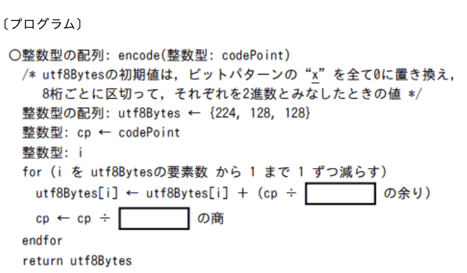

- A.**64**

符号位置は800(16)以上FFFF(16)以下とある。  
・800(16) : `1000 0000 0000(2)`  
・FFFF(16) : `1111 1111 1111 1111(2)`  
引数`codePoint`のビット長は12ビット以上16ビット以下となる。また、変数`utf8Bytes`の値はそれぞれ  
・utf8Bytes[1] = 224(10) = 1110 <u>0000</u>(2)  
・utf8Bytes[2] = 128(10) = 10<u>00 0000</u>(2)  
・utf8Bytes[3] = 128(10) = 10<u>00 0000</u>(2)  
架線部分に`codePoint`から切り出したビット列をコピーすることになる。  
for文ではループ変数iをデクリメントしながら3回繰返す。各回で行うべき処理は以下の通り。  
1回目 : utf8Bytes[3]に`codePoint`の下位6ビットをコピー  
2回目 : utf8Bytes[2]に`codePoint`の下位7ビット目から12ビット目までの6ビットをコピー  
3回目 : utf8Bytes[1]に`codePoint`の残りの部分をコピー  
変数`cp` から下位6ビットを取得する方法は、10進数の整数で下位3桁を取得したいときに「10の3乗 = 1,000」で割った余りを求めるのと同じで、2進数で下位3桁を取得するときには「2の3乗 = 8」で割ることになる。下位6ビットを取得したいので「2の6乗 = 64」を使うのが適切

---
17.指摘事項の各項番それぞれに対処する組織の適切な組み合わせ  
製造業のA社では、ECサイト(以下A社のECサイトをAサイトという)を使用し、個人向けの製品販売を行っている。Aサイトは、A社の製品やサービスが検索可能で、ログイン機能を有しており、あらかじめAサイトに利用登録した個人(以下会員という)の氏名やメールアドレスといった情報(以下会員情報という)を管理している。Aサイトは、B社のPaaSで稼働しており、PaaS上のDBMSとアプリケーションサーバを利用している。  
A社は、Aサイトの開発、運用をC社に委託している。A社とC社との間の委託契約では、Webアプリケーションプログラムの脆弱性対策は、C社が実施するとしている。  
最近、A社の同業他社が運営しているWebサイトで脆弱性が悪用され、個人情報が漏えいするという事件が発生した。そこでA社は、セキュリティ診断サービスを行っているD社に、Aサイトの脆弱性診断を依頼した。脆弱性診断の結果、対策が必要なセキュリティ上の脆弱性が複数指摘された。図1にD社からの指摘事項を示す

項番1 : `Aサイトで利用しているアプリケーションサーバのOSに既知の脆弱性があり、脆弱性を悪用した攻撃を受けるおそれがある`  
項番2 : `Aサイトにクロスサイトスクリプティングの脆弱性があり、会員情報を不正に取得されるおそれがある`  
項番3 : `Aサイトで利用しているDBMSに既知の脆弱性があり、脆弱性を悪用した攻撃を受けるおそれがある`
