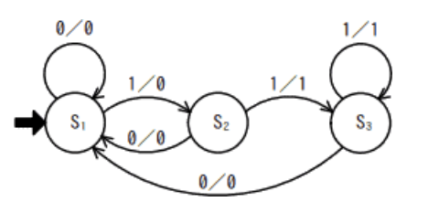
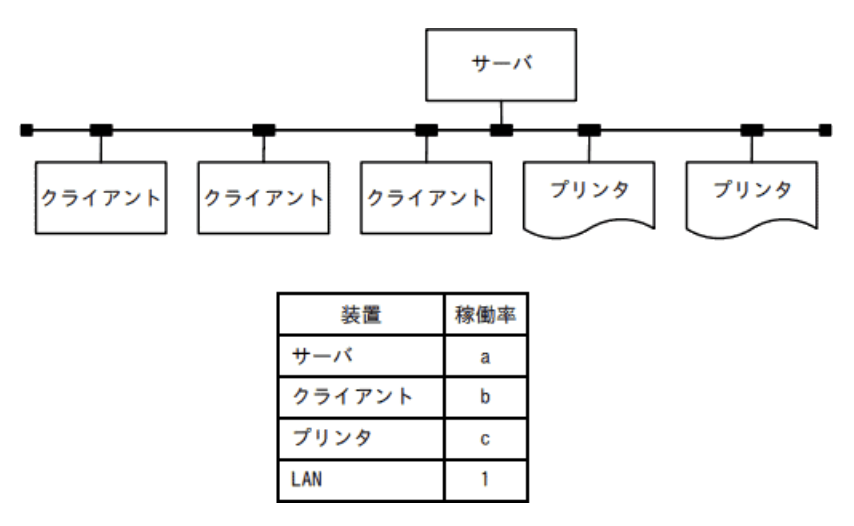

### サンプル問題

### 科目A

### `テクノロジ系`

---
1.負数を2の補数で表すとき、8ビットの2進正数nに対し－nを求める式はどれか。+ は加算を表し、ORはビットごとの論理和、XORはビットごとの排他的論理和を表す

- A.**(n XOR 11111111) + 00000001**  
2の補数とは、負数を表現する方法の1つ。ある正数に対応する2の補数に求めるには、**全てのビットを反転して1を加える。**全ビットを反転するときに使われる論理演算が**排他的論理和(XOR)** で、次のような特徴がある。  
・「XOR 0(0との排他的論理和)」の結果は元のビットそのままとなる  
・「XOR 1(1との排他的論理和)」の結果は元のビットを反転したビットとなる

|入力||出力             |
|---|-|----------------|
|X  |Y|Z               |
|0  |0|0(Xの値そのまま)  |
|1  |0|1(Xの値そのまま)  |
|0  |1|1(Xを反転した値)  |
|1  |1|0(Xを反転した値)  |

この性質を生かして、排他的論理和はあるビット列中で特定の部分だけを反転させるときに用いられる。  
2進正数nから2の補数表現の-nを得るには、  
1.nの全ビットを反転する => n XOR 11111111  
2.結果に1を加算する => + 00000001

---
2.10進整数j(0 < j < 100)を8桁の2進数に変換する処理を表している。2進数は下位桁から順に、配列の要素NISHIN(1)からNISHIN(8)に格納される。流れ図のa及びbに入れる処理はどれか。j div 2はjを2で割った商の整数部分を、j mod 2はjを2で割った余りを表す

変換の繰り返し処理は、kは初期値1から1ずつ、8まで増やす。  
j ← j div 2 : jを2で割った商の整数部分  
j ← j mod 2 : jを2で割った余り

- A.**a : NISHIN(k) ← j mod 2**  
- A.**b : j ← j div 2**  
10進数から2進数に変換する方法で、2で割ることを繰り返す方法をアルゴリズムとして表したもの。aでは2で割った余りを格納し(0 or 1)、bではjを2で割る

50の場合は下記のようになる

---
3.P、Q、Rはいずれも命題である。命題Pの真理値は真であり、命題(not P) or Q及び命題(not Q) or Rのいずれの真理値も真であることが分かっている。Q、Rの真理値はどれか。X or YはXとYの論理和、not XはXの否定を表す

- A.**Q : 真**  
- A.**R : 真**  
命題(not P) or Q => Pではない(偽)またはQ => 真、つまり命題Qは真  
命題(not Q) or R => Qではない(偽)またはR => 真、つまり命題Rは真

---
4.入力記号、出力記号の集合が{0, 1}であり、状態遷移図で示されるオートマトンがある。0011001110を入力記号とした場合の出力記号はどれか。入力記号は左から順に読み込まれるものとする。S1は初期状態を表し、遷移の矢印のラベルは、入力 / 出力を表している

- A.**0001000110**  
オートマトンは、コンピュータの状態、遷移をモデル化したもの。何かしらの操作(入力)をすると状態が遷移する。s1の場合、入力0であれば0を返し再度s1に遷移し、入力1であれば0を返しs2に遷移する  
0に対して**0を返す** : s1  
0に対して**0を返す** : s1  
1に対して**0を返す** : s1からs2  
1に対して**1を返す** : s2からs3  
0に対して**0を返す** : s3からs1  
0に対して**0を返す** : s1  
1に対して**0を返す** : s1からs2  
1に対して**1を返す** : s2からs3  
1に対して**1を返す** : s3  
0に対して**0を返す** : s3からs1

---
5.2分探索木になっている2分木

- A.**イ**  
左から昇順に整列されているため正しい

2分探索木は2分木の各節にデータをもたせることで探索を行えるようにした木。各節がもつデータは、「**その節から出る左部分木にあるどのデータよりも大きく、右部分木のどのデータよりも小さい**」という条件がある。  
つまり、どの部分においても、「左 < 中 < 右」の関係を満たしていれば2分探索木といえる

- ア  
15, 14の位置が反対

- ウ  
15, 16, 14の順番が異なる

- エ  
左から昇順になっていない。2分探索木ではないが、全ての葉が同じ深さを持っているため完全2分探索木という形状になっているになっている

---
6.配列Aが図2の状態のとき、図1の流れ図を実行すると、配列Bが図3の状態になった。図1のaに入れる操作はどれか。配列A、Bの要素をそれぞれA(i, j)、B(i, j)とする

- A.**B(j, 7－i) ← A(i, j)**  
i・jともに初期値0から1ずつ、7まで増加する。配列Aから配列Bへ、図が時計回りに90度回転している。  
B(1, 7) => A(0, 1)  
B(4, 4) => A(3, 4)  
B(1, 5) => A(2, 1)

---
7.10進法で5桁の数「a1a2a3a4a5」をハッシュ法を用いて配列に格納したい。ハッシュ関数をmod(a1 + a2 + a3 + a4 + a5 , 13)とし、求めたハッシュ値に対応する位置の配列要素に格納する場合、54321は配列のどの位置に入るか。mod(x, 13)はxを13で割った余りとする

- A.**2**  
54321の格桁の和は15なので、mod(15, 13) = 2

ハッシュ関数(引数を一定の規則で変換した値を返す関数)を用いて、探索するデータのキー値からデータの格納アドレスを直接計算する方法。データの格納場所が一意に決まるので挿入、検索、削除が高速に行える反面、格納に必要なデータ領域が多く必要という特徴がある

---
8.自然数nに対して、次のとおり再帰的に定義される関数f(n)を考える。f(5)の値はどれか  
f(n) : if n <= 1 then return 1 else return n + f(n－1)

- A.**15**  
再帰関数は、関数内で自身を読み出す構造になっている関数で、以下のような処理を行う。  
・引数nが1以下のとき、1を返す  
・それ以外のとき、n + f(n - 1)を返す  
f(5)  
= 5 + f(4)  
= 5 + 4 + f(3)  
= 5 + 4 + 3 + f(2)  
= 5 + 4 + 3 + 2 + f(1)  
= 5 + 4 + 3 + 2 + 1  
= 15

---
9.プログラムのコーディング規約に規定する事項

- A.**領域割付け関数を使用するときは、割付けができなかったときの処理を記述する**  
領域割付け関数は必ず成功するとは限らない。メモリブロックを確保できないまま後続の処理に進むとそこでエラーになってしまうため、領域割付け関数の戻り値をチェックするなどして割付け失敗時の分岐処理を記述するべき

- 局所変数は、用途が異なる場合でもデータ型が同じならば、できるだけ同一の変数を使うようにする  
1つの変数の役割は1つにするのが原則。用途が異なる場合には別々の変数として定義し、用途がわかるように適切な命名を行うべき

- 処理性能を向上させるために、ループの制御変数には浮動小数点型変数を使用する  
ループの制御変数には整数型を用いるのが原則。ループの制御変数に浮動小数点型変数(*float*等)を用いると、インクリメントやデクリメントの際の誤差が積み重なり、期待した結果を得られないことがある。そのためループの制御変数には整数型を使用するべき。また、浮動小数点型は整数型よりも演算が遅いので、わずかだが処理性能も低下する

- 同様の計算を何度も繰り返すときは、関数の再帰呼出しを用いる  
同様の処理を繰り返すときには、その処理をサブルーチン化して独立した関数にすることを検討すべき。再帰関数は、処理がわかりにくくなることや実行時のスタックサイズが予測できずオーバーフローを起こす可能性があるため、コーディング規約で使用を禁止されることもある

---
10.外部割り込みの原因となるもの

- A.**タイマによる時間経過の通知**  
タイマ割り込みは、システムに設定されたタイマが所定時間を経過したときに発生する割り込みで、外部割り込みに分類される

システムにすぐに対処しなくてはならない問題などが生じたときに、実行中のプログラムの処理を強制的に停止し、優先的に事象の解決を図ることを可能にする仕組み。実行中のプログラムが原因でCPU内部で発生する内部割込みと、それ以外の(CPU外部で発生する)外部割込みに分類することができる  
・内部割込み  
実行中のプログラムが原因で起こる割込み。プログラム割込み、スーパーバイザコール割込み(プログラムからOSへの処理依頼)、ページフォールト割込みなど  
・外部割込み  
機械チェック割込み、タイマ割込み、入出力割込み

- ゼロによる除算命令の実行  
解が無限に存在するため不正な処理として扱われる。処理中のプログラムによって引き起こされる割込み(プログラム割込み)なので、内部割込みに分類される

- 存在しない命令コードの実行  
実行中のプログラムが原因で発生する割り込みなので、内部割り込みが分類される

- ページフォールトの発生  
プログラムが主記憶上に存在しないデータにアクセスしようとした時に発生する割込みで、内部割込みが分類される

---
11.メモリのエラー検出及び訂正にECCを利用している。データバス幅2のn乗ビットに対して冗長ビットがn + 2ビット必要なとき、128ビットのデータバス幅に必要な冗長ビット数

- **9**  
128は2の7乗なので、n = 7。冗長ビットは、2のn乗ビットに対してn + 2ビット必要なので7 + 2 = 9ビット必要

---
12.主記憶の実効アクセス時間が短い順に並べたもの

|キャッシュメモリ|||主記憶|
|-------------|-|-|---|
|有無|アクセス時間(ナノs)|ヒット率(%)|アクセス時間(ナノs)|
|A なし|-|-|15|
|B なし|-|-|30|
|C あり|20|60|70|
|D あり|10|90|80|

- **A, D, B, C**

CPUがメモリにアクセスする時は、まず高速なキャッシュメモリへのアクセスを試み、キャッシュメモリに目的のデータが無かった時にだけ主記憶にアクセスする。キャッシュメモリに目的のデータがある確率がヒット率。キャッシュメモリと主記憶が存在する時、実際に1アクセスに要する平均時間を**実効アクセス時間**といい、以下の式で表す  
**(キャッシュメモリのアクセス時間 * ヒット率) + 主記憶のアクセス時間 * (1 - ヒット率)**  
A, Bにはキャッシュメモリがないので、主記憶のアクセス時間 = 実行アクセス時間となる(15, 30)  
C : (20 * 0.6) + 70 * (1 - 0.6) = 12 + 28 = 40  
D : (10 * 0.9) + 80 * (1 - 0.9) = 9 + 8 = 17  
アクセス時間が短い順から、A(15), D(17), B(30), C(40)

---
13.仮想化マシン環境を物理マシン20台で運用しているシステムがある。次の運用条件のとき、物理マシンが最低何台停止すると縮退運転になるか  
運用条件(これら以外の条件は考慮しなくて良い) :  
1 : 物理マシンが停止すると、そこで稼働していた仮想マシンは他の全ての物理マシンで均等に稼働させ、使用していた資源も同様に配分する  
2 : 物理マシンが20台のときに使用する資源は、全ての物理マシンにおいて70%である  
3 : 1台の物理マシンで使用している資源が90%を超えた場合、システム全体が縮退運転となる

20台のマシンが70%で稼働している  
=> 20 * 0.7 = 14  
14の処理を1台90%まで処理可能  
14 / 0.9 = 15.5  
15台では稼働不可、16では稼働できる  
=> 最大4台の停止が許容できる。停止台数が5台になった時点で物理マシンの資源使用率が90%を超え縮退運転に移行する

---
14.1台のサーバ、3台のクライアント及び2台のプリンターがLANで接続されている。このシステムはクライアントからの指示に基づいて、サーバにあるデータをプリンタに出力する。各装置の稼働率が表のとおりであるとき、このシステムの稼働率を表す計算式はどれか。クライアントは3台のうちどれか1台でも稼働していればよく、プリンターは2台のうちどちらかが稼働していればよい

- A.**a(1 - (1 - b) ** 3)(1 - (1 - c) ** 2)**

複数機器で構成されているシステムの全体を計算するには、直列接続の稼働率・並列接続の稼働率を求める公式を使う  
・直列接続の稼働率 :  
稼働率R1, R2の2つの機器があり、両方稼働していなければシステムが停止してしまう場合の稼働率  
R1 * R2  
・並列接続の稼働率 :  
稼働率R1, R2の2つの機器があり、少なくとも一つが稼働していればシステムの稼働が継続する場合の稼働率  
1 - (1 - R1)(1 - R2)  
設問のシステム構成では、サーバ・クライアント・プリンタの各1台が稼働していればシステムとしての稼働を続けられる。それぞれの機器は並列、全体としては直列となる  
クライアント3台部分の稼働率は、  
1 - (1 - b) ** 3  
プリンタ2台部分の稼働率は、  
1 - (1 - c) ** 2  
それぞれの部分は直列接続なので、全体としての稼働率は、  
a(1 - (1 - b) ** 3)(1 - (1 - c) ** 2)

---
15.図の送信タスクから受信タスクにT秒間連続してデータを送信する。1秒当たりの送信量をS、1秒当たりの受信量をRとしたとき、バッファがオーバーフローしないバッファサイズLを表す関係式として適切なものはどれか。受信タスクよりも送信タスクの方が転送速度は速く、次の転送開始までの時間間隔は十分にあるものとする  

- A.**L >= (S - R) * T**  
受信タスクの転送速度より送信タスクが速いということは、バッファが送出するデータ量よりも受け取るデータ量が多いということ。この状態だとバッファが抱えるデータ量が少しずつ増えていくことになり、やがてバッファの容量からあふれ、オーバーフローが生じる可能性がある。  
送信が100バイト / s、受信が80バイト / sの速度とすると、1s当たり20バイトがバッファに溜まることになる。この20バイトは、送信タスクからの受信量(S)から受信タスクへの送信量(R)を引いたデータ量、S - Rで表すことができる。これは1s当たりの滞留量なので、T秒間の連続送信中にバッファに溜まる最大データ量は(S - R) * Tで表すことができる。  
オーバーフローを防ぐには、バッファサイズ(L)をこの数値以上にする必要がある

---
16.インタプリタ(*interpreter*)の説明

- A.**原始プログラムを、解釈しながら実行するプログラムである**  
高水準言語で記述されたプログラムのソースコードを、実行時に1命令ずつ解釈しながら実行するソフトウェア。対して予めソースコードを機械語などに一括して翻訳するソフトウェアはコンパイラ(*Compiler*)と呼ぶ。  
ソースコードの解釈と実効を交互に行いながら実行するので、コンパイラ方式と比較してプログラムの実行速度が遅くなる傾向にあり、プログラム中にバグがあった場合は実効が停止する。ただし、開発時に作成とテストの繰り返しを容易に行うことのできる利点もある

- 原始プログラムを、推論しながら翻訳するプログラムである  
トランスレータの説明

- 原始プログラムを、目的プログラムに翻訳するプログラムである  
コンパイラの説明

- 実行可能なプログラムを、主記憶装置にロードするプログラムである  
ローダの説明

---
17.3つの媒体A ~ Cに次の条件でファイル領域を割り当てた場合、割り当てた領域の総量が大きい順に媒体を並べたもの  
条件 :  
1.ファイル領域を割り当てる際の媒体選択アルゴリズムとして、空き領域が最大の媒体を選択する方式を採用する  
2.割当て要求されるファイル領域の大きさは、順に90, 30, 40, 40, 70, 30(Mバイト)であり、割当てられたファイル領域は、途中で解放されない  
3.各媒体は容量が同一であり、割当て要求に対して十分な大きさをもち、初めは全て空きの状態である  
4.空き容量の大きさが等しい場合には、A, B, Cの順に選択する

- A.**C, B, A**  
C = 40 + 70 = 110  
B = 30 + 40 + 30 = 100  
A = 90

---
18.ファイルシステムの絶対パス名を説明したもの

- A.**ルートディレクトリから対象ファイルに至るパス名**  
階層の最上位であるルートディレクトリを基点として、目的のファイルやディレクトリまでの全ての経路をディレクトリ構造に従って示す方法

- あるディレクトリから対象ファイルに至る幾つかのパス名のうち、最短のパス名  
あるディレクトリから別のディレクトリに至るパスは1つしかないので、最長・最短のパス名という概念は存在しない

- カレントディレクトリから対象ファイルに至るパス名  
相対パスの説明。現在作業を行っているカレントディレクトリを基点として、目的のファイルやディレクトリまでの全ての経路をディレクトリ構造に従って示す方法

- ホームディレクトリから対象ファイルに至るパス名  
絶対パスの基点となるのはホームディレクトリではなく、ルートディレクトリ。Linuxではホームディレクトリは~(チルダ)で表し、そこからの相対パスを指定する方法がある

---
19.DRAM(*Dynamic Random Access Memory*)の特徴

- A.**メモリセル構造が単純なので高集積化することができ、ビット単価を安くできる**  
コンデンサに電荷を蓄えることにより情報を記憶し、電源供給が無くなると記憶情報も失われる揮発性メモリ。集積度を上げることが比較的簡単なためコンピュータの主記憶装置としてしようされている

- 書込み及び消去を一括又はブロック単位で行う  
DRAMはアドレス単位で読み書きや消去を行う

- データを保持するためのリフレッシュ操作又はアクセス操作が不要である  
SRAM(*Static Random Access Memory*)の説明。消えかけた電荷をコンデンサに充電するリフレッシュ動作を常に一定間隔で行うことでデータの保持をしている

- 電源が遮断された状態でも、記憶した情報を保持することができる  
揮発性メモリなので電源が途絶えると記憶内容も失われる

---
20.次のような注文データが入力されたとき、注文日が入力日以前の営業日かどうかを検査するチェック  
`伝票番号(文字) : 注文日(文字) : 商品コード(文字) : 数量(数値) : 顧客コード(文字)`

- A.**論理チェック**  
関連のある項目の値に論旨的矛盾がないかどうかチェックするもの

注文データは注文確定後に入力されるはずなので、注文日がデータ入力日よりも後の日付になることはない。貸出日が返却日より後の日付だったり、仕入数よりも販売数が多くなることも起こり得ない。  
このように、複数の項目の関連から入力されたデータが論理的に矛盾していないかを検証する

- シーケンスチェック  
入力データが定められた順に並んでいるかどうか検証するもの

- 重複チェック  
入力データと同じデータが既に入力済みではないか(一意か)を検証するもの

- フォーマットチェック  
入力データの桁数や文字手などの書式や形式が定められた基準に従っているかを検証するもの

---
21.RDBMS(*Relational Database Management System*)におけるビューに関する記述

- A.**ビューとは、名前を付けた導出表のことである**  
ビューは。関係演算によって得られた導出表に名前を付け、簡単に呼び出せるようにしたもの

1つ以上の基礎となる表(基底表 : DBに実データを持つ表)や他のビューから、何らかの関係演算によって得られた結果(導出表)に名前を付けたもの。仮想的な表で、実表とは異なり実際のデータは持っていない。ビューを作成するには、SQLの`create view`文を使用する

- ビューに対して、ビューを定義することはできない  
ビューをもとにしたビューを定義することも可能

- ビューの定義を行ってから、必要があれば、その基底表を定義する  
記述は逆で、基底表を定義してからビューを定義するという順序。ビューのデータは基底表のデータに依存するので、規定表が定義されていない状態ではビューを作成することはできない

- ビューは1つの基底表に対して1つだけ定義できる  
1つの基底表をもとにした複数のビューを定義することも可能
