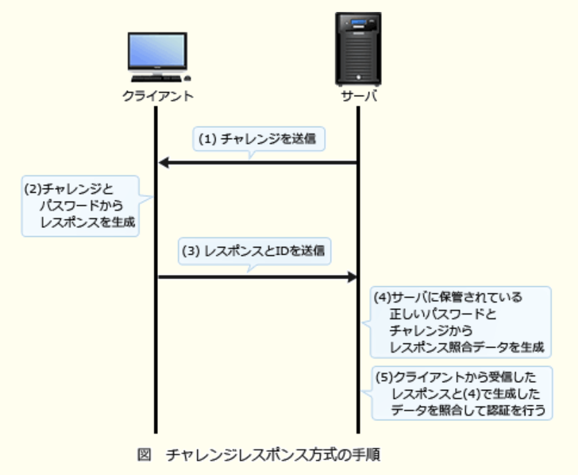
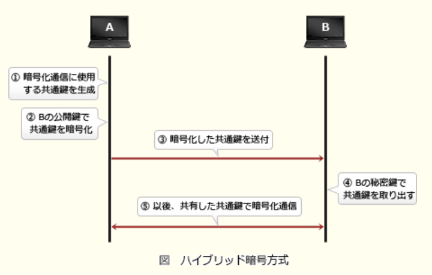

### 11.1情報セキュリティ

---
1.シャドーITに該当するもの

- A.**IT部門の許可を得ずに、従業員又は部門が業務に利用しているデバイスやクラウドサービス**  
組織の公式な手続きを経ずに、業務に使用されているIT機器や情報システムのこと。許可を得ずに業務に使用されている従業員特有のパソコン・スマートフォン・タブレットや、承認を経ずに利用されている外部サービスなどがこれに該当する。  
導入に当たり十分な検討がされておらず、組織のセキュリティマネジメントが十分でないことも多く、セキュリティリスクが存在している。このような背景から、シャドーITへの対応が盗難や情報漏洩対策上の新たな課題として浮上してきている

- IT製品やITを活用して地球環境への負荷を低減する取組  
グリーンITの説明

- 攻撃対象者のディスプレイやキータイプを物陰から盗み見て、情報を盗み出す行為  
ショルダーハッキングの説明

- ネットワーク上のコンピュータに侵入する準備として、侵入対象の弱点を探るために組織や所属する従業員などの情報を収集すること  
フットプリンティングの説明

---
2.暗号方式に関する記述で適切なもの

- A.**共通鍵暗号方式では、暗号化及び復号に同一の鍵を使用する**  
錠をかける・開けるので同じ鍵を使用する、玄関のドアのようなイメージ

- AESは公開鍵暗号方式、RSAは共通鍵暗号方式の一種である  
ASEは共通鍵暗号方式、RSAは公開鍵暗号方式

- 公開鍵暗号方式を通信内容の秘匿に使用する場合は、暗号化に使用する鍵を秘密にして、復号に使用する鍵を公開する  
複合鍵は厳重に管理し、暗号化鍵は公開する

- デジタル署名に公開鍵暗号方式が使用されることはなく、共通鍵暗号方式が使用される  
公開鍵暗号方式を応用した技術。暗号化通信とは異なり、送信者が秘密鍵で暗号化したデータを、受信者が公開鍵で複合して検証することで、正当な送信者から送信されたデータであることを確認できる

---
3.XML署名を利用することでできることできること

- A.**XML文書全体に対する単一の署名だけではなく、文書の一部に対して署名を付与する部分署名や多重署名などの複雑な要件に対応する**  
XML文書にデジタル署名を埋め込んで改ざんを検知する技術。任意のデータファイルに対する署名の他にも、指定したエレメントなどのXML文書の一部に対しても署名を付与することが可能。  
`Detached Signature`  
`署名要素と署名対象要素が独立している`場合の署名形式。署名対象が別のファイルである場合や同じXML文書内でも要素の親子関係がないときなどに使う  
`Enveloped Signature`  
`署名要素が署名対象要素の子要素である`場合の署名形式。対象文書の中に署名が格納される  
`Enveloping Signature`  
`署名要素が署名対象要素の親要素である`場合の署名形式。署名の中に対象文書が格納される

- TLSにおいて、HTTP通信の暗号化及び署名の付与に利用することによって、通信経路上でのXMLファイルの盗聴を防止する  
HTTP通信の盗聴防止はTLSによって実現されている

- XMLとJavaScriptがもつ非同期のHTTP通信機能を使い、Webページの内容を動的に書き換えた上で署名を付与することによって、対話型のWebページを作成する  
Ajaxに関する記述

- 隠したい署名データを画像データの中に埋め込むことによって、署名の存在自体を外から判別できなくする  
ステガノグラフィに関する記述

---
4.オープンリダイレクトを悪用した攻撃に該当するもの

- A.**Webサイトにアクセスすると自動的に他のWebサイトに遷移する機能を悪用し、攻撃者が指定した偽のWebサイトに誘導する**  
URLパラメータやフォームデータなどの外部パラメータによって指定されたWebページに遷移するようにしているWebアプリケーションが、実装不備により、無制限にURLを受け入れてしまう状態。攻撃者がこの脆弱性を悪用することで、利用者は気付かないうちに信頼できるWebサイトに誘導されてしまい、誘導した先でフィッシングなどの被害に遭う危険がある

- HTMLメールのリンクを悪用し、HTMLメールに、正規のWebサイトとは異なる偽のWebサイトのURLをリンク先に指定し、利用者がリンクをクリックすることによって、偽のWebサイトに誘導する  
表撃型攻撃メール、フィッシングの例。HTMLでは、表示上のURLと実際のリンク先URLを異なるものにすることができるのを悪用した攻撃

- インターネット上の不特定多数のホストからDNSリクエストを受け付けて応答するDNSキャッシュサーバを悪用し、攻撃対象のWebサーバに大量のDNSのレスポンスを送り付け、リソースを枯渇させる  
DNSアンプ(リフレクタ)攻撃の説明

- 設定の不備によって、正規の利用者以外からの電子メールやWebサイトへのアクセス要求を受け付けるプロキシを悪用し、送信元を偽った迷惑メールの送信を行う  
踏み台攻撃の説明

---
5.発信者がメッセージのハッシュ値からデジタル署名のを生成するのに使う鍵

- A.**発信者の秘密鍵**  
1.送信者は、平文をハッシュ関数で圧縮したメッセージダイジェストを`送信者(自分)の秘密鍵`で暗号化し、平文と一緒に送信する  
2.受信者は、受信したメッセージダイジェストを`送信者(相手)の公開鍵`で複合し、受信した平文をハッシュ関数で圧縮したものと比較する  
3.1つの平文からハッシュ関数によって生成されるメッセージダイジェストは常に同じになるため、送信者から送られてきたメッセージダイジェストと、受信側でハッシュ化したメッセージダイジェストが同じなら、通信内容が改ざんされていないことが証明される

---
6.メッセージが改ざんされていないかどうか確認するために、そのメッセージからブロック暗号を用いて生成することができるもの

- A.**メッセージ認証符号**(*Message Authentication Code* : MAC)  
通信内容の改ざんの有無を検証し、完全性を保証するために通信データから生成される固定長のビット列のこと。生成には共通鍵暗号方式やハッシュ関数が用いられる。  
送信者はメッセージからMACを生成し、メッセージとともに送信する。  
送信者はメッセージからMACを生成し、メッセージとともに送信する。受信者は受け取ったメッセージから送信者と同様の方法でMACを生成し、受け取ったMACと自分が生成したMACを比較する。メッセージ・鍵・アルゴリズムが同じであれば生成されるMACは同じなので、一致すれば破損や改ざんがないと判断できる

- PKI(*Public Key Infrastructure*)  
公開鍵基盤のこと。公開鍵の正当性を第三者が保証する一連の仕組み

- パリティビット  
伝送時のデータ誤りを検出するために付加される検査用ビットのこと。送信するデータの一定長をビット列ごとに1ビットの検査ビットを付加し、受信側では受信データと検査ビットを照合することで誤りを検出する

- ルート証明書  
ルートCSが発行した証明書。デジタル証明書は、ルートCAを最上位とする上位CAが下位CAを認証して証明書を発行するという階層構造になっている。デジタル証明書の検証ではこの階層構造を遡り、最終的にルート証明書に行き着くかどうかで正当性を判断している

---
7.Webサイトで利用されるCAPTCHAに該当するもの

- A.**人からのアクセスであることを確認できるよう、アクセスした者に応答を求め、その応答を分析する仕組み**  
人間か、コンピュータによるアクセスか判別する目的でWebサイトに組み込まれる仕組み。歪めたり一部を隠した画像から文字を判別させる方式だったが、当初ほど有効ではなくなったため、最近では複数の似た画像から指定されたものを選ぶタイプやパズル、Webページ上の行動を解析して判別するタイプのものなど、よりコンピュータによる突破が難しい方式も登場している

- 不正なSQL文をデータベースに送信しないよう、Webサーバに入力された文字列をプレースホルダに割り当ててSQL文を組み立てる仕組み  
バインド機構の説明

- 利用者が本人であることを確認できるよう、Webサイトから一定時間ごとに異なるパスワードを要求する仕組み  
ワンタイムパスワードの説明

- 利用者が本人であることを確認できるよう、乱数をWebサイト側で生成して利用者に送り、利用者側でその乱数を鍵としてパスワードを暗号化し、Webサイトに送リ返す仕組み  
チャレンジレスポンス認証の説明

---
9.リバースブルートフォース攻撃に該当するもの

- A.**パスワードを1つ選び、利用者IDとして次々に文字列を用意して総当たりにログインを試行する**  
設定できるパスワード種が少ないシステムに対しては、通常のブルートフォースよりも効率的に認証を突破できる。安易なパスワードを使用していると攻撃を受けやすくなる。また、様々な利用者IDを次々と試すので、一般的なアカウントロックの仕組みでは防御しにくいという性質を持つ

- 攻撃者が何らかの方法で事前に入手した利用者IDとパスワードの組みのリストを使用して、ログインを試行する  
パスワードリスト攻撃の説明

- 利用者ID、及びその利用者IDと同一の文字列であるパスワードの組みを次々に生成してログインを試行する  
ジョーアカウント攻撃の説明

- 利用者IDを1つ選び、パスワードとして次々に文字列を用意して総当たりにログインを試行する  
ブルートフォース(総当たり)攻撃の説明

---
10.送信者Aからの文書ファイルと、その文書ファイルのデジタル署名を受信者Bが受信した時、受信者Bができることはどれか。受信者Bは送信者Aの署名検証鍵Xを保有しており、送信者Bと第三者は送信者Aの署名生成鍵Yを知らないものとする

- A.**文書ファイルが改ざんされていないこと、及びデジタル署名が署名生成鍵Yによって生成されたことを確認できる**  
送信するデジタル文書にデジタル署名を付けると、受信側で`発信元が正当であるか`、`改ざんの有無`の2点を確認できる。ただし、改ざん部位の特定、訂正の機能は有していない。デジタル署名の生成には`送信者の秘密鍵`を使用し、受信側の検証では`送信者の公開鍵`を使用する

- デジタル署名、文書ファイル及び署名検証鍵Xを比較することによって、文書ファイルに改ざんがあった場合、その部分を判別できる  
改ざんされた部位を特定することはできない

- 文書ファイルがマルウェアに感染していないことを認証局に問い合わせて確認できる  
デジタル署名はマルウェアに感染しているか確認する仕組みではない

- 文書ファイルとデジタル署名のどちらかが改ざんされた場合、どちらが改ざんされたかを判別できる  
一致しなければ改ざんがあったことは分かるが、どちらが改ざんされたかの判別はできない

---
12.サーバへのログイン時に用いるパスワードを不正に取得しようとする攻撃とその対策の組み合わせ

- A.辞書攻撃 : **推測されにくいパスワードを設定する**  
辞書に載っている英単語、人名、パスワードによく使われる文字列などを大量に登録したリスト(辞書ファイル)を用意して、1つずつ試すことでパスワードを解読しようとする攻撃手法

- A.スニッフィング : **パスワードを暗号化して送信する**  
通信経路上を流れるパケットを盗聴して、内容からパスワードの不正取得を試みる攻撃手段

- A.ブルートフォース攻撃 : **ログインの試行回数に制限を設ける**  
パスワードとして設定可能な文字数と文字種文字種の組み合わせを全て試すことで、パスワードの不正取得を試みる攻撃手法。パスワード長が短く、使用可能な文字種が少ない場合には、この手法で破られる可能性が長くなってしまう

---
14.企業のDMZ上で1台のDNSサーバを、インターネット公開用と、社内のPC及びサーバからの名前解決の問合せに対応する社内用とで共用している。このDNSサーバが、DNSキャッシュポイズニングの被害を受けた結果、直接引き起こされ得る現象

- A.**社内の利用者が、インターネット上の特定のWebサーバにアクセスしようとすると、本来とは異なるWebサーバに誘導される**  
DNSサーバからの名前解決要求があった場合に、正当なDNS応用よりも早く、偽の名前解決情報を含んだ応答を送りつけることで、そのDNSサーバに偽のキャッシュ情報(ドメイン名 / IPアドレスの組み)を登録させる攻撃。  
社内PCは外部のサイトにアクセスしようとする際に、DMZ上のサーバに名前解決を依頼するが、汚染されたDNSサーバは、偽のキャッシュ情報をもとに本来とは異なるサイトのIPアドレスを返す。これにより、社内PCが攻撃者の指定した悪意のあるサイトへ誘導され、機密情報を盗まれるなどの被害が生じる可能性がある

- DNSサーバのハードディスク上に定義されているDNSサーバ名が書き換わり、インターネットからのDNS参照者が、DNSサーバに接続できなくなる  
DNSサーバ名の書き換えは行わない

- DNSサーバのメモリ上にワームが常駐し、DNS参照元に対して不正プログラムを送り込む  
ワームに感染させる攻撃ではない

- 社内の利用者間の電子メールについて、宛先メールアドレスが書き換えられ、送信ができなくなる  
偽のキャッシュ情報が登録されることで別のサーバに誘導され、メールの盗聴・改ざんを受ける可能性はあるが、電子メールの宛先アドレスが書き換えられることはない

---
15.パスワードに使用できる文字の種類を`M`、パスワードの文字数を`n`とする時、設定できるパスワードの理論的な総数を求める数式

- A.**Mのn乗**  
文字種の数を文字数だけ乗じた数が正しい

---
16.チャレンジレスポンス認証方式に該当するもの

- A.**利用者が入力したパスワードと、サーバから受け取ったランダムなデータとをクライアントで演算し、その結果をサーバに送信する**  
通信経路乗に固定パスワードを流さないようにすることで、盗聴によるパスワードの漏洩やリプレイアタックを防止する認証方式。  
1.サーバは、クライアントから要求があるたびに異なる乱数値(チャレンジ)を生成して保持するとともに、クライアントへ送る  
2.クライアントは、利用者が入力したパスワードと(1)でサーバから送られた"チャレンジ"から所定の方法でレスポンスを計算する  
3.クライアントは、(2)で生成した"レスポンス"と利用者が入力した利用者IDをサーバに送る  
4.サーバは、クライアントから受け取った利用者IDで利用者情報を検索して、取り出したパスワードと(1)で保持していた"チャレンジ"を用いてクライアントと同じ手順でレスポンスを生成する(レスポンス照合データ)  
5.サーバは"レスポンス照合データ"とクライアントから受け取った"レスポンス"を比較し、両者が一致すれば認証成功とする

- 固定パスワードをTLSによって暗号化し、クライアントからサーバに送信する  
チャレンジレスポンス方式では、固定パスワードとサーバから送信された乱数(チャレンジ)を組み合わせたものをハッシュ化又は暗号化してサーバに返信する

- 端末のシリアル番号を、クライアントで秘密鍵を使って暗号化してサーバに送信する  
端末のシリアル番号は送信しない。端末ごとに固有の番号を使用するといつも同じ認証データが使われることになるので、リプレイアタックを受ける可能性がある

- トークンという装置が自動的に表示する、認証のたびに異なるデータをパスワードとしてサーバに送信する  
時刻同期式ワンタイムパスワードの説明。チャレンジレスポンス方式ではトークンは不要

---
17.OpenPGPやS / MIMEにおいて用いられるハイブリッド暗号方式の特徴

- A.**公開鍵暗号方式と共通鍵暗号方式を組み合わせることによって鍵管理コストと処理性能の両立を図る**  
公開鍵暗号方式を用いて交通鍵を通信相手へ安全に配送し、以後はその共通鍵を使用して暗号化通信を行う方式。それぞれの暗号方式には以下の短所がある  
`共通鍵暗号方式` : 安全に鍵を配送するのに手間がかかり、通信相手が増えると必要な鍵数が増える  
`公開鍵暗号方式` : 暗号化・複合に要する計算量が多いため処理に時間がかかる  
ハイブリッド暗号方式は、両者を組み合わせることで、当事者間で鍵を安全に共有しつつ、低い処理負荷での暗号化・複合を可能にしている

---
18.攻撃者が用意したサーバXのIPアドレスが、A社WebサーバのFQDNに対応するIPアドレスとして、B社DNSキャッシュサーバに記憶された。これによって、意図せずサーバXに誘導されてしまう利用者はどれか。A社・B社の各従業員は自社のDNSキャッシュサーバを利用して名前解決を行う

- A.**A社WebサーバにアクセスしようとするB社従業員**  
`DNSキャッシュポイズニング`は、DNSサーバに偽のキャッシュ情報を登録させ、汚染されたDNSサーバの利用者を、攻撃者の設定した別のサイトに誘導させようとする攻撃手法。利用者の名前解決要求に対して、偽のキャッシュ情報を元にした結果が返されると、利用者は意に反して別のサイトに移動させられてしまう。  
今回は、`A社WebサーバのFQDN`という名前で、`サーバXのIPアドレス`という偽のキャッシュ情報が、B社DNSキャッシュサーバに記憶されている。そのため、A社ドメインに対する名前解決要求をB社キャッシュサーバに行うと、`サーバXのIPアドレス`が返され、攻撃者の用意したサーバXにアクセスさせられてしまう。`各従業員は自社のDNSキャッシュサーバを利用する`ため、B社キャッシュサーバを利用するのはB社従業員のみ

---
19.メッセージにRSA方式のデジタル署名を付与して2者間で送受信する。その時のデジタル署名の検証鍵と使用方法

- A.**送信者の公開鍵であり、受信者がデジタル署名からメッセージダイジェストを算出する際に使用する**  
1.送信者は、メッセージをハッシュ関数にかけてメッセージダイジェスト(ハッシュ値)を得る  
2.送信者は、メッセージダイジェストを`送信者(自分)の秘密鍵で暗号化`し、デジタル署名と平文と一緒に送信する  
3.受信者は、受信したメッセージダイジェストを`送信者(相手)の公開鍵`で複合し、メッセージダイジェストを得る  
4.受信者は、受信したメッセージを送信者と同じハッシュ関数でハッシュ化したものと、3で複合したメッセージダイジェストを比較する  
5.1つの平文からハッシュ関数によって生成されるメッセージダイジェストは常に同じになるため、送信者から送られてきたメッセージダイジェストと、受信側でハッシュ化したメッセージダイジェストが同じなら、通信内容が改ざんされていないことが証明される

---
20.情報セキュリティにおいてバックドアに該当するもの

- A.**アクセスする際にパスワード認証などの正規の手続が必要なWebサイトに、当該手続を経ないでアクセス可能なURL**  
一度不正侵入に成功したコンピュータやネットワークにいつでも際侵入できるように攻撃者によって設けられた仕掛けのことを指す。外部からの問い合わせに呼応するプログラムを潜り込ませたり、OSの設定ファイルを書き換えたりすることによって仕掛けられる。  
侵入に成功した際にサーバ上にCGIファイルなどを設置して、URLでアクセスできるようにしておけば、認証を経ずにサーバ上の様々なファイルを扱うことが可能。IDやパスワードを使って通信を制限したり、使用権を確認したりするコンピュータの機能を無許可で利用するために、コンピュータ内に仕掛けられた通信接続の機能が該当する

- インターネットに公開されているサーバのTCPポートの中からアクティブになっているポートを探して、稼働中のサービスを特定するためのツール  
ポートスキャナーの説明

- ネットワーク上の通信パケットを取得して通信内容を見るために設けられたスイッチのLANポート  
ミラーポートの説明

- プログラムが確保するメモリ領域に、領域の大きさを超える長さの文字列を入力してあふれさせ、ダウンさせる攻撃  
バッファオーバーフロー攻撃の説明

---
21.ファイルの提供者は、ファイルの作成者が作成したファイルAを受け取り、ファイルAと、ファイルAにSHA-256を適用して算出した値Bとを利用者に送信する。その時、利用者が情報セキュリティ上実現できることはどれか。利用者が受信した値Bはファイルの提供者から事前に電話で直接伝えられた値と同じであり、改ざんされていないことが確認できているものとする

- A.**ファイルAにSHA-256を適用して値を算出し、その値と値Bを比較することによって、ファイルAの内容が改ざんされていないかどうかを検証できる**  
送信側で算出したハッシュ値と受信側で算出したハッシュ値を比較することで、通信経路上でファイルが改ざんされていないかどうか確認できる

ハッシュ関数は、任意の長さのデータを入力すると固定長のビット列(ハッシュ値、メッセージダイジェスト)を返す関数で、以下の特徴を持っている  
・入力データが同じであれば、常に同じメッセージダイジェストが生成される  
・入力データが少しでも異なっていれば生成されるメッセージダイジェストは大きく異なる  
・メッセージダイジェストから元の入力データを再現することが困難である  
・異なる入力データから同じメッセージダイジェストが生成される可能性が非常に低い  
このような特徴を利用して、ハッシュ関数は通信経路での改ざんの権利やユーザ認証、デジタル署名などの場面で活用されている

- 値BにSHA-256を適用して値Bからデジタル署名を算出し、そのデジタル署名を検証することによって、ファイルAの作成者を確認できる
- 値BにSHA-256を適用して値Bからデジタル署名を算出し、そのデジタル署名を検証することによって、ファイルAの提供者がファイルAの作成者であるかどうかを確認できる  
メッセージダイジェスト(値B)からデジタル署名を生成するには、ハッシュ関数ではなく公開鍵暗号を使用しないといけない。ハッシュ関数だと利用者側で複合することができない。正しくデジタル署名を生成したとしてもファイル作成者を確認はできない

- ファイルAの内容が改ざんされていても、ファイルAにSHA-256を適用して値を算出し、その値と値Bの差分を確認することによって、ファイルAの内容のうち改ざんされている部分を修復できる  
改ざん部位の特定はできない

---
24.パスワードリスト攻撃の手口に該当するもの

- A.**複数サイトで同一の利用者IDとパスワードを使っている利用者がいる状況に着目して、不正に取得した他サイトの利用者IDとパスワードの一覧表を用いて、ログインを試行する**  
利用者側で「パスワードの使い回しを控える」、管理者側で「2段階認証を行う」「ログイン履歴を表示し、利用者に確認してもらう」などの対策が考えられる

- 辞書にある単語をパスワードに設定している利用者がいる状況に着目して、攻撃対象とする利用者IDを1つ定め、辞書にある単語やその組合せをパスワードとして、ログインを試行する  
辞書攻撃に該当する

- パスワードの文字数の上限が小さいWebサイトに対して、攻撃対象とする利用者IDを1つ定め、文字を組み合わせたパスワードを総当たりして、ログインを試行する  
ブルートフォース攻撃(総当たり攻撃)に該当する

- よく用いられるパスワードを1つ定め、文字を組み合わせた利用者IDを総当たりして、ログインを試行する  
リバースブルートフォース攻撃(逆総当たり攻撃)に該当する

---
25.メッセージ認証符号(*Message Authentication Code*)の利用目的

- A.**メッセージが改ざんされていないことを確認する**  
通信データが改ざんされていないかを受信側で検査するために、通信データから生成する固定長のコード(メッセージダイジェスト)。  
送信側は、通信データを共通鍵暗号方式またはハッシュ関数で変換したコードを送信データに付加して送信し、受信側も同一の共通鍵暗号方式またはハッシュ関数を使って受信データを変換する。変換したコードの一致を確認し、一致していれば改ざんは行われていないと判断する。  
MACの目的は改ざんの検知なのでデジタル署名と似ているが、デジタル署名は公開鍵暗号方式を応用した技術であるのに対し、MACは共通鍵暗号方式やハッシュ関数を用いた仕組み

---
26.楕円曲線暗号(*Elliptic Curve Cryptography*)の特徴

- A.**RSA暗号と比べて、短い鍵長で同レベルの安全性が実現できる**  
楕円曲線上の点の演算を用いた公開鍵暗号方式。楕円曲線によって定義された有限可換群上の離散対数問題を解く際の計算量の多さを多さを安全性の根拠とし、同じ強度を想定した場合、RSAより鍵長を短くできる利点がある。ビットコインで採用されている暗号方式。  
公開鍵暗号方式は暗号化・複合に要する研鑽量が多いため、RSAの鍵長は処理負荷の面でネックとなっている。代わりに鍵長が少なくて済む楕円曲線暗号へのニーズが高まってきている。特に組込みシステムやIoTデバイスなどの資源に制約のある環境では有効な選択肢となる

- 共通鍵暗号方式であり、暗号化や復号の処理を高速に行うことができる  
共通鍵暗号方式ではなく、公開鍵暗号方式

- 総当たりによる解読が不可能なことが、数学的に証明されている  
不可能ではない。現実的に有効な時間での解読が難しいことを安全性の根拠にしている

- データを秘匿する目的で用いる場合、復号鍵を秘密にしておく必要がない  
他の公開鍵暗号方式と同様に、暗号化通信で用いる場合には、暗号化鍵を公開し、複合鍵を秘密にする
