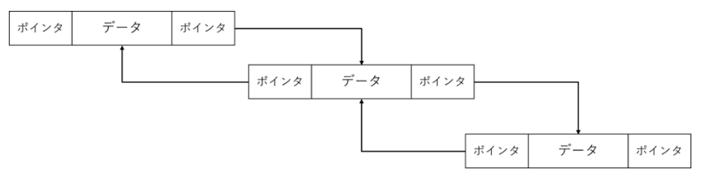
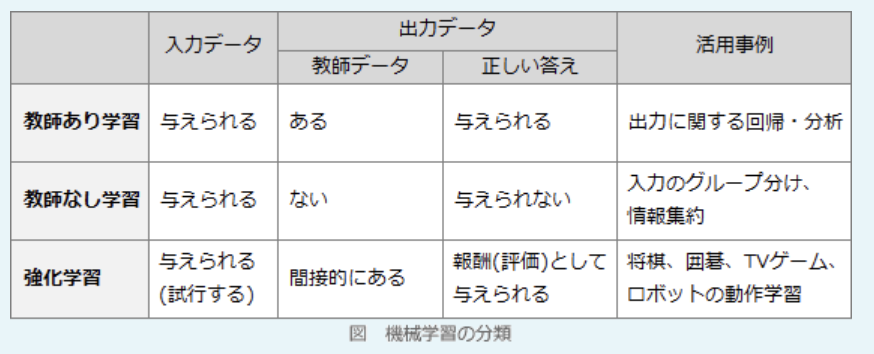

- 双方向連結リスト  
次のデータの参照先と前のデータの参照先のどちらもリスト項目に保持するリスト。単方向リストとは異なり、参照中に前の参照先に戻ることができる。ただし、その分データ量は多くなってしまう

- 教師あり学習  
訓練データとして、ラベル(正解)付きデータを使用する学習方法。入力に対する正しい出力の例を与えることで、入力と出力の関係を学習させる

- 教師なし学習  
訓練データとして、ラベルなしデータを使用する学習方法。クラスタリングなどのためにデータ構造を学習させる

- 強化学習  
正解データの代わりに、与えられた環境における個々の行動に対して得点や報酬を与える学習方法。一連の行動に対して評価値を与えることで高い得点を取るための行動、すなわち最良の行動を自律的に学習させる

---
シラバス

### `テクノロジ系`

- マルコフ過程  
次に起こる事象の確率が、現在の状態のみによって決まり、過去の振る舞いに依存しない確率過程。天気など、物理現象の時間発展に見られる

- 丸め誤差  
値の(小数点以下の)桁を省略した時に生じる、本来の値とのズレ。切り上げ・切り捨て・四捨五入などで発生する

- 打ち切り誤差  
計算を途中で止めたことで生じる、本来の値とのズレ

- 回帰分析  
結果となる数値と要因となる数値の関係を並べて、それぞれの関係を明らかにする統計的手法。単回帰であれは一次関数(直線)、重回帰であればn次関数(曲線)で表される

- 仮説検定  
ある仮説に対して、それが正しいか否かを統計学的に検証するという推計統計学の手法の1つ。「広告が商品の売上の増加と関連しているかどうか」「製品が誤差の範囲内に収まっているかどうか」などの判断に使うことが可能。反対の主張が正しいとした帰無仮説の誤りを統計的に証明することで、主張したい内容の正しさを証明できる

- 有向グラフ  
頂点と向きのついた辺からなる図形のこと。点とそれを結ぶ辺の関係のみに注目し、辺の長さや形状などの情報は与えない。

- 無向グラフ  
ノード(点)を結ぶ線に矢印を用いていないもの。枝の始点と終点がどちらであるかを気にしない。因果関係を仮定しない、変数間の関連性を示す場合に用いられることがある

- 待ち行列理論  
ヒトやモノが滞ったりしながら流れていく状況に注目したモデル。順番待ちの列を数学的に(確率の考え方を用いて)記述したもの。窓口数や作業員数などに対応した、客の平均的な待ち時間などを計算することができる

- 動的計画法  
「問題をいくつかの簡単で小さな問題に分割する」「計算結果を表に記録する」「同じ問題は表から計算結果を参照する」という3つの特徴のアルゴリズム。「ナップサック問題」「音声認識パターンマッチング問題」など様々な現場における最適化問題まで、広範囲の問題を解くのに役立つ

- オートマトン(*automaton*)  
計算機の構造や動作を抽象化した数理モデルの1つで、内部に固有の状態と、状態を変化させる規則の集合を持ち、外部からの入力に応じてある状態から別の状態へ遷移するもの

- 形式言語  
ヒトの思考過程をモデル化し、文字・記号で表した体系。自然言語に対立する概念

- プログラム言語  
人がコンピュータを思い通りに動かすために必要となる、コンピュータ専用の言語。CPUが判別できるのは0と1のみ

- 手続型言語  
プログラミング言語の分類の1つで、コンピュータが実行すべき命令や手続を順に実行していくことでプログラムを構成する言語。命令は1つずつ記述して並べることもできるが、多くの言語では複数の命令をひとまとまりの手続を連結し、外部から1つの大きな命令のように呼び出せるようにする機構を備えている。言語によりプロシージャ、サブルーチン、関数、メソッドなどと呼ばれる

- オブジェクト指向言語  
オブジェクト指向を基準として設計したもので、プログラムを簡単に記述することができるプログラミング言語のこと。これによって人間の思考に近い表現が可能になった

- スクリプト言語  
プログラミング言語のうち、比較的容易に記述や実行ができるものを指す。記述が自然言語に近いが、厳密な定義は存在しない

- 共通言語基盤(*CLI*)  
*Microsoft*がソフトウェア開発のために定めた国際規格。異なる言語で記述されたプログラムを相互運用する方法を定めるルールが定義されている。そのため、同一のコンピュータ上で実行できるソフトウェアを、様々なプログラミング言語を使って開発できる

- プロセッサ(*processor*)  
処理装置、処理機、加工業者などの意味をもつ英単語。ITの分野では一定の手順に基づいてデータを変換・演算・加工する機能を持った装置やソフトウェア、システムなどを指す。

- メモリ(*memory*)  
RAM(*Random Access Memory*)とも呼ばれ、CPUとストレージの間でやり取りするデータやプログラムを一時的に保存する記憶装置。メモリの容量が大きいほど、CPUがメモリ上のデータを一度に高速処理できるため、パソコンの総合的なパフォーマンスが向上し、快適な操作が可能。メモリ上の情報は頻繁に書き換えが生じるため、高速でアクセスできる一方、ストレージほど多くのデータを保存できない。電源をオフにすると保存されたデータは消えてしまう

- ストレージ  
補助記憶装置とも呼ばれ、データを長期間記憶しておくためのデバイス。HDDや、SSD、USBメモリや外付けHDDなどが挙げられる
